# 01 | 为什么要学习数据结构和算法？

王争 2018-09-21

你是不是觉得数据结构和算法，跟操作系统、计算机网络一样，是脱离实际工作的知识？可能除了面试，这辈子也用不着？

尽管计算机相关专业的同学在大学都学过这门课程，甚至很多培训机构也会培训这方面的知识，但是据我了解，很多程序员对数据结构和算法依旧一窍不通。还有一些人也只听说过数组、链表、快排这些最最基本的数据结构和算法，稍微复杂一点的就完全没概念。

当然，也有很多人说，自己实际工作中根本用不到数据结构和算法。所以，就算不懂这块知识，只要 Java API、开发框架用得熟练，照样可以把代码写得“飞”起来。事实真的是这样吗？

今天我们就来详细聊一聊，为什么要学习数据结构和算法。

## 想要通关大厂面试，千万别让数据结构和算法拖了后腿

很多大公司，比如 BAT、Google、Facebook，面试的时候都喜欢考算法、让人现场写代码。有些人虽然技术不错，但每次去面试都会“跪”在算法上，很是可惜。那你有没有想过，为什么这些大公司都喜欢考算法呢？

校招的时候，参加面试的学生通常没有实际项目经验，公司只能考察他们的基础知识是否牢固。社招就更不用说了，越是厉害的公司，越是注重考察数据结构与算法这类基础知识。相比短期能力，他们更看中你的长期潜力。

你可能要说了，我不懂数据结构与算法，照样找到了好工作啊。那我是不是就不用学数据结构和算法呢？当然不是，你别忘了，**我们学任何知识都是为了“用”的，是为了解决实际工作问题的**，学习数据结构和算法自然也不例外。

## 业务开发工程师，你真的愿意做一辈子 CRUD boy 吗？

如果你是一名业务开发工程师，你可能要说，我整天就是做数据库 CRUD（增删改查），哪里用得到数据结构和算法啊？

是的，对于大部分业务开发来说，我们平时可能更多的是利用已经封装好的现成的接口、类库来堆砌、翻译业务逻辑，很少需要自己实现数据结构和算法。但是，**不需要自己实现，并不代表什么都不需要了解**。

如果不知道这些类库背后的原理，不懂得时间、空间复杂度分析，你如何能用好、用对它们？存储某个业务数据的时候，你如何知道应该用 ArrayList，还是 Linked List 呢？调用了某个函数之后，你又该如何评估代码的性能和资源的消耗呢？

作为业务开发，我们会用到各种框架、中间件和底层系统，比如 Spring、RPC 框架、消息中间件、Redis 等等。**在这些基础框架中，一般都揉和了很多基础数据结构和算法的设计思想。**

比如，我们常用的 Key-Value 数据库 Redis 中，里面的有序集合是用什么数据结构来实现的呢？为什么要用跳表来实现呢？为什么不用二叉树呢？

如果你能弄明白这些底层原理，你就能更好地使用它们。即便出现问题，也很容易就能定位。因此，**掌握数据结构和算法，不管对于阅读框架源码，还是理解其背后的设计思想，都是非常有用的。**

在平时的工作中，数据结构和算法的应用到处可见。我来举一个你非常熟悉的例子：如何实时地统计业务接口的 99% 响应时间？

你可能最先想到，每次查询时，从小到大排序所有的响应时间，如果总共有 1200 个数据，那第 1188 个数据就是 99% 的响应时间。很显然，每次用这个方法查询的话都要排序，效率是非常低的。但是，如果你知道“堆”这个数据结构，用两个堆可以非常高效地解决这个问题。

## 基础架构研发工程师，写出达到开源水平的框架才是你的目标！

现在互联网上的技术文章、架构分享、开源项目满天飞，照猫画虎做一套基础框架并不难。我就拿 RPC 框架举例。

不同的公司、不同的人做出的 RPC 框架，架构设计思路都差不多，最后实现的功能也都差不多。但是有的人做出来的框架，Bug 很多、性能一般、扩展性也不好，只能在自己公司仅有的几个项目里面用一下。而有的人做的框架可以开源到 GitHub 上给很多人用，甚至被 Apache 收录。为什么会有这么大的差距呢？

我觉得，高手之间的竞争其实就在细节。这些细节包括：你用的算法是不是够优化，数据存取的效率是不是够高，内存是不是够节省等等。这些累积起来，决定了一个框架是不是优秀。所以，如果你还不懂数据结构和算法，没听说过大 O 复杂度分析，不知道怎么分析代码的时间复杂度和空间复杂度，那肯定说不过去了，赶紧来补一补吧！

## 对编程还有追求？不想被行业淘汰？那就不要只会写凑合能用的代码！

何为编程能力强？是代码的可读性好、健壮？还是扩展性好？我觉得没法列，也列不全。但是，在我看来，**性能好坏起码是其中一个非常重要的评判标准**。但是，如果你连代码的时间复杂度、空间复杂度都不知道怎么分析，怎么写出高性能的代码呢？

你可能会说，我在小公司工作，用户量很少，需要处理的数据量也很少，开发中不需要考虑那么多性能的问题，完成功能就可以，用什么数据结构和算法，差别根本不大。但是你真的想“十年如一日”地做一样的工作吗？

经常有人说，程序员 35 岁之后很容易陷入瓶颈，被行业淘汰，我觉得原因其实就在此。有的人写代码的时候，从来都不考虑非功能性的需求，只是完成功能，凑合能用就好；做事情的时候，也从来没有长远规划，只把眼前事情做好就满足了。

我曾经面试过很多大龄候选人，简历能写十几页，经历的项目有几十个，但是细看下来，每个项目都是重复地堆砌业务逻辑而已，完全没有难度递进，看不出有能力提升。久而久之，十年的积累可能跟一年的积累没有任何区别。这样的人，怎么不会被行业淘汰呢？

如果你在一家成熟的公司，或者 BAT 这样的大公司，面对的是千万级甚至亿级的用户，开发的是 TB、PB 级别数据的处理系统。性能几乎是开发过程中时刻都要考虑的问题。一个简单的 ArrayList、Linked  List 的选择问题，就可能会产生成千上万倍的性能差别。这个时候，数据结构和算法的意义就完全凸显出来了。

其实，我觉得，数据结构和算法这个东西，如果你不去学，可能真的这辈子都用不到，也感受不到它的好。但是一旦掌握，你就会常常被它的强大威力所折服。之前你可能需要费很大劲儿来优化的代码，需要花很多心思来设计的架构，用了数据结构和算法之后，很容易就可以解决了。

## 内容小结

我们学习数据结构和算法，并不是为了死记硬背几个知识点。我们的目的是建立时间复杂度、空间复杂度意识，写出高质量的代码，能够设计基础架构，提升编程技能，训练逻辑思维，积攒人生经验，以此获得工作回报，实现你的价值，完善你的人生。

所以，不管你是业务开发工程师，还是基础架构工程师；不管你是初入职场的初级工程师，还是工作多年的资深架构师，又或者是想转人工智能、区块链这些热门领域的程序员，数据结构与算法作为计算机的基础知识、核心知识，都是必须要掌握的。

**掌握了数据结构与算法，你看待问题的深度，解决问题的角度就会完全不一样**。因为这样的你，就像是站在巨人的肩膀上，拿着生存利器行走世界。数据结构与算法，会为你的编程之路，甚至人生之路打开一扇通往新世界的大门。

## 课后思考

你为什么要学习数据结构和算法呢？在过去的软件开发中，数据结构和算法在哪些地方帮到了你？

欢迎留言和我分享，我会第一时间给你反馈。如果你的朋友也在学习算法这个问题上犹豫不决，欢迎你把这篇文章分享给他！

# 02 | 如何抓住重点，系统高效地学习数据结构与算法？

你是否曾跟我一样，因为看不懂数据结构和算法，而一度怀疑是自己太笨？实际上，很多人在第一次接触这门课时，都会有这种感觉，觉得数据结构和算法很抽象，晦涩难懂，宛如天书。正是这个原因，让很多初学者对这门课望而却步。

我个人觉得，其实真正的原因是你**没有找到好的学习方法**，**没有抓住学习的重点**。实际上，数据结构和算法的东西并不多，常用的、基础的知识点更是屈指可数。只要掌握了正确的学习方法，学起来并没有看上去那么难，更不需要什么高智商、厚底子。

还记得大学里每次考前老师都要划重点吗？今天，我就给你划划我们这门课的重点，再告诉你一些我总结的学习小窍门。相信有了这些之后，你学起来就会有的放矢、事半功倍了。

## 什么是数据结构？什么是算法？

大部分数据结构和算法教材，在开篇都会给这两个概念下一个明确的定义。但是，这些定义都很抽象，对理解这两个概念并没有实质性的帮助，反倒会让你陷入死抠定义的误区。毕竟，我们现在学习，并不是为了考试，所以，概念背得再牢，不会用也就没什么用。

**虽然我们说没必要深挖严格的定义，但是这并不等于不需要理解概念。** 下面我就从广义和狭义两个层面，来帮你理解数据结构与算法这两个概念。

从广义上讲，数据结构就是指一组数据的存储结构。算法就是操作数据的一组方法。

图书馆储藏书籍你肯定见过吧？为了方便查找，图书管理员一般会将书籍分门别类进行“存储”。按照一定规律编号，就是书籍这种“数据”的存储结构。

那我们如何来查找一本书呢？有很多种办法，你当然可以一本一本地找，也可以先根据书籍类别的编号，是人文，还是科学、计算机，来定位书架，然后再依次查找。笼统地说，这些查找方法都是算法。

从狭义上讲，也就是我们专栏要讲的，是指某些著名的数据结构和算法，比如队列、栈、堆、二分查找、动态规划等。这些都是前人智慧的结晶，我们可以直接拿来用。我们要讲的这些经典数据结构和算法，都是前人从很多实际操作场景中抽象出来的，经过非常多的求证和检验，可以高效地帮助我们解决很多实际的开发问题。

那数据结构和算法有什么关系呢？为什么大部分书都把这两个东西放到一块儿来讲呢？

这是因为，数据结构和算法是相辅相成的。**数据结构是为算法服务的，算法要作用在特定的数据结构之上。** 因此，我们无法孤立数据结构来讲算法，也无法孤立算法来讲数据结构。

比如，因为数组具有随机访问的特点，常用的二分查找算法需要用数组来存储数据。但如果我们选择链表这种数据结构，二分查找算法就无法工作了，因为链表并不支持随机访问。

数据结构是静态的，它只是组织数据的一种方式。如果不在它的基础上操作、构建算法，孤立存在的数据结构就是没用的。

现在你对数据结构与算法是不是有了比较清晰的理解了呢？有了这些储备，下面我们来看看，究竟该怎么学数据结构与算法。

## 学习这个专栏需要什么基础？

看到数据结构和算法里的“算法”两个字，很多人就会联想到“数学”，觉得算法会涉及到很多深奥的数学知识。那我数学基础不是很好，学起来会不会很吃力啊？

数据结构和算法课程确实会涉及一些数学方面的推理、证明，尤其是在分析某个算法的时间、空间复杂度的时候，但是这个你完全不需要担心。

这个专栏不会像《算法导论》那样，里面有非常复杂的数学证明和推理。我会由浅入深，从概念到应用，一点一点给你解释清楚。你只要有高中数学水平，就完全可以学习。

当然，我希望你最好有些编程基础，如果有项目经验就更好了。这样我给你讲数据结构和算法如何提高效率、如何节省存储空间，你就会有很直观的感受。因为，对于每个概念和实现过程，我都会从实际场景出发，不仅教你“**是什么**”，还会教你“**为什么**”，并且告诉你遇到同类型问题应该“**怎么做**”。

## 学习的重点在什么地方？

提到数据结构和算法，很多人就很头疼，因为这里面的内容实在是太多了。这里，我就帮你梳理一下，应该先学什么，后学什么。你可以对照看看，你属于哪个阶段，然后有针对性地进行学习。

想要学习数据结构与算法，**首先要掌握一个数据结构与算法中最重要的概念——复杂度分析。**

这个概念究竟有多重要呢？可以这么说，它几乎占了数据结构和算法这门课的半壁江山，是数据结构和算法学习的精髓。

数据结构和算法解决的是如何更省、更快地存储和处理数据的问题，因此，我们就需要一个考量效率和资源消耗的方法，这就是复杂度分析方法。所以，如果你只掌握了数据结构和算法的特点、用法，但是没有学会复杂度分析，那就相当于只知道操作口诀，而没掌握心法。只有把心法了然于胸，才能做到无招胜有招！

所以，复杂度分析这个内容，我会用很大篇幅给你讲透。你也一定要花大力气来啃，必须要拿下，并且要搞得非常熟练。否则，后面的数据结构和算法也很难学好。

搞定复杂度分析，下面就要进入**数据结构与算法的正文内容**了。

为了让你对数据结构和算法能有个全面的认识，我画了一张图，里面几乎涵盖了所有数据结构和算法书籍中都会讲到的知识点。

（图谱内容较多，建议长按保存后浏览）

但是，作为初学者，或者一个非算法工程师来说，你并不需要掌握图里面的所有知识点。很多高级的数据结构与算法，比如二分图、最大流等，这些在我们平常的开发中很少会用到。所以，你暂时可以不用看。我还是那句话，咱们学习要学会找重点。如果不分重点地学习，眉毛胡子一把抓，学起来肯定会比较吃力。

所以，结合我自己的学习心得，还有这些年的面试、开发经验，我总结了 **20 个最常用的、最基础**数据结构与算法，**不管是应付面试还是工作需要，只要集中精力逐一攻克这 20 个知识点就足够了。**

这里面有 10 个数据结构：数组、链表、栈、队列、散列表、二叉树、堆、跳表、图、Trie 树；10 个算法：递归、排序、二分查找、搜索、哈希算法、贪心算法、分治算法、回溯算法、动态规划、字符串匹配算法。

掌握了这些基础的数据结构和算法，再学更加复杂的数据结构和算法，就会非常容易、非常快。

在学习数据结构和算法的过程中，你也要注意，不要只是死记硬背，不要为了学习而学习，而是**要学习它的“来历”“自身的特点”“适合解决的问题”以及“实际的应用场景”**。对于每一种数据结构或算法，我都会从这几个方面进行详细讲解。只要你掌握了我每节课里讲的内容，就能在开发中灵活应用。

学习数据结构和算法的过程，是非常好的思维训练的过程，所以，千万不要被动地记忆，要多辩证地思考，多问为什么。如果你一直这么坚持做，你会发现，等你学完之后，写代码的时候就会不由自主地考虑到很多性能方面的事情，时间复杂度、空间复杂度非常高的垃圾代码出现的次数就会越来越少。你的编程内功就真正得到了修炼。

## 一些可以让你事半功倍的学习技巧

前面我给你划了学习的重点，也讲了学习这门课需要具备的基础。作为一个过来人，现在我就给你分享一下，专栏学习的一些技巧。掌握了这些技巧，可以让你化被动为主动，学起来更加轻松，更加有动力！

### 1. 边学边练，适度刷题

“边学边练”这一招非常有用。建议你每周花 1～2 个小时的时间，集中把这周的三节内容涉及的数据结构和算法，全都自己写出来，用代码实现一遍。这样一定会比单纯地看或者听的效果要好很多！

有面试需求的同学，可能会问了，那我还要不要去刷题呢？

我个人的观点是**可以“适度”刷题，但一定不要浪费太多时间在刷题上**。我们**学习的目的还是掌握，然后应用**。除非你要面试 Google、Facebook 这样的公司，它们的算法题目非常非常难，必须大量刷题，才能在短期内提升应试正确率。如果是应对国内公司的技术面试，即便是 BAT 这样的公司，你只要彻底掌握这个专栏的内容，就足以应对。

### 2. 多问、多思考、多互动

**学习最好的方法是，找到几个人一起学习，一块儿讨论切磋，有问题及时寻求老师答疑。** 但是，离开大学之后，既没有同学也没有老师，这个条件就比较难具备了。

不过，这也就是咱们专栏学习的优势。专栏里有很多跟你一样的学习者。你可以多在留言区写下自己的疑问、思考和总结，也可以经常看看别人的留言，和他们进行互动。

除此之外，如果你有疑问，你可以随时在留言区给我留言，我只要有空就会及时回复你。你不要担心问的问题太小白。因为我初学的时候，也常常会被一些小白问题困扰。不懂一点都不丢人，只要你勇敢提出来，我们一起解决了就可以了。

我也会力争每节课都最大限度地给你讲透，帮你扫除知识盲点，而你要做的就是，避免一知半解，要想尽一切办法去搞懂我讲的所有内容。

### 3. 打怪升级学习法

**学习的过程中，我们碰到最大的问题就是，坚持不下来。** 是的，很多基础课程学起来都非常枯燥。为此，我自己总结了一套“打怪升级学习法”。

游戏你肯定玩过吧？为什么很多看起来非常简单又没有乐趣的游戏，你会玩得不亦乐乎呢？这是因为，当你努力打到一定级别之后，每天看着自己的经验值、战斗力在慢慢提高，那种每天都在一点一点成长的成就感就不由自主地产生了。

所以，**我们在枯燥的学习过程中，也可以给自己设立一个切实可行的目标**，就像打怪升级一样。

比如，针对这个专栏，你就可以设立这样一个目标：每节课后的思考题都认真思考，并且回复到留言区。当你看到很多人给你点赞之后，你就会为了每次都能发一个漂亮的留言，而更加认真地学习。

当然，还有很多其他的目标，比如，每节课后都写一篇学习笔记或者学习心得；或者你还可以每节课都找一下我讲得不对、不合理的地方……诸如此类，你可以总结一个适合你的“打怪升级攻略”。

如果你能这样学习一段时间，不仅能收获到知识，你还会有意想不到的成就感。因为，这其实帮你改掉了一点学习的坏习惯。这个习惯一旦改掉了，你的人生也会变得不一样。

### 4. 知识需要沉淀，不要想试图一下子掌握所有

在学习的过程中，一定会碰到“拦路虎”。如果哪个知识点没有怎么学懂，不要着急，这是正常的。因为，想听一遍、看一遍就把所有知识掌握，这肯定是不可能的。**学习****知识的****过程是反复迭代、不断沉淀的过程。**

如果碰到“拦路虎”，你可以尽情地在留言区问我，也可以先沉淀一下，过几天再重新学一遍。所谓，书读百遍其义自见，我觉得是很有道理的！

我讲的这些学习方法，不仅仅针对咱们这一个课程的学习，其实完全适用任何知识的学习过程。你可以通过这个专栏的学习，实践一下这些方法。如果效果不错，再推广到之后的学习过程中。

## 内容小结

今天，我带你划了划数据结构和算法的学习重点，复杂度分析，以及 10 个数据结构和 10 个算法。

这些内容是我根据平时的学习和工作、面试经验积累，精心筛选出来的。只要掌握这些内容，应付日常的面试、工作，基本不会有问题。

除此之外，我还给你分享了我总结的一些学习技巧，比如边学边练、多问、多思考，还有两个比较通用的学习方法，打怪升级法和沉淀法。掌握了这些学习技巧，可以让你学习过程中事半功倍。所以，你一定要好好实践哦！

## 课后思考

今天的内容是一个准备课，从下节开始，我们就要正式开始学习精心筛选出的这 20 个数据结构和算法了。所以，今天给你布置一个任务，对照我上面讲的“打怪升级学习法”，请思考一下你自己学习这个专栏的方法，让我们一起在留言区立下 Flag，相互鼓励！

另外，你在之前学习数据结构和算法的过程中，遇到过什么样的困难或者疑惑吗？

欢迎留言和我分享，我会第一时间给你反馈。

# 03 | 复杂度分析（上）：如何分析、统计算法的执行效率和资源消耗？

我们都知道，数据结构和算法本身解决的是“快”和“省”的问题，即如何让代码运行得更快，如何让代码更省存储空间。所以，执行效率是算法一个非常重要的考量指标。那如何来衡量你编写的算法代码的执行效率呢？这里就要用到我们今天要讲的内容：时间、空间复杂度分析。

其实，只要讲到数据结构与算法，就一定离不开时间、空间复杂度分析。而且，我个人认为，**复杂度分析是整个算法学习的精髓，只要掌握了它，数据结构和算法的内容基本上就掌握了一半**。

复杂度分析实在太重要了，因此我准备用两节内容来讲。希望你学完这个内容之后，无论在任何场景下，面对任何代码的复杂度分析，你都能做到“庖丁解牛”般游刃有余。

## 为什么需要复杂度分析？

你可能会有些疑惑，我把代码跑一遍，通过统计、监控，就能得到算法执行的时间和占用的内存大小。为什么还要做时间、空间复杂度分析呢？这种分析方法能比我实实在在跑一遍得到的数据更准确吗？

首先，我可以肯定地说，你这种评估算法执行效率的方法是正确的。很多数据结构和算法书籍还给这种方法起了一个名字，叫**事后统计法**。但是，这种统计方法有非常大的局限性。

**1. 测试结果非常依赖测试环境**

测试环境中硬件的不同会对测试结果有很大的影响。比如，我们拿同样一段代码，分别用 Intel Core i9 处理器和 Intel Core i3 处理器来运行，不用说，i9 处理器要比 i3 处理器执行的速度快很多。还有，比如原本在这台机器上 a 代码执行的速度比 b 代码要快，等我们换到另一台机器上时，可能会有截然相反的结果。

**2. 测试结果受数据规模的影响很大**

后面我们会讲排序算法，我们先拿它举个例子。对同一个排序算法，待排序数据的有序度不一样，排序的执行时间就会有很大的差别。极端情况下，如果数据已经是有序的，那排序算法不需要做任何操作，执行时间就会非常短。除此之外，如果测试数据规模太小，测试结果可能无法真实地反映算法的性能。比如，对于小规模的数据排序，插入排序可能反倒会比快速排序要快！

所以，**我们需要一个不用具体的测试数据来测试，就可以粗略地估计算法的执行效率的方法**。这就是我们今天要讲的时间、空间复杂度分析方法。

## 大 O 复杂度表示法

算法的执行效率，粗略地讲，就是算法代码执行的时间。但是，如何在不运行代码的情况下，用“肉眼”得到一段代码的执行时间呢？

这里有段非常简单的代码，求 1,2,3…n 的累加和。现在，我就带你一块来估算一下这段代码的执行时间。

 int cal(int n) {

   int sum = 0;

   int i = 1;

   for (; i <= n; ++i) {

​     sum = sum + i;

   }

   return sum;

 }

从 CPU 的角度来看，这段代码的每一行都执行着类似的操作：**读数据**-**运算**-**写数据**。尽管每行代码对应的 CPU 执行的个数、执行的时间都不一样，但是，我们这里只是粗略估计，所以可以假设每行代码执行的时间都一样，为 unit_time。在这个假设的基础之上，这段代码的总执行时间是多少呢？

第 2、3 行代码分别需要 1 个 unit_time 的执行时间，第 4、5 行都运行了 n 遍，所以需要 2n*unit_time 的执行时间，所以这段代码总的执行时间就是 (2n+2)*unit_time。可以看出来，**所有代码的执行时间 T(n) 与每行代码的执行次数成正比**。

按照这个分析思路，我们再来看这段代码。

 int cal(int n) {

   int sum = 0;

   int i = 1;

   int j = 1;

   for (; i <= n; ++i) {

​     j = 1;

​     for (; j <= n; ++j) {

​       sum = sum +  i * j;

​     }

   }

 }

我们依旧假设每个语句的执行时间是 unit_time。那这段代码的总执行时间 T(n) 是多少呢？

第 2、3、4 行代码，每行都需要 1 个 unit_time 的执行时间，第 5、6 行代码循环执行了 n 遍，需要 2n * unit_time 的执行时间，第 7、8 行代码循环执行了 n2遍，所以需要 2n2 * unit_time 的执行时间。所以，整段代码总的执行时间 T(n) = (2n2+2n+3)*unit_time。

尽管我们不知道 unit_time 的具体值，但是通过这两段代码执行时间的推导过程，我们可以得到一个非常重要的规律，那就是，**所有代码的执行时间 T(n) 与每行代码的执行次数 n 成正比**。

我们可以把这个规律总结成一个公式。注意，大 O 就要登场了！

我来具体解释一下这个公式。其中，T(n) 我们已经讲过了，它表示代码执行的时间；n 表示数据规模的大小；f(n) 表示每行代码执行的次数总和。因为这是一个公式，所以用 f(n) 来表示。公式中的 O，表示代码的执行时间 T(n) 与 f(n) 表达式成正比。

所以，第一个例子中的 T(n) = O(2n+2)，第二个例子中的 T(n) = O(2n2+2n+3)。这就是**大 O 时间复杂度表示法**。大 O 时间复杂度实际上并不具体表示代码真正的执行时间，而是表示**代码执行时间随数据规模增长的变化趋势**，所以，也叫作**渐进时间复杂度**（asymptotic time complexity），简称**时间复杂度**。

当 n 很大时，你可以把它想象成 10000、100000。而公式中的低阶、常量、系数三部分并不左右增长趋势，所以都可以忽略。我们只需要记录一个最大量级就可以了，如果用大 O 表示法表示刚讲的那两段代码的时间复杂度，就可以记为：T(n) = O(n)； T(n) = O(n2)。

## 时间复杂度分析

前面介绍了大 O 时间复杂度的由来和表示方法。现在我们来看下，如何分析一段代码的时间复杂度？我这儿有三个比较实用的方法可以分享给你。

**1. 只关注循环执行次数最多的一段代码**

我刚才说了，大 O 这种复杂度表示方法只是表示一种变化趋势。我们通常会忽略掉公式中的常量、低阶、系数，只需要记录一个最大阶的量级就可以了。所以，**我们在分析一个算法、一段代码的时间复杂度的时候，也只关注循环执行次数最多的那一段代码就可以了**。这段核心代码执行次数的 n 的量级，就是整段要分析代码的时间复杂度。

为了便于你理解，我还是拿前面的例子来说明。

 int cal(int n) {

   int sum = 0;

   int i = 1;

   for (; i <= n; ++i) {

​     sum = sum + i;

   }

   return sum;

 }

其中第 2、3 行代码都是常量级的执行时间，与 n 的大小无关，所以对于复杂度并没有影响。循环执行次数最多的是第 4、5 行代码，所以这块代码要重点分析。前面我们也讲过，这两行代码被执行了 n 次，所以总的时间复杂度就是 O(n)。

**2. 加法法则：总复杂度等于量级最大的那段代码的复杂度**

我这里还有一段代码。你可以先试着分析一下，然后再往下看跟我的分析思路是否一样。

int cal(int n) {

   int sum_1 = 0;

   int p = 1;

   for (; p < 100; ++p) {

​     sum_1 = sum_1 + p;

   }

   int sum_2 = 0;

   int q = 1;

   for (; q < n; ++q) {

​     sum_2 = sum_2 + q;

   }

 

   int sum_3 = 0;

   int i = 1;

   int j = 1;

   for (; i <= n; ++i) {

​     j = 1; 

​     for (; j <= n; ++j) {

​       sum_3 = sum_3 +  i * j;

​     }

   }

 

   return sum_1 + sum_2 + sum_3;

 }

这个代码分为三部分，分别是求 sum_1、sum_2、sum_3。我们可以分别分析每一部分的时间复杂度，然后把它们放到一块儿，再取一个量级最大的作为整段代码的复杂度。

第一段的时间复杂度是多少呢？这段代码循环执行了 100 次，所以是一个常量的执行时间，跟 n 的规模无关。

这里我要再强调一下，即便这段代码循环 10000 次、100000 次，只要是一个已知的数，跟 n 无关，照样也是常量级的执行时间。当 n 无限大的时候，就可以忽略。尽管对代码的执行时间会有很大影响，但是回到时间复杂度的概念来说，它表示的是一个算法执行效率与数据规模增长的变化趋势，所以不管常量的执行时间多大，我们都可以忽略掉。因为它本身对增长趋势并没有影响。

那第二段代码和第三段代码的时间复杂度是多少呢？答案是 O(n) 和 O(n2)，你应该能容易就分析出来，我就不啰嗦了。

综合这三段代码的时间复杂度，我们取其中最大的量级。所以，整段代码的时间复杂度就为 O(n2)。也就是说：**总的时间复杂度****就****等于量级最大的那段代码的时间复杂度**。那我们将这个规律抽象成公式就是：

如果 T1(n)=O(f(n))，T2(n)=O(g(n))；那么 T(n)=T1(n)+T2(n)=max(O(f(n)), O(g(n))) =O(max(f(n), g(n))).

**3. 乘法法则：嵌套代码的复杂度等于嵌套内外代码复杂度的乘积**

我刚讲了一个复杂度分析中的加法法则，这儿还有一个**乘法法则**。类比一下，你应该能“猜到”公式是什么样子的吧？

如果 T1(n)=O(f(n))，T2(n)=O(g(n))；那么 T(n)=T1(n)*T2(n)=O(f(n))*O(g(n))=O(f(n)*g(n)).

也就是说，假设 T1(n) = O(n)，T2(n) = O(n2)，则 T1(n) * T2(n) = O(n3)。落实到具体的代码上，我们可以把乘法法则看成是**嵌套循环**，我举个例子给你解释一下。

int cal(int n) {

   int ret = 0; 

   int i = 1;

   for (; i < n; ++i) {

​     ret = ret + f(i);

   } 

 } 

 

 int f(int n) {

  int sum = 0;

  int i = 1;

  for (; i < n; ++i) {

​    sum = sum + i;

  } 

  return sum;

 }

我们单独看 cal() 函数。假设 f() 只是一个普通的操作，那第 4～6 行的时间复杂度就是，T1(n) = O(n)。但 f() 函数本身不是一个简单的操作，它的时间复杂度是 T2(n) = O(n)，所以，整个 cal() 函数的时间复杂度就是，T(n) = T1(n) * T2(n) = O(n*n) = O(n2)。

我刚刚讲了三种复杂度的分析技巧。不过，你并不用刻意去记忆。实际上，复杂度分析这个东西关键在于“熟练”。你只要多看案例，多分析，就能做到“无招胜有招”。

## 几种常见时间复杂度实例分析

虽然代码千差万别，但是常见的复杂度量级并不多。我稍微总结了一下，这些复杂度量级几乎涵盖了你今后可以接触的所有代码的复杂度量级。

对于刚罗列的复杂度量级，我们可以粗略地分为两类，**多项式量级**和**非多项式量级**。其中，非多项式量级只有两个：O(2n) 和 O(n!)。

我们把时间复杂度为非多项式量级的算法问题叫作 NP（Non-Deterministic Polynomial，非确定多项式）问题。

当数据规模 n 越来越大时，非多项式量级算法的执行时间会急剧增加，求解问题的执行时间会无限增长。所以，非多项式时间复杂度的算法其实是非常低效的算法。因此，关于 NP 时间复杂度我就不展开讲了。我们主要来看几种常见的**多项式时间复杂度**。

**1. O(1)**

首先你必须明确一个概念，O(1) 只是常量级时间复杂度的一种表示方法，并不是指只执行了一行代码。比如这段代码，即便有 3 行，它的时间复杂度也是 O(1），而不是 O(3)。

 int i = 8;

 int j = 6;

 int sum = i + j;

我稍微总结一下，只要代码的执行时间不随 n 的增大而增长，这样代码的时间复杂度我们都记作 O(1)。或者说，**一般****情况下****，只要算法中不存在循环语句、递归语句，即使有成千上万行的代码，其时间复杂度也是Ο(1)**。

**2.  O(logn)、O(nlogn)**

对数阶时间复杂度非常常见，同时也是最难分析的一种时间复杂度。我通过一个例子来说明一下。

 i=1;

 while (i <= n)  {

   i = i * 2;

 }

根据我们前面讲的复杂度分析方法，第三行代码是循环执行次数最多的。所以，我们只要能计算出这行代码被执行了多少次，就能知道整段代码的时间复杂度。

从代码中可以看出，变量 i 的值从 1 开始取，每循环一次就乘以 2。当大于 n 时，循环结束。还记得我们高中学过的等比数列吗？实际上，变量 i 的取值就是一个等比数列。如果我把它一个一个列出来，就应该是这个样子的：

所以，我们只要知道 x 值是多少，就知道这行代码执行的次数了。通过 2x=n 求解 x 这个问题我们想高中应该就学过了，我就不多说了。x=log2n，所以，这段代码的时间复杂度就是 O(log2n)。

现在，我把代码稍微改下，你再看看，这段代码的时间复杂度是多少？

 i=1;

 while (i <= n)  {

   i = i * 3;

 }

根据我刚刚讲的思路，很简单就能看出来，这段代码的时间复杂度为 O(log3n)。

实际上，不管是以 2 为底、以 3 为底，还是以 10 为底，我们可以把所有对数阶的时间复杂度都记为 O(logn)。为什么呢？

我们知道，对数之间是可以互相转换的，log3n 就等于 log32 * log2n，所以 O(log3n) = O(C *  log2n)，其中 C=log32 是一个常量。基于我们前面的一个理论：**在采用大 O 标记复杂度的时候，可以忽略系数，即 O(Cf(n)) = O(f(n))**。所以，O(log2n) 就等于 O(log3n)。因此，在对数阶时间复杂度的表示方法里，我们忽略对数的“底”，统一表示为 O(logn)。

如果你理解了我前面讲的 O(logn)，那 O(nlogn) 就很容易理解了。还记得我们刚讲的乘法法则吗？如果一段代码的时间复杂度是 O(logn)，我们循环执行 n 遍，时间复杂度就是 O(nlogn) 了。而且，O(nlogn) 也是一种非常常见的算法时间复杂度。比如，归并排序、快速排序的时间复杂度都是 O(nlogn)。

**3.  O(m+n)、O(m\*n)**

我们再来讲一种跟前面都不一样的时间复杂度，代码的复杂度**由两个数据的规模**来决定。老规矩，先看代码！

int cal(int m, int n) {

  int sum_1 = 0;

  int i = 1;

  for (; i < m; ++i) {

​    sum_1 = sum_1 + i;

  }

  int sum_2 = 0;

  int j = 1;

  for (; j < n; ++j) {

​    sum_2 = sum_2 + j;

  }

  return sum_1 + sum_2;

}

从代码中可以看出，m 和 n 是表示两个数据规模。我们无法事先评估 m 和 n 谁的量级大，所以我们在表示复杂度的时候，就不能简单地利用加法法则，省略掉其中一个。所以，上面代码的时间复杂度就是 O(m+n)。

针对这种情况，原来的加法法则就不正确了，我们需要将加法规则改为：T1(m) + T2(n) = O(f(m) + g(n))。但是乘法法则继续有效：T1(m)*T2(n) = O(f(m) * f(n))。

## 空间复杂度分析

前面，咱们花了很长时间讲大 O 表示法和时间复杂度分析，理解了前面讲的内容，空间复杂度分析方法学起来就非常简单了。

前面我讲过，时间复杂度的全称是**渐进时间复杂度**，**表示算法的执行时间与数据规模之间的增长关系**。类比一下，空间复杂度全称就是**渐进空间复杂度**（asymptotic space complexity），**表示算法的存储空间与数据规模之间的增长关系**。

我还是拿具体的例子来给你说明。（这段代码有点“傻”，一般没人会这么写，我这么写只是为了方便给你解释。）

void print(int n) {

  int i = 0;

  int[] a = new int[n];

  for (i; i <n; ++i) {

​    a[i] = i * i;

  }

  for (i = n-1; i >= 0; --i) {

​    print out a[i]

  }

}

跟时间复杂度分析一样，我们可以看到，第 2 行代码中，我们申请了一个空间存储变量 i，但是它是常量阶的，跟数据规模 n 没有关系，所以我们可以忽略。第 3 行申请了一个大小为 n 的 int 类型数组，除此之外，剩下的代码都没有占用更多的空间，所以整段代码的空间复杂度就是 O(n)。

我们常见的空间复杂度就是 O(1)、O(n)、O(n2 )，像 O(logn)、O(nlogn) 这样的对数阶复杂度平时都用不到。而且，空间复杂度分析比时间复杂度分析要简单很多。所以，对于空间复杂度，掌握刚我说的这些内容已经足够了。

## 内容小结

基础复杂度分析的知识到此就讲完了，我们来总结一下。

复杂度也叫渐进复杂度，包括时间复杂度和空间复杂度，用来分析算法执行效率与数据规模之间的增长关系，可以粗略地表示，越高阶复杂度的算法，执行效率越低。常见的复杂度并不多，从低阶到高阶有：O(1)、O(logn)、O(n)、O(nlogn)、O(n2 )。等你学完整个专栏之后，你就会发现几乎所有的数据结构和算法的复杂度都跑不出这几个。

**复杂度分析并不难，关键在于多练。** 之后讲后面的内容时，我还会带你详细地分析每一种数据结构和算法的时间、空间复杂度。只要跟着我的思路学习、练习，你很快就能和我一样，每次看到代码的时候，简单的一眼就能看出其复杂度，难的稍微分析一下就能得出答案。

## 课后思考

有人说，我们项目之前都会进行性能测试，再做代码的时间复杂度、空间复杂度分析，是不是多此一举呢？而且，每段代码都分析一下时间复杂度、空间复杂度，是不是很浪费时间呢？你怎么看待这个问题呢？

# 04 | 复杂度分析（下）：浅析最好、最坏、平均、均摊时间复杂度

上一节，我们讲了复杂度的大 O 表示法和几个分析技巧，还举了一些常见复杂度分析的例子，比如 O(1)、O(logn)、O(n)、O(nlogn) 复杂度分析。掌握了这些内容，对于复杂度分析这个知识点，你已经可以到及格线了。但是，我想你肯定不会满足于此。

今天我会继续给你讲四个复杂度分析方面的知识点，**最好情况时间复杂度**（best case time complexity）、**最坏情况时间复杂度**（worst case time complexity）、**平均情况时间复杂度**（average case time complexity）、**均摊时间复杂度**（amortized time complexity）。如果这几个概念你都能掌握，那对你来说，复杂度分析这部分内容就没什么大问题了。

## 最好、最坏情况时间复杂度

上一节我举的分析复杂度的例子都很简单，今天我们来看一个稍微复杂的。你可以用我上节教你的分析技巧，自己先试着分析一下这段代码的时间复杂度。

// n表示数组array的长度

int find(int[] array, int n, int x) {

  int i = 0;

  int pos = -1;

  for (; i < n; ++i) {

​    if (array[i] == x) pos = i;

  }

  return pos;

}

你应该可以看出来，这段代码要实现的功能是，在一个无序的数组（array）中，查找变量 x 出现的位置。如果没有找到，就返回 -1。按照上节课讲的分析方法，这段代码的复杂度是 O(n)，其中，n 代表数组的长度。

我们在数组中查找一个数据，并不需要每次都把整个数组都遍历一遍，因为有可能中途找到就可以提前结束循环了。但是，这段代码写得不够高效。我们可以这样优化一下这段查找代码。

// n表示数组array的长度

int find(int[] array, int n, int x) {

  int i = 0;

  int pos = -1;

  for (; i < n; ++i) {

​    if (array[i] == x) {

​       pos = i;

​       break;

​    }

  }

  return pos;

}

这个时候，问题就来了。我们优化完之后，这段代码的时间复杂度还是 O(n) 吗？很显然，咱们上一节讲的分析方法，解决不了这个问题。

因为，要查找的变量 x 可能出现在数组的任意位置。如果数组中第一个元素正好是要查找的变量 x，那就不需要继续遍历剩下的 n-1 个数据了，那时间复杂度就是 O(1)。但如果数组中不存在变量 x，那我们就需要把整个数组都遍历一遍，时间复杂度就成了 O(n)。所以，不同的情况下，这段代码的时间复杂度是不一样的。

为了表示代码在不同情况下的不同时间复杂度，我们需要引入三个概念：最好情况时间复杂度、最坏情况时间复杂度和平均情况时间复杂度。

顾名思义，**最好情况时间复杂度就是，在最理想的情况下，执行这段代码的时间复杂度**。就像我们刚刚讲到的，在最理想的情况下，要查找的变量 x 正好是数组的第一个元素，这个时候对应的时间复杂度就是最好情况时间复杂度。

同理，**最坏情况时间复杂度就是，在最糟糕的情况下，执行这段代码的时间复杂度**。就像刚举的那个例子，如果数组中没有要查找的变量 x，我们需要把整个数组都遍历一遍才行，所以这种最糟糕情况下对应的时间复杂度就是最坏情况时间复杂度。

## 平均情况时间复杂度

我们都知道，最好情况时间复杂度和最坏情况时间复杂度对应的都是极端情况下的代码复杂度，发生的概率其实并不大。为了更好地表示平均情况下的复杂度，我们需要引入另一个概念：平均情况时间复杂度，后面我简称为平均时间复杂度。

平均时间复杂度又该怎么分析呢？我还是借助刚才查找变量 x 的例子来给你解释。

要查找的变量 x 在数组中的位置，有 n+1 种情况：**在数组的 0～n-1 位置中**和**不在数组中**。我们把每种情况下，查找需要遍历的元素个数累加起来，然后再除以 n+1，就可以得到需要遍历的元素个数的平均值，即：

我们知道，时间复杂度的大 O 标记法中，可以省略掉系数、低阶、常量，所以，咱们把刚刚这个公式简化之后，得到的平均时间复杂度就是 O(n)。

这个结论虽然是正确的，但是计算过程稍微有点儿问题。究竟是什么问题呢？我们刚讲的这 n+1 种情况，出现的概率并不是一样的。我带你具体分析一下。（这里要稍微用到一点儿概率论的知识，不过非常简单，你不用担心。）

我们知道，要查找的变量 x，要么在数组里，要么就不在数组里。这两种情况对应的概率统计起来很麻烦，为了方便你理解，我们假设在数组中与不在数组中的概率都为 1/2。另外，要查找的数据出现在 0～n-1 这 n 个位置的概率也是一样的，为 1/n。所以，根据概率乘法法则，要查找的数据出现在 0～n-1 中任意位置的概率就是 1/(2n)。

因此，前面的推导过程中存在的最大问题就是，没有将各种情况发生的概率考虑进去。如果我们把每种情况发生的概率也考虑进去，那平均时间复杂度的计算过程就变成了这样：

这个值就是概率论中的**加权平均值**，也叫作**期望值**，所以平均时间复杂度的全称应该叫**加权平均时间复杂度**或者**期望时间复杂度**。

引入概率之后，前面那段代码的加权平均值为 (3n+1)/4。用大 O 表示法来表示，去掉系数和常量，这段代码的加权平均时间复杂度仍然是 O(n)。

你可能会说，平均时间复杂度分析好复杂啊，还要涉及概率论的知识。实际上，在大多数情况下，我们并不需要区分最好、最坏、平均情况时间复杂度三种情况。像我们上一节课举的那些例子那样，很多时候，我们使用一个复杂度就可以满足需求了。只有同一块代码在不同的情况下，时间复杂度有量级的差距，我们才会使用这三种复杂度表示法来区分。

## 均摊时间复杂度

到此为止，你应该已经掌握了算法复杂度分析的大部分内容了。下面我要给你讲一个更加高级的概念，均摊时间复杂度，以及它对应的分析方法，摊还分析（或者叫平摊分析）。

均摊时间复杂度，听起来跟平均时间复杂度有点儿像。对于初学者来说，这两个概念确实非常容易弄混。我前面说了，大部分情况下，我们并不需要区分最好、最坏、平均三种复杂度。平均复杂度只在某些特殊情况下才会用到，而均摊时间复杂度应用的场景比它更加特殊、更加有限。

老规矩，我还是借助一个具体的例子来帮助你理解。（当然，这个例子只是我为了方便讲解想出来的，实际上没人会这么写。）

 // array表示一个长度为n的数组

 // 代码中的array.length就等于n

 int[] array = new int[n];

 int count = 0;

 

 void insert(int val) {

​    if (count == array.length) {

​       int sum = 0;

​       for (int i = 0; i < array.length; ++i) {

​          sum = sum + array[i];

​       }

​       array[0] = sum;

​       count = 1;

​    }

​    array[count] = val;

​    ++count;

 }

我先来解释一下这段代码。这段代码实现了一个往数组中插入数据的功能。当数组满了之后，也就是代码中的 count == array.length 时，我们用 for 循环遍历数组求和，并清空数组，将求和之后的 sum 值放到数组的第一个位置，然后再将新的数据插入。但如果数组一开始就有空闲空间，则直接将数据插入数组。

那这段代码的时间复杂度是多少呢？你可以先用我们刚讲到的三种时间复杂度的分析方法来分析一下。

最理想的情况下，数组中有空闲空间，我们只需要将数据插入到数组下标为 count 的位置就可以了，所以最好情况时间复杂度为 O(1)。最坏的情况下，数组中没有空闲空间了，我们需要先做一次数组的遍历求和，然后再将数据插入，所以最坏情况时间复杂度为 O(n)。

那平均时间复杂度是多少呢？答案是 O(1)。我们还是可以通过前面讲的概率论的方法来分析。

假设数组的长度是 n，根据数据插入的位置的不同，我们可以分为 n 种情况，每种情况的时间复杂度是 O(1)。除此之外，还有一种“额外”的情况，就是在数组没有空闲空间时插入一个数据，这个时候的时间复杂度是 O(n)。而且，这 n+1 种情况发生的概率一样，都是 1/(n+1)。所以，根据加权平均的计算方法，我们求得的平均时间复杂度就是：

至此为止，前面的最好、最坏、平均时间复杂度的计算，理解起来应该都没有问题。但是这个例子里的平均复杂度分析其实并不需要这么复杂，不需要引入概率论的知识。这是为什么呢？我们先来对比一下这个 insert() 的例子和前面那个 find() 的例子，你就会发现这两者有很大差别。

首先，find() 函数在极端情况下，复杂度才为 O(1)。但 insert() 在大部分情况下，时间复杂度都为 O(1)。只有个别情况下，复杂度才比较高，为 O(n)。这是 insert()**第一个**区别于 find() 的地方。

我们再来看**第二个**不同的地方。对于 insert() 函数来说，O(1) 时间复杂度的插入和 O(n) 时间复杂度的插入，出现的频率是非常有规律的，而且有一定的前后时序关系，一般都是一个 O(n) 插入之后，紧跟着 n-1 个 O(1) 的插入操作，循环往复。

所以，针对这样一种特殊场景的复杂度分析，我们并不需要像之前讲平均复杂度分析方法那样，找出所有的输入情况及相应的发生概率，然后再计算加权平均值。

针对这种特殊的场景，我们引入了一种更加简单的分析方法：**摊还分析法**，通过摊还分析得到的时间复杂度我们起了一个名字，叫**均摊时间复杂度**。

那究竟如何使用摊还分析法来分析算法的均摊时间复杂度呢？

我们还是继续看在数组中插入数据的这个例子。每一次 O(n) 的插入操作，都会跟着 n-1 次 O(1) 的插入操作，所以把耗时多的那次操作均摊到接下来的 n-1 次耗时少的操作上，均摊下来，这一组连续的操作的均摊时间复杂度就是 O(1)。这就是均摊分析的大致思路。你都理解了吗？

均摊时间复杂度和摊还分析应用场景比较特殊，所以我们并不会经常用到。为了方便你理解、记忆，我这里简单总结一下它们的应用场景。如果你遇到了，知道是怎么回事儿就行了。

对一个数据结构进行一组连续操作中，大部分情况下时间复杂度都很低，只有个别情况下时间复杂度比较高，而且这些操作之间存在前后连贯的时序关系，这个时候，我们就可以将这一组操作放在一块儿分析，看是否能将较高时间复杂度那次操作的耗时，平摊到其他那些时间复杂度比较低的操作上。而且，在能够应用均摊时间复杂度分析的场合，一般均摊时间复杂度就等于最好情况时间复杂度。

尽管很多数据结构和算法书籍都花了很大力气来区分平均时间复杂度和均摊时间复杂度，但其实我个人认为，**均摊时间复杂度就是一种特殊的平均时间复杂度**，我们没必要花太多精力去区分它们。你最应该掌握的是它的分析方法，摊还分析。至于分析出来的结果是叫平均还是叫均摊，这只是个说法，并不重要。

## 内容小结

今天我们学习了几个复杂度分析相关的概念，分别有：最好情况时间复杂度、最坏情况时间复杂度、平均情况时间复杂度、均摊时间复杂度。之所以引入这几个复杂度概念，是因为，同一段代码，在不同输入的情况下，复杂度量级有可能是不一样的。

在引入这几个概念之后，我们可以更加全面地表示一段代码的执行效率。而且，这几个概念理解起来都不难。最好、最坏情况下的时间复杂度分析起来比较简单，但平均、均摊两个复杂度分析相对比较复杂。如果你觉得理解得还不是很深入，不用担心，在后续具体的数据结构和算法学习中，我们可以继续慢慢实践！

## 课后思考

我们今天学的几个复杂度分析方法，你都掌握了吗？你可以用今天学习的知识，来分析一下下面这个 add() 函数的时间复杂度。

// 全局变量，大小为10的数组array，长度len，下标i。

int array[] = new int[10]; 

int len = 10;

int i = 0;

// 往数组中添加一个元素

void add(int element) {

   if (i >= len) { // 数组空间不够了

​     // 重新申请一个2倍大小的数组空间

​     int new_array[] = new int[len*2];

​     // 把原来array数组中的数据依次copy到new_array

​     for (int j = 0; j < len; ++j) {

​       new_array[j] = array[j];

​     }

​     // new_array复制给array，array现在大小就是2倍len了

​     array = new_array;

​     len = 2 * len;

   }

   // 将element放到下标为i的位置，下标i加一

   array[i] = element;

   ++i;

}

欢迎留言和我分享，我会第一时间给你反馈。

# 05 | 数组：为什么很多编程语言中数组都从0开始编号？

王争 2018-10-01



00:00

[1.0x**](javascript:;)

讲述：修阳 大小：7.19M 时长：15:41

提到数组，我想你肯定不陌生，甚至还会自信地说，它很简单啊。

是的，在每一种编程语言中，基本都会有数组这种数据类型。不过，它不仅仅是一种编程语言中的数据类型，还是一种最基础的数据结构。尽管数组看起来非常基础、简单，但是我估计很多人都并没有理解这个基础数据结构的精髓。

在大部分编程语言中，数组都是从 0 开始编号的，但你是否下意识地想过，**为什么数组要从 0 开始编号，而不是从 1 开始呢？** 从 1 开始不是更符合人类的思维习惯吗？

你可以带着这个问题来学习接下来的内容。

## 如何实现随机访问？

什么是数组？我估计你心中已经有了答案。不过，我还是想用专业的话来给你做下解释。**数组（Array）是一种线性表数据结构。它用一组连续的内存空间，来存储一组具有相同类型的数据。**

这个定义里有几个关键词，理解了这几个关键词，我想你就能彻底掌握数组的概念了。下面就从我的角度分别给你“点拨”一下。

第一是**线性表**（Linear List）。顾名思义，线性表就是数据排成像一条线一样的结构。每个线性表上的数据最多只有前和后两个方向。其实除了数组，链表、队列、栈等也是线性表结构。

而与它相对立的概念是**非线性表**，比如二叉树、堆、图等。之所以叫非线性，是因为，在非线性表中，数据之间并不是简单的前后关系。

第二个是**连续的内存空间和相同类型的数据**。正是因为这两个限制，它才有了一个堪称“杀手锏”的特性：“随机访问”。但有利就有弊，这两个限制也让数组的很多操作变得非常低效，比如要想在数组中删除、插入一个数据，为了保证连续性，就需要做大量的数据搬移工作。

说到数据的访问，那你知道数组是如何实现根据下标随机访问数组元素的吗？

我们拿一个长度为 10 的 int 类型的数组 int[] a = new int[10]来举例。在我画的这个图中，计算机给数组 a[10]，分配了一块连续内存空间 1000～1039，其中，内存块的首地址为 base_address = 1000。

我们知道，计算机会给每个内存单元分配一个地址，计算机通过地址来访问内存中的数据。当计算机需要随机访问数组中的某个元素时，它会首先通过下面的寻址公式，计算出该元素存储的内存地址：

a[i]_address = base_address + i * data_type_size

其中 data_type_size 表示数组中每个元素的大小。我们举的这个例子里，数组中存储的是 int 类型数据，所以 data_type_size 就为 4 个字节。这个公式非常简单，我就不多做解释了。

这里我要特别纠正一个“错误”。我在面试的时候，常常会问数组和链表的区别，很多人都回答说，“链表适合插入、删除，时间复杂度 O(1)；数组适合查找，查找时间复杂度为 O(1)”。

实际上，这种表述是不准确的。数组是适合查找操作，但是查找的时间复杂度并不为 O(1)。即便是排好序的数组，你用二分查找，时间复杂度也是 O(logn)。所以，正确的表述应该是，数组支持随机访问，根据下标随机访问的时间复杂度为 O(1)。

## 低效的“插入”和“删除”

前面概念部分我们提到，数组为了保持内存数据的连续性，会导致插入、删除这两个操作比较低效。现在我们就来详细说一下，究竟为什么会导致低效？又有哪些改进方法呢？

我们先来看**插入操作**。

假设数组的长度为 n，现在，如果我们需要将一个数据插入到数组中的第 k 个位置。为了把第 k 个位置腾出来，给新来的数据，我们需要将第 k～n 这部分的元素都顺序地往后挪一位。那插入操作的时间复杂度是多少呢？你可以自己先试着分析一下。

如果在数组的末尾插入元素，那就不需要移动数据了，这时的时间复杂度为 O(1)。但如果在数组的开头插入元素，那所有的数据都需要依次往后移动一位，所以最坏时间复杂度是 O(n)。 因为我们在每个位置插入元素的概率是一样的，所以平均情况时间复杂度为 (1+2+…n)/n=O(n)。

如果数组中的数据是有序的，我们在某个位置插入一个新的元素时，就必须按照刚才的方法搬移 k 之后的数据。但是，如果数组中存储的数据并没有任何规律，数组只是被当作一个存储数据的集合。在这种情况下，如果要将某个数据插入到第 k 个位置，为了避免大规模的数据搬移，我们还有一个简单的办法就是，直接将第 k 位的数据搬移到数组元素的最后，把新的元素直接放入第 k 个位置。

为了更好地理解，我们举一个例子。假设数组 a[10]中存储了如下 5 个元素：a，b，c，d，e。

我们现在需要将元素 x 插入到第 3 个位置。我们只需要将 c 放入到 a[5]，将 a[2]赋值为 x 即可。最后，数组中的元素如下： a，b，x，d，e，c。

利用这种处理技巧，在特定场景下，在第 k 个位置插入一个元素的时间复杂度就会降为 O(1)。这个处理思想在快排中也会用到，我会在排序那一节具体来讲，这里就说到这儿。

我们再来看**删除操作**。

跟插入数据类似，如果我们要删除第 k 个位置的数据，为了内存的连续性，也需要搬移数据，不然中间就会出现空洞，内存就不连续了。

和插入类似，如果删除数组末尾的数据，则最好情况时间复杂度为 O(1)；如果删除开头的数据，则最坏情况时间复杂度为 O(n)；平均情况时间复杂度也为 O(n)。

实际上，在某些特殊场景下，我们并不一定非得追求数组中数据的连续性。如果我们将多次删除操作集中在一起执行，删除的效率是不是会提高很多呢？

我们继续来看例子。数组 a[10]中存储了 8 个元素：a，b，c，d，e，f，g，h。现在，我们要依次删除 a，b，c 三个元素。

为了避免 d，e，f，g，h 这几个数据会被搬移三次，我们可以先记录下已经删除的数据。每次的删除操作并不是真正地搬移数据，只是记录数据已经被删除。当数组没有更多空间存储数据时，我们再触发执行一次真正的删除操作，这样就大大减少了删除操作导致的数据搬移。

如果你了解 JVM，你会发现，这不就是 JVM 标记清除垃圾回收算法的核心思想吗？没错，数据结构和算法的魅力就在于此，**很多时候我们并不是要去死记硬背某个数据结构或者算法，而是要学习它背后的思想和处理技巧，这些东西才是最有价值的**。如果你细心留意，不管是在软件开发还是架构设计中，总能找到某些算法和数据结构的影子。

## 警惕数组的访问越界问题

了解了数组的几个基本操作后，我们来聊聊数组访问越界的问题。

首先，我请你来分析一下这段 C 语言代码的运行结果：

int main(int argc, char* argv[]){

​    int i = 0;

​    int arr[3] = {0};

​    for(; i<=3; i++){

​        arr[i] = 0;

​        printf("hello world\n");

​    }

​    return 0;

}

你发现问题了吗？这段代码的运行结果并非是打印三行“hello word”，而是会无限打印“hello world”，这是为什么呢？

因为，数组大小为 3，a[0]，a[1]，a[2]，而我们的代码因为书写错误，导致 for 循环的结束条件错写为了 i<=3 而非 i<3，所以当 i=3 时，数组 a[3]访问越界。

我们知道，在 C 语言中，只要不是访问受限的内存，所有的内存空间都是可以自由访问的。根据我们前面讲的数组寻址公式，a[3]也会被定位到某块不属于数组的内存地址上，而这个地址正好是存储变量 i 的内存地址，那么 a[3]=0 就相当于 i=0，所以就会导致代码无限循环。

数组越界在 C 语言中是一种未决行为，并没有规定数组访问越界时编译器应该如何处理。因为，访问数组的本质就是访问一段连续内存，只要数组通过偏移计算得到的内存地址是可用的，那么程序就可能不会报任何错误。

这种情况下，一般都会出现莫名其妙的逻辑错误，就像我们刚刚举的那个例子，debug 的难度非常的大。而且，很多计算机病毒也正是利用到了代码中的数组越界可以访问非法地址的漏洞，来攻击系统，所以写代码的时候一定要警惕数组越界。

但并非所有的语言都像 C 一样，把数组越界检查的工作丢给程序员来做，像 Java 本身就会做越界检查，比如下面这几行 Java 代码，就会抛出 java.lang.ArrayIndexOutOfBoundsException。

int[] a = new int[3];

a[3] = 10;

## 容器能否完全替代数组？

针对数组类型，很多语言都提供了容器类，比如 Java 中的 ArrayList、C++ STL 中的 vector。在项目开发中，什么时候适合用数组，什么时候适合用容器呢？

这里我拿 Java 语言来举例。如果你是 Java 工程师，几乎天天都在用 ArrayList，对它应该非常熟悉。那它与数组相比，到底有哪些优势呢？

我个人觉得，ArrayList 最大的优势就是**可以将很多数组操作的细节封装起来**。比如前面提到的数组插入、删除数据时需要搬移其他数据等。另外，它还有一个优势，就是**支持动态扩容**。

数组本身在定义的时候需要预先指定大小，因为需要分配连续的内存空间。如果我们申请了大小为 10 的数组，当第 11 个数据需要存储到数组中时，我们就需要重新分配一块更大的空间，将原来的数据复制过去，然后再将新的数据插入。

如果使用 ArrayList，我们就完全不需要关心底层的扩容逻辑，ArrayList 已经帮我们实现好了。每次存储空间不够的时候，它都会将空间自动扩容为 1.5 倍大小。

不过，这里需要注意一点，因为扩容操作涉及内存申请和数据搬移，是比较耗时的。所以，如果事先能确定需要存储的数据大小，最好**在创建 ArrayList 的时候事先指定数据大小**。

比如我们要从数据库中取出 10000 条数据放入 ArrayList。我们看下面这几行代码，你会发现，相比之下，事先指定数据大小可以省掉很多次内存申请和数据搬移操作。

ArrayList<User> users = new ArrayList(10000);

for (int i = 0; i < 10000; ++i) {

  users.add(xxx);

}

作为高级语言编程者，是不是数组就无用武之地了呢？当然不是，有些时候，用数组会更合适些，我总结了几点自己的经验。

1.Java ArrayList 无法存储基本类型，比如 int、long，需要封装为 Integer、Long 类，而 Autoboxing、Unboxing 则有一定的性能消耗，所以如果特别关注性能，或者希望使用基本类型，就可以选用数组。

\2. 如果数据大小事先已知，并且对数据的操作非常简单，用不到 ArrayList 提供的大部分方法，也可以直接使用数组。

\3. 还有一个是我个人的喜好，当要表示多维数组时，用数组往往会更加直观。比如 Object[][] array；而用容器的话则需要这样定义：ArrayList<ArrayList<object> > array。

我总结一下，对于业务开发，直接使用容器就足够了，省时省力。毕竟损耗一丢丢性能，完全不会影响到系统整体的性能。但如果你是做一些非常底层的开发，比如开发网络框架，性能的优化需要做到极致，这个时候数组就会优于容器，成为首选。

## 解答开篇

现在我们来思考开篇的问题：为什么大多数编程语言中，数组要从 0 开始编号，而不是从 1 开始呢？

从数组存储的内存模型上来看，“下标”最确切的定义应该是“偏移（offset）”。前面也讲到，如果用 a 来表示数组的首地址，a[0]就是偏移为 0 的位置，也就是首地址，a[k]就表示偏移 k 个 type_size 的位置，所以计算 a[k]的内存地址只需要用这个公式：

a[k]_address = base_address + k * type_size

但是，如果数组从 1 开始计数，那我们计算数组元素 a[k]的内存地址就会变为：

a[k]_address = base_address + (k-1)*type_size

对比两个公式，我们不难发现，从 1 开始编号，每次随机访问数组元素都多了一次减法运算，对于 CPU 来说，就是多了一次减法指令。

数组作为非常基础的数据结构，通过下标随机访问数组元素又是其非常基础的编程操作，效率的优化就要尽可能做到极致。所以为了减少一次减法操作，数组选择了从 0 开始编号，而不是从 1 开始。

不过我认为，上面解释得再多其实都算不上压倒性的证明，说数组起始编号非 0 开始不可。所以我觉得最主要的原因可能是历史原因。

C 语言设计者用 0 开始计数数组下标，之后的 Java、JavaScript 等高级语言都效仿了 C 语言，或者说，为了在一定程度上减少 C 语言程序员学习 Java 的学习成本，因此继续沿用了从 0 开始计数的习惯。实际上，很多语言中数组也并不是从 0 开始计数的，比如 Matlab。甚至还有一些语言支持负数下标，比如 Python。

## 内容小结

我们今天学习了数组。它可以说是最基础、最简单的数据结构了。数组用一块连续的内存空间，来存储相同类型的一组数据，最大的特点就是支持随机访问，但插入、删除操作也因此变得比较低效，平均情况时间复杂度为 O(n)。在平时的业务开发中，我们可以直接使用编程语言提供的容器类，但是，如果是特别底层的开发，直接使用数组可能会更合适。

## 课后思考

前面我基于数组的原理引出 JVM 的标记清除垃圾回收算法的核心理念。我不知道你是否使用 Java 语言，理解 JVM，如果你熟悉，可以在评论区回顾下你理解的标记清除垃圾回收算法。

前面我们讲到一维数组的内存寻址公式，那你可以思考一下，类比一下，二维数组的内存寻址公式是怎样的呢？

欢迎留言和我分享，我会第一时间给你反馈。

# 06 | 链表（上）：如何实现LRU缓存淘汰算法?

王争 2018-10-03

今天我们来聊聊“链表（Linked list）”这个数据结构。学习链表有什么用呢？为了回答这个问题，我们先来讨论一个经典的链表应用场景，那就是 LRU 缓存淘汰算法。

缓存是一种提高数据读取性能的技术，在硬件设计、软件开发中都有着非常广泛的应用，比如常见的 CPU 缓存、数据库缓存、浏览器缓存等等。

缓存的大小有限，当缓存被用满时，哪些数据应该被清理出去，哪些数据应该被保留？这就需要缓存淘汰策略来决定。常见的策略有三种：先进先出策略 FIFO（First In，First Out）、最少使用策略 LFU（Least Frequently Used）、最近最少使用策略 LRU（Least Recently Used）。

这些策略你不用死记，我打个比方你很容易就明白了。假如说，你买了很多本技术书，但有一天你发现，这些书太多了，太占书房空间了，你要做个大扫除，扔掉一些书籍。那这个时候，你会选择扔掉哪些书呢？对应一下，你的选择标准是不是和上面的三种策略神似呢？

好了，回到正题，我们今天的开篇问题就是：**如何用链表来实现 LRU 缓存淘汰策略呢？** 带着这个问题，我们开始今天的内容吧！

## 五花八门的链表结构

相比数组，链表是一种稍微复杂一点的数据结构。对于初学者来说，掌握起来也要比数组稍难一些。这两个非常基础、非常常用的数据结构，我们常常会放到一块儿来比较。所以我们先来看，这两者有什么区别。

我们先从**底层的存储结构**上来看一看。

为了直观地对比，我画了一张图。从图中我们看到，数组需要一块**连续的内存空间**来存储，对内存的要求比较高。如果我们申请一个 100MB 大小的数组，当内存中没有连续的、足够大的存储空间时，即便内存的剩余总可用空间大于 100MB，仍然会申请失败。

而链表恰恰相反，它并不需要一块连续的内存空间，它通过“指针”将一组**零散的内存块**串联起来使用，所以如果我们申请的是 100MB 大小的链表，根本不会有问题。

链表结构五花八门，今天我重点给你介绍三种最常见的链表结构，它们分别是：单链表、双向链表和循环链表。我们首先来看最简单、最常用的**单链表**。

我们刚刚讲到，链表通过指针将一组零散的内存块串联在一起。其中，我们把内存块称为链表的“**结点**”。为了将所有的结点串起来，每个链表的结点除了存储数据之外，还需要记录链上的下一个结点的地址。如图所示，我们把这个记录下个结点地址的指针叫作**后继指针 next**。

从我画的单链表图中，你应该可以发现，其中有两个结点是比较特殊的，它们分别是第一个结点和最后一个结点。我们习惯性地把第一个结点叫作**头结点**，把最后一个结点叫作**尾结点**。其中，头结点用来记录链表的基地址。有了它，我们就可以遍历得到整条链表。而尾结点特殊的地方是：指针不是指向下一个结点，而是指向一个**空地址 NULL**，表示这是链表上最后一个结点。

与数组一样，链表也支持数据的查找、插入和删除操作。

我们知道，在进行数组的插入、删除操作时，为了保持内存数据的连续性，需要做大量的数据搬移，所以时间复杂度是 O(n)。而在链表中插入或者删除一个数据，我们并不需要为了保持内存的连续性而搬移结点，因为链表的存储空间本身就不是连续的。所以，在链表中插入和删除一个数据是非常快速的。

为了方便你理解，我画了一张图，从图中我们可以看出，针对链表的插入和删除操作，我们只需要考虑相邻结点的指针改变，所以对应的时间复杂度是 O(1)。

但是，有利就有弊。链表要想随机访问第 k 个元素，就没有数组那么高效了。因为链表中的数据并非连续存储的，所以无法像数组那样，根据首地址和下标，通过寻址公式就能直接计算出对应的内存地址，而是需要根据指针一个结点一个结点地依次遍历，直到找到相应的结点。

你可以把链表想象成一个队伍，队伍中的每个人都只知道自己后面的人是谁，所以当我们希望知道排在第 k 位的人是谁的时候，我们就需要从第一个人开始，一个一个地往下数。所以，链表随机访问的性能没有数组好，需要 O(n) 的时间复杂度。

好了，单链表我们就简单介绍完了，接着来看另外两个复杂的升级版，**循环链表**和**双向链表**。

**循环链表是一种特殊的单链表**。实际上，循环链表也很简单。它跟单链表唯一的区别就在尾结点。我们知道，单链表的尾结点指针指向空地址，表示这就是最后的结点了。而循环链表的尾结点指针是指向链表的头结点。从我画的循环链表图中，你应该可以看出来，它像一个环一样首尾相连，所以叫作“循环”链表。

和单链表相比，**循环链表**的优点是从链尾到链头比较方便。当要处理的数据具有环型结构特点时，就特别适合采用循环链表。比如著名的约瑟夫问题。尽管用单链表也可以实现，但是用循环链表实现的话，代码就会简洁很多。

单链表和循环链表是不是都不难？接下来我们再来看一个稍微复杂的，在实际的软件开发中，也更加常用的链表结构：**双向链表**。

单向链表只有一个方向，结点只有一个后继指针 next 指向后面的结点。而双向链表，顾名思义，它支持两个方向，每个结点不止有一个后继指针 next 指向后面的结点，还有一个前驱指针 prev 指向前面的结点。

从我画的图中可以看出来，双向链表需要额外的两个空间来存储后继结点和前驱结点的地址。所以，如果存储同样多的数据，双向链表要比单链表占用更多的内存空间。虽然两个指针比较浪费存储空间，但可以支持双向遍历，这样也带来了双向链表操作的灵活性。那相比单链表，双向链表适合解决哪种问题呢？

从结构上来看，双向链表可以支持 O(1) 时间复杂度的情况下找到前驱结点，正是这样的特点，也使双向链表在某些情况下的插入、删除等操作都要比单链表简单、高效。

你可能会说，我刚讲到单链表的插入、删除操作的时间复杂度已经是 O(1) 了，双向链表还能再怎么高效呢？别着急，刚刚的分析比较偏理论，很多数据结构和算法书籍中都会这么讲，但是这种说法实际上是不准确的，或者说是有先决条件的。我再来带你分析一下链表的两个操作。

我们先来看**删除操作**。

在实际的软件开发中，从链表中删除一个数据无外乎这两种情况：

删除结点中“值等于某个给定值”的结点；

删除给定指针指向的结点。

对于第一种情况，不管是单链表还是双向链表，为了查找到值等于给定值的结点，都需要从头结点开始一个一个依次遍历对比，直到找到值等于给定值的结点，然后再通过我前面讲的指针操作将其删除。

尽管单纯的删除操作时间复杂度是 O(1)，但遍历查找的时间是主要的耗时点，对应的时间复杂度为 O(n)。根据时间复杂度分析中的加法法则，删除值等于给定值的结点对应的链表操作的总时间复杂度为 O(n)。

对于第二种情况，我们已经找到了要删除的结点，但是删除某个结点 q 需要知道其前驱结点，而单链表并不支持直接获取前驱结点，所以，为了找到前驱结点，我们还是要从头结点开始遍历链表，直到 p->next=q，说明 p 是 q 的前驱结点。

但是对于双向链表来说，这种情况就比较有优势了。因为双向链表中的结点已经保存了前驱结点的指针，不需要像单链表那样遍历。所以，针对第二种情况，单链表删除操作需要 O(n) 的时间复杂度，而双向链表只需要在 O(1) 的时间复杂度内就搞定了！

同理，如果我们希望在链表的某个指定结点前面插入一个结点，双向链表比单链表有很大的优势。双向链表可以在 O(1) 时间复杂度搞定，而单向链表需要 O(n) 的时间复杂度。你可以参照我刚刚讲过的删除操作自己分析一下。

除了插入、删除操作有优势之外，对于一个有序链表，双向链表的按值查询的效率也要比单链表高一些。因为，我们可以记录上次查找的位置 p，每次查询时，根据要查找的值与 p 的大小关系，决定是往前还是往后查找，所以平均只需要查找一半的数据。

现在，你有没有觉得双向链表要比单链表更加高效呢？这就是为什么在实际的软件开发中，双向链表尽管比较费内存，但还是比单链表的应用更加广泛的原因。如果你熟悉 Java 语言，你肯定用过 LinkedHashMap 这个容器。如果你深入研究 LinkedHashMap 的实现原理，就会发现其中就用到了双向链表这种数据结构。

实际上，这里有一个更加重要的知识点需要你掌握，那就是**用空间换时间**的设计思想。当内存空间充足的时候，如果我们更加追求代码的执行速度，我们就可以选择空间复杂度相对较高、但时间复杂度相对很低的算法或者数据结构。相反，如果内存比较紧缺，比如代码跑在手机或者单片机上，这个时候，就要反过来用时间换空间的设计思路。

还是开篇缓存的例子。缓存实际上就是利用了空间换时间的设计思想。如果我们把数据存储在硬盘上，会比较节省内存，但每次查找数据都要询问一次硬盘，会比较慢。但如果我们通过缓存技术，事先将数据加载在内存中，虽然会比较耗费内存空间，但是每次数据查询的速度就大大提高了。

所以我总结一下，对于执行较慢的程序，可以通过消耗更多的内存（空间换时间）来进行优化；而消耗过多内存的程序，可以通过消耗更多的时间（时间换空间）来降低内存的消耗。你还能想到其他时间换空间或者空间换时间的例子吗？

了解了循环链表和双向链表，如果把这两种链表整合在一起就是一个新的版本：**双向循环链表**。我想不用我多讲，你应该知道双向循环链表长什么样子了吧？你可以自己试着在纸上画一画。

## 链表 VS 数组性能大比拼

通过前面内容的学习，你应该已经知道，数组和链表是两种截然不同的内存组织方式。正是因为内存存储的区别，它们插入、删除、随机访问操作的时间复杂度正好相反。

不过，数组和链表的对比，并不能局限于时间复杂度。而且，在实际的软件开发中，不能仅仅利用复杂度分析就决定使用哪个数据结构来存储数据。

数组简单易用，在实现上使用的是连续的内存空间，可以借助 CPU 的缓存机制，预读数组中的数据，所以访问效率更高。而链表在内存中并不是连续存储，所以对 CPU 缓存不友好，没办法有效预读。

数组的缺点是大小固定，一经声明就要占用整块连续内存空间。如果声明的数组过大，系统可能没有足够的连续内存空间分配给它，导致“内存不足（out of memory）”。如果声明的数组过小，则可能出现不够用的情况。这时只能再申请一个更大的内存空间，把原数组拷贝进去，非常费时。链表本身没有大小的限制，天然地支持动态扩容，我觉得这也是它与数组最大的区别。

你可能会说，我们 Java 中的 ArrayList 容器，也可以支持动态扩容啊？我们上一节课讲过，当我们往支持动态扩容的数组中插入一个数据时，如果数组中没有空闲空间了，就会申请一个更大的空间，将数据拷贝过去，而数据拷贝的操作是非常耗时的。

我举一个稍微极端的例子。如果我们用 ArrayList 存储了了 1GB 大小的数据，这个时候已经没有空闲空间了，当我们再插入数据的时候，ArrayList 会申请一个 1.5GB 大小的存储空间，并且把原来那 1GB 的数据拷贝到新申请的空间上。听起来是不是就很耗时？

除此之外，如果你的代码对内存的使用非常苛刻，那数组就更适合你。因为链表中的每个结点都需要消耗额外的存储空间去存储一份指向下一个结点的指针，所以内存消耗会翻倍。而且，对链表进行频繁的插入、删除操作，还会导致频繁的内存申请和释放，容易造成内存碎片，如果是 Java 语言，就有可能会导致频繁的 GC（Garbage Collection，垃圾回收）。

所以，在我们实际的开发中，针对不同类型的项目，要根据具体情况，权衡究竟是选择数组还是链表。

## 解答开篇

好了，关于链表的知识我们就讲完了。我们现在回过头来看下开篇留给你的思考题。如何基于链表实现 LRU 缓存淘汰算法？

我的思路是这样的：我们维护一个有序单链表，越靠近链表尾部的结点是越早之前访问的。当有一个新的数据被访问时，我们从链表头开始顺序遍历链表。

\1. 如果此数据之前已经被缓存在链表中了，我们遍历得到这个数据对应的结点，并将其从原来的位置删除，然后再插入到链表的头部。

\2. 如果此数据没有在缓存链表中，又可以分为两种情况：

如果此时缓存未满，则将此结点直接插入到链表的头部；

如果此时缓存已满，则链表尾结点删除，将新的数据结点插入链表的头部。

这样我们就用链表实现了一个 LRU 缓存，是不是很简单？

现在我们来看下缓存访问的时间复杂度是多少。因为不管缓存有没有满，我们都需要遍历一遍链表，所以这种基于链表的实现思路，缓存访问的时间复杂度为 O(n)。

实际上，我们可以继续优化这个实现思路，比如引入**散列表**（Hash table）来记录每个数据的位置，将缓存访问的时间复杂度降到 O(1)。因为要涉及我们还没有讲到的数据结构，所以这个优化方案，我现在就不详细说了，等讲到散列表的时候，我会再拿出来讲。

除了基于链表的实现思路，实际上还可以用数组来实现 LRU 缓存淘汰策略。如何利用数组实现 LRU 缓存淘汰策略呢？我把这个问题留给你思考。

## 内容小结

今天我们讲了一种跟数组“相反”的数据结构，链表。它跟数组一样，也是非常基础、非常常用的数据结构。不过链表要比数组稍微复杂，从普通的单链表衍生出来好几种链表结构，比如双向链表、循环链表、双向循环链表。

和数组相比，链表更适合插入、删除操作频繁的场景，查询的时间复杂度较高。不过，在具体软件开发中，要对数组和链表的各种性能进行对比，综合来选择使用两者中的哪一个。

## 课后思考

如何判断一个字符串是否是回文字符串的问题，我想你应该听过，我们今天的题目就是基于这个问题的改造版本。如果字符串是通过单链表来存储的，那该如何来判断是一个回文串呢？你有什么好的解决思路呢？相应的时间空间复杂度又是多少呢？

欢迎留言和我分享，我会第一时间给你反馈。

# 07 | 链表（下）：如何轻松写出正确的链表代码？

王争 2018-10-05



00:00

[1.0x**](javascript:;)

讲述：修阳 大小：5.73M 时长：12:30

上一节我讲了链表相关的基础知识。学完之后，我看到有人留言说，基础知识我都掌握了，但是写链表代码还是很费劲。哈哈，的确是这样的！

想要写好链表代码并不是容易的事儿，尤其是那些复杂的链表操作，比如链表反转、有序链表合并等，写的时候非常容易出错。从我上百场面试的经验来看，能把“链表反转”这几行代码写对的人不足 10%。

为什么链表代码这么难写？究竟怎样才能比较轻松地写出正确的链表代码呢？

只要愿意投入时间，我觉得大多数人都是可以学会的。比如说，如果你真的能花上一个周末或者一整天的时间，就去写链表反转这一个代码，多写几遍，一直练到能毫不费力地写出 Bug free 的代码。这个坎还会很难跨吗？

当然，自己有决心并且付出精力是成功的先决条件，除此之外，我们还需要一些方法和技巧。我根据自己的学习经历和工作经验，总结了**几个写链表代码技巧**。如果你能熟练掌握这几个技巧，加上你的主动和坚持，轻松拿下链表代码完全没有问题。

## 技巧一：理解指针或引用的含义

事实上，看懂链表的结构并不是很难，但是一旦把它和指针混在一起，就很容易让人摸不着头脑。所以，要想写对链表代码，首先就要理解好指针。

我们知道，有些语言有“指针”的概念，比如 C 语言；有些语言没有指针，取而代之的是“引用”，比如 Java、Python。不管是“指针”还是“引用”，实际上，它们的意思都是一样的，都是存储所指对象的内存地址。

接下来，我会拿 C 语言中的“指针”来讲解，如果你用的是 Java 或者其他没有指针的语言也没关系，你把它理解成“引用”就可以了。

实际上，对于指针的理解，你只需要记住下面这句话就可以了：

**将某个变量赋值给指针，实际上就是将这个变量的地址赋值给指针，或者反过来说，****指针中存储了这个变量的内存地址，指向了这个变量，通过指针就能找到这个变量。**

这句话听起来还挺拗口的，你可以先记住。我们回到链表代码的编写过程中，我来慢慢给你解释。

在编写链表代码的时候，我们经常会有这样的代码：p->next=q。这行代码是说，p 结点中的 next 指针存储了 q 结点的内存地址。

还有一个更复杂的，也是我们写链表代码经常会用到的：p->next=p->next->next。这行代码表示，p 结点的 next 指针存储了 p 结点的下下一个结点的内存地址。

掌握了指针或引用的概念，你应该可以很轻松地看懂链表代码。恭喜你，已经离写出链表代码近了一步！

## 技巧二：警惕指针丢失和内存泄漏

不知道你有没有这样的感觉，写链表代码的时候，指针指来指去，一会儿就不知道指到哪里了。所以，我们在写的时候，一定注意不要弄丢了指针。

指针往往都是怎么弄丢的呢？我拿单链表的插入操作为例来给你分析一下。

如图所示，我们希望在结点 a 和相邻的结点 b 之间插入结点 x，假设当前指针 p 指向结点 a。如果我们将代码实现变成下面这个样子，就会发生指针丢失和内存泄露。

p->next = x;  // 将p的next指针指向x结点；

x->next = p->next;  // 将x的结点的next指针指向b结点；

初学者经常会在这儿犯错。p->next 指针在完成第一步操作之后，已经不再指向结点 b 了，而是指向结点 x。第 2 行代码相当于将 x 赋值给 x->next，自己指向自己。因此，整个链表也就断成了两半，从结点 b 往后的所有结点都无法访问到了。

对于有些语言来说，比如 C 语言，内存管理是由程序员负责的，如果没有手动释放结点对应的内存空间，就会产生内存泄露。所以，我们**插入结点时，一定要注意操作的顺序**，要先将结点 x 的 next 指针指向结点 b，再把结点 a 的 next 指针指向结点 x，这样才不会丢失指针，导致内存泄漏。所以，对于刚刚的插入代码，我们只需要把第 1 行和第 2 行代码的顺序颠倒一下就可以了。

同理，**删除链表结点时，也一定要记得手动释放内存空间**，否则，也会出现内存泄漏的问题。当然，对于像 Java 这种虚拟机自动管理内存的编程语言来说，就不需要考虑这么多了。

## 技巧三：利用哨兵简化实现难度

首先，我们先来回顾一下单链表的插入和删除操作。如果我们在结点 p 后面插入一个新的结点，只需要下面两行代码就可以搞定。

new_node->next = p->next;

p->next = new_node;

但是，当我们要向一个空链表中插入第一个结点，刚刚的逻辑就不能用了。我们需要进行下面这样的特殊处理，其中 head 表示链表的头结点。所以，从这段代码，我们可以发现，对于单链表的插入操作，第一个结点和其他结点的插入逻辑是不一样的。

if (head == null) {

  head = new_node;

}

我们再来看单链表结点删除操作。如果要删除结点 p 的后继结点，我们只需要一行代码就可以搞定。

p->next = p->next->next;

但是，如果我们要删除链表中的最后一个结点，前面的删除代码就不 work 了。跟插入类似，我们也需要对于这种情况特殊处理。写成代码是这样子的：

if (head->next == null) {

   head = null;

}

从前面的一步一步分析，我们可以看出，**针对链表的插入、删除操作，需要对插入第一个结点和删除最后一个结点的情况进行特殊处理**。这样代码实现起来就会很繁琐，不简洁，而且也容易因为考虑不全而出错。如何来解决这个问题呢？

技巧三中提到的哨兵就要登场了。哨兵，解决的是国家之间的边界问题。同理，这里说的哨兵也是解决“边界问题”的，不直接参与业务逻辑。

还记得如何表示一个空链表吗？head=null 表示链表中没有结点了。其中 head 表示头结点指针，指向链表中的第一个结点。

如果我们引入哨兵结点，在任何时候，不管链表是不是空，head 指针都会一直指向这个哨兵结点。我们也把这种有哨兵结点的链表叫**带头链表**。相反，没有哨兵结点的链表就叫作**不带头链表**。

我画了一个带头链表，你可以发现，哨兵结点是不存储数据的。因为哨兵结点一直存在，所以插入第一个结点和插入其他结点，删除最后一个结点和删除其他结点，都可以统一为相同的代码实现逻辑了。

实际上，这种利用哨兵简化编程难度的技巧，在很多代码实现中都有用到，比如插入排序、归并排序、动态规划等。这些内容我们后面才会讲，现在为了让你感受更深，我再举一个非常简单的例子。代码我是用 C 语言实现的，不涉及语言方面的高级语法，很容易看懂，你可以类比到你熟悉的语言。

代码一：

// 在数组a中，查找key，返回key所在的位置

// 其中，n表示数组a的长度

int find(char* a, int n, char key) {

  // 边界条件处理，如果a为空，或者n<=0，说明数组中没有数据，就不用while循环比较了

  if(a == null || n <= 0) {

​    return -1;

  }

  

  int i = 0;

  // 这里有两个比较操作：i<n和a[i]==key.

  while (i < n) {

​    if (a[i] == key) {

​      return i;

​    }

​    ++i;

  }

  

  return -1;

}

代码二：

// 在数组a中，查找key，返回key所在的位置

// 其中，n表示数组a的长度

// 我举2个例子，你可以拿例子走一下代码

// a = {4, 2, 3, 5, 9, 6}  n=6 key = 7

// a = {4, 2, 3, 5, 9, 6}  n=6 key = 6

int find(char* a, int n, char key) {

  if(a == null || n <= 0) {

​    return -1;

  }

  

  // 这里因为要将a[n-1]的值替换成key，所以要特殊处理这个值

  if (a[n-1] == key) {

​    return n-1;

  }

  

  // 把a[n-1]的值临时保存在变量tmp中，以便之后恢复。tmp=6。

  // 之所以这样做的目的是：希望find()代码不要改变a数组中的内容

  char tmp = a[n-1];

  // 把key的值放到a[n-1]中，此时a = {4, 2, 3, 5, 9, 7}

  a[n-1] = key;

  

  int i = 0;

  // while 循环比起代码一，少了i<n这个比较操作

  while (a[i] != key) {

​    ++i;

  }

  

  // 恢复a[n-1]原来的值,此时a= {4, 2, 3, 5, 9, 6}

  a[n-1] = tmp;

  

  if (i == n-1) {

​    // 如果i == n-1说明，在0...n-2之间都没有key，所以返回-1

​    return -1;

  } else {

​    // 否则，返回i，就是等于key值的元素的下标

​    return i;

  }

}

对比两段代码，在字符串 a 很长的时候，比如几万、几十万，你觉得哪段代码运行得更快点呢？答案是代码二，因为两段代码中执行次数最多就是 while 循环那一部分。第二段代码中，我们通过一个哨兵 a[n-1] = key，成功省掉了一个比较语句 i<n，不要小看这一条语句，当累积执行万次、几十万次时，累积的时间就很明显了。

当然，这只是为了举例说明哨兵的作用，你写代码的时候千万不要写第二段那样的代码，因为可读性太差了。大部分情况下，我们并不需要如此追求极致的性能。

## 技巧四：重点留意边界条件处理

软件开发中，代码在一些边界或者异常情况下，最容易产生 Bug。链表代码也不例外。要实现没有 Bug 的链表代码，一定要在编写的过程中以及编写完成之后，检查边界条件是否考虑全面，以及代码在边界条件下是否能正确运行。

我经常用来检查链表代码是否正确的边界条件有这样几个：

如果链表为空时，代码是否能正常工作？

如果链表只包含一个结点时，代码是否能正常工作？

如果链表只包含两个结点时，代码是否能正常工作？

代码逻辑在处理头结点和尾结点的时候，是否能正常工作？

当你写完链表代码之后，除了看下你写的代码在正常的情况下能否工作，还要看下在上面我列举的几个边界条件下，代码仍然能否正确工作。如果这些边界条件下都没有问题，那基本上可以认为没有问题了。

当然，边界条件不止我列举的那些。针对不同的场景，可能还有特定的边界条件，这个需要你自己去思考，不过套路都是一样的。

实际上，不光光是写链表代码，你在写任何代码时，也千万不要只是实现业务正常情况下的功能就好了，一定要多想想，你的代码在运行的时候，可能会遇到哪些边界情况或者异常情况。遇到了应该如何应对，这样写出来的代码才够健壮！

## 技巧五：举例画图，辅助思考

对于稍微复杂的链表操作，比如前面我们提到的单链表反转，指针一会儿指这，一会儿指那，一会儿就被绕晕了。总感觉脑容量不够，想不清楚。所以这个时候就要使用大招了，**举例法**和**画图法**。

你可以找一个具体的例子，把它画在纸上，释放一些脑容量，留更多的给逻辑思考，这样就会感觉到思路清晰很多。比如往单链表中插入一个数据这样一个操作，我一般都是把各种情况都举一个例子，画出插入前和插入后的链表变化，如图所示：

看图写代码，是不是就简单多啦？而且，当我们写完代码之后，也可以举几个例子，画在纸上，照着代码走一遍，很容易就能发现代码中的 Bug。

## 技巧六：多写多练，没有捷径

如果你已经理解并掌握了我前面所讲的方法，但是手写链表代码还是会出现各种各样的错误，也不要着急。因为我最开始学的时候，这种状况也持续了一段时间。

现在我写这些代码，简直就和“玩儿”一样，其实也没有什么技巧，就是把常见的链表操作都自己多写几遍，出问题就一点一点调试，熟能生巧！

所以，我精选了 5 个常见的链表操作。你只要把这几个操作都能写熟练，不熟就多写几遍，我保证你之后再也不会害怕写链表代码。

单链表反转

链表中环的检测

两个有序的链表合并

删除链表倒数第 n 个结点

求链表的中间结点

## 内容小结

这节我主要和你讲了写出正确链表代码的六个技巧。分别是理解指针或引用的含义、警惕指针丢失和内存泄漏、利用哨兵简化实现难度、重点留意边界条件处理，以及举例画图、辅助思考，还有多写多练。

我觉得，**写链表代码是最考验逻辑思维能力的**。因为，链表代码到处都是指针的操作、边界条件的处理，稍有不慎就容易产生 Bug。链表代码写得好坏，可以看出一个人写代码是否够细心，考虑问题是否全面，思维是否缜密。所以，这也是很多面试官喜欢让人手写链表代码的原因。所以，这一节讲到的东西，你一定要自己写代码实现一下，才有效果。

## 课后思考

今天我们讲到用哨兵来简化编码实现，你是否还能够想到其他场景，利用哨兵可以大大地简化编码难度？

欢迎留言和我分享，我会第一时间给你反馈。

# 08 | 栈：如何实现浏览器的前进和后退功能？

王争 2018-10-08



00:00

[1.0x**](javascript:;)

讲述：修阳 大小：6.51M 时长：14:12

浏览器的前进、后退功能，我想你肯定很熟悉吧？

当你依次访问完一串页面 a-b-c 之后，点击浏览器的后退按钮，就可以查看之前浏览过的页面 b 和 a。当你后退到页面 a，点击前进按钮，就可以重新查看页面 b 和 c。但是，如果你后退到页面 b 后，点击了新的页面 d，那就无法再通过前进、后退功能查看页面 c 了。

**假设你是 Chrome 浏览器的开发工程师，你会如何实现这个功能呢？**

这就要用到我们今天要讲的“栈”这种数据结构。带着这个问题，我们来学习今天的内容。

## 如何理解“栈”？

关于“栈”，我有一个非常贴切的例子，就是一摞叠在一起的盘子。我们平时放盘子的时候，都是从下往上一个一个放；取的时候，我们也是从上往下一个一个地依次取，不能从中间任意抽出。**后进者先出，先进者后出，这就是典型的“栈”结构。**

从栈的操作特性上来看，**栈是一种“操作受限”的线性表**，只允许在一端插入和删除数据。

我第一次接触这种数据结构的时候，就对它存在的意义产生了很大的疑惑。因为我觉得，相比数组和链表，栈带给我的只有限制，并没有任何优势。那我直接使用数组或者链表不就好了吗？为什么还要用这个“操作受限”的“栈”呢？

事实上，从功能上来说，数组或链表确实可以替代栈，但你要知道，特定的数据结构是对特定场景的抽象，而且，数组或链表暴露了太多的操作接口，操作上的确灵活自由，但使用时就比较不可控，自然也就更容易出错。

**当某个数据集合只涉及在一端插入和删除数据，并且满足后进先出、先进后出的特性，我们就应该首选“栈”这种数据结构**。

## 如何实现一个“栈”？

从刚才栈的定义里，我们可以看出，栈主要包含两个操作，入栈和出栈，也就是在栈顶插入一个数据和从栈顶删除一个数据。理解了栈的定义之后，我们来看一看如何用代码实现一个栈。

实际上，栈既可以用数组来实现，也可以用链表来实现。用数组实现的栈，我们叫作**顺序栈**，用链表实现的栈，我们叫作**链式栈**。

我这里实现一个基于数组的顺序栈。基于链表实现的链式栈的代码，你可以自己试着写一下。我会将我写好的代码放到 Github 上，你可以去看一下自己写的是否正确。

我这段代码是用 Java 来实现的，但是不涉及任何高级语法，并且我还用中文做了详细的注释，所以你应该是可以看懂的。

// 基于数组实现的顺序栈

public class ArrayStack {

  private String[] items;  // 数组

  private int count;       // 栈中元素个数

  private int n;           //栈的大小

  // 初始化数组，申请一个大小为n的数组空间

  public ArrayStack(int n) {

​    this.items = new String[n];

​    this.n = n;

​    this.count = 0;

  }

  // 入栈操作

  public boolean push(String item) {

​    // 数组空间不够了，直接返回false，入栈失败。

​    if (count == n) return false;

​    // 将item放到下标为count的位置，并且count加一

​    items[count] = item;

​    ++count;

​    return true;

  }

  

  // 出栈操作

  public String pop() {

​    // 栈为空，则直接返回null

​    if (count == 0) return null;

​    // 返回下标为count-1的数组元素，并且栈中元素个数count减一

​    String tmp = items[count-1];

​    --count;

​    return tmp;

  }

}

了解了定义和基本操作，那它的操作的时间、空间复杂度是多少呢？

不管是顺序栈还是链式栈，我们存储数据只需要一个大小为 n 的数组就够了。在入栈和出栈过程中，只需要一两个临时变量存储空间，所以空间复杂度是 O(1)。

注意，这里存储数据需要一个大小为 n 的数组，并不是说空间复杂度就是 O(n)。因为，这 n 个空间是必须的，无法省掉。所以我们说空间复杂度的时候，是指除了原本的数据存储空间外，算法运行还需要额外的存储空间。

空间复杂度分析是不是很简单？时间复杂度也不难。不管是顺序栈还是链式栈，入栈、出栈只涉及栈顶个别数据的操作，所以时间复杂度都是 O(1)。

## 支持动态扩容的顺序栈

刚才那个基于数组实现的栈，是一个固定大小的栈，也就是说，在初始化栈时需要事先指定栈的大小。当栈满之后，就无法再往栈里添加数据了。尽管链式栈的大小不受限，但要存储 next 指针，内存消耗相对较多。那我们如何基于数组实现一个可以支持动态扩容的栈呢？

你还记得，我们在数组那一节，是如何来实现一个支持动态扩容的数组的吗？当数组空间不够时，我们就重新申请一块更大的内存，将原来数组中数据统统拷贝过去。这样就实现了一个支持动态扩容的数组。

所以，如果要实现一个支持动态扩容的栈，我们只需要底层依赖一个支持动态扩容的数组就可以了。当栈满了之后，我们就申请一个更大的数组，将原来的数据搬移到新数组中。我画了一张图，你可以对照着理解一下。

实际上，支持动态扩容的顺序栈，我们平时开发中并不常用到。我讲这一块的目的，主要还是希望带你练习一下前面讲的复杂度分析方法。所以这一小节的重点是复杂度分析。

你不用死记硬背入栈、出栈的时间复杂度，你需要掌握的是分析方法。能够自己分析才算是真正掌握了。现在我就带你分析一下支持动态扩容的顺序栈的入栈、出栈操作的时间复杂度。

对于出栈操作来说，我们不会涉及内存的重新申请和数据的搬移，所以出栈的时间复杂度仍然是 O(1)。但是，对于入栈操作来说，情况就不一样了。当栈中有空闲空间时，入栈操作的时间复杂度为 O(1)。但当空间不够时，就需要重新申请内存和数据搬移，所以时间复杂度就变成了 O(n)。

也就是说，对于入栈操作来说，最好情况时间复杂度是 O(1)，最坏情况时间复杂度是 O(n)。那平均情况下的时间复杂度又是多少呢？还记得我们在复杂度分析那一节中讲的摊还分析法吗？这个入栈操作的平均情况下的时间复杂度可以用摊还分析法来分析。我们也正好借此来实战一下摊还分析法。

为了分析的方便，我们需要事先做一些假设和定义：

栈空间不够时，我们重新申请一个是原来大小两倍的数组；

为了简化分析，假设只有入栈操作没有出栈操作；

定义不涉及内存搬移的入栈操作为 simple-push 操作，时间复杂度为 O(1)。

如果当前栈大小为 K，并且已满，当再有新的数据要入栈时，就需要重新申请 2 倍大小的内存，并且做 K 个数据的搬移操作，然后再入栈。但是，接下来的 K-1 次入栈操作，我们都不需要再重新申请内存和搬移数据，所以这 K-1 次入栈操作都只需要一个 simple-push 操作就可以完成。为了让你更加直观地理解这个过程，我画了一张图。

你应该可以看出来，这 K 次入栈操作，总共涉及了 K 个数据的搬移，以及 K 次 simple-push 操作。将 K 个数据搬移均摊到 K 次入栈操作，那每个入栈操作只需要一个数据搬移和一个 simple-push 操作。以此类推，入栈操作的均摊时间复杂度就为 O(1)。

通过这个例子的实战分析，也印证了前面讲到的，均摊时间复杂度一般都等于最好情况时间复杂度。因为在大部分情况下，入栈操作的时间复杂度 O 都是 O(1)，只有在个别时刻才会退化为 O(n)，所以把耗时多的入栈操作的时间均摊到其他入栈操作上，平均情况下的耗时就接近 O(1)。

## 栈在函数调用中的应用

前面我讲的都比较偏理论，我们现在来看下，栈在软件工程中的实际应用。栈作为一个比较基础的数据结构，应用场景还是蛮多的。其中，比较经典的一个应用场景就是**函数调用栈**。

我们知道，操作系统给每个线程分配了一块独立的内存空间，这块内存被组织成“栈”这种结构, 用来存储函数调用时的临时变量。每进入一个函数，就会将临时变量作为一个栈帧入栈，当被调用函数执行完成，返回之后，将这个函数对应的栈帧出栈。为了让你更好地理解，我们一块来看下这段代码的执行过程。

int main() {

   int a = 1; 

   int ret = 0;

   int res = 0;

   ret = add(3, 5);

   res = a + ret;

   printf("%d", res);

   reuturn 0;

}

int add(int x, int y) {

   int sum = 0;

   sum = x + y;

   return sum;

}

从代码中我们可以看出，main() 函数调用了 add() 函数，获取计算结果，并且与临时变量 a 相加，最后打印 res 的值。为了让你清晰地看到这个过程对应的函数栈里出栈、入栈的操作，我画了一张图。图中显示的是，在执行到 add() 函数时，函数调用栈的情况。

## 栈在表达式求值中的应用

我们再来看栈的另一个常见的应用场景，编译器如何利用栈来实现**表达式求值**。

为了方便解释，我将算术表达式简化为只包含加减乘除四则运算，比如：34+13*9+44-12/3。对于这个四则运算，我们人脑可以很快求解出答案，但是对于计算机来说，理解这个表达式本身就是个挺难的事儿。如果换作你，让你来实现这样一个表达式求值的功能，你会怎么做呢？

实际上，编译器就是通过两个栈来实现的。其中一个保存操作数的栈，另一个是保存运算符的栈。我们从左向右遍历表达式，当遇到数字，我们就直接压入操作数栈；当遇到运算符，就与运算符栈的栈顶元素进行比较。

如果比运算符栈顶元素的优先级高，就将当前运算符压入栈；如果比运算符栈顶元素的优先级低或者相同，从运算符栈中取栈顶运算符，从操作数栈的栈顶取 2 个操作数，然后进行计算，再把计算完的结果压入操作数栈，继续比较。

我将 3+5*8-6 这个表达式的计算过程画成了一张图，你可以结合图来理解我刚讲的计算过程。

这样用两个栈来解决的思路是不是非常巧妙？你有没有想到呢？

## 栈在括号匹配中的应用

除了用栈来实现表达式求值，我们还可以借助栈来检查表达式中的括号是否匹配。

我们同样简化一下背景。我们假设表达式中只包含三种括号，圆括号 ()、方括号[]和花括号{}，并且它们可以任意嵌套。比如，{[] ()[{}]}或[{()}([])]等都为合法格式，而{[}()]或[({)]为不合法的格式。那我现在给你一个包含三种括号的表达式字符串，如何检查它是否合法呢？

这里也可以用栈来解决。我们用栈来保存未匹配的左括号，从左到右依次扫描字符串。当扫描到左括号时，则将其压入栈中；当扫描到右括号时，从栈顶取出一个左括号。如果能够匹配，比如“(”跟“)”匹配，“[”跟“]”匹配，“{”跟“}”匹配，则继续扫描剩下的字符串。如果扫描的过程中，遇到不能配对的右括号，或者栈中没有数据，则说明为非法格式。

当所有的括号都扫描完成之后，如果栈为空，则说明字符串为合法格式；否则，说明有未匹配的左括号，为非法格式。

## 解答开篇

好了，我想现在你已经完全理解了栈的概念。我们再回来看看开篇的思考题，如何实现浏览器的前进、后退功能？其实，用两个栈就可以非常完美地解决这个问题。

我们使用两个栈，X 和 Y，我们把首次浏览的页面依次压入栈 X，当点击后退按钮时，再依次从栈 X 中出栈，并将出栈的数据依次放入栈 Y。当我们点击前进按钮时，我们依次从栈 Y 中取出数据，放入栈 X 中。当栈 X 中没有数据时，那就说明没有页面可以继续后退浏览了。当栈 Y 中没有数据，那就说明没有页面可以点击前进按钮浏览了。

比如你顺序查看了 a，b，c 三个页面，我们就依次把 a，b，c 压入栈，这个时候，两个栈的数据就是这个样子：

当你通过浏览器的后退按钮，从页面 c 后退到页面 a 之后，我们就依次把 c 和 b 从栈 X 中弹出，并且依次放入到栈 Y。这个时候，两个栈的数据就是这个样子：

这个时候你又想看页面 b，于是你又点击前进按钮回到 b 页面，我们就把 b 再从栈 Y 中出栈，放入栈 X 中。此时两个栈的数据是这个样子：

这个时候，你通过页面 b 又跳转到新的页面 d 了，页面 c 就无法再通过前进、后退按钮重复查看了，所以需要清空栈 Y。此时两个栈的数据这个样子：

## 内容小结

我们来回顾一下今天讲的内容。栈是一种操作受限的数据结构，只支持入栈和出栈操作。后进先出是它最大的特点。栈既可以通过数组实现，也可以通过链表来实现。不管基于数组还是链表，入栈、出栈的时间复杂度都为 O(1)。除此之外，我们还讲了一种支持动态扩容的顺序栈，你需要重点掌握它的均摊时间复杂度分析方法。

## 课后思考

我们在讲栈的应用时，讲到用函数调用栈来保存临时变量，为什么函数调用要用“栈”来保存临时变量呢？用其他数据结构不行吗？

我们都知道，JVM 内存管理中有个“堆栈”的概念。栈内存用来存储局部变量和方法调用，堆内存用来存储 Java 中的对象。那 JVM 里面的“栈”跟我们这里说的“栈”是不是一回事呢？如果不是，那它为什么又叫作“栈”呢？

欢迎留言和我分享，我会第一时间给你反馈。

# 09 | 队列：队列在线程池等有限资源池中的应用

王争 2018-10-10



00:00

[1.0x**](javascript:;)

讲述：修阳 大小：5.05M 时长：12:34

我们知道，CPU 资源是有限的，任务的处理速度与线程个数并不是线性正相关。相反，过多的线程反而会导致 CPU 频繁切换，处理性能下降。所以，线程池的大小一般都是综合考虑要处理任务的特点和硬件环境，来事先设置的。

**当我们向固定大小的线程池中请求一个线程时，如果线程池中没有空闲资源了，这个时候线程池如何处理这个请求？是拒绝请求还是排队请求？各种处理策略又是怎么实现的呢？**

实际上，这些问题并不复杂，其底层的数据结构就是我们今天要学的内容，队列（queue）。

## 如何理解“队列”？

队列这个概念非常好理解。你可以把它想象成排队买票，先来的先买，后来的人只能站末尾，不允许插队。**先进者先出，这就是典型的“****队列****”**。

我们知道，栈只支持两个基本操作：**入栈 push()****和****出栈 pop()**。队列跟栈非常相似，支持的操作也很有限，最基本的操作也是两个：**入队 enqueue()**，放一个数据到队列尾部；**出队 dequeue()**，从队列头部取一个元素。

所以，队列跟栈一样，也是一种**操作受限的线性表数据结构**。

队列的概念很好理解，基本操作也很容易掌握。作为一种非常基础的数据结构，队列的应用也非常广泛，特别是一些具有某些额外特性的队列，比如循环队列、阻塞队列、并发队列。它们在很多偏底层系统、框架、中间件的开发中，起着关键性的作用。比如高性能队列 Disruptor、Linux 环形缓存，都用到了循环并发队列；Java concurrent 并发包利用 ArrayBlockingQueue 来实现公平锁等。

## 顺序队列和链式队列

我们知道了，队列跟栈一样，也是一种抽象的数据结构。它具有先进先出的特性，支持在队尾插入元素，在队头删除元素，那究竟该如何实现一个队列呢？

跟栈一样，队列可以用数组来实现，也可以用链表来实现。用数组实现的栈叫作顺序栈，用链表实现的栈叫作链式栈。同样，用数组实现的队列叫作**顺序队列**，用链表实现的队列叫作**链式队列**。

我们先来看下基于数组的实现方法。我用 Java 语言实现了一下，不过并不包含 Java 语言的高级语法，而且我做了比较详细的注释，你应该可以看懂。

// 用数组实现的队列

public class ArrayQueue {

  // 数组：items，数组大小：n

  private String[] items;

  private int n = 0;

  // head表示队头下标，tail表示队尾下标

  private int head = 0;

  private int tail = 0;

  // 申请一个大小为capacity的数组

  public ArrayQueue(int capacity) {

​    items = new String[capacity];

​    n = capacity;

  }

  // 入队

  public boolean enqueue(String item) {

​    // 如果tail == n 表示队列已经满了

​    if (tail == n) return false;

​    items[tail] = item;

​    ++tail;

​    return true;

  }

  // 出队

  public String dequeue() {

​    // 如果head == tail 表示队列为空

​    if (head == tail) return null;

​    // 为了让其他语言的同学看的更加明确，把--操作放到单独一行来写了

​    String ret = items[head];

​    ++head;

​    return ret;

  }

}

比起栈的数组实现，队列的数组实现稍微有点儿复杂，但是没关系。我稍微解释一下实现思路，你很容易就能明白了。

对于栈来说，我们只需要一个**栈顶指针**就可以了。但是队列需要两个指针：一个是 head 指针，指向队头；一个是 tail 指针，指向队尾。

你可以结合下面这幅图来理解。当 a、b、c、d 依次入队之后，队列中的 head 指针指向下标为 0 的位置，tail 指针指向下标为 4 的位置。

当我们调用两次出队操作之后，队列中 head 指针指向下标为 2 的位置，tail 指针仍然指向下标为 4 的位置。

你肯定已经发现了，随着不停地进行入队、出队操作，head 和 tail 都会持续往后移动。当 tail 移动到最右边，即使数组中还有空闲空间，也无法继续往队列中添加数据了。这个问题该如何解决呢？

你是否还记得，在数组那一节，我们也遇到过类似的问题，就是数组的删除操作会导致数组中的数据不连续。你还记得我们当时是怎么解决的吗？对，用**数据搬移**！但是，每次进行出队操作都相当于删除数组下标为 0 的数据，要搬移整个队列中的数据，这样出队操作的时间复杂度就会从原来的 O(1) 变为 O(n)。能不能优化一下呢？

实际上，我们在出队时可以不用搬移数据。如果没有空闲空间了，我们只需要在入队时，再集中触发一次数据的搬移操作。借助这个思想，出队函数 dequeue() 保持不变，我们稍加改造一下入队函数 enqueue() 的实现，就可以轻松解决刚才的问题了。下面是具体的代码：

   // 入队操作，将item放入队尾

  public boolean enqueue(String item) {

​    // tail == n表示队列末尾没有空间了

​    if (tail == n) {

​      // tail ==n && head==0，表示整个队列都占满了

​      if (head == 0) return false;

​      // 数据搬移

​      for (int i = head; i < tail; ++i) {

​        items[i-head] = items[i];

​      }

​      // 搬移完之后重新更新head和tail

​      tail -= head;

​      head = 0;

​    }

​    

​    items[tail] = item;

​    ++tail;

​    return true;

  }

从代码中我们看到，当队列的 tail 指针移动到数组的最右边后，如果有新的数据入队，我们可以将 head 到 tail 之间的数据，整体搬移到数组中 0 到 tail-head 的位置。

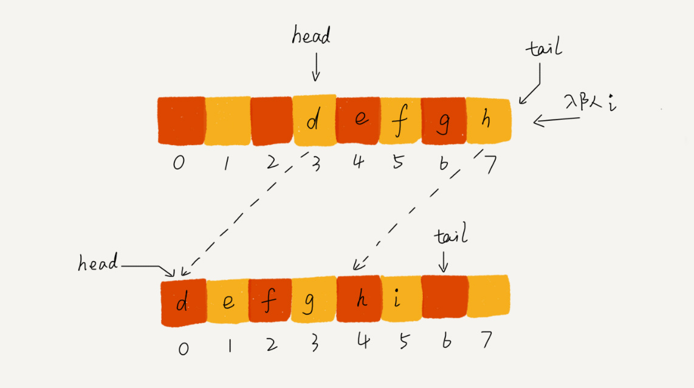

这种实现思路中，出队操作的时间复杂度仍然是 O(1)，但入队操作的时间复杂度还是 O(1) 吗？你可以用我们第 3 节、第 4 节讲的算法复杂度分析方法，自己试着分析一下。

接下来，我们再来看下**基于链表的队列实现方法**。

基于链表的实现，我们同样需要两个指针：head 指针和 tail 指针。它们分别指向链表的第一个结点和最后一个结点。如图所示，入队时，tail->next= new_node, tail = tail->next；出队时，head = head->next。我将具体的代码放到 GitHub 上，你可以自己试着实现一下，然后再去 GitHub 上跟我实现的代码对比下，看写得对不对。

## 循环队列

我们刚才用数组来实现队列的时候，在 tail==n 时，会有数据搬移操作，这样入队操作性能就会受到影响。那有没有办法能够避免数据搬移呢？我们来看看循环队列的解决思路。

循环队列，顾名思义，它长得像一个环。原本数组是有头有尾的，是一条直线。现在我们把首尾相连，扳成了一个环。我画了一张图，你可以直观地感受一下。

我们可以看到，图中这个队列的大小为 8，当前 head=4，tail=7。当有一个新的元素 a 入队时，我们放入下标为 7 的位置。但这个时候，我们并不把 tail 更新为 8，而是将其在环中后移一位，到下标为 0 的位置。当再有一个元素 b 入队时，我们将 b 放入下标为 0 的位置，然后 tail 加 1 更新为 1。所以，在 a，b 依次入队之后，循环队列中的元素就变成了下面的样子：

通过这样的方法，我们成功避免了数据搬移操作。看起来不难理解，但是循环队列的代码实现难度要比前面讲的非循环队列难多了。要想写出没有 bug 的循环队列的实现代码，我个人觉得，最关键的是，**确定好队空和队满的判定条件**。

在用数组实现的非循环队列中，队满的判断条件是 tail == n，队空的判断条件是 head == tail。那针对循环队列，如何判断队空和队满呢？

队列为空的判断条件仍然是 head == tail。但队列满的判断条件就稍微有点复杂了。我画了一张队列满的图，你可以看一下，试着总结一下规律。

就像我图中画的队满的情况，tail=3，head=4，n=8，所以总结一下规律就是：(3+1)%8=4。多画几张队满的图，你就会发现，当队满时，**(tail+1)%n=head**。

你有没有发现，当队列满时，图中的 tail 指向的位置实际上是没有存储数据的。所以，循环队列会浪费一个数组的存储空间。

Talk is cheap，如果还是没怎么理解，那就 show you code 吧。

public class CircularQueue {

  // 数组：items，数组大小：n

  private String[] items;

  private int n = 0;

  // head表示队头下标，tail表示队尾下标

  private int head = 0;

  private int tail = 0;

  // 申请一个大小为capacity的数组

  public CircularQueue(int capacity) {

​    items = new String[capacity];

​    n = capacity;

  }

  // 入队

  public boolean enqueue(String item) {

​    // 队列满了

​    if ((tail + 1) % n == head) return false;

​    items[tail] = item;

​    tail = (tail + 1) % n;

​    return true;

  }

  // 出队

  public String dequeue() {

​    // 如果head == tail 表示队列为空

​    if (head == tail) return null;

​    String ret = items[head];

​    head = (head + 1) % n;

​    return ret;

  }

}

## 阻塞队列和并发队列

前面讲的内容理论比较多，看起来很难跟实际的项目开发扯上关系。确实，队列这种数据结构很基础，平时的业务开发不大可能从零实现一个队列，甚至都不会直接用到。而一些具有特殊特性的队列应用却比较广泛，比如阻塞队列和并发队列。

**阻塞队列**其实就是在队列基础上增加了阻塞操作。简单来说，就是在队列为空的时候，从队头取数据会被阻塞。因为此时还没有数据可取，直到队列中有了数据才能返回；如果队列已经满了，那么插入数据的操作就会被阻塞，直到队列中有空闲位置后再插入数据，然后再返回。

你应该已经发现了，上述的定义就是一个“生产者 - 消费者模型”！是的，我们可以使用阻塞队列，轻松实现一个“生产者 - 消费者模型”！

这种基于阻塞队列实现的“生产者 - 消费者模型”，可以有效地协调生产和消费的速度。当“生产者”生产数据的速度过快，“消费者”来不及消费时，存储数据的队列很快就会满了。这个时候，生产者就阻塞等待，直到“消费者”消费了数据，“生产者”才会被唤醒继续“生产”。

而且不仅如此，基于阻塞队列，我们还可以通过协调“生产者”和“消费者”的个数，来提高数据的处理效率。比如前面的例子，我们可以多配置几个“消费者”，来应对一个“生产者”。

前面我们讲了阻塞队列，在多线程情况下，会有多个线程同时操作队列，这个时候就会存在线程安全问题，那如何实现一个线程安全的队列呢？

线程安全的队列我们叫作**并发队列**。最简单直接的实现方式是直接在 enqueue()、dequeue() 方法上加锁，但是锁粒度大并发度会比较低，同一时刻仅允许一个存或者取操作。实际上，基于数组的循环队列，利用 CAS 原子操作，可以实现非常高效的并发队列。这也是循环队列比链式队列应用更加广泛的原因。在实战篇讲 Disruptor 的时候，我会再详细讲并发队列的应用。

## 解答开篇

队列的知识就讲完了，我们现在回过来看下开篇的问题。线程池没有空闲线程时，新的任务请求线程资源时，线程池该如何处理？各种处理策略又是如何实现的呢？

我们一般有两种处理策略。第一种是非阻塞的处理方式，直接拒绝任务请求；另一种是阻塞的处理方式，将请求排队，等到有空闲线程时，取出排队的请求继续处理。那如何存储排队的请求呢？

我们希望公平地处理每个排队的请求，先进者先服务，所以队列这种数据结构很适合来存储排队请求。我们前面说过，队列有基于链表和基于数组这两种实现方式。这两种实现方式对于排队请求又有什么区别呢？

基于链表的实现方式，可以实现一个支持无限排队的无界队列（unbounded queue），但是可能会导致过多的请求排队等待，请求处理的响应时间过长。所以，针对响应时间比较敏感的系统，基于链表实现的无限排队的线程池是不合适的。

而基于数组实现的有界队列（bounded queue），队列的大小有限，所以线程池中排队的请求超过队列大小时，接下来的请求就会被拒绝，这种方式对响应时间敏感的系统来说，就相对更加合理。不过，设置一个合理的队列大小，也是非常有讲究的。队列太大导致等待的请求太多，队列太小会导致无法充分利用系统资源、发挥最大性能。

除了前面讲到队列应用在线程池请求排队的场景之外，队列可以应用在任何有限资源池中，用于排队请求，比如数据库连接池等。**实际上，对于大部分资源有限的场景，当没有空闲资源时，基本上都可以通过“队列”这种数据结构来实现请求排队。**

## 内容小结

今天我们讲了一种跟栈很相似的数据结构，队列。关于队列，你能掌握下面的内容，这节就没问题了。

队列最大的特点就是先进先出，主要的两个操作是入队和出队。跟栈一样，它既可以用数组来实现，也可以用链表来实现。用数组实现的叫顺序队列，用链表实现的叫链式队列。特别是长得像一个环的循环队列。在数组实现队列的时候，会有数据搬移操作，要想解决数据搬移的问题，我们就需要像环一样的循环队列。

循环队列是我们这节的重点。要想写出没有 bug 的循环队列实现代码，关键要确定好队空和队满的判定条件，具体的代码你要能写出来。

除此之外，我们还讲了几种高级的队列结构，阻塞队列、并发队列，底层都还是队列这种数据结构，只不过在之上附加了很多其他功能。阻塞队列就是入队、出队操作可以阻塞，并发队列就是队列的操作多线程安全。

## 课后思考

除了线程池这种池结构会用到队列排队请求，你还知道有哪些类似的池结构或者场景中会用到队列的排队请求呢？

今天讲到并发队列，关于如何实现无锁并发队列，网上有非常多的讨论。对这个问题，你怎么看呢？

欢迎留言和我分享，我会第一时间给你反馈。

# 10 | 递归：如何用三行代码找到“最终推荐人”？

王争 2018-10-12



00:00

[1.0x**](javascript:;)

讲述：修阳 大小：7.15M 时长：15:35

推荐注册返佣金的这个功能我想你应该不陌生吧？现在很多 App 都有这个功能。这个功能中，用户 A 推荐用户 B 来注册，用户 B 又推荐了用户 C 来注册。我们可以说，用户 C 的“最终推荐人”为用户 A，用户 B 的“最终推荐人”也为用户 A，而用户 A 没有“最终推荐人”。

一般来说，我们会通过数据库来记录这种推荐关系。在数据库表中，我们可以记录两行数据，其中 actor_id 表示用户 id，referrer_id 表示推荐人 id。

基于这个背景，我的问题是，**给定一个用户 ID，如何查找这个用户的“最终推荐人”？** 带着这个问题，我们来学习今天的内容，递归（Recursion）！

## 如何理解“递归”？

从我自己学习数据结构和算法的经历来看，我个人觉得，有两个最难理解的知识点，一个是**动态规划**，另一个就是**递归**。

递归是一种应用非常广泛的算法（或者编程技巧）。之后我们要讲的很多数据结构和算法的编码实现都要用到递归，比如 DFS 深度优先搜索、前中后序二叉树遍历等等。所以，搞懂递归非常重要，否则，后面复杂一些的数据结构和算法学起来就会比较吃力。

不过，别看我说了这么多，递归本身可是一点儿都不“高冷”，咱们生活中就有很多用到递归的例子。

周末你带着女朋友去电影院看电影，女朋友问你，咱们现在坐在第几排啊？电影院里面太黑了，看不清，没法数，现在你怎么办？

别忘了你是程序员，这个可难不倒你，递归就开始排上用场了。于是你就问前面一排的人他是第几排，你想只要在他的数字上加一，就知道自己在哪一排了。但是，前面的人也看不清啊，所以他也问他前面的人。就这样一排一排往前问，直到问到第一排的人，说我在第一排，然后再这样一排一排再把数字传回来。直到你前面的人告诉你他在哪一排，于是你就知道答案了。

这就是一个非常标准的递归求解问题的分解过程，去的过程叫“递”，回来的过程叫“归”。基本上，所有的递归问题都可以用递推公式来表示。刚刚这个生活中的例子，我们用递推公式将它表示出来就是这样的：

f(n)=f(n-1)+1 其中，f(1)=1

f(n) 表示你想知道自己在哪一排，f(n-1) 表示前面一排所在的排数，f(1)=1 表示第一排的人知道自己在第一排。有了这个递推公式，我们就可以很轻松地将它改为递归代码，如下：

int f(int n) {

  if (n == 1) return 1;

  return f(n-1) + 1;

}

## 递归需要满足的三个条件

刚刚这个例子是非常典型的递归，那究竟什么样的问题可以用递归来解决呢？我总结了三个条件，只要同时满足以下三个条件，就可以用递归来解决。

**1. 一个问题的解可以分解为几个子问题的解**

何为子问题？子问题就是数据规模更小的问题。比如，前面讲的电影院的例子，你要知道，“自己在哪一排”的问题，可以分解为“前一排的人在哪一排”这样一个子问题。

**2. 这个问题与分解之后的子问题，除了数据规模不同，求解思路完全一样**

比如电影院那个例子，你求解“自己在哪一排”的思路，和前面一排人求解“自己在哪一排”的思路，是一模一样的。

**3. 存在递归终止条件**

把问题分解为子问题，把子问题再分解为子子问题，一层一层分解下去，不能存在无限循环，这就需要有终止条件。

还是电影院的例子，第一排的人不需要再继续询问任何人，就知道自己在哪一排，也就是 f(1)=1，这就是递归的终止条件。

## 如何编写递归代码？

刚刚铺垫了这么多，现在我们来看，如何来写递归代码？我个人觉得，写递归代码最关键的是**写出递推公式，找到终止条件**，剩下将递推公式转化为代码就很简单了。

你先记住这个理论。我举一个例子，带你一步一步实现一个递归代码，帮你理解。

假如这里有 n 个台阶，每次你可以跨 1 个台阶或者 2 个台阶，请问走这 n 个台阶有多少种走法？如果有 7 个台阶，你可以 2，2，2，1 这样子上去，也可以 1，2，1，1，2 这样子上去，总之走法有很多，那如何用编程求得总共有多少种走法呢？

我们仔细想下，实际上，可以根据第一步的走法把所有走法分为两类，第一类是第一步走了 1 个台阶，另一类是第一步走了 2 个台阶。所以 n 个台阶的走法就等于先走 1 阶后，n-1 个台阶的走法 加上先走 2 阶后，n-2 个台阶的走法。用公式表示就是：

f(n) = f(n-1)+f(n-2)

有了递推公式，递归代码基本上就完成了一半。我们再来看下终止条件。当有一个台阶时，我们不需要再继续递归，就只有一种走法。所以 f(1)=1。这个递归终止条件足够吗？我们可以用 n=2，n=3 这样比较小的数试验一下。

n=2 时，f(2)=f(1)+f(0)。如果递归终止条件只有一个 f(1)=1，那 f(2) 就无法求解了。所以除了 f(1)=1 这一个递归终止条件外，还要有 f(0)=1，表示走 0 个台阶有一种走法，不过这样子看起来就不符合正常的逻辑思维了。所以，我们可以把 f(2)=2 作为一种终止条件，表示走 2 个台阶，有两种走法，一步走完或者分两步来走。

所以，递归终止条件就是 f(1)=1，f(2)=2。这个时候，你可以再拿 n=3，n=4 来验证一下，这个终止条件是否足够并且正确。

我们把递归终止条件和刚刚得到的递推公式放到一起就是这样的：

f(1) = 1;

f(2) = 2;

f(n) = f(n-1)+f(n-2)

有了这个公式，我们转化成递归代码就简单多了。最终的递归代码是这样的：

int f(int n) {

  if (n == 1) return 1;

  if (n == 2) return 2;

  return f(n-1) + f(n-2);

}

我总结一下，**写递归代码的关键就是找到如何将大问题分解为小问题的规律，并且基于此写出递推公式，然后再推敲终止条件，最后将递推公式和终止条件翻译成代码**。

虽然我讲了这么多方法，但是作为初学者的你，现在是不是还是有种想不太清楚的感觉呢？实际上，我刚学递归的时候，也有这种感觉，这也是文章开头我说递归代码比较难理解的地方。

刚讲的电影院的例子，我们的递归调用只有一个分支，也就是说“一个问题只需要分解为一个子问题”，我们很容易能够想清楚“递“和”归”的每一个步骤，所以写起来、理解起来都不难。

但是，当我们面对的是一个问题要分解为多个子问题的情况，递归代码就没那么好理解了。

像我刚刚讲的第二个例子，人脑几乎没办法把整个“递”和“归”的过程一步一步都想清楚。

计算机擅长做重复的事情，所以递归正合它的胃口。而我们人脑更喜欢平铺直叙的思维方式。当我们看到递归时，我们总想把递归平铺展开，脑子里就会循环，一层一层往下调，然后再一层一层返回，试图想搞清楚计算机每一步都是怎么执行的，这样就很容易被绕进去。

对于递归代码，这种试图想清楚整个递和归过程的做法，实际上是进入了一个思维误区。很多时候，我们理解起来比较吃力，主要原因就是自己给自己制造了这种理解障碍。那正确的思维方式应该是怎样的呢？

如果一个问题 A 可以分解为若干子问题 B、C、D，你可以假设子问题 B、C、D 已经解决，在此基础上思考如何解决问题 A。而且，你只需要思考问题 A 与子问题 B、C、D 两层之间的关系即可，不需要一层一层往下思考子问题与子子问题，子子问题与子子子问题之间的关系。屏蔽掉递归细节，这样子理解起来就简单多了。

因此，**编写递归代码的关键是，只要遇到递归，我们就把它抽象成一个递推公式，不用想一层层的调用关系，不要试图用人脑去分解递归的每个步骤**。

## 递归代码要警惕堆栈溢出

在实际的软件开发中，编写递归代码时，我们会遇到很多问题，比如堆栈溢出。而堆栈溢出会造成系统性崩溃，后果会非常严重。为什么递归代码容易造成堆栈溢出呢？我们又该如何预防堆栈溢出呢？

我在“栈”那一节讲过，函数调用会使用栈来保存临时变量。每调用一个函数，都会将临时变量封装为栈帧压入内存栈，等函数执行完成返回时，才出栈。系统栈或者虚拟机栈空间一般都不大。如果递归求解的数据规模很大，调用层次很深，一直压入栈，就会有堆栈溢出的风险。

比如前面的讲到的电影院的例子，如果我们将系统栈或者 JVM 堆栈大小设置为 1KB，在求解 f(19999) 时便会出现如下堆栈报错：

Exception in thread "main" java.lang.StackOverflowError

那么，如何避免出现堆栈溢出呢？

我们可以通过在代码中限制递归调用的最大深度的方式来解决这个问题。递归调用超过一定深度（比如 1000）之后，我们就不继续往下再递归了，直接返回报错。还是电影院那个例子，我们可以改造成下面这样子，就可以避免堆栈溢出了。不过，我写的代码是伪代码，为了代码简洁，有些边界条件没有考虑，比如 x<=0。

// 全局变量，表示递归的深度。

int depth = 0;

int f(int n) {

  ++depth；

  if (depth > 1000) throw exception;

  

  if (n == 1) return 1;

  return f(n-1) + 1;

}

但这种做法并不能完全解决问题，因为最大允许的递归深度跟当前线程剩余的栈空间大小有关，事先无法计算。如果实时计算，代码过于复杂，就会影响代码的可读性。所以，如果最大深度比较小，比如 10、50，就可以用这种方法，否则这种方法并不是很实用。

## 递归代码要警惕重复计算

除此之外，使用递归时还会出现重复计算的问题。刚才我讲的第二个递归代码的例子，如果我们把整个递归过程分解一下的话，那就是这样的：

从图中，我们可以直观地看到，想要计算 f(5)，需要先计算 f(4) 和 f(3)，而计算 f(4) 还需要计算 f(3)，因此，f(3) 就被计算了很多次，这就是重复计算问题。

为了避免重复计算，我们可以通过一个数据结构（比如散列表）来保存已经求解过的 f(k)。当递归调用到 f(k) 时，先看下是否已经求解过了。如果是，则直接从散列表中取值返回，不需要重复计算，这样就能避免刚讲的问题了。

按照上面的思路，我们来改造一下刚才的代码：

public int f(int n) {

  if (n == 1) return 1;

  if (n == 2) return 2;

  

  // hasSolvedList可以理解成一个Map，key是n，value是f(n)

  if (hasSolvedList.containsKey(n)) {

​    return hasSolvedList.get(n);

  }

  

  int ret = f(n-1) + f(n-2);

  hasSolvedList.put(n, ret);

  return ret;

}

除了堆栈溢出、重复计算这两个常见的问题。递归代码还有很多别的问题。

在时间效率上，递归代码里多了很多函数调用，当这些函数调用的数量较大时，就会积聚成一个可观的时间成本。在空间复杂度上，因为递归调用一次就会在内存栈中保存一次现场数据，所以在分析递归代码空间复杂度时，需要额外考虑这部分的开销，比如我们前面讲到的电影院递归代码，空间复杂度并不是 O(1)，而是 O(n)。

## 怎么将递归代码改写为非递归代码？

我们刚说了，递归有利有弊，利是递归代码的表达力很强，写起来非常简洁；而弊就是空间复杂度高、有堆栈溢出的风险、存在重复计算、过多的函数调用会耗时较多等问题。所以，在开发过程中，我们要根据实际情况来选择是否需要用递归的方式来实现。

那我们是否可以把递归代码改写为非递归代码呢？比如刚才那个电影院的例子，我们抛开场景，只看 f(x) =f(x-1)+1 这个递推公式。我们这样改写看看：

int f(int n) {

  int ret = 1;

  for (int i = 2; i <= n; ++i) {

​    ret = ret + 1;

  }

  return ret;

}

同样，第二个例子也可以改为非递归的实现方式。

int f(int n) {

  if (n == 1) return 1;

  if (n == 2) return 2;

  

  int ret = 0;

  int pre = 2;

  int prepre = 1;

  for (int i = 3; i <= n; ++i) {

​    ret = pre + prepre;

​    prepre = pre;

​    pre = ret;

  }

  return ret;

}

那是不是所有的递归代码都可以改为这种**迭代循环**的非递归写法呢？

笼统地讲，是的。因为递归本身就是借助栈来实现的，只不过我们使用的栈是系统或者虚拟机本身提供的，我们没有感知罢了。如果我们自己在内存堆上实现栈，手动模拟入栈、出栈过程，这样任何递归代码都可以改写成看上去不是递归代码的样子。

但是这种思路实际上是将递归改为了“手动”递归，本质并没有变，而且也并没有解决前面讲到的某些问题，徒增了实现的复杂度。

## 解答开篇

到此为止，递归相关的基础知识已经讲完了，咱们来看一下开篇的问题：如何找到“最终推荐人”？我的解决方案是这样的：

long findRootReferrerId(long actorId) {

  Long referrerId = select referrer_id from [table] where actor_id = actorId;

  if (referrerId == null) return actorId;

  return findRootReferrerId(referrerId);

}

是不是非常简洁？用三行代码就能搞定了，不过在实际项目中，上面的代码并不能工作，为什么呢？这里面有两个问题。

第一，如果递归很深，可能会有堆栈溢出的问题。

第二，如果数据库里存在脏数据，我们还需要处理由此产生的无限递归问题。比如 demo 环境下数据库中，测试工程师为了方便测试，会人为地插入一些数据，就会出现脏数据。如果 A 的推荐人是 B，B 的推荐人是 C，C 的推荐人是 A，这样就会发生死循环。

第一个问题，我前面已经解答过了，可以用限制递归深度来解决。第二个问题，也可以用限制递归深度来解决。不过，还有一个更高级的处理方法，就是自动检测 A-B-C-A 这种“环”的存在。如何来检测环的存在呢？这个我暂时不细说，你可以自己思考下，后面的章节我们还会讲。

## 内容小结

关于递归的知识，到这里就算全部讲完了。我来总结一下。

递归是一种非常高效、简洁的编码技巧。只要是满足“三个条件”的问题就可以通过递归代码来解决。

不过递归代码也比较难写、难理解。编写递归代码的关键就是不要把自己绕进去，正确姿势是写出递推公式，找出终止条件，然后再翻译成递归代码。

递归代码虽然简洁高效，但是，递归代码也有很多弊端。比如，堆栈溢出、重复计算、函数调用耗时多、空间复杂度高等，所以，在编写递归代码的时候，一定要控制好这些副作用。

## 课后思考

我们平时调试代码喜欢使用 IDE 的单步跟踪功能，像规模比较大、递归层次很深的递归代码，几乎无法使用这种调试方式。对于递归代码，你有什么好的调试方法呢？

欢迎留言和我分享，我会第一时间给你反馈。

# 11 | 排序（上）：为什么插入排序比冒泡排序更受欢迎？

王争 2018-10-15



00:00

[1.0x**](javascript:;)

讲述：修阳 大小：8.52M 时长：21:13

排序对于任何一个程序员来说，可能都不会陌生。你学的第一个算法，可能就是排序。大部分编程语言中，也都提供了排序函数。在平常的项目中，我们也经常会用到排序。排序非常重要，所以我会花多一点时间来详细讲一讲经典的排序算法。

排序算法太多了，有很多可能你连名字都没听说过，比如猴子排序、睡眠排序、面条排序等。我只讲众多排序算法中的一小撮，也是最经典的、最常用的：冒泡排序、插入排序、选择排序、归并排序、快速排序、计数排序、基数排序、桶排序。我按照时间复杂度把它们分成了三类，分三节课来讲解。

带着问题去学习，是最有效的学习方法。所以按照惯例，我还是先给你出一个思考题：**插入排序和冒泡排序的时间复杂度相同，都是 O(n****2****)，在实际的软件开发里，为什么我们更倾向于使用插入排序算法而不是冒泡排序算法呢？**

你可以先思考一两分钟，带着这个问题，我们开始今天的内容！

## 如何分析一个“排序算法”？

学习排序算法，我们除了学习它的算法原理、代码实现之外，更重要的是要学会如何评价、分析一个排序算法。那分析一个排序算法，要从哪几个方面入手呢？

### 排序算法的执行效率

对于排序算法执行效率的分析，我们一般会从这几个方面来衡量：

**1. 最好情况、最坏情况、平均****情况****时间复杂度**

我们在分析排序算法的时间复杂度时，要分别给出最好情况、最坏情况、平均情况下的时间复杂度。除此之外，你还要说出最好、最坏时间复杂度对应的要排序的原始数据是什么样的。

为什么要区分这三种时间复杂度呢？第一，有些排序算法会区分，为了好对比，所以我们最好都做一下区分。第二，对于要排序的数据，有的接近有序，有的完全无序。有序度不同的数据，对于排序的执行时间肯定是有影响的，我们要知道排序算法在不同数据下的性能表现。

**2. 时间复杂度的系数、常数 、低阶**

我们知道，时间复杂度反映的是数据规模 n 很大的时候的一个增长趋势，所以它表示的时候会忽略系数、常数、低阶。但是实际的软件开发中，我们排序的可能是 10 个、100 个、1000 个这样规模很小的数据，所以，在对同一阶时间复杂度的排序算法性能对比的时候，我们就要把系数、常数、低阶也考虑进来。

**3. 比较次数和交换（或移动）次数**

这一节和下一节讲的都是基于比较的排序算法。基于比较的排序算法的执行过程，会涉及两种操作，一种是元素比较大小，另一种是元素交换或移动。所以，如果我们在分析排序算法的执行效率的时候，应该把比较次数和交换（或移动）次数也考虑进去。

### 排序算法的内存消耗

我们前面讲过，算法的内存消耗可以通过空间复杂度来衡量，排序算法也不例外。不过，针对排序算法的空间复杂度，我们还引入了一个新的概念，**原地排序**（Sorted in place）。原地排序算法，就是特指空间复杂度是 O(1) 的排序算法。我们今天讲的三种排序算法，都是原地排序算法。

### 排序算法的稳定性

仅仅用执行效率和内存消耗来衡量排序算法的好坏是不够的。针对排序算法，我们还有一个重要的度量指标，**稳定性**。这个概念是说，如果待排序的序列中存在值相等的元素，经过排序之后，相等元素之间原有的先后顺序不变。

我通过一个例子来解释一下。比如我们有一组数据 2，9，3，4，8，3，按照大小排序之后就是 2，3，3，4，8，9。

这组数据里有两个 3。经过某种排序算法排序之后，如果两个 3 的前后顺序没有改变，那我们就把这种排序算法叫作**稳定的排序算法**；如果前后顺序发生变化，那对应的排序算法就叫作**不稳定的排序算法**。

你可能要问了，两个 3 哪个在前，哪个在后有什么关系啊，稳不稳定又有什么关系呢？为什么要考察排序算法的稳定性呢？

很多数据结构和算法课程，在讲排序的时候，都是用整数来举例，但在真正软件开发中，我们要排序的往往不是单纯的整数，而是一组对象，我们需要按照对象的某个 key 来排序。

比如说，我们现在要给电商交易系统中的“订单”排序。订单有两个属性，一个是下单时间，另一个是订单金额。如果我们现在有 10 万条订单数据，我们希望按照金额从小到大对订单数据排序。对于金额相同的订单，我们希望按照下单时间从早到晚有序。对于这样一个排序需求，我们怎么来做呢？

最先想到的方法是：我们先按照金额对订单数据进行排序，然后，再遍历排序之后的订单数据，对于每个金额相同的小区间再按照下单时间排序。这种排序思路理解起来不难，但是实现起来会很复杂。

借助稳定排序算法，这个问题可以非常简洁地解决。解决思路是这样的：我们先按照下单时间给订单排序，注意是按照下单时间，不是金额。排序完成之后，我们用稳定排序算法，按照订单金额重新排序。两遍排序之后，我们得到的订单数据就是按照金额从小到大排序，金额相同的订单按照下单时间从早到晚排序的。为什么呢？

**稳定排序算法可以保持金额相同的两个对象，在排序之后的前后顺序不变**。第一次排序之后，所有的订单按照下单时间从早到晚有序了。在第二次排序中，我们用的是稳定的排序算法，所以经过第二次排序之后，相同金额的订单仍然保持下单时间从早到晚有序。

## 冒泡排序（Bubble Sort）

我们从冒泡排序开始，学习今天的三种排序算法。

冒泡排序只会操作相邻的两个数据。每次冒泡操作都会对相邻的两个元素进行比较，看是否满足大小关系要求。如果不满足就让它俩互换。一次冒泡会让至少一个元素移动到它应该在的位置，重复 n 次，就完成了 n 个数据的排序工作。

我用一个例子，带你看下冒泡排序的整个过程。我们要对一组数据 4，5，6，3，2，1，从小到大进行排序。第一次冒泡操作的详细过程就是这样：

可以看出，经过一次冒泡操作之后，6 这个元素已经存储在正确的位置上。要想完成所有数据的排序，我们只要进行 6 次这样的冒泡操作就行了。

实际上，刚讲的冒泡过程还可以优化。当某次冒泡操作已经没有数据交换时，说明已经达到完全有序，不用再继续执行后续的冒泡操作。我这里还有另外一个例子，这里面给 6 个元素排序，只需要 4 次冒泡操作就可以了。

冒泡排序算法的原理比较容易理解，具体的代码我贴到下面，你可以结合着代码来看我前面讲的原理。

// 冒泡排序，a表示数组，n表示数组大小

public void bubbleSort(int[] a, int n) {

  if (n <= 1) return;

 

 for (int i = 0; i < n; ++i) {

​    // 提前退出冒泡循环的标志位

​    boolean flag = false;

​    for (int j = 0; j < n - i - 1; ++j) {

​      if (a[j] > a[j+1]) { // 交换

​        int tmp = a[j];

​        a[j] = a[j+1];

​        a[j+1] = tmp;

​        flag = true;  // 表示有数据交换      

​      }

​    }

​    if (!flag) break;  // 没有数据交换，提前退出

  }

}

现在，结合刚才我分析排序算法的三个方面，我有三个问题要问你。

**第一，冒泡排序是原地排序算法吗？**

冒泡的过程只涉及相邻数据的交换操作，只需要常量级的临时空间，所以它的空间复杂度为 O(1)，是一个原地排序算法。

**第二，冒泡排序是稳定的排序算法吗？**

在冒泡排序中，只有交换才可以改变两个元素的前后顺序。为了保证冒泡排序算法的稳定性，当有相邻的两个元素大小相等的时候，我们不做交换，相同大小的数据在排序前后不会改变顺序，所以冒泡排序是稳定的排序算法。

**第三，冒泡排序****的时间复杂度****是多少？**

最好情况下，要排序的数据已经是有序的了，我们只需要进行一次冒泡操作，就可以结束了，所以最好情况时间复杂度是 O(n)。而最坏的情况是，要排序的数据刚好是倒序排列的，我们需要进行 n 次冒泡操作，所以最坏情况时间复杂度为 O(n2)。

最好、最坏情况下的时间复杂度很容易分析，那平均情况下的时间复杂是多少呢？我们前面讲过，平均时间复杂度就是加权平均期望时间复杂度，分析的时候要结合概率论的知识。

对于包含 n 个数据的数组，这 n 个数据就有 n! 种排列方式。不同的排列方式，冒泡排序执行的时间肯定是不同的。比如我们前面举的那两个例子，其中一个要进行 6 次冒泡，而另一个只需要 4 次。如果用概率论方法定量分析平均时间复杂度，涉及的数学推理和计算就会很复杂。我这里还有一种思路，通过“**有序度**”和“**逆序度**”这两个概念来进行分析。

**有序度**是数组中具有有序关系的元素对的个数。有序元素对用数学表达式表示就是这样：

有序元素对：a[i] <= a[j], 如果i < j。

同理，对于一个倒序排列的数组，比如 6，5，4，3，2，1，有序度是 0；对于一个完全有序的数组，比如 1，2，3，4，5，6，有序度就是 **n\*(n-1)/2**，也就是 15。我们把这种完全有序的数组的有序度叫作**满有序度**。

逆序度的定义正好跟有序度相反（默认从小到大为有序），我想你应该已经想到了。关于逆序度，我就不举例子讲了。你可以对照我讲的有序度的例子自己看下。

逆序元素对：a[i] > a[j], 如果i < j。

关于这三个概念，我们还可以得到一个公式：**逆序度 = 满有序度 - 有序度**。我们排序的过程就是一种增加有序度，减少逆序度的过程，最后达到满有序度，就说明排序完成了。

我还是拿前面举的那个冒泡排序的例子来说明。要排序的数组的初始状态是 4，5，6，3，2，1 ，其中，有序元素对有 (4，5) (4，6)(5，6)，所以有序度是 3。n=6，所以排序完成之后终态的满有序度为 n*(n-1)/2=15。

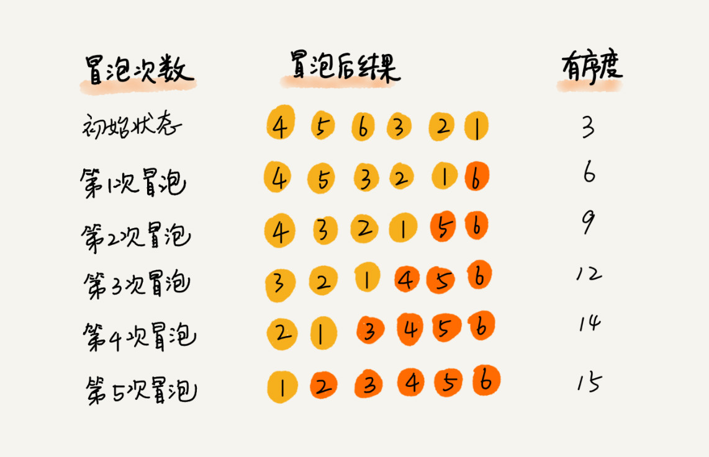

冒泡排序包含两个操作原子，**比较**和**交换**。每交换一次，有序度就加 1。不管算法怎么改进，交换次数总是确定的，即为**逆序度，****也就是****n\*(n-1)/2–初始有序度**。此例中就是 15–3=12，要进行 12 次交换操作。

对于包含 n 个数据的数组进行冒泡排序，平均交换次数是多少呢？最坏情况下，初始状态的有序度是 0，所以要进行 n*(n-1)/2 次交换。最好情况下，初始状态的有序度是 n*(n-1)/2，就不需要进行交换。我们可以取个中间值 n*(n-1)/4，来表示初始有序度既不是很高也不是很低的平均情况。

换句话说，平均情况下，需要 n*(n-1)/4 次交换操作，比较操作肯定要比交换操作多，而复杂度的上限是 O(n2)，所以平均情况下的时间复杂度就是 O(n2)。

这个平均时间复杂度推导过程其实并不严格，但是很多时候很实用，毕竟概率论的定量分析太复杂，不太好用。等我们讲到快排的时候，我还会再次用这种“不严格”的方法来分析平均时间复杂度。

## 插入排序（Insertion Sort）

我们先来看一个问题。一个有序的数组，我们往里面添加一个新的数据后，如何继续保持数据有序呢？很简单，我们只要遍历数组，找到数据应该插入的位置将其插入即可。

这是一个动态排序的过程，即动态地往有序集合中添加数据，我们可以通过这种方法保持集合中的数据一直有序。而对于一组静态数据，我们也可以借鉴上面讲的插入方法，来进行排序，于是就有了插入排序算法。

那**插入排序具体是如何借助上面的思想来实现排序的呢**？

首先，我们将数组中的数据分为两个区间，**已排序区间**和**未排序区间**。初始已排序区间只有一个元素，就是数组的第一个元素。插入算法的核心思想是取未排序区间中的元素，在已排序区间中找到合适的插入位置将其插入，并保证已排序区间数据一直有序。重复这个过程，直到未排序区间中元素为空，算法结束。

如图所示，要排序的数据是 4，5，6，1，3，2，其中左侧为已排序区间，右侧是未排序区间。

插入排序也包含两种操作，一种是**元素的比较**，一种是**元素****的****移动**。当我们需要将一个数据 a 插入到已排序区间时，需要拿 a 与已排序区间的元素依次比较大小，找到合适的插入位置。找到插入点之后，我们还需要将插入点之后的元素顺序往后移动一位，这样才能腾出位置给元素 a 插入。

对于不同的查找插入点方法（从头到尾、从尾到头），元素的比较次数是有区别的。但对于一个给定的初始序列，移动操作的次数总是固定的，就等于逆序度。

为什么说移动次数就等于逆序度呢？我拿刚才的例子画了一个图表，你一看就明白了。满有序度是 n*(n-1)/2=15，初始序列的有序度是 5，所以逆序度是 10。插入排序中，数据移动的个数总和也等于 10=3+3+4。

插入排序的原理也很简单吧？我也将代码实现贴在这里，你可以结合着代码再看下。

// 插入排序，a表示数组，n表示数组大小

public void insertionSort(int[] a, int n) {

  if (n <= 1) return;

  for (int i = 1; i < n; ++i) {

​    int value = a[i];

​    int j = i - 1;

​    // 查找插入的位置

​    for (; j >= 0; --j) {

​      if (a[j] > value) {

​        a[j+1] = a[j];  // 数据移动

​      } else {

​        break;

​      }

​    }

​    a[j+1] = value; // 插入数据

  }

}

现在，我们来看点稍微复杂的东西。我这里还是有三个问题要问你。

**第一，插入排序是原地排序算法吗？**

从实现过程可以很明显地看出，插入排序算法的运行并不需要额外的存储空间，所以空间复杂度是 O(1)，也就是说，这是一个原地排序算法。

**第二，插入排序是****稳定****的排序算法吗？**

在插入排序中，对于值相同的元素，我们可以选择将后面出现的元素，插入到前面出现元素的后面，这样就可以保持原有的前后顺序不变，所以插入排序是稳定的排序算法。

**第三，插入排序****的时间复杂度****是多少？**

如果要排序的数据已经是有序的，我们并不需要搬移任何数据。如果我们从尾到头在有序数据组里面查找插入位置，每次只需要比较一个数据就能确定插入的位置。所以这种情况下，最好是时间复杂度为 O(n)。注意，这里是**从尾到头遍历已经有序的数据**。

如果数组是倒序的，每次插入都相当于在数组的第一个位置插入新的数据，所以需要移动大量的数据，所以最坏情况时间复杂度为 O(n2)。

还记得我们在数组中插入一个数据的平均时间复杂度是多少吗？没错，是 O(n)。所以，对于插入排序来说，每次插入操作都相当于在数组中插入一个数据，循环执行 n 次插入操作，所以平均时间复杂度为 O(n2)。

## 选择排序（Selection Sort）

选择排序算法的实现思路有点类似插入排序，也分已排序区间和未排序区间。但是选择排序每次会从未排序区间中找到最小的元素，将其放到已排序区间的末尾。

照例，也有三个问题需要你思考，不过前面两种排序算法我已经分析得很详细了，这里就直接公布答案了。

首先，选择排序空间复杂度为 O(1)，是一种原地排序算法。选择排序的最好情况时间复杂度、最坏情况和平均情况时间复杂度都为 O(n2)。你可以自己来分析看看。

那选择排序是稳定的排序算法吗？这个问题我着重来说一下。

答案是否定的，选择排序是一种不稳定的排序算法。从我前面画的那张图中，你可以看出来，选择排序每次都要找剩余未排序元素中的最小值，并和前面的元素交换位置，这样破坏了稳定性。

比如 5，8，5，2，9 这样一组数据，使用选择排序算法来排序的话，第一次找到最小元素 2，与第一个 5 交换位置，那第一个 5 和中间的 5 顺序就变了，所以就不稳定了。正是因此，相对于冒泡排序和插入排序，选择排序就稍微逊色了。

## 解答开篇

基本的知识都讲完了，我们来看开篇的问题：冒泡排序和插入排序的时间复杂度都是 O(n2)，都是原地排序算法，为什么插入排序要比冒泡排序更受欢迎呢？

我们前面分析冒泡排序和插入排序的时候讲到，冒泡排序不管怎么优化，元素交换的次数是一个固定值，是原始数据的逆序度。插入排序是同样的，不管怎么优化，元素移动的次数也等于原始数据的逆序度。

但是，从代码实现上来看，冒泡排序的数据交换要比插入排序的数据移动要复杂，冒泡排序需要 3 个赋值操作，而插入排序只需要 1 个。我们来看这段操作：

冒泡排序中数据的交换操作：

if (a[j] > a[j+1]) { // 交换

   int tmp = a[j];

   a[j] = a[j+1];

   a[j+1] = tmp;

   flag = true;

}

插入排序中数据的移动操作：

if (a[j] > value) {

  a[j+1] = a[j];  // 数据移动

} else {

  break;

}

我们把执行一个赋值语句的时间粗略地计为单位时间（unit_time），然后分别用冒泡排序和插入排序对同一个逆序度是 K 的数组进行排序。用冒泡排序，需要 K 次交换操作，每次需要 3 个赋值语句，所以交换操作总耗时就是 3*K 单位时间。而插入排序中数据移动操作只需要 K 个单位时间。

这个只是我们非常理论的分析，为了实验，针对上面的冒泡排序和插入排序的 Java 代码，我写了一个性能对比测试程序，随机生成 10000 个数组，每个数组中包含 200 个数据，然后在我的机器上分别用冒泡和插入排序算法来排序，冒泡排序算法大约 700ms 才能执行完成，而插入排序只需要 100ms 左右就能搞定！

所以，虽然冒泡排序和插入排序在时间复杂度上是一样的，都是 O(n2)，但是如果我们希望把性能优化做到极致，那肯定首选插入排序。插入排序的算法思路也有很大的优化空间，我们只是讲了最基础的一种。如果你对插入排序的优化感兴趣，可以自行学习一下希尔排序。

## 内容小结

要想分析、评价一个排序算法，需要从执行效率、内存消耗和稳定性三个方面来看。因此，这一节，我带你分析了三种时间复杂度是 O(n2) 的排序算法，冒泡排序、插入排序、选择排序。你需要重点掌握的是它们的分析方法。

这三种时间复杂度为 O(n2) 的排序算法中，冒泡排序、选择排序，可能就纯粹停留在理论的层面了，学习的目的也只是为了开拓思维，实际开发中应用并不多，但是插入排序还是挺有用的。后面讲排序优化的时候，我会讲到，有些编程语言中的排序函数的实现原理会用到插入排序算法。

今天讲的这三种排序算法，实现代码都非常简单，对于小规模数据的排序，用起来非常高效。但是在大规模数据排序的时候，这个时间复杂度还是稍微有点高，所以我们更倾向于用下一节要讲的时间复杂度为 O(nlogn) 的排序算法。

## 课后思考

我们讲过，特定算法是依赖特定的数据结构的。我们今天讲的几种排序算法，都是基于数组实现的。如果数据存储在链表中，这三种排序算法还能工作吗？如果能，那相应的时间、空间复杂度又是多少呢？

欢迎留言和我分享，我会第一时间给你反馈。

# 12 | 排序（下）：如何用快排思想在O(n)内查找第K大元素？

王争 2018-10-17



00:00

[1.0x**](javascript:;)

讲述：修阳 大小：8.81M 时长：21:58

上一节我讲了冒泡排序、插入排序、选择排序这三种排序算法，它们的时间复杂度都是 O(n2)，比较高，适合小规模数据的排序。今天，我讲两种时间复杂度为 O(nlogn) 的排序算法，**归并排序**和**快速排序**。这两种排序算法适合大规模的数据排序，比上一节讲的那三种排序算法要更常用。

归并排序和快速排序都用到了分治思想，非常巧妙。我们可以借鉴这个思想，来解决非排序的问题，比如：**如何在 O(n) 的时间复杂度内查找一个无序数组中的第 K 大元素？** 这就要用到我们今天要讲的内容。

## 归并排序的原理

我们先来看**归并排序**（Merge Sort）。

归并排序的核心思想还是蛮简单的。如果要排序一个数组，我们先把数组从中间分成前后两部分，然后对前后两部分分别排序，再将排好序的两部分合并在一起，这样整个数组就都有序了。

归并排序使用的就是**分治思想**。分治，顾名思义，就是分而治之，将一个大问题分解成小的子问题来解决。小的子问题解决了，大问题也就解决了。

从我刚才的描述，你有没有感觉到，分治思想跟我们前面讲的递归思想很像。是的，分治算法一般都是用递归来实现的。**分治是一种解决问题的处理思想，递归是一种编程技巧**，这两者并不冲突。分治算法的思想我后面会有专门的一节来讲，现在不展开讨论，我们今天的重点还是排序算法。

前面我通过举例让你对归并有了一个感性的认识，又告诉你，归并排序用的是分治思想，可以用递归来实现。我们现在就来看看**如何用递归代码来实现归并排序**。

我在第 10 节讲的递归代码的编写技巧你还记得吗？写递归代码的技巧就是，分析得出递推公式，然后找到终止条件，最后将递推公式翻译成递归代码。所以，要想写出归并排序的代码，我们先写出归并排序的递推公式。

递推公式：

merge_sort(p…r) = merge(merge_sort(p…q), merge_sort(q+1…r))

终止条件：

p >= r 不用再继续分解

我来解释一下这个递推公式。

merge_sort(p…r) 表示，给下标从 p 到 r 之间的数组排序。我们将这个排序问题转化为了两个子问题，merge_sort(p…q) 和 merge_sort(q+1…r)，其中下标 q 等于 p 和 r 的中间位置，也就是 (p+r)/2。当下标从 p 到 q 和从 q+1 到 r 这两个子数组都排好序之后，我们再将两个有序的子数组合并在一起，这样下标从 p 到 r 之间的数据就也排好序了。

有了递推公式，转化成代码就简单多了。为了阅读方便，我这里只给出伪代码，你可以翻译成你熟悉的编程语言。

// 归并排序算法, A是数组，n表示数组大小

merge_sort(A, n) {

  merge_sort_c(A, 0, n-1)

}

// 递归调用函数

merge_sort_c(A, p, r) {

  // 递归终止条件

  if p >= r  then return

  // 取p到r之间的中间位置q

  q = (p+r) / 2

  // 分治递归

  merge_sort_c(A, p, q)

  merge_sort_c(A, q+1, r)

  // 将A[p...q]和A[q+1...r]合并为A[p...r]

  merge(A[p...r], A[p...q], A[q+1...r])

}

你可能已经发现了，merge(A[p…r], A[p…q], A[q+1…r]) 这个函数的作用就是，将已经有序的 A[p…q]和 A[q+1…r]合并成一个有序的数组，并且放入 A[p…r]。那这个过程具体该如何做呢？

如图所示，我们申请一个临时数组 tmp，大小与 A[p…r]相同。我们用两个游标 i 和 j，分别指向 A[p…q]和 A[q+1…r]的第一个元素。比较这两个元素 A[i]和 A[j]，如果 A[i]<=A[j]，我们就把 A[i]放入到临时数组 tmp，并且 i 后移一位，否则将 A[j]放入到数组 tmp，j 后移一位。

继续上述比较过程，直到其中一个子数组中的所有数据都放入临时数组中，再把另一个数组中的数据依次加入到临时数组的末尾，这个时候，临时数组中存储的就是两个子数组合并之后的结果了。最后再把临时数组 tmp 中的数据拷贝到原数组 A[p…r]中。

我们把 merge() 函数写成伪代码，就是下面这样：

merge(A[p...r], A[p...q], A[q+1...r]) {

  var i := p，j := q+1，k := 0 // 初始化变量i, j, k

  var tmp := new array[0...r-p] // 申请一个大小跟A[p...r]一样的临时数组

  while i<=q AND j<=r do {

​    if A[i] <= A[j] {

​      tmp[k++] = A[i++] // i++等于i:=i+1

​    } else {

​      tmp[k++] = A[j++]

​    }

  }

  

  // 判断哪个子数组中有剩余的数据

  var start := i，end := q

  if j<=r then start := j, end:=r

  

  // 将剩余的数据拷贝到临时数组tmp

  while start <= end do {

​    tmp[k++] = A[start++]

  }

  

  // 将tmp中的数组拷贝回A[p...r]

  for i:=0 to r-p do {

​    A[p+i] = tmp[i]

  }

}

你还记得第 7 讲讲过的利用哨兵简化编程的处理技巧吗？merge() 合并函数如果借助哨兵，代码就会简洁很多，这个问题留给你思考。

## 归并排序的性能分析

这样跟着我一步一步分析，归并排序是不是没那么难啦？还记得上节课我们分析排序算法的三个问题吗？接下来，我们来看归并排序的三个问题。

**第一，归并排序是****稳定****的排序算法吗？**

结合我前面画的那张图和归并排序的伪代码，你应该能发现，归并排序稳不稳定关键要看 merge() 函数，也就是两个有序子数组合并成一个有序数组的那部分代码。

在合并的过程中，如果 A[p…q]和 A[q+1…r]之间有值相同的元素，那我们可以像伪代码中那样，先把 A[p…q]中的元素放入 tmp 数组。这样就保证了值相同的元素，在合并前后的先后顺序不变。所以，归并排序是一个稳定的排序算法。

**第二，归并排序的****时间复杂度****是多少？**

归并排序涉及递归，时间复杂度的分析稍微有点复杂。我们正好借此机会来学习一下，如何分析递归代码的时间复杂度。

在递归那一节我们讲过，递归的适用场景是，一个问题 a 可以分解为多个子问题 b、c，那求解问题 a 就可以分解为求解问题 b、c。问题 b、c 解决之后，我们再把 b、c 的结果合并成 a 的结果。

如果我们定义求解问题 a 的时间是 T(a)，求解问题 b、c 的时间分别是 T(b) 和 T( c)，那我们就可以得到这样的递推关系式：

T(a) = T(b) + T(c) + K

其中 K 等于将两个子问题 b、c 的结果合并成问题 a 的结果所消耗的时间。

从刚刚的分析，我们可以得到一个重要的结论：**不仅递归求解的问题可以写成递推公式，递归代码的时间复杂度也可以写成递推公式。**

套用这个公式，我们来分析一下归并排序的时间复杂度。

我们假设对 n 个元素进行归并排序需要的时间是 T(n)，那分解成两个子数组排序的时间都是 T(n/2)。我们知道，merge() 函数合并两个有序子数组的时间复杂度是 O(n)。所以，套用前面的公式，归并排序的时间复杂度的计算公式就是：

T(1) = C；   n=1时，只需要常量级的执行时间，所以表示为C。

T(n) = 2*T(n/2) + n； n>1

通过这个公式，如何来求解 T(n) 呢？还不够直观？那我们再进一步分解一下计算过程。

T(n) = 2*T(n/2) + n

​     = 2*(2*T(n/4) + n/2) + n = 4*T(n/4) + 2*n

​     = 4*(2*T(n/8) + n/4) + 2*n = 8*T(n/8) + 3*n

​     = 8*(2*T(n/16) + n/8) + 3*n = 16*T(n/16) + 4*n

​     ......

​     = 2^k * T(n/2^k) + k * n

​     ......

通过这样一步一步分解推导，我们可以得到 T(n) = 2^k*T(n/2^k)+k*n。当 T(n/2^k)=T(1) 时，也就是 n/2^k=1，我们得到 k=log2n 。我们将 k 值代入上面的公式，得到 T(n)=C*n+n*log2n 。如果我们用大 O 标记法来表示的话，T(n) 就等于 O(nlogn)。所以归并排序的时间复杂度是 O(nlogn)。

从我们的原理分析和伪代码可以看出，归并排序的执行效率与要排序的原始数组的有序程度无关，所以其时间复杂度是非常稳定的，不管是最好情况、最坏情况，还是平均情况，时间复杂度都是 O(nlogn)。

**第三，归并排序的****空间复杂度****是多少？**

归并排序的时间复杂度任何情况下都是 O(nlogn)，看起来非常优秀。（待会儿你会发现，即便是快速排序，最坏情况下，时间复杂度也是 O(n2)。）但是，归并排序并没有像快排那样，应用广泛，这是为什么呢？因为它有一个致命的“弱点”，那就是归并排序不是原地排序算法。

这是因为归并排序的合并函数，在合并两个有序数组为一个有序数组时，需要借助额外的存储空间。这一点你应该很容易理解。那我现在问你，归并排序的空间复杂度到底是多少呢？是 O(n)，还是 O(nlogn)，应该如何分析呢？

如果我们继续按照分析递归时间复杂度的方法，通过递推公式来求解，那整个归并过程需要的空间复杂度就是 O(nlogn)。不过，类似分析时间复杂度那样来分析空间复杂度，这个思路对吗？

实际上，递归代码的空间复杂度并不能像时间复杂度那样累加。刚刚我们忘记了最重要的一点，那就是，尽管每次合并操作都需要申请额外的内存空间，但在合并完成之后，临时开辟的内存空间就被释放掉了。在任意时刻，CPU 只会有一个函数在执行，也就只会有一个临时的内存空间在使用。临时内存空间最大也不会超过 n 个数据的大小，所以空间复杂度是 O(n)。

## 快速排序的原理

我们再来看快速排序算法（Quicksort），我们习惯性把它简称为“快排”。快排利用的也是分治思想。乍看起来，它有点像归并排序，但是思路其实完全不一样。我们待会会讲两者的区别。现在，我们先来看下快排的核心思想。

快排的思想是这样的：如果要排序数组中下标从 p 到 r 之间的一组数据，我们选择 p 到 r 之间的任意一个数据作为 pivot（分区点）。

我们遍历 p 到 r 之间的数据，将小于 pivot 的放到左边，将大于 pivot 的放到右边，将 pivot 放到中间。经过这一步骤之后，数组 p 到 r 之间的数据就被分成了三个部分，前面 p 到 q-1 之间都是小于 pivot 的，中间是 pivot，后面的 q+1 到 r 之间是大于 pivot 的。

根据分治、递归的处理思想，我们可以用递归排序下标从 p 到 q-1 之间的数据和下标从 q+1 到 r 之间的数据，直到区间缩小为 1，就说明所有的数据都有序了。

如果我们用递推公式来将上面的过程写出来的话，就是这样：

递推公式：

quick_sort(p…r) = quick_sort(p…q-1) + quick_sort(q+1… r)

终止条件：

p >= r

我将递推公式转化成递归代码。跟归并排序一样，我还是用伪代码来实现，你可以翻译成你熟悉的任何语言。

// 快速排序，A是数组，n表示数组的大小

quick_sort(A, n) {

  quick_sort_c(A, 0, n-1)

}

// 快速排序递归函数，p,r为下标

quick_sort_c(A, p, r) {

  if p >= r then return

  

  q = partition(A, p, r) // 获取分区点

  quick_sort_c(A, p, q-1)

  quick_sort_c(A, q+1, r)

}

归并排序中有一个 merge() 合并函数，我们这里有一个 partition() 分区函数。partition() 分区函数实际上我们前面已经讲过了，就是随机选择一个元素作为 pivot（一般情况下，可以选择 p 到 r 区间的最后一个元素），然后对 A[p…r]分区，函数返回 pivot 的下标。

如果我们不考虑空间消耗的话，partition() 分区函数可以写得非常简单。我们申请两个临时数组 X 和 Y，遍历 A[p…r]，将小于 pivot 的元素都拷贝到临时数组 X，将大于 pivot 的元素都拷贝到临时数组 Y，最后再将数组 X 和数组 Y 中数据顺序拷贝到 A[p…r]。

但是，如果按照这种思路实现的话，partition() 函数就需要很多额外的内存空间，所以快排就不是原地排序算法了。如果我们希望快排是原地排序算法，那它的空间复杂度得是 O(1)，那 partition() 分区函数就不能占用太多额外的内存空间，我们就需要在 A[p…r]的原地完成分区操作。

原地分区函数的实现思路非常巧妙，我写成了伪代码，我们一起来看一下。

partition(A, p, r) {

  pivot := A[r]

  i := p

  for j := p to r-1 do {

​    if A[j] < pivot {

​      swap A[i] with A[j]

​      i := i+1

​    }

  }

  swap A[i] with A[r]

  return i

这里的处理有点类似选择排序。我们通过游标 i 把 A[p…r-1]分成两部分。A[p…i-1]的元素都是小于 pivot 的，我们暂且叫它“已处理区间”，A[i…r-1]是“未处理区间”。我们每次都从未处理的区间 A[i…r-1]中取一个元素 A[j]，与 pivot 对比，如果小于 pivot，则将其加入到已处理区间的尾部，也就是 A[i]的位置。

数组的插入操作还记得吗？在数组某个位置插入元素，需要搬移数据，非常耗时。当时我们也讲了一种处理技巧，就是交换，在 O(1) 的时间复杂度内完成插入操作。这里我们也借助这个思想，只需要将 A[i]与 A[j]交换，就可以在 O(1) 时间复杂度内将 A[j]放到下标为 i 的位置。

文字不如图直观，所以我画了一张图来展示分区的整个过程。

因为分区的过程涉及交换操作，如果数组中有两个相同的元素，比如序列 6，8，7，6，3，5，9，4，在经过第一次分区操作之后，两个 6 的相对先后顺序就会改变。所以，快速排序并不是一个稳定的排序算法。

到此，快速排序的原理你应该也掌握了。现在，我再来看另外一个问题：快排和归并用的都是分治思想，递推公式和递归代码也非常相似，那它们的区别在哪里呢？

可以发现，归并排序的处理过程是**由下到上**的，先处理子问题，然后再合并。而快排正好相反，它的处理过程是**由上到下**的，先分区，然后再处理子问题。归并排序虽然是稳定的、时间复杂度为 O(nlogn) 的排序算法，但是它是非原地排序算法。我们前面讲过，归并之所以是非原地排序算法，主要原因是合并函数无法在原地执行。快速排序通过设计巧妙的原地分区函数，可以实现原地排序，解决了归并排序占用太多内存的问题。

## 快速排序的性能分析

现在，我们来分析一下快速排序的性能。我在讲解快排的实现原理的时候，已经分析了稳定性和空间复杂度。快排是一种原地、不稳定的排序算法。现在，我们集中精力来看快排的时间复杂度。

快排也是用递归来实现的。对于递归代码的时间复杂度，我前面总结的公式，这里也还是适用的。如果每次分区操作，都能正好把数组分成大小接近相等的两个小区间，那快排的时间复杂度递推求解公式跟归并是相同的。所以，快排的时间复杂度也是 O(nlogn)。

T(1) = C；   n=1时，只需要常量级的执行时间，所以表示为C。

T(n) = 2*T(n/2) + n； n>1

但是，公式成立的前提是每次分区操作，我们选择的 pivot 都很合适，正好能将大区间对等地一分为二。但实际上这种情况是很难实现的。

我举一个比较极端的例子。如果数组中的数据原来已经是有序的了，比如 1，3，5，6，8。如果我们每次选择最后一个元素作为 pivot，那每次分区得到的两个区间都是不均等的。我们需要进行大约 n 次分区操作，才能完成快排的整个过程。每次分区我们平均要扫描大约 n/2 个元素，这种情况下，快排的时间复杂度就从 O(nlogn) 退化成了 O(n2)。

我们刚刚讲了两个极端情况下的时间复杂度，一个是分区极其均衡，一个是分区极其不均衡。它们分别对应快排的最好情况时间复杂度和最坏情况时间复杂度。那快排的平均情况时间复杂度是多少呢？

我们假设每次分区操作都将区间分成大小为 9:1 的两个小区间。我们继续套用递归时间复杂度的递推公式，就会变成这样：

T(1) = C；   n=1时，只需要常量级的执行时间，所以表示为C。

T(n) = T(n/10) + T(9*n/10) + n； n>1

这个公式的递推求解的过程非常复杂，虽然可以求解，但我不推荐用这种方法。实际上，递归的时间复杂度的求解方法除了递推公式之外，还有递归树，在树那一节我再讲，这里暂时不说。我这里直接给你结论：T(n) 在大部分情况下的时间复杂度都可以做到 O(nlogn)，只有在极端情况下，才会退化到 O(n2)。而且，我们也有很多方法将这个概率降到很低，如何来做？我们后面章节再讲。

## 解答开篇

快排核心思想就是**分治**和**分区**，我们可以利用分区的思想，来解答开篇的问题：O(n) 时间复杂度内求无序数组中的第 K 大元素。比如，4， 2， 5， 12， 3 这样一组数据，第 3 大元素就是 4。

我们选择数组区间 A[0…n-1]的最后一个元素 A[n-1]作为 pivot，对数组 A[0…n-1]原地分区，这样数组就分成了三部分，A[0…p-1]、A[p]、A[p+1…n-1]。

如果 p+1=K，那 A[p]就是要求解的元素；如果 K>p+1, 说明第 K 大元素出现在 A[p+1…n-1]区间，我们再按照上面的思路递归地在 A[p+1…n-1]这个区间内查找。同理，如果 K<p+1，那我们就在 A[0…p-1]区间查找。

我们再来看，为什么上述解决思路的时间复杂度是 O(n)？

第一次分区查找，我们需要对大小为 n 的数组执行分区操作，需要遍历 n 个元素。第二次分区查找，我们只需要对大小为 n/2 的数组执行分区操作，需要遍历 n/2 个元素。依次类推，分区遍历元素的个数分别为、n/2、n/4、n/8、n/16.……直到区间缩小为 1。

如果我们把每次分区遍历的元素个数加起来，就是：n+n/2+n/4+n/8+…+1。这是一个等比数列求和，最后的和等于 2n-1。所以，上述解决思路的时间复杂度就为 O(n)。

你可能会说，我有个很笨的办法，每次取数组中的最小值，将其移动到数组的最前面，然后在剩下的数组中继续找最小值，以此类推，执行 K 次，找到的数据不就是第 K 大元素了吗？

不过，时间复杂度就并不是 O(n) 了，而是 O(K * n)。你可能会说，时间复杂度前面的系数不是可以忽略吗？O(K * n) 不就等于 O(n) 吗？

这个可不能这么简单地划等号。当 K 是比较小的常量时，比如 1、2，那最好时间复杂度确实是 O(n)；但当 K 等于 n/2 或者 n 时，这种最坏情况下的时间复杂度就是 O(n2) 了。

## 内容小结

归并排序和快速排序是两种稍微复杂的排序算法，它们用的都是分治的思想，代码都通过递归来实现，过程非常相似。理解归并排序的重点是理解递推公式和 merge() 合并函数。同理，理解快排的重点也是理解递推公式，还有 partition() 分区函数。

归并排序算法是一种在任何情况下时间复杂度都比较稳定的排序算法，这也使它存在致命的缺点，即归并排序不是原地排序算法，空间复杂度比较高，是 O(n)。正因为此，它也没有快排应用广泛。

快速排序算法虽然最坏情况下的时间复杂度是 O(n2)，但是平均情况下时间复杂度都是 O(nlogn)。不仅如此，快速排序算法时间复杂度退化到 O(n2) 的概率非常小，我们可以通过合理地选择 pivot 来避免这种情况。

## 课后思考

现在你有 10 个接口访问日志文件，每个日志文件大小约 300MB，每个文件里的日志都是按照时间戳从小到大排序的。你希望将这 10 个较小的日志文件，合并为 1 个日志文件，合并之后的日志仍然按照时间戳从小到大排列。如果处理上述排序任务的机器内存只有 1GB，你有什么好的解决思路，能“快速”地将这 10 个日志文件合并吗？

欢迎留言和我分享，我会第一时间给你反馈。

# 13 | 线性排序：如何根据年龄给100万用户数据排序？

王争 2018-10-19



00:00

[1.0x**](javascript:;)

讲述：修阳 大小：7.65M 时长：16:40

上两节中，我带你着重分析了几种常用排序算法的原理、时间复杂度、空间复杂度、稳定性等。今天，我会讲三种时间复杂度是 O(n) 的排序算法：桶排序、计数排序、基数排序。因为这些排序算法的时间复杂度是线性的，所以我们把这类排序算法叫作**线性排序**（Linear sort）。之所以能做到线性的时间复杂度，主要原因是，这三个算法是非基于比较的排序算法，都不涉及元素之间的比较操作。

这几种排序算法理解起来都不难，时间、空间复杂度分析起来也很简单，但是对要排序的数据要求很苛刻，所以我们**今天的学习重点是掌握这些排序算法的适用场景**。

按照惯例，我先给你出一道思考题：**如何根据年龄给 100 万用户排序？** 你可能会说，我用上一节课讲的归并、快排就可以搞定啊！是的，它们也可以完成功能，但是时间复杂度最低也是 O(nlogn)。有没有更快的排序方法呢？让我们一起进入今天的内容！

## 桶排序（Bucket sort）

首先，我们来看桶排序。桶排序，顾名思义，会用到“桶”，核心思想是将要排序的数据分到几个有序的桶里，每个桶里的数据再单独进行排序。桶内排完序之后，再把每个桶里的数据按照顺序依次取出，组成的序列就是有序的了。

桶排序的时间复杂度为什么是 O(n) 呢？我们一块儿来分析一下。

如果要排序的数据有 n 个，我们把它们均匀地划分到 m 个桶内，每个桶里就有 k=n/m 个元素。每个桶内部使用快速排序，时间复杂度为 O(k * logk)。m 个桶排序的时间复杂度就是 O(m * k * logk)，因为 k=n/m，所以整个桶排序的时间复杂度就是 O(n*log(n/m))。当桶的个数 m 接近数据个数 n 时，log(n/m) 就是一个非常小的常量，这个时候桶排序的时间复杂度接近 O(n)。

**桶排序看起来很优秀，那它是不是可以替代我们之前讲的排序算法呢？**

答案当然是否定的。为了让你轻松理解桶排序的核心思想，我刚才做了很多假设。实际上，桶排序对要排序数据的要求是非常苛刻的。

首先，要排序的数据需要很容易就能划分成 m 个桶，并且，桶与桶之间有着天然的大小顺序。这样每个桶内的数据都排序完之后，桶与桶之间的数据不需要再进行排序。

其次，数据在各个桶之间的分布是比较均匀的。如果数据经过桶的划分之后，有些桶里的数据非常多，有些非常少，很不平均，那桶内数据排序的时间复杂度就不是常量级了。在极端情况下，如果数据都被划分到一个桶里，那就退化为 O(nlogn) 的排序算法了。

**桶排序比较适合用在外部排序中**。所谓的外部排序就是数据存储在外部磁盘中，数据量比较大，内存有限，无法将数据全部加载到内存中。

比如说我们有 10GB 的订单数据，我们希望按订单金额（假设金额都是正整数）进行排序，但是我们的内存有限，只有几百 MB，没办法一次性把 10GB 的数据都加载到内存中。这个时候该怎么办呢？

现在我来讲一下，如何借助桶排序的处理思想来解决这个问题。

我们可以先扫描一遍文件，看订单金额所处的数据范围。假设经过扫描之后我们得到，订单金额最小是 1 元，最大是 10 万元。我们将所有订单根据金额划分到 100 个桶里，第一个桶我们存储金额在 1 元到 1000 元之内的订单，第二桶存储金额在 1001 元到 2000 元之内的订单，以此类推。每一个桶对应一个文件，并且按照金额范围的大小顺序编号命名（00，01，02…99）。

理想的情况下，如果订单金额在 1 到 10 万之间均匀分布，那订单会被均匀划分到 100 个文件中，每个小文件中存储大约 100MB 的订单数据，我们就可以将这 100 个小文件依次放到内存中，用快排来排序。等所有文件都排好序之后，我们只需要按照文件编号，从小到大依次读取每个小文件中的订单数据，并将其写入到一个文件中，那这个文件中存储的就是按照金额从小到大排序的订单数据了。

不过，你可能也发现了，订单按照金额在 1 元到 10 万元之间并不一定是均匀分布的 ，所以 10GB 订单数据是无法均匀地被划分到 100 个文件中的。有可能某个金额区间的数据特别多，划分之后对应的文件就会很大，没法一次性读入内存。这又该怎么办呢？

针对这些划分之后还是比较大的文件，我们可以继续划分，比如，订单金额在 1 元到 1000 元之间的比较多，我们就将这个区间继续划分为 10 个小区间，1 元到 100 元，101 元到 200 元，201 元到 300 元…901 元到 1000 元。如果划分之后，101 元到 200 元之间的订单还是太多，无法一次性读入内存，那就继续再划分，直到所有的文件都能读入内存为止。

## 计数排序（Counting sort）

我个人觉得，**计数排序其实是桶排序的一种特殊情况**。当要排序的 n 个数据，所处的范围并不大的时候，比如最大值是 k，我们就可以把数据划分成 k 个桶。每个桶内的数据值都是相同的，省掉了桶内排序的时间。

我们都经历过高考，高考查分数系统你还记得吗？我们查分数的时候，系统会显示我们的成绩以及所在省的排名。如果你所在的省有 50 万考生，如何通过成绩快速排序得出名次呢？

考生的满分是 900 分，最小是 0 分，这个数据的范围很小，所以我们可以分成 901 个桶，对应分数从 0 分到 900 分。根据考生的成绩，我们将这 50 万考生划分到这 901 个桶里。桶内的数据都是分数相同的考生，所以并不需要再进行排序。我们只需要依次扫描每个桶，将桶内的考生依次输出到一个数组中，就实现了 50 万考生的排序。因为只涉及扫描遍历操作，所以时间复杂度是 O(n)。

计数排序的算法思想就是这么简单，跟桶排序非常类似，只是桶的大小粒度不一样。**不过，为什么这个排序算法叫“计数”排序呢？“计数”的含义来自哪里呢？**

想弄明白这个问题，我们就要来看计数排序算法的实现方法。我还拿考生那个例子来解释。为了方便说明，我对数据规模做了简化。假设只有 8 个考生，分数在 0 到 5 分之间。这 8 个考生的成绩我们放在一个数组 A[8]中，它们分别是：2，5，3，0，2，3，0，3。

考生的成绩从 0 到 5 分，我们使用大小为 6 的数组 C[6]表示桶，其中下标对应分数。不过，C[6]内存储的并不是考生，而是对应的考生个数。像我刚刚举的那个例子，我们只需要遍历一遍考生分数，就可以得到 C[6]的值。

从图中可以看出，分数为 3 分的考生有 3 个，小于 3 分的考生有 4 个，所以，成绩为 3 分的考生在排序之后的有序数组 R[8]中，会保存下标 4，5，6 的位置。

那我们如何快速计算出，每个分数的考生在有序数组中对应的存储位置呢？这个处理方法非常巧妙，很不容易想到。

思路是这样的：我们对 C[6]数组顺序求和，C[6]存储的数据就变成了下面这样子。C[k]里存储小于等于分数 k 的考生个数。

有了前面的数据准备之后，现在我就要讲计数排序中最复杂、最难理解的一部分了，请集中精力跟着我的思路！

我们从后到前依次扫描数组 A。比如，当扫描到 3 时，我们可以从数组 C 中取出下标为 3 的值 7，也就是说，到目前为止，包括自己在内，分数小于等于 3 的考生有 7 个，也就是说 3 是数组 R 中的第 7 个元素（也就是数组 R 中下标为 6 的位置）。当 3 放入到数组 R 中后，小于等于 3 的元素就只剩下了 6 个了，所以相应的 C[3]要减 1，变成 6。

以此类推，当我们扫描到第 2 个分数为 3 的考生的时候，就会把它放入数组 R 中的第 6 个元素的位置（也就是下标为 5 的位置）。当我们扫描完整个数组 A 后，数组 R 内的数据就是按照分数从小到大有序排列的了。

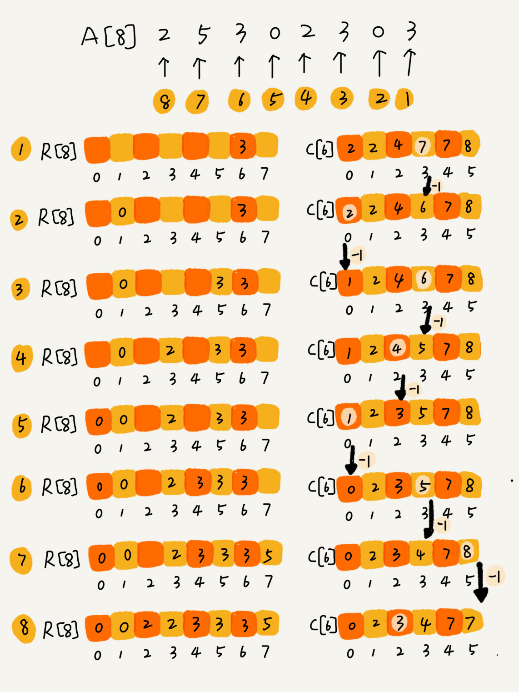

上面的过程有点复杂，我写成了代码，你可以对照着看下。

// 计数排序，a是数组，n是数组大小。假设数组中存储的都是非负整数。

public void countingSort(int[] a, int n) {

  if (n <= 1) return;

  // 查找数组中数据的范围

  int max = a[0];

  for (int i = 1; i < n; ++i) {

​    if (max < a[i]) {

​      max = a[i];

​    }

  }

  int[] c = new int[max + 1]; // 申请一个计数数组c，下标大小[0,max]

  for (int i = 0; i <= max; ++i) {

​    c[i] = 0;

  }

  // 计算每个元素的个数，放入c中

  for (int i = 0; i < n; ++i) {

​    c[a[i]]++;

  }

  // 依次累加

  for (int i = 1; i <= max; ++i) {

​    c[i] = c[i-1] + c[i];

  }

  // 临时数组r，存储排序之后的结果

  int[] r = new int[n];

  // 计算排序的关键步骤，有点难理解

  for (int i = n - 1; i >= 0; --i) {

​    int index = c[a[i]]-1;

​    r[index] = a[i];

​    c[a[i]]--;

  }

  // 将结果拷贝给a数组

  for (int i = 0; i < n; ++i) {

​    a[i] = r[i];

  }

}

这种利用另外一个数组来计数的实现方式是不是很巧妙呢？这也是为什么这种排序算法叫计数排序的原因。不过，你千万不要死记硬背上面的排序过程，重要的是理解和会用。

我总结一下，**计数排序只能用在数据范围不大的场景****中****，如果数据范围 k 比要排序的数据 n 大很多，就****不****适合用****计数****排序了。而且，****计数****排序只能****给****非负整数****排序****，如果要排序的数据是其他类型的，要****将****其在不改变相对大小的情况下，转化为非负整数。**

比如，还是拿考生这个例子。如果考生成绩精确到小数后一位，我们就需要将所有的分数都先乘以 10，转化成整数，然后再放到 9010 个桶内。再比如，如果要排序的数据中有负数，数据的范围是[-1000, 1000]，那我们就需要先对每个数据都加 1000，转化成非负整数。

## 基数排序（Radix sort）

我们再来看这样一个排序问题。假设我们有 10 万个手机号码，希望将这 10 万个手机号码从小到大排序，你有什么比较快速的排序方法呢？

我们之前讲的快排，时间复杂度可以做到 O(nlogn)，还有更高效的排序算法吗？桶排序、计数排序能派上用场吗？手机号码有 11 位，范围太大，显然不适合用这两种排序算法。针对这个排序问题，有没有时间复杂度是 O(n) 的算法呢？现在我就来介绍一种新的排序算法，基数排序。

刚刚这个问题里有这样的规律：假设要比较两个手机号码 a，b 的大小，如果在前面几位中，a 手机号码已经比 b 手机号码大了，那后面的几位就不用看了。

借助稳定排序算法，这里有一个巧妙的实现思路。还记得我们第 11 节中，在阐述排序算法的稳定性的时候举的订单的例子吗？我们这里也可以借助相同的处理思路，先按照最后一位来排序手机号码，然后，再按照倒数第二位重新排序，以此类推，最后按照第一位重新排序。经过 11 次排序之后，手机号码就都有序了。

手机号码稍微有点长，画图比较不容易看清楚，我用字符串排序的例子，画了一张基数排序的过程分解图，你可以看下。

注意，这里按照每位来排序的排序算法要是稳定的，否则这个实现思路就是不正确的。因为如果是非稳定排序算法，那最后一次排序只会考虑最高位的大小顺序，完全不管其他位的大小关系，那么低位的排序就完全没有意义了。

根据每一位来排序，我们可以用刚讲过的桶排序或者计数排序，它们的时间复杂度可以做到 O(n)。如果要排序的数据有 k 位，那我们就需要 k 次桶排序或者计数排序，总的时间复杂度是 O(k*n)。当 k 不大的时候，比如手机号码排序的例子，k 最大就是 11，所以基数排序的时间复杂度就近似于 O(n)。

实际上，有时候要排序的数据并不都是等长的，比如我们排序牛津字典中的 20 万个英文单词，最短的只有 1 个字母，最长的我特意去查了下，有 45 个字母，中文翻译是尘肺病。对于这种不等长的数据，基数排序还适用吗？

实际上，**我们可以把所有的单词补齐到相同长度，位数不够的可以在后面补“0”**，因为根据ASCII 值，所有字母都大于“0”，所以补“0”不会影响到原有的大小顺序。这样就可以继续用基数排序了。

我来总结一下，**基数排序对要排序的数据是有要求的，****需要可以分割出独立的“位”来比较，而且位之间有递进的关系，****如果 a 数据的高位比 b 数据大，那剩下的低位就不用比较了。除此之外，每一位的数据范围不能太大，要可以用线性排序算法来排序，否则，基数排序的时间复杂度就无法做到 O(n) 了**。

## 解答开篇

今天的内容学完了。我们再回过头来看看开篇的思考题：如何根据年龄给 100 万用户排序？现在思考题是不是变得非常简单了呢？我来说一下我的解决思路。

实际上，根据年龄给 100 万用户排序，就类似按照成绩给 50 万考生排序。我们假设年龄的范围最小 1 岁，最大不超过 120 岁。我们可以遍历这 100 万用户，根据年龄将其划分到这 120 个桶里，然后依次顺序遍历这 120 个桶中的元素。这样就得到了按照年龄排序的 100 万用户数据。

## 内容小结

今天，我们学习了 3 种线性时间复杂度的排序算法，有桶排序、计数排序、基数排序。它们对要排序的数据都有比较苛刻的要求，应用不是非常广泛。但是如果数据特征比较符合这些排序算法的要求，应用这些算法，会非常高效，线性时间复杂度可以达到 O(n)。

桶排序和计数排序的排序思想是非常相似的，都是针对范围不大的数据，将数据划分成不同的桶来实现排序。基数排序要求数据可以划分成高低位，位之间有递进关系。比较两个数，我们只需要比较高位，高位相同的再比较低位。而且每一位的数据范围不能太大，因为基数排序算法需要借助桶排序或者计数排序来完成每一个位的排序工作。

## 课后思考

我们今天讲的都是针对特殊数据的排序算法。实际上，还有很多看似是排序但又不需要使用排序算法就能处理的排序问题。

假设我们现在需要对 D，a，F，B，c，A，z 这个字符串进行排序，要求将其中所有小写字母都排在大写字母的前面，但小写字母内部和大写字母内部不要求有序。比如经过排序之后为 a，c，z，D，F，B，A，这个如何来实现呢？如果字符串中存储的不仅有大小写字母，还有数字。要将小写字母的放到前面，大写字母放在最后，数字放在中间，不用排序算法，又该怎么解决呢？

欢迎留言和我分享，我会第一时间给你反馈。

# 14 | 排序优化：如何实现一个通用的、高性能的排序函数？

王争 2018-10-22



00:00

[1.0x**](javascript:;)

讲述：修阳 大小：4.72M 时长：10:17

几乎所有的编程语言都会提供排序函数，比如 C 语言中 qsort()，C++ STL 中的 sort()、stable_sort()，还有 Java 语言中的 Collections.sort()。在平时的开发中，我们也都是直接使用这些现成的函数来实现业务逻辑中的排序功能。那你知道这些排序函数是如何实现的吗？底层都利用了哪种排序算法呢？

基于这些问题，今天我们就来看排序这部分的最后一块内容：**如何实现一个通用的、高性能的排序函数？**

## 如何选择合适的排序算法？

如果要实现一个通用的、高效率的排序函数，我们应该选择哪种排序算法？我们先回顾一下前面讲过的几种排序算法。

我们前面讲过，线性排序算法的时间复杂度比较低，适用场景比较特殊。所以如果要写一个通用的排序函数，不能选择线性排序算法。

如果对小规模数据进行排序，可以选择时间复杂度是 O(n2) 的算法；如果对大规模数据进行排序，时间复杂度是 O(nlogn) 的算法更加高效。所以，为了兼顾任意规模数据的排序，一般都会首选时间复杂度是 O(nlogn) 的排序算法来实现排序函数。

时间复杂度是 O(nlogn) 的排序算法不止一个，我们已经讲过的有归并排序、快速排序，后面讲堆的时候我们还会讲到堆排序。堆排序和快速排序都有比较多的应用，比如 Java 语言采用堆排序实现排序函数，C 语言使用快速排序实现排序函数。

不知道你有没有发现，使用归并排序的情况其实并不多。我们知道，快排在最坏情况下的时间复杂度是 O(n2)，而归并排序可以做到平均情况、最坏情况下的时间复杂度都是 O(nlogn)，从这点上看起来很诱人，那为什么它还是没能得到“宠信”呢？

还记得我们上一节讲的归并排序的空间复杂度吗？归并排序并不是原地排序算法，空间复杂度是 O(n)。所以，粗略点、夸张点讲，如果要排序 100MB 的数据，除了数据本身占用的内存之外，排序算法还要额外再占用 100MB 的内存空间，空间耗费就翻倍了。

前面我们讲到，快速排序比较适合来实现排序函数，但是，我们也知道，快速排序在最坏情况下的时间复杂度是 O(n2)，如何来解决这个“复杂度恶化”的问题呢？

## 如何优化快速排序？

我们先来看下，为什么最坏情况下快速排序的时间复杂度是 O(n2) 呢？我们前面讲过，如果数据原来就是有序的或者接近有序的，每次分区点都选择最后一个数据，那快速排序算法就会变得非常糟糕，时间复杂度就会退化为 O(n2)。实际上，**这种 O(n****2****) 时间复杂度出现的主要原因还是因为我们分区点选得不够合理**。

那什么样的分区点是好的分区点呢？或者说如何来选择分区点呢？

最理想的分区点是：**被分区点分开的两个分区中，数据的数量差不多**。

如果很粗暴地直接选择第一个或者最后一个数据作为分区点，不考虑数据的特点，肯定会出现之前讲的那样，在某些情况下，排序的最坏情况时间复杂度是 O(n2)。为了提高排序算法的性能，我们也要尽可能地让每次分区都比较平均。

我这里介绍两个比较常用、比较简单的分区算法，你可以直观地感受一下。

### 1. 三数取中法

我们从区间的首、尾、中间，分别取出一个数，然后对比大小，取这 3 个数的中间值作为分区点。这样每间隔某个固定的长度，取数据出来比较，将中间值作为分区点的分区算法，肯定要比单纯取某一个数据更好。但是，如果要排序的数组比较大，那“三数取中”可能就不够了，可能要“五数取中”或者“十数取中”。

### 2. 随机法

随机法就是每次从要排序的区间中，随机选择一个元素作为分区点。这种方法并不能保证每次分区点都选的比较好，但是从概率的角度来看，也不大可能会出现每次分区点都选得很差的情况，所以平均情况下，这样选的分区点是比较好的。时间复杂度退化为最糟糕的 O(n2) 的情况，出现的可能性不大。

好了，我这里也只是抛砖引玉，如果想了解更多寻找分区点的方法，你可以自己课下深入去学习一下。

我们知道，快速排序是用递归来实现的。我们在递归那一节讲过，递归要警惕堆栈溢出。为了避免快速排序里，递归过深而堆栈过小，导致堆栈溢出，我们有两种解决办法：第一种是限制递归深度。一旦递归过深，超过了我们事先设定的阈值，就停止递归。第二种是通过在堆上模拟实现一个函数调用栈，手动模拟递归压栈、出栈的过程，这样就没有了系统栈大小的限制。

## 举例分析排序函数

为了让你对如何实现一个排序函数有一个更直观的感受，我拿 Glibc 中的 qsort() 函数举例说明一下。虽说 qsort() 从名字上看，很像是基于快速排序算法实现的，实际上它并不仅仅用了快排这一种算法。

如果你去看源码，你就会发现，**qsort() 会优先使用归并排序来排序输入数据**，因为归并排序的空间复杂度是 O(n)，所以对于小数据量的排序，比如 1KB、2KB 等，归并排序额外需要 1KB、2KB 的内存空间，这个问题不大。现在计算机的内存都挺大的，我们很多时候追求的是速度。还记得我们前面讲过的用空间换时间的技巧吗？这就是一个典型的应用。

但如果数据量太大，就跟我们前面提到的，排序 100MB 的数据，这个时候我们再用归并排序就不合适了。所以，**要排序的数据量比较大的时候，qsort() 会改为用快速排序算法来排序**。

那 qsort() 是如何选择快速排序算法的分区点的呢？如果去看源码，你就会发现，qsort() 选择分区点的方法就是“三数取中法”。是不是也并不复杂？

还有我们前面提到的递归太深会导致堆栈溢出的问题，qsort() 是通过自己实现一个堆上的栈，手动模拟递归来解决的。我们之前在讲递归那一节也讲过，不知道你还有没有印象？

实际上，qsort() 并不仅仅用到了归并排序和快速排序，它还用到了插入排序。在快速排序的过程中，当要排序的区间中，元素的个数小于等于 4 时，qsort() 就退化为插入排序，不再继续用递归来做快速排序，因为我们前面也讲过，在小规模数据面前，**O(n****2****) 时间复杂度的算法并不一定比 O(nlogn) 的算法执行时间长**。我们现在就来分析下这个说法。

我们在讲复杂度分析的时候讲过，算法的性能可以通过时间复杂度来分析，但是，这种复杂度分析是比较偏理论的，如果我们深究的话，实际上时间复杂度并不等于代码实际的运行时间。

时间复杂度代表的是一个增长趋势，如果画成增长曲线图，你会发现 O(n2) 比 O(nlogn) 要陡峭，也就是说增长趋势要更猛一些。但是，我们前面讲过，在大 O 复杂度表示法中，我们会省略低阶、系数和常数，也就是说，O(nlogn) 在没有省略低阶、系数、常数之前可能是 O(knlogn + c)，而且 k 和 c 有可能还是一个比较大的数。

假设 k=1000，c=200，当我们对小规模数据（比如 n=100）排序时，n2的值实际上比 knlogn+c 还要小。

knlogn+c = 1000 * 100 * log100 + 200 远大于10000

n^2 = 100*100 = 10000

所以，对于小规模数据的排序，O(n2) 的排序算法并不一定比 O(nlogn) 排序算法执行的时间长。对于小数据量的排序，我们选择比较简单、不需要递归的插入排序算法。

还记得我们之前讲到的哨兵来简化代码，提高执行效率吗？在 qsort() 插入排序的算法实现中，也利用了这种编程技巧。虽然哨兵可能只是少做一次判断，但是毕竟排序函数是非常常用、非常基础的函数，性能的优化要做到极致。

好了，C 语言的 qsort() 我已经分析完了，你有没有觉得其实也不是很难？基本上都是用了我们前面讲到的知识点，有了前面的知识积累，看一些底层的类库的时候是不是也更容易了呢？

## 内容小结

今天我带你分析了一下如何来实现一个工业级的通用的、高效的排序函数，内容比较偏实战，而且贯穿了一些前面几节的内容，你要多看几遍。我们大部分排序函数都是采用 O(nlogn) 排序算法来实现，但是为了尽可能地提高性能，会做很多优化。

我还着重讲了快速排序的一些优化策略，比如合理选择分区点、避免递归太深等等。最后，我还带你分析了一个 C 语言中 qsort() 的底层实现原理，希望你对此能有一个更加直观的感受。

## 课后思考

在今天的内容中，我分析了 C 语言的中的 qsort() 的底层排序算法，你能否分析一下你所熟悉的语言中的排序函数都是用什么排序算法实现的呢？都有哪些优化技巧？

欢迎留言和我分享，我会第一时间给你反馈。

**特别说明：**

专栏已经更新一月有余，我在留言区看到很多同学说，希望给出课后思考题的标准答案。鉴于留言区里本身就有很多非常好的答案，之后我会将我认为比较好的答案置顶在留言区，供需要的同学参考。

如果文章发布一周后，留言里依旧没有比较好的答案，我会把我的答案写出来置顶在留言区。

最后，**希望你把思考的过程看得比标准答案更重要。**

# 15 | 二分查找（上）：如何用最省内存的方式实现快速查找功能？

王争 2018-10-24



00:00

[1.0x**](javascript:;)

讲述：修阳 大小：6.85M 时长：14:56

今天我们讲一种针对有序数据集合的查找算法：二分查找（Binary Search）算法，也叫折半查找算法。二分查找的思想非常简单，很多非计算机专业的同学很容易就能理解，但是看似越简单的东西往往越难掌握好，想要灵活应用就更加困难。

老规矩，我们还是来看一道思考题。

假设我们有 1000 万个整数数据，每个数据占 8 个字节，**如何设计数据结构和算法，快速判断某个整数是否出现在这 1000 万数据中？** 我们希望这个功能不要占用太多的内存空间，最多不要超过 100MB，你会怎么做呢？带着这个问题，让我们进入今天的内容吧！

## 无处不在的二分思想

二分查找是一种非常简单易懂的快速查找算法，生活中到处可见。比如说，我们现在来做一个猜字游戏。我随机写一个 0 到 99 之间的数字，然后你来猜我写的是什么。猜的过程中，你每猜一次，我就会告诉你猜的大了还是小了，直到猜中为止。你来想想，如何快速猜中我写的数字呢？

假设我写的数字是 23，你可以按照下面的步骤来试一试。（如果猜测范围的数字有偶数个，中间数有两个，就选择较小的那个。）

7 次就猜出来了，是不是很快？这个例子用的就是二分思想，按照这个思想，即便我让你猜的是 0 到 999 的数字，最多也只要 10 次就能猜中。不信的话，你可以试一试。

这是一个生活中的例子，我们现在回到实际的开发场景中。假设有 1000 条订单数据，已经按照订单金额从小到大排序，每个订单金额都不同，并且最小单位是元。我们现在想知道是否存在金额等于 19 元的订单。如果存在，则返回订单数据，如果不存在则返回 null。

最简单的办法当然是从第一个订单开始，一个一个遍历这 1000 个订单，直到找到金额等于 19 元的订单为止。但这样查找会比较慢，最坏情况下，可能要遍历完这 1000 条记录才能找到。那用二分查找能不能更快速地解决呢？

为了方便讲解，我们假设只有 10 个订单，订单金额分别是：8，11，19，23，27，33，45，55，67，98。

还是利用二分思想，每次都与区间的中间数据比对大小，缩小查找区间的范围。为了更加直观，我画了一张查找过程的图。其中，low 和 high 表示待查找区间的下标，mid 表示待查找区间的中间元素下标。

看懂这两个例子，你现在对二分的思想应该掌握得妥妥的了。我这里稍微总结升华一下，**二分查找针对的是一个有序的数据集合，查找思想有点类似分治思想。每次都通过跟区间的中间元素对比，将待查找的区间缩小为之前的一半，直到找到要查找的元素，或者区间被缩小为 0**。

## O(logn) 惊人的查找速度

二分查找是一种非常高效的查找算法，高效到什么程度呢？我们来分析一下它的时间复杂度。

我们假设数据大小是 n，每次查找后数据都会缩小为原来的一半，也就是会除以 2。最坏情况下，直到查找区间被缩小为空，才停止。

可以看出来，这是一个等比数列。其中 n/2k=1 时，k 的值就是总共缩小的次数。而每一次缩小操作只涉及两个数据的大小比较，所以，经过了 k 次区间缩小操作，时间复杂度就是 O(k)。通过 n/2k=1，我们可以求得 k=log2n，所以时间复杂度就是 O(logn)。

二分查找是我们目前为止遇到的第一个时间复杂度为 O(logn) 的算法。后面章节我们还会讲堆、二叉树的操作等等，它们的时间复杂度也是 O(logn)。我这里就再深入地讲讲 O(logn) 这种**对数时间复杂度**。这是一种极其高效的时间复杂度，有的时候甚至比时间复杂度是常量级 O(1) 的算法还要高效。为什么这么说呢？

因为 logn 是一个非常“恐怖”的数量级，即便 n 非常非常大，对应的 logn 也很小。比如 n 等于 2 的 32 次方，这个数很大了吧？大约是 42 亿。也就是说，如果我们在 42 亿个数据中用二分查找一个数据，最多需要比较 32 次。

我们前面讲过，用大 O 标记法表示时间复杂度的时候，会省略掉常数、系数和低阶。对于常量级时间复杂度的算法来说，O(1) 有可能表示的是一个非常大的常量值，比如 O(1000)、O(10000)。所以，常量级时间复杂度的算法有时候可能还没有 O(logn) 的算法执行效率高。

反过来，对数对应的就是指数。有一个非常著名的“阿基米德与国王下棋的故事”，你可以自行搜索一下，感受一下指数的“恐怖”。这也是为什么我们说，指数时间复杂度的算法在大规模数据面前是无效的。

## 二分查找的递归与非递归实现

实际上，简单的二分查找并不难写，注意我这里的“简单”二字。下一节，我们会讲到二分查找的变体问题，那才是真正烧脑的。今天，我们来看如何来写最简单的二分查找。

**最简单的情况**就是**有序数组中不存在重复元素**，我们在其中用二分查找值等于给定值的数据。我用 Java 代码实现了一个最简单的二分查找算法。

public int bsearch(int[] a, int n, int value) {

  int low = 0;

  int high = n - 1;

  while (low <= high) {

​    int mid = (low + high) / 2;

​    if (a[mid] == value) {

​      return mid;

​    } else if (a[mid] < value) {

​      low = mid + 1;

​    } else {

​      high = mid - 1;

​    }

  }

  return -1;

}

这个代码我稍微解释一下，low、high、mid 都是指数组下标，其中 low 和 high 表示当前查找的区间范围，初始 low=0， high=n-1。mid 表示[low, high]的中间位置。我们通过对比 a[mid]与 value 的大小，来更新接下来要查找的区间范围，直到找到或者区间缩小为 0，就退出。如果你有一些编程基础，看懂这些应该不成问题。现在，我就着重强调一下**容易出错的 3 个地方**。

### 1. 循环退出条件

注意是 low<=high，而不是 low<high。

### 2.mid 的取值

实际上，mid=(low+high)/2 这种写法是有问题的。因为如果 low 和 high 比较大的话，两者之和就有可能会溢出。改进的方法是将 mid 的计算方式写成 low+(high-low)/2。更进一步，如果要将性能优化到极致的话，我们可以将这里的除以 2 操作转化成位运算 low+((high-low)>>1)。因为相比除法运算来说，计算机处理位运算要快得多。

### 3.low 和 high 的更新

low=mid+1，high=mid-1。注意这里的 +1 和 -1，如果直接写成 low=mid 或者 high=mid，就可能会发生死循环。比如，当 high=3，low=3 时，如果 a[3]不等于 value，就会导致一直循环不退出。

如果你留意我刚讲的这三点，我想一个简单的二分查找你已经可以实现了。**实际上，二分查找除了用循环来实现，还可以****用****递归来实现**，过程也非常简单。

我用 Java 语言实现了一下这个过程，正好你可以借此机会回顾一下写递归代码的技巧。

// 二分查找的递归实现

public int bsearch(int[] a, int n, int val) {

  return bsearchInternally(a, 0, n - 1, val);

}

private int bsearchInternally(int[] a, int low, int high, int value) {

  if (low > high) return -1;

  int mid =  low + ((high - low) >> 1);

  if (a[mid] == value) {

​    return mid;

  } else if (a[mid] < value) {

​    return bsearchInternally(a, mid+1, high, value);

  } else {

​    return bsearchInternally(a, low, mid-1, value);

  }

}

## 二分查找应用场景的局限性

前面我们分析过，二分查找的时间复杂度是 O(logn)，查找数据的效率非常高。不过，并不是什么情况下都可以用二分查找，它的应用场景是有很大局限性的。那什么情况下适合用二分查找，什么情况下不适合呢？

**首先，二分查找依赖的是顺序表结构，简单点说就是数组。**

那二分查找能否依赖其他数据结构呢？比如链表。答案是不可以的，主要原因是二分查找算法需要按照下标随机访问元素。我们在数组和链表那两节讲过，数组按照下标随机访问数据的时间复杂度是 O(1)，而链表随机访问的时间复杂度是 O(n)。所以，如果数据使用链表存储，二分查找的时间复杂就会变得很高。

二分查找只能用在数据是通过顺序表来存储的数据结构上。如果你的数据是通过其他数据结构存储的，则无法应用二分查找。

**其次，二分查找针对的是有序数据。**

二分查找对这一点的要求比较苛刻，数据必须是有序的。如果数据没有序，我们需要先排序。前面章节里我们讲到，排序的时间复杂度最低是 O(nlogn)。所以，如果我们针对的是一组静态的数据，没有频繁地插入、删除，我们可以进行一次排序，多次二分查找。这样排序的成本可被均摊，二分查找的边际成本就会比较低。

但是，如果我们的数据集合有频繁的插入和删除操作，要想用二分查找，要么每次插入、删除操作之后保证数据仍然有序，要么在每次二分查找之前都先进行排序。针对这种动态数据集合，无论哪种方法，维护有序的成本都是很高的。

所以，二分查找只能用在插入、删除操作不频繁，一次排序多次查找的场景中。针对动态变化的数据集合，二分查找将不再适用。那针对动态数据集合，如何在其中快速查找某个数据呢？别急，等到二叉树那一节我会详细讲。

**再次，数据量太小不适合二分查找。**

如果要处理的数据量很小，完全没有必要用二分查找，顺序遍历就足够了。比如我们在一个大小为 10 的数组中查找一个元素，不管用二分查找还是顺序遍历，查找速度都差不多。只有数据量比较大的时候，二分查找的优势才会比较明显。

不过，这里有一个例外。如果数据之间的比较操作非常耗时，不管数据量大小，我都推荐使用二分查找。比如，数组中存储的都是长度超过 300 的字符串，如此长的两个字符串之间比对大小，就会非常耗时。我们需要尽可能地减少比较次数，而比较次数的减少会大大提高性能，这个时候二分查找就比顺序遍历更有优势。

**最后，****数据量太大也不适合二分查找。**

二分查找的底层需要依赖数组这种数据结构，而数组为了支持随机访问的特性，要求内存空间连续，对内存的要求比较苛刻。比如，我们有 1GB 大小的数据，如果希望用数组来存储，那就需要 1GB 的连续内存空间。

注意这里的“连续”二字，也就是说，即便有 2GB 的内存空间剩余，但是如果这剩余的 2GB 内存空间都是零散的，没有连续的 1GB 大小的内存空间，那照样无法申请一个 1GB 大小的数组。而我们的二分查找是作用在数组这种数据结构之上的，所以太大的数据用数组存储就比较吃力了，也就不能用二分查找了。

## 解答开篇

二分查找的理论知识你应该已经掌握了。我们来看下开篇的思考题：如何在 1000 万个整数中快速查找某个整数？

这个问题并不难。我们的内存限制是 100MB，每个数据大小是 8 字节，最简单的办法就是将数据存储在数组中，内存占用差不多是 80MB，符合内存的限制。借助今天讲的内容，我们可以先对这 1000 万数据从小到大排序，然后再利用二分查找算法，就可以快速地查找想要的数据了。

看起来这个问题并不难，很轻松就能解决。实际上，它暗藏了“玄机”。如果你对数据结构和算法有一定了解，知道散列表、二叉树这些支持快速查找的动态数据结构。你可能会觉得，用散列表和二叉树也可以解决这个问题。实际上是不行的。

虽然大部分情况下，用二分查找可以解决的问题，用散列表、二叉树都可以解决。但是，我们后面会讲，不管是散列表还是二叉树，都会需要比较多的额外的内存空间。如果用散列表或者二叉树来存储这 1000 万的数据，用 100MB 的内存肯定是存不下的。而二分查找底层依赖的是数组，除了数据本身之外，不需要额外存储其他信息，是最省内存空间的存储方式，所以刚好能在限定的内存大小下解决这个问题。

## 内容小结

今天我们学习了一种针对有序数据的高效查找算法，二分查找，它的时间复杂度是 O(logn)。

二分查找的核心思想理解起来非常简单，有点类似分治思想。即每次都通过跟区间中的中间元素对比，将待查找的区间缩小为一半，直到找到要查找的元素，或者区间被缩小为 0。但是二分查找的代码实现比较容易写错。你需要着重掌握它的三个容易出错的地方：循环退出条件、mid 的取值，low 和 high 的更新。

二分查找虽然性能比较优秀，但应用场景也比较有限。底层必须依赖数组，并且还要求数据是有序的。对于较小规模的数据查找，我们直接使用顺序遍历就可以了，二分查找的优势并不明显。二分查找更适合处理静态数据，也就是没有频繁的数据插入、删除操作。

## 课后思考

如何编程实现“求一个数的平方根”？要求精确到小数点后 6 位。

我刚才说了，如果数据使用链表存储，二分查找的时间复杂就会变得很高，那查找的时间复杂度究竟是多少呢？如果你自己推导一下，你就会深刻地认识到，为何我们会选择用数组而不是链表来实现二分查找了。

欢迎留言和我分享，我会第一时间给你反馈。

# 16 | 二分查找（下）：如何快速定位IP对应的省份地址？

王争 2018-10-26



00:00

[1.0x**](javascript:;)

讲述：修阳 大小：5.40M 时长：11:47

通过 IP 地址来查找 IP 归属地的功能，不知道你有没有用过？没用过也没关系，你现在可以打开百度，在搜索框里随便输一个 IP 地址，就会看到它的归属地。

这个功能并不复杂，它是通过维护一个很大的 IP 地址库来实现的。地址库中包括 IP 地址范围和归属地的对应关系。

当我们想要查询 202.102.133.13 这个 IP 地址的归属地时，我们就在地址库中搜索，发现这个 IP 地址落在[202.102.133.0, 202.102.133.255]这个地址范围内，那我们就可以将这个 IP 地址范围对应的归属地“山东东营市”显示给用户了。

[202.102.133.0, 202.102.133.255]  山东东营市 

[202.102.135.0, 202.102.136.255]  山东烟台 

[202.102.156.34, 202.102.157.255] 山东青岛 

[202.102.48.0, 202.102.48.255] 江苏宿迁 

[202.102.49.15, 202.102.51.251] 江苏泰州 

[202.102.56.0, 202.102.56.255] 江苏连云港

现在我的问题是，在庞大的地址库中逐一比对 IP 地址所在的区间，是非常耗时的。**假设我们有 12 万条这样的 IP 区间与归属地的对应关系，如何快速定位出一个 IP 地址的归属地呢？**

是不是觉得比较难？不要紧，等学完今天的内容，你就会发现这个问题其实很简单。

上一节我讲了二分查找的原理，并且介绍了最简单的一种二分查找的代码实现。今天我们来讲几种二分查找的变形问题。

不知道你有没有听过这样一个说法：“十个二分九个错”。二分查找虽然原理极其简单，但是想要写出没有 Bug 的二分查找并不容易。

唐纳德·克努特（Donald E.Knuth）在《计算机程序设计艺术》的第 3 卷《排序和查找》中说到：“尽管第一个二分查找算法于 1946 年出现，然而第一个完全正确的二分查找算法实现直到 1962 年才出现。”

你可能会说，我们上一节学的二分查找的代码实现并不难写啊。那是因为上一节讲的只是二分查找中最简单的一种情况，在不存在重复元素的有序数组中，查找值等于给定值的元素。最简单的二分查找写起来确实不难，但是，二分查找的变形问题就没那么好写了。

二分查找的变形问题很多，我只选择几个典型的来讲解，其他的你可以借助我今天讲的思路自己来分析。

需要特别说明一点，为了简化讲解，今天的内容，我都以数据是从小到大排列为前提，如果你要处理的数据是从大到小排列的，解决思路也是一样的。同时，我希望你最好先自己动手试着写一下这 4 个变形问题，然后再看我的讲述，这样你就会对我说的“二分查找比较难写”有更加深的体会了。

## 变体一：查找第一个值等于给定值的元素

上一节中的二分查找是最简单的一种，即有序数据集合中不存在重复的数据，我们在其中查找值等于某个给定值的数据。如果我们将这个问题稍微修改下，有序数据集合中存在重复的数据，我们希望找到第一个值等于给定值的数据，这样之前的二分查找代码还能继续工作吗？

比如下面这样一个有序数组，其中，a[5]，a[6]，a[7]的值都等于 8，是重复的数据。我们希望查找第一个等于 8 的数据，也就是下标是 5 的元素。

如果我们用上一节课讲的二分查找的代码实现，首先拿 8 与区间的中间值 a[4]比较，8 比 6 大，于是在下标 5 到 9 之间继续查找。下标 5 和 9 的中间位置是下标 7，a[7]正好等于 8，所以代码就返回了。

尽管 a[7]也等于 8，但它并不是我们想要找的第一个等于 8 的元素，因为第一个值等于 8 的元素是数组下标为 5 的元素。我们上一节讲的二分查找代码就无法处理这种情况了。所以，针对这个变形问题，我们可以稍微改造一下上一节的代码。

100 个人写二分查找就会有 100 种写法。网上有很多关于变形二分查找的实现方法，有很多写得非常简洁，比如下面这个写法。但是，尽管简洁，理解起来却非常烧脑，也很容易写错。

public int bsearch(int[] a, int n, int value) {

  int low = 0;

  int high = n - 1;

  while (low <= high) {

​    int mid = low + ((high - low) >> 1);

​    if (a[mid] >= value) {

​      high = mid - 1;

​    } else {

​      low = mid + 1;

​    }

  }

  if (low < n && a[low]==value) return low;

  else return -1;

}

看完这个实现之后，你是不是觉得很不好理解？如果你只是死记硬背这个写法，我敢保证，过不了几天，你就会全都忘光，再让你写，90% 的可能会写错。所以，我换了一种实现方法，你看看是不是更容易理解呢？

public int bsearch(int[] a, int n, int value) {

  int low = 0;

  int high = n - 1;

  while (low <= high) {

​    int mid =  low + ((high - low) >> 1);

​    if (a[mid] > value) {

​      high = mid - 1;

​    } else if (a[mid] < value) {

​      low = mid + 1;

​    } else {

​      if ((mid == 0) || (a[mid - 1] != value)) return mid;

​      else high = mid - 1;

​    }

  }

  return -1;

}

我来稍微解释一下这段代码。a[mid]跟要查找的 value 的大小关系有三种情况：大于、小于、等于。对于 a[mid]>value 的情况，我们需要更新 high= mid-1；对于 a[mid]<value 的情况，我们需要更新 low=mid+1。这两点都很好理解。那当 a[mid]=value 的时候应该如何处理呢？

如果我们查找的是任意一个值等于给定值的元素，当 a[mid]等于要查找的值时，a[mid]就是我们要找的元素。但是，如果我们求解的是第一个值等于给定值的元素，当 a[mid]等于要查找的值时，我们就需要确认一下这个 a[mid]是不是第一个值等于给定值的元素。

我们重点看第 11 行代码。如果 mid 等于 0，那这个元素已经是数组的第一个元素，那它肯定是我们要找的；如果 mid 不等于 0，但 a[mid]的前一个元素 a[mid-1]不等于 value，那也说明 a[mid]就是我们要找的第一个值等于给定值的元素。

如果经过检查之后发现 a[mid]前面的一个元素 a[mid-1]也等于 value，那说明此时的 a[mid]肯定不是我们要查找的第一个值等于给定值的元素。那我们就更新 high=mid-1，因为要找的元素肯定出现在[low, mid-1]之间。

对比上面的两段代码，是不是下面那种更好理解？实际上，**很多人都觉得变形的二分查找很难写，主要原因是太追求第一种那样完美、简洁的写法**。而对于我们做工程开发的人来说，代码易读懂、没 Bug，其实更重要，所以我觉得第二种写法更好。

## 变体二：查找最后一个值等于给定值的元素

前面的问题是查找第一个值等于给定值的元素，我现在把问题稍微改一下，查找最后一个值等于给定值的元素，又该如何做呢？

如果你掌握了前面的写法，那这个问题你应该很轻松就能解决。你可以先试着实现一下，然后跟我写的对比一下。

public int bsearch(int[] a, int n, int value) {

  int low = 0;

  int high = n - 1;

  while (low <= high) {

​    int mid =  low + ((high - low) >> 1);

​    if (a[mid] > value) {

​      high = mid - 1;

​    } else if (a[mid] < value) {

​      low = mid + 1;

​    } else {

​      if ((mid == n - 1) || (a[mid + 1] != value)) return mid;

​      else low = mid + 1;

​    }

  }

  return -1;

}

我们还是重点看第 11 行代码。如果 a[mid]这个元素已经是数组中的最后一个元素了，那它肯定是我们要找的；如果 a[mid]的后一个元素 a[mid+1]不等于 value，那也说明 a[mid]就是我们要找的最后一个值等于给定值的元素。

如果我们经过检查之后，发现 a[mid]后面的一个元素 a[mid+1]也等于 value，那说明当前的这个 a[mid]并不是最后一个值等于给定值的元素。我们就更新 low=mid+1，因为要找的元素肯定出现在[mid+1, high]之间。

## 变体三：查找第一个大于等于给定值的元素

现在我们再来看另外一类变形问题。在有序数组中，查找第一个大于等于给定值的元素。比如，数组中存储的这样一个序列：3，4，6，7，10。如果查找第一个大于等于 5 的元素，那就是 6。

实际上，实现的思路跟前面的那两种变形问题的实现思路类似，代码写起来甚至更简洁。

public int bsearch(int[] a, int n, int value) {

  int low = 0;

  int high = n - 1;

  while (low <= high) {

​    int mid =  low + ((high - low) >> 1);

​    if (a[mid] >= value) {

​      if ((mid == 0) || (a[mid - 1] < value)) return mid;

​      else high = mid - 1;

​    } else {

​      low = mid + 1;

​    }

  }

  return -1;

}

如果 a[mid]小于要查找的值 value，那要查找的值肯定在[mid+1, high]之间，所以，我们更新 low=mid+1。

对于 a[mid]大于等于给定值 value 的情况，我们要先看下这个 a[mid]是不是我们要找的第一个值大于等于给定值的元素。如果 a[mid]前面已经没有元素，或者前面一个元素小于要查找的值 value，那 a[mid]就是我们要找的元素。这段逻辑对应的代码是第 7 行。

如果 a[mid-1]也大于等于要查找的值 value，那说明要查找的元素在[low, mid-1]之间，所以，我们将 high 更新为 mid-1。

## 变体四：查找最后一个小于等于给定值的元素

现在，我们来看最后一种二分查找的变形问题，查找最后一个小于等于给定值的元素。比如，数组中存储了这样一组数据：3，5，6，8，9，10。最后一个小于等于 7 的元素就是 6。是不是有点类似上面那一种？实际上，实现思路也是一样的。

有了前面的基础，你完全可以自己写出来了，所以我就不详细分析了。我把代码贴出来，你可以写完之后对比一下。

public int bsearch7(int[] a, int n, int value) {

  int low = 0;

  int high = n - 1;

  while (low <= high) {

​    int mid =  low + ((high - low) >> 1);

​    if (a[mid] > value) {

​      high = mid - 1;

​    } else {

​      if ((mid == n - 1) || (a[mid + 1] > value)) return mid;

​      else low = mid + 1;

​    }

  }

  return -1;

}

## 解答开篇

好了，现在我们回头来看开篇的问题：如何快速定位出一个 IP 地址的归属地？

现在这个问题应该很简单了。如果 IP 区间与归属地的对应关系不经常更新，我们可以先预处理这 12 万条数据，让其按照起始 IP 从小到大排序。如何来排序呢？我们知道，IP 地址可以转化为 32 位的整型数。所以，我们可以将起始地址，按照对应的整型值的大小关系，从小到大进行排序。

然后，这个问题就可以转化为我刚讲的第四种变形问题“在有序数组中，查找最后一个小于等于某个给定值的元素”了。

当我们要查询某个 IP 归属地时，我们可以先通过二分查找，找到最后一个起始 IP 小于等于这个 IP 的 IP 区间，然后，检查这个 IP 是否在这个 IP 区间内，如果在，我们就取出对应的归属地显示；如果不在，就返回未查找到。

## 内容小结

上一节我说过，凡是用二分查找能解决的，绝大部分我们更倾向于用散列表或者二叉查找树。即便是二分查找在内存使用上更节省，但是毕竟内存如此紧缺的情况并不多。那二分查找真的没什么用处了吗？

实际上，上一节讲的求“值等于给定值”的二分查找确实不怎么会被用到，二分查找更适合用在“近似”查找问题，在这类问题上，二分查找的优势更加明显。比如今天讲的这几种变体问题，用其他数据结构，比如散列表、二叉树，就比较难实现了。

变体的二分查找算法写起来非常烧脑，很容易因为细节处理不好而产生 Bug，这些容易出错的细节有：**终止条件、区间上下界更新方法、返回值选择**。所以今天的内容你最好能用自己实现一遍，对锻炼编码能力、逻辑思维、写出 Bug free 代码，会很有帮助。

## 课后思考

我们今天讲的都是非常规的二分查找问题，今天的思考题也是一个非常规的二分查找问题。如果有序数组是一个循环有序数组，比如 4，5，6，1，2，3。针对这种情况，如何实现一个求“值等于给定值”的二分查找算法呢？

欢迎留言和我分享，我会第一时间给你反馈。

# 17 | 跳表：为什么Redis一定要用跳表来实现有序集合？

王争 2018-10-29



00:00

[1.0x**](javascript:;)

讲述：修阳 大小：6.94M 时长：15:08

上两节我们讲了二分查找算法。当时我讲到，因为二分查找底层依赖的是数组随机访问的特性，所以只能用数组来实现。如果数据存储在链表中，就真的没法用二分查找算法了吗？

实际上，我们只需要对链表稍加改造，就可以支持类似“二分”的查找算法。我们把改造之后的数据结构叫做**跳表**（Skip list），也就是今天要讲的内容。

跳表这种数据结构对你来说，可能会比较陌生，因为一般的数据结构和算法书籍里都不怎么会讲。但是它确实是一种各方面性能都比较优秀的**动态数据结构**，可以支持快速地插入、删除、查找操作，写起来也不复杂，甚至可以替代红黑树（Red-black tree）。

Redis 中的有序集合（Sorted Set）就是用跳表来实现的。如果你有一定基础，应该知道红黑树也可以实现快速地插入、删除和查找操作。**那 Redis 为什么会选择用跳表来实现有序集合呢？** 为什么不用红黑树呢？学完今天的内容，你就知道答案了。

## 如何理解“跳表”？

对于一个单链表来讲，即便链表中存储的数据是有序的，如果我们要想在其中查找某个数据，也只能从头到尾遍历链表。这样查找效率就会很低，时间复杂度会很高，是 O(n)。

那怎么来提高查找效率呢？如果像图中那样，对链表建立一级“索引”，查找起来是不是就会更快一些呢？每两个结点提取一个结点到上一级，我们把抽出来的那一级叫做**索引**或**索引层**。你可以看我画的图。图中的 down 表示 down 指针，指向下一级结点。

如果我们现在要查找某个结点，比如 16。我们可以先在索引层遍历，当遍历到索引层中值为 13 的结点时，我们发现下一个结点是 17，那要查找的结点 16 肯定就在这两个结点之间。然后我们通过索引层结点的 down 指针，下降到原始链表这一层，继续遍历。这个时候，我们只需要再遍历 2 个结点，就可以找到值等于 16 的这个结点了。这样，原来如果要查找 16，需要遍历 10 个结点，现在只需要遍历 7 个结点。

从这个例子里，我们看出，**加来一层索引之后，查找一个结点需要遍历的结点个数减少了，也就是说查找效率提高了**。那如果我们再加一级索引呢？效率会不会提升更多呢？

跟前面建立第一级索引的方式相似，我们在第一级索引的基础之上，每两个结点就抽出一个结点到第二级索引。现在我们再来查找 16，只需要遍历 6 个结点了，需要遍历的结点数量又减少了。

我举的例子数据量不大，所以即便加了两级索引，查找效率的提升也并不明显。为了让你能真切地感受索引提升查询效率。我画了一个包含 64 个结点的链表，按照前面讲的这种思路，建立了五级索引。

从图中我们可以看出，原来没有索引的时候，查找 62 需要遍历 62 个结点，现在只需要遍历 11 个结点，速度是不是提高了很多？所以，当链表的长度 n 比较大时，比如 1000、10000 的时候，在构建索引之后，查找效率的提升就会非常明显。

前面讲的**这种链表****加****多****级****索引的结构，就是跳表**。我通过例子给你展示了跳表是如何减少查询次数的，现在你应该比较清晰地知道，跳表确实是可以提高查询效率的。接下来，我会定量地分析一下，用跳表查询到底有多快。

## 用跳表查询到底有多快？

前面我讲过，算法的执行效率可以通过时间复杂度来度量，这里依旧可以用。我们知道，在一个单链表中查询某个数据的时间复杂度是 O(n)。那在一个具有多级索引的跳表中，查询某个数据的时间复杂度是多少呢？

这个时间复杂度的分析方法比较难想到。我把问题分解一下，先来看这样一个问题，如果链表里有 n 个结点，会有多少级索引呢？

按照我们刚才讲的，每两个结点会抽出一个结点作为上一级索引的结点，那第一级索引的结点个数大约就是 n/2，第二级索引的结点个数大约就是 n/4，第三级索引的结点个数大约就是 n/8，依次类推，也就是说，**第 k 级索引的结点个数是第 k-1 级索引的结点个数的 1/2，****那****第 k****级****索引结点的个数就是 n/(2****k****)。**

假设索引有 h 级，最高级的索引有 2 个结点。通过上面的公式，我们可以得到 n/(2h)=2，从而求得 h=log2n-1。如果包含原始链表这一层，整个跳表的高度就是 log2n。我们在跳表中查询某个数据的时候，如果每一层都要遍历 m 个结点，那在跳表中查询一个数据的时间复杂度就是 O(m*logn)。

那这个 m 的值是多少呢？按照前面这种索引结构，我们每一级索引都最多只需要遍历 3 个结点，也就是说 m=3，为什么是 3 呢？我来解释一下。

假设我们要查找的数据是 x，在第 k 级索引中，我们遍历到 y 结点之后，发现 x 大于 y，小于后面的结点 z，所以我们通过 y 的 down 指针，从第 k 级索引下降到第 k-1 级索引。在第 k-1 级索引中，y 和 z 之间只有 3 个结点（包含 y 和 z），所以，我们在 K-1 级索引中最多只需要遍历 3 个结点，依次类推，每一级索引都最多只需要遍历 3 个结点。

通过上面的分析，我们得到 m=3，所以在跳表中查询任意数据的时间复杂度就是 O(logn)。这个查找的时间复杂度跟二分查找是一样的。换句话说，我们其实是基于单链表实现了二分查找，是不是很神奇？不过，天下没有免费的午餐，这种查询效率的提升，前提是建立了很多级索引，也就是我们在第 6 节讲过的空间换时间的设计思路。

## 跳表是不是很浪费内存？

比起单纯的单链表，跳表需要存储多级索引，肯定要消耗更多的存储空间。那到底需要消耗多少额外的存储空间呢？我们来分析一下跳表的空间复杂度。

跳表的空间复杂度分析并不难，我在前面说了，假设原始链表大小为 n，那第一级索引大约有 n/2 个结点，第二级索引大约有 n/4 个结点，以此类推，每上升一级就减少一半，直到剩下 2 个结点。如果我们把每层索引的结点数写出来，就是一个等比数列。

这几级索引的结点总和就是 n/2+n/4+n/8…+8+4+2=n-2。所以，跳表的空间复杂度是 O(n)。也就是说，如果将包含 n 个结点的单链表构造成跳表，我们需要额外再用接近 n 个结点的存储空间。那我们有没有办法降低索引占用的内存空间呢？

我们前面都是每两个结点抽一个结点到上级索引，如果我们每三个结点或五个结点，抽一个结点到上级索引，是不是就不用那么多索引结点了呢？我画了一个每三个结点抽一个的示意图，你可以看下。

从图中可以看出，第一级索引需要大约 n/3 个结点，第二级索引需要大约 n/9 个结点。每往上一级，索引结点个数都除以 3。为了方便计算，我们假设最高一级的索引结点个数是 1。我们把每级索引的结点个数都写下来，也是一个等比数列。

通过等比数列求和公式，总的索引结点大约就是 n/3+n/9+n/27+…+9+3+1=n/2。尽管空间复杂度还是 O(n)，但比上面的每两个结点抽一个结点的索引构建方法，要减少了一半的索引结点存储空间。

实际上，在软件开发中，我们不必太在意索引占用的额外空间。在讲数据结构和算法时，我们习惯性地把要处理的数据看成整数，但是在实际的软件开发中，原始链表中存储的有可能是很大的对象，而索引结点只需要存储关键值和几个指针，并不需要存储对象，所以当对象比索引结点大很多时，那索引占用的额外空间就可以忽略了。

## 高效的动态插入和删除

跳表长什么样子我想你应该已经很清楚了，它的查找操作我们刚才也讲过了。实际上，跳表这个动态数据结构，不仅支持查找操作，还支持动态的插入、删除操作，而且插入、删除操作的时间复杂度也是 O(logn)。

我们现在来看下， 如何在跳表中插入一个数据，以及它是如何做到 O(logn) 的时间复杂度的？

我们知道，在单链表中，一旦定位好要插入的位置，插入结点的时间复杂度是很低的，就是 O(1)。但是，这里为了保证原始链表中数据的有序性，我们需要先找到要插入的位置，这个查找操作就会比较耗时。

对于纯粹的单链表，需要遍历每个结点，来找到插入的位置。但是，对于跳表来说，我们讲过查找某个结点的时间复杂度是 O(logn)，所以这里查找某个数据应该插入的位置，方法也是类似的，时间复杂度也是 O(logn)。我画了一张图，你可以很清晰地看到插入的过程。

好了，我们再来看删除操作。

如果这个结点在索引中也有出现，我们除了要删除原始链表中的结点，还要删除索引中的。因为单链表中的删除操作需要拿到要删除结点的前驱结点，然后通过指针操作完成删除。所以在查找要删除的结点的时候，一定要获取前驱结点。当然，如果我们用的是双向链表，就不需要考虑这个问题了。

## 跳表索引动态更新

当我们不停地往跳表中插入数据时，如果我们不更新索引，就有可能出现某 2 个索引结点之间数据非常多的情况。极端情况下，跳表还会退化成单链表。

作为一种动态数据结构，我们需要某种手段来维护索引与原始链表大小之间的平衡，也就是说，如果链表中结点多了，索引结点就相应地增加一些，避免复杂度退化，以及查找、插入、删除操作性能下降。

如果你了解红黑树、AVL 树这样平衡二叉树，你就知道它们是通过左右旋的方式保持左右子树的大小平衡（如果不了解也没关系，我们后面会讲），而跳表是通过随机函数来维护前面提到的“平衡性”。

当我们往跳表中插入数据的时候，我们可以选择同时将这个数据插入到部分索引层中。如何选择加入哪些索引层呢？

我们通过一个随机函数，来决定将这个结点插入到哪几级索引中，比如随机函数生成了值 K，那我们就将这个结点添加到第一级到第 K 级这 K 级索引中。

随机函数的选择很有讲究，从概率上来讲，能够保证跳表的索引大小和数据大小平衡性，不至于性能过度退化。至于随机函数的选择，我就不展开讲解了。如果你感兴趣的话，可以看看我在 GitHub 上的代码或者 Redis 中关于有序集合的跳表实现。

跳表的实现还是稍微有点复杂的，我将 Java 实现的代码放到了 GitHub 中，你可以根据我刚刚的讲解，对照着代码仔细思考一下。你不用死记硬背代码，跳表的实现并不是我们这节的重点。

## 解答开篇

今天的内容到此就讲完了。现在，我来讲解一下开篇的思考题：为什么 Redis 要用跳表来实现有序集合，而不是红黑树？

Redis 中的有序集合是通过跳表来实现的，严格点讲，其实还用到了散列表。不过散列表我们后面才会讲到，所以我们现在暂且忽略这部分。如果你去查看 Redis 的开发手册，就会发现，Redis 中的有序集合支持的核心操作主要有下面这几个：

插入一个数据；

删除一个数据；

查找一个数据；

按照区间查找数据（比如查找值在[100, 356]之间的数据）；

迭代输出有序序列。

其中，插入、删除、查找以及迭代输出有序序列这几个操作，红黑树也可以完成，时间复杂度跟跳表是一样的。但是，按照区间来查找数据这个操作，红黑树的效率没有跳表高。

对于按照区间查找数据这个操作，跳表可以做到 O(logn) 的时间复杂度定位区间的起点，然后在原始链表中顺序往后遍历就可以了。这样做非常高效。

当然，Redis 之所以用跳表来实现有序集合，还有其他原因，比如，跳表更容易代码实现。虽然跳表的实现也不简单，但比起红黑树来说还是好懂、好写多了，而简单就意味着可读性好，不容易出错。还有，跳表更加灵活，它可以通过改变索引构建策略，有效平衡执行效率和内存消耗。

不过，跳表也不能完全替代红黑树。因为红黑树比跳表的出现要早一些，很多编程语言中的 Map 类型都是通过红黑树来实现的。我们做业务开发的时候，直接拿来用就可以了，不用费劲自己去实现一个红黑树，但是跳表并没有一个现成的实现，所以在开发中，如果你想使用跳表，必须要自己实现。

## 内容小结

今天我们讲了跳表这种数据结构。跳表使用空间换时间的设计思路，通过构建多级索引来提高查询的效率，实现了基于链表的“二分查找”。跳表是一种动态数据结构，支持快速地插入、删除、查找操作，时间复杂度都是 O(logn)。

跳表的空间复杂度是 O(n)。不过，跳表的实现非常灵活，可以通过改变索引构建策略，有效平衡执行效率和内存消耗。虽然跳表的代码实现并不简单，但是作为一种动态数据结构，比起红黑树来说，实现要简单多了。所以很多时候，我们为了代码的简单、易读，比起红黑树，我们更倾向用跳表。

## 课后思考

在今天的内容中，对于跳表的时间复杂度分析，我分析了每两个结点提取一个结点作为索引的时间复杂度。如果每三个或者五个结点提取一个结点作为上级索引，对应的在跳表中查询数据的时间复杂度是多少呢？

欢迎留言和我分享，我会第一时间给你反馈。

我已将本节内容相关的详细代码更新到 GitHub，戳此即可查看。

# 18 | 散列表（上）：Word文档中的单词拼写检查功能是如何实现的？

王争 2018-10-31



00:00

[1.0x**](javascript:;)

讲述：修阳 大小：6.26M 时长：13:39

Word 这种文本编辑器你平时应该经常用吧，那你有没有留意过它的拼写检查功能呢？一旦我们在 Word 里输入一个错误的英文单词，它就会用标红的方式提示“拼写错误”。**Word 的这个单词拼写检查功能，虽然很小但却非常实用。你有没有想过，这个功能是如何实现的呢？**

其实啊，一点儿都不难。只要你学完今天的内容，**散列表**（Hash Table）。你就能像微软 Office 的工程师一样，轻松实现这个功能。

## 散列思想

散列表的英文叫“Hash Table”，我们平时也叫它“哈希表”或者“Hash 表”，你一定也经常听过它，我在前面的文章里，也不止一次提到过，但是你是不是真的理解这种数据结构呢？

**散列表用的是数组支持按照下标随机访问数据的特性，所以散列表其实就是数组的一种扩展，由数组演化而来。可以说，如果没有数组，就没有散列表。**

我用一个例子来解释一下。假如我们有 89 名选手参加学校运动会。为了方便记录成绩，每个选手胸前都会贴上自己的参赛号码。这 89 名选手的编号依次是 1 到 89。现在我们希望编程实现这样一个功能，通过编号快速找到对应的选手信息。你会怎么做呢？

我们可以把这 89 名选手的信息放在数组里。编号为 1 的选手，我们放到数组中下标为 1 的位置；编号为 2 的选手，我们放到数组中下标为 2 的位置。以此类推，编号为 k 的选手放到数组中下标为 k 的位置。

因为参赛编号跟数组下标一一对应，当我们需要查询参赛编号为 x 的选手的时候，我们只需要将下标为 x 的数组元素取出来就可以了，时间复杂度就是 O(1)。这样按照编号查找选手信息，效率是不是很高？

实际上，这个例子已经用到了散列的思想。在这个例子里，参赛编号是自然数，并且与数组的下标形成一一映射，所以利用数组支持根据下标随机访问的时候，时间复杂度是 O(1) 这一特性，就可以实现快速查找编号对应的选手信息。

你可能要说了，这个例子中蕴含的散列思想还不够明显，那我来改造一下这个例子。

假设校长说，参赛编号不能设置得这么简单，要加上年级、班级这些更详细的信息，所以我们把编号的规则稍微修改了一下，用 6 位数字来表示。比如 051167，其中，前两位 05 表示年级，中间两位 11 表示班级，最后两位还是原来的编号 1 到 89。这个时候我们该如何存储选手信息，才能够支持通过编号来快速查找选手信息呢？

思路还是跟前面类似。尽管我们不能直接把编号作为数组下标，但我们可以截取参赛编号的后两位作为数组下标，来存取选手信息数据。当通过参赛编号查询选手信息的时候，我们用同样的方法，取参赛编号的后两位，作为数组下标，来读取数组中的数据。

这就是典型的散列思想。其中，参赛选手的编号我们叫做**键**（key）或者**关键字**。我们用它来标识一个选手。我们把参赛编号转化为数组下标的映射方法就叫作**散列函数**（或“Hash 函数”“哈希函数”），而散列函数计算得到的值就叫作**散列值**（或“Hash 值”“哈希值”）。

通过这个例子，我们可以总结出这样的规律：散列表用的就是数组支持按照下标随机访问的时候，时间复杂度是 O(1) 的特性。我们通过散列函数把元素的键值映射为下标，然后将数据存储在数组中对应下标的位置。当我们按照键值查询元素时，我们用同样的散列函数，将键值转化数组下标，从对应的数组下标的位置取数据。

## 散列函数

从上面的例子我们可以看到，散列函数在散列表中起着非常关键的作用。现在我们就来学习下散列函数。

散列函数，顾名思义，它是一个函数。我们可以把它定义成 **hash(key)**，其中 key 表示元素的键值，hash(key) 的值表示经过散列函数计算得到的散列值。

那第一个例子中，编号就是数组下标，所以 hash(key) 就等于 key。改造后的例子，写成散列函数稍微有点复杂。我用伪代码将它写成函数就是下面这样：

int hash(String key) {

  // 获取后两位字符

  string lastTwoChars = key.substr(length-2, length);

  // 将后两位字符转换为整数

  int hashValue = convert lastTwoChas to int-type;

  return hashValue;

}

刚刚举的学校运动会的例子，散列函数比较简单，也比较容易想到。但是，如果参赛选手的编号是随机生成的 6 位数字，又或者用的是 a 到 z 之间的字符串，**该如何构造散列函数呢？****我总结了三点****散列函数****设计的****基本要求**：

散列函数计算得到的散列值是一个非负整数；

如果 key1 = key2，那 hash(key1) == hash(key2)；

如果 key1 ≠ key2，那 hash(key1) ≠ hash(key2)。

我来解释一下这三点。其中，第一点理解起来应该没有任何问题。因为数组下标是从 0 开始的，所以散列函数生成的散列值也要是非负整数。第二点也很好理解。相同的 key，经过散列函数得到的散列值也应该是相同的。

第三点理解起来可能会有问题，我着重说一下。这个要求看起来合情合理，但是在真实的情况下，要想找到一个不同的 key 对应的散列值都不一样的散列函数，几乎是不可能的。即便像业界著名的MD5、SHA、CRC等哈希算法，也无法完全避免这种**散列冲突**。而且，因为数组的存储空间有限，也会加大散列冲突的概率。

所以我们几乎无法找到一个完美的无冲突的散列函数，即便能找到，付出的时间成本、计算成本也是很大的，所以针对散列冲突问题，我们需要通过其他途径来解决。

## 散列冲突

再好的散列函数也无法避免散列冲突。那究竟该如何解决散列冲突问题呢？我们常用的散列冲突解决方法有两类，开放寻址法（open addressing）和链表法（chaining）。

### 1. 开放寻址法

开放寻址法的核心思想是，如果出现了散列冲突，我们就重新探测一个空闲位置，将其插入。那如何重新探测新的位置呢？我先讲一个比较简单的探测方法，**线性探测**（Linear Probing）。

当我们往散列表中插入数据时，如果某个数据经过散列函数散列之后，存储位置已经被占用了，我们就从当前位置开始，依次往后查找，看是否有空闲位置，直到找到为止。

我说的可能比较抽象，我举一个例子具体给你说明一下。这里面黄色的色块表示空闲位置，橙色的色块表示已经存储了数据。

从图中可以看出，散列表的大小为 10，在元素 x 插入散列表之前，已经 6 个元素插入到散列表中。x 经过 Hash 算法之后，被散列到位置下标为 7 的位置，但是这个位置已经有数据了，所以就产生了冲突。于是我们就顺序地往后一个一个找，看有没有空闲的位置，遍历到尾部都没有找到空闲的位置，于是我们再从表头开始找，直到找到空闲位置 2，于是将其插入到这个位置。

在散列表中查找元素的过程有点儿类似插入过程。我们通过散列函数求出要查找元素的键值对应的散列值，然后比较数组中下标为散列值的元素和要查找的元素。如果相等，则说明就是我们要找的元素；否则就顺序往后依次查找。如果遍历到数组中的空闲位置，还没有找到，就说明要查找的元素并没有在散列表中。

散列表跟数组一样，不仅支持插入、查找操作，还支持删除操作。对于使用线性探测法解决冲突的散列表，删除操作稍微有些特别。我们不能单纯地把要删除的元素设置为空。这是为什么呢？

还记得我们刚讲的查找操作吗？在查找的时候，一旦我们通过线性探测方法，找到一个空闲位置，我们就可以认定散列表中不存在这个数据。但是，如果这个空闲位置是我们后来删除的，就会导致原来的查找算法失效。本来存在的数据，会被认定为不存在。这个问题如何解决呢？

我们可以将删除的元素，特殊标记为 deleted。当线性探测查找的时候，遇到标记为 deleted 的空间，并不是停下来，而是继续往下探测。

你可能已经发现了，线性探测法其实存在很大问题。当散列表中插入的数据越来越多时，散列冲突发生的可能性就会越来越大，空闲位置会越来越少，线性探测的时间就会越来越久。极端情况下，我们可能需要探测整个散列表，所以最坏情况下的时间复杂度为 O(n)。同理，在删除和查找时，也有可能会线性探测整张散列表，才能找到要查找或者删除的数据。

对于开放寻址冲突解决方法，除了线性探测方法之外，还有另外两种比较经典的探测方法，**二次探测**（Quadratic probing）和**双重散列**（Double hashing）。

所谓二次探测，跟线性探测很像，线性探测每次探测的步长是 1，那它探测的下标序列就是 hash(key)+0，hash(key)+1，hash(key)+2……而二次探测探测的步长就变成了原来的“二次方”，也就是说，它探测的下标序列就是 hash(key)+0，hash(key)+12，hash(key)+22……

所谓双重散列，意思就是不仅要使用一个散列函数。我们使用一组散列函数 hash1(key)，hash2(key)，hash3(key)……我们先用第一个散列函数，如果计算得到的存储位置已经被占用，再用第二个散列函数，依次类推，直到找到空闲的存储位置。

不管采用哪种探测方法，当散列表中空闲位置不多的时候，散列冲突的概率就会大大提高。为了尽可能保证散列表的操作效率，一般情况下，我们会尽可能保证散列表中有一定比例的空闲槽位。我们用**装载因子**（load factor）来表示空位的多少。

装载因子的计算公式是：

散列表的装载因子=填入表中的元素个数/散列表的长度

装载因子越大，说明空闲位置越少，冲突越多，散列表的性能会下降。

### 2. 链表法

链表法是一种更加常用的散列冲突解决办法，相比开放寻址法，它要简单很多。我们来看这个图，在散列表中，每个“桶（bucket）”或者“槽（slot）”会对应一条链表，所有散列值相同的元素我们都放到相同槽位对应的链表中。

当插入的时候，我们只需要通过散列函数计算出对应的散列槽位，将其插入到对应链表中即可，所以插入的时间复杂度是 O(1)。当查找、删除一个元素时，我们同样通过散列函数计算出对应的槽，然后遍历链表查找或者删除。那查找或删除操作的时间复杂度是多少呢？

实际上，这两个操作的时间复杂度跟链表的长度 k 成正比，也就是 O(k)。对于散列比较均匀的散列函数来说，理论上讲，k=n/m，其中 n 表示散列中数据的个数，m 表示散列表中“槽”的个数。

## 解答开篇

有了前面这些基本知识储备，我们来看一下开篇的思考题：Word 文档中单词拼写检查功能是如何实现的？

常用的英文单词有 20 万个左右，假设单词的平均长度是 10 个字母，平均一个单词占用 10 个字节的内存空间，那 20 万英文单词大约占 2MB 的存储空间，就算放大 10 倍也就是 20MB。对于现在的计算机来说，这个大小完全可以放在内存里面。所以我们可以用散列表来存储整个英文单词词典。

当用户输入某个英文单词时，我们拿用户输入的单词去散列表中查找。如果查到，则说明拼写正确；如果没有查到，则说明拼写可能有误，给予提示。借助散列表这种数据结构，我们就可以轻松实现快速判断是否存在拼写错误。

## 内容小结

今天我讲了一些比较基础、比较偏理论的散列表知识，包括散列表的由来、散列函数、散列冲突的解决方法。

散列表来源于数组，它借助散列函数对数组这种数据结构进行扩展，利用的是数组支持按照下标随机访问元素的特性。散列表两个核心问题是**散列函数设计**和**散列冲突解决**。散列冲突有两种常用的解决方法，开放寻址法和链表法。散列函数设计的好坏决定了散列冲突的概率，也就决定散列表的性能。

针对散列函数和散列冲突，今天我只讲了一些基础的概念、方法，下一节我会更贴近实战、更加深入探讨这两个问题。

## 课后思考

假设我们有 10 万条 URL 访问日志，如何按照访问次数给 URL 排序？

有两个字符串数组，每个数组大约有 10 万条字符串，如何快速找出两个数组中相同的字符串？

欢迎留言和我分享，我会第一时间给你反馈。

# 19 | 散列表（中）：如何打造一个工业级水平的散列表？

王争 2018-11-02



00:00

[1.0x**](javascript:;)

讲述：修阳 大小：8.23M 时长：17:57

通过上一节的学习，我们知道，散列表的查询效率并不能笼统地说成是 O(1)。它跟散列函数、装载因子、散列冲突等都有关系。如果散列函数设计得不好，或者装载因子过高，都可能导致散列冲突发生的概率升高，查询效率下降。

在极端情况下，有些恶意的攻击者，还有可能通过精心构造的数据，使得所有的数据经过散列函数之后，都散列到同一个槽里。如果我们使用的是基于链表的冲突解决方法，那这个时候，散列表就会退化为链表，查询的时间复杂度就从 O(1) 急剧退化为 O(n)。

如果散列表中有 10 万个数据，退化后的散列表查询的效率就下降了 10 万倍。更直接点说，如果之前运行 100 次查询只需要 0.1 秒，那现在就需要 1 万秒。这样就有可能因为查询操作消耗大量 CPU 或者线程资源，导致系统无法响应其他请求，从而达到拒绝服务攻击（DoS）的目的。这也就是散列表碰撞攻击的基本原理。

今天，我们就来学习一下，**如何设计一个可以应对各种异常情况的工业级散列表，来避免在散列冲突的情况下，散列表性能的急剧下降，并且能抵抗散列碰撞攻击？**

## 如何设计散列函数？

散列函数设计的好坏，决定了散列表冲突的概率大小，也直接决定了散列表的性能。那什么才是好的散列函数呢？

首先，**散列函数****的****设计不能太复杂**。过于复杂的散列函数，势必会消耗很多计算时间，也就间接地影响到散列表的性能。其次，**散列函数生成的值要尽可能随机并且均匀分布**，这样才能避免或者最小化散列冲突，而且即便出现冲突，散列到每个槽里的数据也会比较平均，不会出现某个槽内数据特别多的情况。

实际工作中，我们还需要综合考虑各种因素。这些因素有关键字的长度、特点、分布、还有散列表的大小等。散列函数各式各样，我举几个常用的、简单的散列函数的设计方法，让你有个直观的感受。

第一个例子就是我们上一节的学生运动会的例子，我们通过分析参赛编号的特征，把编号中的后两位作为散列值。我们还可以用类似的散列函数处理手机号码，因为手机号码前几位重复的可能性很大，但是后面几位就比较随机，我们可以取手机号的后四位作为散列值。这种散列函数的设计方法，我们一般叫做“数据分析法”。

第二个例子就是上一节的开篇思考题，如何实现 Word 拼写检查功能。这里面的散列函数，我们就可以这样设计：将单词中每个字母的ASCll 码值“进位”相加，然后再跟散列表的大小求余、取模，作为散列值。比如，英文单词 nice，我们转化出来的散列值就是下面这样：

hash("nice")=(("n" - "a") * 26*26*26 + ("i" - "a")*26*26 + ("c" - "a")*26+ ("e"-"a")) / 78978

实际上，散列函数的设计方法还有很多，比如直接寻址法、平方取中法、折叠法、随机数法等，这些你只要了解就行了，不需要全都掌握。

## 装载因子过大了怎么办？

我们上一节讲到散列表的装载因子的时候说过，装载因子越大，说明散列表中的元素越多，空闲位置越少，散列冲突的概率就越大。不仅插入数据的过程要多次寻址或者拉很长的链，查找的过程也会因此变得很慢。

对于没有频繁插入和删除的静态数据集合来说，我们很容易根据数据的特点、分布等，设计出完美的、极少冲突的散列函数，因为毕竟之前数据都是已知的。

对于动态散列表来说，数据集合是频繁变动的，我们事先无法预估将要加入的数据个数，所以我们也无法事先申请一个足够大的散列表。随着数据慢慢加入，装载因子就会慢慢变大。当装载因子大到一定程度之后，散列冲突就会变得不可接受。这个时候，我们该如何处理呢？

还记得我们前面多次讲的“动态扩容”吗？你可以回想一下，我们是如何做数组、栈、队列的动态扩容的。

针对散列表，当装载因子过大时，我们也可以进行动态扩容，重新申请一个更大的散列表，将数据搬移到这个新散列表中。假设每次扩容我们都申请一个原来散列表大小两倍的空间。如果原来散列表的装载因子是 0.8，那经过扩容之后，新散列表的装载因子就下降为原来的一半，变成了 0.4。

针对数组的扩容，数据搬移操作比较简单。但是，针对散列表的扩容，数据搬移操作要复杂很多。因为散列表的大小变了，数据的存储位置也变了，所以我们需要通过散列函数重新计算每个数据的存储位置。

你可以看我图里这个例子。在原来的散列表中，21 这个元素原来存储在下标为 0 的位置，搬移到新的散列表中，存储在下标为 7 的位置。

对于支持动态扩容的散列表，插入操作的时间复杂度是多少呢？前面章节我已经多次分析过支持动态扩容的数组、栈等数据结构的时间复杂度了。所以，这里我就不啰嗦了，你要是还不清楚的话，可以回去复习一下。

插入一个数据，最好情况下，不需要扩容，最好时间复杂度是 O(1)。最坏情况下，散列表装载因子过高，启动扩容，我们需要重新申请内存空间，重新计算哈希位置，并且搬移数据，所以时间复杂度是 O(n)。用摊还分析法，均摊情况下，时间复杂度接近最好情况，就是 O(1)。

实际上，对于动态散列表，随着数据的删除，散列表中的数据会越来越少，空闲空间会越来越多。如果我们对空间消耗非常敏感，我们可以在装载因子小于某个值之后，启动动态缩容。当然，如果我们更加在意执行效率，能够容忍多消耗一点内存空间，那就可以不用费劲来缩容了。

我们前面讲到，当散列表的装载因子超过某个阈值时，就需要进行扩容。装载因子阈值需要选择得当。如果太大，会导致冲突过多；如果太小，会导致内存浪费严重。

装载因子阈值的设置要权衡时间、空间复杂度。如果内存空间不紧张，对执行效率要求很高，可以降低负载因子的阈值；相反，如果内存空间紧张，对执行效率要求又不高，可以增加负载因子的值，甚至可以大于 1。

## 如何避免低效的扩容？

我们刚刚分析得到，大部分情况下，动态扩容的散列表插入一个数据都很快，但是在特殊情况下，当装载因子已经到达阈值，需要先进行扩容，再插入数据。这个时候，插入数据就会变得很慢，甚至会无法接受。

我举一个极端的例子，如果散列表当前大小为 1GB，要想扩容为原来的两倍大小，那就需要对 1GB 的数据重新计算哈希值，并且从原来的散列表搬移到新的散列表，听起来就很耗时，是不是？

如果我们的业务代码直接服务于用户，尽管大部分情况下，插入一个数据的操作都很快，但是，极个别非常慢的插入操作，也会让用户崩溃。这个时候，“一次性”扩容的机制就不合适了。

为了解决一次性扩容耗时过多的情况，我们可以将扩容操作穿插在插入操作的过程中，分批完成。当装载因子触达阈值之后，我们只申请新空间，但并不将老的数据搬移到新散列表中。

当有新数据要插入时，我们将新数据插入新散列表中，并且从老的散列表中拿出一个数据放入到新散列表。每次插入一个数据到散列表，我们都重复上面的过程。经过多次插入操作之后，老的散列表中的数据就一点一点全部搬移到新散列表中了。这样没有了集中的一次性数据搬移，插入操作就都变得很快了。

这期间的查询操作怎么来做呢？对于查询操作，为了兼容了新、老散列表中的数据，我们先从新散列表中查找，如果没有找到，再去老的散列表中查找。

通过这样均摊的方法，将一次性扩容的代价，均摊到多次插入操作中，就避免了一次性扩容耗时过多的情况。这种实现方式，任何情况下，插入一个数据的时间复杂度都是 O(1)。

## 如何选择冲突解决方法？

上一节我们讲了两种主要的散列冲突的解决办法，开放寻址法和链表法。这两种冲突解决办法在实际的软件开发中都非常常用。比如，Java 中 LinkedHashMap 就采用了链表法解决冲突，ThreadLocalMap 是通过线性探测的开放寻址法来解决冲突。那你知道，这两种冲突解决方法各有什么优势和劣势，又各自适用哪些场景吗？

### 1. 开放寻址法

我们先来看看，开放寻址法的优点有哪些。

开放寻址法不像链表法，需要拉很多链表。散列表中的数据都存储在数组中，可以有效地利用 CPU 缓存加快查询速度。而且，这种方法实现的散列表，序列化起来比较简单。链表法包含指针，序列化起来就没那么容易。你可不要小看序列化，很多场合都会用到的。我们后面就有一节会讲什么是数据结构序列化、如何序列化，以及为什么要序列化。

我们再来看下，开放寻址法有哪些缺点。

上一节我们讲到，用开放寻址法解决冲突的散列表，删除数据的时候比较麻烦，需要特殊标记已经删除掉的数据。而且，在开放寻址法中，所有的数据都存储在一个数组中，比起链表法来说，冲突的代价更高。所以，使用开放寻址法解决冲突的散列表，装载因子的上限不能太大。这也导致这种方法比链表法更浪费内存空间。

所以，**我总结一下，当数据量比较小、装载因子小的时候，适合采用开放寻址法。这也是 Java 中的****ThreadLocalMap****使用开放寻址法解决散列冲突的原因**。

### 2. 链表法

首先，链表法对内存的利用率比开放寻址法要高。因为链表结点可以在需要的时候再创建，并不需要像开放寻址法那样事先申请好。实际上，这一点也是我们前面讲过的链表优于数组的地方。

链表法比起开放寻址法，对大装载因子的容忍度更高。开放寻址法只能适用装载因子小于 1 的情况。接近 1 时，就可能会有大量的散列冲突，导致大量的探测、再散列等，性能会下降很多。但是对于链表法来说，只要散列函数的值随机均匀，即便装载因子变成 10，也就是链表的长度变长了而已，虽然查找效率有所下降，但是比起顺序查找还是快很多。

还记得我们之前在链表那一节讲的吗？链表因为要存储指针，所以对于比较小的对象的存储，是比较消耗内存的，还有可能会让内存的消耗翻倍。而且，因为链表中的结点是零散分布在内存中的，不是连续的，所以对 CPU 缓存是不友好的，这方面对于执行效率也有一定的影响。

当然，如果我们存储的是大对象，也就是说要存储的对象的大小远远大于一个指针的大小（4 个字节或者 8 个字节），那链表中指针的内存消耗在大对象面前就可以忽略了。

实际上，我们对链表法稍加改造，可以实现一个更加高效的散列表。那就是，我们将链表法中的链表改造为其他高效的动态数据结构，比如跳表、红黑树。这样，即便出现散列冲突，极端情况下，所有的数据都散列到同一个桶内，那最终退化成的散列表的查找时间也只不过是 O(logn)。这样也就有效避免了前面讲到的散列碰撞攻击。

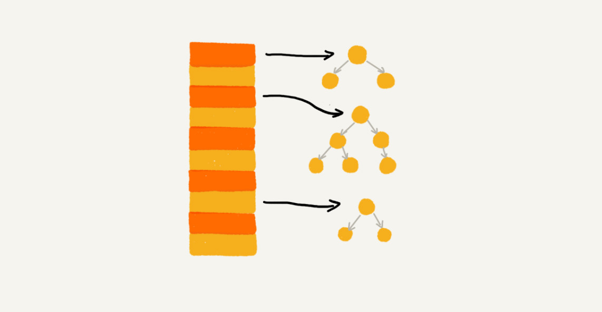

所以，**我总结一下，****基于链表的散列冲突处理方法比较适合存储大对象、大数据量的散列表，而且，比起开放寻址法，它更加灵活，支持更多的优化策略，比如用红黑树代替链表**。

## 工业级散列表举例分析

刚刚我讲了实现一个工业级散列表需要涉及的一些关键技术，现在，我就拿一个具体的例子，Java 中的 HashMap 这样一个工业级的散列表，来具体看下，这些技术是怎么应用的。

### 1. 初始大小

HashMap 默认的初始大小是 16，当然这个默认值是可以设置的，如果事先知道大概的数据量有多大，可以通过修改默认初始大小，减少动态扩容的次数，这样会大大提高 HashMap 的性能。

### 2. 装载因子和动态扩容

最大装载因子默认是 0.75，当 HashMap 中元素个数超过 0.75*capacity（capacity 表示散列表的容量）的时候，就会启动扩容，每次扩容都会扩容为原来的两倍大小。

### 3. 散列冲突解决方法

HashMap 底层采用链表法来解决冲突。即使负载因子和散列函数设计得再合理，也免不了会出现拉链过长的情况，一旦出现拉链过长，则会严重影响 HashMap 的性能。

于是，在 JDK1.8 版本中，为了对 HashMap 做进一步优化，我们引入了红黑树。而当链表长度太长（默认超过 8）时，链表就转换为红黑树。我们可以利用红黑树快速增删改查的特点，提高 HashMap 的性能。当红黑树结点个数少于 8 个的时候，又会将红黑树转化为链表。因为在数据量较小的情况下，红黑树要维护平衡，比起链表来，性能上的优势并不明显。

### 4. 散列函数

散列函数的设计并不复杂，追求的是简单高效、分布均匀。我把它摘抄出来，你可以看看。

int hash(Object key) {

​    int h = key.hashCode()；

​    return (h ^ (h >>> 16)) & (capicity -1); //capicity表示散列表的大小

}

其中，hashCode() 返回的是 Java 对象的 hash code。比如 String 类型的对象的 hashCode() 就是下面这样：

public int hashCode() {

  int var1 = this.hash;

  if(var1 == 0 && this.value.length > 0) {

​    char[] var2 = this.value;

​    for(int var3 = 0; var3 < this.value.length; ++var3) {

​      var1 = 31 * var1 + var2[var3];

​    }

​    this.hash = var1;

  }

  return var1;

}

## 解答开篇

今天的内容就讲完了，我现在来分析一下开篇的问题：如何设计一个工业级的散列函数？如果这是一道面试题或者是摆在你面前的实际开发问题，你会从哪几个方面思考呢？

首先，我会思考，**何为一个工业级的散列表？工业级的散列表****应该****具有哪些特性？**

结合已经学习过的散列知识，我觉得应该有这样几点要求：

支持快速地查询、插入、删除操作；

内存占用合理，不能浪费过多的内存空间；

性能稳定，极端情况下，散列表的性能也不会退化到无法接受的情况。

**如何实现这样一个散列表呢？**根据前面讲到的知识，我会从这三个方面来考虑设计思路：

设计一个合适的散列函数；

定义装载因子阈值，并且设计动态扩容策略；

选择合适的散列冲突解决方法。

关于散列函数、装载因子、动态扩容策略，还有散列冲突的解决办法，我们前面都讲过了，具体如何选择，还要结合具体的业务场景、具体的业务数据来具体分析。不过只要我们朝这三个方向努力，就离设计出工业级的散列表不远了。

## 内容小结

上一节的内容比较偏理论，今天的内容侧重实战。我主要讲了如何设计一个工业级的散列表，以及如何应对各种异常情况，防止在极端情况下，散列表的性能退化过于严重。我分了三部分来讲解这些内容，分别是：如何设计散列函数，如何根据装载因子动态扩容，以及如何选择散列冲突解决方法。

关于散列函数的设计，我们要尽可能让散列后的值随机且均匀分布，这样会尽可能地减少散列冲突，即便冲突之后，分配到每个槽内的数据也比较均匀。除此之外，散列函数的设计也不能太复杂，太复杂就会太耗时间，也会影响散列表的性能。

关于散列冲突解决方法的选择，我对比了开放寻址法和链表法两种方法的优劣和适应的场景。大部分情况下，链表法更加普适。而且，我们还可以通过将链表法中的链表改造成其他动态查找数据结构，比如红黑树，来避免散列表时间复杂度退化成 O(n)，抵御散列碰撞攻击。但是，对于小规模数据、装载因子不高的散列表，比较适合用开放寻址法。

对于动态散列表来说，不管我们如何设计散列函数，选择什么样的散列冲突解决方法。随着数据的不断增加，散列表总会出现装载因子过高的情况。这个时候，我们就需要启动动态扩容。

## 课后思考

在你熟悉的编程语言中，哪些数据类型底层是基于散列表实现的？散列函数是如何设计的？散列冲突是通过哪种方法解决的？是否支持动态扩容呢？

欢迎留言和我分享，我会第一时间给你反馈。

# 20 | 散列表（下）：为什么散列表和链表经常会一起使用？

王争 2018-11-05



00:00

[1.0x**](javascript:;)

讲述：修阳 大小：5.34M 时长：11:39

我们已经学习了 20 节内容，你有没有发现，有两种数据结构，散列表和链表，经常会被放在一起使用。你还记得，前面的章节中都有哪些地方讲到散列表和链表的组合使用吗？我带你一起回忆一下。

在链表那一节，我讲到如何用链表来实现 LRU 缓存淘汰算法，但是链表实现的 LRU 缓存淘汰算法的时间复杂度是 O(n)，当时我也提到了，通过散列表可以将这个时间复杂度降低到 O(1)。

在跳表那一节，我提到 Redis 的有序集合是使用跳表来实现的，跳表可以看作一种改进版的链表。当时我们也提到，Redis 有序集合不仅使用了跳表，还用到了散列表。

除此之外，如果你熟悉 Java 编程语言，你会发现 LinkedHashMap 这样一个常用的容器，也用到了散列表和链表两种数据结构。

今天，我们就来看看，在这几个问题中，散列表和链表都是如何组合起来使用的，以及为什么散列表和链表会经常放到一块使用。

## LRU 缓存淘汰算法

在链表那一节中，我提到，借助散列表，我们可以把 LRU 缓存淘汰算法的时间复杂度降低为 O(1)。现在，我们就来看看它是如何做到的。

首先，我们来回顾一下当时我们是如何通过链表实现 LRU 缓存淘汰算法的。

我们需要维护一个按照访问时间从大到小有序排列的链表结构。因为缓存大小有限，当缓存空间不够，需要淘汰一个数据的时候，我们就直接将链表头部的结点删除。

当要缓存某个数据的时候，先在链表中查找这个数据。如果没有找到，则直接将数据放到链表的尾部；如果找到了，我们就把它移动到链表的尾部。因为查找数据需要遍历链表，所以单纯用链表实现的 LRU 缓存淘汰算法的时间复杂很高，是 O(n)。

实际上，我总结一下，一个缓存（cache）系统主要包含下面这几个操作：

往缓存中添加一个数据；

从缓存中删除一个数据；

在缓存中查找一个数据。

这三个操作都要涉及“查找”操作，如果单纯地采用链表的话，时间复杂度只能是 O(n)。如果我们将散列表和链表两种数据结构组合使用，可以将这三个操作的时间复杂度都降低到 O(1)。具体的结构就是下面这个样子：

我们使用双向链表存储数据，链表中的每个结点处理存储数据（data）、前驱指针（prev）、后继指针（next）之外，还新增了一个特殊的字段 hnext。这个 hnext 有什么作用呢？

因为我们的散列表是通过链表法解决散列冲突的，所以每个结点会在两条链中。一个链是刚刚我们提到的**双向链表**，另一个链是散列表中的**拉链**。**前驱和后继指针是为了将结点串在双向链表中，hnext 指针是为了将结点串在散列表的拉链中**。

了解了这个散列表和双向链表的组合存储结构之后，我们再来看，前面讲到的缓存的三个操作，是如何做到时间复杂度是 O(1) 的？

首先，我们来看**如何查找一个数据**。我们前面讲过，散列表中查找数据的时间复杂度接近 O(1)，所以通过散列表，我们可以很快地在缓存中找到一个数据。当找到数据之后，我们还需要将它移动到双向链表的尾部。

其次，我们来看**如何删除一个数据**。我们需要找到数据所在的结点，然后将结点删除。借助散列表，我们可以在 O(1) 时间复杂度里找到要删除的结点。因为我们的链表是双向链表，双向链表可以通过前驱指针 O(1) 时间复杂度获取前驱结点，所以在双向链表中，删除结点只需要 O(1) 的时间复杂度。

最后，我们来看**如何添加一个数据**。添加数据到缓存稍微有点麻烦，我们需要先看这个数据是否已经在缓存中。如果已经在其中，需要将其移动到双向链表的尾部；如果不在其中，还要看缓存有没有满。如果满了，则将双向链表头部的结点删除，然后再将数据放到链表的尾部；如果没有满，就直接将数据放到链表的尾部。

这整个过程涉及的查找操作都可以通过散列表来完成。其他的操作，比如删除头结点、链表尾部插入数据等，都可以在 O(1) 的时间复杂度内完成。所以，这三个操作的时间复杂度都是 O(1)。至此，我们就通过散列表和双向链表的组合使用，实现了一个高效的、支持 LRU 缓存淘汰算法的缓存系统原型。

## Redis 有序集合

在跳表那一节，讲到有序集合的操作时，我稍微做了些简化。实际上，在有序集合中，每个成员对象有两个重要的属性，**key**（键值）和 **score**（分值）。我们不仅会通过 score 来查找数据，还会通过 key 来查找数据。

举个例子，比如用户积分排行榜有这样一个功能：我们可以通过用户的 ID 来查找积分信息，也可以通过积分区间来查找用户 ID 或者姓名信息。这里包含 ID、姓名和积分的用户信息，就是成员对象，用户 ID 就是 key，积分就是 score。

所以，如果我们细化一下 Redis 有序集合的操作，那就是下面这样：

添加一个成员对象；

按照键值来删除一个成员对象；

按照键值来查找一个成员对象；

按照分值区间查找数据，比如查找积分在[100, 356]之间的成员对象；

按照分值从小到大排序成员变量；

如果我们仅仅按照分值将成员对象组织成跳表的结构，那按照键值来删除、查询成员对象就会很慢，解决方法与 LRU 缓存淘汰算法的解决方法类似。我们可以再按照键值构建一个散列表，这样按照 key 来删除、查找一个成员对象的时间复杂度就变成了 O(1)。同时，借助跳表结构，其他操作也非常高效。

实际上，Redis 有序集合的操作还有另外一类，也就是查找成员对象的排名（Rank）或者根据排名区间查找成员对象。这个功能单纯用刚刚讲的这种组合结构就无法高效实现了。这块内容我后面的章节再讲。

## Java LinkedHashMap

前面我们讲了两个散列表和链表结合的例子，现在我们再来看另外一个，Java 中的 LinkedHashMap 这种容器。

如果你熟悉 Java，那你几乎天天会用到这个容器。我们之前讲过，HashMap 底层是通过散列表这种数据结构实现的。而 LinkedHashMap 前面比 HashMap 多了一个“Linked”，这里的“Linked”是不是说，LinkedHashMap 是一个通过链表法解决散列冲突的散列表呢？

实际上，LinkedHashMap 并没有这么简单，其中的“Linked”也并不仅仅代表它是通过链表法解决散列冲突的。关于这一点，在我是初学者的时候，也误解了很久。

我们先来看一段代码。你觉得这段代码会以什么样的顺序打印 3，1，5，2 这几个 key 呢？原因又是什么呢？

HashMap<Integer, Integer> m = new LinkedHashMap<>();

m.put(3, 11);

m.put(1, 12);

m.put(5, 23);

m.put(2, 22);

for (Map.Entry e : m.entrySet()) {

  System.out.println(e.getKey());

}

我先告诉你答案，上面的代码会按照数据插入的顺序依次来打印，也就是说，打印的顺序就是 3，1，5，2。你有没有觉得奇怪？散列表中数据是经过散列函数打乱之后无规律存储的，这里是如何实现按照数据的插入顺序来遍历打印的呢？

你可能已经猜到了，LinkedHashMap 也是通过散列表和链表组合在一起实现的。实际上，它不仅支持按照插入顺序遍历数据，还支持按照访问顺序来遍历数据。你可以看下面这段代码：

// 10是初始大小，0.75是装载因子，true是表示按照访问时间排序

HashMap<Integer, Integer> m = new LinkedHashMap<>(10, 0.75f, true);

m.put(3, 11);

m.put(1, 12);

m.put(5, 23);

m.put(2, 22);

m.put(3, 26);

m.get(5);

for (Map.Entry e : m.entrySet()) {

  System.out.println(e.getKey());

}

这段代码打印的结果是 1，2，3，5。我来具体分析一下，为什么这段代码会按照这样顺序来打印。

每次调用 put() 函数，往 LinkedHashMap 中添加数据的时候，都会将数据添加到链表的尾部，所以，在前四个操作完成之后，链表中的数据是下面这样：

在第 8 行代码中，再次将键值为 3 的数据放入到 LinkedHashMap 的时候，会先查找这个键值是否已经有了，然后，再将已经存在的 (3,11) 删除，并且将新的 (3,26) 放到链表的尾部。所以，这个时候链表中的数据就是下面这样：

当第 9 行代码访问到 key 为 5 的数据的时候，我们将被访问到的数据移动到链表的尾部。所以，第 9 行代码之后，链表中的数据是下面这样：

所以，最后打印出来的数据是 1，2，3，5。从上面的分析，你有没有发现，按照访问时间排序的 LinkedHashMap 本身就是一个支持 LRU 缓存淘汰策略的缓存系统？实际上，它们两个的实现原理也是一模一样的。我也就不再啰嗦了。

我现在来总结一下，实际上，**LinkedHashMap 是通过双向链表和散列表这两种数据结构组合实现的。LinkedHashMap 中的“Linked”实际上是指的是双向链表，并非指用链表法解决散列冲突**。

## 解答开篇 & 内容小结

弄懂刚刚我讲的这三个例子，开篇的问题也就不言而喻了。我这里总结一下，为什么散列表和链表经常一块使用？

散列表这种数据结构虽然支持非常高效的数据插入、删除、查找操作，但是散列表中的数据都是通过散列函数打乱之后无规律存储的。也就说，它无法支持按照某种顺序快速地遍历数据。如果希望按照顺序遍历散列表中的数据，那我们需要将散列表中的数据拷贝到数组中，然后排序，再遍历。

因为散列表是动态数据结构，不停地有数据的插入、删除，所以每当我们希望按顺序遍历散列表中的数据的时候，都需要先排序，那效率势必会很低。为了解决这个问题，我们将散列表和链表（或者跳表）结合在一起使用。

## 课后思考

今天讲的几个散列表和链表结合使用的例子里，我们用的都是双向链表。如果把双向链表改成单链表，还能否正常工作呢？为什么呢？

假设猎聘网有 10 万名猎头，每个猎头都可以通过做任务（比如发布职位）来积累积分，然后通过积分来下载简历。假设你是猎聘网的一名工程师，如何在内存中存储这 10 万个猎头 ID 和积分信息，让它能够支持这样几个操作：

根据猎头的 ID 快速查找、删除、更新这个猎头的积分信息；

查找积分在某个区间的猎头 ID 列表；

查找按照积分从小到大排名在第 x 位到第 y 位之间的猎头 ID 列表。

欢迎留言和我分享，我会第一时间给你反馈。

# 21 | 哈希算法（上）：如何防止数据库中的用户信息被脱库？

王争 2018-11-07

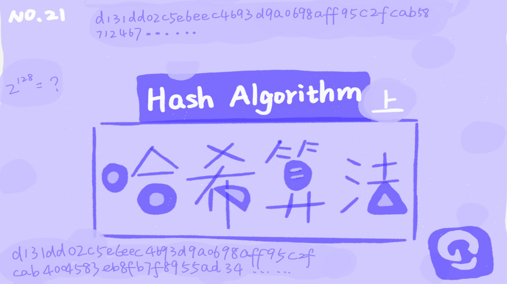



00:00

[1.0x**](javascript:;)

讲述：修阳 大小：6.64M 时长：14:29

还记得 2011 年 CSDN 的“脱库”事件吗？当时，CSDN 网站被黑客攻击，超过 600 万用户的注册邮箱和密码明文被泄露，很多网友对 CSDN 明文保存用户密码行为产生了不满。如果你是 CSDN 的一名工程师，**你会如何存储用户密码这么重要的数据吗？仅仅 MD5 加密一下存储就够了吗？** 要想搞清楚这个问题，就要先弄明白哈希算法。

哈希算法历史悠久，业界著名的哈希算法也有很多，比如 MD5、SHA 等。在我们平时的开发中，基本上都是拿现成的直接用。所以，我今天不会重点剖析哈希算法的原理，也不会教你如何设计一个哈希算法，而是从实战的角度告诉你，**在实际的开发中，我们该如何用哈希算法解决问题**。

## 什么是哈希算法？

我们前面几节讲到“散列表”“散列函数”，这里又讲到“哈希算法”，你是不是有点一头雾水？实际上，不管是“散列”还是“哈希”，这都是中文翻译的差别，英文其实就是“**Hash**”。所以，我们常听到有人把“散列表”叫作“哈希表”“Hash 表”，把“哈希算法”叫作“Hash 算法”或者“散列算法”。那到底什么是哈希算法呢？

哈希算法的定义和原理非常简单，基本上一句话就可以概括了。将任意长度的二进制值串映射为固定长度的二进制值串，这个映射的规则就是**哈希算法**，而通过原始数据映射之后得到的二进制值串就是**哈希值**。但是，要想设计一个优秀的哈希算法并不容易，根据我的经验，我总结了需要满足的几点要求：

从哈希值不能反向推导出原始数据（所以哈希算法也叫单向哈希算法）；

对输入数据非常敏感，哪怕原始数据只修改了一个 Bit，最后得到的哈希值也大不相同；

散列冲突的概率要很小，对于不同的原始数据，哈希值相同的概率非常小；

哈希算法的执行效率要尽量高效，针对较长的文本，也能快速地计算出哈希值。

这些定义和要求都比较理论，可能还是不好理解，我拿 MD5 这种哈希算法来具体说明一下。

我们分别对“今天我来讲哈希算法”和“jiajia”这两个文本，计算 MD5 哈希值，得到两串看起来毫无规律的字符串（MD5 的哈希值是 128 位的 Bit 长度，为了方便表示，我把它们转化成了 16 进制编码）。可以看出来，无论要哈希的文本有多长、多短，通过 MD5 哈希之后，得到的哈希值的长度都是相同的，而且得到的哈希值看起来像一堆随机数，完全没有规律。

MD5("今天我来讲哈希算法") = bb4767201ad42c74e650c1b6c03d78fa

MD5("jiajia") = cd611a31ea969b908932d44d126d195b

我们再来看两个非常相似的文本，“我今天讲哈希算法！”和“我今天讲哈希算法”。这两个文本只有一个感叹号的区别。如果用 MD5 哈希算法分别计算它们的哈希值，你会发现，尽管只有一字之差，得到的哈希值也是完全不同的。

MD5("我今天讲哈希算法！") = 425f0d5a917188d2c3c3dc85b5e4f2cb

MD5("我今天讲哈希算法") = a1fb91ac128e6aa37fe42c663971ac3d

我在前面也说了，通过哈希算法得到的哈希值，很难反向推导出原始数据。比如上面的例子中，我们就很难通过哈希值“a1fb91ac128e6aa37fe42c663971ac3d”反推出对应的文本“我今天讲哈希算法”。

哈希算法要处理的文本可能是各种各样的。比如，对于非常长的文本，如果哈希算法的计算时间很长，那就只能停留在理论研究的层面，很难应用到实际的软件开发中。比如，我们把今天这篇包含 4000 多个汉字的文章，用 MD5 计算哈希值，用不了 1ms 的时间。

哈希算法的应用非常非常多，我选了最常见的七个，分别是安全加密、唯一标识、数据校验、散列函数、负载均衡、数据分片、分布式存储。这节我们先来看前四个应用。

## 应用一：安全加密

说到哈希算法的应用，最先想到的应该就是安全加密。最常用于加密的哈希算法是 **MD5**（MD5 Message-Digest Algorithm，MD5 消息摘要算法）和 **SHA**（Secure Hash Algorithm，安全散列算法）。

除了这两个之外，当然还有很多其他加密算法，比如 **DES**（Data Encryption Standard，数据加密标准）、**AES**（Advanced Encryption Standard，高级加密标准）。

前面我讲到的哈希算法四点要求，对用于加密的哈希算法来说，有两点格外重要。第一点是很难根据哈希值反向推导出原始数据，第二点是散列冲突的概率要很小。

第一点很好理解，加密的目的就是防止原始数据泄露，所以很难通过哈希值反向推导原始数据，这是一个最基本的要求。所以我着重讲一下第二点。实际上，不管是什么哈希算法，我们只能尽量减少碰撞冲突的概率，理论上是没办法做到完全不冲突的。为什么这么说呢？

这里就基于组合数学中一个非常基础的理论，鸽巢原理（也叫抽屉原理）。这个原理本身很简单，它是说，如果有 10 个鸽巢，有 11 只鸽子，那肯定有 1 个鸽巢中的鸽子数量多于 1 个，换句话说就是，肯定有 2 只鸽子在 1 个鸽巢内。

有了鸽巢原理的铺垫之后，我们再来看，**为什么哈希算法无法做到零冲突？**

我们知道，哈希算法产生的哈希值的长度是固定且有限的。比如前面举的 MD5 的例子，哈希值是固定的 128 位二进制串，能表示的数据是有限的，最多能表示 2^128 个数据，而我们要哈希的数据是无穷的。基于鸽巢原理，如果我们对 2^128+1 个数据求哈希值，就必然会存在哈希值相同的情况。这里你应该能想到，一般情况下，哈希值越长的哈希算法，散列冲突的概率越低。

2^128=340282366920938463463374607431768211456

为了让你能有个更加直观的感受，我找了两段字符串放在这里。这两段字符串经过 MD5 哈希算法加密之后，产生的哈希值是相同的。

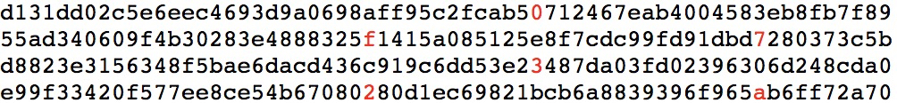

不过，即便哈希算法存在散列冲突的情况，但是因为哈希值的范围很大，冲突的概率极低，所以相对来说还是很难破解的。像 MD5，有 2^128 个不同的哈希值，这个数据已经是一个天文数字了，所以散列冲突的概率要小于 1/2^128。

如果我们拿到一个 MD5 哈希值，希望通过毫无规律的穷举的方法，找到跟这个 MD5 值相同的另一个数据，那耗费的时间应该是个天文数字。所以，即便哈希算法存在冲突，但是在有限的时间和资源下，哈希算法还是很难被破解的。

除此之外，没有绝对安全的加密。越复杂、越难破解的加密算法，需要的计算时间也越长。比如 SHA-256 比 SHA-1 要更复杂、更安全，相应的计算时间就会比较长。密码学界也一直致力于找到一种快速并且很难被破解的哈希算法。我们在实际的开发过程中，也需要权衡破解难度和计算时间，来决定究竟使用哪种加密算法。

## 应用二：唯一标识

我先来举一个例子。如果要在海量的图库中，搜索一张图是否存在，我们不能单纯地用图片的元信息（比如图片名称）来比对，因为有可能存在名称相同但图片内容不同，或者名称不同图片内容相同的情况。那我们该如何搜索呢？

我们知道，任何文件在计算中都可以表示成二进制码串，所以，比较笨的办法就是，拿要查找的图片的二进制码串与图库中所有图片的二进制码串一一比对。如果相同，则说明图片在图库中存在。但是，每个图片小则几十 KB、大则几 MB，转化成二进制是一个非常长的串，比对起来非常耗时。有没有比较快的方法呢？

我们可以给每一个图片取一个唯一标识，或者说信息摘要。比如，我们可以从图片的二进制码串开头取 100 个字节，从中间取 100 个字节，从最后再取 100 个字节，然后将这 300 个字节放到一块，通过哈希算法（比如 MD5），得到一个哈希字符串，用它作为图片的唯一标识。通过这个唯一标识来判定图片是否在图库中，这样就可以减少很多工作量。

如果还想继续提高效率，我们可以把每个图片的唯一标识，和相应的图片文件在图库中的路径信息，都存储在散列表中。当要查看某个图片是不是在图库中的时候，我们先通过哈希算法对这个图片取唯一标识，然后在散列表中查找是否存在这个唯一标识。

如果不存在，那就说明这个图片不在图库中；如果存在，我们再通过散列表中存储的文件路径，获取到这个已经存在的图片，跟现在要插入的图片做全量的比对，看是否完全一样。如果一样，就说明已经存在；如果不一样，说明两张图片尽管唯一标识相同，但是并不是相同的图片。

## 应用三：数据校验

电驴这样的 BT 下载软件你肯定用过吧？我们知道，BT 下载的原理是基于 P2P 协议的。我们从多个机器上并行下载一个 2GB 的电影，这个电影文件可能会被分割成很多文件块（比如可以分成 100 块，每块大约 20MB）。等所有的文件块都下载完成之后，再组装成一个完整的电影文件就行了。

我们知道，网络传输是不安全的，下载的文件块有可能是被宿主机器恶意修改过的，又或者下载过程中出现了错误，所以下载的文件块可能不是完整的。如果我们没有能力检测这种恶意修改或者文件下载出错，就会导致最终合并后的电影无法观看，甚至导致电脑中毒。现在的问题是，如何来校验文件块的安全、正确、完整呢？

具体的 BT 协议很复杂，校验方法也有很多，我来说其中的一种思路。

我们通过哈希算法，对 100 个文件块分别取哈希值，并且保存在种子文件中。我们在前面讲过，哈希算法有一个特点，对数据很敏感。只要文件块的内容有一丁点儿的改变，最后计算出的哈希值就会完全不同。所以，当文件块下载完成之后，我们可以通过相同的哈希算法，对下载好的文件块逐一求哈希值，然后跟种子文件中保存的哈希值比对。如果不同，说明这个文件块不完整或者被篡改了，需要再重新从其他宿主机器上下载这个文件块。

## 应用四：散列函数

前面讲了很多哈希算法的应用，实际上，散列函数也是哈希算法的一种应用。

我们前两节讲到，散列函数是设计一个散列表的关键。它直接决定了散列冲突的概率和散列表的性能。不过，相对哈希算法的其他应用，散列函数对于散列算法冲突的要求要低很多。即便出现个别散列冲突，只要不是过于严重，我们都可以通过开放寻址法或者链表法解决。

不仅如此，散列函数对于散列算法计算得到的值，是否能反向解密也并不关心。散列函数中用到的散列算法，更加关注散列后的值是否能平均分布，也就是，一组数据是否能均匀地散列在各个槽中。除此之外，散列函数执行的快慢，也会影响散列表的性能，所以，散列函数用的散列算法一般都比较简单，比较追求效率。

## 解答开篇

好了，有了前面的基础，现在你有没有发现开篇的问题其实很好解决？

我们可以通过哈希算法，对用户密码进行加密之后再存储，不过最好选择相对安全的加密算法，比如 SHA 等（因为 MD5 已经号称被破解了）。不过仅仅这样加密之后存储就万事大吉了吗？

字典攻击你听说过吗？如果用户信息被“脱库”，黑客虽然拿到是加密之后的密文，但可以通过“猜”的方式来破解密码，这是因为，有些用户的密码太简单。比如很多人习惯用 00000、123456 这样的简单数字组合做密码，很容易就被猜中。

那我们就需要维护一个常用密码的字典表，把字典中的每个密码用哈希算法计算哈希值，然后拿哈希值跟脱库后的密文比对。如果相同，基本上就可以认为，这个加密之后的密码对应的明文就是字典中的这个密码。（注意，这里说是的是“基本上可以认为”，因为根据我们前面的学习，哈希算法存在散列冲突，也有可能出现，尽管密文一样，但是明文并不一样的情况。）

针对字典攻击，我们可以引入一个盐（salt），跟用户的密码组合在一起，增加密码的复杂度。我们拿组合之后的字符串来做哈希算法加密，将它存储到数据库中，进一步增加破解的难度。不过我这里想多说一句，我认为安全和攻击是一种博弈关系，不存在绝对的安全。所有的安全措施，只是增加攻击的成本而已。

## 内容小结

今天的内容比较偏实战，我讲到了哈希算法的四个应用场景。我带你来回顾一下。

第一个应用是唯一标识，哈希算法可以对大数据做信息摘要，通过一个较短的二进制编码来表示很大的数据。

第二个应用是用于校验数据的完整性和正确性。

第三个应用是安全加密，我们讲到任何哈希算法都会出现散列冲突，但是这个冲突概率非常小。越是复杂哈希算法越难破解，但同样计算时间也就越长。所以，选择哈希算法的时候，要权衡安全性和计算时间来决定用哪种哈希算法。

第四个应用是散列函数，这个我们前面讲散列表的时候已经详细地讲过，它对哈希算法的要求非常特别，更加看重的是散列的平均性和哈希算法的执行效率。

## 课后思考

现在，区块链是一个很火的领域，它被很多人神秘化，不过其底层的实现原理并不复杂。其中，哈希算法就是它的一个非常重要的理论基础。你能讲一讲区块链使用的是哪种哈希算法吗？是为了解决什么问题而使用的呢？

欢迎留言和我分享，我会第一时间给你反馈。

# 22 | 哈希算法（下）：哈希算法在分布式系统中有哪些应用？

王争 2018-11-09

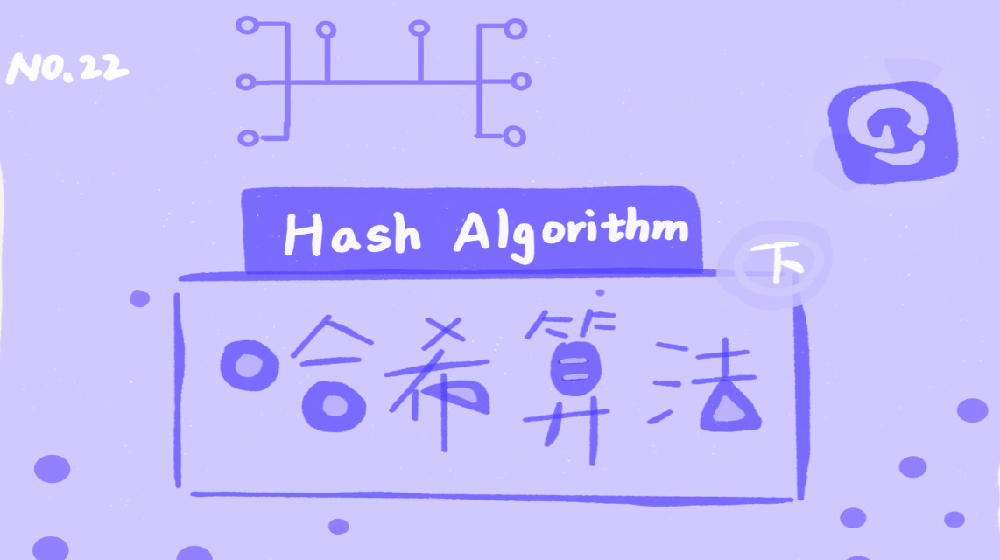



00:00

[1.0x**](javascript:;)

讲述：修阳 大小：4.29M 时长：09:20

上一节，我讲了哈希算法的四个应用，它们分别是：安全加密、数据校验、唯一标识、散列函数。今天，我们再来看剩余三种应用：**负载均衡、数据分片、分布式存储**。

你可能已经发现，这三个应用都跟分布式系统有关。没错，今天我就带你看下，**哈希算法是如何解决这些分布式问题的**。

## 应用五：负载均衡

我们知道，负载均衡算法有很多，比如轮询、随机、加权轮询等。那如何才能实现一个会话粘滞（session sticky）的负载均衡算法呢？也就是说，我们需要在同一个客户端上，在一次会话中的所有请求都路由到同一个服务器上。

最直接的方法就是，维护一张映射关系表，这张表的内容是客户端 IP 地址或者会话 ID 与服务器编号的映射关系。客户端发出的每次请求，都要先在映射表中查找应该路由到的服务器编号，然后再请求编号对应的服务器。这种方法简单直观，但也有几个弊端：

如果客户端很多，映射表可能会很大，比较浪费内存空间；

客户端下线、上线，服务器扩容、缩容都会导致映射失效，这样维护映射表的成本就会很大；

如果借助哈希算法，这些问题都可以非常完美地解决。**我们可以通过哈希算法，对客户端 IP 地址或者会话 ID 计算哈希值，将取得的哈希值与服务器列表的大小进行取模运算，****最终得到的值就是应该被路由到的服务器编号。** 这样，我们就可以把同一个 IP 过来的所有请求，都路由到同一个后端服务器上。

## 应用六：数据分片

哈希算法还可以用于数据的分片。我这里有两个例子。

### 1. 如何统计“搜索关键词”出现的次数？

假如我们有 1T 的日志文件，这里面记录了用户的搜索关键词，我们想要快速统计出每个关键词被搜索的次数，该怎么做呢？

我们来分析一下。这个问题有两个难点，第一个是搜索日志很大，没办法放到一台机器的内存中。第二个难点是，如果只用一台机器来处理这么巨大的数据，处理时间会很长。

针对这两个难点，**我们可以先对数据进行分片，然后采用多台机器处理的方法，来提高处理速度**。具体的思路是这样的：为了提高处理的速度，我们用 n 台机器并行处理。我们从搜索记录的日志文件中，依次读出每个搜索关键词，并且通过哈希函数计算哈希值，然后再跟 n 取模，最终得到的值，就是应该被分配到的机器编号。

这样，哈希值相同的搜索关键词就被分配到了同一个机器上。也就是说，同一个搜索关键词会被分配到同一个机器上。每个机器会分别计算关键词出现的次数，最后合并起来就是最终的结果。

实际上，这里的处理过程也是 MapReduce 的基本设计思想。

### 2. 如何快速判断图片是否在图库中？

如何快速判断图片是否在图库中？上一节我们讲过这个例子，不知道你还记得吗？当时我介绍了一种方法，即给每个图片取唯一标识（或者信息摘要），然后构建散列表。

假设现在我们的图库中有 1 亿张图片，很显然，在单台机器上构建散列表是行不通的。因为单台机器的内存有限，而 1 亿张图片构建散列表显然远远超过了单台机器的内存上限。

我们同样可以对数据进行分片，然后采用多机处理。我们准备 n 台机器，让每台机器只维护某一部分图片对应的散列表。我们每次从图库中读取一个图片，计算唯一标识，然后与机器个数 n 求余取模，得到的值就对应要分配的机器编号，然后将这个图片的唯一标识和图片路径发往对应的机器构建散列表。

当我们要判断一个图片是否在图库中的时候，我们通过同样的哈希算法，计算这个图片的唯一标识，然后与机器个数 n 求余取模。假设得到的值是 k，那就去编号 k 的机器构建的散列表中查找。

现在，我们来估算一下，给这 1 亿张图片构建散列表大约需要多少台机器。

散列表中每个数据单元包含两个信息，哈希值和图片文件的路径。假设我们通过 MD5 来计算哈希值，那长度就是 128 比特，也就是 16 字节。文件路径长度的上限是 256 字节，我们可以假设平均长度是 128 字节。如果我们用链表法来解决冲突，那还需要存储指针，指针只占用 8 字节。所以，散列表中每个数据单元就占用 152 字节（这里只是估算，并不准确）。

假设一台机器的内存大小为 2GB，散列表的装载因子为 0.75，那一台机器可以给大约 1000 万（2GB*0.75/152）张图片构建散列表。所以，如果要对 1 亿张图片构建索引，需要大约十几台机器。在工程中，这种估算还是很重要的，能让我们事先对需要投入的资源、资金有个大概的了解，能更好地评估解决方案的可行性。

实际上，针对这种海量数据的处理问题，我们都可以采用多机分布式处理。借助这种分片的思路，可以突破单机内存、CPU 等资源的限制。

## 应用七：分布式存储

现在互联网面对的都是海量的数据、海量的用户。我们为了提高数据的读取、写入能力，一般都采用分布式的方式来存储数据，比如分布式缓存。我们有海量的数据需要缓存，所以一个缓存机器肯定是不够的。于是，我们就需要将数据分布在多台机器上。

该如何决定将哪个数据放到哪个机器上呢？我们可以借用前面数据分片的思想，即通过哈希算法对数据取哈希值，然后对机器个数取模，这个最终值就是应该存储的缓存机器编号。

但是，如果数据增多，原来的 10 个机器已经无法承受了，我们就需要扩容了，比如扩到 11 个机器，这时候麻烦就来了。因为，这里并不是简单地加个机器就可以了。

原来的数据是通过与 10 来取模的。比如 13 这个数据，存储在编号为 3 这台机器上。但是新加了一台机器中，我们对数据按照 11 取模，原来 13 这个数据就被分配到 2 号这台机器上了。

因此，所有的数据都要重新计算哈希值，然后重新搬移到正确的机器上。这样就相当于，缓存中的数据一下子就都失效了。所有的数据请求都会穿透缓存，直接去请求数据库。这样就可能发生雪崩效应，压垮数据库。

所以，我们需要一种方法，使得在新加入一个机器后，并不需要做大量的数据搬移。这时候，**一致性哈希算法**就要登场了。

假设我们有 k 个机器，数据的哈希值的范围是[0, MAX]。我们将整个范围划分成 m 个小区间（m 远大于 k），每个机器负责 m/k 个小区间。当有新机器加入的时候，我们就将某几个小区间的数据，从原来的机器中搬移到新的机器中。这样，既不用全部重新哈希、搬移数据，也保持了各个机器上数据数量的均衡。

一致性哈希算法的基本思想就是这么简单。除此之外，它还会借助一个虚拟的环和虚拟结点，更加优美地实现出来。这里我就不展开讲了，如果感兴趣，你可以看下这个介绍。

除了我们上面讲到的分布式缓存，实际上，一致性哈希算法的应用非常广泛，在很多分布式存储系统中，都可以见到一致性哈希算法的影子。

## 解答开篇 & 内容小结

这两节的内容理论不多，比较贴近具体的开发。今天我讲了三种哈希算法在分布式系统中的应用，它们分别是：负载均衡、数据分片、分布式存储。

在负载均衡应用中，利用哈希算法替代映射表，可以实现一个会话粘滞的负载均衡策略。在数据分片应用中，通过哈希算法对处理的海量数据进行分片，多机分布式处理，可以突破单机资源的限制。在分布式存储应用中，利用一致性哈希算法，可以解决缓存等分布式系统的扩容、缩容导致数据大量搬移的难题。

## 课后思考

这两节我总共讲了七个哈希算法的应用。实际上，我讲的也只是冰山一角，哈希算法还有很多其他的应用，比如网络协议中的 CRC 校验、Git commit id 等等。除了这些，你还能想到其他用到哈希算法的地方吗？

欢迎留言和我分享，我会第一时间给你反馈。

# 23 | 二叉树基础（上）：什么样的二叉树适合用数组来存储？

王争 2018-11-12

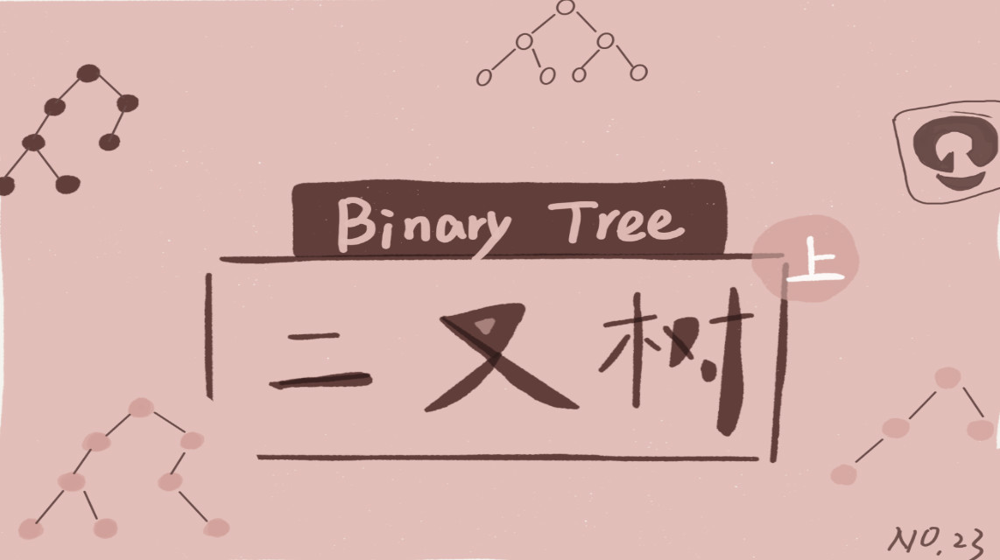



00:00

[1.0x**](javascript:;)

讲述：修阳 大小：4.67M 时长：10:11

前面我们讲的都是线性表结构，栈、队列等等。今天我们讲一种非线性表结构，树。树这种数据结构比线性表的数据结构要复杂得多，内容也比较多，所以我会分四节来讲解。

我反复强调过，带着问题学习，是最有效的学习方式之一，所以在正式的内容开始之前，我还是给你出一道思考题：**二叉树有哪几种存储方式？什么样的二叉树适合用数组来存储？**

带着这些问题，我们就来学习今天的内容，树！

## 树（Tree）

我们首先来看，什么是“树”？再完备的定义，都没有图直观。所以我在图中画了几棵“树”。你来看看，这些“树”都有什么特征？

你有没有发现，“树”这种数据结构真的很像我们现实生活中的“树”，这里面每个元素我们叫做“节点”；用来连接相邻节点之间的关系，我们叫做“父子关系”。

比如下面这幅图，A 节点就是 B 节点的**父节点**，B 节点是 A 节点的**子节点**。B、C、D 这三个节点的父节点是同一个节点，所以它们之间互称为**兄弟节点**。我们把没有父节点的节点叫做**根节点**，也就是图中的节点 E。我们把没有子节点的节点叫做**叶子节点**或者**叶节点**，比如图中的 G、H、I、J、K、L 都是叶子节点。

除此之外，关于“树”，还有三个比较相似的概念：**高度**（Height）、**深度**（Depth）、**层**（Level）。它们的定义是这样的：

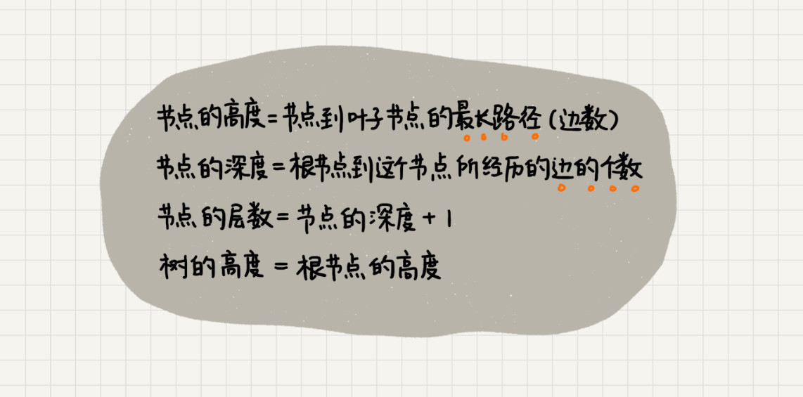

这三个概念的定义比较容易混淆，描述起来也比较空洞。我举个例子说明一下，你一看应该就能明白。

记这几个概念，我还有一个小窍门，就是类比“高度”“深度”“层”这几个名词在生活中的含义。

在我们的生活中，“高度”这个概念，其实就是从下往上度量，比如我们要度量第 10 层楼的高度、第 13 层楼的高度，起点都是地面。所以，树这种数据结构的高度也是一样，从最底层开始计数，并且计数的起点是 0。

“深度”这个概念在生活中是从上往下度量的，比如水中鱼的深度，是从水平面开始度量的。所以，树这种数据结构的深度也是类似的，从根结点开始度量，并且计数起点也是 0。

“层数”跟深度的计算类似，不过，计数起点是 1，也就是说根节点位于第 1 层。

## 二叉树（Binary Tree）

树结构多种多样，不过我们最常用还是二叉树。

二叉树，顾名思义，每个节点最多有两个“叉”，也就是两个子节点，分别是**左子节点**和**右子****节****点**。不过，二叉树并不要求每个节点都有两个子节点，有的节点只有左子节点，有的节点只有右子节点。我画的这几个都是二叉树。以此类推，你可以想象一下四叉树、八叉树长什么样子。

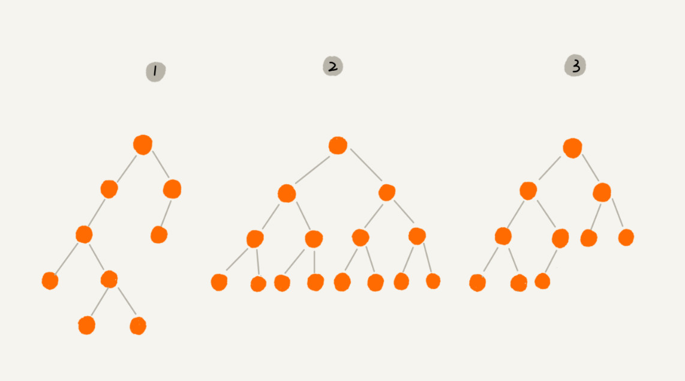

这个图里面，有两个比较特殊的二叉树，分别是编号 2 和编号 3 这两个。

其中，编号 2 的二叉树中，叶子节点全都在最底层，除了叶子节点之外，每个节点都有左右两个子节点，这种二叉树就叫做**满二叉树**。

编号 3 的二叉树中，叶子节点都在最底下两层，最后一层的叶子节点都靠左排列，并且除了最后一层，其他层的节点个数都要达到最大，这种二叉树叫做**完全二叉树**。

满二叉树很好理解，也很好识别，但是完全二叉树，有的人可能就分不清了。我画了几个完全二叉树和非完全二叉树的例子，你可以对比着看看。

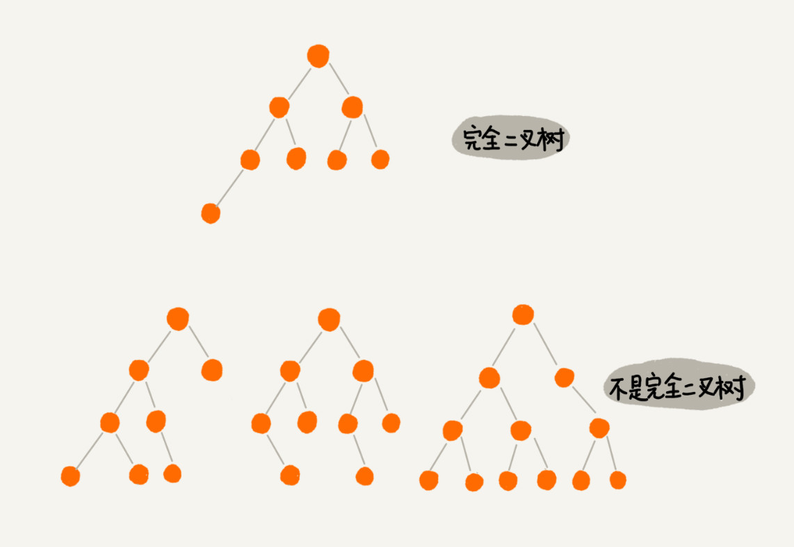

你可能会说，满二叉树的特征非常明显，我们把它单独拎出来讲，这个可以理解。但是完全二叉树的特征不怎么明显啊，单从长相上来看，完全二叉树并没有特别特殊的地方啊，更像是“芸芸众树”中的一种。

那我们为什么还要特意把它拎出来讲呢？为什么偏偏把最后一层的叶子节点靠左排列的叫完全二叉树？如果靠右排列就不能叫完全二叉树了吗？这个定义的由来或者说目的在哪里？

要理解完全二叉树定义的由来，我们需要先了解，**如何表示（或者存储）一棵二叉树？**

想要存储一棵二叉树，我们有两种方法，一种是基于指针或者引用的二叉链式存储法，一种是基于数组的顺序存储法。

我们先来看比较简单、直观的**链式存储法**。从图中你应该可以很清楚地看到，每个节点有三个字段，其中一个存储数据，另外两个是指向左右子节点的指针。我们只要拎住根节点，就可以通过左右子节点的指针，把整棵树都串起来。这种存储方式我们比较常用。大部分二叉树代码都是通过这种结构来实现的。

我们再来看，基于数组的**顺序存储法**。我们把根节点存储在下标 i = 1 的位置，那左子节点存储在下标 2 * i = 2 的位置，右子节点存储在 2 * i + 1 = 3 的位置。以此类推，B 节点的左子节点存储在 2 * i = 2 * 2 = 4 的位置，右子节点存储在 2 * i + 1 = 2 * 2 + 1 = 5 的位置。

我来总结一下，如果节点 X 存储在数组中下标为 i 的位置，下标为 2 * i 的位置存储的就是左子节点，下标为 2 * i + 1 的位置存储的就是右子节点。反过来，下标为 i/2 的位置存储就是它的父节点。通过这种方式，我们只要知道根节点存储的位置（一般情况下，为了方便计算子节点，根节点会存储在下标为 1 的位置），这样就可以通过下标计算，把整棵树都串起来。

不过，我刚刚举的例子是一棵完全二叉树，所以仅仅“浪费”了一个下标为 0 的存储位置。如果是非完全二叉树，其实会浪费比较多的数组存储空间。你可以看我举的下面这个例子。

所以，如果某棵二叉树是一棵完全二叉树，那用数组存储无疑是最节省内存的一种方式。因为数组的存储方式并不需要像链式存储法那样，要存储额外的左右子节点的指针。这也是为什么完全二叉树会单独拎出来的原因，也是为什么完全二叉树要求最后一层的子节点都靠左的原因。

当我们讲到堆和堆排序的时候，你会发现，堆其实就是一种完全二叉树，最常用的存储方式就是数组。

## 二叉树的遍历

前面我讲了二叉树的基本定义和存储方法，现在我们来看二叉树中非常重要的操作，二叉树的遍历。这也是非常常见的面试题。

如何将所有节点都遍历打印出来呢？经典的方法有三种，**前序遍历**、**中序遍历**和**后序遍历**。其中，前、中、后序，表示的是节点与它的左右子树节点遍历打印的先后顺序。

前序遍历是指，对于树中的任意节点来说，先打印这个节点，然后再打印它的左子树，最后打印它的右子树。

中序遍历是指，对于树中的任意节点来说，先打印它的左子树，然后再打印它本身，最后打印它的右子树。

后序遍历是指，对于树中的任意节点来说，先打印它的左子树，然后再打印它的右子树，最后打印这个节点本身。

**实际上，二叉树的前、中、后序遍历就是一个递归的过程**。比如，前序遍历，其实就是先打印根节点，然后再递归地打印左子树，最后递归地打印右子树。

写递归代码的关键，就是看能不能写出递推公式，而写递推公式的关键就是，如果要解决问题 A，就假设子问题 B、C 已经解决，然后再来看如何利用 B、C 来解决 A。所以，我们可以把前、中、后序遍历的递推公式都写出来。

前序遍历的递推公式：

preOrder(r) = print r->preOrder(r->left)->preOrder(r->right)

中序遍历的递推公式：

inOrder(r) = inOrder(r->left)->print r->inOrder(r->right)

后序遍历的递推公式：

postOrder(r) = postOrder(r->left)->postOrder(r->right)->print r

有了递推公式，代码写起来就简单多了。这三种遍历方式的代码，我都写出来了，你可以看看。

void preOrder(Node* root) {

  if (root == null) return;

  print root // 此处为伪代码，表示打印root节点

  preOrder(root->left);

  preOrder(root->right);

}

void inOrder(Node* root) {

  if (root == null) return;

  inOrder(root->left);

  print root // 此处为伪代码，表示打印root节点

  inOrder(root->right);

}

void postOrder(Node* root) {

  if (root == null) return;

  postOrder(root->left);

  postOrder(root->right);

  print root // 此处为伪代码，表示打印root节点

}

二叉树的前、中、后序遍历的递归实现是不是很简单？你知道**二叉树遍历的时间复杂度是多少**吗？我们一起来看看。

从我前面画的前、中、后序遍历的顺序图，可以看出来，每个节点最多会被访问两次，所以遍历操作的时间复杂度，跟节点的个数 n 成正比，也就是说二叉树遍历的时间复杂度是 O(n)。

## 解答开篇 & 内容小结

今天，我讲了一种非线性表数据结构，树。关于树，有几个比较常用的概念你需要掌握，那就是：根节点、叶子节点、父节点、子节点、兄弟节点，还有节点的高度、深度、层数，以及树的高度。

我们平时最常用的树就是二叉树。二叉树的每个节点最多有两个子节点，分别是左子节点和右子节点。二叉树中，有两种比较特殊的树，分别是满二叉树和完全二叉树。满二叉树又是完全二叉树的一种特殊情况。

二叉树既可以用链式存储，也可以用数组顺序存储。数组顺序存储的方式比较适合完全二叉树，其他类型的二叉树用数组存储会比较浪费存储空间。除此之外，二叉树里非常重要的操作就是前、中、后序遍历操作，遍历的时间复杂度是 O(n)，你需要理解并能用递归代码来实现。

## 课后思考

给定一组数据，比如 1，3，5，6，9，10。你来算算，可以构建出多少种不同的二叉树？

我们讲了三种二叉树的遍历方式，前、中、后序。实际上，还有另外一种遍历方式，也就是按层遍历，你知道如何实现吗？

欢迎留言和我分享，我会第一时间给你反馈。

# 24 | 二叉树基础（下）：有了如此高效的散列表，为什么还需要二叉树？

王争 2018-11-14

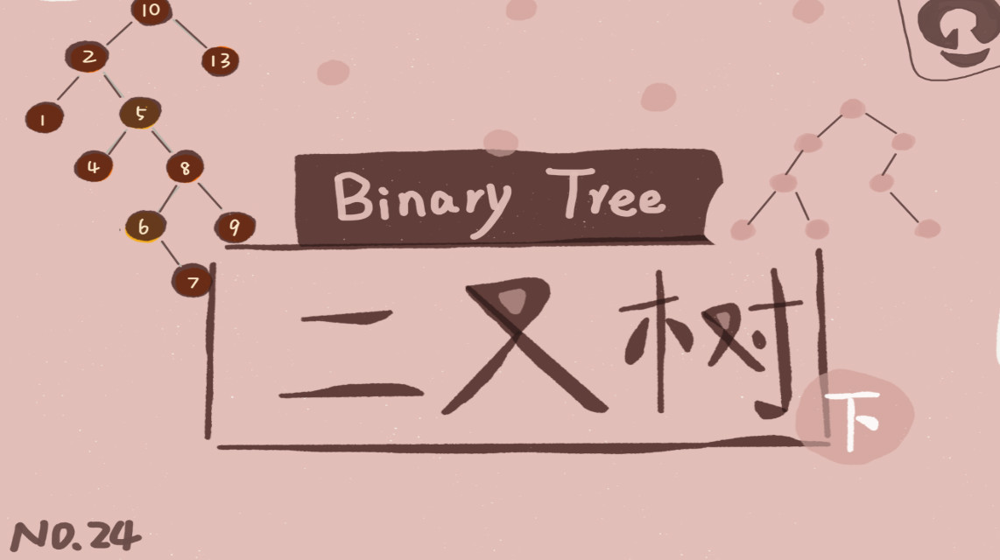



00:00

[1.0x**](javascript:;)

讲述：修阳 大小：5.66M 时长：12:21

上一节我们学习了树、二叉树以及二叉树的遍历，今天我们再来学习一种特殊的二叉树，二叉查找树。二叉查找树最大的特点就是，支持动态数据集合的快速插入、删除、查找操作。

我们之前说过，散列表也是支持这些操作的，并且散列表的这些操作比二叉查找树更高效，时间复杂度是 O(1)。**既然有了这么高效的散列表，使用二叉树的地方是不是都可以替换成散列表呢？有没有哪些地方是散列表做不了，必须要用二叉树来做的呢？**

带着这些问题，我们就来学习今天的内容，二叉查找树！

## 二叉查找树（Binary Search Tree）

二叉查找树是二叉树中最常用的一种类型，也叫二叉搜索树。顾名思义，二叉查找树是为了实现快速查找而生的。不过，它不仅仅支持快速查找一个数据，还支持快速插入、删除一个数据。它是怎么做到这些的呢？

这些都依赖于二叉查找树的特殊结构。**二叉查找树要求，在树中的任意一个节点，其左子树中的每个节点的值，都要小于这个节点的值，而右子树节点的值都大于这个节点的值。** 我画了几个二叉查找树的例子，你一看应该就清楚了。

前面我们讲到，二叉查找树支持快速查找、插入、删除操作，现在我们就依次来看下，这三个操作是如何实现的。

### 1. 二叉查找树的查找操作

首先，我们看如何在二叉查找树中查找一个节点。我们先取根节点，如果它等于我们要查找的数据，那就返回。如果要查找的数据比根节点的值小，那就在左子树中递归查找；如果要查找的数据比根节点的值大，那就在右子树中递归查找。

这里我把查找的代码实现了一下，贴在下面了，结合代码，理解起来会更加容易。

public class BinarySearchTree {

  private Node tree;

  public Node find(int data) {

​    Node p = tree;

​    while (p != null) {

​      if (data < p.data) p = p.left;

​      else if (data > p.data) p = p.right;

​      else return p;

​    }

​    return null;

  }

  public static class Node {

​    private int data;

​    private Node left;

​    private Node right;

​    public Node(int data) {

​      this.data = data;

​    }

  }

}

### 2. 二叉查找树的插入操作

二叉查找树的插入过程有点类似查找操作。新插入的数据一般都是在叶子节点上，所以我们只需要从根节点开始，依次比较要插入的数据和节点的大小关系。

如果要插入的数据比节点的数据大，并且节点的右子树为空，就将新数据直接插到右子节点的位置；如果不为空，就再递归遍历右子树，查找插入位置。同理，如果要插入的数据比节点数值小，并且节点的左子树为空，就将新数据插入到左子节点的位置；如果不为空，就再递归遍历左子树，查找插入位置。

同样，插入的代码我也实现了一下，贴在下面，你可以看看。

public void insert(int data) {

  if (tree == null) {

​    tree = new Node(data);

​    return;

  }

  Node p = tree;

  while (p != null) {

​    if (data > p.data) {

​      if (p.right == null) {

​        p.right = new Node(data);

​        return;

​      }

​      p = p.right;

​    } else { // data < p.data

​      if (p.left == null) {

​        p.left = new Node(data);

​        return;

​      }

​      p = p.left;

​    }

  }

}

### 3. 二叉查找树的删除操作

二叉查找树的查找、插入操作都比较简单易懂，但是它的删除操作就比较复杂了 。针对要删除节点的子节点个数的不同，我们需要分三种情况来处理。

第一种情况是，如果要删除的节点没有子节点，我们只需要直接将父节点中，指向要删除节点的指针置为 null。比如图中的删除节点 55。

第二种情况是，如果要删除的节点只有一个子节点（只有左子节点或者右子节点），我们只需要更新父节点中，指向要删除节点的指针，让它指向要删除节点的子节点就可以了。比如图中的删除节点 13。

第三种情况是，如果要删除的节点有两个子节点，这就比较复杂了。我们需要找到这个节点的右子树中的最小节点，把它替换到要删除的节点上。然后再删除掉这个最小节点，因为最小节点肯定没有左子节点（如果有左子结点，那就不是最小节点了），所以，我们可以应用上面两条规则来删除这个最小节点。比如图中的删除节点 18。

老规矩，我还是把删除的代码贴在这里。

public void delete(int data) {

  Node p = tree; // p指向要删除的节点，初始化指向根节点

  Node pp = null; // pp记录的是p的父节点

  while (p != null && p.data != data) {

​    pp = p;

​    if (data > p.data) p = p.right;

​    else p = p.left;

  }

  if (p == null) return; // 没有找到

  // 要删除的节点有两个子节点

  if (p.left != null && p.right != null) { // 查找右子树中最小节点

​    Node minP = p.right;

​    Node minPP = p; // minPP表示minP的父节点

​    while (minP.left != null) {

​      minPP = minP;

​      minP = minP.left;

​    }

​    p.data = minP.data; // 将minP的数据替换到p中

​    p = minP; // 下面就变成了删除minP了

​    pp = minPP;

  }

  // 删除节点是叶子节点或者仅有一个子节点

  Node child; // p的子节点

  if (p.left != null) child = p.left;

  else if (p.right != null) child = p.right;

  else child = null;

  if (pp == null) tree = child; // 删除的是根节点

  else if (pp.left == p) pp.left = child;

  else pp.right = child;

}

实际上，关于二叉查找树的删除操作，还有个非常简单、取巧的方法，就是单纯将要删除的节点标记为“已删除”，但是并不真正从树中将这个节点去掉。这样原本删除的节点还需要存储在内存中，比较浪费内存空间，但是删除操作就变得简单了很多。而且，这种处理方法也并没有增加插入、查找操作代码实现的难度。

### 4. 二叉查找树的其他操作

除了插入、删除、查找操作之外，二叉查找树中还可以支持**快速地查找最大节点和最小节点、前驱节点和后继节点**。这些操作我就不一一展示了。我会将相应的代码放到 GitHub 上，你可以自己先实现一下，然后再去上面看。

二叉查找树除了支持上面几个操作之外，还有一个重要的特性，就是**中序遍历二叉查找树，可以输出有序的数据序列，时间复杂度是 O(n)，非常高效**。因此，二叉查找树也叫作二叉排序树。

## 支持重复数据的二叉查找树

前面讲二叉查找树的时候，我们默认树中节点存储的都是数字。很多时候，在实际的软件开发中，我们在二叉查找树中存储的，是一个包含很多字段的对象。我们利用对象的某个字段作为键值（key）来构建二叉查找树。我们把对象中的其他字段叫作卫星数据。

前面我们讲的二叉查找树的操作，针对的都是不存在键值相同的情况。那如果存储的两个对象键值相同，这种情况该怎么处理呢？我这里有两种解决方法。

第一种方法比较容易。二叉查找树中每一个节点不仅会存储一个数据，因此我们通过链表和支持动态扩容的数组等数据结构，把值相同的数据都存储在同一个节点上。

第二种方法比较不好理解，不过更加优雅。

每个节点仍然只存储一个数据。在查找插入位置的过程中，如果碰到一个节点的值，与要插入数据的值相同，我们就将这个要插入的数据放到这个节点的右子树，也就是说，把这个新插入的数据当作大于这个节点的值来处理。

当要查找数据的时候，遇到值相同的节点，我们并不停止查找操作，而是继续在右子树中查找，直到遇到叶子节点，才停止。这样就可以把键值等于要查找值的所有节点都找出来。

对于删除操作，我们也需要先查找到每个要删除的节点，然后再按前面讲的删除操作的方法，依次删除。

## 二叉查找树的时间复杂度分析

好了，对于二叉查找树常用操作的实现方式，你应该掌握得差不多了。现在，我们来分析一下，二叉查找树的插入、删除、查找操作的时间复杂度。

实际上，二叉查找树的形态各式各样。比如这个图中，对于同一组数据，我们构造了三种二叉查找树。它们的查找、插入、删除操作的执行效率都是不一样的。图中第一种二叉查找树，根节点的左右子树极度不平衡，已经退化成了链表，所以查找的时间复杂度就变成了 O(n)。

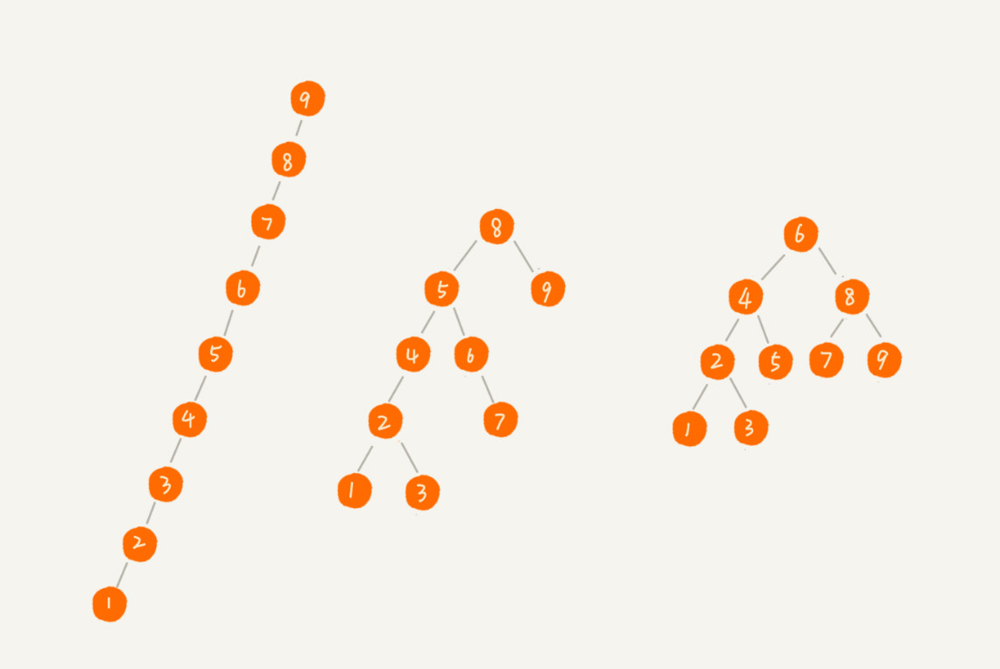

我刚刚其实分析了一种最糟糕的情况，我们现在来分析一个最理想的情况，二叉查找树是一棵完全二叉树（或满二叉树）。这个时候，插入、删除、查找的时间复杂度是多少呢？

从我前面的例子、图，以及还有代码来看，不管操作是插入、删除还是查找，**时间复杂度****其实****都跟树的高度成正比，也就是 O(height)**。既然这样，现在问题就转变成另外一个了，也就是，如何求一棵包含 n 个节点的完全二叉树的高度？

树的高度就等于最大层数减一，为了方便计算，我们转换成层来表示。从图中可以看出，包含 n 个节点的完全二叉树中，第一层包含 1 个节点，第二层包含 2 个节点，第三层包含 4 个节点，依次类推，下面一层节点个数是上一层的 2 倍，第 K 层包含的节点个数就是 2^(K-1)。

不过，对于完全二叉树来说，最后一层的节点个数有点儿不遵守上面的规律了。它包含的节点个数在 1 个到 2^(L-1) 个之间（我们假设最大层数是 L）。如果我们把每一层的节点个数加起来就是总的节点个数 n。也就是说，如果节点的个数是 n，那么 n 满足这样一个关系：

n >= 1+2+4+8+...+2^(L-2)+1

n <= 1+2+4+8+...+2^(L-2)+2^(L-1)

借助等比数列的求和公式，我们可以计算出，L 的范围是[log2(n+1), log2n +1]。完全二叉树的层数小于等于 log2n +1，也就是说，完全二叉树的高度小于等于 log2n。

显然，极度不平衡的二叉查找树，它的查找性能肯定不能满足我们的需求。我们需要构建一种不管怎么删除、插入数据，在任何时候，都能保持任意节点左右子树都比较平衡的二叉查找树，这就是我们下一节课要详细讲的，一种特殊的二叉查找树，平衡二叉查找树。平衡二叉查找树的高度接近 logn，所以插入、删除、查找操作的时间复杂度也比较稳定，是 O(logn)。

## 解答开篇

我们在散列表那节中讲过，散列表的插入、删除、查找操作的时间复杂度可以做到常量级的 O(1)，非常高效。而二叉查找树在比较平衡的情况下，插入、删除、查找操作时间复杂度才是 O(logn)，相对散列表，好像并没有什么优势，那我们为什么还要用二叉查找树呢？

我认为有下面几个原因：

第一，散列表中的数据是无序存储的，如果要输出有序的数据，需要先进行排序。而对于二叉查找树来说，我们只需要中序遍历，就可以在 O(n) 的时间复杂度内，输出有序的数据序列。

第二，散列表扩容耗时很多，而且当遇到散列冲突时，性能不稳定，尽管二叉查找树的性能不稳定，但是在工程中，我们最常用的平衡二叉查找树的性能非常稳定，时间复杂度稳定在 O(logn)。

第三，笼统地来说，尽管散列表的查找等操作的时间复杂度是常量级的，但因为哈希冲突的存在，这个常量不一定比 logn 小，所以实际的查找速度可能不一定比 O(logn) 快。加上哈希函数的耗时，也不一定就比平衡二叉查找树的效率高。

第四，散列表的构造比二叉查找树要复杂，需要考虑的东西很多。比如散列函数的设计、冲突解决办法、扩容、缩容等。平衡二叉查找树只需要考虑平衡性这一个问题，而且这个问题的解决方案比较成熟、固定。

最后，为了避免过多的散列冲突，散列表装载因子不能太大，特别是基于开放寻址法解决冲突的散列表，不然会浪费一定的存储空间。

综合这几点，平衡二叉查找树在某些方面还是优于散列表的，所以，这两者的存在并不冲突。我们在实际的开发过程中，需要结合具体的需求来选择使用哪一个。

## 内容小结

今天我们学习了一种特殊的二叉树，二叉查找树。它支持快速地查找、插入、删除操作。

二叉查找树中，每个节点的值都大于左子树节点的值，小于右子树节点的值。不过，这只是针对没有重复数据的情况。对于存在重复数据的二叉查找树，我介绍了两种构建方法，一种是让每个节点存储多个值相同的数据；另一种是，每个节点中存储一个数据。针对这种情况，我们只需要稍加改造原来的插入、删除、查找操作即可。

在二叉查找树中，查找、插入、删除等很多操作的时间复杂度都跟树的高度成正比。两个极端情况的时间复杂度分别是 O(n) 和 O(logn)，分别对应二叉树退化成链表的情况和完全二叉树。

为了避免时间复杂度的退化，针对二叉查找树，我们又设计了一种更加复杂的树，平衡二叉查找树，时间复杂度可以做到稳定的 O(logn)，下一节我们具体来讲。

## 课后思考

今天我讲了二叉树高度的理论分析方法，给出了粗略的数量级。如何通过编程，求出一棵给定二叉树的确切高度呢？

欢迎留言和我分享，我会第一时间给你反馈。

我已将本节内容相关的详细代码更新到 GitHub，戳此即可查看。

# 25 | 红黑树（上）：为什么工程中都用红黑树这种二叉树？

王争 2018-11-16

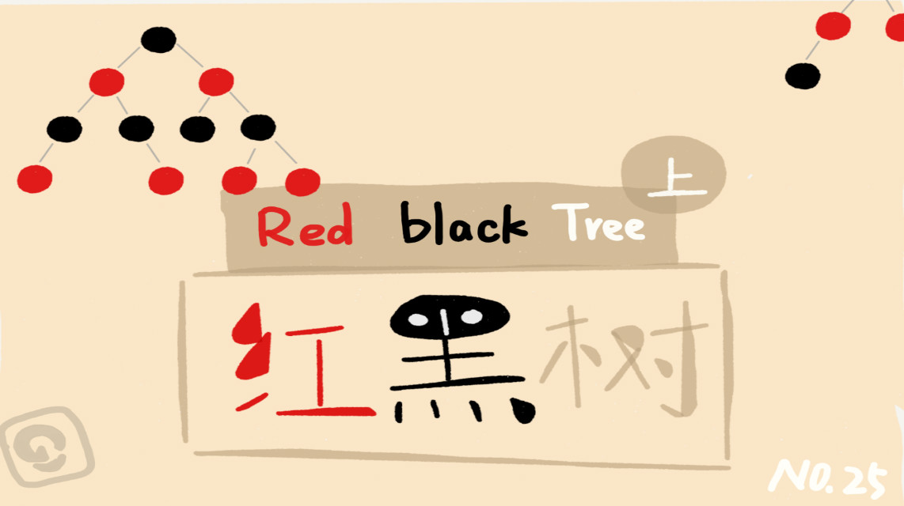



00:00

[1.0x**](javascript:;)

讲述：修阳 大小：4.59M 时长：10:00

上两节，我们依次讲了树、二叉树、二叉查找树。二叉查找树是最常用的一种二叉树，它支持快速插入、删除、查找操作，各个操作的时间复杂度跟树的高度成正比，理想情况下，时间复杂度是 O(logn)。

不过，二叉查找树在频繁的动态更新过程中，可能会出现树的高度远大于 log2n 的情况，从而导致各个操作的效率下降。极端情况下，二叉树会退化为链表，时间复杂度会退化到 O(n)。我上一节说了，要解决这个复杂度退化的问题，我们需要设计一种平衡二叉查找树，也就是今天要讲的这种数据结构。

很多书籍里，但凡讲到平衡二叉查找树，就会拿红黑树作为例子。不仅如此，如果你有一定的开发经验，你会发现，在工程中，很多用到平衡二叉查找树的地方都会用红黑树。你有没有想过，**为什么工程中都喜欢用红黑树，而不是其他平衡二叉查找树呢？**

带着这个问题，让我们一起来学习今天的内容吧！

## 什么是“平衡二叉查找树”？

平衡二叉树的严格定义是这样的：二叉树中任意一个节点的左右子树的高度相差不能大于 1。从这个定义来看，上一节我们讲的完全二叉树、满二叉树其实都是平衡二叉树，但是非完全二叉树也有可能是平衡二叉树。

平衡二叉查找树不仅满足上面平衡二叉树的定义，还满足二叉查找树的特点。最先被发明的平衡二叉查找树是AVL 树，它严格符合我刚讲到的平衡二叉查找树的定义，即任何节点的左右子树高度相差不超过 1，是一种高度平衡的二叉查找树。

但是很多平衡二叉查找树其实并没有严格符合上面的定义（树中任意一个节点的左右子树的高度相差不能大于 1），比如我们下面要讲的红黑树，它从根节点到各个叶子节点的最长路径，有可能会比最短路径大一倍。

我们学习数据结构和算法是为了应用到实际的开发中的，所以，我觉得没必去死抠定义。对于平衡二叉查找树这个概念，我觉得我们要从这个数据结构的由来，去理解“平衡”的意思。

发明平衡二叉查找树这类数据结构的初衷是，解决普通二叉查找树在频繁的插入、删除等动态更新的情况下，出现时间复杂度退化的问题。

所以，**平衡二叉查找树中“平衡”的意思，其实就是让整棵树左右看起来比较“对称”、比较“平衡”，不要出现左子树很高、右子树很矮的情况。这样就能让整棵树的高度相对来说低一些，相应的插入、删除、查找等操作的效率高一些。**

所以，如果我们现在设计一个新的平衡二叉查找树，只要树的高度不比 log2n 大很多（比如树的高度仍然是对数量级的），尽管它不符合我们前面讲的严格的平衡二叉查找树的定义，但我们仍然可以说，这是一个合格的平衡二叉查找树。

## 如何定义一棵“红黑树”？

平衡二叉查找树其实有很多，比如，Splay Tree（伸展树）、Treap（树堆）等，但是我们提到平衡二叉查找树，听到的基本都是红黑树。它的出镜率甚至要高于“平衡二叉查找树”这几个字，有时候，我们甚至默认平衡二叉查找树就是红黑树，那我们现在就来看看这个“明星树”。

红黑树的英文是“Red-Black Tree”，简称 R-B Tree。它是一种不严格的平衡二叉查找树，我前面说了，它的定义是不严格符合平衡二叉查找树的定义的。那红黑树究竟是怎么定义的呢？

顾名思义，红黑树中的节点，一类被标记为黑色，一类被标记为红色。除此之外，一棵红黑树还需要满足这样几个要求：

根节点是黑色的；

每个叶子节点都是黑色的空节点（NIL），也就是说，叶子节点不存储数据；

任何相邻的节点都不能同时为红色，也就是说，红色节点是被黑色节点隔开的；

每个节点，从该节点到达其可达叶子节点的所有路径，都包含相同数目的黑色节点；

这里的第二点要求“叶子节点都是黑色的空节点”，稍微有些奇怪，它主要是为了简化红黑树的代码实现而设置的，下一节我们讲红黑树的实现的时候会讲到。**这节我们暂时不考虑这一点，所以，在画图和讲解的时候，我将黑色的、空的叶子节点都省略掉了。**

为了让你更好地理解上面的定义，我画了两个红黑树的图例，你可以对照着看下。

## 为什么说红黑树是“近似平衡”的？

我们前面也讲到，平衡二叉查找树的初衷，是为了解决二叉查找树因为动态更新导致的性能退化问题。所以，**“平衡”的意思可以等价为性能不退化。“近似平衡”就等价为性能不会退化得太严重**。

我们在上一节讲过，二叉查找树很多操作的性能都跟树的高度成正比。一棵极其平衡的二叉树（满二叉树或完全二叉树）的高度大约是 log2n，所以如果要证明红黑树是近似平衡的，我们只需要分析，红黑树的高度是否比较稳定地趋近 log2n 就好了。

红黑树的高度不是很好分析，我带你一步一步来推导。

**首先，我们来看，如果我们将红色节点从红黑树中去掉，那单纯包含黑色节点的红黑树的高度是多少呢？**

红色节点删除之后，有些节点就没有父节点了，它们会直接拿这些节点的祖父节点（父节点的父节点）作为父节点。所以，之前的二叉树就变成了四叉树。

前面红黑树的定义里有这么一条：从任意节点到可达的叶子节点的每个路径包含相同数目的黑色节点。我们从四叉树中取出某些节点，放到叶节点位置，四叉树就变成了完全二叉树。所以，仅包含黑色节点的四叉树的高度，比包含相同节点个数的完全二叉树的高度还要小。

上一节我们说，完全二叉树的高度近似 log2n，这里的四叉“黑树”的高度要低于完全二叉树，所以去掉红色节点的“黑树”的高度也不会超过 log2n。

**我们现在知道只包含黑色节点的“黑树”的高度，那我们现在把红色节点加回去，高度会变成多少呢？**

从上面我画的红黑树的例子和定义看，在红黑树中，红色节点不能相邻，也就是说，有一个红色节点就要至少有一个黑色节点，将它跟其他红色节点隔开。红黑树中包含最多黑色节点的路径不会超过 log2n，所以加入红色节点之后，最长路径不会超过 2log2n，也就是说，红黑树的高度近似 2log2n。

所以，红黑树的高度只比高度平衡的 AVL 树的高度（log2n）仅仅大了一倍，在性能上，下降得并不多。这样推导出来的结果不够精确，实际上红黑树的性能更好。

## 解答开篇

我们刚刚提到了很多平衡二叉查找树，现在我们就来看下，为什么在工程中大家都喜欢用红黑树这种平衡二叉查找树？

我们前面提到 Treap、Splay Tree，绝大部分情况下，它们操作的效率都很高，但是也无法避免极端情况下时间复杂度的退化。尽管这种情况出现的概率不大，但是对于单次操作时间非常敏感的场景来说，它们并不适用。

AVL 树是一种高度平衡的二叉树，所以查找的效率非常高，但是，有利就有弊，AVL 树为了维持这种高度的平衡，就要付出更多的代价。每次插入、删除都要做调整，就比较复杂、耗时。所以，对于有频繁的插入、删除操作的数据集合，使用 AVL 树的代价就有点高了。

红黑树只是做到了近似平衡，并不是严格的平衡，所以在维护平衡的成本上，要比 AVL 树要低。

所以，红黑树的插入、删除、查找各种操作性能都比较稳定。对于工程应用来说，要面对各种异常情况，为了支撑这种工业级的应用，我们更倾向于这种性能稳定的平衡二叉查找树。

## 内容小结

很多同学都觉得红黑树很难，的确，它算是最难掌握的一种数据结构。其实红黑树最难的地方是它的实现，我们今天还没有涉及，下一节我会专门来讲。

不过呢，我认为，我们其实不应该把学习的侧重点，放到它的实现上。那你可能要问了，关于红黑树，我们究竟需要掌握哪些东西呢？

还记得我多次说过的观点吗？**我们学习数据结构和算法，要学习它的由来、特性、适用的场景以及它能解决的问题。对于红黑树，也不例外。你如果能搞懂这几个问题，其实就已经足够了。**

红黑树是一种平衡二叉查找树。它是为了解决普通二叉查找树在数据更新的过程中，复杂度退化的问题而产生的。红黑树的高度近似 log2n，所以它是近似平衡，插入、删除、查找操作的时间复杂度都是 O(logn)。

因为红黑树是一种性能非常稳定的二叉查找树，所以，在工程中，但凡是用到动态插入、删除、查找数据的场景，都可以用到它。不过，它实现起来比较复杂，如果自己写代码实现，难度会有些高，这个时候，我们其实更倾向用跳表来替代它。

## 课后思考

动态数据结构支持动态的数据插入、删除、查找操作，除了红黑树，我们前面还学习过哪些呢？能对比一下各自的优势、劣势，以及应用场景吗？

欢迎留言和我分享，我会第一时间给你反馈。

# 26 | 红黑树（下）：掌握这些技巧，你也可以实现一个红黑树

王争 2018-11-19

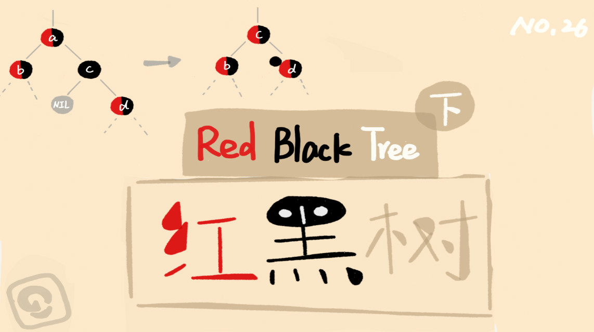



00:00

[1.0x**](javascript:;)

讲述：修阳 大小：6.90M 时长：15:03

红黑树是一个让我又爱又恨的数据结构，“爱”是因为它稳定、高效的性能，“恨”是因为实现起来实在太难了。我今天讲的红黑树的实现，对于基础不太好的同学，理解起来可能会有些困难。但是，我觉得没必要去死磕它。

我为什么这么说呢？因为，即便你将左右旋背得滚瓜烂熟，我保证你过不几天就忘光了。因为，学习红黑树的代码实现，对于你平时做项目开发没有太大帮助。对于绝大部分开发工程师来说，这辈子你可能都用不着亲手写一个红黑树。除此之外，它对于算法面试也几乎没什么用，一般情况下，靠谱的面试官也不会让你手写红黑树的。

如果你对数据结构和算法很感兴趣，想要开拓眼界、训练思维，我还是很推荐你看一看这节的内容。但是如果学完今天的内容你还觉得懵懵懂懂的话，也不要纠结。我们要有的放矢去学习。你先把平时要用的、基础的东西都搞会了，如果有余力了，再来深入地研究这节内容。

好，我们现在就进入正式的内容。**上一节，我们讲到红黑树定义的时候，提到红黑树的叶子节点都是黑色的空节点。当时我只是粗略地解释了，这是为了代码实现方便，那更加确切的原因是什么呢？** 我们这节就来说一说。

## 实现红黑树的基本思想

不知道你有没有玩过魔方？其实魔方的复原解法是有固定算法的：遇到哪几面是什么样子，对应就怎么转几下。你只要跟着这个复原步骤，就肯定能将魔方复原。

实际上，红黑树的平衡过程跟魔方复原非常神似，大致过程就是：**遇到什么样的节点排布，我们就对应怎么去调整**。只要按照这些固定的调整规则来操作，就能将一个非平衡的红黑树调整成平衡的。

还记得我们前面讲过的红黑树的定义吗？今天的内容里，我们会频繁用到它，所以，我们现在再来回顾一下。一棵合格的红黑树需要满足这样几个要求：

根节点是黑色的；

每个叶子节点都是黑色的空节点（NIL），也就是说，叶子节点不存储数据；

任何相邻的节点都不能同时为红色，也就是说，红色节点是被黑色节点隔开的；

每个节点，从该节点到达其可达叶子节点的所有路径，都包含相同数目的黑色节点。

在插入、删除节点的过程中，第三、第四点要求可能会被破坏，而我们今天要讲的“平衡调整”，实际上就是要把被破坏的第三、第四点恢复过来。

在正式开始之前，我先介绍两个非常重要的操作，**左旋（rotate left）**、**右旋（rotate right）**。左旋全称其实是叫**围绕某个节点的左旋**，那右旋的全称估计你已经猜到了，就叫**围绕某个节点的右旋**。

我们下面的平衡调整中，会一直用到这两个操作，所以我这里画了个示意图，帮助你彻底理解这两个操作。图中的 a，b，r 表示子树，可以为空。

前面我说了，红黑树的插入、删除操作会破坏红黑树的定义，具体来说就是会破坏红黑树的平衡，所以，我们现在就来看下，红黑树在插入、删除数据之后，如何调整平衡，继续当一棵合格的红黑树的。

## 插入操作的平衡调整

首先，我们来看插入操作。

**红黑树规定，插入的节点必须是红色的。****而且，二叉查找树中新插入的节点都是放在叶子节点上**。所以，关于插入操作的平衡调整，有这样两种特殊情况，但是也都非常好处理。

如果插入节点的父节点是黑色的，那我们什么都不用做，它仍然满足红黑树的定义。

如果插入的节点是根节点，那我们直接改变它的颜色，把它变成黑色就可以了。

除此之外，其他情况都会违背红黑树的定义，于是我们就需要进行调整，调整的过程包含两种基础的操作：**左右旋转**和**改变颜色**。

红黑树的平衡调整过程是一个迭代的过程。我们把正在处理的节点叫做**关注节点**。关注节点会随着不停地迭代处理，而不断发生变化。最开始的关注节点就是新插入的节点。

新节点插入之后，如果红黑树的平衡被打破，那一般会有下面三种情况。我们只需要根据每种情况的特点，不停地调整，就可以让红黑树继续符合定义，也就是继续保持平衡。

我们下面依次来看每种情况的调整过程。提醒你注意下，为了简化描述，我把父节点的兄弟节点叫做叔叔节点，父节点的父节点叫做祖父节点。

**CASE 1：如果关注节点是 a，它的叔叔节点 d 是红色**，我们就依次执行下面的操作：

将关注节点 a 的父节点 b、叔叔节点 d 的颜色都设置成黑色；

将关注节点 a 的祖父节点 c 的颜色设置成红色；

关注节点变成 a 的祖父节点 c；

跳到 CASE  2 或者 CASE  3。

**CASE 2：如果关注节点是 a，它的叔叔节点 d 是黑色，关注节点 a 是其父节点 b 的右子节点**，我们就依次执行下面的操作：

关注节点变成节点 a 的父节点 b；

围绕新的关注节点b 左旋；

跳到 CASE  3。

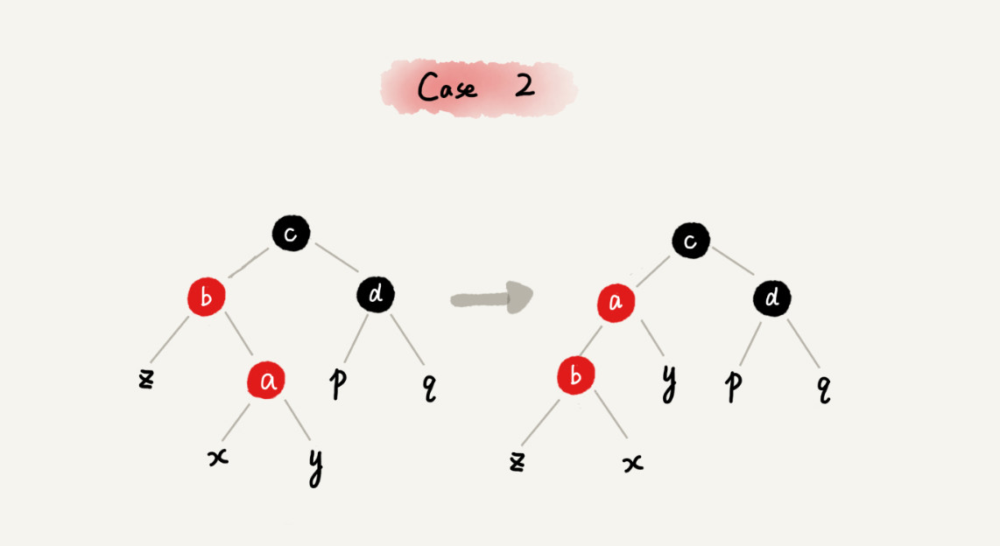

**CASE 3：如果关注节点是 a，它的叔叔节点 d 是黑色，关注节点 a 是其父节点 b 的左子节点**，我们就依次执行下面的操作：

围绕关注节点 a 的祖父节点 c 右旋；

将关注节点 a 的父节点 b、兄弟节点 c 的颜色互换。

调整结束。

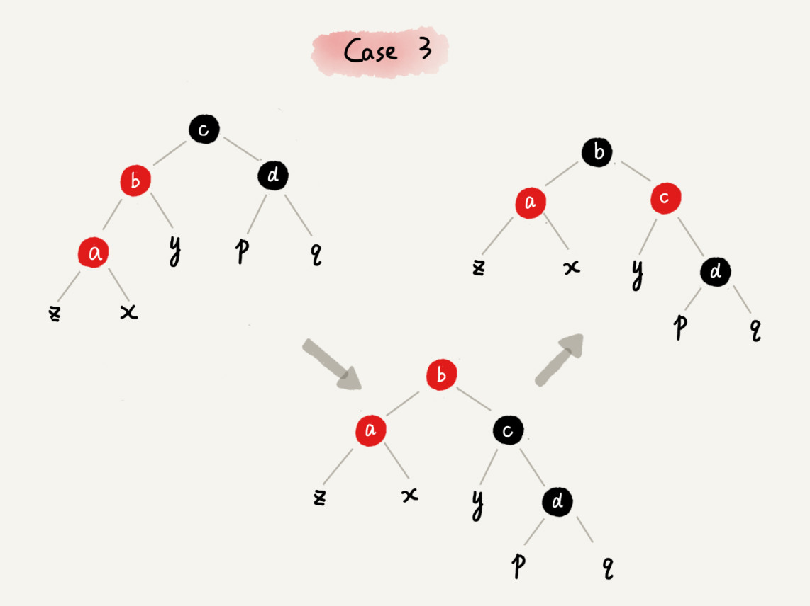

## 删除操作的平衡调整

红黑树插入操作的平衡调整还不是很难，但是它的删除操作的平衡调整相对就要难多了。不过原理都是类似的，我们依旧只需要根据关注节点与周围节点的排布特点，按照一定的规则去调整就行了。

删除操作的平衡调整分为两步，第一步是**针对删除节点初步调整**。初步调整只是保证整棵红黑树在一个节点删除之后，仍然满足最后一条定义的要求，也就是说，每个节点，从该节点到达其可达叶子节点的所有路径，都包含相同数目的黑色节点；第二步是**针对关注节点进行二次调整**，让它满足红黑树的第三条定义，即不存在相邻的两个红色节点。

### 1. 针对删除节点初步调整

这里需要注意一下，红黑树的定义中“只包含红色节点和黑色节点”，经过初步调整之后，为了保证满足红黑树定义的最后一条要求，有些节点会被标记成两种颜色，“红 - 黑”或者“黑 - 黑”。如果一个节点被标记为了“黑 - 黑”，那在计算黑色节点个数的时候，要算成两个黑色节点。

在下面的讲解中，如果一个节点既可以是红色，也可以是黑色，在画图的时候，我会用一半红色一半黑色来表示。如果一个节点是“红 - 黑”或者“黑 - 黑”，我会用左上角的一个小黑点来表示额外的黑色。

**CASE 1：如果要删除的节点是 a，它只有一个子节点 b**，那我们就依次进行下面的操作：

删除节点 a，并且把节点 b 替换到节点 a 的位置，这一部分操作跟普通的二叉查找树的删除操作一样；

节点 a 只能是黑色，节点 b 也只能是红色，其他情况均不符合红黑树的定义。这种情况下，我们把节点 b 改为黑色；

调整结束，不需要进行二次调整。

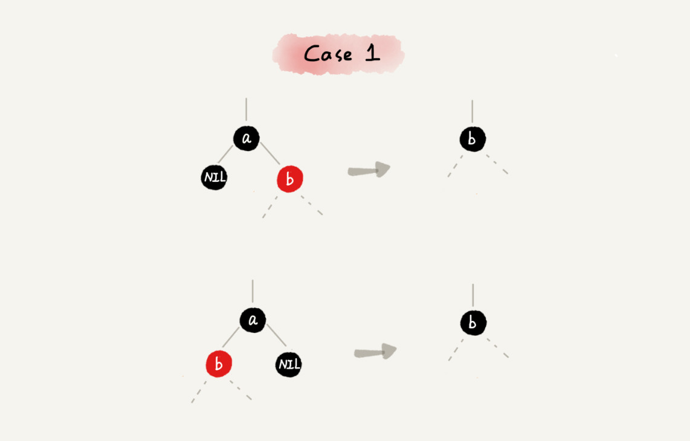

**CASE 2：如果要删除的节点 a 有两个非空子节点，并且它的后继节点就是节点 a 的右子节点 c**。我们就依次进行下面的操作：

如果节点 a 的后继节点就是右子节点 c，那右子节点 c 肯定没有左子树。我们把节点 a 删除，并且将节点 c 替换到节点 a 的位置。这一部分操作跟普通的二叉查找树的删除操作无异；

然后把节点 c 的颜色设置为跟节点 a 相同的颜色；

如果节点 c 是黑色，为了不违反红黑树的最后一条定义，我们给节点 c 的右子节点 d 多加一个黑色，这个时候节点 d 就成了“红 - 黑”或者“黑 - 黑”；

这个时候，关注节点变成了节点 d，第二步的调整操作就会针对关注节点来做。

**CASE 3：如果要删除的是节点 a，它有两个非空子节点，并且节点 a 的后继节点不是右子节点**，我们就依次进行下面的操作：

找到后继节点 d，并将它删除，删除后继节点 d 的过程参照 CASE  1；

将节点 a 替换成后继节点 d；

把节点 d 的颜色设置为跟节点 a 相同的颜色；

如果节点 d 是黑色，为了不违反红黑树的最后一条定义，我们给节点 d 的右子节点 c 多加一个黑色，这个时候节点 c 就成了“红 - 黑”或者“黑 - 黑”；

这个时候，关注节点变成了节点 c，第二步的调整操作就会针对关注节点来做。

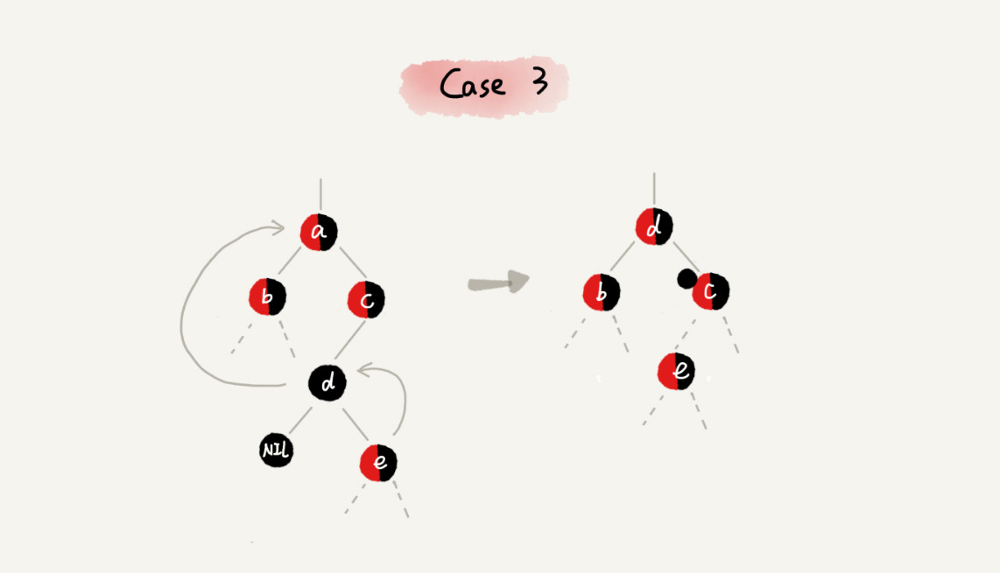

### 2. 针对关注节点进行二次调整

经过初步调整之后，关注节点变成了“红 - 黑”或者“黑 - 黑”节点。针对这个关注节点，我们再分四种情况来进行二次调整。二次调整是为了让红黑树中不存在相邻的红色节点。

**CASE 1：如果关注节点是 a，它的兄弟节点 c 是红色的**，我们就依次进行下面的操作：

围绕关注节点 a 的父节点 b 左旋；

关注节点 a 的父节点 b 和祖父节点 c 交换颜色；

关注节点不变；

继续从四种情况中选择适合的规则来调整。

**CASE 2：如果关注节点是 a，它的兄弟节点 c 是黑色的，并且节点 c 的左右子节点 d、e 都是黑色的**，我们就依次进行下面的操作：

将关注节点 a 的兄弟节点 c 的颜色变成红色；

从关注节点 a 中去掉一个黑色，这个时候节点 a 就是单纯的红色或者黑色；

给关注节点 a 的父节点 b 添加一个黑色，这个时候节点 b 就变成了“红 - 黑”或者“黑 - 黑”；

关注节点从 a 变成其父节点 b；

继续从四种情况中选择符合的规则来调整。

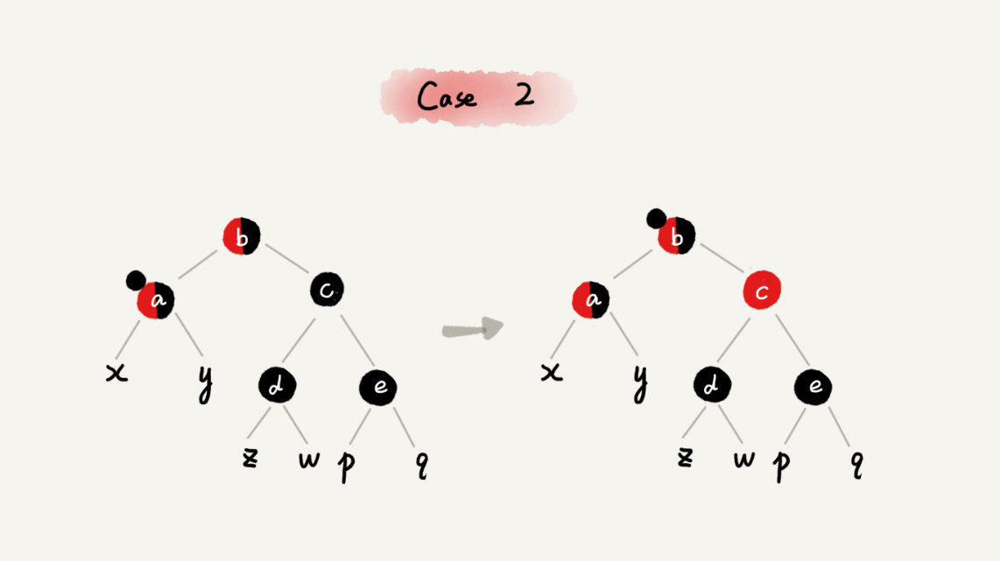

**CASE 3：如果关注节点是 a，它的兄弟节点 c 是黑色，c 的左子节点 d 是红色，c 的右子节点 e 是黑色**，我们就依次进行下面的操作：

围绕关注节点 a 的兄弟节点 c 右旋；

节点 c 和节点 d 交换颜色；

关注节点不变；

跳转到 CASE  4，继续调整。

**CASE 4：如果关注节点 a 的兄弟节点 c 是黑色的，并且 c 的右子节点是红色的**，我们就依次进行下面的操作：

围绕关注节点 a 的父节点 b 左旋；

将关注节点 a 的兄弟节点 c 的颜色，跟关注节点 a 的父节点 b 设置成相同的颜色；

将关注节点 a 的父节点 b 的颜色设置为黑色；

从关注节点 a 中去掉一个黑色，节点 a 就变成了单纯的红色或者黑色；

将关注节点 a 的叔叔节点 e 设置为黑色；

调整结束。

## 解答开篇

红黑树的平衡调整就讲完了，现在，你能回答开篇的问题了吗？为什么红黑树的定义中，要求叶子节点是黑色的空节点？

要我说，之所以有这么奇怪的要求，其实就是为了实现起来方便。只要满足这一条要求，那在任何时刻，红黑树的平衡操作都可以归结为我们刚刚讲的那几种情况。

还是有点不好理解，我通过一个例子来解释一下。假设红黑树的定义中不包含刚刚提到的那一条“叶子节点必须是黑色的空节点”，我们往一棵红黑树中插入一个数据，新插入节点的父节点也是红色的，两个红色的节点相邻，这个时候，红黑树的定义就被破坏了。那我们应该如何调整呢？

你会发现，这个时候，我们前面在讲插入时，三种情况下的平衡调整规则，没有一种是适用的。但是，如果我们把黑色的空节点都给它加上，变成下面这样，你会发现，它满足 CASE 2 了。

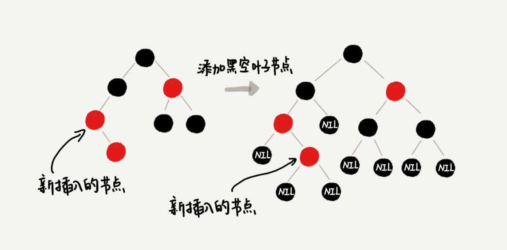

你可能会说，你可以调整一下平衡调整规则啊。比如把 CASE 2 改为“如果关注节点 a 的叔叔节点 b 是黑色或者不存在，a 是父节点的右子节点，就进行某某操作”。当然可以，但是这样的话规则就没有原来简洁了。

你可能还会说，这样给红黑树添加黑色的空的叶子节点，会不会比较浪费存储空间呢？答案是不会的。虽然我们在讲解或者画图的时候，每个黑色的、空的叶子节点都是独立画出来的。实际上，在具体实现的时候，我们只需要像下面这样，共用一个黑色的、空的叶子节点就行了。

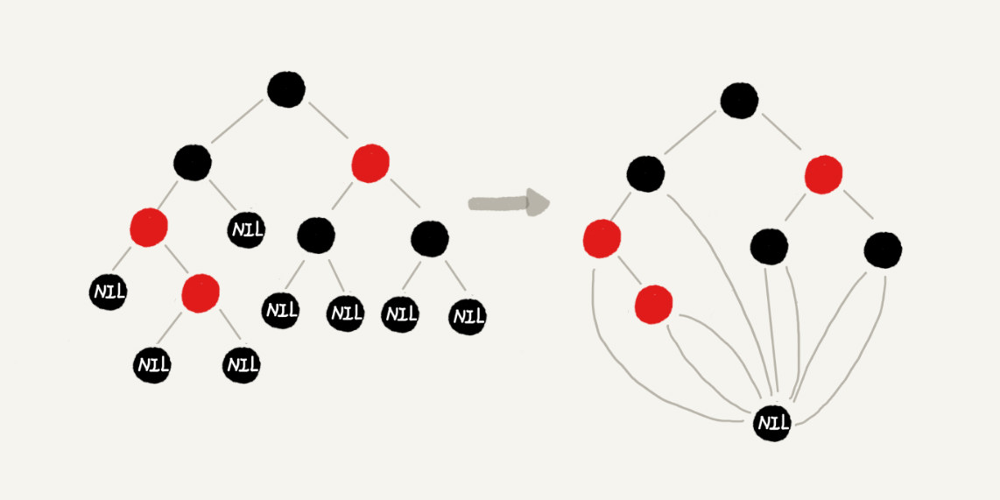

## 内容小结

“红黑树一向都很难学”，有这种想法的人很多。但是我感觉，其实主要原因是，很多人试图去记忆它的平衡调整策略。实际上，你只需要能看懂我讲的过程，没有知识盲点，就算是掌握了这部分内容了。毕竟实际的软件开发并不是闭卷考试，当你真的需要实现一个红黑树的时候，可以对照着我讲的步骤，一点一点去实现。

现在，我就来总结一下，如何比较轻松地看懂我今天讲的操作过程。

第一点，**把红黑树的平衡调整的过程比作魔方复原，不要过于深究这个算法的正确性**。你只需要明白，只要按照固定的操作步骤，保持插入、删除的过程，不破坏平衡树的定义就行了。

第二点，**找准关注节点，不要搞丢、搞错关注节点**。因为每种操作规则，都是基于关注节点来做的，只有弄对了关注节点，才能对应到正确的操作规则中。在迭代的调整过程中，关注节点在不停地改变，所以，这个过程一定要注意，不要弄丢了关注节点。

第三点，**插入操作的平衡调整比较简单，但是删除操作就比较复杂**。针对删除操作，我们有两次调整，第一次是针对要删除的节点做初步调整，让调整后的红黑树继续满足第四条定义，“每个节点到可达叶子节点的路径都包含相同个数的黑色节点”。但是这个时候，第三条定义就不满足了，有可能会存在两个红色节点相邻的情况。第二次调整就是解决这个问题，让红黑树不存在相邻的红色节点。

## 课后思考

如果你以前了解或者学习过红黑树，关于红黑树的实现，你也可以在留言区讲讲，你是怎样来学习的？在学习的过程中，有过什么样的心得体会？有没有什么好的学习方法？

欢迎留言和我分享，我会第一时间给你反馈。

# 27 | 递归树：如何借助树来求解递归算法的时间复杂度？

王争 2018-11-21

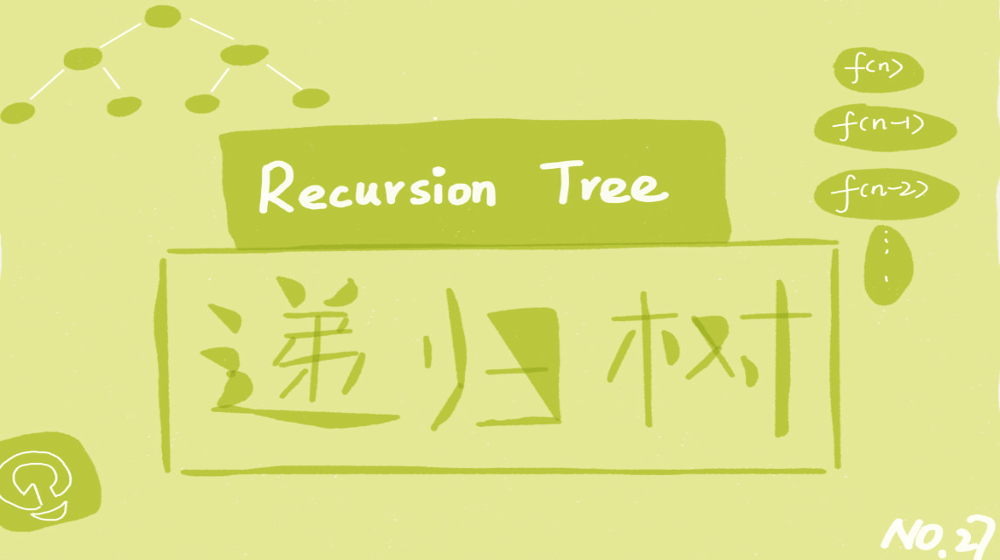



00:00

[1.0x**](javascript:;)

讲述：修阳 大小：5.72M 时长：12:28

今天，我们来讲这种数据结构的一种特殊应用，递归树。

我们都知道，递归代码的时间复杂度分析起来很麻烦。我们在第 12 节《排序（下）》那里讲过，如何利用递推公式，求解归并排序、快速排序的时间复杂度，但是，有些情况，比如快排的平均时间复杂度的分析，用递推公式的话，会涉及非常复杂的数学推导。

除了用递推公式这种比较复杂的分析方法，有没有更简单的方法呢？今天，我们就来学习另外一种方法，**借助递归树来分析递归算法的时间复杂度**。

## 递归树与时间复杂度分析

我们前面讲过，递归的思想就是，将大问题分解为小问题来求解，然后再将小问题分解为小小问题。这样一层一层地分解，直到问题的数据规模被分解得足够小，不用继续递归分解为止。

如果我们把这个一层一层的分解过程画成图，它其实就是一棵树。我们给这棵树起一个名字，叫作**递归树**。我这里画了一棵斐波那契数列的递归树，你可以看看。节点里的数字表示数据的规模，一个节点的求解可以分解为左右子节点两个问题的求解。

通过这个例子，你对递归树的样子应该有个感性的认识了，看起来并不复杂。现在，我们就来看，**如何用递归树来求解时间复杂度**。

归并排序算法你还记得吧？它的递归实现代码非常简洁。现在我们就借助归并排序来看看，如何用递归树，来分析递归代码的时间复杂度。

归并排序的原理我就不详细介绍了，如果你忘记了，可以回看一下第 12 节的内容。归并排序每次会将数据规模一分为二。我们把归并排序画成递归树，就是下面这个样子：

因为每次分解都是一分为二，所以代价很低，我们把时间上的消耗记作常量 1。归并算法中比较耗时的是归并操作，也就是把两个子数组合并为大数组。从图中我们可以看出，每一层归并操作消耗的时间总和是一样的，跟要排序的数据规模有关。我们把每一层归并操作消耗的时间记作 *n*。

现在，我们只需要知道这棵树的高度 *h*，用高度 *h* 乘以每一层的时间消耗 *n*，就可以得到总的时间复杂度 *O*(*n*∗*h*)。

从归并排序的原理和递归树，可以看出来，归并排序递归树是一棵满二叉树。我们前两节中讲到，满二叉树的高度大约是 log2*n*，所以，归并排序递归实现的时间复杂度就是 *O*(*n*log*n*)。我这里的时间复杂度都是估算的，对树的高度的计算也没有那么精确，但是这并不影响复杂度的计算结果。

利用递归树的时间复杂度分析方法并不难理解，关键还是在实战，所以，接下来我会通过三个实际的递归算法，带你实战一下递归的复杂度分析。学完这节课之后，你应该能真正掌握递归代码的复杂度分析。

## 实战一：分析快速排序的时间复杂度

在用递归树推导之前，我们先来回忆一下用递推公式的分析方法。你可以回想一下，当时，我们为什么说用递推公式来求解平均时间复杂度非常复杂？

快速排序在最好情况下，每次分区都能一分为二，这个时候用递推公式 *T*(*n*)=2*T*(2*n*)+*n*，很容易就能推导出时间复杂度是 *O*(*n*log*n*)。但是，我们并不可能每次分区都这么幸运，正好一分为二。

我们假设平均情况下，每次分区之后，两个分区的大小比例为 1:*k*。当 *k*=9 时，如果用递推公式的方法来求解时间复杂度的话，递推公式就写成 *T*(*n*)=*T*(10*n*)+*T*(109*n*)+*n*。

这个公式可以推导出时间复杂度，但是推导过程非常复杂。那我们来看看，**用递归树来分析快速排序的平均情况时间复杂度，是不是比较简单呢？**

我们还是取 *k* 等于 9，也就是说，每次分区都很不平均，一个分区是另一个分区的 9 倍。如果我们把递归分解的过程画成递归树，就是下面这个样子：

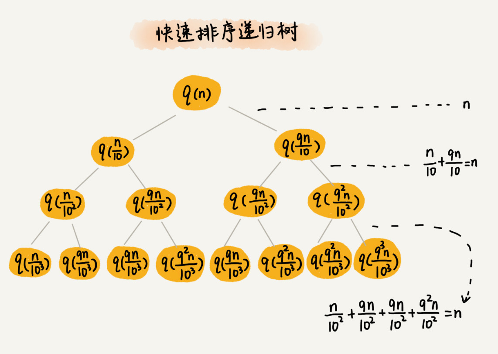

快速排序的过程中，每次分区都要遍历待分区区间的所有数据，所以，每一层分区操作所遍历的数据的个数之和就是 *n*。我们现在只要求出递归树的高度 *h*，这个快排过程遍历的数据个数就是 *h*∗*n* ，也就是说，时间复杂度就是 *O*(*h*∗*n*)。

因为每次分区并不是均匀地一分为二，所以递归树并不是满二叉树。这样一个递归树的高度是多少呢？

我们知道，快速排序结束的条件就是待排序的小区间，大小为 1，也就是说叶子节点里的数据规模是 1。从根节点 *n* 到叶子节点 1，递归树中最短的一个路径每次都乘以 101，最长的一个路径每次都乘以 109。通过计算，我们可以得到，从根节点到叶子节点的最短路径是 log10*n*，最长的路径是 log910*n*。

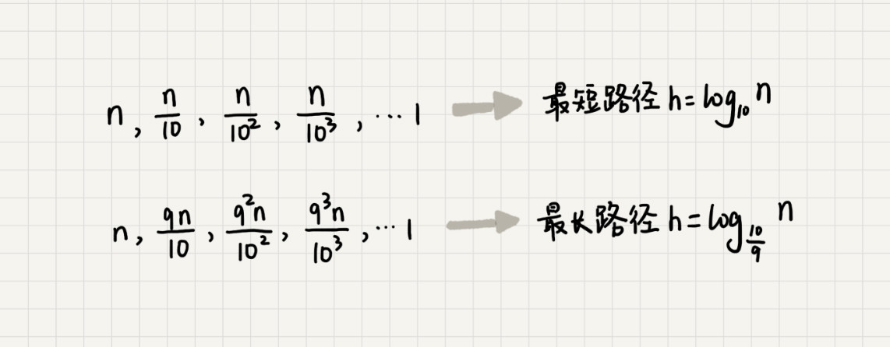

所以，遍历数据的个数总和就介于 *n*log10*n* 和 *n*log910*n* 之间。根据复杂度的大 O 表示法，对数复杂度的底数不管是多少，我们统一写成 log*n*，所以，当分区大小比例是 1:9 时，快速排序的时间复杂度仍然是 *O*(*n*log*n*)。

刚刚我们假设 *k*=9，那如果 *k*=99，也就是说，每次分区极其不平均，两个区间大小是 1:99，这个时候的时间复杂度是多少呢？

我们可以类比上面 *k*=9 的分析过程。当 *k*=99 的时候，树的最短路径就是 log100*n*，最长路径是 log99100*n*，所以总遍历数据个数介于 *n*log100*n* 和 *n*log99100*n* 之间。尽管底数变了，但是时间复杂度也仍然是 *O*(*n*log*n*)。

也就是说，对于 *k* 等于 9，99，甚至是 999，9999……，只要 *k* 的值不随 *n* 变化，是一个事先确定的常量，那快排的时间复杂度就是 *O*(*n*log*n*)。所以，从概率论的角度来说，快排的平均时间复杂度就是 *O*(*n*log*n*)。

## 实战二：分析斐波那契数列的时间复杂度

在递归那一节中，我们举了一个跨台阶的例子，你还记得吗？那个例子实际上就是一个斐波那契数列。为了方便你回忆，我把它的代码实现贴在这里。

int f(int n) {

  if (n == 1) return 1;

  if (n == 2) return 2;

  return f(n-1) + f(n-2);

}

这样一段代码的时间复杂度是多少呢？你可以先试着分析一下，然后再来看，我是怎么利用递归树来分析的。

我们先把上面的递归代码画成递归树，就是下面这个样子：

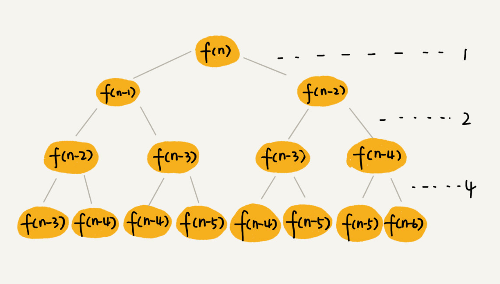

这棵递归树的高度是多少呢？

*f*(*n*) 分解为 *f*(*n*−1) 和 *f*(*n*−2)，每次数据规模都是 −1 或者 −2，叶子节点的数据规模是 1 或者 2。所以，从根节点走到叶子节点，每条路径是长短不一的。如果每次都是 −1，那最长路径大约就是 *n*；如果每次都是 −2，那最短路径大约就是 2*n*。

每次分解之后的合并操作只需要一次加法运算，我们把这次加法运算的时间消耗记作 1。所以，从上往下，第一层的总时间消耗是 1，第二层的总时间消耗是 2，第三层的总时间消耗就是 22。依次类推，第 *k* 层的时间消耗就是 2*k*−1，那整个算法的总的时间消耗就是每一层时间消耗之和。

如果路径长度都为 *n*，那这个总和就是 2*n*−1。

如果路径长度都是 2*n* ，那整个算法的总的时间消耗就是 22*n*−1。

所以，这个算法的时间复杂度就介于 *O*(2*n*) 和 *O*(22*n*) 之间。虽然这样得到的结果还不够精确，只是一个范围，但是我们也基本上知道了上面算法的时间复杂度是指数级的，非常高。

## 实战三：分析全排列的时间复杂度

前面两个复杂度分析都比较简单，我们再来看个稍微复杂的。

我们在高中的时候都学过排列组合。“如何把 *n* 个数据的所有排列都找出来”，这就是全排列的问题。

我来举个例子。比如，1，2，3 这样 3 个数据，有下面这几种不同的排列：

1, 2, 3

1, 3, 2

2, 1, 3

2, 3, 1

3, 1, 2

3, 2, 1

如何编程打印一组数据的所有排列呢？这里就可以用递归来实现。

如果我们确定了最后一位数据，那就变成了求解剩下 *n*−1 个数据的排列问题。而最后一位数据可以是 *n* 个数据中的任意一个，因此它的取值就有 *n* 种情况。所以，“*n* 个数据的排列”问题，就可以分解成 *n* 个“*n*−1 个数据的排列”的子问题。

如果我们把它写成递推公式，就是下面这个样子：

假设数组中存储的是1，2， 3...n。

​        

f(1,2,...n) = {最后一位是1, f(n-1)} + {最后一位是2, f(n-1)} +...+{最后一位是n, f(n-1)}。

如果我们把递推公式改写成代码，就是下面这个样子：

// 调用方式：

// int[]a = a={1, 2, 3, 4}; printPermutations(a, 4, 4);

// k表示要处理的子数组的数据个数

public void printPermutations(int[] data, int n, int k) {

  if (k == 1) {

​    for (int i = 0; i < n; ++i) {

​      System.out.print(data[i] + " ");

​    }

​    System.out.println();

  }

  for (int i = 0; i < k; ++i) {

​    int tmp = data[i];

​    data[i] = data[k-1];

​    data[k-1] = tmp;

​    printPermutations(data, n, k - 1);

​    tmp = data[i];

​    data[i] = data[k-1];

​    data[k-1] = tmp;

  }

}

如果不用我前面讲的递归树分析方法，这个递归代码的时间复杂度会比较难分析。现在，我们来看下，如何借助递归树，轻松分析出这个代码的时间复杂度。

首先，我们还是画出递归树。不过，现在的递归树已经不是标准的二叉树了。

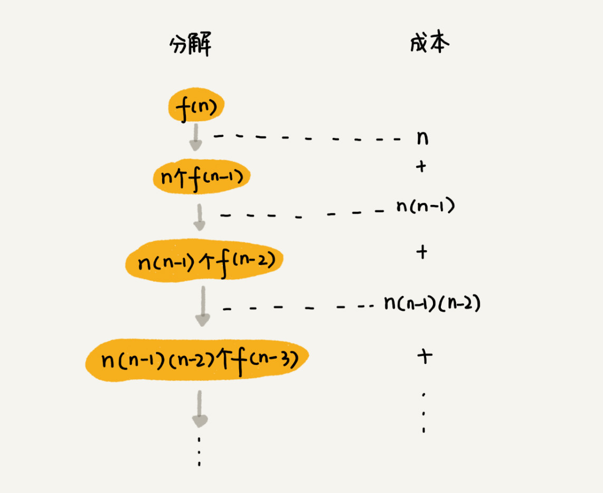

第一层分解有 *n* 次交换操作，第二层有 *n* 个节点，每个节点分解需要 *n*−1 次交换，所以第二层总的交换次数是 *n*∗(*n*−1)。第三层有 *n*∗(*n*−1) 个节点，每个节点分解需要 *n*−2 次交换，所以第三层总的交换次数是 *n*∗(*n*−1)∗(*n*−2)。

以此类推，第 *k* 层总的交换次数就是 *n*∗(*n*−1)∗(*n*−2)∗…∗(*n*−*k*+1)。最后一层的交换次数就是 *n*∗(*n*−1)∗(*n*−2)∗…∗2∗1。每一层的交换次数之和就是总的交换次数。

n + n*(n-1) + n*(n-1)*(n-2) +... + n*(n-1)*(n-2)*...*2*1

这个公式的求和比较复杂，我们看最后一个数，*n*∗(*n*−1)∗(*n*−2)∗…∗2∗1 等于 *n*!，而前面的 *n*−1 个数都小于最后一个数，所以，总和肯定小于 *n*∗*n*!，也就是说，全排列的递归算法的时间复杂度大于 *O*(*n*!)，小于 *O*(*n*∗*n*!)，虽然我们没法知道非常精确的时间复杂度，但是这样一个范围已经让我们知道，全排列的时间复杂度是非常高的。

这里我稍微说下，掌握分析的方法很重要，思路是重点，不要纠结于精确的时间复杂度到底是多少。

## 内容小结

今天，我们用递归树分析了递归代码的时间复杂度。加上我们在排序那一节讲到的递推公式的时间复杂度分析方法，我们现在已经学习了两种递归代码的时间复杂度分析方法了。

有些代码比较适合用递推公式来分析，比如归并排序的时间复杂度、快速排序的最好情况时间复杂度；有些比较适合采用递归树来分析，比如快速排序的平均时间复杂度。而有些可能两个都不怎么适合使用，比如二叉树的递归前中后序遍历。

时间复杂度分析的理论知识并不多，也不复杂，掌握起来也不难，但是，在我们平时的工作、学习中，面对的代码千差万别，能够灵活应用学到的复杂度分析方法，来分析现有的代码，并不是件简单的事情，所以，你平时要多实战、多分析，只有这样，面对任何代码的时间复杂度分析，你才能做到游刃有余、毫不畏惧。

## 课后思考

1 个细胞的生命周期是 3 小时，1 小时分裂一次。求 *n* 小时后，容器内有多少细胞？请你用已经学过的递归时间复杂度的分析方法，分析一下这个递归问题的时间复杂度。

欢迎留言和我分享，我会第一时间给你反馈。

# 28 | 堆和堆排序：为什么说堆排序没有快速排序快？

王争 2018-11-26



00:00

[1.0x**](javascript:;)

讲述：修阳 大小：7.14M 时长：15:34

我们今天讲另外一种特殊的树，“堆”（*H**e**a**p*）。堆这种数据结构的应用场景非常多，最经典的莫过于堆排序了。堆排序是一种原地的、时间复杂度为 *O*(*n*log*n*) 的排序算法。

前面我们学过快速排序，平均情况下，它的时间复杂度为 *O*(*n*log*n*)。尽管这两种排序算法的时间复杂度都是 *O*(*n*log*n*)，甚至堆排序比快速排序的时间复杂度还要稳定，但是，**在实际的软件开发中，快速排序的性能要比堆排序好，这是为什么呢？**

现在，你可能还无法回答，甚至对问题本身还有点疑惑。没关系，带着这个问题，我们来学习今天的内容。等你学完之后，或许就能回答出来了。

## 如何理解“堆”？

前面我们提到，堆是一种特殊的树。我们现在就来看看，什么样的树才是堆。我罗列了两点要求，只要满足这两点，它就是一个堆。

堆是一个完全二叉树；

堆中每一个节点的值都必须大于等于（或小于等于）其子树中每个节点的值。

我分别解释一下这两点。

第一点，堆必须是一个完全二叉树。还记得我们之前讲的完全二叉树的定义吗？完全二叉树要求，除了最后一层，其他层的节点个数都是满的，最后一层的节点都靠左排列。

第二点，堆中的每个节点的值必须大于等于（或者小于等于）其子树中每个节点的值。实际上，我们还可以换一种说法，堆中每个节点的值都大于等于（或者小于等于）其左右子节点的值。这两种表述是等价的。

对于每个节点的值都大于等于子树中每个节点值的堆，我们叫做“大顶堆”。对于每个节点的值都小于等于子树中每个节点值的堆，我们叫做“小顶堆”。

定义解释清楚了，你来看看，下面这几个二叉树是不是堆？

其中第 1 个和第 2 个是大顶堆，第 3 个是小顶堆，第 4 个不是堆。除此之外，从图中还可以看出来，对于同一组数据，我们可以构建多种不同形态的堆。

## 如何实现一个堆？

要实现一个堆，我们先要知道，**堆都支持哪些操作**以及**如何存储一个堆**。

我之前讲过，完全二叉树比较适合用数组来存储。用数组来存储完全二叉树是非常节省存储空间的。因为我们不需要存储左右子节点的指针，单纯地通过数组的下标，就可以找到一个节点的左右子节点和父节点。

我画了一个用数组存储堆的例子，你可以先看下。

从图中我们可以看到，数组中下标为 *i* 的节点的左子节点，就是下标为 *i*∗2 的节点，右子节点就是下标为 *i*∗2+1 的节点，父节点就是下标为 2*i* 的节点。

知道了如何存储一个堆，那我们再来看看，堆上的操作有哪些呢？我罗列了几个非常核心的操作，分别是往堆中插入一个元素和删除堆顶元素。（如果没有特殊说明，我下面都是拿大顶堆来讲解）。

### 1. 往堆中插入一个元素

往堆中插入一个元素后，我们需要继续满足堆的两个特性。

如果我们把新插入的元素放到堆的最后，你可以看我画的这个图，是不是不符合堆的特性了？于是，我们就需要进行调整，让其重新满足堆的特性，这个过程我们起了一个名字，就叫做**堆化**（heapify）。

堆化实际上有两种，从下往上和从上往下。这里我先讲**从下往上**的堆化方法。

堆化非常简单，就是顺着节点所在的路径，向上或者向下，对比，然后交换。

我这里画了一张堆化的过程分解图。我们可以让新插入的节点与父节点对比大小。如果不满足子节点小于等于父节点的大小关系，我们就互换两个节点。一直重复这个过程，直到父子节点之间满足刚说的那种大小关系。

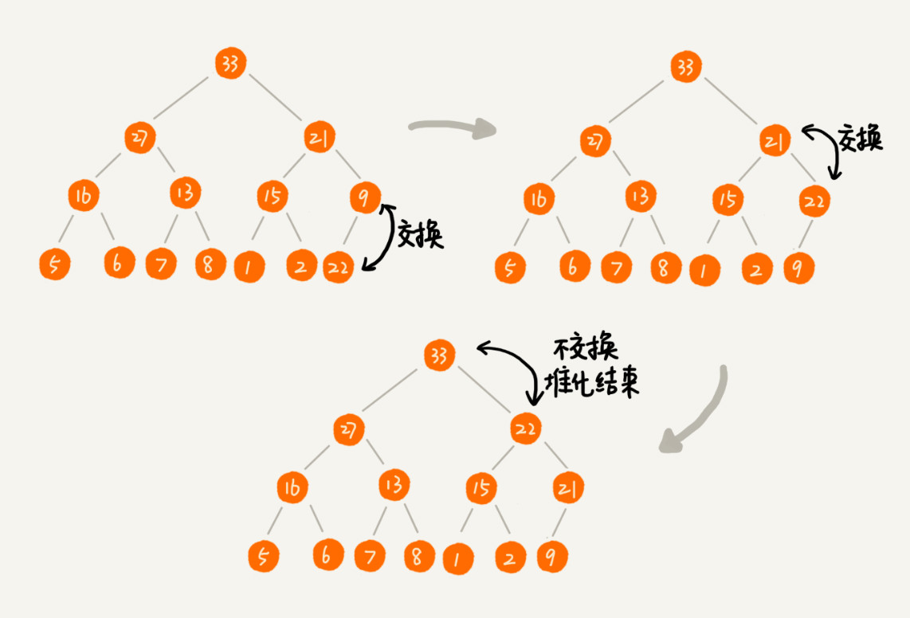

我将上面讲的往堆中插入数据的过程，翻译成了代码，你可以结合着一块看。

public class Heap {

  private int[] a; // 数组，从下标1开始存储数据

  private int n;  // 堆可以存储的最大数据个数

  private int count; // 堆中已经存储的数据个数

  public Heap(int capacity) {

​    a = new int[capacity + 1];

​    n = capacity;

​    count = 0;

  }

  public void insert(int data) {

​    if (count >= n) return; // 堆满了

​    ++count;

​    a[count] = data;

​    int i = count;

​    while (i/2 > 0 && a[i] > a[i/2]) { // 自下往上堆化

​      swap(a, i, i/2); // swap()函数作用：交换下标为i和i/2的两个元素

​      i = i/2;

​    }

  }

 }

### 2. 删除堆顶元素

从堆的定义的第二条中，任何节点的值都大于等于（或小于等于）子树节点的值，我们可以发现，堆顶元素存储的就是堆中数据的最大值或者最小值。

假设我们构造的是大顶堆，堆顶元素就是最大的元素。当我们删除堆顶元素之后，就需要把第二大的元素放到堆顶，那第二大元素肯定会出现在左右子节点中。然后我们再迭代地删除第二大节点，以此类推，直到叶子节点被删除。

这里我也画了一个分解图。不过这种方法有点问题，就是最后堆化出来的堆并不满足完全二叉树的特性。

实际上，我们稍微改变一下思路，就可以解决这个问题。你看我画的下面这幅图。我们把最后一个节点放到堆顶，然后利用同样的父子节点对比方法。对于不满足父子节点大小关系的，互换两个节点，并且重复进行这个过程，直到父子节点之间满足大小关系为止。这就是**从上往下的堆化方法**。

因为我们移除的是数组中的最后一个元素，而在堆化的过程中，都是交换操作，不会出现数组中的“空洞”，所以这种方法堆化之后的结果，肯定满足完全二叉树的特性。

我把上面的删除过程同样也翻译成了代码，贴在这里，你可以结合着看。

public void removeMax() {

  if (count == 0) return -1; // 堆中没有数据

  a[1] = a[count];

  --count;

  heapify(a, count, 1);

}

private void heapify(int[] a, int n, int i) { // 自上往下堆化

  while (true) {

​    int maxPos = i;

​    if (i*2 <= n && a[i] < a[i*2]) maxPos = i*2;

​    if (i*2+1 <= n && a[maxPos] < a[i*2+1]) maxPos = i*2+1;

​    if (maxPos == i) break;

​    swap(a, i, maxPos);

​    i = maxPos;

  }

}

我们知道，一个包含 *n* 个节点的完全二叉树，树的高度不会超过 log2*n*。堆化的过程是顺着节点所在路径比较交换的，所以堆化的时间复杂度跟树的高度成正比，也就是 *O*(log*n*)。插入数据和删除堆顶元素的主要逻辑就是堆化，所以，往堆中插入一个元素和删除堆顶元素的时间复杂度都是 *O*(log*n*)。

## 如何基于堆实现排序？

前面我们讲过好几种排序算法，我们再来回忆一下，有时间复杂度是 *O*(*n*2) 的冒泡排序、插入排序、选择排序，有时间复杂度是 *O*(*n*log*n*) 的归并排序、快速排序，还有线性排序。

这里我们借助于堆这种数据结构实现的排序算法，就叫做堆排序。这种排序方法的时间复杂度非常稳定，是 *O*(*n*log*n*)，并且它还是原地排序算法。如此优秀，它是怎么做到的呢？

我们可以把堆排序的过程大致分解成两个大的步骤，**建堆**和**排序**。

### 1. 建堆

我们首先将数组原地建成一个堆。所谓“原地”就是，不借助另一个数组，就在原数组上操作。建堆的过程，有两种思路。

第一种是借助我们前面讲的，在堆中插入一个元素的思路。尽管数组中包含 *n* 个数据，但是我们可以假设，起初堆中只包含一个数据，就是下标为 1 的数据。然后，我们调用前面讲的插入操作，将下标从 2 到 *n* 的数据依次插入到堆中。这样我们就将包含 *n* 个数据的数组，组织成了堆。

第二种实现思路，跟第一种截然相反，也是我这里要详细讲的。第一种建堆思路的处理过程是从前往后处理数组数据，并且每个数据插入堆中时，都是从下往上堆化。而第二种实现思路，是从后往前处理数组，并且每个数据都是从上往下堆化。

我举了一个例子，并且画了一个第二种实现思路的建堆分解步骤图，你可以看下。因为叶子节点往下堆化只能自己跟自己比较，所以我们直接从最后一个非叶子节点开始，依次堆化就行了。

对于程序员来说，看代码可能更好理解一些，所以，我将第二种实现思路翻译成了代码，你可以看下。

private static void buildHeap(int[] a, int n) {

  for (int i = n/2; i >= 1; --i) {

​    heapify(a, n, i);

  }

}

private static void heapify(int[] a, int n, int i) {

  while (true) {

​    int maxPos = i;

​    if (i*2 <= n && a[i] < a[i*2]) maxPos = i*2;

​    if (i*2+1 <= n && a[maxPos] < a[i*2+1]) maxPos = i*2+1;

​    if (maxPos == i) break;

​    swap(a, i, maxPos);

​    i = maxPos;

  }

}

你可能已经发现了，在这段代码中，我们对下标从 2*n* 开始到 1 的数据进行堆化，下标是 2*n*+1 到 *n* 的节点是叶子节点，我们不需要堆化。实际上，对于完全二叉树来说，下标从 2*n*+1 到 *n* 的节点都是叶子节点。

现在，我们来看，建堆操作的时间复杂度是多少呢？

每个节点堆化的时间复杂度是 *O*(log*n*)，那 2*n*+1 个节点堆化的总时间复杂度是不是就是 *O*(*n*log*n*) 呢？这个答案虽然也没错，但是这个值还是不够精确。实际上，堆排序的建堆过程的时间复杂度是 *O*(*n*)。我带你推导一下。

因为叶子节点不需要堆化，所以需要堆化的节点从倒数第二层开始。每个节点堆化的过程中，需要比较和交换的节点个数，跟这个节点的高度 *k* 成正比。

我把每一层的节点个数和对应的高度画了出来，你可以看看。我们只需要将每个节点的高度求和，得出的就是建堆的时间复杂度。

我们将每个非叶子节点的高度求和，就是下面这个公式：

这个公式的求解稍微有点技巧，不过我们高中应该都学过：把公式左右都乘以 2，就得到另一个公式 *S*2。我们将 *S*2 错位对齐，并且用 *S*2 减去 *S*1，可以得到 *S*。

*S* 的中间部分是一个等比数列，所以最后可以用等比数列的求和公式来计算，最终的结果就是下面图中画的这个样子。

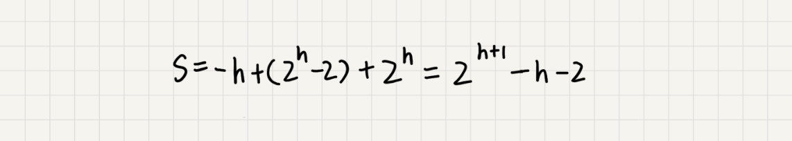

因为 *h*=log2*n*，代入公式 *S*，就能得到 *S*=*O*(*n*)，所以，建堆的时间复杂度就是 *O*(*n*)。

### 2. 排序

建堆结束之后，数组中的数据已经是按照大顶堆的特性来组织的。数组中的第一个元素就是堆顶，也就是最大的元素。我们把它跟最后一个元素交换，那最大元素就放到了下标为 *n* 的位置。

这个过程有点类似上面讲的“删除堆顶元素”的操作，当堆顶元素移除之后，我们把下标为 *n* 的元素放到堆顶，然后再通过堆化的方法，将剩下的 *n*−1 个元素重新构建成堆。堆化完成之后，我们再取堆顶的元素，放到下标是 *n*−1 的位置，一直重复这个过程，直到最后堆中只剩下标为 1 的一个元素，排序工作就完成了。

堆排序的过程，我也翻译成了代码。结合着代码看，你理解起来应该会更加容易。

// n表示数据的个数，数组a中的数据从下标1到n的位置。

public static void sort(int[] a, int n) {

  buildHeap(a, n);

  int k = n;

  while (k > 1) {

​    swap(a, 1, k);

​    --k;

​    heapify(a, k, 1);

  }

}

现在，我们再来分析一下堆排序的时间复杂度、空间复杂度以及稳定性。

整个堆排序的过程，都只需要极个别临时存储空间，所以堆排序是原地排序算法。堆排序包括建堆和排序两个操作，建堆过程的时间复杂度是 *O*(*n*)，排序过程的时间复杂度是 *O*(*n*log*n*)，所以，堆排序整体的时间复杂度是 *O*(*n*log*n*)。

堆排序不是稳定的排序算法，因为在排序的过程，存在将堆的最后一个节点跟堆顶节点互换的操作，所以就有可能改变值相同数据的原始相对顺序。

今天的内容到此就讲完了。我这里要稍微解释一下，在前面的讲解以及代码中，我都假设，堆中的数据是从数组下标为 1 的位置开始存储。那如果从 0 开始存储，实际上处理思路是没有任何变化的，唯一变化的，可能就是，代码实现的时候，计算子节点和父节点的下标的公式改变了。

如果节点的下标是 *i*，那左子节点的下标就是 2∗*i*+1，右子节点的下标就是 2∗*i*+2，父节点的下标就是 2*i*−1。

## 解答开篇

现在我们来看开篇的问题，在实际开发中，为什么快速排序要比堆排序性能好？

我觉得主要有两方面的原因。

**第一点，堆排序数据访问的方式没有快速排序友好。**

对于快速排序来说，数据是顺序访问的。而对于堆排序来说，数据是跳着访问的。 比如，堆排序中，最重要的一个操作就是数据的堆化。比如下面这个例子，对堆顶节点进行堆化，会依次访问数组下标是 1，2，4，8 的元素，而不是像快速排序那样，局部顺序访问，所以，这样对 CPU 缓存是不友好的。

**第二点，对于同样的数据，在排序过程中，堆排序算法的数据交换次数要多于快速排序。**

我们在讲排序的时候，提过两个概念，有序度和逆序度。对于基于比较的排序算法来说，整个排序过程就是由两个基本的操作组成的，比较和交换（或移动）。快速排序数据交换的次数不会比逆序度多。

但是堆排序的第一步是建堆，建堆的过程会打乱数据原有的相对先后顺序，导致原数据的有序度降低。比如，对于一组已经有序的数据来说，经过建堆之后，数据反而变得更无序了。

对于第二点，你可以自己做个试验看下。我们用一个记录交换次数的变量，在代码中，每次交换的时候，我们就对这个变量加一，排序完成之后，这个变量的值就是总的数据交换次数。这样你就能很直观地理解我刚刚说的，堆排序比快速排序交换次数多。

## 内容小结

今天我们讲了堆这种数据结构。堆是一种完全二叉树。它最大的特性是：每个节点的值都大于等于（或小于等于）其子树节点的值。因此，堆被分成了两类，大顶堆和小顶堆。

堆中比较重要的两个操作是插入一个数据和删除堆顶元素。这两个操作都要用到堆化。插入一个数据的时候，我们把新插入的数据放到数组的最后，然后从下往上堆化；删除堆顶数据的时候，我们把数组中的最后一个元素放到堆顶，然后从上往下堆化。这两个操作时间复杂度都是 *O*(log*n*)。

除此之外，我们还讲了堆的一个经典应用，堆排序。堆排序包含两个过程，建堆和排序。我们将下标从 2*n* 到 1 的节点，依次进行从上到下的堆化操作，然后就可以将数组中的数据组织成堆这种数据结构。接下来，我们迭代地将堆顶的元素放到堆的末尾，并将堆的大小减一，然后再堆化，重复这个过程，直到堆中只剩下一个元素，整个数组中的数据就都有序排列了。

## 课后思考

在讲堆排序建堆的时候，我说到，对于完全二叉树来说，下标从 2*n*+1 到 *n* 的都是叶子节点，这个结论是怎么推导出来的呢？

我们今天讲了堆的一种经典应用，堆排序。关于堆，你还能想到它的其他应用吗？

欢迎留言和我分享，我会第一时间给你反馈。

# 29 | 堆的应用：如何快速获取到Top 10最热门的搜索关键词？

王争 2018-11-28



00:00

[1.0x**](javascript:;)

讲述：修阳 大小：17.16M 时长：18:44

搜索引擎的热门搜索排行榜功能你用过吗？你知道这个功能是如何实现的吗？实际上，它的实现并不复杂。搜索引擎每天会接收大量的用户搜索请求，它会把这些用户输入的搜索关键词记录下来，然后再离线地统计分析，得到最热门的 Top 10 搜索关键词。

那请你思考下，**假设现在我们有一个包含 10 亿个搜索关键词的日志文件，如何能快速获取到热门榜 Top 10 的搜索关键词呢？**

这个问题就可以用堆来解决，这也是堆这种数据结构一个非常典型的应用。上一节我们讲了堆和堆排序的一些理论知识，今天我们就来讲一讲，堆这种数据结构几个非常重要的应用：优先级队列、求 Top K 和求中位数。

## 堆的应用一：优先级队列

首先，我们来看第一个应用场景：优先级队列。

优先级队列，顾名思义，它首先应该是一个队列。我们前面讲过，队列最大的特性就是先进先出。不过，在优先级队列中，数据的出队顺序不是先进先出，而是按照优先级来，优先级最高的，最先出队。

如何实现一个优先级队列呢？方法有很多，但是用堆来实现是最直接、最高效的。这是因为，堆和优先级队列非常相似。一个堆就可以看作一个优先级队列。很多时候，它们只是概念上的区分而已。往优先级队列中插入一个元素，就相当于往堆中插入一个元素；从优先级队列中取出优先级最高的元素，就相当于取出堆顶元素。

你可别小看这个优先级队列，它的应用场景非常多。我们后面要讲的很多数据结构和算法都要依赖它。比如，赫夫曼编码、图的最短路径、最小生成树算法等等。不仅如此，很多语言中，都提供了优先级队列的实现，比如，Java 的 PriorityQueue，C++ 的 priority_queue 等。

只讲这些应用场景比较空泛，现在，我举两个具体的例子，让你感受一下优先级队列具体是怎么用的。

### 1. 合并有序小文件

假设我们有 100 个小文件，每个文件的大小是 100MB，每个文件中存储的都是有序的字符串。我们希望将这些 100 个小文件合并成一个有序的大文件。这里就会用到优先级队列。

整体思路有点像归并排序中的合并函数。我们从这 100 个文件中，各取第一个字符串，放入数组中，然后比较大小，把最小的那个字符串放入合并后的大文件中，并从数组中删除。

假设，这个最小的字符串来自于 13.txt 这个小文件，我们就再从这个小文件取下一个字符串，放到数组中，重新比较大小，并且选择最小的放入合并后的大文件，将它从数组中删除。依次类推，直到所有的文件中的数据都放入到大文件为止。

这里我们用数组这种数据结构，来存储从小文件中取出来的字符串。每次从数组中取最小字符串，都需要循环遍历整个数组，显然，这不是很高效。有没有更加高效方法呢？

这里就可以用到优先级队列，也可以说是堆。我们将从小文件中取出来的字符串放入到小顶堆中，那堆顶的元素，也就是优先级队列队首的元素，就是最小的字符串。我们将这个字符串放入到大文件中，并将其从堆中删除。然后再从小文件中取出下一个字符串，放入到堆中。循环这个过程，就可以将 100 个小文件中的数据依次放入到大文件中。

我们知道，删除堆顶数据和往堆中插入数据的时间复杂度都是 O(logn)，n 表示堆中的数据个数，这里就是 100。是不是比原来数组存储的方式高效了很多呢？

### 2. 高性能定时器

假设我们有一个定时器，定时器中维护了很多定时任务，每个任务都设定了一个要触发执行的时间点。定时器每过一个很小的单位时间（比如 1 秒），就扫描一遍任务，看是否有任务到达设定的执行时间。如果到达了，就拿出来执行。

但是，这样每过 1 秒就扫描一遍任务列表的做法比较低效，主要原因有两点：第一，任务的约定执行时间离当前时间可能还有很久，这样前面很多次扫描其实都是徒劳的；第二，每次都要扫描整个任务列表，如果任务列表很大的话，势必会比较耗时。

针对这些问题，我们就可以用优先级队列来解决。我们按照任务设定的执行时间，将这些任务存储在优先级队列中，队列首部（也就是小顶堆的堆顶）存储的是最先执行的任务。

这样，定时器就不需要每隔 1 秒就扫描一遍任务列表了。它拿队首任务的执行时间点，与当前时间点相减，得到一个时间间隔 T。

这个时间间隔 T 就是，从当前时间开始，需要等待多久，才会有第一个任务需要被执行。这样，定时器就可以设定在 T 秒之后，再来执行任务。从当前时间点到（T-1）秒这段时间里，定时器都不需要做任何事情。

当 T 秒时间过去之后，定时器取优先级队列中队首的任务执行。然后再计算新的队首任务的执行时间点与当前时间点的差值，把这个值作为定时器执行下一个任务需要等待的时间。

这样，定时器既不用间隔 1 秒就轮询一次，也不用遍历整个任务列表，性能也就提高了。

## 堆的应用二：利用堆求 Top K

刚刚我们学习了优先级队列，我们现在来看，堆的另外一个非常重要的应用场景，那就是“求 Top K 问题”。

我把这种求 Top K 的问题抽象成两类。一类是针对静态数据集合，也就是说数据集合事先确定，不会再变。另一类是针对动态数据集合，也就是说数据集合事先并不确定，有数据动态地加入到集合中。

针对静态数据，如何在一个包含 n 个数据的数组中，查找前 K 大数据呢？我们可以维护一个大小为 K 的小顶堆，顺序遍历数组，从数组中取出数据与堆顶元素比较。如果比堆顶元素大，我们就把堆顶元素删除，并且将这个元素插入到堆中；如果比堆顶元素小，则不做处理，继续遍历数组。这样等数组中的数据都遍历完之后，堆中的数据就是前 K 大数据了。

遍历数组需要 O(n) 的时间复杂度，一次堆化操作需要 O(logK) 的时间复杂度，所以最坏情况下，n 个元素都入堆一次，时间复杂度就是 O(nlogK)。

针对动态数据求得 Top K 就是实时 Top K。怎么理解呢？我举一个例子。一个数据集合中有两个操作，一个是添加数据，另一个询问当前的前 K 大数据。

如果每次询问前 K 大数据，我们都基于当前的数据重新计算的话，那时间复杂度就是 O(nlogK)，n 表示当前的数据的大小。实际上，我们可以一直都维护一个 K 大小的小顶堆，当有数据被添加到集合中时，我们就拿它与堆顶的元素对比。如果比堆顶元素大，我们就把堆顶元素删除，并且将这个元素插入到堆中；如果比堆顶元素小，则不做处理。这样，无论任何时候需要查询当前的前 K 大数据，我们都可以立刻返回给他。

## 堆的应用三：利用堆求中位数

前面我们讲了如何求 Top K 的问题，现在我们来讲下，如何求动态数据集合中的中位数。

中位数，顾名思义，就是处在中间位置的那个数。如果数据的个数是奇数，把数据从小到大排列，那第 2*n*+1 个数据就是中位数（注意：假设数据是从 0 开始编号的）；如果数据的个数是偶数的话，那处于中间位置的数据有两个，第 2*n* 个和第 2*n*+1 个数据，这个时候，我们可以随意取一个作为中位数，比如取两个数中靠前的那个，就是第 2*n* 个数据。

对于一组**静态数据**，中位数是固定的，我们可以先排序，第 2*n* 个数据就是中位数。每次询问中位数的时候，我们直接返回这个固定的值就好了。所以，尽管排序的代价比较大，但是边际成本会很小。但是，如果我们面对的是**动态数据**集合，中位数在不停地变动，如果再用先排序的方法，每次询问中位数的时候，都要先进行排序，那效率就不高了。

**借助堆这种数据结构，我们不用排序，就可以非常高效地实现求中位数操作。我们来看看，它是如何做到的？**

我们需要维护两个堆，一个大顶堆，一个小顶堆。大顶堆中存储前半部分数据，小顶堆中存储后半部分数据，且小顶堆中的数据都大于大顶堆中的数据。

也就是说，如果有 n 个数据，n 是偶数，我们从小到大排序，那前 2*n* 个数据存储在大顶堆中，后 2*n* 个数据存储在小顶堆中。这样，大顶堆中的堆顶元素就是我们要找的中位数。如果 n 是奇数，情况是类似的，大顶堆就存储 2*n*+1 个数据，小顶堆中就存储 2*n* 个数据。

我们前面也提到，数据是动态变化的，当新添加一个数据的时候，我们如何调整两个堆，让大顶堆中的堆顶元素继续是中位数呢？

如果新加入的数据小于等于大顶堆的堆顶元素，我们就将这个新数据插入到大顶堆；否则，我们就将这个新数据插入到小顶堆。

这个时候就有可能出现，两个堆中的数据个数不符合前面约定的情况：如果 n 是偶数，两个堆中的数据个数都是 2*n*；如果 n 是奇数，大顶堆有 2*n*+1 个数据，小顶堆有 2*n* 个数据。这个时候，我们可以从一个堆中不停地将堆顶元素移动到另一个堆，通过这样的调整，来让两个堆中的数据满足上面的约定。

于是，我们就可以利用两个堆，一个大顶堆、一个小顶堆，实现在动态数据集合中求中位数的操作。插入数据因为需要涉及堆化，所以时间复杂度变成了 O(logn)，但是求中位数我们只需要返回大顶堆的堆顶元素就可以了，所以时间复杂度就是 O(1)。

实际上，利用两个堆不仅可以快速求出中位数，还可以快速求其他百分位的数据，原理是类似的。还记得我们在“为什么要学习数据结构与算法”里的这个问题吗？“如何快速求接口的 99% 响应时间？”我们现在就来看下，利用两个堆如何来实现。

在开始这个问题的讲解之前，我先解释一下，什么是“99% 响应时间”。

中位数的概念就是将数据从小到大排列，处于中间位置，就叫中位数，这个数据会大于等于前面 50% 的数据。99 百分位数的概念可以类比中位数，如果将一组数据从小到大排列，这个 99 百分位数就是大于前面 99% 数据的那个数据。

如果你还是不太理解，我再举个例子。假设有 100 个数据，分别是 1，2，3，……，100，那 99 百分位数就是 99，因为小于等于 99 的数占总个数的 99%。

弄懂了这个概念，我们再来看 99% 响应时间。如果有 100 个接口访问请求，每个接口请求的响应时间都不同，比如 55 毫秒、100 毫秒、23 毫秒等，我们把这 100 个接口的响应时间按照从小到大排列，排在第 99 的那个数据就是 99% 响应时间，也叫 99 百分位响应时间。

我们总结一下，如果有 n 个数据，将数据从小到大排列之后，99 百分位数大约就是第 n*99% 个数据，同类，80 百分位数大约就是第 n*80% 个数据。

弄懂了这些，我们再来看如何求 99% 响应时间。

我们维护两个堆，一个大顶堆，一个小顶堆。假设当前总数据的个数是 n，大顶堆中保存 n*99% 个数据，小顶堆中保存 n*1% 个数据。大顶堆堆顶的数据就是我们要找的 99% 响应时间。

每次插入一个数据的时候，我们要判断这个数据跟大顶堆和小顶堆堆顶数据的大小关系，然后决定插入到哪个堆中。如果这个新插入的数据比大顶堆的堆顶数据小，那就插入大顶堆；如果这个新插入的数据比小顶堆的堆顶数据大，那就插入小顶堆。

但是，为了保持大顶堆中的数据占 99%，小顶堆中的数据占 1%，在每次新插入数据之后，我们都要重新计算，这个时候大顶堆和小顶堆中的数据个数，是否还符合 99:1 这个比例。如果不符合，我们就将一个堆中的数据移动到另一个堆，直到满足这个比例。移动的方法类似前面求中位数的方法，这里我就不啰嗦了。

通过这样的方法，每次插入数据，可能会涉及几个数据的堆化操作，所以时间复杂度是 O(logn)。每次求 99% 响应时间的时候，直接返回大顶堆中的堆顶数据即可，时间复杂度是 O(1)。

## 解答开篇

学懂了上面的一些应用场景的处理思路，我想你应该能解决开篇的那个问题了吧。假设现在我们有一个包含 10 亿个搜索关键词的日志文件，如何快速获取到 Top 10 最热门的搜索关键词呢？

处理这个问题，有很多高级的解决方法，比如使用 MapReduce 等。但是，如果我们将处理的场景限定为单机，可以使用的内存为 1GB。那这个问题该如何解决呢？

因为用户搜索的关键词，有很多可能都是重复的，所以我们首先要统计每个搜索关键词出现的频率。我们可以通过散列表、平衡二叉查找树或者其他一些支持快速查找、插入的数据结构，来记录关键词及其出现的次数。

假设我们选用散列表。我们就顺序扫描这 10 亿个搜索关键词。当扫描到某个关键词时，我们去散列表中查询。如果存在，我们就将对应的次数加一；如果不存在，我们就将它插入到散列表，并记录次数为 1。以此类推，等遍历完这 10 亿个搜索关键词之后，散列表中就存储了不重复的搜索关键词以及出现的次数。

然后，我们再根据前面讲的用堆求 Top K 的方法，建立一个大小为 10 的小顶堆，遍历散列表，依次取出每个搜索关键词及对应出现的次数，然后与堆顶的搜索关键词对比。如果出现次数比堆顶搜索关键词的次数多，那就删除堆顶的关键词，将这个出现次数更多的关键词加入到堆中。

以此类推，当遍历完整个散列表中的搜索关键词之后，堆中的搜索关键词就是出现次数最多的 Top 10 搜索关键词了。

不知道你发现了没有，上面的解决思路其实存在漏洞。10 亿的关键词还是很多的。我们假设 10 亿条搜索关键词中不重复的有 1 亿条，如果每个搜索关键词的平均长度是 50 个字节，那存储 1 亿个关键词起码需要 5GB 的内存空间，而散列表因为要避免频繁冲突，不会选择太大的装载因子，所以消耗的内存空间就更多了。而我们的机器只有 1GB 的可用内存空间，所以我们无法一次性将所有的搜索关键词加入到内存中。这个时候该怎么办呢？

我们在哈希算法那一节讲过，相同数据经过哈希算法得到的哈希值是一样的。我们可以根据哈希算法的这个特点，将 10 亿条搜索关键词先通过哈希算法分片到 10 个文件中。

具体可以这样做：我们创建 10 个空文件 00，01，02，……，09。我们遍历这 10 亿个关键词，并且通过某个哈希算法对其求哈希值，然后哈希值同 10 取模，得到的结果就是这个搜索关键词应该被分到的文件编号。

对这 10 亿个关键词分片之后，每个文件都只有 1 亿的关键词，去除掉重复的，可能就只有 1000 万个，每个关键词平均 50 个字节，所以总的大小就是 500MB。1GB 的内存完全可以放得下。

我们针对每个包含 1 亿条搜索关键词的文件，利用散列表和堆，分别求出 Top 10，然后把这个 10 个 Top 10 放在一块，然后取这 100 个关键词中，出现次数最多的 10 个关键词，这就是这 10 亿数据中的 Top 10 最频繁的搜索关键词了。

## 内容小结

我们今天主要讲了堆的几个重要的应用，它们分别是：优先级队列、求 Top K 问题和求中位数问题。

优先级队列是一种特殊的队列，优先级高的数据先出队，而不再像普通的队列那样，先进先出。实际上，堆就可以看作优先级队列，只是称谓不一样罢了。求 Top K 问题又可以分为针对静态数据和针对动态数据，只需要利用一个堆，就可以做到非常高效率地查询 Top K 的数据。求中位数实际上还有很多变形，比如求 99 百分位数据、90 百分位数据等，处理的思路都是一样的，即利用两个堆，一个大顶堆，一个小顶堆，随着数据的动态添加，动态调整两个堆中的数据，最后大顶堆的堆顶元素就是要求的数据。

## 课后思考

有一个访问量非常大的新闻网站，我们希望将点击量排名 Top 10 的新闻摘要，滚动显示在网站首页 banner 上，并且每隔 1 小时更新一次。如果你是负责开发这个功能的工程师，你会如何来实现呢？

欢迎留言和我分享，我会第一时间给你反馈。

# 30 | 图的表示：如何存储微博、微信等社交网络中的好友关系？

王争 2018-11-30



00:00

[1.0x**](javascript:;)

讲述：修阳 大小：12.71M 时长：13:52

微博、微信、LinkedIn 这些社交软件我想你肯定都玩过吧。在微博中，两个人可以互相关注；在微信中，两个人可以互加好友。那你知道，**如何存储微博、微信等这些社交网络的好友关系吗？**

这就要用到我们今天要讲的这种数据结构：图。实际上，涉及图的算法有很多，也非常复杂，比如图的搜索、最短路径、最小生成树、二分图等等。我们今天聚焦在图存储这一方面，后面会分好几节来依次讲解图相关的算法。

## 如何理解“图”？

我们前面讲过了树这种非线性表数据结构，今天我们要讲另一种非线性表数据结构，**图**（Graph）。和树比起来，这是一种更加复杂的非线性表结构。

我们知道，树中的元素我们称为节点，图中的元素我们就叫做**顶点**（vertex）。从我画的图中可以看出来，图中的一个顶点可以与任意其他顶点建立连接关系。我们把这种建立的关系叫做**边**（edge）。

我们生活中就有很多符合图这种结构的例子。比如，开篇问题中讲到的社交网络，就是一个非常典型的图结构。

我们就拿微信举例子吧。我们可以把每个用户看作一个顶点。如果两个用户之间互加好友，那就在两者之间建立一条边。所以，整个微信的好友关系就可以用一张图来表示。其中，每个用户有多少个好友，对应到图中，就叫做顶点的**度**（degree），就是跟顶点相连接的边的条数。

实际上，微博的社交关系跟微信还有点不一样，或者说更加复杂一点。微博允许单向关注，也就是说，用户 A 关注了用户 B，但用户 B 可以不关注用户 A。那我们如何用图来表示这种单向的社交关系呢？

我们可以把刚刚讲的图结构稍微改造一下，引入边的“方向”的概念。

如果用户 A 关注了用户 B，我们就在图中画一条从 A 到 B 的带箭头的边，来表示边的方向。如果用户 A 和用户 B 互相关注了，那我们就画一条从 A 指向 B 的边，再画一条从 B 指向 A 的边。我们把这种边有方向的图叫做“有向图”。以此类推，我们把边没有方向的图就叫做“无向图”。

我们刚刚讲过，无向图中有“度”这个概念，表示一个顶点有多少条边。在有向图中，我们把度分为**入度**（In-degree）和**出度**（Out-degree）。

顶点的入度，表示有多少条边指向这个顶点；顶点的出度，表示有多少条边是以这个顶点为起点指向其他顶点。对应到微博的例子，入度就表示有多少粉丝，出度就表示关注了多少人。

前面讲到了微信、微博、无向图、有向图，现在我们再来看另一种社交软件：QQ。

QQ 中的社交关系要更复杂一点。不知道你有没有留意过 QQ 亲密度这样一个功能。QQ 不仅记录了用户之间的好友关系，还记录了两个用户之间的亲密度，如果两个用户经常往来，那亲密度就比较高；如果不经常往来，亲密度就比较低。如何在图中记录这种好友关系的亲密度呢？

这里就要用到另一种图，**带权图**（weighted graph）。在带权图中，每条边都有一个权重（weight），我们可以通过这个权重来表示 QQ 好友间的亲密度。

关于图的概念比较多，我今天也只是介绍了几个常用的，理解起来都不复杂，不知道你都掌握了没有？掌握了图的概念之后，我们再来看下，如何在内存中存储图这种数据结构呢？

## 邻接矩阵存储方法

图最直观的一种存储方法就是，**邻接矩阵**（Adjacency Matrix）。

邻接矩阵的底层依赖一个二维数组。对于无向图来说，如果顶点 i 与顶点 j 之间有边，我们就将 A[i][j]和 A[j][i]标记为 1；对于有向图来说，如果顶点 i 到顶点 j 之间，有一条箭头从顶点 i 指向顶点 j 的边，那我们就将 A[i][j]标记为 1。同理，如果有一条箭头从顶点 j 指向顶点 i 的边，我们就将 A[j][i]标记为 1。对于带权图，数组中就存储相应的权重。

用邻接矩阵来表示一个图，虽然简单、直观，但是比较浪费存储空间。为什么这么说呢？

对于无向图来说，如果 A[i][j]等于 1，那 A[j][i]也肯定等于 1。实际上，我们只需要存储一个就可以了。也就是说，无向图的二维数组中，如果我们将其用对角线划分为上下两部分，那我们只需要利用上面或者下面这样一半的空间就足够了，另外一半白白浪费掉了。

还有，如果我们存储的是**稀疏图**（Sparse Matrix），也就是说，顶点很多，但每个顶点的边并不多，那邻接矩阵的存储方法就更加浪费空间了。比如微信有好几亿的用户，对应到图上就是好几亿的顶点。但是每个用户的好友并不会很多，一般也就三五百个而已。如果我们用邻接矩阵来存储，那绝大部分的存储空间都被浪费了。

但这也并不是说，邻接矩阵的存储方法就完全没有优点。首先，邻接矩阵的存储方式简单、直接，因为基于数组，所以在获取两个顶点的关系时，就非常高效。其次，用邻接矩阵存储图的另外一个好处是方便计算。这是因为，用邻接矩阵的方式存储图，可以将很多图的运算转换成矩阵之间的运算。比如求解最短路径问题时会提到一个Floyd-Warshall 算法，就是利用矩阵循环相乘若干次得到结果。

## 邻接表存储方法

针对上面邻接矩阵比较浪费内存空间的问题，我们来看另外一种图的存储方法，**邻接表**（Adjacency List）。

我画了一张邻接表的图，你可以先看下。乍一看，邻接表是不是有点像散列表？每个顶点对应一条链表，链表中存储的是与这个顶点相连接的其他顶点。另外我需要说明一下，图中画的是一个有向图的邻接表存储方式，每个顶点对应的链表里面，存储的是指向的顶点。对于无向图来说，也是类似的，不过，每个顶点的链表中存储的，是跟这个顶点有边相连的顶点，你可以自己画下。

还记得我们之前讲过的时间、空间复杂度互换的设计思想吗？邻接矩阵存储起来比较浪费空间，但是使用起来比较节省时间。相反，邻接表存储起来比较节省空间，但是使用起来就比较耗时间。

就像图中的例子，如果我们要确定，是否存在一条从顶点 2 到顶点 4 的边，那我们就要遍历顶点 2 对应的那条链表，看链表中是否存在顶点 4。而且，我们前面也讲过，链表的存储方式对缓存不友好。所以，比起邻接矩阵的存储方式，在邻接表中查询两个顶点之间的关系就没那么高效了。

在散列表那几节里，我讲到，在基于链表法解决冲突的散列表中，如果链过长，为了提高查找效率，我们可以将链表换成其他更加高效的数据结构，比如平衡二叉查找树等。我们刚刚也讲到，邻接表长得很像散列。所以，我们也可以将邻接表同散列表一样进行“改进升级”。

我们可以将邻接表中的链表改成平衡二叉查找树。实际开发中，我们可以选择用红黑树。这样，我们就可以更加快速地查找两个顶点之间是否存在边了。当然，这里的二叉查找树可以换成其他动态数据结构，比如跳表、散列表等。除此之外，我们还可以将链表改成有序动态数组，可以通过二分查找的方法来快速定位两个顶点之间否是存在边。

## 解答开篇

有了前面讲的理论知识，现在我们回过头来看开篇的问题，如何存储微博、微信等社交网络中的好友关系？

前面我们分析了，微博、微信是两种“图”，前者是有向图，后者是无向图。在这个问题上，两者的解决思路差不多，所以我只拿微博来讲解。

数据结构是为算法服务的，所以具体选择哪种存储方法，与期望支持的操作有关系。针对微博用户关系，假设我们需要支持下面这样几个操作：

判断用户 A 是否关注了用户 B；

判断用户 A 是否是用户 B 的粉丝；

用户 A 关注用户 B；

用户 A 取消关注用户 B；

根据用户名称的首字母排序，分页获取用户的粉丝列表；

根据用户名称的首字母排序，分页获取用户的关注列表。

关于如何存储一个图，前面我们讲到两种主要的存储方法，邻接矩阵和邻接表。因为社交网络是一张稀疏图，使用邻接矩阵存储比较浪费存储空间。所以，这里我们采用邻接表来存储。

不过，用一个邻接表来存储这种有向图是不够的。我们去查找某个用户关注了哪些用户非常容易，但是如果要想知道某个用户都被哪些用户关注了，也就是用户的粉丝列表，是非常困难的。

基于此，我们需要一个逆邻接表。邻接表中存储了用户的关注关系，逆邻接表中存储的是用户的被关注关系。对应到图上，邻接表中，每个顶点的链表中，存储的就是这个顶点指向的顶点，逆邻接表中，每个顶点的链表中，存储的是指向这个顶点的顶点。如果要查找某个用户关注了哪些用户，我们可以在邻接表中查找；如果要查找某个用户被哪些用户关注了，我们从逆邻接表中查找。

基础的邻接表不适合快速判断两个用户之间是否是关注与被关注的关系，所以我们选择改进版本，将邻接表中的链表改为支持快速查找的动态数据结构。选择哪种动态数据结构呢？红黑树、跳表、有序动态数组还是散列表呢？

因为我们需要按照用户名称的首字母排序，分页来获取用户的粉丝列表或者关注列表，用跳表这种结构再合适不过了。这是因为，跳表插入、删除、查找都非常高效，时间复杂度是 O(logn)，空间复杂度上稍高，是 O(n)。最重要的一点，跳表中存储的数据本来就是有序的了，分页获取粉丝列表或关注列表，就非常高效。

如果对于小规模的数据，比如社交网络中只有几万、几十万个用户，我们可以将整个社交关系存储在内存中，上面的解决思路是没有问题的。但是如果像微博那样有上亿的用户，数据规模太大，我们就无法全部存储在内存中了。这个时候该怎么办呢？

我们可以通过哈希算法等数据分片方式，将邻接表存储在不同的机器上。你可以看下面这幅图，我们在机器 1 上存储顶点 1，2，3 的邻接表，在机器 2 上，存储顶点 4，5 的邻接表。逆邻接表的处理方式也一样。当要查询顶点与顶点关系的时候，我们就利用同样的哈希算法，先定位顶点所在的机器，然后再在相应的机器上查找。

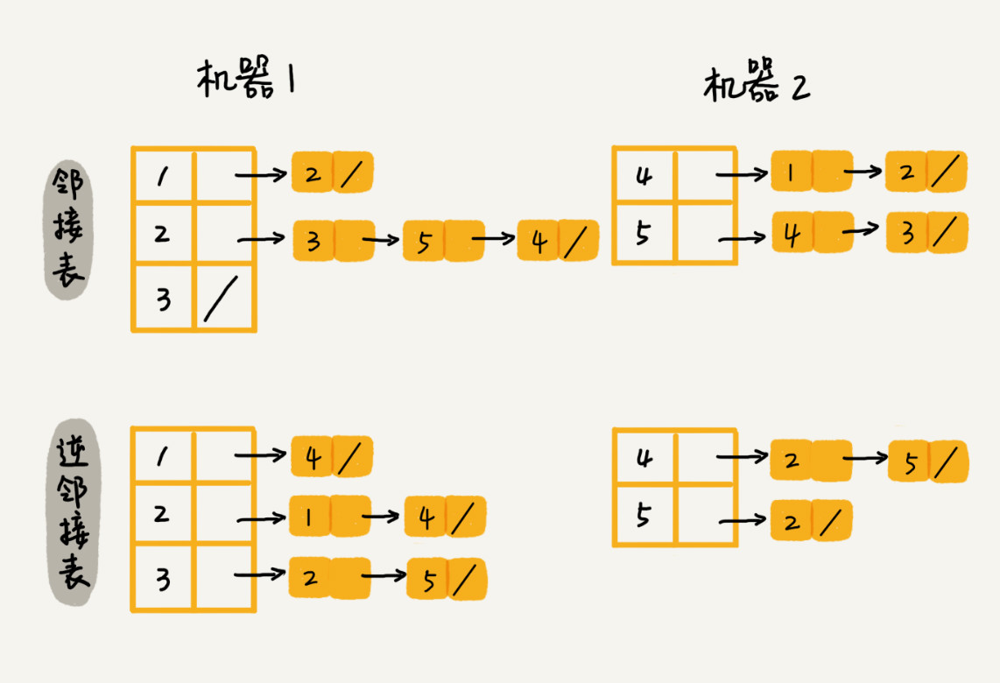

除此之外，我们还有另外一种解决思路，就是利用外部存储（比如硬盘），因为外部存储的存储空间要比内存会宽裕很多。数据库是我们经常用来持久化存储关系数据的，所以我这里介绍一种数据库的存储方式。

我用下面这张表来存储这样一个图。为了高效地支持前面定义的操作，我们可以在表上建立多个索引，比如第一列、第二列，给这两列都建立索引。

## 内容小结

今天我们学习了图这种非线性表数据结构，关于图，你需要理解这样几个概念：无向图、有向图、带权图、顶点、边、度、入度、出度。除此之外，我们还学习了图的两个主要的存储方式：邻接矩阵和邻接表。

邻接矩阵存储方法的缺点是比较浪费空间，但是优点是查询效率高，而且方便矩阵运算。邻接表存储方法中每个顶点都对应一个链表，存储与其相连接的其他顶点。尽管邻接表的存储方式比较节省存储空间，但链表不方便查找，所以查询效率没有邻接矩阵存储方式高。针对这个问题，邻接表还有改进升级版，即将链表换成更加高效的动态数据结构，比如平衡二叉查找树、跳表、散列表等。

## 课后思考

关于开篇思考题，我们只讲了微博这种有向图的解决思路，那像微信这种无向图，应该怎么存储呢？你可以照着我的思路，自己做一下练习。

除了我今天举的社交网络可以用图来表示之外，符合图这种结构特点的例子还有很多，比如知识图谱（Knowledge Graph）。关于图这种数据结构，你还能想到其他生活或者工作中的例子吗？

欢迎留言和我分享，我会第一时间给你反馈。

# 31 | 深度和广度优先搜索：如何找出社交网络中的三度好友关系？

王争 2018-12-03



00:00

[1.0x**](javascript:;)

讲述：修阳 大小：9.81M 时长：10:42

上一节我们讲了图的表示方法，讲到如何用有向图、无向图来表示一个社交网络。在社交网络中，有一个六度分割理论，具体是说，你与世界上的另一个人间隔的关系不会超过六度，也就是说平均只需要六步就可以联系到任何两个互不相识的人。

一个用户的一度连接用户很好理解，就是他的好友，二度连接用户就是他好友的好友，三度连接用户就是他好友的好友的好友。在社交网络中，我们往往通过用户之间的连接关系，来实现推荐“可能认识的人”这么一个功能。今天的开篇问题就是，**给你一个用户，如何找出这个用户的所有三度（其中包含一度、二度和三度）好友关系？**

这就要用到今天要讲的深度优先和广度优先搜索算法。

## 什么是“搜索”算法？

我们知道，算法是作用于具体数据结构之上的，深度优先搜索算法和广度优先搜索算法都是基于“图”这种数据结构的。这是因为，图这种数据结构的表达能力很强，大部分涉及搜索的场景都可以抽象成“图”。

图上的搜索算法，最直接的理解就是，在图中找出从一个顶点出发，到另一个顶点的路径。具体方法有很多，比如今天要讲的两种最简单、最“暴力”的深度优先、广度优先搜索，还有 A*、IDA* 等启发式搜索算法。

我们上一节讲过，图有两种主要存储方法，邻接表和邻接矩阵。今天我会用邻接表来存储图。

我这里先给出图的代码实现。需要说明一下，深度优先搜索算法和广度优先搜索算法，既可以用在无向图，也可以用在有向图上。在今天的讲解中，我都针对无向图来讲解。

public class Graph { // 无向图

  private int v; // 顶点的个数

  private LinkedList<Integer> adj[]; // 邻接表

  public Graph(int v) {

​    this.v = v;

​    adj = new LinkedList[v];

​    for (int i=0; i<v; ++i) {

​      adj[i] = new LinkedList<>();

​    }

  }

  public void addEdge(int s, int t) { // 无向图一条边存两次

​    adj[s].add(t);

​    adj[t].add(s);

  }

}

## 广度优先搜索（BFS）

广度优先搜索（Breadth-First-Search），我们平常都简称 BFS。直观地讲，它其实就是一种“地毯式”层层推进的搜索策略，即先查找离起始顶点最近的，然后是次近的，依次往外搜索。理解起来并不难，所以我画了一张示意图，你可以看下。

尽管广度优先搜索的原理挺简单，但代码实现还是稍微有点复杂度。所以，我们重点讲一下它的代码实现。

这里面，bfs() 函数就是基于之前定义的，图的广度优先搜索的代码实现。其中 s 表示起始顶点，t 表示终止顶点。我们搜索一条从 s 到 t 的路径。实际上，这样求得的路径就是从 s 到 t 的最短路径。

public void bfs(int s, int t) {

  if (s == t) return;

  boolean[] visited = new boolean[v];

  visited[s]=true;

  Queue<Integer> queue = new LinkedList<>();

  queue.add(s);

  int[] prev = new int[v];

  for (int i = 0; i < v; ++i) {

​    prev[i] = -1;

  }

  while (queue.size() != 0) {

​    int w = queue.poll();

   for (int i = 0; i < adj[w].size(); ++i) {

​      int q = adj[w].get(i);

​      if (!visited[q]) {

​        prev[q] = w;

​        if (q == t) {

​          print(prev, s, t);

​          return;

​        }

​        visited[q] = true;

​        queue.add(q);

​      }

​    }

  }

}

private void print(int[] prev, int s, int t) { // 递归打印s->t的路径

  if (prev[t] != -1 && t != s) {

​    print(prev, s, prev[t]);

  }

  System.out.print(t + " ");

}

这段代码不是很好理解，里面有三个重要的辅助变量 visited、queue、prev。只要理解这三个变量，读懂这段代码估计就没什么问题了。

**visited** 是用来记录已经被访问的顶点，用来避免顶点被重复访问。如果顶点 q 被访问，那相应的 visited[q]会被设置为 true。

**queue** 是一个队列，用来存储已经被访问、但相连的顶点还没有被访问的顶点。因为广度优先搜索是逐层访问的，也就是说，我们只有把第 k 层的顶点都访问完成之后，才能访问第 k+1 层的顶点。当我们访问到第 k 层的顶点的时候，我们需要把第 k 层的顶点记录下来，稍后才能通过第 k 层的顶点来找第 k+1 层的顶点。所以，我们用这个队列来实现记录的功能。

**prev** 用来记录搜索路径。当我们从顶点 s 开始，广度优先搜索到顶点 t 后，prev 数组中存储的就是搜索的路径。不过，这个路径是反向存储的。prev[w]存储的是，顶点 w 是从哪个前驱顶点遍历过来的。比如，我们通过顶点 2 的邻接表访问到顶点 3，那 prev[3]就等于 2。为了正向打印出路径，我们需要递归地来打印，你可以看下 print() 函数的实现方式。

为了方便你理解，我画了一个广度优先搜索的分解图，你可以结合着代码以及我的讲解一块儿看。

掌握了广度优先搜索算法的原理，我们来看下，广度优先搜索的时间、空间复杂度是多少呢？

最坏情况下，终止顶点 t 离起始顶点 s 很远，需要遍历完整个图才能找到。这个时候，每个顶点都要进出一遍队列，每个边也都会被访问一次，所以，广度优先搜索的时间复杂度是 O(V+E)，其中，V 表示顶点的个数，E 表示边的个数。当然，对于一个连通图来说，也就是说一个图中的所有顶点都是连通的，E 肯定要大于等于 V-1，所以，广度优先搜索的时间复杂度也可以简写为 O(E)。

广度优先搜索的空间消耗主要在几个辅助变量 visited 数组、queue 队列、prev 数组上。这三个存储空间的大小都不会超过顶点的个数，所以空间复杂度是 O(V)。

## 深度优先搜索（DFS）

深度优先搜索（Depth-First-Search），简称 DFS。最直观的例子就是“走迷宫”。

假设你站在迷宫的某个岔路口，然后想找到出口。你随意选择一个岔路口来走，走着走着发现走不通的时候，你就回退到上一个岔路口，重新选择一条路继续走，直到最终找到出口。这种走法就是一种深度优先搜索策略。

走迷宫的例子很容易能看懂，我们现在再来看下，如何在图中应用深度优先搜索，来找某个顶点到另一个顶点的路径。

你可以看我画的这幅图。搜索的起始顶点是 s，终止顶点是 t，我们希望在图中寻找一条从顶点 s 到顶点 t 的路径。如果映射到迷宫那个例子，s 就是你起始所在的位置，t 就是出口。

我用深度递归算法，把整个搜索的路径标记出来了。这里面实线箭头表示遍历，虚线箭头表示回退。从图中我们可以看出，深度优先搜索找出来的路径，并不是顶点 s 到顶点 t 的最短路径。

实际上，深度优先搜索用的是一种比较著名的算法思想，回溯思想。这种思想解决问题的过程，非常适合用递归来实现。回溯思想我们后面会有专门的一节来讲，我们现在还回到深度优先搜索算法上。

我把上面的过程用递归来翻译出来，就是下面这个样子。我们发现，深度优先搜索代码实现也用到了 prev、visited 变量以及 print() 函数，它们跟广度优先搜索代码实现里的作用是一样的。不过，深度优先搜索代码实现里，有个比较特殊的变量 found，它的作用是，当我们已经找到终止顶点 t 之后，我们就不再递归地继续查找了。

boolean found = false; // 全局变量或者类成员变量

public void dfs(int s, int t) {

  found = false;

  boolean[] visited = new boolean[v];

  int[] prev = new int[v];

  for (int i = 0; i < v; ++i) {

​    prev[i] = -1;

  }

  recurDfs(s, t, visited, prev);

  print(prev, s, t);

}

private void recurDfs(int w, int t, boolean[] visited, int[] prev) {

  if (found == true) return;

  visited[w] = true;

  if (w == t) {

​    found = true;

​    return;

  }

  for (int i = 0; i < adj[w].size(); ++i) {

​    int q = adj[w].get(i);

​    if (!visited[q]) {

​      prev[q] = w;

​      recurDfs(q, t, visited, prev);

​    }

  }

}

理解了深度优先搜索算法之后，我们来看，深度优先搜索的时间、空间复杂度是多少呢？

从我前面画的图可以看出，每条边最多会被访问两次，一次是遍历，一次是回退。所以，图上的深度优先搜索算法的时间复杂度是 O(E)，E 表示边的个数。

深度优先搜索算法的消耗内存主要是 visited、prev 数组和递归调用栈。visited、prev 数组的大小跟顶点的个数 V 成正比，递归调用栈的最大深度不会超过顶点的个数，所以总的空间复杂度就是 O(V)。

## 解答开篇

了解了深度优先搜索和广度优先搜索的原理之后，开篇的问题是不是变得很简单了呢？我们现在来一起看下，如何找出社交网络中某个用户的三度好友关系？

上一节我们讲过，社交网络可以用图来表示。这个问题就非常适合用图的广度优先搜索算法来解决，因为广度优先搜索是层层往外推进的。首先，遍历与起始顶点最近的一层顶点，也就是用户的一度好友，然后再遍历与用户距离的边数为 2 的顶点，也就是二度好友关系，以及与用户距离的边数为 3 的顶点，也就是三度好友关系。

我们只需要稍加改造一下广度优先搜索代码，用一个数组来记录每个顶点与起始顶点的距离，非常容易就可以找出三度好友关系。

## 内容小结

广度优先搜索和深度优先搜索是图上的两种最常用、最基本的搜索算法，比起其他高级的搜索算法，比如 A*、IDA* 等，要简单粗暴，没有什么优化，所以，也被叫作暴力搜索算法。所以，这两种搜索算法仅适用于状态空间不大，也就是说图不大的搜索。

广度优先搜索，通俗的理解就是，地毯式层层推进，从起始顶点开始，依次往外遍历。广度优先搜索需要借助队列来实现，遍历得到的路径就是，起始顶点到终止顶点的最短路径。深度优先搜索用的是回溯思想，非常适合用递归实现。换种说法，深度优先搜索是借助栈来实现的。在执行效率方面，深度优先和广度优先搜索的时间复杂度都是 O(E)，空间复杂度是 O(V)。

## 课后思考

我们通过广度优先搜索算法解决了开篇的问题，你可以思考一下，能否用深度优先搜索来解决呢？

学习数据结构最难的不是理解和掌握原理，而是能灵活地将各种场景和问题抽象成对应的数据结构和算法。今天的内容中提到，迷宫可以抽象成图，走迷宫可以抽象成搜索算法，你能具体讲讲，如何将迷宫抽象成一个图吗？或者换个说法，如何在计算机中存储一个迷宫？

# 32 | 字符串匹配基础（上）：如何借助哈希算法实现高效字符串匹配？

王争 2018-12-05



00:00

[1.0x**](javascript:;)

讲述：修阳 大小：11.84M 时长：12:55

从今天开始，我们来学习字符串匹配算法。字符串匹配这样一个功能，我想对于任何一个开发工程师来说，应该都不会陌生。我们用的最多的就是编程语言提供的字符串查找函数，比如 Java 中的 indexOf()，Python 中的 find() 函数等，它们底层就是依赖接下来要讲的字符串匹配算法。

字符串匹配算法很多，我会分四节来讲解。今天我会讲两种比较简单的、好理解的，它们分别是：BF 算法和 RK 算法。下一节，我会讲两种比较难理解、但更加高效的，它们是：BM 算法和 KMP 算法。

这两节讲的都是单模式串匹配的算法，也就是一个串跟一个串进行匹配。第三节、第四节，我会讲两种多模式串匹配算法，也就是在一个串中同时查找多个串，它们分别是 Trie 树和 AC 自动机。

今天讲的两个算法中，RK 算法是 BF 算法的改进，它巧妙借助了我们前面讲过的哈希算法，让匹配的效率有了很大的提升。那**RK 算法是如何借助哈希算法来实现高效字符串匹配的呢**？你可以带着这个问题，来学习今天的内容。

## BF 算法

BF 算法中的 BF 是 Brute Force 的缩写，中文叫作暴力匹配算法，也叫朴素匹配算法。从名字可以看出，这种算法的字符串匹配方式很“暴力”，当然也就会比较简单、好懂，但相应的性能也不高。

在开始讲解这个算法之前，我先定义两个概念，方便我后面讲解。它们分别是**主串**和**模式串**。这俩概念很好理解，我举个例子你就懂了。

比方说，我们在字符串 A 中查找字符串 B，那字符串 A 就是主串，字符串 B 就是模式串。我们把主串的长度记作 n，模式串的长度记作 m。因为我们是在主串中查找模式串，所以 n>m。

作为最简单、最暴力的字符串匹配算法，BF 算法的思想可以用一句话来概括，那就是，**我们在主串中，检查起始位置分别是 0、1、2…n-m 且长度为 m 的 n-m+1 个子串，看有没有跟模式串匹配的**。我举一个例子给你看看，你应该可以理解得更清楚。

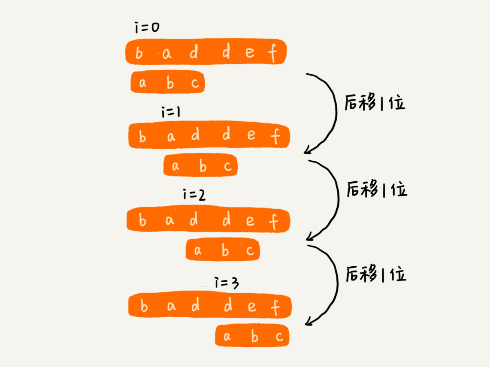

从上面的算法思想和例子，我们可以看出，在极端情况下，比如主串是“aaaaa…aaaaaa”（省略号表示有很多重复的字符 a），模式串是“aaaaab”。我们每次都比对 m 个字符，要比对 n-m+1 次，所以，这种算法的最坏情况时间复杂度是 O(n*m)。

尽管理论上，BF 算法的时间复杂度很高，是 O(n*m)，但在实际的开发中，它却是一个比较常用的字符串匹配算法。为什么这么说呢？原因有两点。

第一，实际的软件开发中，大部分情况下，模式串和主串的长度都不会太长。而且每次模式串与主串中的子串匹配的时候，当中途遇到不能匹配的字符的时候，就可以就停止了，不需要把 m 个字符都比对一下。所以，尽管理论上的最坏情况时间复杂度是 O(n*m)，但是，统计意义上，大部分情况下，算法执行效率要比这个高很多。

第二，朴素字符串匹配算法思想简单，代码实现也非常简单。简单意味着不容易出错，如果有 bug 也容易暴露和修复。在工程中，在满足性能要求的前提下，简单是首选。这也是我们常说的KISS（Keep it Simple and Stupid）设计原则。

所以，在实际的软件开发中，绝大部分情况下，朴素的字符串匹配算法就够用了。

## RK 算法

RK 算法的全称叫 Rabin-Karp 算法，是由它的两位发明者 Rabin 和 Karp 的名字来命名的。这个算法理解起来也不是很难。我个人觉得，它其实就是刚刚讲的 BF 算法的升级版。

我在讲 BF 算法的时候讲过，如果模式串长度为 m，主串长度为 n，那在主串中，就会有 n-m+1 个长度为 m 的子串，我们只需要暴力地对比这 n-m+1 个子串与模式串，就可以找出主串与模式串匹配的子串。

但是，每次检查主串与子串是否匹配，需要依次比对每个字符，所以 BF 算法的时间复杂度就比较高，是 O(n*m)。我们对朴素的字符串匹配算法稍加改造，引入哈希算法，时间复杂度立刻就会降低。

RK 算法的思路是这样的：我们通过哈希算法对主串中的 n-m+1 个子串分别求哈希值，然后逐个与模式串的哈希值比较大小。如果某个子串的哈希值与模式串相等，那就说明对应的子串和模式串匹配了（这里先不考虑哈希冲突的问题，后面我们会讲到）。因为哈希值是一个数字，数字之间比较是否相等是非常快速的，所以模式串和子串比较的效率就提高了。

不过，通过哈希算法计算子串的哈希值的时候，我们需要遍历子串中的每个字符。尽管模式串与子串比较的效率提高了，但是，算法整体的效率并没有提高。有没有方法可以提高哈希算法计算子串哈希值的效率呢？

这就需要哈希算法设计的非常有技巧了。我们假设要匹配的字符串的字符集中只包含 K 个字符，我们可以用一个 K 进制数来表示一个子串，这个 K 进制数转化成十进制数，作为子串的哈希值。表述起来有点抽象，我举了一个例子，看完你应该就能懂了。

比如要处理的字符串只包含 a～z 这 26 个小写字母，那我们就用二十六进制来表示一个字符串。我们把 a～z 这 26 个字符映射到 0～25 这 26 个数字，a 就表示 0，b 就表示 1，以此类推，z 表示 25。

在十进制的表示法中，一个数字的值是通过下面的方式计算出来的。对应到二十六进制，一个包含 a 到 z 这 26 个字符的字符串，计算哈希的时候，我们只需要把进位从 10 改成 26 就可以。

这个哈希算法你应该看懂了吧？现在，为了方便解释，在下面的讲解中，我假设字符串中只包含 a～z 这 26 个小写字符，我们用二十六进制来表示一个字符串，对应的哈希值就是二十六进制数转化成十进制的结果。

这种哈希算法有一个特点，在主串中，相邻两个子串的哈希值的计算公式有一定关系。我这有个例子，你先找一下规律，再来看我后面的讲解。

从这里例子中，我们很容易就能得出这样的规律：相邻两个子串 s[i-1]和 s[i]（i 表示子串在主串中的起始位置，子串的长度都为 m），对应的哈希值计算公式有交集，也就是说，我们可以使用 s[i-1]的哈希值很快的计算出 s[i]的哈希值。如果用公式表示的话，就是下面这个样子：

不过，这里有一个小细节需要注意，那就是 26^(m-1) 这部分的计算，我们可以通过查表的方法来提高效率。我们事先计算好 26^0、26^1、26^2……26^(m-1)，并且存储在一个长度为 m 的数组中，公式中的“次方”就对应数组的下标。当我们需要计算 26 的 x 次方的时候，就可以从数组的下标为 x 的位置取值，直接使用，省去了计算的时间。

我们开头的时候提过，RK 算法的效率要比 BF 算法高，现在，我们就来分析一下，RK 算法的时间复杂度到底是多少呢？

整个 RK 算法包含两部分，计算子串哈希值和模式串哈希值与子串哈希值之间的比较。第一部分，我们前面也分析了，可以通过设计特殊的哈希算法，只需要扫描一遍主串就能计算出所有子串的哈希值了，所以这部分的时间复杂度是 O(n)。

模式串哈希值与每个子串哈希值之间的比较的时间复杂度是 O(1)，总共需要比较 n-m+1 个子串的哈希值，所以，这部分的时间复杂度也是 O(n)。所以，RK 算法整体的时间复杂度就是 O(n)。

这里还有一个问题就是，模式串很长，相应的主串中的子串也会很长，通过上面的哈希算法计算得到的哈希值就可能很大，如果超过了计算机中整型数据可以表示的范围，那该如何解决呢？

刚刚我们设计的哈希算法是没有散列冲突的，也就是说，一个字符串与一个二十六进制数一一对应，不同的字符串的哈希值肯定不一样。因为我们是基于进制来表示一个字符串的，你可以类比成十进制、十六进制来思考一下。实际上，我们为了能将哈希值落在整型数据范围内，可以牺牲一下，允许哈希冲突。这个时候哈希算法该如何设计呢？

哈希算法的设计方法有很多，我举一个例子说明一下。假设字符串中只包含 a～z 这 26 个英文字母，那我们每个字母对应一个数字，比如 a 对应 1，b 对应 2，以此类推，z 对应 26。我们可以把字符串中每个字母对应的数字相加，最后得到的和作为哈希值。这种哈希算法产生的哈希值的数据范围就相对要小很多了。

不过，你也应该发现，这种哈希算法的哈希冲突概率也是挺高的。当然，我只是举了一个最简单的设计方法，还有很多更加优化的方法，比如将每一个字母从小到大对应一个素数，而不是 1，2，3……这样的自然数，这样冲突的概率就会降低一些。

那现在新的问题来了。之前我们只需要比较一下模式串和子串的哈希值，如果两个值相等，那这个子串就一定可以匹配模式串。但是，当存在哈希冲突的时候，有可能存在这样的情况，子串和模式串的哈希值虽然是相同的，但是两者本身并不匹配。

实际上，解决方法很简单。当我们发现一个子串的哈希值跟模式串的哈希值相等的时候，我们只需要再对比一下子串和模式串本身就好了。当然，如果子串的哈希值与模式串的哈希值不相等，那对应的子串和模式串肯定也是不匹配的，就不需要比对子串和模式串本身了。

所以，哈希算法的冲突概率要相对控制得低一些，如果存在大量冲突，就会导致 RK 算法的时间复杂度退化，效率下降。极端情况下，如果存在大量的冲突，每次都要再对比子串和模式串本身，那时间复杂度就会退化成 O(n*m)。但也不要太悲观，一般情况下，冲突不会很多，RK 算法的效率还是比 BF 算法高的。

## 解答开篇 & 内容小结

今天我们讲了两种字符串匹配算法，BF 算法和 RK 算法。

BF 算法是最简单、粗暴的字符串匹配算法，它的实现思路是，拿模式串与主串中是所有子串匹配，看是否有能匹配的子串。所以，时间复杂度也比较高，是 O(n*m)，n、m 表示主串和模式串的长度。不过，在实际的软件开发中，因为这种算法实现简单，对于处理小规模的字符串匹配很好用。

RK 算法是借助哈希算法对 BF 算法进行改造，即对每个子串分别求哈希值，然后拿子串的哈希值与模式串的哈希值比较，减少了比较的时间。所以，理想情况下，RK 算法的时间复杂度是 O(n)，跟 BF 算法相比，效率提高了很多。不过这样的效率取决于哈希算法的设计方法，如果存在冲突的情况下，时间复杂度可能会退化。极端情况下，哈希算法大量冲突，时间复杂度就退化为 O(n*m)。

## 课后思考

我们今天讲的都是一维字符串的匹配方法，实际上，这两种算法都可以类比到二维空间。假设有下面这样一个二维字符串矩阵（图中的主串），借助今天讲的处理思路，如何在其中查找另一个二维字符串矩阵（图中的模式串）呢？

欢迎留言和我分享，也欢迎点击“请朋友读”，把今天的内容分享给你的好友，和他一起讨论、学习。

# 33 | 字符串匹配基础（中）：如何实现文本编辑器中的查找功能？

王争 2018-12-07



00:00

[1.0x**](javascript:;)

讲述：修阳 大小：16.80M 时长：18:20

文本编辑器中的查找替换功能，我想你应该不陌生吧？比如，我们在 Word 中把一个单词统一替换成另一个，用的就是这个功能。你有没有想过，它是怎么实现的呢？

当然，你用上一节讲的 BF 算法和 RK 算法，也可以实现这个功能，但是在某些极端情况下，BF 算法性能会退化的比较严重，而 RK 算法需要用到哈希算法，而设计一个可以应对各种类型字符的哈希算法并不简单。

对于工业级的软件开发来说，我们希望算法尽可能的高效，并且在极端情况下，性能也不要退化的太严重。那么，**对于查找功能是重要功能的软件来说，比如一些文本编辑器，它们的查找功能都是用哪种算法来实现的呢？有没有比 BF 算法和 RK 算法更加高效的字符串匹配算法呢？**

今天，我们就来学习 BM（Boyer-Moore）算法。它是一种非常高效的字符串匹配算法，有实验统计，它的性能是著名的KMP 算法的 3 到 4 倍**。**BM 算法的原理很复杂，比较难懂，学起来会比较烧脑，我会尽量给你讲清楚，同时也希望你做好打硬仗的准备。好，现在我们正式开始！

## BM 算法的核心思想

我们把模式串和主串的匹配过程，看作模式串在主串中不停地往后滑动。当遇到不匹配的字符时，BF 算法和 RK 算法的做法是，模式串往后滑动一位，然后从模式串的第一个字符开始重新匹配。我举个例子解释一下，你可以看我画的这幅图。

在这个例子里，主串中的 c，在模式串中是不存在的，所以，模式串向后滑动的时候，只要 c 与模式串有重合，肯定无法匹配。所以，我们可以一次性把模式串往后多滑动几位，把模式串移动到 c 的后面。

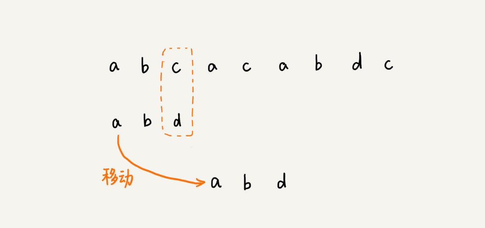

由现象找规律，你可以思考一下，当遇到不匹配的字符时，有什么固定的规律，可以将模式串往后多滑动几位呢？这样一次性往后滑动好几位，那匹配的效率岂不是就提高了？

我们今天要讲的 BM 算法，本质上其实就是在寻找这种规律。借助这种规律，在模式串与主串匹配的过程中，当模式串和主串某个字符不匹配的时候，能够跳过一些肯定不会匹配的情况，将模式串往后多滑动几位。

## BM 算法原理分析

BM 算法包含两部分，分别是**坏字符规则**（bad character rule）和**好后缀规则**（good suffix shift）。我们下面依次来看，这两个规则分别都是怎么工作的。

### 1. 坏字符规则

前面两节讲的算法，在匹配的过程中，我们都是按模式串的下标从小到大的顺序，依次与主串中的字符进行匹配的。这种匹配顺序比较符合我们的思维习惯，而 BM 算法的匹配顺序比较特别，它是按照模式串下标从大到小的顺序，倒着匹配的。我画了一张图，你可以看下。

我们从模式串的末尾往前倒着匹配，当我们发现某个字符没法匹配的时候。我们把这个没有匹配的字符叫作**坏字符**（主串中的字符）。

我们拿坏字符 c 在模式串中查找，发现模式串中并不存在这个字符，也就是说，字符 c 与模式串中的任何字符都不可能匹配。这个时候，我们可以将模式串直接往后滑动三位，将模式串滑动到 c 后面的位置，再从模式串的末尾字符开始比较。

这个时候，我们发现，模式串中最后一个字符 d，还是无法跟主串中的 a 匹配，这个时候，还能将模式串往后滑动三位吗？答案是不行的。因为这个时候，坏字符 a 在模式串中是存在的，模式串中下标是 0 的位置也是字符 a。这种情况下，我们可以将模式串往后滑动两位，让两个 a 上下对齐，然后再从模式串的末尾字符开始，重新匹配。

第一次不匹配的时候，我们滑动了三位，第二次不匹配的时候，我们将模式串后移两位，那具体滑动多少位，到底有没有规律呢？

当发生不匹配的时候，我们把坏字符对应的模式串中的字符下标记作 si。如果坏字符在模式串中存在，我们把这个坏字符在模式串中的下标记作 xi。如果不存在，我们把 xi 记作 -1。那模式串往后移动的位数就等于 si-xi。（注意，我这里说的下标，都是字符在模式串的下标）。

这里我要特别说明一点，如果坏字符在模式串里多处出现，那我们在计算 xi 的时候，选择最靠后的那个，因为这样不会让模式串滑动过多，导致本来可能匹配的情况被滑动略过。

利用坏字符规则，BM 算法在最好情况下的时间复杂度非常低，是 O(n/m)。比如，主串是 aaabaaabaaabaaab，模式串是 aaaa。每次比对，模式串都可以直接后移四位，所以，匹配具有类似特点的模式串和主串的时候，BM 算法非常高效。

不过，单纯使用坏字符规则还是不够的。因为根据 si-xi 计算出来的移动位数，有可能是负数，比如主串是 aaaaaaaaaaaaaaaa，模式串是 baaa。不但不会向后滑动模式串，还有可能倒退。所以，BM 算法还需要用到“好后缀规则”。

### 2. 好后缀规则

好后缀规则实际上跟坏字符规则的思路很类似。你看我下面这幅图。当模式串滑动到图中的位置的时候，模式串和主串有 2 个字符是匹配的，倒数第 3 个字符发生了不匹配的情况。

这个时候该如何滑动模式串呢？当然，我们还可以利用坏字符规则来计算模式串的滑动位数，不过，我们也可以使用好后缀处理规则。两种规则到底如何选择，我稍后会讲。抛开这个问题，现在我们来看，好后缀规则是怎么工作的？

我们把已经匹配的 bc 叫作好后缀，记作{u}。我们拿它在模式串中查找，如果找到了另一个跟{u}相匹配的子串{u*}，那我们就将模式串滑动到子串{u*}与主串中{u}对齐的位置。

如果在模式串中找不到另一个等于{u}的子串，我们就直接将模式串，滑动到主串中{u}的后面，因为之前的任何一次往后滑动，都没有匹配主串中{u}的情况。

不过，当模式串中不存在等于{u}的子串时，我们直接将模式串滑动到主串{u}的后面。这样做是否有点太过头呢？我们来看下面这个例子。这里面 bc 是好后缀，尽管在模式串中没有另外一个相匹配的子串{u*}，但是如果我们将模式串移动到好后缀的后面，如图所示，那就会错过模式串和主串可以匹配的情况。

如果好后缀在模式串中不存在可匹配的子串，那在我们一步一步往后滑动模式串的过程中，只要主串中的{u}与模式串有重合，那肯定就无法完全匹配。但是当模式串滑动到前缀与主串中{u}的后缀有部分重合的时候，并且重合的部分相等的时候，就有可能会存在完全匹配的情况。

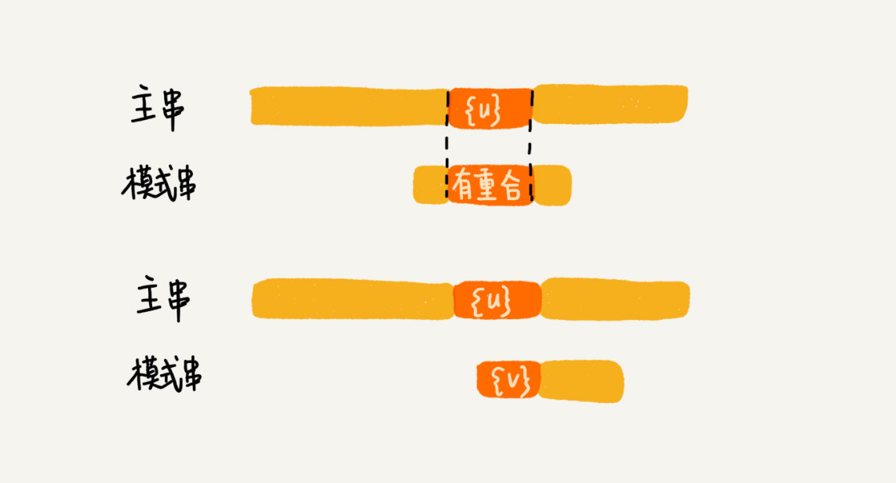

所以，针对这种情况，我们不仅要看好后缀在模式串中，是否有另一个匹配的子串，我们还要考察好后缀的后缀子串，是否存在跟模式串的前缀子串匹配的。

所谓某个字符串 s 的后缀子串，就是最后一个字符跟 s 对齐的子串，比如 abc 的后缀子串就包括 c, bc。所谓前缀子串，就是起始字符跟 s 对齐的子串，比如 abc 的前缀子串有 a，ab。我们从好后缀的后缀子串中，找一个最长的并且能跟模式串的前缀子串匹配的，假设是{v}，然后将模式串滑动到如图所示的位置。

坏字符和好后缀的基本原理都讲完了，我现在回答一下前面那个问题。当模式串和主串中的某个字符不匹配的时候，如何选择用好后缀规则还是坏字符规则，来计算模式串往后滑动的位数？

我们可以分别计算好后缀和坏字符往后滑动的位数，然后取两个数中最大的，作为模式串往后滑动的位数。这种处理方法还可以避免我们前面提到的，根据坏字符规则，计算得到的往后滑动的位数，有可能是负数的情况。

## BM 算法代码实现

学习完了基本原理，我们再来看，如何实现 BM 算法？

“坏字符规则”本身不难理解。当遇到坏字符时，要计算往后移动的位数 si-xi，其中 xi 的计算是重点，我们如何求得 xi 呢？或者说，如何查找坏字符在模式串中出现的位置呢？

如果我们拿坏字符，在模式串中顺序遍历查找，这样就会比较低效，势必影响这个算法的性能。有没有更加高效的方式呢？我们之前学的散列表，这里可以派上用场了。我们可以将模式串中的每个字符及其下标都存到散列表中。这样就可以快速找到坏字符在模式串的位置下标了。

关于这个散列表，我们只实现一种最简单的情况，假设字符串的字符集不是很大，每个字符长度是 1 字节，我们用大小为 256 的数组，来记录每个字符在模式串中出现的位置。数组的下标对应字符的 ASCII 码值，数组中存储这个字符在模式串中出现的位置。

如果将上面的过程翻译成代码，就是下面这个样子。其中，变量 b 是模式串，m 是模式串的长度，bc 表示刚刚讲的散列表。

private static final int SIZE = 256; // 全局变量或成员变量

private void generateBC(char[] b, int m, int[] bc) {

  for (int i = 0; i < SIZE; ++i) {

​    bc[i] = -1; // 初始化bc

  }

  for (int i = 0; i < m; ++i) {

​    int ascii = (int)b[i]; // 计算b[i]的ASCII值

​    bc[ascii] = i;

  }

}

掌握了坏字符规则之后，我们先把 BM 算法代码的大框架写好，先不考虑好后缀规则，仅用坏字符规则，并且不考虑 si-xi 计算得到的移动位数可能会出现负数的情况。

public int bm(char[] a, int n, char[] b, int m) {

  int[] bc = new int[SIZE]; // 记录模式串中每个字符最后出现的位置

  generateBC(b, m, bc); // 构建坏字符哈希表

  int i = 0; // i表示主串与模式串对齐的第一个字符

  while (i <= n - m) {

​    int j;

​    for (j = m - 1; j >= 0; --j) { // 模式串从后往前匹配

​      if (a[i+j] != b[j]) break; // 坏字符对应模式串中的下标是j

​    }

​    if (j < 0) {

​      return i; // 匹配成功，返回主串与模式串第一个匹配的字符的位置

​    }

​    // 这里等同于将模式串往后滑动j-bc[(int)a[i+j]]位

​    i = i + (j - bc[(int)a[i+j]]); 

  }

  return -1;

}

代码里的注释已经很详细了，我就不再赘述了。不过，为了你方便理解，我画了一张图，将其中的一些关键变量标注在上面了，结合着图，代码应该更好理解。

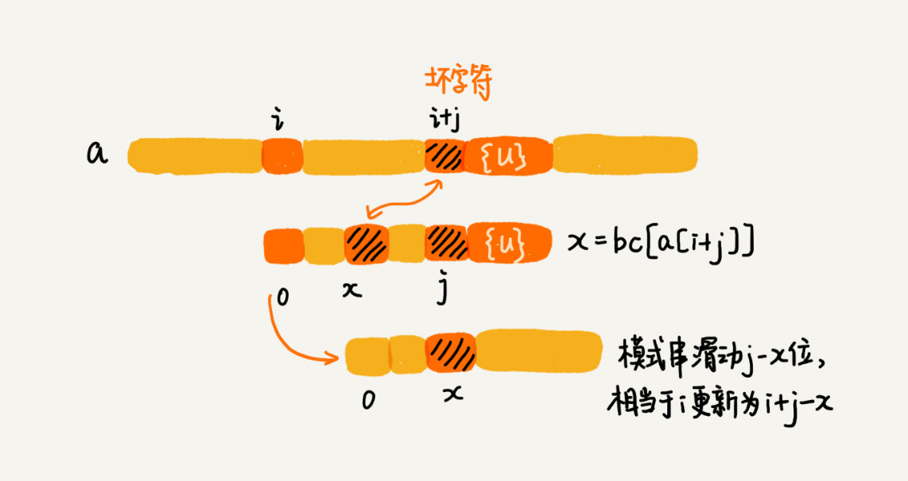

至此，我们已经实现了包含坏字符规则的框架代码，只剩下往框架代码中填充好后缀规则了。现在，我们就来看看，如何实现好后缀规则。它的实现要比坏字符规则复杂一些。

在讲实现之前，我们先简单回顾一下，前面讲过好后缀的处理规则中最核心的内容：

在模式串中，查找跟好后缀匹配的另一个子串；

在好后缀的后缀子串中，查找最长的、能跟模式串前缀子串匹配的后缀子串；

在不考虑效率的情况下，这两个操作都可以用很“暴力”的匹配查找方式解决。但是，如果想要 BM 算法的效率很高，这部分就不能太低效。如何来做呢？

因为好后缀也是模式串本身的后缀子串，所以，我们可以在模式串和主串正式匹配之前，通过预处理模式串，预先计算好模式串的每个后缀子串，对应的另一个可匹配子串的位置。这个预处理过程比较有技巧，很不好懂，应该是这节最难懂的内容了，你要认真多读几遍。

我们先来看，**如何表示模式串中不同的后缀子串呢？**因为后缀子串的最后一个字符的位置是固定的，下标为 m-1，我们只需要记录长度就可以了。通过长度，我们可以确定一个唯一的后缀子串。

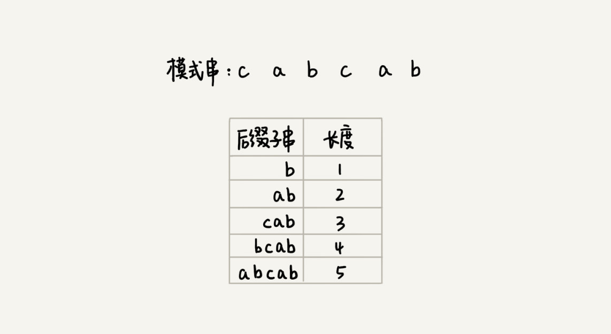

现在，我们要**引入最关键的变量 suffix 数组**。suffix 数组的下标 k，表示后缀子串的长度，下标对应的数组值存储的是，在模式串中跟好后缀{u}相匹配的子串{u*}的起始下标值。这句话不好理解，我举一个例子。

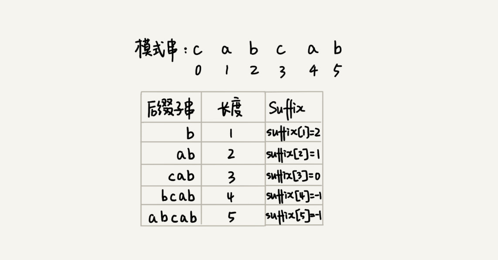

但是，如果模式串中有多个（大于 1 个）子串跟后缀子串{u}匹配，那 suffix 数组中该存储哪一个子串的起始位置呢？为了避免模式串往后滑动得过头了，我们肯定要存储模式串中最靠后的那个子串的起始位置，也就是下标最大的那个子串的起始位置。不过，这样处理就足够了吗？

实际上，仅仅是选最靠后的子串片段来存储是不够的。我们再回忆一下好后缀规则。

我们不仅要在模式串中，查找跟好后缀匹配的另一个子串，还要在好后缀的后缀子串中，查找最长的能跟模式串前缀子串匹配的后缀子串。

如果我们只记录刚刚定义的 suffix，实际上，只能处理规则的前半部分，也就是，在模式串中，查找跟好后缀匹配的另一个子串。所以，除了 suffix 数组之外，我们还需要另外一个 boolean 类型的 prefix 数组，来记录模式串的后缀子串是否能匹配模式串的前缀子串。

现在，我们来看下，**如何来计算并填充这两个数组的值**？这个计算过程非常巧妙。

我们拿下标从 0 到 i 的子串（i 可以是 0 到 m-2）与整个模式串，求公共后缀子串。如果公共后缀子串的长度是 k，那我们就记录 suffix[k]=j（j 表示公共后缀子串的起始下标）。如果 j 等于 0，也就是说，公共后缀子串也是模式串的前缀子串，我们就记录 prefix[k]=true。

我们把 suffix 数组和 prefix 数组的计算过程，用代码实现出来，就是下面这个样子：

// b表示模式串，m表示长度，suffix，prefix数组事先申请好了

private void generateGS(char[] b, int m, int[] suffix, boolean[] prefix) {

  for (int i = 0; i < m; ++i) { // 初始化

​    suffix[i] = -1;

​    prefix[i] = false;

  }

  for (int i = 0; i < m - 1; ++i) { // b[0, i]

​    int j = i;

​    int k = 0; // 公共后缀子串长度

​    while (j >= 0 && b[j] == b[m-1-k]) { // 与b[0, m-1]求公共后缀子串

​      --j;

​      ++k;

​      suffix[k] = j+1; //j+1表示公共后缀子串在b[0, i]中的起始下标

​    }

​    if (j == -1) prefix[k] = true; //如果公共后缀子串也是模式串的前缀子串

  }

}

有了这两个数组之后，我们现在来看，**在模式串跟主串匹配的过程中，遇到不能匹配的字符时，如何根据好后缀规则，****计算模式串往后滑动的位数？**

假设好后缀的长度是 k。我们先拿好后缀，在 suffix 数组中查找其匹配的子串。如果 suffix[k]不等于 -1（-1 表示不存在匹配的子串），那我们就将模式串往后移动 j-suffix[k]+1 位（j 表示坏字符对应的模式串中的字符下标）。如果 suffix[k]等于 -1，表示模式串中不存在另一个跟好后缀匹配的子串片段。我们可以用下面这条规则来处理。

好后缀的后缀子串 b[r, m-1]（其中，r 取值从 j+2 到 m-1）的长度 k=m-r，如果 prefix[k]等于 true，表示长度为 k 的后缀子串，有可匹配的前缀子串，这样我们可以把模式串后移 r 位。

如果两条规则都没有找到可以匹配好后缀及其后缀子串的子串，我们就将整个模式串后移 m 位。

至此，好后缀规则的代码实现我们也讲完了。我们把好后缀规则加到前面的代码框架里，就可以得到 BM 算法的完整版代码实现。

// a,b表示主串和模式串；n，m表示主串和模式串的长度。

public int bm(char[] a, int n, char[] b, int m) {

  int[] bc = new int[SIZE]; // 记录模式串中每个字符最后出现的位置

  generateBC(b, m, bc); // 构建坏字符哈希表

  int[] suffix = new int[m];

  boolean[] prefix = new boolean[m];

  generateGS(b, m, suffix, prefix);

  int i = 0; // j表示主串与模式串匹配的第一个字符

  while (i <= n - m) {

​    int j;

​    for (j = m - 1; j >= 0; --j) { // 模式串从后往前匹配

​      if (a[i+j] != b[j]) break; // 坏字符对应模式串中的下标是j

​    }

​    if (j < 0) {

​      return i; // 匹配成功，返回主串与模式串第一个匹配的字符的位置

​    }

​    int x = j - bc[(int)a[i+j]];

​    int y = 0;

​    if (j < m-1) { // 如果有好后缀的话

​      y = moveByGS(j, m, suffix, prefix);

​    }

​    i = i + Math.max(x, y);

  }

  return -1;

}

// j表示坏字符对应的模式串中的字符下标; m表示模式串长度

private int moveByGS(int j, int m, int[] suffix, boolean[] prefix) {

  int k = m - 1 - j; // 好后缀长度

  if (suffix[k] != -1) return j - suffix[k] +1;

  for (int r = j+2; r <= m-1; ++r) {

​    if (prefix[m-r] == true) {

​      return r;

​    }

  }

  return m;

}

## BM 算法的性能分析及优化

我们先来分析 BM 算法的内存消耗。整个算法用到了额外的 3 个数组，其中 bc 数组的大小跟字符集大小有关，suffix 数组和 prefix 数组的大小跟模式串长度 m 有关。

如果我们处理字符集很大的字符串匹配问题，bc 数组对内存的消耗就会比较多。因为好后缀和坏字符规则是独立的，如果我们运行的环境对内存要求苛刻，可以只使用好后缀规则，不使用坏字符规则，这样就可以避免 bc 数组过多的内存消耗。不过，单纯使用好后缀规则的 BM 算法效率就会下降一些了。

对于执行效率来说，我们可以先从时间复杂度的角度来分析。

实际上，我前面讲的 BM 算法是个初级版本。为了让你能更容易理解，有些复杂的优化我没有讲。基于我目前讲的这个版本，在极端情况下，预处理计算 suffix 数组、prefix 数组的性能会比较差。

比如模式串是 aaaaaaa 这种包含很多重复的字符的模式串，预处理的时间复杂度就是 O(m^2)。当然，大部分情况下，时间复杂度不会这么差。关于如何优化这种极端情况下的时间复杂度退化，如果感兴趣，你可以自己研究一下。

实际上，BM 算法的时间复杂度分析起来是非常复杂，这篇论文“A new proof of the linearity of the Boyer-Moore string searching algorithm”证明了在最坏情况下，BM 算法的比较次数上限是 5n。这篇论文“Tight bounds on the complexity of the Boyer-Moore string matching algorithm”证明了在最坏情况下，BM 算法的比较次数上限是 3n。你可以自己阅读看看。

## 解答开篇 & 内容小结

今天，我们讲了一种比较复杂的字符串匹配算法，BM 算法。尽管复杂、难懂，但匹配的效率却很高，在实际的软件开发中，特别是一些文本编辑器中，应用比较多。如果一遍看不懂的话，你就多看几遍。

BM 算法核心思想是，利用模式串本身的特点，在模式串中某个字符与主串不能匹配的时候，将模式串往后多滑动几位，以此来减少不必要的字符比较，提高匹配的效率。BM 算法构建的规则有两类，坏字符规则和好后缀规则。好后缀规则可以独立于坏字符规则使用。因为坏字符规则的实现比较耗内存，为了节省内存，我们可以只用好后缀规则来实现 BM 算法。

## 课后思考

你熟悉的编程语言中的查找函数，或者工具、软件中的查找功能，都是用了哪种字符串匹配算法呢？

欢迎留言和我分享，也欢迎点击“请朋友读”，把今天的内容分享给你的好友，和他一起讨论、学习。

# 34 | 字符串匹配基础（下）：如何借助BM算法轻松理解KMP算法？

王争 2018-12-10



00:00

[1.0x**](javascript:;)

讲述：修阳 大小：11.04M 时长：12:03

上一节我们讲了 BM 算法，尽管它很复杂，也不好理解，但却是工程中非常常用的一种高效字符串匹配算法。有统计说，它是最高效、最常用的字符串匹配算法。不过，在所有的字符串匹配算法里，要说最知名的一种的话，那就非 KMP 算法莫属。很多时候，提到字符串匹配，我们首先想到的就是 KMP 算法。

尽管在实际的开发中，我们几乎不大可能自己亲手实现一个 KMP 算法。但是，学习这个算法的思想，作为让你开拓眼界、锻炼下逻辑思维，也是极好的，所以我觉得有必要拿出来给你讲一讲。不过，KMP 算法是出了名的不好懂。我会尽力把它讲清楚，但是你自己也要多动动脑子。

实际上，KMP 算法跟 BM 算法的本质是一样的。上一节，我们讲了好后缀和坏字符规则，今天，我们就看下，如何借助上一节 BM 算法的讲解思路，让你能更好地理解 KMP 算法？

## KMP 算法基本原理

KMP 算法是根据三位作者（D.E.Knuth，J.H.Morris 和 V.R.Pratt）的名字来命名的，算法的全称是 Knuth Morris Pratt 算法，简称为 KMP 算法。

KMP 算法的核心思想，跟上一节讲的 BM 算法非常相近。我们假设主串是 a，模式串是 b。在模式串与主串匹配的过程中，当遇到不可匹配的字符的时候，我们希望找到一些规律，可以将模式串往后多滑动几位，跳过那些肯定不会匹配的情况。

还记得我们上一节讲到的好后缀和坏字符吗？这里我们可以类比一下，在模式串和主串匹配的过程中，把不能匹配的那个字符仍然叫作**坏字符**，把已经匹配的那段字符串叫作**好前缀**。

当遇到坏字符的时候，我们就要把模式串往后滑动，在滑动的过程中，只要模式串和好前缀有上下重合，前面几个字符的比较，就相当于拿好前缀的后缀子串，跟模式串的前缀子串在比较。这个比较的过程能否更高效了呢？可以不用一个字符一个字符地比较了吗？

KMP 算法就是在试图寻找一种规律：在模式串和主串匹配的过程中，当遇到坏字符后，对于已经比对过的好前缀，能否找到一种规律，将模式串一次性滑动很多位？

我们只需要拿好前缀本身，在它的后缀子串中，查找最长的那个可以跟好前缀的前缀子串匹配的。假设最长的可匹配的那部分前缀子串是{v}，长度是 k。我们把模式串一次性往后滑动 j-k 位，相当于，每次遇到坏字符的时候，我们就把 j 更新为 k，i 不变，然后继续比较。

为了表述起来方便，我把好前缀的所有后缀子串中，最长的可匹配前缀子串的那个后缀子串，叫作**最长可匹配后缀子串**；对应的前缀子串，叫作**最长可匹配前缀子串**。

如何来求好前缀的最长可匹配前缀和后缀子串呢？我发现，这个问题其实不涉及主串，只需要通过模式串本身就能求解。所以，我就在想，能不能事先预处理计算好，在模式串和主串匹配的过程中，直接拿过来就用呢？

类似 BM 算法中的 bc、suffix、prefix 数组，KMP 算法也可以提前构建一个数组，用来存储模式串中每个前缀（这些前缀都有可能是好前缀）的最长可匹配前缀子串的结尾字符下标。我们把这个数组定义为 **next 数组**，很多书中还给这个数组起了一个名字，叫**失效函数**（failure function）。

数组的下标是每个前缀结尾字符下标，数组的值是这个前缀的最长可以匹配前缀子串的结尾字符下标。这句话有点拗口，我举了一个例子，你一看应该就懂了。

有了 next 数组，我们很容易就可以实现 KMP 算法了。我先假设 next 数组已经计算好了，先给出 KMP 算法的框架代码。

// a, b分别是主串和模式串；n, m分别是主串和模式串的长度。

public static int kmp(char[] a, int n, char[] b, int m) {

  int[] next = getNexts(b, m);

  int j = 0;

  for (int i = 0; i < n; ++i) {

​    while (j > 0 && a[i] != b[j]) { // 一直找到a[i]和b[j]

​      j = next[j - 1] + 1;

​    }

​    if (a[i] == b[j]) {

​      ++j;

​    }

​    if (j == m) { // 找到匹配模式串的了

​      return i - m + 1;

​    }

  }

  return -1;

}

## 失效函数计算方法

KMP 算法的基本原理讲完了，我们现在来看最复杂的部分，也就是 next 数组是如何计算出来的？

当然，我们可以用非常笨的方法，比如要计算下面这个模式串 b 的 next[4]，我们就把 b[0, 4]的所有后缀子串，从长到短找出来，依次看看，是否能跟模式串的前缀子串匹配。很显然，这个方法也可以计算得到 next 数组，但是效率非常低。有没有更加高效的方法呢？

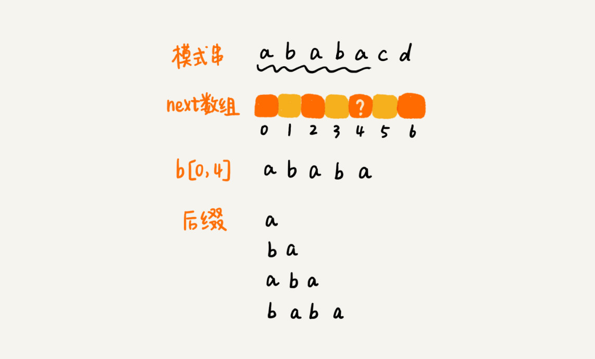

这里的处理非常有技巧，类似于动态规划。不过，动态规划我们在后面才会讲到，所以，我这里换种方法解释，也能让你听懂。

我们按照下标从小到大，依次计算 next 数组的值。当我们要计算 next[i]的时候，前面的 next[0]，next[1]，……，next[i-1]应该已经计算出来了。利用已经计算出来的 next 值，我们是否可以快速推导出 next[i]的值呢？

如果 next[i-1]=k-1，也就是说，子串 b[0, k-1]是 b[0, i-1]的最长可匹配前缀子串。如果子串 b[0, k-1]的下一个字符 b[k]，与 b[0, i-1]的下一个字符 b[i]匹配，那子串 b[0, k]就是 b[0, i]的最长可匹配前缀子串。所以，next[i]等于 k。但是，如果 b[0, k-1]的下一字符 b[k]跟 b[0, i-1]的下一个字符 b[i]不相等呢？这个时候就不能简单地通过 next[i-1]得到 next[i]了。这个时候该怎么办呢？

我们假设 b[0, i]的最长可匹配后缀子串是 b[r, i]。如果我们把最后一个字符去掉，那 b[r, i-1]肯定是 b[0, i-1]的可匹配后缀子串，但不一定是最长可匹配后缀子串。所以，既然 b[0, i-1]最长可匹配后缀子串对应的模式串的前缀子串的下一个字符并不等于 b[i]，那么我们就可以考察 b[0, i-1]的次长可匹配后缀子串 b[x, i-1]对应的可匹配前缀子串 b[0, i-1-x]的下一个字符 b[i-x]是否等于 b[i]。如果等于，那 b[x, i]就是 b[0, i]的最长可匹配后缀子串。

可是，如何求得 b[0, i-1]的次长可匹配后缀子串呢？次长可匹配后缀子串肯定被包含在最长可匹配后缀子串中，而最长可匹配后缀子串又对应最长可匹配前缀子串 b[0, y]。于是，查找 b[0, i-1]的次长可匹配后缀子串，这个问题就变成，查找 b[0, y]的最长匹配后缀子串的问题了。

按照这个思路，我们可以考察完所有的 b[0, i-1]的可匹配后缀子串 b[y, i-1]，直到找到一个可匹配的后缀子串，它对应的前缀子串的下一个字符等于 b[i]，那这个 b[y, i]就是 b[0, i]的最长可匹配后缀子串。

前面我已经给出 KMP 算法的框架代码了，现在我把这部分的代码也写出来了。这两部分代码合在一起，就是整个 KMP 算法的代码实现。

// b表示模式串，m表示模式串的长度

private static int[] getNexts(char[] b, int m) {

  int[] next = new int[m];

  next[0] = -1;

  int k = -1;

  for (int i = 1; i < m; ++i) {

​    while (k != -1 && b[k + 1] != b[i]) {

​      k = next[k];

​    }

​    if (b[k + 1] == b[i]) {

​      ++k;

​    }

​    next[i] = k;

  }

  return next;

}

## KMP 算法复杂度分析

KMP 算法的原理和实现我们就讲完了，我们现在来分析一下 KMP 算法的时间、空间复杂度是多少？

空间复杂度很容易分析，KMP 算法只需要一个额外的 next 数组，数组的大小跟模式串相同。所以空间复杂度是 O(m)，m 表示模式串的长度。

KMP 算法包含两部分，第一部分是构建 next 数组，第二部分才是借助 next 数组匹配。所以，关于时间复杂度，我们要分别从这两部分来分析。

我们先来分析第一部分的时间复杂度。

计算 next 数组的代码中，第一层 for 循环中 i 从 1 到 m-1，也就是说，内部的代码被执行了 m-1 次。for 循环内部代码有一个 while 循环，如果我们能知道每次 for 循环、while 循环平均执行的次数，假设是 k，那时间复杂度就是 O(k*m)。但是，while 循环执行的次数不怎么好统计，所以我们放弃这种分析方法。

我们可以找一些参照变量，i 和 k。i 从 1 开始一直增加到 m，而 k 并不是每次 for 循环都会增加，所以，k 累积增加的值肯定小于 m。而 while 循环里 k=next[k]，实际上是在减小 k 的值，k 累积都没有增加超过 m，所以 while 循环里面 k=next[k]总的执行次数也不可能超过 m。因此，next 数组计算的时间复杂度是 O(m)。

我们再来分析第二部分的时间复杂度。分析的方法是类似的。

i 从 0 循环增长到 n-1，j 的增长量不可能超过 i，所以肯定小于 n。而 while 循环中的那条语句 j=next[j-1]+1，不会让 j 增长的，那有没有可能让 j 不变呢？也没有可能。因为 next[j-1]的值肯定小于 j-1，所以 while 循环中的这条语句实际上也是在让 j 的值减少。而 j 总共增长的量都不会超过 n，那减少的量也不可能超过 n，所以 while 循环中的这条语句总的执行次数也不会超过 n，所以这部分的时间复杂度是 O(n)。

所以，综合两部分的时间复杂度，KMP 算法的时间复杂度就是 O(m+n)。

## 解答开篇 & 内容小结

KMP 算法讲完了，不知道你理解了没有？如果没有，建议多看几遍，自己多思考思考。KMP 算法和上一节讲的 BM 算法的本质非常类似，都是根据规律在遇到坏字符的时候，把模式串往后多滑动几位。

BM 算法有两个规则，坏字符和好后缀。KMP 算法借鉴 BM 算法的思想，可以总结成好前缀规则。这里面最难懂的就是 next 数组的计算。如果用最笨的方法来计算，确实不难，但是效率会比较低。所以，我讲了一种类似动态规划的方法，按照下标 i 从小到大，依次计算 next[i]，并且 next[i]的计算通过前面已经计算出来的 next[0]，next[1]，……，next[i-1]来推导。

KMP 算法的时间复杂度是 O(n+m)，不过它的分析过程稍微需要一点技巧，不那么直观，你只要看懂就好了，并不需要掌握，在我们平常的开发中，很少会有这么难分析的代码。

## 课后思考

至此，我们把经典的单模式串匹配算法全部讲完了，它们分别是 BF 算法、RK 算法、BM 算法和 KMP 算法，关于这些算法，你觉得什么地方最难理解呢？

欢迎留言和我分享，也欢迎点击“请朋友读”，把今天的内容分享给你的好友，和他一起讨论、学习。

# 35 | Trie树：如何实现搜索引擎的搜索关键词提示功能？

王争 2018-12-12

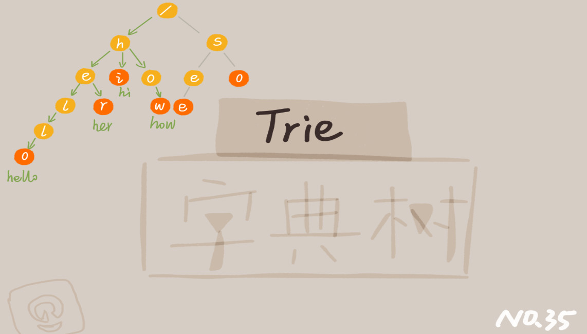



00:00

[1.0x**](javascript:;)

讲述：修阳 大小：9.99M 时长：14:32

搜索引擎的搜索关键词提示功能，我想你应该不陌生吧？为了方便快速输入，当你在搜索引擎的搜索框中，输入要搜索的文字的某一部分的时候，搜索引擎就会自动弹出下拉框，里面是各种关键词提示。你可以直接从下拉框中选择你要搜索的东西，而不用把所有内容都输入进去，一定程度上节省了我们的搜索时间。

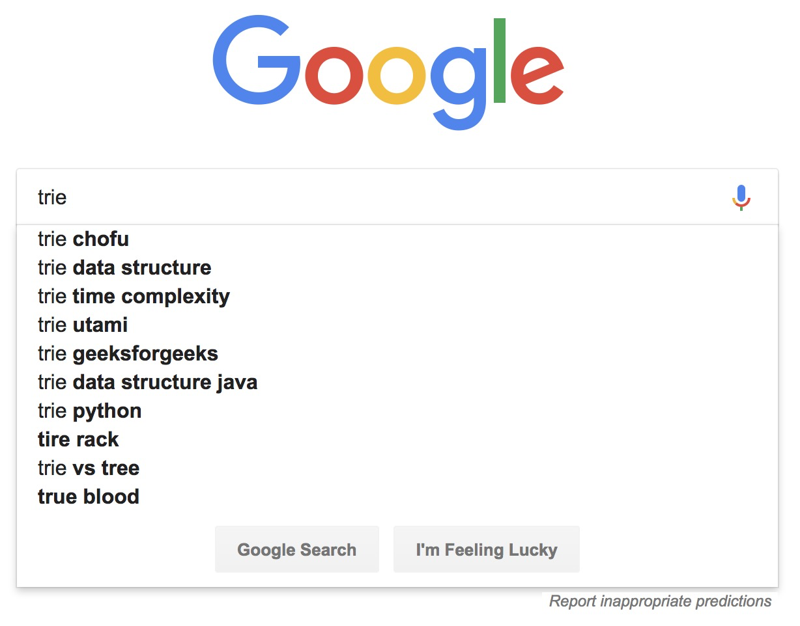

尽管这个功能我们几乎天天在用，作为一名工程师，你是否思考过，它是怎么实现的呢？它底层使用的是哪种数据结构和算法呢？

像 Google、百度这样的搜索引擎，它们的关键词提示功能非常全面和精准，肯定做了很多优化，但万变不离其宗，底层最基本的原理就是今天要讲的这种数据结构：Trie 树。

## 什么是“Trie 树”？

Trie 树，也叫“字典树”。顾名思义，它是一个树形结构。它是一种专门处理字符串匹配的数据结构，用来解决在一组字符串集合中快速查找某个字符串的问题。

当然，这样一个问题可以有多种解决方法，比如散列表、红黑树，或者我们前面几节讲到的一些字符串匹配算法，但是，Trie 树在这个问题的解决上，有它特有的优点。不仅如此，Trie 树能解决的问题也不限于此，我们一会儿慢慢分析。

现在，我们先来看下，Trie 树到底长什么样子。

我举个简单的例子来说明一下。我们有 6 个字符串，它们分别是：how，hi，her，hello，so，see。我们希望在里面多次查找某个字符串是否存在。如果每次查找，都是拿要查找的字符串跟这 6 个字符串依次进行字符串匹配，那效率就比较低，有没有更高效的方法呢？

这个时候，我们就可以先对这 6 个字符串做一下预处理，组织成 Trie 树的结构，之后每次查找，都是在 Trie 树中进行匹配查找。**Trie 树的本质，就是利用字符串之间的公共前缀，将重复的前缀合并在一起**。最后构造出来的就是下面这个图中的样子。

其中，根节点不包含任何信息。每个节点表示一个字符串中的字符，从根节点到红色节点的一条路径表示一个字符串（注意：红色节点并不都是叶子节点）。

为了让你更容易理解 Trie 树是怎么构造出来的，我画了一个 Trie 树构造的分解过程。构造过程的每一步，都相当于往 Trie 树中插入一个字符串。当所有字符串都插入完成之后，Trie 树就构造好了。

当我们在 Trie 树中查找一个字符串的时候，比如查找字符串“her”，那我们将要查找的字符串分割成单个的字符 h，e，r，然后从 Trie 树的根节点开始匹配。如图所示，绿色的路径就是在 Trie 树中匹配的路径。

如果我们要查找的是字符串“he”呢？我们还用上面同样的方法，从根节点开始，沿着某条路径来匹配，如图所示，绿色的路径，是字符串“he”匹配的路径。但是，路径的最后一个节点“e”并不是红色的。也就是说，“he”是某个字符串的前缀子串，但并不能完全匹配任何字符串。

## 如何实现一棵 Trie 树？

知道了 Trie 树长什么样子，我们现在来看下，如何用代码来实现一个 Trie 树。

从刚刚 Trie 树的介绍来看，Trie 树主要有两个操作，**一个是将字符串集合构造成 Trie 树**。这个过程分解开来的话，就是一个将字符串插入到 Trie 树的过程。**另一个是在 Trie 树中查询一个字符串**。

了解了 Trie 树的两个主要操作之后，我们再来看下，**如何存储一个 Trie 树？**

从前面的图中，我们可以看出，Trie 树是一个多叉树。我们知道，二叉树中，一个节点的左右子节点是通过两个指针来存储的，如下所示 Java 代码。那对于多叉树来说，我们怎么存储一个节点的所有子节点的指针呢？

class BinaryTreeNode {

  char data;

  BinaryTreeNode left;

  BinaryTreeNode right;  

}

我先介绍其中一种存储方式，也是经典的存储方式，大部分数据结构和算法书籍中都是这么讲的。还记得我们前面讲到的散列表吗？借助散列表的思想，我们通过一个下标与字符一一映射的数组，来存储子节点的指针。这句话稍微有点抽象，不怎么好懂，我画了一张图你可以看看。

假设我们的字符串中只有从 a 到 z 这 26 个小写字母，我们在数组中下标为 0 的位置，存储指向子节点 a 的指针，下标为 1 的位置存储指向子节点 b 的指针，以此类推，下标为 25 的位置，存储的是指向的子节点 z 的指针。如果某个字符的子节点不存在，我们就在对应的下标的位置存储 null。

class TrieNode {

  char data;

  TrieNode children[26];

}

当我们在 Trie 树中查找字符串的时候，我们就可以通过字符的 ASCII 码减去“a”的 ASCII 码，迅速找到匹配的子节点的指针。比如，d 的 ASCII 码减去 a 的 ASCII 码就是 3，那子节点 d 的指针就存储在数组中下标为 3 的位置中。

描述了这么多，有可能你还是有点懵，我把上面的描述翻译成了代码，你可以结合着一块看下，应该有助于你理解。

public class Trie {

  private TrieNode root = new TrieNode('/'); // 存储无意义字符

  // 往Trie树中插入一个字符串

  public void insert(char[] text) {

​    TrieNode p = root;

​    for (int i = 0; i < text.length; ++i) {

​      int index = text[i] - 'a';

​      if (p.children[index] == null) {

​        TrieNode newNode = new TrieNode(text[i]);

​        p.children[index] = newNode;

​      }

​      p = p.children[index];

​    }

​    p.isEndingChar = true;

  }

  // 在Trie树中查找一个字符串

  public boolean find(char[] pattern) {

​    TrieNode p = root;

​    for (int i = 0; i < pattern.length; ++i) {

​      int index = pattern[i] - 'a';

​      if (p.children[index] == null) {

​        return false; // 不存在pattern

​      }

​      p = p.children[index];

​    }

​    if (p.isEndingChar == false) return false; // 不能完全匹配，只是前缀

​    else return true; // 找到pattern

  }

  public class TrieNode {

​    public char data;

​    public TrieNode[] children = new TrieNode[26];

​    public boolean isEndingChar = false;

​    public TrieNode(char data) {

​      this.data = data;

​    }

  }

}

Trie 树的实现，你现在应该搞懂了。现在，我们来看下，**在 Trie 树中，查找某个字符串的时间复杂度是多少？**

如果要在一组字符串中，频繁地查询某些字符串，用 Trie 树会非常高效。构建 Trie 树的过程，需要扫描所有的字符串，时间复杂度是 O(n)（n 表示所有字符串的长度和）。但是一旦构建成功之后，后续的查询操作会非常高效。

每次查询时，如果要查询的字符串长度是 k，那我们只需要比对大约 k 个节点，就能完成查询操作。跟原本那组字符串的长度和个数没有任何关系。所以说，构建好 Trie 树后，在其中查找字符串的时间复杂度是 O(k)，k 表示要查找的字符串的长度。

## Trie 树真的很耗内存吗？

前面我们讲了 Trie 树的实现，也分析了时间复杂度。现在你应该知道，Trie 树是一种非常独特的、高效的字符串匹配方法。但是，关于 Trie 树，你有没有听过这样一种说法：“Trie 树是非常耗内存的，用的是一种空间换时间的思路”。这是什么原因呢？

刚刚我们在讲 Trie 树的实现的时候，讲到用数组来存储一个节点的子节点的指针。如果字符串中包含从 a 到 z 这 26 个字符，那每个节点都要存储一个长度为 26 的数组，并且每个数组元素要存储一个 8 字节指针（或者是 4 字节，这个大小跟 CPU、操作系统、编译器等有关）。而且，即便一个节点只有很少的子节点，远小于 26 个，比如 3、4 个，我们也要维护一个长度为 26 的数组。

我们前面讲过，Trie 树的本质是避免重复存储一组字符串的相同前缀子串，但是现在每个字符（对应一个节点）的存储远远大于 1 个字节。按照我们上面举的例子，数组长度为 26，每个元素是 8 字节，那每个节点就会额外需要 26*8=208 个字节。而且这还是只包含 26 个字符的情况。

如果字符串中不仅包含小写字母，还包含大写字母、数字、甚至是中文，那需要的存储空间就更多了。所以，也就是说，在某些情况下，Trie 树不一定会节省存储空间。在重复的前缀并不多的情况下，Trie 树不但不能节省内存，还有可能会浪费更多的内存。

当然，我们不可否认，Trie 树尽管有可能很浪费内存，但是确实非常高效。那为了解决这个内存问题，我们是否有其他办法呢？

我们可以稍微牺牲一点查询的效率，将每个节点中的数组换成其他数据结构，来存储一个节点的子节点指针。用哪种数据结构呢？我们的选择其实有很多，比如有序数组、跳表、散列表、红黑树等。

假设我们用有序数组，数组中的指针按照所指向的子节点中的字符的大小顺序排列。查询的时候，我们可以通过二分查找的方法，快速查找到某个字符应该匹配的子节点的指针。但是，在往 Trie 树中插入一个字符串的时候，我们为了维护数组中数据的有序性，就会稍微慢了点。

替换成其他数据结构的思路是类似的，这里我就不一一分析了，你可以结合前面学过的内容，自己分析一下。

实际上，Trie 树的变体有很多，都可以在一定程度上解决内存消耗的问题。比如，**缩点优化**，就是对只有一个子节点的节点，而且此节点不是一个串的结束节点，可以将此节点与子节点合并。这样可以节省空间，但却增加了编码难度。这里我就不展开详细讲解了，你如果感兴趣，可以自行研究下。

## Trie 树与散列表、红黑树的比较

实际上，字符串的匹配问题，笼统上讲，其实就是数据的查找问题。对于支持动态数据高效操作的数据结构，我们前面已经讲过好多了，比如散列表、红黑树、跳表等等。实际上，这些数据结构也可以实现在一组字符串中查找字符串的功能。我们选了两种数据结构，散列表和红黑树，跟 Trie 树比较一下，看看它们各自的优缺点和应用场景。

在刚刚讲的这个场景，在一组字符串中查找字符串，Trie 树实际上表现得并不好。它对要处理的字符串有及其严苛的要求。

第一，字符串中包含的字符集不能太大。我们前面讲到，如果字符集太大，那存储空间可能就会浪费很多。即便可以优化，但也要付出牺牲查询、插入效率的代价。

第二，要求字符串的前缀重合比较多，不然空间消耗会变大很多。

第三，如果要用 Trie 树解决问题，那我们就要自己从零开始实现一个 Trie 树，还要保证没有 bug，这个在工程上是将简单问题复杂化，除非必须，一般不建议这样做。

第四，我们知道，通过指针串起来的数据块是不连续的，而 Trie 树中用到了指针，所以，对缓存并不友好，性能上会打个折扣。

综合这几点，针对在一组字符串中查找字符串的问题，我们在工程中，更倾向于用散列表或者红黑树。因为这两种数据结构，我们都不需要自己去实现，直接利用编程语言中提供的现成类库就行了。

讲到这里，你可能要疑惑了，讲了半天，我对 Trie 树一通否定，还让你用红黑树或者散列表，那 Trie 树是不是就没用了呢？是不是今天的内容就白学了呢？

实际上，Trie 树只是不适合精确匹配查找，这种问题更适合用散列表或者红黑树来解决。Trie 树比较适合的是查找前缀匹配的字符串，也就是类似开篇问题的那种场景。

## 解答开篇

Trie 树就讲完了，我们来看下开篇提到的问题：如何利用 Trie 树，实现搜索关键词的提示功能？

我们假设关键词库由用户的热门搜索关键词组成。我们将这个词库构建成一个 Trie 树。当用户输入其中某个单词的时候，把这个词作为一个前缀子串在 Trie 树中匹配。为了讲解方便，我们假设词库里只有 hello、her、hi、how、so、see 这 6 个关键词。当用户输入了字母 h 的时候，我们就把以 h 为前缀的 hello、her、hi、how 展示在搜索提示框内。当用户继续键入字母 e 的时候，我们就把以 he 为前缀的 hello、her 展示在搜索提示框内。这就是搜索关键词提示的最基本的算法原理。

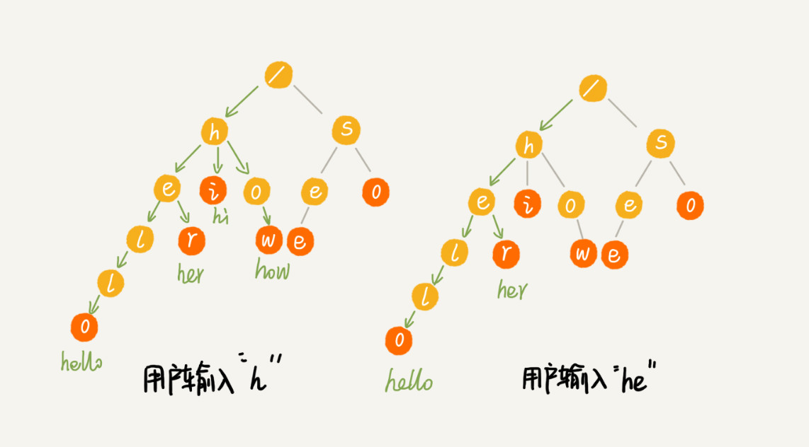

不过，我讲的只是最基本的实现原理，实际上，搜索引擎的搜索关键词提示功能远非我讲的这么简单。如果再稍微深入一点，你就会想到，上面的解决办法遇到下面几个问题：

我刚讲的思路是针对英文的搜索关键词提示，对于更加复杂的中文来说，词库中的数据又该如何构建成 Trie 树呢？

如果词库中有很多关键词，在搜索提示的时候，用户输入关键词，作为前缀在 Trie 树中可以匹配的关键词也有很多，如何选择展示哪些内容呢？

像 Google 这样的搜索引擎，用户单词拼写错误的情况下，Google 还是可以使用正确的拼写来做关键词提示，这个又是怎么做到的呢？

你可以先思考一下如何来解决，如果不会也没关系，这些问题，我们会在实战篇里具体来讲解。

实际上，Trie 树的这个应用可以扩展到更加广泛的一个应用上，就是自动输入补全，比如输入法自动补全功能、IDE 代码编辑器自动补全功能、浏览器网址输入的自动补全功能等等。

## 内容小结

今天我们讲了一种特殊的树，Trie 树。Trie 树是一种解决字符串快速匹配问题的数据结构。如果用来构建 Trie 树的这一组字符串中，前缀重复的情况不是很多，那 Trie 树这种数据结构总体上来讲是比较费内存的，是一种空间换时间的解决问题思路。

尽管比较耗费内存，但是对内存不敏感或者内存消耗在接受范围内的情况下，在 Trie 树中做字符串匹配还是非常高效的，时间复杂度是 O(k)，k 表示要匹配的字符串的长度。

但是，Trie 树的优势并不在于，用它来做动态集合数据的查找，因为，这个工作完全可以用更加合适的散列表或者红黑树来替代。Trie 树最有优势的是查找前缀匹配的字符串，比如搜索引擎中的关键词提示功能这个场景，就比较适合用它来解决，也是 Trie 树比较经典的应用场景。

## 课后思考

我们今天有讲到，Trie 树应用场合对数据要求比较苛刻，比如字符串的字符集不能太大，前缀重合比较多等。如果现在给你一个很大的字符串集合，比如包含 1 万条记录，如何通过编程量化分析这组字符串集合是否比较适合用 Trie 树解决呢？也就是如何统计字符串的字符集大小，以及前缀重合的程度呢？

欢迎留言和我分享，也欢迎点击“请朋友读”，把今天的内容分享给你的好友，和他一起讨论、学习。

# 36 | AC自动机：如何用多模式串匹配实现敏感词过滤功能？

王争 2018-12-14



00:00

[1.0x**](javascript:;)

讲述：修阳 大小：8.88M 时长：12:55

很多支持用户发表文本内容的网站，比如 BBS，大都会有敏感词过滤功能，用来过滤掉用户输入的一些淫秽、反动、谩骂等内容。你有没有想过，这个功能是怎么实现的呢？

实际上，这些功能最基本的原理就是字符串匹配算法，也就是通过维护一个敏感词的字典，当用户输入一段文字内容之后，通过字符串匹配算法，来查找用户输入的这段文字，是否包含敏感词。如果有，就用“***”把它替代掉。

我们前面讲过好几种字符串匹配算法了，它们都可以处理这个问题。但是，对于访问量巨大的网站来说，比如淘宝，用户每天的评论数有几亿、甚至几十亿。这时候，我们对敏感词过滤系统的性能要求就要很高。毕竟，我们也不想，用户输入内容之后，要等几秒才能发送出去吧？我们也不想，为了这个功能耗费过多的机器吧？**那如何才能实现一个高性能的敏感词过滤系统呢**？这就要用到今天的**多模式串匹配算法**。

## 基于单模式串和 Trie 树实现的敏感词过滤

我们前面几节讲了好几种字符串匹配算法，有 BF 算法、RK 算法、BM 算法、KMP 算法，还有 Trie 树。前面四种算法都是单模式串匹配算法，只有 Trie 树是多模式串匹配算法。

我说过，单模式串匹配算法，是在一个模式串和一个主串之间进行匹配，也就是说，在一个主串中查找一个模式串。多模式串匹配算法，就是在多个模式串和一个主串之间做匹配，也就是说，在一个主串中查找多个模式串。

尽管，单模式串匹配算法也能完成多模式串的匹配工作。例如开篇的思考题，我们可以针对每个敏感词，通过单模式串匹配算法（比如 KMP 算法）与用户输入的文字内容进行匹配。但是，这样做的话，每个匹配过程都需要扫描一遍用户输入的内容。整个过程下来就要扫描很多遍用户输入的内容。如果敏感词很多，比如几千个，并且用户输入的内容很长，假如有上千个字符，那我们就需要扫描几千遍这样的输入内容。很显然，这种处理思路比较低效。

与单模式匹配算法相比，多模式匹配算法在这个问题的处理上就很高效了。它只需要扫描一遍主串，就能在主串中一次性查找多个模式串是否存在，从而大大提高匹配效率。我们知道，Trie 树就是一种多模式串匹配算法。那如何用 Trie 树实现敏感词过滤功能呢？

我们可以对敏感词字典进行预处理，构建成 Trie 树结构。这个预处理的操作只需要做一次，如果敏感词字典动态更新了，比如删除、添加了一个敏感词，那我们只需要动态更新一下 Trie 树就可以了。

当用户输入一个文本内容后，我们把用户输入的内容作为主串，从第一个字符（假设是字符 C）开始，在 Trie 树中匹配。当匹配到 Trie 树的叶子节点，或者中途遇到不匹配字符的时候，我们将主串的开始匹配位置后移一位，也就是从字符 C 的下一个字符开始，重新在 Trie 树中匹配。

基于 Trie 树的这种处理方法，有点类似单模式串匹配的 BF 算法。我们知道，单模式串匹配算法中，KMP 算法对 BF 算法进行改进，引入了 next 数组，让匹配失败时，尽可能将模式串往后多滑动几位。借鉴单模式串的优化改进方法，能否对多模式串 Trie 树进行改进，进一步提高 Trie 树的效率呢？这就要用到 AC 自动机算法了。

## 经典的多模式串匹配算法：AC 自动机

AC 自动机算法，全称是 Aho-Corasick 算法。其实，Trie 树跟 AC 自动机之间的关系，就像单串匹配中朴素的串匹配算法，跟 KMP 算法之间的关系一样，只不过前者针对的是多模式串而已。所以，**AC 自动机实际上就是在 Trie 树之上，加了类似 KMP 的 next 数组，只不过此处的 next 数组是构建在树上罢了**。如果代码表示，就是下面这个样子：

public class AcNode {

  public char data; 

  public AcNode[] children = new AcNode[26]; // 字符集只包含a~z这26个字符

  public boolean isEndingChar = false; // 结尾字符为true

  public int length = -1; // 当isEndingChar=true时，记录模式串长度

  public AcNode fail; // 失败指针

  public AcNode(char data) {

​    this.data = data;

  }

}

所以，AC 自动机的构建，包含两个操作：

将多个模式串构建成 Trie 树；

在 Trie 树上构建失败指针（相当于 KMP 中的失效函数 next 数组）。

关于如何构建 Trie 树，我们上一节已经讲过了。所以，这里我们就重点看下，**构建好 Trie 树之后，如何在它之上构建失败指针？**

我用一个例子给你讲解。这里有 4 个模式串，分别是 c，bc，bcd，abcd；主串是 abcd。

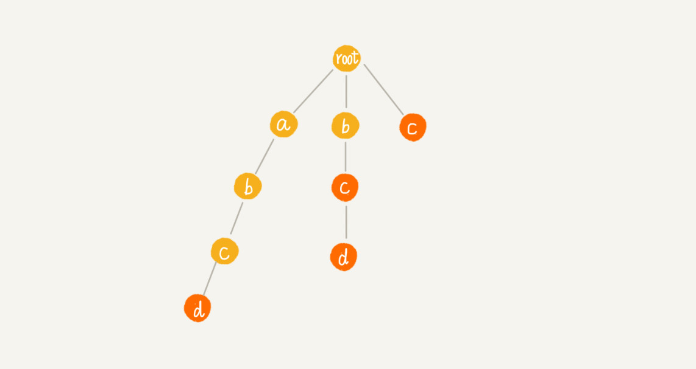

Trie 树中的每一个节点都有一个失败指针，它的作用和构建过程，跟 KMP 算法中的 next 数组极其相似。所以**要想看懂这节内容，你要先理解 KMP 算法中 next 数组的构建过程**。如果你还有点不清楚，建议你先回头去弄懂 KMP 算法。

假设我们沿 Trie 树走到 p 节点，也就是下图中的紫色节点，那 p 的失败指针就是从 root 走到紫色节点形成的字符串 abc，跟所有模式串前缀匹配的最长可匹配后缀子串，就是箭头指的 bc 模式串。

这里的最长可匹配后缀子串，我稍微解释一下。字符串 abc 的后缀子串有两个 bc，c，我们拿它们与其他模式串匹配，如果某个后缀子串可以匹配某个模式串的前缀，那我们就把这个后缀子串叫作**可匹配后缀子串**。

我们从可匹配后缀子串中，找出最长的一个，就是刚刚讲到的最长可匹配后缀子串。我们将 p 节点的失败指针指向那个最长匹配后缀子串对应的模式串的前缀的最后一个节点，就是下图中箭头指向的节点。

计算每个节点的失败指针这个过程看起来有些复杂。其实，如果我们把树中相同深度的节点放到同一层，那么某个节点的失败指针只有可能出现在它所在层的上一层。

我们可以像 KMP 算法那样，当我们要求某个节点的失败指针的时候，我们通过已经求得的、深度更小的那些节点的失败指针来推导。也就是说，我们可以逐层依次来求解每个节点的失败指针。所以，失败指针的构建过程，是一个按层遍历树的过程。

首先 root 的失败指针为 NULL，也就是指向自己。**当我们已经求得某个节点 p 的失败指针之后，如何寻找它的子节点的失败指针呢？**

我们假设节点 p 的失败指针指向节点 q，我们看节点 p 的子节点 pc 对应的字符，是否也可以在节点 q 的子节点中找到。如果找到了节点 q 的一个子节点 qc，对应的字符跟节点 pc 对应的字符相同，则将节点 pc 的失败指针指向节点 qc。

如果节点 q 中没有子节点的字符等于节点 pc 包含的字符，则令 q=q->fail（fail 表示失败指针，这里有没有很像 KMP 算法里求 next 的过程？），继续上面的查找，直到 q 是 root 为止，如果还没有找到相同字符的子节点，就让节点 pc 的失败指针指向 root。

我将构建失败指针的代码贴在这里，你可以对照着讲解一块看下，应该更容易理解。这里面，构建 Trie 树的代码我并没有贴出来，你可以参看上一节的代码，自己实现。

public void buildFailurePointer() {

  Queue<AcNode> queue = new LinkedList<>();

  root.fail = null;

  queue.add(root);

  while (!queue.isEmpty()) {

​    AcNode p = queue.remove();

​    for (int i = 0; i < 26; ++i) {

​      AcNode pc = p.children[i];

​      if (pc == null) continue;

​      if (p == root) {

​        pc.fail = root;

​      } else {

​        AcNode q = p.fail;

​        while (q != null) {

​          AcNode qc = q.children[pc.data - 'a'];

​          if (qc != null) {

​            pc.fail = qc;

​            break;

​          }

​          q = q.fail;

​        }

​        if (q == null) {

​          pc.fail = root;

​        }

​      }

​      queue.add(pc);

​    }

  }

}

通过按层来计算每个节点的子节点的失效指针，刚刚举的那个例子，最后构建完成之后的 AC 自动机就是下面这个样子：

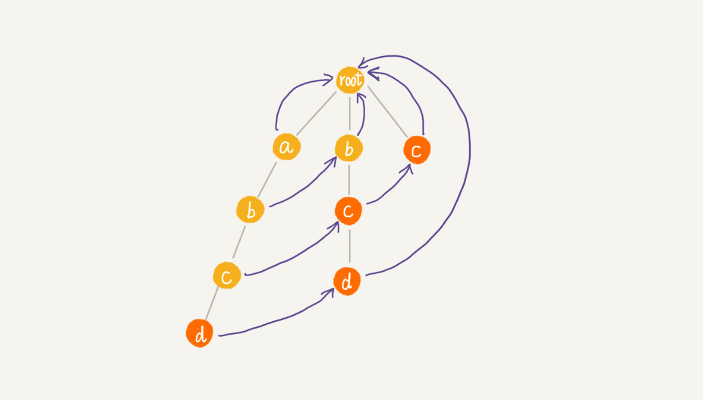

AC 自动机到此就构建完成了。我们现在来看下，**如何在 AC 自动机上匹配主串？**

我们还是拿之前的例子来讲解。在匹配过程中，主串从 i=0 开始，AC 自动机从指针 p=root 开始，假设模式串是 b，主串是 a。

如果 p 指向的节点有一个等于 b[i]的子节点 x，我们就更新 p 指向 x，这个时候我们需要通过失败指针，检测一系列失败指针为结尾的路径是否是模式串。这一句不好理解，你可以结合代码看。处理完之后，我们将 i 加一，继续这两个过程；

如果 p 指向的节点没有等于 b[i]的子节点，那失败指针就派上用场了，我们让 p=p->fail，然后继续这 2 个过程。

关于匹配的这部分，文字描述不如代码看得清楚，所以我把代码贴了出来，非常简短，并且添加了详细的注释，你可以对照着看下。这段代码输出的就是，在主串中每个可以匹配的模式串出现的位置。

public void match(char[] text) { // text是主串

  int n = text.length;

  AcNode p = root;

  for (int i = 0; i < n; ++i) {

​    int idx = text[i] - 'a';

​    while (p.children[idx] == null && p != root) {

​      p = p.fail; // 失败指针发挥作用的地方

​    }

​    p = p.children[idx];

​    if (p == null) p = root; // 如果没有匹配的，从root开始重新匹配

​    AcNode tmp = p;

​    while (tmp != root) { // 打印出可以匹配的模式串

​      if (tmp.isEndingChar == true) {

​        int pos = i-tmp.length+1;

​        System.out.println("匹配起始下标" + pos + "; 长度" + tmp.length);

​      }

​      tmp = tmp.fail;

​    }

  }

}

## 解答开篇

AC 自动机的内容讲完了，关于开篇的问题，你应该能解答了吧？实际上，我上面贴出来的代码，已经是一个敏感词过滤的原型代码了。它可以找到所有敏感词出现的位置（在用户输入的文本中的起始下标）。你只需要稍加改造，再遍历一遍文本内容（主串），就可以将文本中的所有敏感词替换成“***”。

所以我这里着重讲一下，**AC 自动机实现的敏感词过滤系统，是否比单模式串匹配方法更高效呢？**

首先，我们需要将敏感词构建成 AC 自动机，包括构建 Trie 树以及构建失败指针。

我们上一节讲过，Trie 树构建的时间复杂度是 O(m*len)，其中 len 表示敏感词的平均长度，m 表示敏感词的个数。那构建失败指针的时间复杂度是多少呢？我这里给出一个不是很紧确的上界。

假设 Trie 树中总的节点个数是 k，每个节点构建失败指针的时候，（你可以看下代码）最耗时的环节是 while 循环中的 q=q->fail，每运行一次这个语句，q 指向节点的深度都会减少 1，而树的高度最高也不会超过 len，所以每个节点构建失败指针的时间复杂度是 O(len)。整个失败指针的构建过程就是 O(k*len)。

不过，AC 自动机的构建过程都是预先处理好的，构建好之后，并不会频繁地更新，所以不会影响到敏感词过滤的运行效率。

我们再来看下，**用 AC 自动机做匹配的时间复杂度是多少？**

跟刚刚构建失败指针的分析类似，for 循环依次遍历主串中的每个字符，for 循环内部最耗时的部分也是 while 循环，而这一部分的时间复杂度也是 O(len)，所以总的匹配的时间复杂度就是 O(n*len)。因为敏感词并不会很长，而且这个时间复杂度只是一个非常宽泛的上限，实际情况下，可能近似于 O(n)，所以 AC 自动机做敏感词过滤，性能非常高。

你可以会说，从时间复杂度上看，AC 自动机匹配的效率跟 Trie 树一样啊。实际上，因为失效指针可能大部分情况下都指向 root 节点，所以绝大部分情况下，在 AC 自动机上做匹配的效率要远高于刚刚计算出的比较宽泛的时间复杂度。只有在极端情况下，如图所示，AC 自动机的性能才会退化的跟 Trie 树一样。

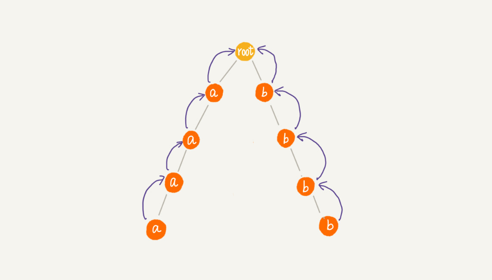

## 内容小结

今天我们讲了多模式串匹配算法，AC 自动机。单模式串匹配算法是为了快速在主串中查找一个模式串，而多模式串匹配算法是为了快速在主串中查找多个模式串。

AC 自动机是基于 Trie 树的一种改进算法，它跟 Trie 树的关系，就像单模式串中，KMP 算法与 BF 算法的关系一样。KMP 算法中有一个非常关键的 next 数组，类比到 AC 自动机中就是失败指针。而且，AC 自动机失败指针的构建过程，跟 KMP 算法中计算 next 数组极其相似。所以，要理解 AC 自动机，最好先掌握 KMP 算法，因为 AC 自动机其实就是 KMP 算法在多模式串上的改造。

整个 AC 自动机算法包含两个部分，第一部分是将多个模式串构建成 AC 自动机，第二部分是在 AC 自动机中匹配主串。第一部分又分为两个小的步骤，一个是将模式串构建成 Trie 树，另一个是在 Trie 树上构建失败指针。

## 课后思考

到此为止，字符串匹配算法我们全都讲完了，你能试着分析总结一下，各个字符串匹配算法的特点和比较适合的应用场景吗？

欢迎留言和我分享，也欢迎点击“请朋友读”，把今天的内容分享给你的好友，和他一起讨论、学习。

# 37 | 贪心算法：如何用贪心算法实现Huffman压缩编码？

王争 2018-12-17



00:00

[1.0x**](javascript:;)

讲述：修阳 大小：14.36M 时长：15:40

基础的数据结构和算法我们基本上学完了，接下来几节，我会讲几种更加基本的算法。它们分别是贪心算法、分治算法、回溯算法、动态规划。更加确切地说，它们应该是算法思想，并不是具体的算法，常用来指导我们设计具体的算法和编码等。

贪心、分治、回溯、动态规划这 4 个算法思想，原理解释起来都很简单，但是要真正掌握且灵活应用，并不是件容易的事情。所以，接下来的这 4 个算法思想的讲解，我依旧不会长篇大论地去讲理论，而是结合具体的问题，让你自己感受这些算法是怎么工作的，是如何解决问题的，带你在问题中体会这些算法的本质。我觉得，这比单纯记忆原理和定义要更有价值。

今天，我们先来学习一下贪心算法（greedy algorithm）。贪心算法有很多经典的应用，比如霍夫曼编码（Huffman Coding）、Prim 和 Kruskal 最小生成树算法、还有 Dijkstra 单源最短路径算法。最小生成树算法和最短路径算法我们后面会讲到，所以我们今天讲下霍夫曼编码，看看**它是如何利用贪心算法来实现对数据压缩编码，有效节省数据存储空间的**。

## 如何理解“贪心算法”？

关于贪心算法，我们先看一个例子。

假设我们有一个可以容纳 100kg 物品的背包，可以装各种物品。我们有以下 5 种豆子，每种豆子的总量和总价值都各不相同。为了让背包中所装物品的总价值最大，我们如何选择在背包中装哪些豆子？每种豆子又该装多少呢？

实际上，这个问题很简单，我估计你一下子就能想出来，没错，我们只要先算一算每个物品的单价，按照单价由高到低依次来装就好了。单价从高到低排列，依次是：黑豆、绿豆、红豆、青豆、黄豆，所以，我们可以往背包里装 20kg 黑豆、30kg 绿豆、50kg 红豆。

这个问题的解决思路显而易见，它本质上借助的就是贪心算法。结合这个例子，我总结一下贪心算法解决问题的步骤，我们一起来看看。

**第一步，当我们看到这类问题的时候，****首先要联想到贪心算法**：针对一组数据，我们定义了限制值和期望值，希望从中选出几个数据，在满足限制值的情况下，期望值最大。

类比到刚刚的例子，限制值就是重量不能超过 100kg，期望值就是物品的总价值。这组数据就是 5 种豆子。我们从中选出一部分，满足重量不超过 100kg，并且总价值最大。

**第二步，我们尝试看下这个问题是否可以用贪心算法解决**：每次选择当前情况下，在对限制值同等贡献量的情况下，对期望值贡献最大的数据。

类比到刚刚的例子，我们每次都从剩下的豆子里面，选择单价最高的，也就是重量相同的情况下，对价值贡献最大的豆子。

**第三步，我们举几个例子看下贪心算法产生的结果是否是最优的**。大部分情况下，举几个例子验证一下就可以了。严格地证明贪心算法的正确性，是非常复杂的，需要涉及比较多的数学推理。而且，从实践的角度来说，大部分能用贪心算法解决的问题，贪心算法的正确性都是显而易见的，也不需要严格的数学推导证明。

实际上，用贪心算法解决问题的思路，并不总能给出最优解。

我来举一个例子。在一个有权图中，我们从顶点 S 开始，找一条到顶点 T 的最短路径（路径中边的权值和最小）。贪心算法的解决思路是，每次都选择一条跟当前顶点相连的权最小的边，直到找到顶点 T。按照这种思路，我们求出的最短路径是 S->A->E->T，路径长度是 1+4+4=9。

但是，这种贪心的选择方式，最终求的路径并不是最短路径，因为路径 S->B->D->T 才是最短路径，因为这条路径的长度是 2+2+2=6。为什么贪心算法在这个问题上不工作了呢？

在这个问题上，贪心算法不工作的主要原因是，前面的选择，会影响后面的选择。如果我们第一步从顶点 S 走到顶点 A，那接下来面对的顶点和边，跟第一步从顶点 S 走到顶点 B，是完全不同的。所以，即便我们第一步选择最优的走法（边最短），但有可能因为这一步选择，导致后面每一步的选择都很糟糕，最终也就无缘全局最优解了。

## 贪心算法实战分析

对于贪心算法，你是不是还有点懵？如果死抠理论的话，确实很难理解透彻。掌握贪心算法的关键是多练习。只要多练习几道题，自然就有感觉了。所以，我带着你分析几个具体的例子，帮助你深入理解贪心算法。

### 1. 分糖果

我们有 m 个糖果和 n 个孩子。我们现在要把糖果分给这些孩子吃，但是糖果少，孩子多（m<n），所以糖果只能分配给一部分孩子。

每个糖果的大小不等，这 m 个糖果的大小分别是 s1，s2，s3，……，sm。除此之外，每个孩子对糖果大小的需求也是不一样的，只有糖果的大小大于等于孩子的对糖果大小的需求的时候，孩子才得到满足。假设这 n 个孩子对糖果大小的需求分别是 g1，g2，g3，……，gn。

我的问题是，如何分配糖果，能尽可能满足最多数量的孩子？

我们可以把这个问题抽象成，从 n 个孩子中，抽取一部分孩子分配糖果，让满足的孩子的个数（期望值）是最大的。这个问题的限制值就是糖果个数 m。

我们现在来看看如何用贪心算法来解决。对于一个孩子来说，如果小的糖果可以满足，我们就没必要用更大的糖果，这样更大的就可以留给其他对糖果大小需求更大的孩子。另一方面，对糖果大小需求小的孩子更容易被满足，所以，我们可以从需求小的孩子开始分配糖果。因为满足一个需求大的孩子跟满足一个需求小的孩子，对我们期望值的贡献是一样的。

我们每次从剩下的孩子中，找出对糖果大小需求最小的，然后发给他剩下的糖果中能满足他的最小的糖果，这样得到的分配方案，也就是满足的孩子个数最多的方案。

### 2. 钱币找零

这个问题在我们的日常生活中更加普遍。假设我们有 1 元、2 元、5 元、10 元、20 元、50 元、100 元这些面额的纸币，它们的张数分别是 c1、c2、c5、c10、c20、c50、c100。我们现在要用这些钱来支付 K 元，最少要用多少张纸币呢？

在生活中，我们肯定是先用面值最大的来支付，如果不够，就继续用更小一点面值的，以此类推，最后剩下的用 1 元来补齐。

在贡献相同期望值（纸币数目）的情况下，我们希望多贡献点金额，这样就可以让纸币数更少，这就是一种贪心算法的解决思路。直觉告诉我们，这种处理方法就是最好的。实际上，要严谨地证明这种贪心算法的正确性，需要比较复杂的、有技巧的数学推导，我不建议你花太多时间在上面，不过如果感兴趣的话，可以自己去研究下。

### 3. 区间覆盖

假设我们有 n 个区间，区间的起始端点和结束端点分别是[l1, r1]，[l2, r2]，[l3, r3]，……，[ln, rn]。我们从这 n 个区间中选出一部分区间，这部分区间满足两两不相交（端点相交的情况不算相交），最多能选出多少个区间呢？

这个问题的处理思路稍微不是那么好懂，不过，我建议你最好能弄懂，因为这个处理思想在很多贪心算法问题中都有用到，比如任务调度、教师排课等等问题。

这个问题的解决思路是这样的：我们假设这 n 个区间中最左端点是 lmin，最右端点是 rmax。这个问题就相当于，我们选择几个不相交的区间，从左到右将[lmin, rmax]覆盖上。我们按照起始端点从小到大的顺序对这 n 个区间排序。

我们每次选择的时候，左端点跟前面的已经覆盖的区间不重合的，右端点又尽量小的，这样可以让剩下的未覆盖区间尽可能的大，就可以放置更多的区间。这实际上就是一种贪心的选择方法。

## 解答开篇

今天的内容就讲完了，我们现在来看开篇的问题，如何用贪心算法实现霍夫曼编码？

假设我有一个包含 1000 个字符的文件，每个字符占 1 个 byte（1byte=8bits），存储这 1000 个字符就一共需要 8000bits，那有没有更加节省空间的存储方式呢？

假设我们通过统计分析发现，这 1000 个字符中只包含 6 种不同字符，假设它们分别是 a、b、c、d、e、f。而 3 个二进制位（bit）就可以表示 8 个不同的字符，所以，为了尽量减少存储空间，每个字符我们用 3 个二进制位来表示。那存储这 1000 个字符只需要 3000bits 就可以了，比原来的存储方式节省了很多空间。不过，还有没有更加节省空间的存储方式呢？

a(000)、b(001)、c(010)、d(011)、e(100)、f(101)

霍夫曼编码就要登场了。霍夫曼编码是一种十分有效的编码方法，广泛用于数据压缩中，其压缩率通常在 20%～90% 之间。

霍夫曼编码不仅会考察文本中有多少个不同字符，还会考察每个字符出现的频率，根据频率的不同，选择不同长度的编码。霍夫曼编码试图用这种不等长的编码方法，来进一步增加压缩的效率。如何给不同频率的字符选择不同长度的编码呢？根据贪心的思想，我们可以把出现频率比较多的字符，用稍微短一些的编码；出现频率比较少的字符，用稍微长一些的编码。

对于等长的编码来说，我们解压缩起来很简单。比如刚才那个例子中，我们用 3 个 bit 表示一个字符。在解压缩的时候，我们每次从文本中读取 3 位二进制码，然后翻译成对应的字符。但是，霍夫曼编码是不等长的，每次应该读取 1 位还是 2 位、3 位等等来解压缩呢？这个问题就导致霍夫曼编码解压缩起来比较复杂。为了避免解压缩过程中的歧义，霍夫曼编码要求各个字符的编码之间，不会出现某个编码是另一个编码前缀的情况。

假设这 6 个字符出现的频率从高到低依次是 a、b、c、d、e、f。我们把它们编码下面这个样子，任何一个字符的编码都不是另一个的前缀，在解压缩的时候，我们每次会读取尽可能长的可解压的二进制串，所以在解压缩的时候也不会歧义。经过这种编码压缩之后，这 1000 个字符只需要 2100bits 就可以了。

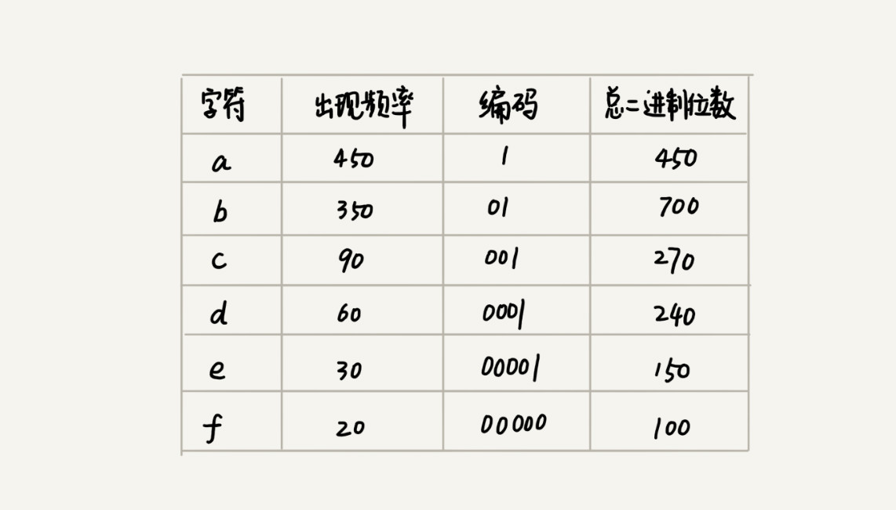

尽管霍夫曼编码的思想并不难理解，但是如何根据字符出现频率的不同，给不同的字符进行不同长度的编码呢？这里的处理稍微有些技巧。

我们把每个字符看作一个节点，并且附带着把频率放到优先级队列中。我们从队列中取出频率最小的两个节点 A、B，然后新建一个节点 C，把频率设置为两个节点的频率之和，并把这个新节点 C 作为节点 A、B 的父节点。最后再把 C 节点放入到优先级队列中。重复这个过程，直到队列中没有数据。

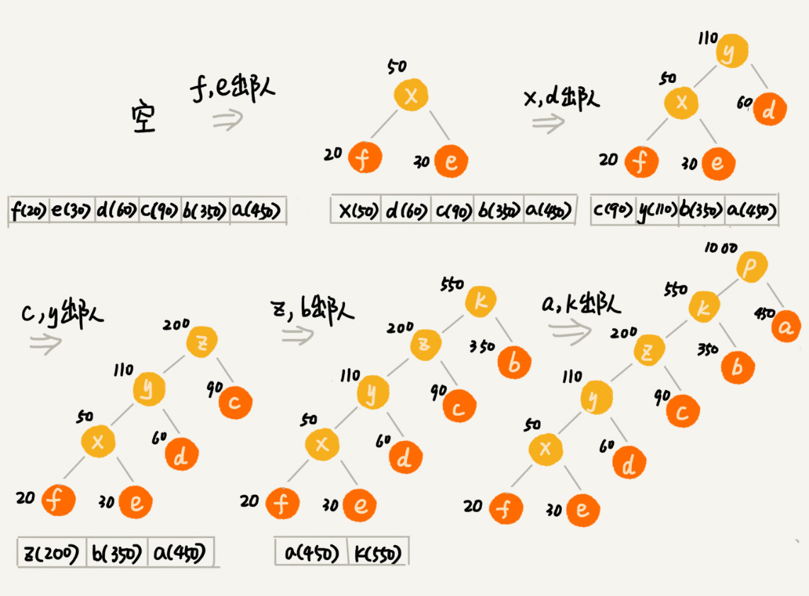

现在，我们给每一条边加上画一个权值，指向左子节点的边我们统统标记为 0，指向右子节点的边，我们统统标记为 1，那从根节点到叶节点的路径就是叶节点对应字符的霍夫曼编码。

## 内容小结

今天我们学习了贪心算法。

实际上，贪心算法适用的场景比较有限。这种算法思想更多的是指导设计基础算法。比如最小生成树算法、单源最短路径算法，这些算法都用到了贪心算法。**从我个人的学习经验来讲，不要刻意去记忆贪心算法的原理，多练习才是最有效的学习方法。**

贪心算法的最难的一块是如何将要解决的问题抽象成贪心算法模型，只要这一步搞定之后，贪心算法的编码一般都很简单。贪心算法解决问题的正确性虽然很多时候都看起来是显而易见的，但是要严谨地证明算法能够得到最优解，并不是件容易的事。所以，很多时候，我们只需要多举几个例子，看一下贪心算法的解决方案是否真的能得到最优解就可以了。

## 课后思考

在一个非负整数 a 中，我们希望从中移除 k 个数字，让剩下的数字值最小，如何选择移除哪 k 个数字呢？

假设有 n 个人等待被服务，但是服务窗口只有一个，每个人需要被服务的时间长度是不同的，如何安排被服务的先后顺序，才能让这 n 个人总的等待时间最短？

欢迎留言和我分享，也欢迎点击“请朋友读”，把今天的内容分享给你的好友，和他一起讨论、学习。

# 38 | 分治算法：谈一谈大规模计算框架MapReduce中的分治思想

王争 2018-12-19



00:00

[1.0x**](javascript:;)

讲述：修阳 大小：10.80M 时长：11:47

MapReduce 是 Google 大数据处理的三驾马车之一，另外两个是 GFS 和 Bigtable。它在倒排索引、PageRank 计算、网页分析等搜索引擎相关的技术中都有大量的应用。

尽管开发一个 MapReduce 看起来很高深，感觉跟我们遥不可及。实际上，万变不离其宗，它的本质就是我们今天要学的这种算法思想，分治算法。

## 如何理解分治算法？

为什么说 MapRedue 的本质就是分治算法呢？我们先来看，什么是分治算法？

分治算法（divide and conquer）的核心思想其实就是四个字，分而治之 ，也就是将原问题划分成 n 个规模较小，并且结构与原问题相似的子问题，递归地解决这些子问题，然后再合并其结果，就得到原问题的解。

这个定义看起来有点类似递归的定义。关于分治和递归的区别，我们在排序（下）的时候讲过，**分治算法是一种处理问题的思想，递归是一种编程技巧**。实际上，分治算法一般都比较适合用递归来实现。分治算法的递归实现中，每一层递归都会涉及这样三个操作：

分解：将原问题分解成一系列子问题；

解决：递归地求解各个子问题，若子问题足够小，则直接求解；

合并：将子问题的结果合并成原问题。

分治算法能解决的问题，一般需要满足下面这几个条件：

原问题与分解成的小问题具有相同的模式；

原问题分解成的子问题可以独立求解，子问题之间没有相关性，这一点是分治算法跟动态规划的明显区别，等我们讲到动态规划的时候，会详细对比这两种算法；

具有分解终止条件，也就是说，当问题足够小时，可以直接求解；

可以将子问题合并成原问题，而这个合并操作的复杂度不能太高，否则就起不到减小算法总体复杂度的效果了。

## 分治算法应用举例分析

理解分治算法的原理并不难，但是要想灵活应用并不容易。所以，接下来，我会带你用分治算法解决我们在讲排序的时候涉及的一个问题，加深你对分治算法的理解。

还记得我们在排序算法里讲的数据的有序度、逆序度的概念吗？我当时讲到，我们用有序度来表示一组数据的有序程度，用逆序度表示一组数据的无序程度。

假设我们有 n 个数据，我们期望数据从小到大排列，那完全有序的数据的有序度就是 n(n-1)/2，逆序度等于 0；相反，倒序排列的数据的有序度就是 0，逆序度是 n(n-1)/2。除了这两种极端情况外，我们通过计算有序对或者逆序对的个数，来表示数据的有序度或逆序度。

我现在的问题是，**如何编程求出一组数据的有序对个数或者逆序对个数呢**？因为有序对个数和逆序对个数的求解方式是类似的，所以你可以只思考逆序对个数的求解方法。

最笨的方法是，拿每个数字跟它后面的数字比较，看有几个比它小的。我们把比它小的数字个数记作 k，通过这样的方式，把每个数字都考察一遍之后，然后对每个数字对应的 k 值求和，最后得到的总和就是逆序对个数。不过，这样操作的时间复杂度是 O(n^2)。那有没有更加高效的处理方法呢？

我们用分治算法来试试。我们套用分治的思想来求数组 A 的逆序对个数。我们可以将数组分成前后两半 A1 和 A2，分别计算 A1 和 A2 的逆序对个数 K1 和 K2，然后再计算 A1 与 A2 之间的逆序对个数 K3。那数组 A 的逆序对个数就等于 K1+K2+K3。

我们前面讲过，使用分治算法其中一个要求是，子问题合并的代价不能太大，否则就起不了降低时间复杂度的效果了。那回到这个问题，如何快速计算出两个子问题 A1 与 A2 之间的逆序对个数呢？

这里就要借助归并排序算法了。你可以先试着想想，如何借助归并排序算法来解决呢？

归并排序中有一个非常关键的操作，就是将两个有序的小数组，合并成一个有序的数组。实际上，在这个合并的过程中，我们就可以计算这两个小数组的逆序对个数了。每次合并操作，我们都计算逆序对个数，把这些计算出来的逆序对个数求和，就是这个数组的逆序对个数了。

尽管我画了张图来解释，但是我个人觉得，对于工程师来说，看代码肯定更好理解一些，所以我们把这个过程翻译成了代码，你可以结合着图和文字描述一起看下。

private int num = 0; // 全局变量或者成员变量

public int count(int[] a, int n) {

  num = 0;

  mergeSortCounting(a, 0, n-1);

  return num;

}

private void mergeSortCounting(int[] a, int p, int r) {

  if (p >= r) return;

  int q = (p+r)/2;

  mergeSortCounting(a, p, q);

  mergeSortCounting(a, q+1, r);

  merge(a, p, q, r);

}

private void merge(int[] a, int p, int q, int r) {

  int i = p, j = q+1, k = 0;

  int[] tmp = new int[r-p+1];

  while (i<=q && j<=r) {

​    if (a[i] <= a[j]) {

​      tmp[k++] = a[i++];

​    } else {

​      num += (q-i+1); // 统计p-q之间，比a[j]大的元素个数

​      tmp[k++] = a[j++];

​    }

  }

  while (i <= q) { // 处理剩下的

​    tmp[k++] = a[i++];

  }

  while (j <= r) { // 处理剩下的

​    tmp[k++] = a[j++];

  }

  for (i = 0; i <= r-p; ++i) { // 从tmp拷贝回a

​    a[p+i] = tmp[i];

  }

}

有很多同学经常说，某某算法思想如此巧妙，我是怎么也想不到的。实际上，确实是的。有些算法确实非常巧妙，并不是每个人短时间都能想到的。比如这个问题，并不是每个人都能想到可以借助归并排序算法来解决，不夸张地说，如果之前没接触过，绝大部分人都想不到。但是，如果我告诉你可以借助归并排序算法来解决，那你就应该要想到如何改造归并排序，来求解这个问题了，只要你能做到这一点，我觉得就很棒了。

关于分治算法，我这还有两道比较经典的问题，你可以自己练习一下。

二维平面上有 n 个点，如何快速计算出两个距离最近的点对？

有两个 n*n 的矩阵 A，B，如何快速求解两个矩阵的乘积 C=A*B？

## 分治思想在海量数据处理中的应用

分治算法思想的应用是非常广泛的，并不仅限于指导编程和算法设计。它还经常用在海量数据处理的场景中。我们前面讲的数据结构和算法，大部分都是基于内存存储和单机处理。但是，如果要处理的数据量非常大，没法一次性放到内存中，这个时候，这些数据结构和算法就无法工作了。

比如，给 10GB 的订单文件按照金额排序这样一个需求，看似是一个简单的排序问题，但是因为数据量大，有 10GB，而我们的机器的内存可能只有 2、3GB 这样子，无法一次性加载到内存，也就无法通过单纯地使用快排、归并等基础算法来解决了。

要解决这种数据量大到内存装不下的问题，我们就可以利用分治的思想。我们可以将海量的数据集合根据某种方法，划分为几个小的数据集合，每个小的数据集合单独加载到内存来解决，然后再将小数据集合合并成大数据集合。实际上，利用这种分治的处理思路，不仅仅能克服内存的限制，还能利用多线程或者多机处理，加快处理的速度。

比如刚刚举的那个例子，给 10GB 的订单排序，我们就可以先扫描一遍订单，根据订单的金额，将 10GB 的文件划分为几个金额区间。比如订单金额为 1 到 100 元的放到一个小文件，101 到 200 之间的放到另一个文件，以此类推。这样每个小文件都可以单独加载到内存排序，最后将这些有序的小文件合并，就是最终有序的 10GB 订单数据了。

如果订单数据存储在类似 GFS 这样的分布式系统上，当 10GB 的订单被划分成多个小文件的时候，每个文件可以并行加载到多台机器上处理，最后再将结果合并在一起，这样并行处理的速度也加快了很多。不过，这里有一个点要注意，就是数据的存储与计算所在的机器是同一个或者在网络中靠的很近（比如一个局域网内，数据存取速度很快），否则就会因为数据访问的速度，导致整个处理过程不但不会变快，反而有可能变慢。

你可能还有印象，这个就是我在讲线性排序的时候举的例子。实际上，在前面已经学习的课程中，我还讲了很多利用分治思想来解决的问题。

## 解答开篇

分治算法到此就讲完了，我们现在来看下开篇的问题，为什么说 MapReduce 的本质就是分治思想？

我们刚刚举的订单的例子，数据有 10GB 大小，可能给你的感受还不强烈。那如果我们要处理的数据是 1T、10T、100T 这样子的，那一台机器处理的效率肯定是非常低的。而对于谷歌搜索引擎来说，网页爬取、清洗、分析、分词、计算权重、倒排索引等等各个环节中，都会面对如此海量的数据（比如网页）。所以，利用集群并行处理显然是大势所趋。

一台机器过于低效，那我们就把任务拆分到多台机器上来处理。如果拆分之后的小任务之间互不干扰，独立计算，最后再将结果合并。这不就是分治思想吗？

实际上，MapReduce 框架只是一个任务调度器，底层依赖 GFS 来存储数据，依赖 Borg 管理机器。它从 GFS 中拿数据，交给 Borg 中的机器执行，并且时刻监控机器执行的进度，一旦出现机器宕机、进度卡壳等，就重新从 Borg 中调度一台机器执行。

尽管 MapReduce 的模型非常简单，但是在 Google 内部应用非常广泛。它除了可以用来处理这种数据与数据之间存在关系的任务，比如 MapReduce 的经典例子，统计文件中单词出现的频率。除此之外，它还可以用来处理数据与数据之间没有关系的任务，比如对网页分析、分词等，每个网页可以独立的分析、分词，而这两个网页之间并没有关系。网页几十亿、上百亿，如果单机处理，效率低下，我们就可以利用 MapReduce 提供的高可靠、高性能、高容错的并行计算框架，并行地处理这几十亿、上百亿的网页。

## 内容小结

今天我们讲了一种应用非常广泛的算法思想，分治算法。

分治算法用四个字概括就是“分而治之”，将原问题划分成 n 个规模较小而结构与原问题相似的子问题，递归地解决这些子问题，然后再合并其结果，就得到原问题的解。这个思想非常简单、好理解。

今天我们讲了两种分治算法的典型的应用场景，一个是用来指导编码，降低问题求解的时间复杂度，另一个是解决海量数据处理问题。比如 MapReduce 本质上就是利用了分治思想。

我们也时常感叹 Google 的创新能力如此之强，总是在引领技术的发展。实际上，创新并非离我们很远，创新的源泉来自对事物本质的认识。无数优秀架构设计的思想来源都是基础的数据结构和算法，这本身就是算法的一个魅力所在。

## 课后思考

我们前面讲过的数据结构、算法、解决思路，以及举的例子中，有哪些采用了分治算法的思想呢？除此之外，生活、工作中，还有没有其他用到分治算法的地方呢？你可以自己回忆、总结一下，这对你将零散的知识提炼成体系非常有帮助。

欢迎留言和我分享，也欢迎点击“请朋友读”，把今天的内容分享给你的好友，和他一起讨论、学习。

# 39 | 回溯算法：从电影《蝴蝶效应》中学习回溯算法的核心思想

王争 2018-12-24



00:00

[1.0x**](javascript:;)

讲述：修阳 大小：8.52M 时长：09:18

我们在第 31 节提到，深度优先搜索算法利用的是回溯算法思想。这个算法思想非常简单，但是应用却非常广泛。它除了用来指导像深度优先搜索这种经典的算法设计之外，还可以用在很多实际的软件开发场景中，比如正则表达式匹配、编译原理中的语法分析等。

除此之外，很多经典的数学问题都可以用回溯算法解决，比如数独、八皇后、0-1 背包、图的着色、旅行商问题、全排列等等。既然应用如此广泛，我们今天就来学习一下这个算法思想，看看它是如何指导我们解决问题的。

## 如何理解“回溯算法”？

在我们的一生中，会遇到很多重要的岔路口。在岔路口上，每个选择都会影响我们今后的人生。有的人在每个岔路口都能做出最正确的选择，最后生活、事业都达到了一个很高的高度；而有的人一路选错，最后碌碌无为。如果人生可以量化，那如何才能在岔路口做出最正确的选择，让自己的人生“最优”呢？

我们可以借助前面学过的贪心算法，在每次面对岔路口的时候，都做出看起来最优的选择，期望这一组选择可以使得我们的人生达到“最优”。但是，我们前面也讲过，贪心算法并不一定能得到最优解。那有没有什么办法能得到最优解呢？

2004 年上映了一部非常著名的电影《蝴蝶效应》，讲的就是主人公为了达到自己的目标，一直通过回溯的方法，回到童年，在关键的岔路口，重新做选择。当然，这只是科幻电影，我们的人生是无法倒退的，但是这其中蕴含的思想其实就是回溯算法。

笼统地讲，回溯算法很多时候都应用在“搜索”这类问题上。不过这里说的搜索，并不是狭义的指我们前面讲过的图的搜索算法，而是在一组可能的解中，搜索满足期望的解。

回溯的处理思想，有点类似枚举搜索。我们枚举所有的解，找到满足期望的解。为了有规律地枚举所有可能的解，避免遗漏和重复，我们把问题求解的过程分为多个阶段。每个阶段，我们都会面对一个岔路口，我们先随意选一条路走，当发现这条路走不通的时候（不符合期望的解），就回退到上一个岔路口，另选一种走法继续走。

理论的东西还是过于抽象，老规矩，我还是举例说明一下。我举一个经典的回溯例子，我想你可能已经猜到了，那就是八皇后问题。

我们有一个 8x8 的棋盘，希望往里放 8 个棋子（皇后），每个棋子所在的行、列、对角线都不能有另一个棋子。你可以看我画的图，第一幅图是满足条件的一种方法，第二幅图是不满足条件的。八皇后问题就是期望找到所有满足这种要求的放棋子方式。

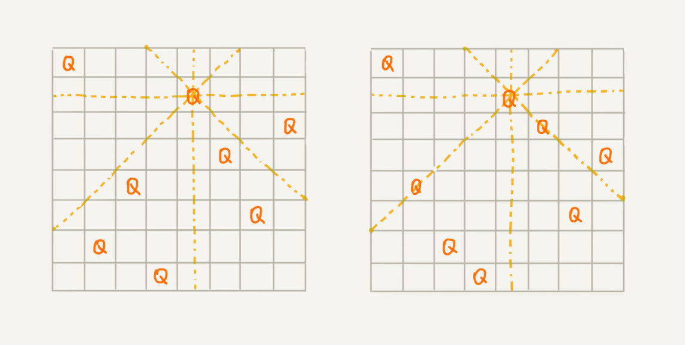

我们把这个问题划分成 8 个阶段，依次将 8 个棋子放到第一行、第二行、第三行……第八行。在放置的过程中，我们不停地检查当前放法，是否满足要求。如果满足，则跳到下一行继续放置棋子；如果不满足，那就再换一种放法，继续尝试。

回溯算法非常适合用递归代码实现，所以，我把八皇后的算法翻译成代码。我在代码里添加了详细的注释，你可以对比着看下。如果你之前没有接触过八皇后问题，建议你自己用熟悉的编程语言实现一遍，这对你理解回溯思想非常有帮助。

int[] result = new int[8];//全局或成员变量,下标表示行,值表示queen存储在哪一列

public void cal8queens(int row) { // 调用方式：cal8queens(0);

  if (row == 8) { // 8个棋子都放置好了，打印结果

​    printQueens(result);

​    return; // 8行棋子都放好了，已经没法再往下递归了，所以就return

  }

  for (int column = 0; column < 8; ++column) { // 每一行都有8中放法

​    if (isOk(row, column)) { // 有些放法不满足要求

​      result[row] = column; // 第row行的棋子放到了column列

​      cal8queens(row+1); // 考察下一行

​    }

  }

}

private boolean isOk(int row, int column) {//判断row行column列放置是否合适

  int leftup = column - 1, rightup = column + 1;

  for (int i = row-1; i >= 0; --i) { // 逐行往上考察每一行

​    if (result[i] == column) return false; // 第i行的column列有棋子吗？

​    if (leftup >= 0) { // 考察左上对角线：第i行leftup列有棋子吗？

​      if (result[i] == leftup) return false;

​    }

​    if (rightup < 8) { // 考察右上对角线：第i行rightup列有棋子吗？

​      if (result[i] == rightup) return false;

​    }

​    --leftup; ++rightup;

  }

  return true;

}

private void printQueens(int[] result) { // 打印出一个二维矩阵

  for (int row = 0; row < 8; ++row) {

​    for (int column = 0; column < 8; ++column) {

​      if (result[row] == column) System.out.print("Q ");

​      else System.out.print("* ");

​    }

​    System.out.println();

  }

  System.out.println();

}

## 两个回溯算法的经典应用

回溯算法的理论知识很容易弄懂。不过，对于新手来说，比较难的是用递归来实现。所以，我们再通过两个例子，来练习一下回溯算法的应用和实现。

### 1.0-1 背包

0-1 背包是非常经典的算法问题，很多场景都可以抽象成这个问题模型。这个问题的经典解法是动态规划，不过还有一种简单但没有那么高效的解法，那就是今天讲的回溯算法。动态规划的解法我下一节再讲，我们先来看下，如何用回溯法解决这个问题。

0-1 背包问题有很多变体，我这里介绍一种比较基础的。我们有一个背包，背包总的承载重量是 Wkg。现在我们有 n 个物品，每个物品的重量不等，并且不可分割。我们现在期望选择几件物品，装载到背包中。在不超过背包所能装载重量的前提下，如何让背包中物品的总重量最大？

实际上，背包问题我们在贪心算法那一节，已经讲过一个了，不过那里讲的物品是可以分割的，我可以装某个物品的一部分到背包里面。今天讲的这个背包问题，物品是不可分割的，要么装要么不装，所以叫 0-1 背包问题。显然，这个问题已经无法通过贪心算法来解决了。我们现在来看看，用回溯算法如何来解决。

对于每个物品来说，都有两种选择，装进背包或者不装进背包。对于 n 个物品来说，总的装法就有 2^n 种，去掉总重量超过 Wkg 的，从剩下的装法中选择总重量最接近 Wkg 的。不过，我们如何才能不重复地穷举出这 2^n 种装法呢？

这里就可以用回溯的方法。我们可以把物品依次排列，整个问题就分解为了 n 个阶段，每个阶段对应一个物品怎么选择。先对第一个物品进行处理，选择装进去或者不装进去，然后再递归地处理剩下的物品。描述起来很费劲，我们直接看代码，反而会更加清晰一些。

这里还稍微用到了一点搜索剪枝的技巧，就是当发现已经选择的物品的重量超过 Wkg 之后，我们就停止继续探测剩下的物品。你可以看我写的具体的代码。

public int maxW = Integer.MIN_VALUE; //存储背包中物品总重量的最大值

// cw表示当前已经装进去的物品的重量和；i表示考察到哪个物品了；

// w背包重量；items表示每个物品的重量；n表示物品个数

// 假设背包可承受重量100，物品个数10，物品重量存储在数组a中，那可以这样调用函数：

// f(0, 0, a, 10, 100)

public void f(int i, int cw, int[] items, int n, int w) {

  if (cw == w || i == n) { // cw==w表示装满了;i==n表示已经考察完所有的物品

​    if (cw > maxW) maxW = cw;

​    return;

  }

  f(i+1, cw, items, n, w);

  if (cw + items[i] <= w) {// 已经超过可以背包承受的重量的时候，就不要再装了

​    f(i+1,cw + items[i], items, n, w);

  }

}

### 2. 正则表达式

看懂了 0-1 背包问题，我们再来看另外一个例子，正则表达式匹配。

对于一个开发工程师来说，正则表达式你应该不陌生吧？在平时的开发中，或多或少都应该用过。实际上，正则表达式里最重要的一种算法思想就是回溯。

正则表达式中，最重要的就是通配符，通配符结合在一起，可以表达非常丰富的语义。为了方便讲解，我假设正则表达式中只包含“*”和“?”这两种通配符，并且对这两个通配符的语义稍微做些改变，其中，“*”匹配任意多个（大于等于 0 个）任意字符，“?”匹配零个或者一个任意字符。基于以上背景假设，我们看下，如何用回溯算法，判断一个给定的文本，能否跟给定的正则表达式匹配？

我们依次考察正则表达式中的每个字符，当是非通配符时，我们就直接跟文本的字符进行匹配，如果相同，则继续往下处理；如果不同，则回溯。

如果遇到特殊字符的时候，我们就有多种处理方式了，也就是所谓的岔路口，比如“*”有多种匹配方案，可以匹配任意个文本串中的字符，我们就先随意的选择一种匹配方案，然后继续考察剩下的字符。如果中途发现无法继续匹配下去了，我们就回到这个岔路口，重新选择一种匹配方案，然后再继续匹配剩下的字符。

有了前面的基础，是不是这个问题就好懂多了呢？我把这个过程翻译成了代码，你可以结合着一块看下，应该有助于你理解。

public class Pattern {

  private boolean matched = false;

  private char[] pattern; // 正则表达式

  private int plen; // 正则表达式长度

  public Pattern(char[] pattern, int plen) {

​    this.pattern = pattern;

​    this.plen = plen;

  }

  public boolean match(char[] text, int tlen) { // 文本串及长度

​    matched = false;

​    rmatch(0, 0, text, tlen);

​    return matched;

  }

  private void rmatch(int ti, int pj, char[] text, int tlen) {

​    if (matched) return; // 如果已经匹配了，就不要继续递归了

​    if (pj == plen) { // 正则表达式到结尾了

​      if (ti == tlen) matched = true; // 文本串也到结尾了

​      return;

​    }

​    if (pattern[pj] == '*') { // *匹配任意个字符

​      for (int k = 0; k <= tlen-ti; ++k) {

​        rmatch(ti+k, pj+1, text, tlen);

​      }

​    } else if (pattern[pj] == '?') { // ?匹配0个或者1个字符

​      rmatch(ti, pj+1, text, tlen);

​      rmatch(ti+1, pj+1, text, tlen);

​    } else if (ti < tlen && pattern[pj] == text[ti]) { // 纯字符匹配才行

​      rmatch(ti+1, pj+1, text, tlen);

​    }

  }

}

## 内容小结

回溯算法的思想非常简单，大部分情况下，都是用来解决广义的搜索问题，也就是，从一组可能的解中，选择出一个满足要求的解。回溯算法非常适合用递归来实现，在实现的过程中，剪枝操作是提高回溯效率的一种技巧。利用剪枝，我们并不需要穷举搜索所有的情况，从而提高搜索效率。

尽管回溯算法的原理非常简单，但是却可以解决很多问题，比如我们开头提到的深度优先搜索、八皇后、0-1 背包问题、图的着色、旅行商问题、数独、全排列、正则表达式匹配等等。如果感兴趣的话，你可以自己搜索研究一下，最好还能用代码实现一下。如果这几个问题都能实现的话，你基本就掌握了回溯算法。

## 课后思考

现在我们对今天讲到的 0-1 背包问题稍加改造，如果每个物品不仅重量不同，价值也不同。如何在不超过背包重量的情况下，让背包中的总价值最大？

欢迎留言和我分享，也欢迎点击“请朋友读”，把今天的内容分享给你的好友，和他一起讨论、学习。

# 40 | 初识动态规划：如何巧妙解决“双十一”购物时的凑单问题？

王争 2018-12-26



00:00

[1.0x**](javascript:;)

讲述：修阳 大小：15.04M 时长：16:25

淘宝的“双十一”购物节有各种促销活动，比如“满 200 元减 50 元”。假设你女朋友的购物车中有 n 个（n>100）想买的商品，她希望从里面选几个，在凑够满减条件的前提下，让选出来的商品价格总和最大程度地接近满减条件（200 元），这样就可以极大限度地“薅羊毛”。作为程序员的你，能不能编个代码来帮她搞定呢？

要想高效地解决这个问题，就要用到我们今天讲的动态规划（Dynamic Programming）。

## 动态规划学习路线

动态规划比较适合用来求解最优问题，比如求最大值、最小值等等。它可以非常显著地降低时间复杂度，提高代码的执行效率。不过，它也是出了名的难学。它的主要学习难点跟递归类似，那就是，求解问题的过程不太符合人类常规的思维方式。对于新手来说，要想入门确实不容易。不过，等你掌握了之后，你会发现，实际上并没有想象中那么难。

为了让你更容易理解动态规划，我分了三节给你讲解。这三节分别是，初识动态规划、动态规划理论、动态规划实战。

第一节，我会通过两个非常经典的动态规划问题模型，向你展示我们为什么需要动态规划，以及动态规划解题方法是如何演化出来的。实际上，你只要掌握了这两个例子的解决思路，对于其他很多动态规划问题，你都可以套用类似的思路来解决。

第二节，我会总结动态规划适合解决的问题的特征，以及动态规划解题思路。除此之外，我还会将贪心、分治、回溯、动态规划这四种算法思想放在一起，对比分析它们各自的特点以及适用的场景。

第三节，我会教你应用第二节讲的动态规划理论知识，实战解决三个非常经典的动态规划问题，加深你对理论的理解。弄懂了这三节中的例子，对于动态规划这个知识点，你就算是入门了。

## 0-1 背包问题

我在讲贪心算法、回溯算法的时候，多次讲到背包问题。今天，我们依旧拿这个问题来举例。

对于一组不同重量、不可分割的物品，我们需要选择一些装入背包，在满足背包最大重量限制的前提下，背包中物品总重量的最大值是多少呢？

关于这个问题，我们上一节讲了回溯的解决方法，也就是穷举搜索所有可能的装法，然后找出满足条件的最大值。不过，回溯算法的复杂度比较高，是指数级别的。那有没有什么规律，可以有效降低时间复杂度呢？我们一起来看看。

// 回溯算法实现。注意：我把输入的变量都定义成了成员变量。

private int maxW = Integer.MIN_VALUE; // 结果放到maxW中

private int[] weight = {2，2，4，6，3};  // 物品重量

private int n = 5; // 物品个数

private int w = 9; // 背包承受的最大重量

public void f(int i, int cw) { // 调用f(0, 0)

  if (cw == w || i == n) { // cw==w表示装满了，i==n表示物品都考察完了

​    if (cw > maxW) maxW = cw;

​    return;

  }

  f(i+1, cw); // 选择不装第i个物品

  if (cw + weight[i] <= w) {

​    f(i+1,cw + weight[i]); // 选择装第i个物品

  }

}

规律是不是不好找？那我们就举个例子、画个图看看。我们假设背包的最大承载重量是 9。我们有 5 个不同的物品，每个物品的重量分别是 2，2，4，6，3。如果我们把这个例子的回溯求解过程，用递归树画出来，就是下面这个样子：

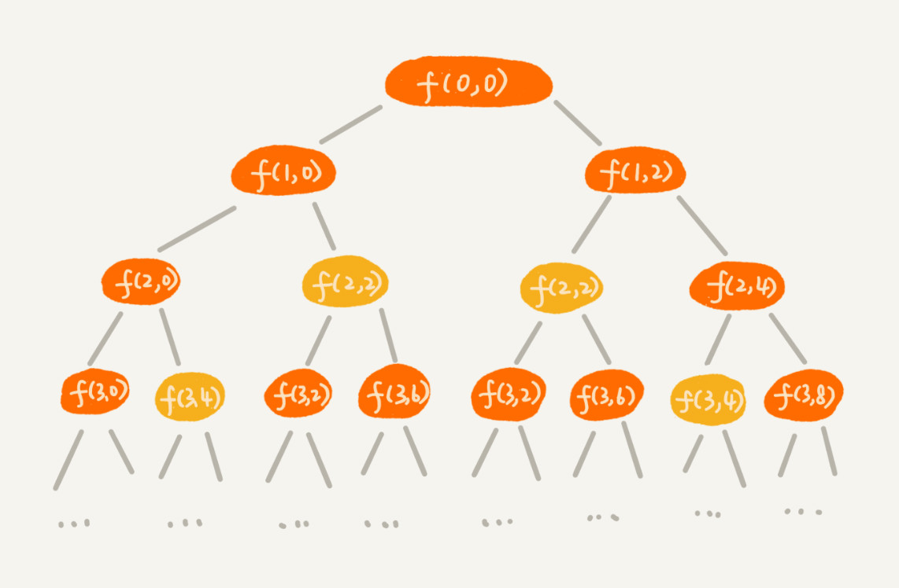

递归树中的每个节点表示一种状态，我们用（i, cw）来表示。其中，i 表示将要决策第几个物品是否装入背包，cw 表示当前背包中物品的总重量。比如，（2，2）表示我们将要决策第 2 个物品是否装入背包，在决策前，背包中物品的总重量是 2。

从递归树中，你应该能会发现，有些子问题的求解是重复的，比如图中 f(2, 2) 和 f(3,4) 都被重复计算了两次。我们可以借助递归那一节讲的“备忘录”的解决方式，记录已经计算好的 f(i, cw)，当再次计算到重复的 f(i, cw) 的时候，可以直接从备忘录中取出来用，就不用再递归计算了，这样就可以避免冗余计算。

private int maxW = Integer.MIN_VALUE; // 结果放到maxW中

private int[] weight = {2，2，4，6，3};  // 物品重量

private int n = 5; // 物品个数

private int w = 9; // 背包承受的最大重量

private boolean[][] mem = new boolean[5][10]; // 备忘录，默认值false

public void f(int i, int cw) { // 调用f(0, 0)

  if (cw == w || i == n) { // cw==w表示装满了，i==n表示物品都考察完了

​    if (cw > maxW) maxW = cw;

​    return;

  }

  if (mem[i][cw]) return; // 重复状态

  mem[i][cw] = true; // 记录(i, cw)这个状态

  f(i+1, cw); // 选择不装第i个物品

  if (cw + weight[i] <= w) {

​    f(i+1,cw + weight[i]); // 选择装第i个物品

  }

}

这种解决方法非常好。实际上，它已经跟动态规划的执行效率基本上没有差别。但是，多一种方法就多一种解决思路，我们现在来看看动态规划是怎么做的。

我们把整个求解过程分为 n 个阶段，每个阶段会决策一个物品是否放到背包中。每个物品决策（放入或者不放入背包）完之后，背包中的物品的重量会有多种情况，也就是说，会达到多种不同的状态，对应到递归树中，就是有很多不同的节点。

我们把每一层重复的状态（节点）合并，只记录不同的状态，然后基于上一层的状态集合，来推导下一层的状态集合。我们可以通过合并每一层重复的状态，这样就保证每一层不同状态的个数都不会超过 w 个（w 表示背包的承载重量），也就是例子中的 9。于是，我们就成功避免了每层状态个数的指数级增长。

我们用一个二维数组 states[n][w+1]，来记录每层可以达到的不同状态。

第 0 个（下标从 0 开始编号）物品的重量是 2，要么装入背包，要么不装入背包，决策完之后，会对应背包的两种状态，背包中物品的总重量是 0 或者 2。我们用 states[0][0]=true 和 states[0][2]=true 来表示这两种状态。

第 1 个物品的重量也是 2，基于之前的背包状态，在这个物品决策完之后，不同的状态有 3 个，背包中物品总重量分别是 0(0+0)，2(0+2 or 2+0)，4(2+2)。我们用 states[1][0]=true，states[1][2]=true，states[1][4]=true 来表示这三种状态。

以此类推，直到考察完所有的物品后，整个 states 状态数组就都计算好了。我把整个计算的过程画了出来，你可以看看。图中 0 表示 false，1 表示 true。我们只需要在最后一层，找一个值为 true 的最接近 w（这里是 9）的值，就是背包中物品总重量的最大值。

文字描述可能还不够清楚。我把上面的过程，翻译成代码，你可以结合着一块看下。

weight:物品重量，n:物品个数，w:背包可承载重量

public int knapsack(int[] weight, int n, int w) {

  boolean[][] states = new boolean[n][w+1]; // 默认值false

  states[0][0] = true;  // 第一行的数据要特殊处理，可以利用哨兵优化

  if (weight[0] <= w) {

​    states[0][weight[0]] = true;

  }

  for (int i = 1; i < n; ++i) { // 动态规划状态转移

​    for (int j = 0; j <= w; ++j) {// 不把第i个物品放入背包

​      if (states[i-1][j] == true) states[i][j] = states[i-1][j];

​    }

​    for (int j = 0; j <= w-weight[i]; ++j) {//把第i个物品放入背包

​      if (states[i-1][j]==true) states[i][j+weight[i]] = true;

​    }

  }

  for (int i = w; i >= 0; --i) { // 输出结果

​    if (states[n-1][i] == true) return i;

  }

  return 0;

}

实际上，这就是一种用动态规划解决问题的思路。我们把问题分解为多个阶段，每个阶段对应一个决策。我们记录每一个阶段可达的状态集合（去掉重复的），然后通过当前阶段的状态集合，来推导下一个阶段的状态集合，动态地往前推进。这也是动态规划这个名字的由来，你可以自己体会一下，是不是还挺形象的？

前面我们讲到，用回溯算法解决这个问题的时间复杂度 O(2^n)，是指数级的。那动态规划解决方案的时间复杂度是多少呢？我来分析一下。

这个代码的时间复杂度非常好分析，耗时最多的部分就是代码中的两层 for 循环，所以时间复杂度是 O(n*w)。n 表示物品个数，w 表示背包可以承载的总重量。

从理论上讲，指数级的时间复杂度肯定要比 O(n*w) 高很多，但是为了让你有更加深刻的感受，我来举一个例子给你比较一下。

我们假设有 10000 个物品，重量分布在 1 到 15000 之间，背包可以承载的总重量是 30000。如果我们用回溯算法解决，用具体的数值表示出时间复杂度，就是 2^10000，这是一个相当大的一个数字。如果我们用动态规划解决，用具体的数值表示出时间复杂度，就是 10000*30000。虽然看起来也很大，但是和 2^10000 比起来，要小太多了。

尽管动态规划的执行效率比较高，但是就刚刚的代码实现来说，我们需要额外申请一个 n 乘以 w+1 的二维数组，对空间的消耗比较多。所以，有时候，我们会说，动态规划是一种空间换时间的解决思路。你可能要问了，有什么办法可以降低空间消耗吗？

实际上，我们只需要一个大小为 w+1 的一维数组就可以解决这个问题。动态规划状态转移的过程，都可以基于这个一维数组来操作。具体的代码实现我贴在这里，你可以仔细看下。

public static int knapsack2(int[] items, int n, int w) {

  boolean[] states = new boolean[w+1]; // 默认值false

  states[0] = true;  // 第一行的数据要特殊处理，可以利用哨兵优化

  if (items[0] <= w) {

​    states[items[0]] = true;

  }

  for (int i = 1; i < n; ++i) { // 动态规划

​    for (int j = w-items[i]; j >= 0; --j) {//把第i个物品放入背包

​      if (states[j]==true) states[j+items[i]] = true;

​    }

  }

  for (int i = w; i >= 0; --i) { // 输出结果

​    if (states[i] == true) return i;

  }

  return 0;

}

这里我特别强调一下代码中的第 8 行，j 需要从大到小来处理。如果我们按照 j 从小到大处理的话，会出现 for 循环重复计算的问题。你可以自己想一想，这里我就不详细说了。

## 0-1 背包问题升级版

我们继续升级难度。我改造了一下刚刚的背包问题。你看这个问题又该如何用动态规划解决？

我们刚刚讲的背包问题，只涉及背包重量和物品重量。我们现在引入物品价值这一变量。对于一组不同重量、不同价值、不可分割的物品，我们选择将某些物品装入背包，在满足背包最大重量限制的前提下，背包中可装入物品的总价值最大是多少呢？

这个问题依旧可以用回溯算法来解决。这个问题并不复杂，所以具体的实现思路，我就不用文字描述了，直接给你看代码。

private int maxV = Integer.MIN_VALUE; // 结果放到maxV中

private int[] items = {2，2，4，6，3};  // 物品的重量

private int[] value = {3，4，8，9，6}; // 物品的价值

private int n = 5; // 物品个数

private int w = 9; // 背包承受的最大重量

public void f(int i, int cw, int cv) { // 调用f(0, 0, 0)

  if (cw == w || i == n) { // cw==w表示装满了，i==n表示物品都考察完了

​    if (cv > maxV) maxV = cv;

​    return;

  }

  f(i+1, cw, cv); // 选择不装第i个物品

  if (cw + weight[i] <= w) {

​    f(i+1,cw+weight[i], cv+value[i]); // 选择装第i个物品

  }

}

针对上面的代码，我们还是照例画出递归树。在递归树中，每个节点表示一个状态。现在我们需要 3 个变量（i, cw, cv）来表示一个状态。其中，i 表示即将要决策第 i 个物品是否装入背包，cw 表示当前背包中物品的总重量，cv 表示当前背包中物品的总价值。

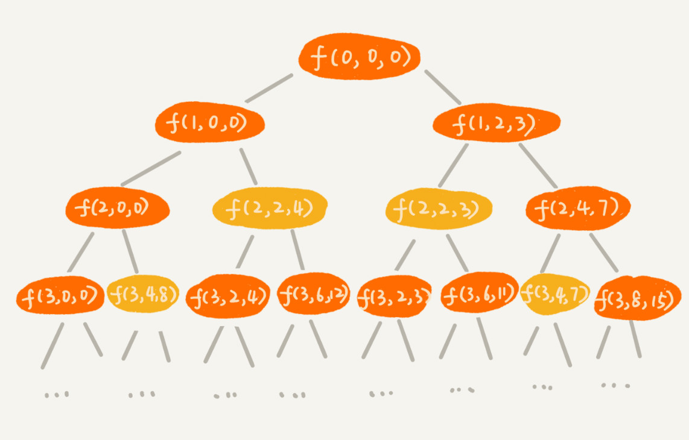

我们发现，在递归树中，有几个节点的 i 和 cw 是完全相同的，比如 f(2,2,4) 和 f(2,2,3)。在背包中物品总重量一样的情况下，f(2,2,4) 这种状态对应的物品总价值更大，我们可以舍弃 f(2,2,3) 这种状态，只需要沿着 f(2,2,4) 这条决策路线继续往下决策就可以。

也就是说，对于 (i, cw) 相同的不同状态，那我们只需要保留 cv 值最大的那个，继续递归处理，其他状态不予考虑。

思路说完了，但是代码如何实现呢？如果用回溯算法，这个问题就没法再用“备忘录”解决了。所以，我们就需要换一种思路，看看动态规划是不是更容易解决这个问题？

我们还是把整个求解过程分为 n 个阶段，每个阶段会决策一个物品是否放到背包中。每个阶段决策完之后，背包中的物品的总重量以及总价值，会有多种情况，也就是会达到多种不同的状态。

我们用一个二维数组 states[n][w+1]，来记录每层可以达到的不同状态。不过这里数组存储的值不再是 boolean 类型的了，而是当前状态对应的最大总价值。我们把每一层中 (i, cw) 重复的状态（节点）合并，只记录 cv 值最大的那个状态，然后基于这些状态来推导下一层的状态。

我们把这个动态规划的过程翻译成代码，就是下面这个样子：

public static int knapsack3(int[] weight, int[] value, int n, int w) {

  int[][] states = new int[n][w+1];

  for (int i = 0; i < n; ++i) { // 初始化states

​    for (int j = 0; j < w+1; ++j) {

​      states[i][j] = -1;

​    }

  }

  states[0][0] = 0;

  if (weight[0] <= w) {

​    states[0][weight[0]] = value[0];

  }

  for (int i = 1; i < n; ++i) { //动态规划，状态转移

​    for (int j = 0; j <= w; ++j) { // 不选择第i个物品

​      if (states[i-1][j] >= 0) states[i][j] = states[i-1][j];

​    }

​    for (int j = 0; j <= w-weight[i]; ++j) { // 选择第i个物品

​      if (states[i-1][j] >= 0) {

​        int v = states[i-1][j] + value[i];

​        if (v > states[i][j+weight[i]]) {

​          states[i][j+weight[i]] = v;

​        }

​      }

​    }

  }

  // 找出最大值

  int maxvalue = -1;

  for (int j = 0; j <= w; ++j) {

​    if (states[n-1][j] > maxvalue) maxvalue = states[n-1][j];

  }

  return maxvalue;

}

关于这个问题的时间、空间复杂度的分析，跟上一个例子大同小异，所以我就不赘述了。我直接给出答案，时间复杂度是 O(n*w)，空间复杂度也是 O(n*w)。跟上一个例子类似，空间复杂度也是可以优化的，你可以自己写一下。

## 解答开篇

掌握了今天讲的两个问题之后，你是不是觉得，开篇的问题很简单？

对于这个问题，你当然可以利用回溯算法，穷举所有的排列组合，看大于等于 200 并且最接近 200 的组合是哪一个？但是，这样效率太低了点，时间复杂度非常高，是指数级的。当 n 很大的时候，可能“双十一”已经结束了，你的代码还没有运行出结果，这显然会让你在女朋友心中的形象大大减分。

实际上，它跟第一个例子中讲的 0-1 背包问题很像，只不过是把“重量”换成了“价格”而已。购物车中有 n 个商品。我们针对每个商品都决策是否购买。每次决策之后，对应不同的状态集合。我们还是用一个二维数组 states[n][x]，来记录每次决策之后所有可达的状态。不过，这里的 x 值是多少呢？

0-1 背包问题中，我们找的是小于等于 w 的最大值，x 就是背包的最大承载重量 w+1。对于这个问题来说，我们要找的是大于等于 200（满减条件）的值中最小的，所以就不能设置为 200 加 1 了。就这个实际的问题而言，如果要购买的物品的总价格超过 200 太多，比如 1000，那这个羊毛“薅”得就没有太大意义了。所以，我们可以限定 x 值为 1001。

不过，这个问题不仅要求大于等于 200 的总价格中的最小的，我们还要找出这个最小总价格对应都要购买哪些商品。实际上，我们可以利用 states 数组，倒推出这个被选择的商品序列。我先把代码写出来，待会再照着代码给你解释。

// items商品价格，n商品个数, w表示满减条件，比如200

public static void double11advance(int[] items, int n, int w) {

  boolean[][] states = new boolean[n][3*w+1];//超过3倍就没有薅羊毛的价值了

  states[0][0] = true;  // 第一行的数据要特殊处理

  if (items[0] <= 3*w) {

​    states[0][items[0]] = true;

  }

  for (int i = 1; i < n; ++i) { // 动态规划

​    for (int j = 0; j <= 3*w; ++j) {// 不购买第i个商品

​      if (states[i-1][j] == true) states[i][j] = states[i-1][j];

​    }

​    for (int j = 0; j <= 3*w-items[i]; ++j) {//购买第i个商品

​      if (states[i-1][j]==true) states[i][j+items[i]] = true;

​    }

  }

  int j;

  for (j = w; j < 3*w+1; ++j) { 

​    if (states[n-1][j] == true) break; // 输出结果大于等于w的最小值

  }

  if (j == 3*w+1) return; // 没有可行解

  for (int i = n-1; i >= 1; --i) { // i表示二维数组中的行，j表示列

​    if(j-items[i] >= 0 && states[i-1][j-items[i]] == true) {

​      System.out.print(items[i] + " "); // 购买这个商品

​      j = j - items[i];

​    } // else 没有购买这个商品，j不变。

  }

  if (j != 0) System.out.print(items[0]);

}

代码的前半部分跟 0-1 背包问题没有什么不同，我们着重看后半部分，看它是如何打印出选择购买哪些商品的。

状态 (i, j) 只有可能从 (i-1, j) 或者 (i-1, j-value[i]) 两个状态推导过来。所以，我们就检查这两个状态是否是可达的，也就是 states[i-1][j]或者 states[i-1][j-value[i]]是否是 true。

如果 states[i-1][j]可达，就说明我们没有选择购买第 i 个商品，如果 states[i-1][j-value[i]]可达，那就说明我们选择了购买第 i 个商品。我们从中选择一个可达的状态（如果两个都可达，就随意选择一个），然后，继续迭代地考察其他商品是否有选择购买。

## 内容小结

动态规划的第一节到此就讲完了。内容比较多，你可能需要多一点时间来消化。为了帮助你有的放矢地学习，我来强调一下，今天你应该掌握的重点内容。

今天的内容不涉及动态规划的理论，我通过两个例子，给你展示了动态规划是如何解决问题的，并且一点一点详细给你讲解了动态规划解决问题的思路。这两个例子都是非常经典的动态规划问题，只要你真正搞懂这两个问题，基本上动态规划已经入门一半了。所以，你要多花点时间，真正弄懂这两个问题。

从例子中，你应该能发现，大部分动态规划能解决的问题，都可以通过回溯算法来解决，只不过回溯算法解决起来效率比较低，时间复杂度是指数级的。动态规划算法，在执行效率方面，要高很多。尽管执行效率提高了，但是动态规划的空间复杂度也提高了，所以，很多时候，我们会说，动态规划是一种空间换时间的算法思想。

我前面也说了，今天的内容并不涉及理论的知识。这两个例子的分析过程，我并没有涉及任何高深的理论方面的东西。而且，我个人觉得，贪心、分治、回溯、动态规划，这四个算法思想有关的理论知识，大部分都是“后验性”的，也就是说，在解决问题的过程中，我们往往是先想到如何用某个算法思想解决问题，然后才用算法理论知识，去验证这个算法思想解决问题的正确性。所以，你大可不必过于急于寻求动态规划的理论知识。

## 课后思考

“杨辉三角”不知道你听说过吗？我们现在对它进行一些改造。每个位置的数字可以随意填写，经过某个数字只能到达下面一层相邻的两个数字。

假设你站在第一层，往下移动，我们把移动到最底层所经过的所有数字之和，定义为路径的长度。请你编程求出从最高层移动到最底层的最短路径长度。

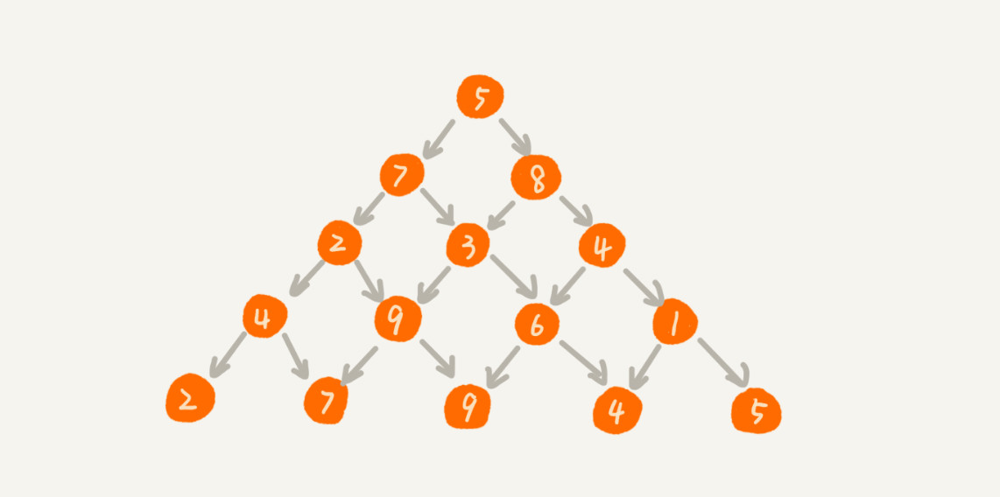

欢迎留言和我分享，也欢迎点击“请朋友读”，把今天的内容分享给你的好友，和他一起讨论、学习。

# 41 | 动态规划理论：一篇文章带你彻底搞懂最优子结构、无后效性和重复子问题

王争 2018-12-31



00:00

[1.0x**](javascript:;)

讲述：修阳 大小：15.01M 时长：16:23

上一节，我通过两个非常经典的问题，向你展示了用动态规划解决问题的过程。现在你对动态规划应该有了一个初步的认识。

今天，我主要讲动态规划的一些理论知识。学完这节内容，可以帮你解决这样几个问题：什么样的问题可以用动态规划解决？解决动态规划问题的一般思考过程是什么样的？贪心、分治、回溯、动态规划这四种算法思想又有什么区别和联系？

理论的东西都比较抽象，不过你不用担心，我会结合具体的例子来讲解，争取让你这次就能真正理解这些知识点，也为后面的应用和实战做好准备。

## “一个模型三个特征”理论讲解

什么样的问题适合用动态规划来解决呢？换句话说，动态规划能解决的问题有什么规律可循呢？实际上，动态规划作为一个非常成熟的算法思想，很多人对此已经做了非常全面的总结。我把这部分理论总结为“一个模型三个特征”。

首先，我们来看，什么是“**一个模型**”？它指的是动态规划适合解决的问题的模型。我把这个模型定义为“**多阶段决策最优解模型**”。下面我具体来给你讲讲。

我们一般是用动态规划来解决最优问题。而解决问题的过程，需要经历多个决策阶段。每个决策阶段都对应着一组状态。然后我们寻找一组决策序列，经过这组决策序列，能够产生最终期望求解的最优值。

现在，我们再来看，什么是“**三个特征**”？它们分别是**最优子结构**、**无后效性**和**重复子问题**。这三个概念比较抽象，我来逐一详细解释一下。

### 1. 最优子结构

最优子结构指的是，问题的最优解包含子问题的最优解。反过来说就是，我们可以通过子问题的最优解，推导出问题的最优解。如果我们把最优子结构，对应到我们前面定义的动态规划问题模型上，那我们也可以理解为，后面阶段的状态可以通过前面阶段的状态推导出来。

### 2. 无后效性

无后效性有两层含义，第一层含义是，在推导后面阶段的状态的时候，我们只关心前面阶段的状态值，不关心这个状态是怎么一步一步推导出来的。第二层含义是，某阶段状态一旦确定，就不受之后阶段的决策影响。无后效性是一个非常“宽松”的要求。只要满足前面提到的动态规划问题模型，其实基本上都会满足无后效性。

### 3. 重复子问题

这个概念比较好理解。前面一节，我已经多次提过。如果用一句话概括一下，那就是，不同的决策序列，到达某个相同的阶段时，可能会产生重复的状态。

## “一个模型三个特征”实例剖析

“一个模型三个特征”这部分是理论知识，比较抽象，你看了之后可能还是有点懵，有种似懂非懂的感觉，没关系，这个很正常。接下来，我结合一个具体的动态规划问题，来给你详细解释。

假设我们有一个 n 乘以 n 的矩阵 w[n][n]。矩阵存储的都是正整数。棋子起始位置在左上角，终止位置在右下角。我们将棋子从左上角移动到右下角。每次只能向右或者向下移动一位。从左上角到右下角，会有很多不同的路径可以走。我们把每条路径经过的数字加起来看作路径的长度。那从左上角移动到右下角的最短路径长度是多少呢？

我们先看看，这个问题是否符合“一个模型”？

从 (0, 0) 走到 (n-1, n-1)，总共要走 2*(n-1) 步，也就对应着 2*(n-1) 个阶段。每个阶段都有向右走或者向下走两种决策，并且每个阶段都会对应一个状态集合。

我们把状态定义为 min_dist(i, j)，其中 i 表示行，j 表示列。min_dist 表达式的值表示从 (0, 0) 到达 (i, j) 的最短路径长度。所以，这个问题是一个多阶段决策最优解问题，符合动态规划的模型。

我们再来看，这个问题是否符合“三个特征”？

我们可以用回溯算法来解决这个问题。如果你自己写一下代码，画一下递归树，就会发现，递归树中有重复的节点。重复的节点表示，从左上角到节点对应的位置，有多种路线，这也能说明这个问题中存在重复子问题。

如果我们走到 (i, j) 这个位置，我们只能通过 (i-1, j)，(i, j-1) 这两个位置移动过来，也就是说，我们想要计算 (i, j) 位置对应的状态，只需要关心 (i-1, j)，(i, j-1) 两个位置对应的状态，并不关心棋子是通过什么样的路线到达这两个位置的。而且，我们仅仅允许往下和往右移动，不允许后退，所以，前面阶段的状态确定之后，不会被后面阶段的决策所改变，所以，这个问题符合“无后效性”这一特征。

刚刚定义状态的时候，我们把从起始位置 (0, 0) 到 (i, j) 的最小路径，记作 min_dist(i, j)。因为我们只能往右或往下移动，所以，我们只有可能从 (i, j-1) 或者 (i-1, j) 两个位置到达 (i, j)。也就是说，到达 (i, j) 的最短路径要么经过 (i, j-1)，要么经过 (i-1, j)，而且到达 (i, j) 的最短路径肯定包含到达这两个位置的最短路径之一。换句话说就是，min_dist(i, j) 可以通过 min_dist(i, j-1) 和 min_dist(i-1, j) 两个状态推导出来。这就说明，这个问题符合“最优子结构”。

min_dist(i, j) = w[i][j] + min(min_dist(i, j-1), min_dist(i-1, j))

## 两种动态规划解题思路总结

刚刚我讲了，如何鉴别一个问题是否可以用动态规划来解决。现在，我再总结一下，动态规划解题的一般思路，让你面对动态规划问题的时候，能够有章可循，不至于束手无策。

我个人觉得，解决动态规划问题，一般有两种思路。我把它们分别叫作，状态转移表法和状态转移方程法。

### 1. 状态转移表法

一般能用动态规划解决的问题，都可以使用回溯算法的暴力搜索解决。所以，当我们拿到问题的时候，我们可以先用简单的回溯算法解决，然后定义状态，每个状态表示一个节点，然后对应画出递归树。从递归树中，我们很容易可以看出来，是否存在重复子问题，以及重复子问题是如何产生的。以此来寻找规律，看是否能用动态规划解决。

找到重复子问题之后，接下来，我们有两种处理思路，第一种是直接用**回溯加“备忘录”**的方法，来避免重复子问题。从执行效率上来讲，这跟动态规划的解决思路没有差别。第二种是使用动态规划的解决方法，**状态转移表法**。第一种思路，我就不讲了，你可以看看上一节的两个例子。我们重点来看状态转移表法是如何工作的。

我们先画出一个状态表。状态表一般都是二维的，所以你可以把它想象成二维数组。其中，每个状态包含三个变量，行、列、数组值。我们根据决策的先后过程，从前往后，根据递推关系，分阶段填充状态表中的每个状态。最后，我们将这个递推填表的过程，翻译成代码，就是动态规划代码了。

尽管大部分状态表都是二维的，但是如果问题的状态比较复杂，需要很多变量来表示，那对应的状态表可能就是高维的，比如三维、四维。那这个时候，我们就不适合用状态转移表法来解决了。一方面是因为高维状态转移表不好画图表示，另一方面是因为人脑确实很不擅长思考高维的东西。

现在，我们来看一下，如何套用这个状态转移表法，来解决之前那个矩阵最短路径的问题？

从起点到终点，我们有很多种不同的走法。我们可以穷举所有走法，然后对比找出一个最短走法。不过如何才能无重复又不遗漏地穷举出所有走法呢？我们可以用回溯算法这个比较有规律的穷举算法。

回溯算法的代码实现如下所示。代码很短，而且我前面也分析过很多回溯算法的例题，这里我就不多做解释了，你自己来看看。

private int minDist = Integer.MAX_VALUE; // 全局变量或者成员变量

// 调用方式：minDistBacktracing(0, 0, 0, w, n);

public void minDistBT(int i, int j, int dist, int[][] w, int n) {

  // 到达了n-1, n-1这个位置了，这里看着有点奇怪哈，你自己举个例子看下

  if (i == n && j == n) {

​    if (dist < minDist) minDist = dist;

​    return;

  }

  if (i < n) { // 往下走，更新i=i+1, j=j

​    minDistBT(i + 1, j, dist+w[i][j], w, n);

  }

  if (j < n) { // 往右走，更新i=i, j=j+1

​    minDistBT(i, j+1, dist+w[i][j], w, n);

  }

}

有了回溯代码之后，接下来，我们要画出递归树，以此来寻找重复子问题。在递归树中，一个状态（也就是一个节点）包含三个变量 (i, j, dist)，其中 i，j 分别表示行和列，dist 表示从起点到达 (i, j) 的路径长度。从图中，我们看出，尽管 (i, j, dist) 不存在重复的，但是 (i, j) 重复的有很多。对于 (i, j) 重复的节点，我们只需要选择 dist 最小的节点，继续递归求解，其他节点就可以舍弃了。

既然存在重复子问题，我们就可以尝试看下，是否可以用动态规划来解决呢？

我们画出一个二维状态表，表中的行、列表示棋子所在的位置，表中的数值表示从起点到这个位置的最短路径。我们按照决策过程，通过不断状态递推演进，将状态表填好。为了方便代码实现，我们按行来进行依次填充。

弄懂了填表的过程，代码实现就简单多了。我们将上面的过程，翻译成代码，就是下面这个样子。结合着代码、图和文字描述，应该更容易理解我讲的内容。

public int minDistDP(int[][] matrix, int n) {

  int[][] states = new int[n][n];

  int sum = 0;

  for (int j = 0; j < n; ++j) { // 初始化states的第一行数据

​    sum += matrix[0][j];

​    states[0][j] = sum;

  }

  sum = 0;

  for (int i = 0; i < n; ++i) { // 初始化states的第一列数据

​    sum += matrix[i][0];

​    states[i][0] = sum;

  }

  for (int i = 1; i < n; ++i) {

​    for (int j = 1; j < n; ++j) {

​      states[i][j] = 

​            matrix[i][j] + Math.min(states[i][j-1], states[i-1][j]);

​    }

  }

  return states[n-1][n-1];

}

### 2. 状态转移方程法

状态转移方程法有点类似递归的解题思路。我们需要分析，某个问题如何通过子问题来递归求解，也就是所谓的最优子结构。根据最优子结构，写出递归公式，也就是所谓的状态转移方程。有了状态转移方程，代码实现就非常简单了。一般情况下，我们有两种代码实现方法，一种是**递归加“备忘录”**，另一种是**迭代递推**。

我们还是拿刚才的例子来举例。最优子结构前面已经分析过了，你可以回过头去再看下。为了方便你查看，我把状态转移方程放到这里。

min_dist(i, j) = w[i][j] + min(min_dist(i, j-1), min_dist(i-1, j))

这里我强调一下，**状态转移方程是解决动态规划的关键。**如果我们能写出状态转移方程，那动态规划问题基本上就解决一大半了，而翻译成代码非常简单。但是很多动态规划问题的状态本身就不好定义，状态转移方程也就更不好想到。

下面我用递归加“备忘录”的方式，将状态转移方程翻译成来代码，你可以看看。对于另一种实现方式，跟状态转移表法的代码实现是一样的，只是思路不同。

private int[][] matrix = 

​         {{1，3，5，9}, {2，1，3，4}，{5，2，6，7}，{6，8，4，3}};

private int n = 4;

private int[][] mem = new int[4][4];

public int minDist(int i, int j) { // 调用minDist(n-1, n-1);

  if (i == 0 && j == 0) return matrix[0][0];

  if (mem[i][j] > 0) return mem[i][j];

  int minLeft = Integer.MAX_VALUE;

  if (j-1 >= 0) {

​    minLeft = minDist(i, j-1);

  }

  int minUp = Integer.MAX_VALUE;

  if (i-1 >= 0) {

​    minUp = minDist(i-1, j);

  }

  

  int currMinDist = matrix[i][j] + Math.min(minLeft, minUp);

  mem[i][j] = currMinDist;

  return currMinDist;

}

两种动态规划解题思路到这里就讲完了。我要强调一点，不是每个问题都同时适合这两种解题思路。有的问题可能用第一种思路更清晰，而有的问题可能用第二种思路更清晰，所以，你要结合具体的题目来看，到底选择用哪种解题思路。

## 四种算法思想比较分析

到今天为止，我们已经学习了四种算法思想，贪心、分治、回溯和动态规划。今天的内容主要讲些理论知识，我正好一块儿也分析一下这四种算法，看看它们之间有什么区别和联系。

如果我们将这四种算法思想分一下类，那贪心、回溯、动态规划可以归为一类，而分治单独可以作为一类，因为它跟其他三个都不大一样。为什么这么说呢？前三个算法解决问题的模型，都可以抽象成我们今天讲的那个多阶段决策最优解模型，而分治算法解决的问题尽管大部分也是最优解问题，但是，大部分都不能抽象成多阶段决策模型。

回溯算法是个“万金油”。基本上能用的动态规划、贪心解决的问题，我们都可以用回溯算法解决。回溯算法相当于穷举搜索。穷举所有的情况，然后对比得到最优解。不过，回溯算法的时间复杂度非常高，是指数级别的，只能用来解决小规模数据的问题。对于大规模数据的问题，用回溯算法解决的执行效率就很低了。

尽管动态规划比回溯算法高效，但是，并不是所有问题，都可以用动态规划来解决。能用动态规划解决的问题，需要满足三个特征，最优子结构、无后效性和重复子问题。在重复子问题这一点上，动态规划和分治算法的区分非常明显。分治算法要求分割成的子问题，不能有重复子问题，而动态规划正好相反，动态规划之所以高效，就是因为回溯算法实现中存在大量的重复子问题。

贪心算法实际上是动态规划算法的一种特殊情况。它解决问题起来更加高效，代码实现也更加简洁。不过，它可以解决的问题也更加有限。它能解决的问题需要满足三个条件，最优子结构、无后效性和贪心选择性（这里我们不怎么强调重复子问题）。

其中，最优子结构、无后效性跟动态规划中的无异。“贪心选择性”的意思是，通过局部最优的选择，能产生全局的最优选择。每一个阶段，我们都选择当前看起来最优的决策，所有阶段的决策完成之后，最终由这些局部最优解构成全局最优解。

## 内容小结

今天的内容到此就讲完了，我带你来复习一下。

我首先讲了什么样的问题适合用动态规划解决。这些问题可以总结概括为“一个模型三个特征”。其中，“一个模型”指的是，问题可以抽象成分阶段决策最优解模型。“三个特征”指的是最优子结构、无后效性和重复子问题。

然后，我讲了两种动态规划的解题思路。它们分别是状态转移表法和状态转移方程法。其中，状态转移表法解题思路大致可以概括为，**回溯算法实现 - 定义状态 - 画递归树 - 找重复子问题 - 画状态转移表 - 根据递推关系填表 - 将填表过程翻译成代码**。状态转移方程法的大致思路可以概括为，**找最优子结构 - 写状态转移方程 - 将状态转移方程翻译成代码**。

最后，我们对比了之前讲过的四种算法思想。贪心、回溯、动态规划可以解决的问题模型类似，都可以抽象成多阶段决策最优解模型。尽管分治算法也能解决最优问题，但是大部分问题的背景都不适合抽象成多阶段决策模型。

今天的内容比较偏理论，可能会不好理解。很多理论知识的学习，单纯的填鸭式讲给你听，实际上效果并不好。要想真的把这些理论知识理解透，化为己用，还是需要你自己多思考，多练习。等你做了足够多的题目之后，自然就能自己悟出一些东西，这样再回过头来看理论，就会非常容易看懂。

所以，在今天的内容中，如果有哪些地方你还不能理解，那也没关系，先放一放。下一节，我会运用今天讲到的理论，再解决几个动态规划的问题。等你学完下一节，可以再回过头来看下今天的理论知识，可能就会有一种顿悟的感觉。

## 课后思考

硬币找零问题，我们在贪心算法那一节中讲过一次。我们今天来看一个新的硬币找零问题。假设我们有几种不同币值的硬币 v1，v2，……，vn（单位是元）。如果我们要支付 w 元，求最少需要多少个硬币。比如，我们有 3 种不同的硬币，1 元、3 元、5 元，我们要支付 9 元，最少需要 3 个硬币（3 个 3 元的硬币）。

欢迎留言和我分享，也欢迎点击“请朋友读”，把今天的内容分享给你的好友，和他一起讨论、学习。

# 42 | 动态规划实战：如何实现搜索引擎中的拼写纠错功能？

王争 2019-01-02



00:00

[1.0x**](javascript:;)

讲述：修阳 大小：12.61M 时长：13:45

在Trie 树那节我们讲过，利用 Trie 树，可以实现搜索引擎的关键词提示功能，这样可以节省用户输入搜索关键词的时间。实际上，搜索引擎在用户体验方面的优化还有很多，比如你可能经常会用的拼写纠错功能。

当你在搜索框中，一不小心输错单词时，搜索引擎会非常智能地检测出你的拼写错误，并且用对应的正确单词来进行搜索。作为一名软件开发工程师，你是否想过，这个功能是怎么实现的呢？

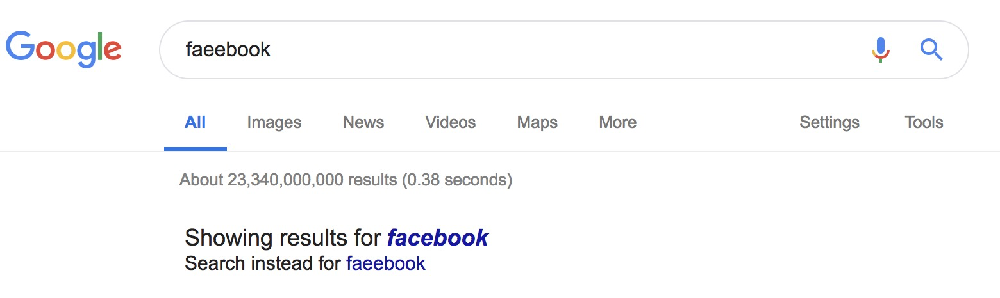

## 如何量化两个字符串的相似度？

计算机只认识数字，所以要解答开篇的问题，我们就要先来看，如何量化两个字符串之间的相似程度呢？有一个非常著名的量化方法，那就是编辑距离（Edit Distance）。

顾名思义，**编辑距离**指的就是，将一个字符串转化成另一个字符串，需要的最少编辑操作次数（比如增加一个字符、删除一个字符、替换一个字符）。编辑距离越大，说明两个字符串的相似程度越小；相反，编辑距离就越小，说明两个字符串的相似程度越大。对于两个完全相同的字符串来说，编辑距离就是 0。

根据所包含的编辑操作种类的不同，编辑距离有多种不同的计算方式，比较著名的有**莱文斯坦距离**（Levenshtein distance）和**最长公共子串长度**（Longest common substring length）。其中，莱文斯坦距离允许增加、删除、替换字符这三个编辑操作，最长公共子串长度只允许增加、删除字符这两个编辑操作。

而且，莱文斯坦距离和最长公共子串长度，从两个截然相反的角度，分析字符串的相似程度。莱文斯坦距离的大小，表示两个字符串差异的大小；而最长公共子串的大小，表示两个字符串相似程度的大小。

关于这两个计算方法，我举个例子给你说明一下。这里面，两个字符串 mitcmu 和 mtacnu 的莱文斯坦距离是 3，最长公共子串长度是 4。

了解了编辑距离的概念之后，我们来看，如何快速计算两个字符串之间的编辑距离？

## 如何编程计算莱文斯坦距离？

之前我反复强调过，思考过程比结论更重要，所以，我现在就给你展示一下，解决这个问题，我的完整的思考过程。

这个问题是求把一个字符串变成另一个字符串，需要的最少编辑次数。整个求解过程，涉及多个决策阶段，我们需要依次考察一个字符串中的每个字符，跟另一个字符串中的字符是否匹配，匹配的话如何处理，不匹配的话又如何处理。所以，这个问题符合**多阶段决策最优解模型**。

我们前面讲了，贪心、回溯、动态规划可以解决的问题，都可以抽象成这样一个模型。要解决这个问题，我们可以先看一看，用最简单的回溯算法，该如何来解决。

回溯是一个递归处理的过程。如果 a[i]与 b[j]匹配，我们递归考察 a[i+1]和 b[j+1]。如果 a[i]与 b[j]不匹配，那我们有多种处理方式可选：

可以删除 a[i]，然后递归考察 a[i+1]和 b[j]；

可以删除 b[j]，然后递归考察 a[i]和 b[j+1]；

可以在 a[i]前面添加一个跟 b[j]相同的字符，然后递归考察 a[i]和 b[j+1];

可以在 b[j]前面添加一个跟 a[i]相同的字符，然后递归考察 a[i+1]和 b[j]；

可以将 a[i]替换成 b[j]，或者将 b[j]替换成 a[i]，然后递归考察 a[i+1]和 b[j+1]。

我们将上面的回溯算法的处理思路，翻译成代码，就是下面这个样子：

private char[] a = "mitcmu".toCharArray();

private char[] b = "mtacnu".toCharArray();

private int n = 6;

private int m = 6;

private int minDist = Integer.MAX_VALUE; // 存储结果

// 调用方式 lwstBT(0, 0, 0);

public lwstBT(int i, int j, int edist) {

  if (i == n || j == m) {

​    if (i < n) edist += (n-i);

​    if (j < m) edist += (m - j);

​    if (edist < minDist) minDist = edist;

​    return;

  }

  if (a[i] == b[j]) { // 两个字符匹配

​    lwstBT(i+1, j+1, edist);

  } else { // 两个字符不匹配

​    lwstBT(i + 1, j, edist + 1); // 删除a[i]或者b[j]前添加一个字符

​    lwstBT(i, j + 1, edist + 1); // 删除b[j]或者a[i]前添加一个字符

​    lwstBT(i + 1, j + 1, edist + 1); // 将a[i]和b[j]替换为相同字符

  }

}

根据回溯算法的代码实现，我们可以画出递归树，看是否存在重复子问题。如果存在重复子问题，那我们就可以考虑能否用动态规划来解决；如果不存在重复子问题，那回溯就是最好的解决方法。

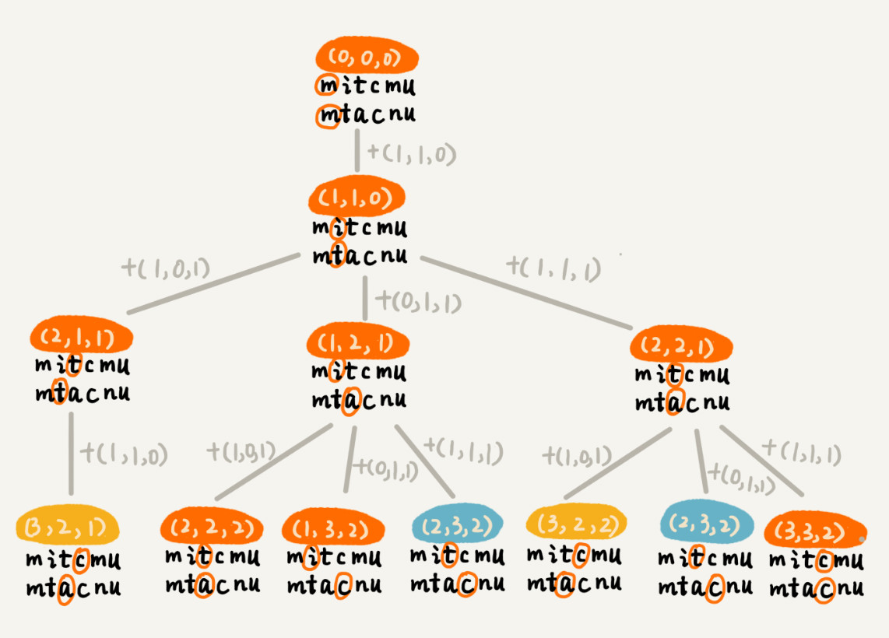

在递归树中，每个节点代表一个状态，状态包含三个变量 (i, j, edist)，其中，edist 表示处理到 a[i]和 b[j]时，已经执行的编辑操作的次数。

在递归树中，(i, j) 两个变量重复的节点很多，比如 (3, 2) 和 (2, 3)。对于 (i, j) 相同的节点，我们只需要保留 edist 最小的，继续递归处理就可以了，剩下的节点都可以舍弃。所以，状态就从 (i, j, edist) 变成了 (i, j, min_edist)，其中 min_edist 表示处理到 a[i]和 b[j]，已经执行的最少编辑次数。

看到这里，你有没有觉得，这个问题跟上两节讲的动态规划例子非常相似？不过，这个问题的状态转移方式，要比之前两节课中讲到的例子都要复杂很多。上一节我们讲的矩阵最短路径问题中，到达状态 (i, j) 只能通过 (i-1, j) 或 (i, j-1) 两个状态转移过来，而今天这个问题，状态 (i, j) 可能从 (i-1, j)，(i, j-1)，(i-1, j-1) 三个状态中的任意一个转移过来。

基于刚刚的分析，我们可以尝试着将把状态转移的过程，用公式写出来。这就是我们前面讲的状态转移方程。

如果：a[i]!=b[j]，那么：min_edist(i, j)就等于：

min(min_edist(i-1,j)+1, min_edist(i,j-1)+1, min_edist(i-1,j-1)+1)

如果：a[i]==b[j]，那么：min_edist(i, j)就等于：

min(min_edist(i-1,j)+1, min_edist(i,j-1)+1，min_edist(i-1,j-1))

其中，min表示求三数中的最小值。     

了解了状态与状态之间的递推关系，我们画出一个二维的状态表，按行依次来填充状态表中的每个值。

我们现在既有状态转移方程，又理清了完整的填表过程，代码实现就非常简单了。我将代码贴在下面，你可以对比着文字解释，一起看下。

public int lwstDP(char[] a, int n, char[] b, int m) {

  int[][] minDist = new int[n][m];

  for (int j = 0; j < m; ++j) { // 初始化第0行:a[0..0]与b[0..j]的编辑距离

​    if (a[0] == b[j]) minDist[0][j] = j;

​    else if (j != 0) minDist[0][j] = minDist[0][j-1]+1;

​    else minDist[0][j] = 1;

  }

  for (int i = 0; i < n; ++i) { // 初始化第0列:a[0..i]与b[0..0]的编辑距离

​    if (a[i] == b[0]) minDist[i][0] = i;

​    else if (i != 0) minDist[i][0] = minDist[i-1][0]+1;

​    else minDist[i][0] = 1;

  }

  for (int i = 1; i < n; ++i) { // 按行填表

​    for (int j = 1; j < m; ++j) {

​      if (a[i] == b[j]) minDist[i][j] = min(

​          minDist[i-1][j]+1, minDist[i][j-1]+1, minDist[i-1][j-1]);

​      else minDist[i][j] = min(

​          minDist[i-1][j]+1, minDist[i][j-1]+1, minDist[i-1][j-1]+1);

​    }

  }

  return minDist[n-1][m-1];

}

private int min(int x, int y, int z) {

  int minv = Integer.MAX_VALUE;

  if (x < minv) minv = x;

  if (y < minv) minv = y;

  if (z < minv) minv = z;

  return minv;

}

你可能会说，我虽然能看懂你讲的思路，但是遇到新的问题的时候，我还是会感觉到无从下手。这种感觉是非常正常的。关于复杂算法问题的解决思路，我还有一些经验、小技巧，可以分享给你。

当我们拿到一个问题的时候，**我们可以先不思考，计算机会如何实现这个问题，而是单纯考虑“人脑”会如何去解决这个问题**。人脑比较倾向于思考具象化的、摸得着看得见的东西，不适合思考过于抽象的问题。所以，我们需要把抽象问题具象化。那如何具象化呢？我们可以实例化几个测试数据，通过人脑去分析具体实例的解，然后总结规律，再尝试套用学过的算法，看是否能够解决。

除此之外，我还有一个非常有效、但也算不上技巧的东西，我也反复强调过，那就是**多练**。实际上，等你做多了题目之后，自然就会有感觉，看到问题，立马就能想到能否用动态规划解决，然后直接就可以寻找最优子结构，写出动态规划方程，然后将状态转移方程翻译成代码。

## 如何编程计算最长公共子串长度？

前面我们讲到，最长公共子串作为编辑距离中的一种，只允许增加、删除字符两种编辑操作。从名字上，你可能觉得它看起来跟编辑距离没什么关系。实际上，从本质上来说，它表征的也是两个字符串之间的相似程度。

这个问题的解决思路，跟莱文斯坦距离的解决思路非常相似，也可以用动态规划解决。我刚刚已经详细讲解了莱文斯坦距离的动态规划解决思路，所以，针对这个问题，我直接定义状态，然后写状态转移方程。

每个状态还是包括三个变量 (i, j, max_lcs)，max_lcs 表示 a[0…i]和 b[0…j]的最长公共子串长度。那 (i, j) 这个状态都是由哪些状态转移过来的呢？

我们先来看回溯的处理思路。我们从 a[0]和 b[0]开始，依次考察两个字符串中的字符是否匹配。

如果 a[i]与 b[j]互相匹配，我们将最大公共子串长度加一，并且继续考察 a[i+1]和 b[j+1]。

如果 a[i]与 b[j]不匹配，最长公共子串长度不变，这个时候，有两个不同的决策路线：

删除 a[i]，或者在 b[j]前面加上一个字符 a[i]，然后继续考察 a[i+1]和 b[j]；

删除 b[j]，或者在 a[i]前面加上一个字符 b[j]，然后继续考察 a[i]和 b[j+1]。

反过来也就是说，如果我们要求 a[0…i]和 b[0…j]的最长公共长度 max_lcs(i, j)，我们只有可能通过下面三个状态转移过来：

(i-1, j-1, max_lcs)，其中 max_lcs 表示 a[0…i-1]和 b[0…j-1]的最长公共子串长度；

(i-1, j, max_lcs)，其中 max_lcs 表示 a[0…i-1]和 b[0…j]的最长公共子串长度；

(i, j-1, max_lcs)，其中 max_lcs 表示 a[0…i]和 b[0…j-1]的最长公共子串长度。

如果我们把这个转移过程，用状态转移方程写出来，就是下面这个样子：

如果：a[i]==b[j]，那么：max_lcs(i, j)就等于：

max(max_lcs(i-1,j-1)+1, max_lcs(i-1, j), max_lcs(i, j-1))；

如果：a[i]!=b[j]，那么：max_lcs(i, j)就等于：

max(max_lcs(i-1,j-1), max_lcs(i-1, j), max_lcs(i, j-1))；

其中max表示求三数中的最大值。

有了状态转移方程，代码实现就简单多了。我把代码贴到了下面，你可以对比着文字一块儿看。

public int lcs(char[] a, int n, char[] b, int m) {

  int[][] maxlcs = new int[n][m];

  for (int j = 0; j < m; ++j) {//初始化第0行：a[0..0]与b[0..j]的maxlcs

​    if (a[0] == b[j]) maxlcs[0][j] = 1;

​    else if (j != 0) maxlcs[0][j] = maxlcs[0][j-1];

​    else maxlcs[0][j] = 0;

  }

  for (int i = 0; i < n; ++i) {//初始化第0列：a[0..i]与b[0..0]的maxlcs

​    if (a[i] == b[0]) maxlcs[i][0] = 1;

​    else if (i != 0) maxlcs[i][0] = maxlcs[i-1][0];

​    else maxlcs[i][0] = 0;

  }

  for (int i = 1; i < n; ++i) { // 填表

​    for (int j = 1; j < m; ++j) {

​      if (a[i] == b[j]) maxlcs[i][j] = max(

​          maxlcs[i-1][j], maxlcs[i][j-1], maxlcs[i-1][j-1]+1);

​      else maxlcs[i][j] = max(

​          maxlcs[i-1][j], maxlcs[i][j-1], maxlcs[i-1][j-1]);

​    }

  }

  return maxlcs[n-1][m-1];

}

private int max(int x, int y, int z) {

  int maxv = Integer.MIN_VALUE;

  if (x > maxv) maxv = x;

  if (y > maxv) maxv = y;

  if (z > maxv) maxv = z;

  return maxv;

}

## 解答开篇

今天的内容到此就讲完了，我们来看下开篇的问题。

当用户在搜索框内，输入一个拼写错误的单词时，我们就拿这个单词跟词库中的单词一一进行比较，计算编辑距离，将编辑距离最小的单词，作为纠正之后的单词，提示给用户。

这就是拼写纠错最基本的原理。不过，真正用于商用的搜索引擎，拼写纠错功能显然不会就这么简单。一方面，单纯利用编辑距离来纠错，效果并不一定好；另一方面，词库中的数据量可能很大，搜索引擎每天要支持海量的搜索，所以对纠错的性能要求很高。

针对纠错效果不好的问题，我们有很多种优化思路，我这里介绍几种。

我们并不仅仅取出编辑距离最小的那个单词，而是取出编辑距离最小的 TOP 10，然后根据其他参数，决策选择哪个单词作为拼写纠错单词。比如使用搜索热门程度来决定哪个单词作为拼写纠错单词。

我们还可以用多种编辑距离计算方法，比如今天讲到的两种，然后分别编辑距离最小的 TOP 10，然后求交集，用交集的结果，再继续优化处理。

我们还可以通过统计用户的搜索日志，得到最常被拼错的单词列表，以及对应的拼写正确的单词。搜索引擎在拼写纠错的时候，首先在这个最常被拼错单词列表中查找。如果一旦找到，直接返回对应的正确的单词。这样纠错的效果非常好。

我们还有更加高级一点的做法，引入个性化因素。针对每个用户，维护这个用户特有的搜索喜好，也就是常用的搜索关键词。当用户输入错误的单词的时候，我们首先在这个用户常用的搜索关键词中，计算编辑距离，查找编辑距离最小的单词。

针对纠错性能方面，我们也有相应的优化方式。我讲两种分治的优化思路。

如果纠错功能的 TPS 不高，我们可以部署多台机器，每台机器运行一个独立的纠错功能。当有一个纠错请求的时候，我们通过负载均衡，分配到其中一台机器，来计算编辑距离，得到纠错单词。

如果纠错系统的响应时间太长，也就是，每个纠错请求处理时间过长，我们可以将纠错的词库，分割到很多台机器。当有一个纠错请求的时候，我们就将这个拼写错误的单词，同时发送到这多台机器，让多台机器并行处理，分别得到编辑距离最小的单词，然后再比对合并，最终决定出一个最优的纠错单词。

真正的搜索引擎的拼写纠错优化，肯定不止我讲的这么简单，但是万变不离其宗。掌握了核心原理，就是掌握了解决问题的方法，剩下就靠你自己的灵活运用和实战操练了。

## 内容小结

动态规划的三节内容到此就全部讲完了，不知道你掌握得如何呢？

动态规划的理论尽管并不复杂，总结起来就是“一个模型三个特征”。但是，要想灵活应用并不简单。要想能真正理解、掌握动态规划，你只有多练习。

这三节中，加上课后思考题，总共有 8 个动态规划问题。这 8 个问题都非常经典，是我精心筛选出来的。很多动态规划问题其实都可以抽象成这几个问题模型，所以，你一定要多看几遍，多思考一下，争取真正搞懂它们。

只要弄懂了这几个问题，一般的动态规划问题，你应该都可以应付。对于动态规划这个知识点，你就算是入门了，再学习更加复杂的就会简单很多。

## 课后思考

我们有一个数字序列包含 n 个不同的数字，如何求出这个序列中的最长递增子序列长度？比如 2, 9, 3, 6, 5, 1, 7 这样一组数字序列，它的最长递增子序列就是 2, 3, 5, 7，所以最长递增子序列的长度是 4。

欢迎留言和我分享，也欢迎点击“请朋友读”，把今天的内容分享给你的好友，和他一起讨论、学习。

# 43 | 拓扑排序：如何确定代码源文件的编译依赖关系？

王争 2019-01-04



00:00

[1.0x**](javascript:;)

讲述：修阳 大小：8.82M 时长：09:37

从今天开始，我们就进入了专栏的高级篇。相对基础篇，高级篇涉及的知识点，都比较零散，不是太系统。所以，我会围绕一个实际软件开发的问题，在阐述具体解决方法的过程中，将涉及的知识点给你详细讲解出来。

所以，相较于基础篇“**开篇问题 - 知识讲解 - 回答开篇 - 总结 - 课后思考**”这样的文章结构，高级篇我稍作了些改变，大致分为这样几个部分：“**问题阐述 - 算法解析 - 总结引申 - 课后思考**”。

好了，现在，我们就进入高级篇的第一节，如何确定代码源文件的编译依赖关系？

我们知道，一个完整的项目往往会包含很多代码源文件。编译器在编译整个项目的时候，需要按照依赖关系，依次编译每个源文件。比如，A.cpp 依赖 B.cpp，那在编译的时候，编译器需要先编译 B.cpp，才能编译 A.cpp。

编译器通过分析源文件或者程序员事先写好的编译配置文件（比如 Makefile 文件），来获取这种局部的依赖关系。**那编译器又该如何通过源文件两两之间的局部依赖关系，确定一个全局的编译顺序呢？**

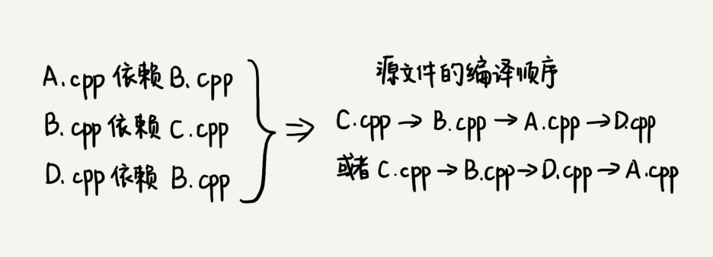

## 算法解析

这个问题的解决思路与“图”这种数据结构的一个经典算法“拓扑排序算法”有关。那什么是拓扑排序呢？这个概念很好理解，我们先来看一个生活中的拓扑排序的例子。

我们在穿衣服的时候都有一定的顺序，我们可以把这种顺序想成，衣服与衣服之间有一定的依赖关系。比如说，你必须先穿袜子才能穿鞋，先穿内裤才能穿秋裤。假设我们现在有八件衣服要穿，它们之间的两两依赖关系我们已经很清楚了，那如何安排一个穿衣序列，能够满足所有的两两之间的依赖关系？

这就是个拓扑排序问题。从这个例子中，你应该能想到，在很多时候，拓扑排序的序列并不是唯一的。你可以看我画的这幅图，我找到了好几种满足这些局部先后关系的穿衣序列。

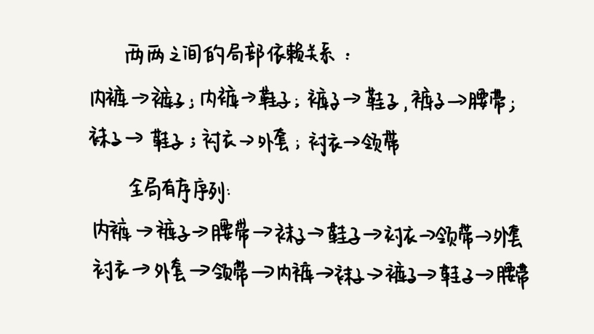

弄懂了这个生活中的例子，开篇的关于编译顺序的问题，你应该也有思路了。开篇问题跟这个问题的模型是一样的，也可以抽象成一个拓扑排序问题。

拓扑排序的原理非常简单，我们的重点应该放到拓扑排序的实现上面。

我前面多次讲过，算法是构建在具体的数据结构之上的。针对这个问题，我们先来看下，如何将问题背景抽象成具体的数据结构？

我们可以把源文件与源文件之间的依赖关系，抽象成一个有向图。每个源文件对应图中的一个顶点，源文件之间的依赖关系就是顶点之间的边。

如果 a 先于 b 执行，也就是说 b 依赖于 a，那么就在顶点 a 和顶点 b 之间，构建一条从 a 指向 b 的边。而且，这个图不仅要是有向图，还要是一个有向无环图，也就是不能存在像 a->b->c->a 这样的循环依赖关系。因为图中一旦出现环，拓扑排序就无法工作了。实际上，拓扑排序本身就是基于有向无环图的一个算法。

public class Graph {

  private int v; // 顶点的个数

  private LinkedList<Integer> adj[]; // 邻接表

  public Graph(int v) {

​    this.v = v;

​    adj = new LinkedList[v];

​    for (int i=0; i<v; ++i) {

​      adj[i] = new LinkedList<>();

​    }

  }

  public void addEdge(int s, int t) { // s先于t，边s->t

​    adj[s].add(t);

  }

}

数据结构定义好了，现在，我们来看，**如何在这个有向无环图上，实现拓扑排序**？

拓扑排序有两种实现方法，都不难理解。它们分别是 **Kahn 算法**和 **DFS 深度优先搜索算法**。我们依次来看下它们都是怎么工作的。

### 1.Kahn 算法

Kahn 算法实际上用的是贪心算法思想，思路非常简单、好懂。

定义数据结构的时候，如果 s 需要先于 t 执行，那就添加一条 s 指向 t 的边。所以，如果某个顶点入度为 0， 也就表示，没有任何顶点必须先于这个顶点执行，那么这个顶点就可以执行了。

我们先从图中，找出一个入度为 0 的顶点，将其输出到拓扑排序的结果序列中（对应代码中就是把它打印出来），并且把这个顶点从图中删除（也就是把这个顶点可达的顶点的入度都减 1）。我们循环执行上面的过程，直到所有的顶点都被输出。最后输出的序列，就是满足局部依赖关系的拓扑排序。

我把 Kahn 算法用代码实现了一下，你可以结合着文字描述一块看下。不过，你应该能发现，这段代码实现更有技巧一些，并没有真正删除顶点的操作。代码中有详细的注释，你自己来看，我就不多解释了。

public void topoSortByKahn() {

  int[] inDegree = new int[v]; // 统计每个顶点的入度

  for (int i = 0; i < v; ++i) {

​    for (int j = 0; j < adj[i].size(); ++j) {

​      int w = adj[i].get(j); // i->w

​      inDegree[w]++;

​    }

  }

  LinkedList<Integer> queue = new LinkedList<>();

  for (int i = 0; i < v; ++i) {

​    if (inDegree[i] == 0) queue.add(i);

  }

  while (!queue.isEmpty()) {

​    int i = queue.remove();

​    System.out.print("->" + i);

​    for (int j = 0; j < adj[i].size(); ++j) {

​      int k = adj[i].get(j);

​      inDegree[k]--;

​      if (inDegree[k] == 0) queue.add(k);

​    }

  }

}

### 2.DFS 算法

图上的深度优先搜索我们前面已经讲过了，实际上，拓扑排序也可以用深度优先搜索来实现。不过这里的名字要稍微改下，更加确切的说法应该是深度优先遍历，遍历图中的所有顶点，而非只是搜索一个顶点到另一个顶点的路径。

关于这个算法的实现原理，我先把代码贴在下面，下面给你具体解释。

public void topoSortByDFS() {

  // 先构建逆邻接表，边s->t表示，s依赖于t，t先于s

  LinkedList<Integer> inverseAdj[] = new LinkedList[v];

  for (int i = 0; i < v; ++i) { // 申请空间

​    inverseAdj[i] = new LinkedList<>();

  }

  for (int i = 0; i < v; ++i) { // 通过邻接表生成逆邻接表

​    for (int j = 0; j < adj[i].size(); ++j) {

​      int w = adj[i].get(j); // i->w

​      inverseAdj[w].add(i); // w->i

​    }

  }

  boolean[] visited = new boolean[v];

  for (int i = 0; i < v; ++i) { // 深度优先遍历图

​    if (visited[i] == false) {

​      visited[i] = true;

​      dfs(i, inverseAdj, visited);

​    }

  }

}

private void dfs(

​    int vertex, LinkedList<Integer> inverseAdj[], boolean[] visited) {

  for (int i = 0; i < inverseAdj[vertex].size(); ++i) {

​    int w = inverseAdj[vertex].get(i);

​    if (visited[w] == true) continue;

​    visited[w] = true;

​    dfs(w, inverseAdj, visited);

  } // 先把vertex这个顶点可达的所有顶点都打印出来之后，再打印它自己

  System.out.print("->" + vertex);

}

这个算法包含两个关键部分。

第一部分是**通过邻接表构造逆邻接表**。邻接表中，边 s->t 表示 s 先于 t 执行，也就是 t 要依赖 s。在逆邻接表中，边 s->t 表示 s 依赖于 t，s 后于 t 执行。为什么这么转化呢？这个跟我们这个算法的实现思想有关。

第二部分是这个算法的核心，也就是**递归处理每个顶点**。对于顶点 vertex 来说，我们先输出它可达的所有顶点，也就是说，先把它依赖的所有的顶点输出了，然后再输出自己。

到这里，用 Kahn 算法和 DFS 算法求拓扑排序的原理和代码实现都讲完了。我们来看下，**这两个算法的时间复杂度分别是多少呢？**

从 Kahn 代码中可以看出来，每个顶点被访问了一次，每个边也都被访问了一次，所以，Kahn 算法的时间复杂度就是 O(V+E)（V 表示顶点个数，E 表示边的个数）。

DFS 算法的时间复杂度我们之前分析过。每个顶点被访问两次，每条边都被访问一次，所以时间复杂度也是 O(V+E)。

注意，这里的图可能不是连通的，有可能是有好几个不连通的子图构成，所以，E 并不一定大于 V，两者的大小关系不确定。所以，在表示时间复杂度的时候，V、E 都要考虑在内。

## 总结引申

在基础篇中，关于“图”，我们讲了图的定义和存储、图的广度和深度优先搜索。今天，我们又讲了一个关于图的算法，拓扑排序。

拓扑排序应用非常广泛，解决的问题的模型也非常一致。凡是需要通过局部顺序来推导全局顺序的，一般都能用拓扑排序来解决。除此之外，拓扑排序还能检测图中环的存在。对于 Kahn 算法来说，如果最后输出出来的顶点个数，少于图中顶点个数，图中还有入度不是 0 的顶点，那就说明，图中存在环。

关于图中环的检测，我们在递归那一节讲过一个例子，在查找最终推荐人的时候，可能会因为脏数据，造成存在循环推荐，比如，用户 A 推荐了用户 B，用户 B 推荐了用户 C，用户 C 又推荐了用户 A。如何避免这种脏数据导致的无限递归？这个问题，我当时留给你思考了，现在是时候解答了。

实际上，这就是环的检测问题。因为我们每次都只是查找一个用户的最终推荐人，所以，我们并不需要动用复杂的拓扑排序算法，而只需要记录已经访问过的用户 ID，当用户 ID 第二次被访问的时候，就说明存在环，也就说明存在脏数据。

HashSet<Integer> hashTable = new HashSet<>(); // 保存已经访问过的actorId

long findRootReferrerId(long actorId) {

  if (hashTable.contains(actorId)) { // 存在环

​    return;

  }

  hashTable.add(actorId);

  Long referrerId = 

​       select referrer_id from [table] where actor_id = actorId;

  if (referrerId == null) return actorId;

  return findRootReferrerId(referrerId);

}

如果把这个问题改一下，我们想要知道，数据库中的所有用户之间的推荐关系了，有没有存在环的情况。这个问题，就需要用到拓扑排序算法了。我们把用户之间的推荐关系，从数据库中加载到内存中，然后构建成今天讲的这种有向图数据结构，再利用拓扑排序，就可以快速检测出是否存在环了。

## 课后思考

在今天的讲解中，我们用图表示依赖关系的时候，如果 a 先于 b 执行，我们就画一条从 a 到 b 的有向边；反过来，如果 a 先于 b，我们画一条从 b 到 a 的有向边，表示 b 依赖 a，那今天讲的 Kahn 算法和 DFS 算法还能否正确工作呢？如果不能，应该如何改造一下呢？

我们今天讲了两种拓扑排序算法的实现思路，Kahn 算法和 DFS 深度优先搜索算法，如果换做 BFS 广度优先搜索算法，还可以实现吗？

欢迎留言和我分享，也欢迎点击“请朋友读”，把今天的内容分享给你的好友，和他一起讨论、学习。

# 44 | 最短路径：地图软件是如何计算出最优出行路径的？

王争 2019-01-07



00:00

[1.0x**](javascript:;)

讲述：修阳 大小：12.42M 时长：13:33

基础篇的时候，我们学习了图的两种搜索算法，深度优先搜索和广度优先搜索。这两种算法主要是针对无权图的搜索算法。针对有权图，也就是图中的每条边都有一个权重，我们该如何计算两点之间的最短路径（经过的边的权重和最小）呢？今天，我就从地图软件的路线规划问题讲起，带你看看常用的**最短路径算法**（Shortest Path Algorithm）。

像 Google 地图、百度地图、高德地图这样的地图软件，我想你应该经常使用吧？如果想从家开车到公司，你只需要输入起始、结束地址，地图就会给你规划一条最优出行路线。这里的最优，有很多种定义，比如最短路线、最少用时路线、最少红绿灯路线等等。**作为一名软件开发工程师，你是否思考过，地图软件的最优路线是如何计算出来的吗？底层依赖了什么算法呢？**

## 算法解析

我们刚提到的最优问题包含三个：最短路线、最少用时和最少红绿灯。我们先解决最简单的，最短路线。

解决软件开发中的实际问题，最重要的一点就是**建模**，也就是将复杂的场景抽象成具体的数据结构。针对这个问题，我们该如何抽象成数据结构呢？

我们之前也提到过，图这种数据结构的表达能力很强，显然，把地图抽象成图最合适不过了。我们把每个岔路口看作一个顶点，岔路口与岔路口之间的路看作一条边，路的长度就是边的权重。如果路是单行道，我们就在两个顶点之间画一条有向边；如果路是双行道，我们就在两个顶点之间画两条方向不同的边。这样，整个地图就被抽象成一个有向有权图。

具体的代码实现，我放在下面了。于是，我们要求解的问题就转化为，在一个有向有权图中，求两个顶点间的最短路径。

public class Graph { // 有向有权图的邻接表表示

  private LinkedList<Edge> adj[]; // 邻接表

  private int v; // 顶点个数

  public Graph(int v) {

​    this.v = v;

​    this.adj = new LinkedList[v];

​    for (int i = 0; i < v; ++i) {

​      this.adj[i] = new LinkedList<>();

​    }

  }

  public void addEdge(int s, int t, int w) { // 添加一条边

​    this.adj[s].add(new Edge(s, t, w));

  }

  private class Edge {

​    public int sid; // 边的起始顶点编号

​    public int tid; // 边的终止顶点编号

​    public int w; // 权重

​    public Edge(int sid, int tid, int w) {

​      this.sid = sid;

​      this.tid = tid;

​      this.w = w;

​    }

  }

  // 下面这个类是为了dijkstra实现用的

  private class Vertex {

​    public int id; // 顶点编号ID

​    public int dist; // 从起始顶点到这个顶点的距离

​    public Vertex(int id, int dist) {

​      this.id = id;

​      this.dist = dist;

​    }

  }

}

想要解决这个问题，有一个非常经典的算法，最短路径算法，更加准确地说，是**单源最短路径算法**（一个顶点到一个顶点）。提到最短路径算法，最出名的莫过于 Dijkstra 算法了。所以，我们现在来看，Dijkstra 算法是怎么工作的。

这个算法的原理稍微有点儿复杂，单纯的文字描述，不是很好懂。所以，我还是结合代码来讲解。

// 因为Java提供的优先级队列，没有暴露更新数据的接口，所以我们需要重新实现一个

private class PriorityQueue { // 根据vertex.dist构建小顶堆

  private Vertex[] nodes;

  private int count;

  public PriorityQueue(int v) {

​    this.nodes = new Vertex[v+1];

​    this.count = v;

  }

  public Vertex poll() { // TODO: 留给读者实现... }

  public void add(Vertex vertex) { // TODO: 留给读者实现...}

  // 更新结点的值，并且从下往上堆化，重新符合堆的定义。时间复杂度O(logn)。

  public void update(Vertex vertex) { // TODO: 留给读者实现...} 

  public boolean isEmpty() { // TODO: 留给读者实现...}

}

public void dijkstra(int s, int t) { // 从顶点s到顶点t的最短路径

  int[] predecessor = new int[this.v]; // 用来还原最短路径

  Vertex[] vertexes = new Vertex[this.v];

  for (int i = 0; i < this.v; ++i) {

​    vertexes[i] = new Vertex(i, Integer.MAX_VALUE);

  }

  PriorityQueue queue = new PriorityQueue(this.v);// 小顶堆

  boolean[] inqueue = new boolean[this.v]; // 标记是否进入过队列

  vertexes[s].dist = 0;

  queue.add(vertexes[s]);

  inqueue[s] = true;

  while (!queue.isEmpty()) {

​    Vertex minVertex= queue.poll(); // 取堆顶元素并删除

​    if (minVertex.id == t) break; // 最短路径产生了

​    for (int i = 0; i < adj[minVertex.id].size(); ++i) {

​      Edge e = adj[minVertex.id].get(i); // 取出一条minVetex相连的边

​      Vertex nextVertex = vertexes[e.tid]; // minVertex-->nextVertex

​      if (minVertex.dist + e.w < nextVertex.dist) { // 更新next的dist

​        nextVertex.dist = minVertex.dist + e.w;

​        predecessor[nextVertex.id] = minVertex.id;

​        if (inqueue[nextVertex.id] == true) {

​          queue.update(nextVertex); // 更新队列中的dist值

​        } else {

​          queue.add(nextVertex);

​          inqueue[nextVertex.id] = true;

​        }

​      }

​    }

  }

  // 输出最短路径

  System.out.print(s);

  print(s, t, predecessor);

}

private void print(int s, int t, int[] predecessor) {

  if (s == t) return;

  print(s, predecessor[t], predecessor);

  System.out.print("->" + t);

}

我们用 vertexes 数组，记录从起始顶点到每个顶点的距离（dist）。起初，我们把所有顶点的 dist 都初始化为无穷大（也就是代码中的 Integer.MAX_VALUE）。我们把起始顶点的 dist 值初始化为 0，然后将其放到优先级队列中。

我们从优先级队列中取出 dist 最小的顶点 minVertex，然后考察这个顶点可达的所有顶点（代码中的 nextVertex）。如果 minVertex 的 dist 值加上 minVertex 与 nextVertex 之间边的权重 w 小于 nextVertex 当前的 dist 值，也就是说，存在另一条更短的路径，它经过 minVertex 到达 nextVertex。那我们就把 nextVertex 的 dist 更新为 minVertex 的 dist 值加上 w。然后，我们把 nextVertex 加入到优先级队列中。重复这个过程，直到找到终止顶点 t 或者队列为空。

以上就是 Dijkstra 算法的核心逻辑。除此之外，代码中还有两个额外的变量，predecessor 数组和 inqueue 数组。

predecessor 数组的作用是为了还原最短路径，它记录每个顶点的前驱顶点。最后，我们通过递归的方式，将这个路径打印出来。打印路径的 print 递归代码我就不详细讲了，这个跟我们在图的搜索中讲的打印路径方法一样。如果不理解的话，你可以回过头去看下那一节。

inqueue 数组是为了避免将一个顶点多次添加到优先级队列中。我们更新了某个顶点的 dist 值之后，如果这个顶点已经在优先级队列中了，就不要再将它重复添加进去了。

看完了代码和文字解释，你可能还是有点懵，那我就举个例子，再给你解释一下。

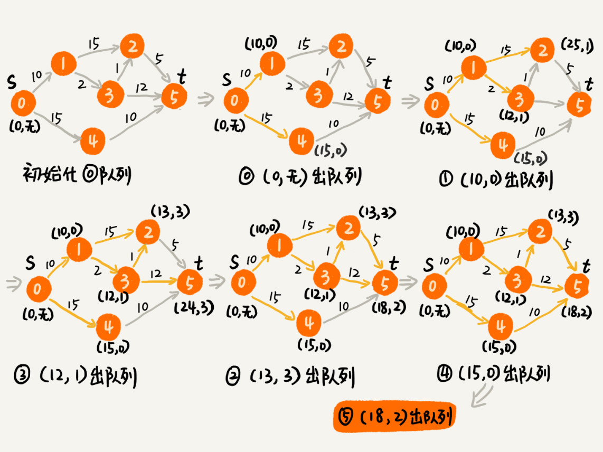

理解了 Dijkstra 的原理和代码实现，我们来看下，**Dijkstra 算法的时间复杂度是多少？**

在刚刚的代码实现中，最复杂就是 while 循环嵌套 for 循环那部分代码了。while 循环最多会执行 V 次（V 表示顶点的个数），而内部的 for 循环的执行次数不确定，跟每个顶点的相邻边的个数有关，我们分别记作 E0，E1，E2，……，E(V-1)。如果我们把这 V 个顶点的边都加起来，最大也不会超过图中所有边的个数 E（E 表示边的个数）。

for 循环内部的代码涉及从优先级队列取数据、往优先级队列中添加数据、更新优先级队列中的数据，这样三个主要的操作。我们知道，优先级队列是用堆来实现的，堆中的这几个操作，时间复杂度都是 O(logV)（堆中的元素个数不会超过顶点的个数 V）。

所以，综合这两部分，再利用乘法原则，整个代码的时间复杂度就是 O(E*logV)。

弄懂了 Dijkstra 算法，我们再来回答之前的问题，如何计算最优出行路线？

从理论上讲，用 Dijkstra 算法可以计算出两点之间的最短路径。但是，你有没有想过，对于一个超级大地图来说，岔路口、道路都非常多，对应到图这种数据结构上来说，就有非常多的顶点和边。如果为了计算两点之间的最短路径，在一个超级大图上动用 Dijkstra 算法，遍历所有的顶点和边，显然会非常耗时。那我们有没有什么优化的方法呢？

做工程不像做理论，一定要给出个最优解。理论上算法再好，如果执行效率太低，也无法应用到实际的工程中。**对于软件开发工程师来说，我们经常要根据问题的实际背景，对解决方案权衡取舍。类似出行路线这种工程上的问题，我们没有必要非得求出个绝对最优解。很多时候，为了兼顾执行效率，我们只需要计算出一个可行的次优解就可以了**。

有了这个原则，你能想出刚刚那个问题的优化方案吗？

虽然地图很大，但是两点之间的最短路径或者说较好的出行路径，并不会很“发散”，只会出现在两点之间和两点附近的区块内。所以我们可以在整个大地图上，划出一个小的区块，这个小区块恰好可以覆盖住两个点，但又不会很大。我们只需要在这个小区块内部运行 Dijkstra 算法，这样就可以避免遍历整个大图，也就大大提高了执行效率。

不过你可能会说了，如果两点距离比较远，从北京海淀区某个地点，到上海黄浦区某个地点，那上面的这种处理方法，显然就不工作了，毕竟覆盖北京和上海的区块并不小。

我给你点提示，你可以现在打开地图 App，缩小放大一下地图，看下地图上的路线有什么变化，然后再思考，这个问题该怎么解决。

对于这样两点之间距离较远的路线规划，我们可以把北京海淀区或者北京看作一个顶点，把上海黄浦区或者上海看作一个顶点，先规划大的出行路线。比如，如何从北京到上海，必须要经过某几个顶点，或者某几条干道，然后再细化每个阶段的小路线。

这样，最短路径问题就解决了。我们再来看另外两个问题，最少时间和最少红绿灯。

前面讲最短路径的时候，每条边的权重是路的长度。在计算最少时间的时候，算法还是不变，我们只需要把边的权重，从路的长度变成经过这段路所需要的时间。不过，这个时间会根据拥堵情况时刻变化。如何计算车通过一段路的时间呢？这是一个蛮有意思的问题，你可以自己思考下。

每经过一条边，就要经过一个红绿灯。关于最少红绿灯的出行方案，实际上，我们只需要把每条边的权值改为 1 即可，算法还是不变，可以继续使用前面讲的 Dijkstra 算法。不过，边的权值为 1，也就相当于无权图了，我们还可以使用之前讲过的广度优先搜索算法。因为我们前面讲过，广度优先搜索算法计算出来的两点之间的路径，就是两点的最短路径。

不过，这里给出的所有方案都非常粗糙，只是为了给你展示，如何结合实际的场景，灵活地应用算法，让算法为我们所用，真实的地图软件的路径规划，要比这个复杂很多。而且，比起 Dijkstra 算法，地图软件用的更多的是类似 A* 的启发式搜索算法，不过也是在 Dijkstra 算法上的优化罢了，我们后面会讲到，这里暂且不展开。

## 总结引申

今天，我们学习了一种非常重要的图算法，**Dijkstra 最短路径算法**。实际上，最短路径算法还有很多，比如 Bellford 算法、Floyd 算法等等。如果感兴趣，你可以自己去研究。

关于 Dijkstra 算法，我只讲了原理和代码实现。对于正确性，我没有去证明。之所以这么做，是因为证明过程会涉及比较复杂的数学推导。这个并不是我们的重点，你只要掌握这个算法的思路就可以了。

这些算法实现思路非常经典，掌握了这些思路，我们可以拿来指导、解决其他问题。比如 Dijkstra 这个算法的核心思想，就可以拿来解决下面这个看似完全不相关的问题。这个问题是我之前工作中遇到的真实的问题，为了在较短的篇幅里把问题介绍清楚，我对背景做了一些简化。

我们有一个翻译系统，只能针对单个词来做翻译。如果要翻译一整个句子，我们需要将句子拆成一个一个的单词，再丢给翻译系统。针对每个单词，翻译系统会返回一组可选的翻译列表，并且针对每个翻译打一个分，表示这个翻译的可信程度。

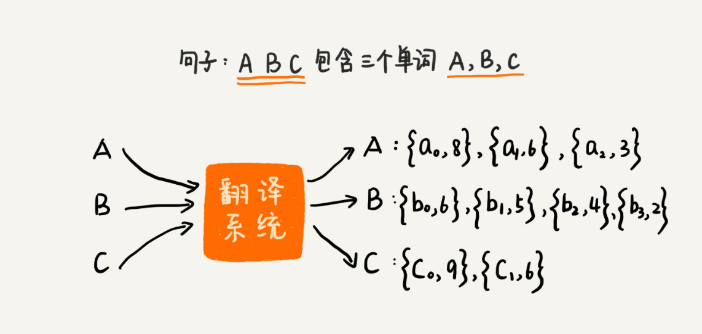

针对每个单词，我们从可选列表中，选择其中一个翻译，组合起来就是整个句子的翻译。每个单词的翻译的得分之和，就是整个句子的翻译得分。随意搭配单词的翻译，会得到一个句子的不同翻译。针对整个句子，我们希望计算出得分最高的前 k 个翻译结果，你会怎么编程来实现呢？

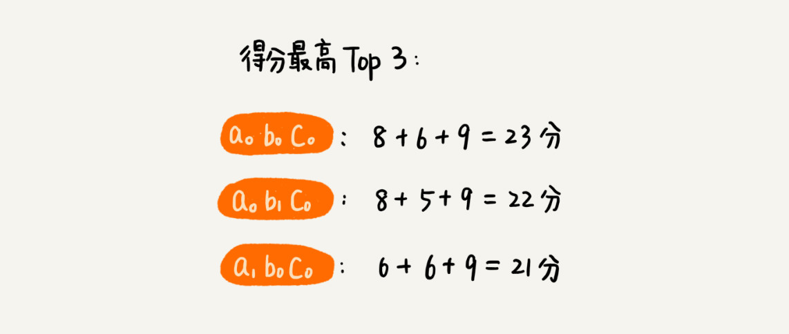

当然，最简单的办法还是借助回溯算法，穷举所有的排列组合情况，然后选出得分最高的前 k 个翻译结果。但是，这样做的时间复杂度会比较高，是 O(m^n)，其中，m 表示平均每个单词的可选翻译个数，n 表示一个句子中包含多少个单词。这个解决方案，你可以当作回溯算法的练习题，自己编程实现一下，我就不多说了。

实际上，这个问题可以借助 Dijkstra 算法的核心思想，非常高效地解决。每个单词的可选翻译是按照分数从大到小排列的，所以 *a*0*b*0*c*0 肯定是得分最高组合结果。我们把 *a*0*b*0*c*0 及得分作为一个对象，放入到优先级队列中。

我们每次从优先级队列中取出一个得分最高的组合，并基于这个组合进行扩展。扩展的策略是每个单词的翻译分别替换成下一个单词的翻译。比如 *a*0*b*0*c*0 扩展后，会得到三个组合，*a*1*b*0*c*0、*a*0*b*1*c*0、*a*0*b*0*c*1。我们把扩展之后的组合，加到优先级队列中。重复这个过程，直到获取到 k 个翻译组合或者队列为空。

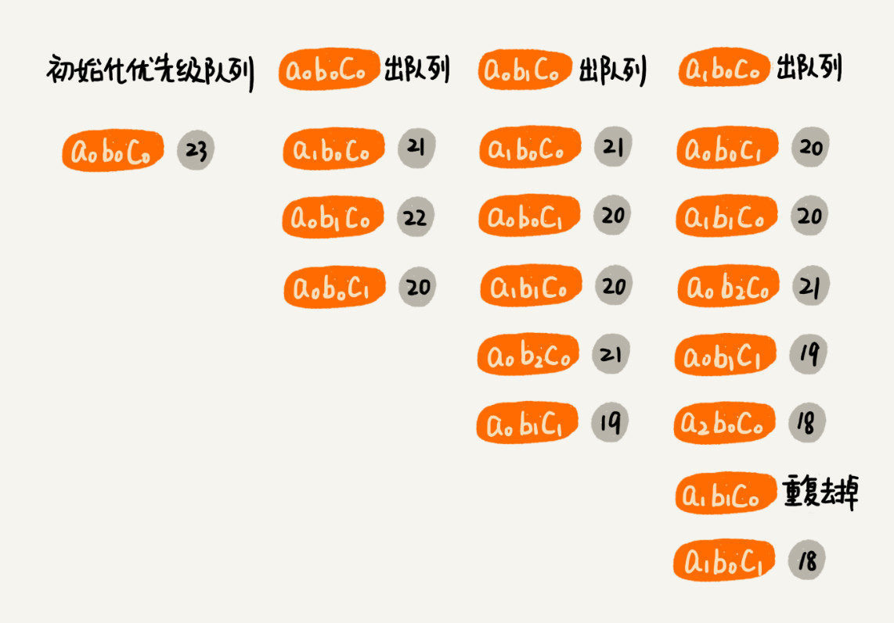

我们来看，这种实现思路的时间复杂度是多少？

假设句子包含 n 个单词，每个单词平均有 m 个可选的翻译，我们求得分最高的前 k 个组合结果。每次一个组合出队列，就对应着一个组合结果，我们希望得到 k 个，那就对应着 k 次出队操作。每次有一个组合出队列，就有 n 个组合入队列。优先级队列中出队和入队操作的时间复杂度都是 O(logX)，X 表示队列中的组合个数。所以，总的时间复杂度就是 O(k*n*logX)。那 X 到底是多少呢？

k 次出入队列，队列中的总数据不会超过 k*n，也就是说，出队、入队操作的时间复杂度是 O(log(k*n))。所以，总的时间复杂度就是 O(k*n*log(k*n))，比之前的指数级时间复杂度降低了很多。

## 课后思考

在计算最短时间的出行路线中，如何获得通过某条路的时间呢？这个题目很有意思，我之前面试的时候也被问到过，你可以思考看看。

今天讲的出行路线问题，我假设的是开车出行，那如果是公交出行呢？如果混合地铁、公交、步行，又该如何规划路线呢？

欢迎留言和我分享，也欢迎点击“请朋友读”，把今天的内容分享给你的好友，和他一起讨论、学习。

# 45 | 位图：如何实现网页爬虫中的URL去重功能？

王争 2019-01-09



00:00

[1.0x**](javascript:;)

讲述：修阳 大小：13.95M 时长：15:13

网页爬虫是搜索引擎中的非常重要的系统，负责爬取几十亿、上百亿的网页。爬虫的工作原理是，通过解析已经爬取页面中的网页链接，然后再爬取这些链接对应的网页。而**同一个网页链接有可能被包含在多个页面中，这就会导致爬虫在爬取的过程中，重复爬取相同的网页。如果你是一名负责爬虫的工程师，你会如何避免这些重复的爬取呢？**

最容易想到的方法就是，我们记录已经爬取的网页链接（也就是 URL），在爬取一个新的网页之前，我们拿它的链接，在已经爬取的网页链接列表中搜索。如果存在，那就说明这个网页已经被爬取过了；如果不存在，那就说明这个网页还没有被爬取过，可以继续去爬取。等爬取到这个网页之后，我们将这个网页的链接添加到已经爬取的网页链接列表了。

思路非常简单，我想你应该很容易就能想到。不过，我们该如何记录已经爬取的网页链接呢？需要用什么样的数据结构呢？

## 算法解析

关于这个问题，我们可以先回想下，是否可以用我们之前学过的数据结构来解决呢？

这个问题要处理的对象是网页链接，也就是 URL，需要支持的操作有两个，添加一个 URL 和查询一个 URL。除了这两个功能性的要求之外，在非功能性方面，我们还要求这两个操作的执行效率要尽可能高。除此之外，因为我们处理的是上亿的网页链接，内存消耗会非常大，所以在存储效率上，我们要尽可能地高效。

我们回想一下，满足这些条件的数据结构有哪些呢？显然，散列表、红黑树、跳表这些动态数据结构，都能支持快速地插入、查找数据，但是在内存消耗方面，是否可以接受呢？

我们拿散列表来举例。假设我们要爬取 10 亿个网页（像 Google、百度这样的通用搜索引擎，爬取的网页可能会更多），为了判重，我们把这 10 亿网页链接存储在散列表中。你来估算下，大约需要多少内存？

假设一个 URL 的平均长度是 64 字节，那单纯存储这 10 亿个 URL，需要大约 60GB 的内存空间。因为散列表必须维持较小的装载因子，才能保证不会出现过多的散列冲突，导致操作的性能下降。而且，用链表法解决冲突的散列表，还会存储链表指针。所以，如果将这 10 亿个 URL 构建成散列表，那需要的内存空间会远大于 60GB，有可能会超过 100GB。

当然，对于一个大型的搜索引擎来说，即便是 100GB 的内存要求，其实也不算太高，我们可以采用分治的思想，用多台机器（比如 20 台内存是 8GB 的机器）来存储这 10 亿网页链接。这种分治的处理思路，我们讲过很多次了，这里就不详细说了。

对于爬虫的 URL 去重这个问题，刚刚讲到的分治加散列表的思路，已经是可以实实在在工作的了。不过，**作为一个有追求的工程师，我们应该考虑，在添加、查询数据的效率以及内存消耗方面，是否还有进一步的优化空间呢？**

你可能会说，散列表中添加、查找数据的时间复杂度已经是 O(1)，还能有进一步优化的空间吗？实际上，我们前面也讲过，时间复杂度并不能完全代表代码的执行时间。大 O 时间复杂度表示法，会忽略掉常数、系数和低阶，并且统计的对象是语句的频度。不同的语句，执行时间也是不同的。时间复杂度只是表示执行时间随数据规模的变化趋势，并不能度量在特定的数据规模下，代码执行时间的多少。

如果时间复杂度中原来的系数是 10，我们现在能够通过优化，将系数降为 1，那在时间复杂度没有变化的情况下，执行效率就提高了 10 倍。对于实际的软件开发来说，10 倍效率的提升，显然是一个非常值得的优化。

如果我们用基于链表的方法解决冲突问题，散列表中存储的是 URL，那当查询的时候，通过哈希函数定位到某个链表之后，我们还需要依次比对每个链表中的 URL。这个操作是比较耗时的，主要有两点原因。

一方面，链表中的结点在内存中不是连续存储的，所以不能一下子加载到 CPU 缓存中，没法很好地利用到 CPU 高速缓存，所以数据访问性能方面会打折扣。

另一方面，链表中的每个数据都是 URL，而 URL 不是简单的数字，是平均长度为 64 字节的字符串。也就是说，我们要让待判重的 URL，跟链表中的每个 URL，做字符串匹配。显然，这样一个字符串匹配操作，比起单纯的数字比对，要慢很多。所以，基于这两点，执行效率方面肯定是有优化空间的。

对于内存消耗方面的优化，除了刚刚这种基于散列表的解决方案，貌似没有更好的法子了。实际上，如果要想内存方面有明显的节省，那就得换一种解决方案，也就是我们今天要着重讲的这种存储结构，**布隆过滤器**（Bloom Filter）。

在讲布隆过滤器前，我要先讲一下另一种存储结构，**位图**（BitMap）。因为，布隆过滤器本身就是基于位图的，是对位图的一种改进。

我们先来看一个跟开篇问题非常类似、但比那个稍微简单的问题。**我们有 1 千万个整数，整数的范围在 1 到 1 亿之间。如何快速查找某个整数是否在这 1 千万个整数中呢？**

当然，这个问题还是可以用散列表来解决。不过，我们可以使用一种比较“特殊”的散列表，那就是位图。我们申请一个大小为 1 亿、数据类型为布尔类型（true 或者 false）的数组。我们将这 1 千万个整数作为数组下标，将对应的数组值设置成 true。比如，整数 5 对应下标为 5 的数组值设置为 true，也就是 array[5]=true。

当我们查询某个整数 K 是否在这 1 千万个整数中的时候，我们只需要将对应的数组值 array[K]取出来，看是否等于 true。如果等于 true，那说明 1 千万整数中包含这个整数 K；相反，就表示不包含这个整数 K。

不过，很多语言中提供的布尔类型，大小是 1 个字节的，并不能节省太多内存空间。实际上，表示 true 和 false 两个值，我们只需要用一个二进制位（bit）就可以了。**那如何通过编程语言，来表示一个二进制位呢？**

这里就要用到位运算了。我们可以借助编程语言中提供的数据类型，比如 int、long、char 等类型，通过位运算，用其中的某个位表示某个数字。文字描述起来有点儿不好理解，我把位图的代码实现写了出来，你可以对照着代码看下，应该就能看懂了。

public class BitMap { // Java中char类型占16bit，也即是2个字节

  private char[] bytes;

  private int nbits;

  

  public BitMap(int nbits) {

​    this.nbits = nbits;

​    this.bytes = new char[nbits/16+1];

  }

  public void set(int k) {

​    if (k > nbits) return;

​    int byteIndex = k / 16;

​    int bitIndex = k % 16;

​    bytes[byteIndex] |= (1 << bitIndex);

  }

  public boolean get(int k) {

​    if (k > nbits) return false;

​    int byteIndex = k / 16;

​    int bitIndex = k % 16;

​    return (bytes[byteIndex] & (1 << bitIndex)) != 0;

  }

}

从刚刚位图结构的讲解中，你应该可以发现，位图通过数组下标来定位数据，所以，访问效率非常高。而且，每个数字用一个二进制位来表示，在数字范围不大的情况下，所需要的内存空间非常节省。

比如刚刚那个例子，如果用散列表存储这 1 千万的数据，数据是 32 位的整型数，也就是需要 4 个字节的存储空间，那总共至少需要 40MB 的存储空间。如果我们通过位图的话，数字范围在 1 到 1 亿之间，只需要 1 亿个二进制位，也就是 12MB 左右的存储空间就够了。

关于位图，我们就讲完了，是不是挺简单的？不过，这里我们有个假设，就是数字所在的范围不是很大。如果数字的范围很大，比如刚刚那个问题，数字范围不是 1 到 1 亿，而是 1 到 10 亿，那位图的大小就是 10 亿个二进制位，也就是 120MB 的大小，消耗的内存空间，不降反增。

这个时候，布隆过滤器就要出场了。布隆过滤器就是为了解决刚刚这个问题，对位图这种数据结构的一种改进。

还是刚刚那个例子，数据个数是 1 千万，数据的范围是 1 到 10 亿。布隆过滤器的做法是，我们仍然使用一个 1 亿个二进制大小的位图，然后通过哈希函数，对数字进行处理，让它落在这 1 到 1 亿范围内。比如我们把哈希函数设计成 f(x)=x%n。其中，x 表示数字，n 表示位图的大小（1 亿），也就是，对数字跟位图的大小进行取模求余。

不过，你肯定会说，哈希函数会存在冲突的问题啊，一亿零一和 1 两个数字，经过你刚刚那个取模求余的哈希函数处理之后，最后的结果都是 1。这样我就无法区分，位图存储的是 1 还是一亿零一了。

为了降低这种冲突概率，当然我们可以设计一个复杂点、随机点的哈希函数。除此之外，还有其他方法吗？我们来看布隆过滤器的处理方法。既然一个哈希函数可能会存在冲突，那用多个哈希函数一块儿定位一个数据，是否能降低冲突的概率呢？我来具体解释一下，布隆过滤器是怎么做的。

我们使用 K 个哈希函数，对同一个数字进行求哈希值，那会得到 K 个不同的哈希值，我们分别记作 *X*1，*X*2，*X*3，…，*X**K*。我们把这 K 个数字作为位图中的下标，将对应的 BitMap[*X*1]，BitMap[*X*2]，BitMap[*X*3]，…，BitMap[*X**K*]都设置成 true，也就是说，我们用 K 个二进制位，来表示一个数字的存在。

当我们要查询某个数字是否存在的时候，我们用同样的 K 个哈希函数，对这个数字求哈希值，分别得到 *Y*1，*Y*2，*Y*3，…，*Y**K*。我们看这 K 个哈希值，对应位图中的数值是否都为 true，如果都是 true，则说明，这个数字存在，如果有其中任意一个不为 true，那就说明这个数字不存在。

对于两个不同的数字来说，经过一个哈希函数处理之后，可能会产生相同的哈希值。但是经过 K 个哈希函数处理之后，K 个哈希值都相同的概率就非常低了。尽管采用 K 个哈希函数之后，两个数字哈希冲突的概率降低了，但是，这种处理方式又带来了新的问题，那就是容易误判。我们看下面这个例子。

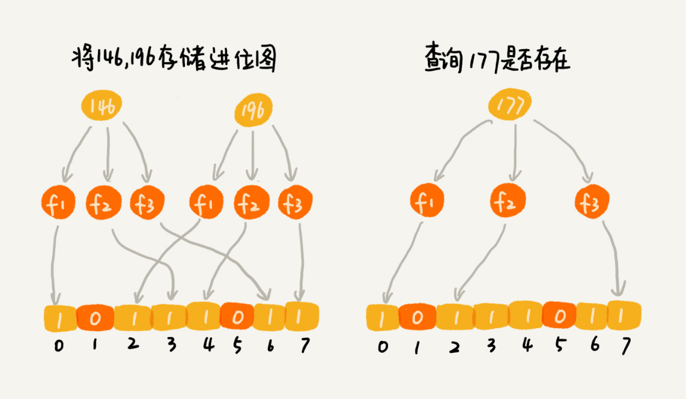

布隆过滤器的误判有一个特点，那就是，它只会对存在的情况有误判。如果某个数字经过布隆过滤器判断不存在，那说明这个数字真的不存在，不会发生误判；如果某个数字经过布隆过滤器判断存在，这个时候才会有可能误判，有可能并不存在。不过，只要我们调整哈希函数的个数、位图大小跟要存储数字的个数之间的比例，那就可以将这种误判的概率降到非常低。

尽管布隆过滤器会存在误判，但是，这并不影响它发挥大作用。很多场景对误判有一定的容忍度。比如我们今天要解决的爬虫判重这个问题，即便一个没有被爬取过的网页，被误判为已经被爬取，对于搜索引擎来说，也并不是什么大事情，是可以容忍的，毕竟网页太多了，搜索引擎也不可能 100% 都爬取到。

弄懂了布隆过滤器，我们今天的爬虫网页去重的问题，就很简单了。

我们用布隆过滤器来记录已经爬取过的网页链接，假设需要判重的网页有 10 亿，那我们可以用一个 10 倍大小的位图来存储，也就是 100 亿个二进制位，换算成字节，那就是大约 1.2GB。之前我们用散列表判重，需要至少 100GB 的空间。相比来讲，布隆过滤器在存储空间的消耗上，降低了非常多。

那我们再来看下，利用布隆过滤器，在执行效率方面，是否比散列表更加高效呢？

布隆过滤器用多个哈希函数对同一个网页链接进行处理，CPU 只需要将网页链接从内存中读取一次，进行多次哈希计算，理论上讲这组操作是 CPU 密集型的。而在散列表的处理方式中，需要读取散列值相同（散列冲突）的多个网页链接，分别跟待判重的网页链接，进行字符串匹配。这个操作涉及很多内存数据的读取，所以是内存密集型的。我们知道 CPU 计算可能是要比内存访问更快速的，所以，理论上讲，布隆过滤器的判重方式，更加快速。

## 总结引申

今天，关于搜索引擎爬虫网页去重问题的解决，我们从散列表讲到位图，再讲到布隆过滤器。布隆过滤器非常适合这种不需要 100% 准确的、允许存在小概率误判的大规模判重场景。除了爬虫网页去重这个例子，还有比如统计一个大型网站的每天的 UV 数，也就是每天有多少用户访问了网站，我们就可以使用布隆过滤器，对重复访问的用户进行去重。

我们前面讲到，布隆过滤器的误判率，主要跟哈希函数的个数、位图的大小有关。当我们往布隆过滤器中不停地加入数据之后，位图中不是 true 的位置就越来越少了，误判率就越来越高了。所以，对于无法事先知道要判重的数据个数的情况，我们需要支持自动扩容的功能。

当布隆过滤器中，数据个数与位图大小的比例超过某个阈值的时候，我们就重新申请一个新的位图。后面来的新数据，会被放置到新的位图中。但是，如果我们要判断某个数据是否在布隆过滤器中已经存在，我们就需要查看多个位图，相应的执行效率就降低了一些。

位图、布隆过滤器应用如此广泛，很多编程语言都已经实现了。比如 Java 中的 BitSet 类就是一个位图，Redis 也提供了 BitMap 位图类，Google 的 Guava 工具包提供了 BloomFilter 布隆过滤器的实现。如果你感兴趣，你可以自己去研究下这些实现的源码。

## 课后思考

假设我们有 1 亿个整数，数据范围是从 1 到 10 亿，如何快速并且省内存地给这 1 亿个数据从小到大排序？

还记得我们在哈希函数（下）讲过的利用分治思想，用散列表以及哈希函数，实现海量图库中的判重功能吗？如果我们允许小概率的误判，那是否可以用今天的布隆过滤器来解决呢？你可以参照我们当时的估算方法，重新估算下，用布隆过滤器需要多少台机器？

欢迎留言和我分享，也欢迎点击“请朋友读”，把今天的内容分享给你的好友，和他一起讨论、学习。

# 46 | 概率统计：如何利用朴素贝叶斯算法过滤垃圾短信？

王争 2019-01-11



00:00

[1.0x**](javascript:;)

讲述：修阳 大小：13.30M 时长：14:31

上一节我们讲到，如何用位图、布隆过滤器，来过滤重复的数据。今天，我们再讲一个跟过滤相关的问题，如何过滤垃圾短信？

垃圾短信和骚扰电话，我想每个人都收到过吧？买房、贷款、投资理财、开发票，各种垃圾短信和骚扰电话，不胜其扰。**如果你是一名手机应用开发工程师，让你实现一个简单的垃圾短信过滤功能以及骚扰电话拦截功能，该用什么样的数据结构和算法实现呢？**

## 算法解析

实际上，解决这个问题并不会涉及很高深的算法。今天，我就带你一块看下，如何利用简单的数据结构和算法，解决这种看似非常复杂的问题。

### 1. 基于黑名单的过滤器

我们可以维护一个骚扰电话号码和垃圾短信发送号码的黑名单。这个黑名单的收集，有很多途径，比如，我们可以从一些公开的网站上下载，也可以通过类似“360 骚扰电话拦截”的功能，通过用户自主标记骚扰电话来收集。对于被多个用户标记，并且标记个数超过一定阈值的号码，我们就可以定义为骚扰电话，并将它加入到我们的黑名单中。

如果黑名单中的电话号码不多的话，我们可以使用散列表、二叉树等动态数据结构来存储，对内存的消耗并不会很大。如果我们把每个号码看作一个字符串，并且假设平均长度是 16 个字节，那存储 50 万个电话号码，大约需要 10MB 的内存空间。即便是对于手机这样的内存有限的设备来说，这点内存的消耗也是可以接受的。

但是，如果黑名单中的电话号码很多呢？比如有 500 万个。这个时候，如果再用散列表存储，就需要大约 100MB 的存储空间。为了实现一个拦截功能，耗费用户如此多的手机内存，这显然有点儿不合理。

上一节我们讲了，布隆过滤器最大的特点就是比较省存储空间，所以，用它来解决这个问题再合适不过了。如果我们要存储 500 万个手机号码，我们把位图大小设置为 10 倍数据大小，也就是 5000 万，那也只需要使用 5000 万个二进制位（5000 万 bits），换算成字节，也就是不到 7MB 的存储空间。比起散列表的解决方案，内存的消耗减少了很多。

实际上，我们还有一种时间换空间的方法，可以将内存的消耗优化到极致。

我们可以把黑名单存储在服务器端上，把过滤和拦截的核心工作，交给服务器端来做。手机端只负责将要检查的号码发送给服务器端，服务器端通过查黑名单，判断这个号码是否应该被拦截，并将结果返回给手机端。

用这个解决思路完全不需要占用手机内存。不过，有利就有弊。我们知道，网络通信是比较慢的，所以，网络延迟就会导致处理速度降低。而且，这个方案还有个硬性要求，那就是只有在联网的情况下，才能正常工作。

基于黑名单的过滤器我就讲完了，不过，你可能还会说，布隆过滤器会有判错的概率呀！如果它把一个重要的电话或者短信，当成垃圾短信或者骚扰电话拦截了，对于用户来说，这是无法接受的。你说得没错，这是一个很大的问题。不过，我们现在先放一放，等三种过滤器都讲完之后，我再来解答。

### 2. 基于规则的过滤器

刚刚讲了一种基于黑名单的垃圾短信过滤方法，但是，如果某个垃圾短信发送者的号码并不在黑名单中，那这种方法就没办法拦截了。所以，基于黑名单的过滤方式，还不够完善，我们再继续看一种基于规则的过滤方式。

对于垃圾短信来说，我们还可以通过短信的内容，来判断某条短信是否是垃圾短信。我们预先设定一些规则，如果某条短信符合这些规则，我们就可以判定它是垃圾短信。实际上，规则可以有很多，比如下面这几个：

短信中包含特殊单词（或词语），比如一些非法、淫秽、反动词语等；

短信发送号码是群发号码，非我们正常的手机号码，比如 +60389585；

短信中包含回拨的联系方式，比如手机号码、微信、QQ、网页链接等，因为群发短信的号码一般都是无法回拨的；

短信格式花哨、内容很长，比如包含各种表情、图片、网页链接等；

符合已知垃圾短信的模板。垃圾短信一般都是重复群发，对于已经判定为垃圾短信的短信，我们可以抽象成模板，将获取到的短信与模板匹配，一旦匹配，我们就可以判定为垃圾短信。

当然，如果短信只是满足其中一条规则，如果就判定为垃圾短信，那会存在比较大的误判的情况。我们可以综合多条规则进行判断。比如，满足 2 条以上才会被判定为垃圾短信；或者每条规则对应一个不同的得分，满足哪条规则，我们就累加对应的分数，某条短信的总得分超过某个阈值，才会被判定为垃圾短信。

不过，我只是给出了一些制定规则的思路，具体落实到执行层面，其实还有很大的距离，还有很多细节需要处理。比如，第一条规则中，我们该如何定义特殊单词；第二条规则中，我们该如何定义什么样的号码是群发号码等等。限于篇幅，我就不一一详细展开来讲了。我这里只讲一下，如何定义特殊单词？

如果我们只是自己拍脑袋想，哪些单词属于特殊单词，那势必有比较大的主观性，也很容易漏掉某些单词。实际上，我们可以基于概率统计的方法，借助计算机强大的计算能力，找出哪些单词最常出现在垃圾短信中，将这些最常出现的单词，作为特殊单词，用来过滤短信。

不过这种方法的前提是，我们有大量的样本数据，也就是说，要有大量的短信（比如 1000 万条短信），并且我们还要求，每条短信都做好了标记，它是垃圾短信还是非垃圾短信。

我们对这 1000 万条短信，进行分词处理（借助中文或者英文分词算法），去掉“的、和、是”等没有意义的停用词（Stop words），得到 n 个不同的单词。针对每个单词，我们统计有多少个垃圾短信出现了这个单词，有多少个非垃圾短信会出现这个单词，进而求出每个单词出现在垃圾短信中的概率，以及出现在非垃圾短信中的概率。如果某个单词出现在垃圾短信中的概率，远大于出现在非垃圾短信中的概率，那我们就把这个单词作为特殊单词，用来过滤垃圾短信。

文字描述不好理解，我举个例子来解释一下。

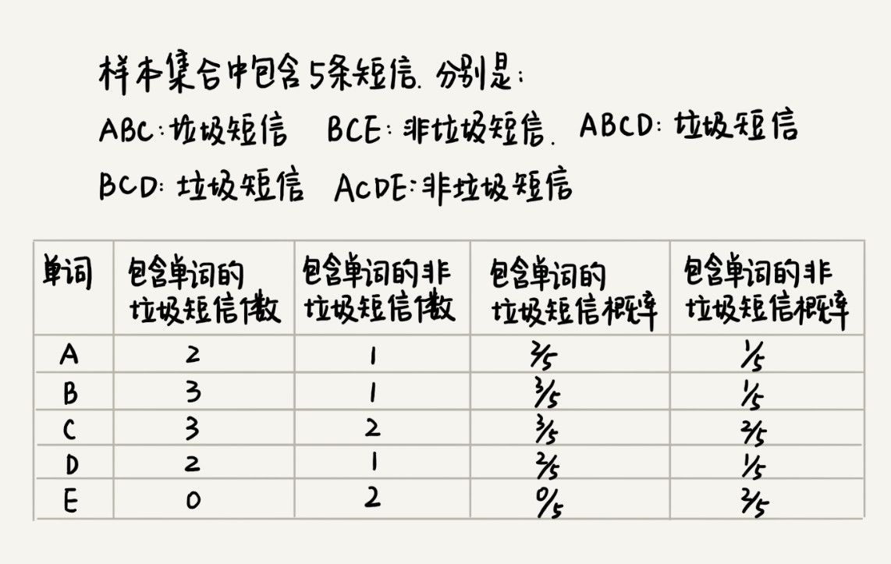

### 3. 基于概率统计的过滤器

基于规则的过滤器，看起来很直观，也很好理解，但是它也有一定的局限性。一方面，这些规则受人的思维方式局限，规则未免太过简单；另一方面，垃圾短信发送者可能会针对规则，精心设计短信，绕过这些规则的拦截。对此，我们再来看一种更加高级的过滤方式，基于概率统计的过滤方式。

这种基于概率统计的过滤方式，基础理论是基于朴素贝叶斯算法。为了让你更好地理解下面的内容，我们先通过一个非常简单的例子来看下，什么是朴素贝叶斯算法？

假设事件 A 是“小明不去上学”，事件 B 是“下雨了”。我们现在统计了一下过去 10 天的下雨情况和小明上学的情况，作为样本数据。

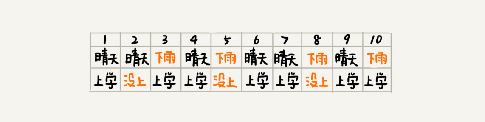

我们来分析一下，这组样本有什么规律。在这 10 天中，有 4 天下雨，所以下雨的概率 P(B)=4/10。10 天中有 3 天，小明没有去上学，所以小明不去上学的概率 P(A)=3/10。在 4 个下雨天中，小明有 2 天没去上学，所以下雨天不去上学的概率 P(A|B)=2/4。在小明没有去上学的 3 天中，有 2 天下雨了，所以小明因为下雨而不上学的概率是 P(B|A)=2/3。实际上，这 4 个概率值之间，有一定的关系，这个关系就是朴素贝叶斯算法，我们用公式表示出来，就是下面这个样子。

朴素贝叶斯算法是不是非常简单？我们用一个公式就可以将它概括。弄懂了朴素贝叶斯算法，我们再回到垃圾短信过滤这个问题上，看看如何利用朴素贝叶斯算法，来做垃圾短信的过滤。

基于概率统计的过滤器，是基于短信内容来判定是否是垃圾短信。而计算机没办法像人一样理解短信的含义。所以，我们需要把短信抽象成一组计算机可以理解并且方便计算的**特征项**，用这一组特征项代替短信本身，来做垃圾短信过滤。

我们可以通过分词算法，把一个短信分割成 n 个单词。这 n 个单词就是一组特征项，全权代表这个短信。因此，判定一个短信是否是垃圾短信这样一个问题，就变成了，判定同时包含这几个单词的短信是否是垃圾短信。

不过，这里我们并不像基于规则的过滤器那样，非黑即白，一个短信要么被判定为垃圾短信、要么被判定为非垃圾短息。我们使用概率，来表征一个短信是垃圾短信的可信程度。如果我们用公式将这个概率表示出来，就是下面这个样子：

尽管我们有大量的短信样本，但是我们没法通过样本数据统计得到这个概率。为什么不可以呢？你可能会说，我只需要统计同时包含 *W*1，*W*2，*W*3，…，*W**n* 这 n 个单词的短信有多少个（我们假设有 x 个），然后看这里面属于垃圾短信的有几个（我们假设有 y 个），那包含 *W*1，*W*2，*W*3，…，*W**n* 这 n 个单词的短信是垃圾短信的概率就是 y/x。

理想很丰满，但现实往往很骨感。你忽视了非常重要的一点，那就是样本的数量再大，毕竟也是有限的，样本中不会有太多同时包含 *W*1，*W*2，*W*3，…，*W**n* 的短信的，甚至很多时候，样本中根本不存在这样的短信。没有样本，也就无法计算概率。所以这样的推理方式虽然正确，但是实践中并不好用。

这个时候，朴素贝叶斯公式就可以派上用场了。我们通过朴素贝叶斯公式，将这个概率的求解，分解为其他三个概率的求解。你可以看我画的图。那转化之后的三个概率是否可以通过样本统计得到呢？

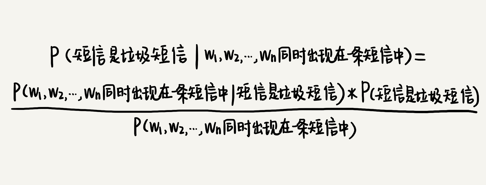

P（*W*1，*W*2，*W*3，…，*W**n* 同时出现在一条短信中 | 短信是垃圾短信）这个概率照样无法通过样本来统计得到。但是我们可以基于下面这条著名的概率规则来计算。

独立事件发生的概率计算公式：P(A*B) = P(A)*P(B)

如果事件 A 和事件 B 是独立事件，两者的发生没有相关性，事件 A 发生的概率 P(A) 等于 p1，事件 B 发生的概率 P(B) 等于 p2，那两个同时发生的概率 P(A*B) 就等于 P(A)*P(B)。

基于这条独立事件发生概率的计算公式，我们可以把 P（W1，W2，W3，…，Wn 同时出现在一条短信中 | 短信是垃圾短信）分解为下面这个公式：

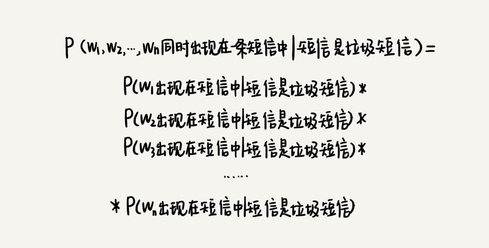

其中，P（*W**i* 出现在短信中 | 短信是垃圾短信）表示垃圾短信中包含 *W**i* 这个单词的概率有多大。这个概率值通过统计样本很容易就能获得。我们假设垃圾短信有 y 个，其中包含 *W**i* 的有 x 个，那这个概率值就等于 x/y。

P（*W*1，*W*2，*W*3，…，*W**n* 同时出现在一条短信中 | 短信是垃圾短信）这个概率值，我们就计算出来了，我们再来看下剩下两个。

P（短信是垃圾短信）表示短信是垃圾短信的概率，这个很容易得到。我们把样本中垃圾短信的个数除以总样本短信个数，就是短信是垃圾短信的概率。

不过，P（*W*1，*W*2，*W*3，…，*W**n* 同时出现在一条短信中）这个概率还是不好通过样本统计得到，原因我们前面说过了，样本空间有限。不过，我们没必要非得计算这一部分的概率值。为什么这么说呢？

实际上，我们可以分别计算同时包含 *W*1，*W*2，*W*3，…，*W**n* 这 n 个单词的短信，是垃圾短信和非垃圾短信的概率。假设它们分别是 p1 和 p2。我们并不需要单纯地基于 p1 值的大小来判断是否是垃圾短信，而是通过对比 p1 和 p2 值的大小，来判断一条短信是否是垃圾短信。更细化一点讲，那就是，如果 p1 是 p2 的很多倍（比如 10 倍），我们才确信这条短信是垃圾短信。

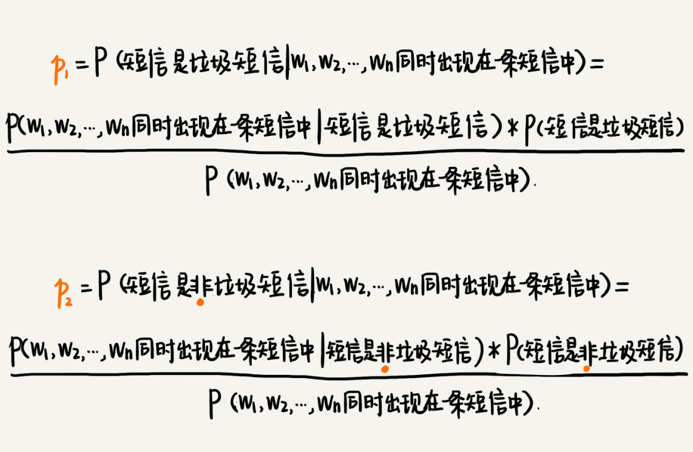

基于这两个概率的倍数来判断是否是垃圾短信的方法，我们就可以不用计算 P（*W*1，*W*2，*W*3，…，*W**n* 同时出现在一条短信中）这一部分的值了，因为计算 p1 与 p2 的时候，都会包含这个概率值的计算，所以在求解 p1 和 p2 倍数（p1/p2）的时候，我们也就不需要这个值。

## 总结引申

今天，我们讲了基于黑名单、规则、概率统计三种垃圾短信的过滤方法，实际上，今天讲的这三种方法，还可以应用到很多类似的过滤、拦截的领域，比如垃圾邮件的过滤等等。

在讲黑名单过滤的时候，我讲到布隆过滤器可能会存在误判情况，可能会导致用户投诉。实际上，我们可以结合三种不同的过滤方式的结果，对同一个短信处理，如果三者都表明这个短信是垃圾短信，我们才把它当作垃圾短信拦截过滤，这样就会更精准。

当然，在实际的工程中，我们还需要结合具体的场景，以及大量的实验，不断去调整策略，权衡垃圾短信判定的**准确率**（是否会把不是垃圾的短信错判为垃圾短信）和**召回率**（是否能把所有的垃圾短信都找到），来实现我们的需求。

## 课后思考

关于垃圾短信过滤和骚扰电话的拦截，我们可以一块儿头脑风暴一下，看看你还有没有其他方法呢？

欢迎留言和我分享，也欢迎点击“请朋友读”，把今天的内容分享给你的好友，和他一起讨论、学习。

# 47 | 向量空间：如何实现一个简单的音乐推荐系统？

王争 2019-01-14



00:00

[1.0x**](javascript:;)

讲述：修阳 大小：7.69M 时长：08:23

很多人都喜爱听歌，以前我们用 MP3 听歌，现在直接通过音乐 App 在线就能听歌。而且，各种音乐 App 的功能越来越强大，不仅可以自己选歌听，还可以根据你听歌的口味偏好，给你推荐可能会喜爱的音乐，而且有时候，推荐的音乐还非常适合你的口味，甚至会惊艳到你！如此智能的一个功能，你知道它是怎么实现的吗？

## 算法解析

实际上，要解决这个问题，并不需要特别高深的理论。解决思路的核心思想非常简单、直白，用两句话就能总结出来。

找到跟你口味偏好相似的用户，把他们爱听的歌曲推荐给你；

找出跟你喜爱的歌曲特征相似的歌曲，把这些歌曲推荐给你。

接下来，我就分别讲解一下这两种思路的具体实现方法。

### 1. 基于相似用户做推荐

如何找到跟你口味偏好相似的用户呢？或者说如何定义口味偏好相似呢？实际上，思路也很简单，我们把跟你听类似歌曲的人，看作口味相似的用户。你可以看我下面画的这个图。我用“1”表示“喜爱”，用“0”笼统地表示“不发表意见”。从图中我们可以看出，你跟小明共同喜爱的歌曲最多，有 5 首。于是，我们就可以说，小明跟你的口味非常相似。

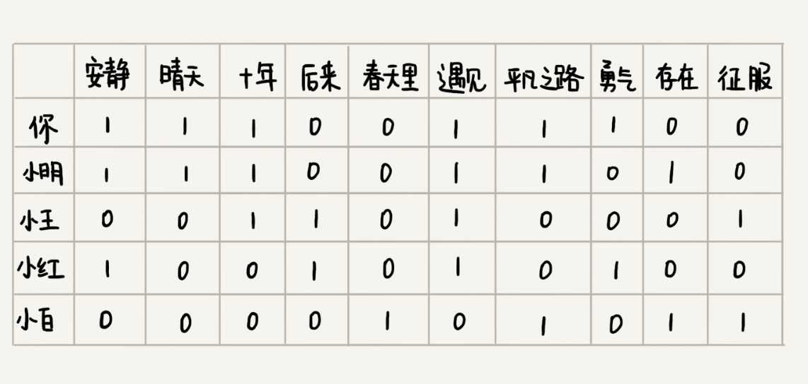

我们只需要遍历所有的用户，对比每个用户跟你共同喜爱的歌曲个数，并且设置一个阈值，如果你和某个用户共同喜爱的歌曲个数超过这个阈值，我们就把这个用户看作跟你口味相似的用户，把这个用户喜爱但你还没听过的歌曲，推荐给你。

不过，刚刚的这个解决方案中有一个问题，我们如何知道用户喜爱哪首歌曲呢？也就是说，如何定义用户对某首歌曲的喜爱程度呢？

实际上，我们可以通过用户的行为，来定义这个喜爱程度。我们给每个行为定义一个得分，得分越高表示喜爱程度越高。

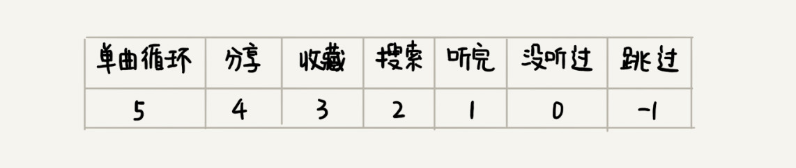

还是刚刚那个例子，我们如果把每个人对每首歌曲的喜爱程度表示出来，就是下面这个样子。图中，某个人对某首歌曲是否喜爱，我们不再用“1”或者“0”来表示，而是对应一个具体的分值。

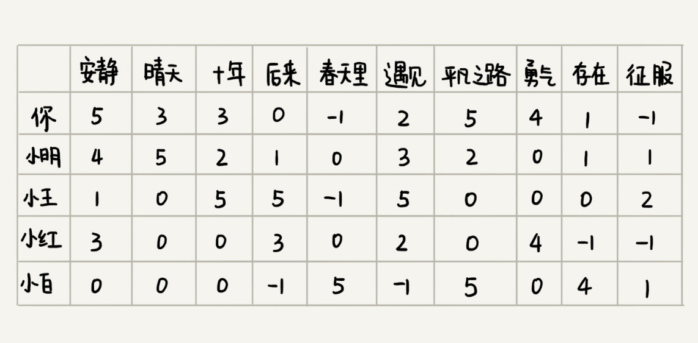

有了这样一个用户对歌曲的喜爱程度的对应表之后，如何来判断两个用户是否口味相似呢？

显然，我们不能再像之前那样，采用简单的计数来统计两个用户之间的相似度。还记得我们之前讲字符串相似度度量时，提到的编辑距离吗？这里的相似度度量，我们可以使用另外一个距离，那就是**欧几里得距离**（Euclidean distance）。欧几里得距离是用来计算两个向量之间的距离的。这个概念中有两个关键词，向量和距离，我来给你解释一下。

一维空间是一条线，我们用 1，2，3……这样单个的数，来表示一维空间中的某个位置；二维空间是一个面，我们用（1，3）（4，2）（2，2）……这样的两个数，来表示二维空间中的某个位置；三维空间是一个立体空间，我们用（1，3，5）（3，1，7）（2，4，3）……这样的三个数，来表示三维空间中的某个位置。一维、二维、三维应该都不难理解，那更高维中的某个位置该如何表示呢？

类比一维、二维、三维的表示方法，K 维空间中的某个位置，我们可以写作（*X*1，*X*2，*X*3，…，*X**K*）。这种表示方法就是**向量**（vector）。我们知道，二维、三维空间中，两个位置之间有距离的概念，类比到高纬空间，同样也有距离的概念，这就是我们说的两个向量之间的距离。

那如何计算两个向量之间的距离呢？我们还是可以类比到二维、三维空间中距离的计算方法。通过类比，我们就可以得到两个向量之间距离的计算公式。这个计算公式就是欧几里得距离的计算公式：

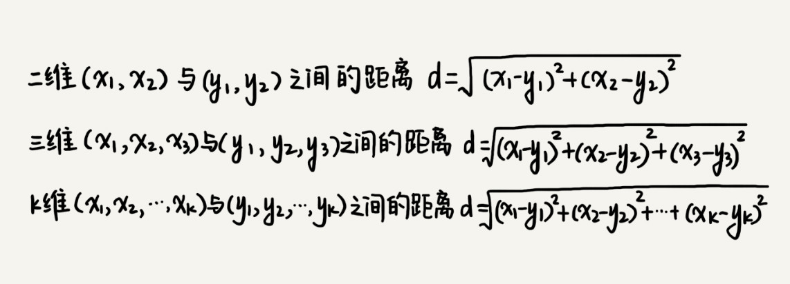

我们把每个用户对所有歌曲的喜爱程度，都用一个向量表示。我们计算出两个向量之间的欧几里得距离，作为两个用户的口味相似程度的度量。从图中的计算可以看出，小明与你的欧几里得距离距离最小，也就是说，你俩在高维空间中靠得最近，所以，我们就断定，小明跟你的口味最相似。

### 2. 基于相似歌曲做推荐

刚刚我们讲了基于相似用户的歌曲推荐方法，但是，如果用户是一个新用户，我们还没有收集到足够多的行为数据，这个时候该如何推荐呢？我们现在再来看另外一种推荐方法，基于相似歌曲的推荐方法，也就是说，如果某首歌曲跟你喜爱的歌曲相似，我们就把它推荐给你。

如何判断两首歌曲是否相似呢？对于人来说，这个事情可能会比较简单，但是对于计算机来说，判断两首歌曲是否相似，那就需要通过量化的数据来表示了。我们应该通过什么数据来量化两个歌曲之间的相似程度呢？

最容易想到的是，我们对歌曲定义一些特征项，比如是伤感的还是愉快的，是摇滚还是民谣，是柔和的还是高亢的等等。类似基于相似用户的推荐方法，我们给每个歌曲的每个特征项打一个分数，这样每个歌曲就都对应一个特征项向量。我们可以基于这个特征项向量，来计算两个歌曲之间的欧几里得距离。欧几里得距离越小，表示两个歌曲的相似程度越大。

但是，要实现这个方案，需要有一个前提，那就是我们能够找到足够多，并且能够全面代表歌曲特点的特征项，除此之外，我们还要人工给每首歌标注每个特征项的得分。对于收录了海量歌曲的音乐 App 来说，这显然是一个非常大的工程。此外，人工标注有很大的主观性，也会影响到推荐的准确性。

既然基于歌曲特征项计算相似度不可行，那我们就换一种思路。对于两首歌，如果喜欢听的人群都是差不多的，那侧面就可以反映出，这两首歌比较相似。如图所示，每个用户对歌曲有不同的喜爱程度，我们依旧通过上一个解决方案中定义得分的标准，来定义喜爱程度。

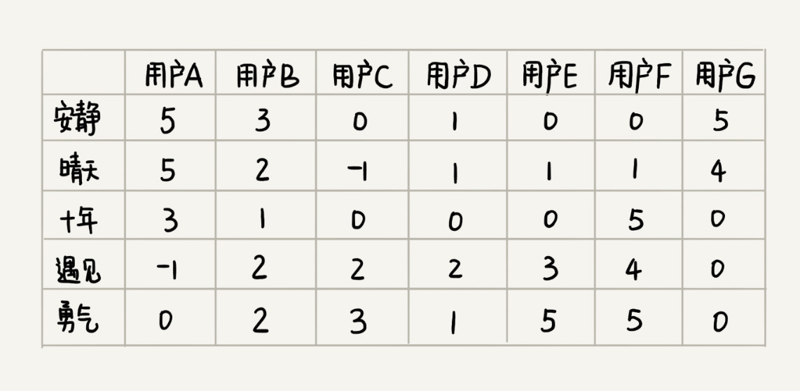

你有没有发现，这个图跟基于相似用户推荐中的图几乎一样。只不过这里把歌曲和用户主次颠倒了一下。基于相似用户的推荐方法中，针对每个用户，我们将对各个歌曲的喜爱程度作为向量。基于相似歌曲的推荐思路中，针对每个歌曲，我们将每个用户的打分作为向量。

有了每个歌曲的向量表示，我们通过计算向量之间的欧几里得距离，来表示歌曲之间的相似度。欧几里得距离越小，表示两个歌曲越相似。然后，我们就在用户已经听过的歌曲中，找出他喜爱程度较高的歌曲。然后，我们找出跟这些歌曲相似度很高的其他歌曲，推荐给他。

## 总结引申

实际上，这个问题是**推荐系统**（Recommendation System）里最典型的一类问题。之所以讲这部分内容，主要还是想给你展示，算法的强大之处，利用简单的向量空间的欧几里得距离，就能解决如此复杂的问题。不过，今天，我只给你讲解了基本的理论，实践中遇到的问题还有很多，比如冷启动问题，产品初期积累的数据不多，不足以做推荐等等。这些更加深奥的内容，你可以之后自己在实践中慢慢探索。

## 课后思考

关于今天讲的推荐算法，你还能想到其他应用场景吗？

欢迎留言和我分享，也欢迎点击“请朋友读”，把今天的内容分享给你的好友，和他一起讨论、学习。

# 48 | B+树：MySQL数据库索引是如何实现的？

王争 2019-01-16

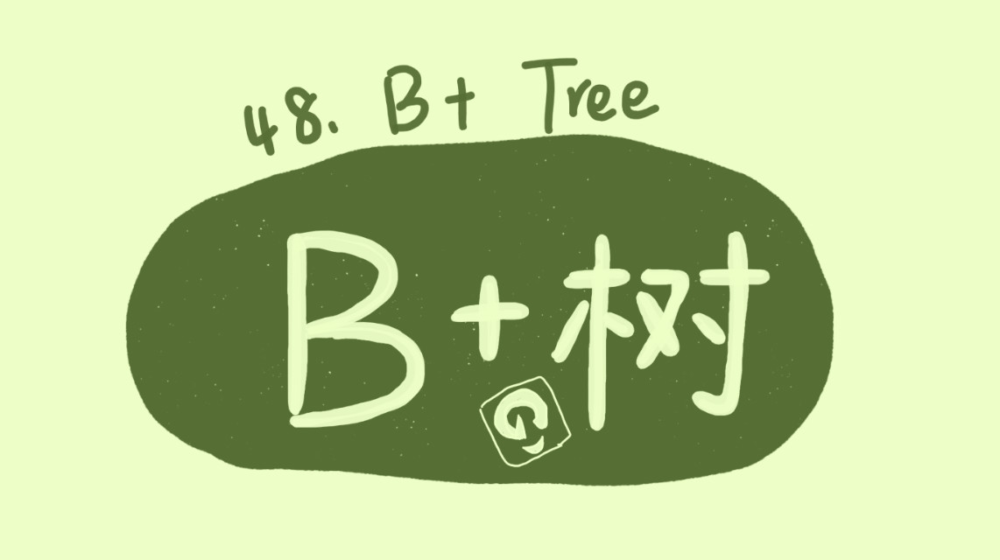



00:00

[1.0x**](javascript:;)

讲述：修阳 大小：12.30M 时长：13:25

作为一个软件开发工程师，你对数据库肯定再熟悉不过了。作为主流的数据存储系统，它在我们的业务开发中，有着举足轻重的地位。在工作中，为了加速数据库中数据的查找速度，我们常用的处理思路是，对表中数据创建索引。那你是否思考过，**数据库索引是如何实现的呢？底层使用的是什么数据结构和算法呢？**

## 算法解析

思考的过程比结论更重要。跟着我学习了这么多节课，很多同学已经意识到这一点，比如 Jerry 银银同学。我感到很开心。所以，今天的讲解，我会尽量还原这个解决方案的思考过程，让你知其然，并且知其所以然。

### 1. 解决问题的前提是定义清楚问题

如何定义清楚问题呢？除了对问题进行详细的调研，还有一个办法，那就是，通过**对一些模糊的需求进行假设，来限定****要****解决的问题的范围**。

如果你对数据库的操作非常了解，针对我们现在这个问题，你就能把索引的需求定义得非常清楚。但是，对于大部分软件工程师来说，我们可能只了解一小部分常用的 SQL 语句，所以，这里我们假设要解决的问题，只包含这样两个常用的需求：

根据某个值查找数据，比如 select * from user where id=1234；

根据区间值来查找某些数据，比如 select * from user where id > 1234 and id < 2345。

除了这些功能性需求之外，这种问题往往还会涉及一些非功能性需求，比如安全、性能、用户体验等等。限于专栏要讨论的主要是数据结构和算法，对于非功能性需求，我们着重考虑**性能方面**的需求。性能方面的需求，我们主要考察时间和空间两方面，也就是**执行效率和存储空间**。

在执行效率方面，我们希望通过索引，查询数据的效率尽可能地高；在存储空间方面，我们希望索引不要消耗太多的内存空间。

### 2. 尝试用学过的数据结构解决这个问题

问题的需求大致定义清楚了，我们现在回想一下，能否利用已经学习过的数据结构解决这个问题呢？支持快速查询、插入等操作的动态数据结构，我们已经学习过散列表、平衡二叉查找树、跳表。

我们先来看**散列表**。散列表的查询性能很好，时间复杂度是 O(1)。但是，散列表不能支持按照区间快速查找数据。所以，散列表不能满足我们的需求。

我们再来看**平衡二叉查找树**。尽管平衡二叉查找树查询的性能也很高，时间复杂度是 O(logn)。而且，对树进行中序遍历，我们还可以得到一个从小到大有序的数据序列，但这仍然不足以支持按照区间快速查找数据。

我们再来看**跳表**。跳表是在链表之上加上多层索引构成的。它支持快速地插入、查找、删除数据，对应的时间复杂度是 O(logn)。并且，跳表也支持按照区间快速地查找数据。我们只需要定位到区间起点值对应在链表中的结点，然后从这个结点开始，顺序遍历链表，直到区间终点对应的结点为止，这期间遍历得到的数据就是满足区间值的数据。

这样看来，跳表是可以解决这个问题。实际上，数据库索引所用到的数据结构跟跳表非常相似，叫作 B+ 树。不过，它是通过二叉查找树演化过来的，而非跳表。为了给你还原发明 B+ 树的整个思考过程，所以，接下来，我还要从二叉查找树讲起，看它是如何一步一步被改造成 B+ 树的。

### 3. 改造二叉查找树来解决这个问题

为了让二叉查找树支持按照区间来查找数据，我们可以对它进行这样的改造：树中的节点并不存储数据本身，而是只是作为索引。除此之外，我们把每个叶子节点串在一条链表上，链表中的数据是从小到大有序的。经过改造之后的二叉树，就像图中这样，看起来是不是很像跳表呢？

改造之后，如果我们要求某个区间的数据。我们只需要拿区间的起始值，在树中进行查找，当查找到某个叶子节点之后，我们再顺着链表往后遍历，直到链表中的结点数据值大于区间的终止值为止。所有遍历到的数据，就是符合区间值的所有数据。

但是，我们要为几千万、上亿的数据构建索引，如果将索引存储在内存中，尽管内存访问的速度非常快，查询的效率非常高，但是，占用的内存会非常多。

比如，我们给一亿个数据构建二叉查找树索引，那索引中会包含大约 1 亿个节点，每个节点假设占用 16 个字节，那就需要大约 1GB 的内存空间。给一张表建立索引，我们需要 1GB 的内存空间。如果我们要给 10 张表建立索引，那对内存的需求是无法满足的。如何解决这个索引占用太多内存的问题呢？

我们可以借助时间换空间的思路，把索引存储在硬盘中，而非内存中。我们都知道，硬盘是一个非常慢速的存储设备。通常内存的访问速度是纳秒级别的，而磁盘访问的速度是毫秒级别的。读取同样大小的数据，从磁盘中读取花费的时间，是从内存中读取所花费时间的上万倍，甚至几十万倍。

这种将索引存储在硬盘中的方案，尽管减少了内存消耗，但是在数据查找的过程中，需要读取磁盘中的索引，因此数据查询效率就相应降低很多。

二叉查找树，经过改造之后，支持区间查找的功能就实现了。不过，为了节省内存，如果把树存储在硬盘中，那么每个节点的读取（或者访问），都对应一次磁盘 IO 操作。树的高度就等于每次查询数据时磁盘 IO 操作的次数。

我们前面讲到，比起内存读写操作，磁盘 IO 操作非常耗时，所以我们优化的重点就是尽量减少磁盘 IO 操作，也就是，尽量降低树的高度。那如何降低树的高度呢？

我们来看下，如果我们把索引构建成 m 叉树，高度是不是比二叉树要小呢？如图所示，给 16 个数据构建二叉树索引，树的高度是 4，查找一个数据，就需要 4 个磁盘 IO 操作（如果根节点存储在内存中，其他节点存储在磁盘中），如果对 16 个数据构建五叉树索引，那高度只有 2，查找一个数据，对应只需要 2 次磁盘操作。如果 m 叉树中的 m 是 100，那对一亿个数据构建索引，树的高度也只是 3，最多只要 3 次磁盘 IO 就能获取到数据。磁盘 IO 变少了，查找数据的效率也就提高了。

如果我们将 m 叉树实现 B+ 树索引，用代码实现出来，就是下面这个样子（假设我们给 int 类型的数据库字段添加索引，所以代码中的 keywords 是 int 类型的）：

/**

 \* 这是B+树非叶子节点的定义。

 *

 \* 假设keywords=[3, 5, 8, 10]

 \* 4个键值将数据分为5个区间：(-INF,3), [3,5), [5,8), [8,10), [10,INF)

 \* 5个区间分别对应：children[0]...children[4]

 *

 \* m值是事先计算得到的，计算的依据是让所有信息的大小正好等于页的大小：

 \* PAGE_SIZE = (m-1)*4[keywordss大小]+m*8[children大小]

 */

public class BPlusTreeNode {

  public static int m = 5; // 5叉树

  public int[] keywords = new int[m-1]; // 键值，用来划分数据区间

  public BPlusTreeNode[] children = new BPlusTreeNode[m];//保存子节点指针

}

/**

 \* 这是B+树中叶子节点的定义。

 *

 \* B+树中的叶子节点跟内部节点是不一样的,

 \* 叶子节点存储的是值，而非区间。

 \* 这个定义里，每个叶子节点存储3个数据行的键值及地址信息。

 *

 \* k值是事先计算得到的，计算的依据是让所有信息的大小正好等于页的大小：

 \* PAGE_SIZE = k*4[keyw..大小]+k*8[dataAd..大小]+8[prev大小]+8[next大小]

 */

public class BPlusTreeLeafNode {

  public static int k = 3;

  public int[] keywords = new int[k]; // 数据的键值

  public long[] dataAddress = new long[k]; // 数据地址

  public BPlusTreeLeafNode prev; // 这个结点在链表中的前驱结点

  public BPlusTreeLeafNode next; // 这个结点在链表中的后继结点

}

我稍微解释一下这段代码。

对于相同个数的数据构建 m 叉树索引，m 叉树中的 m 越大，那树的高度就越小，那 m 叉树中的 m 是不是越大越好呢？到底多大才最合适呢？

不管是内存中的数据，还是磁盘中的数据，操作系统都是按页（一页大小通常是 4KB，这个值可以通过 getconfig PAGE_SIZE 命令查看）来读取的，一次会读一页的数据。如果要读取的数据量超过一页的大小，就会触发多次 IO 操作。所以，我们在选择 m 大小的时候，要尽量让每个节点的大小等于一个页的大小。读取一个节点，只需要一次磁盘 IO 操作。

尽管索引可以提高数据库的查询效率，但是，作为一名开发工程师，你应该也知道，索引有利也有弊，它也会让写入数据的效率下降。这是为什么呢？

数据的写入过程，会涉及索引的更新，这是索引导致写入变慢的主要原因。

对于一个 B+ 树来说，m 值是根据页的大小事先计算好的，也就是说，每个节点最多只能有 m 个子节点。在往数据库中写入数据的过程中，这样就有可能使索引中某些节点的子节点个数超过 m，这个节点的大小超过了一个页的大小，读取这样一个节点，就会导致多次磁盘 IO 操作。我们该如何解决这个问题呢？

实际上，处理思路并不复杂。我们只需要将这个节点分裂成两个节点。但是，节点分裂之后，其上层父节点的子节点个数就有可能超过 m 个。不过这也没关系，我们可以用同样的方法，将父节点也分裂成两个节点。这种级联反应会从下往上，一直影响到根节点。这个分裂过程，你可以结合着下面这个图一块看，会更容易理解（图中的 B+ 树是一个三叉树。我们限定叶子节点中，数据的个数超过 2 个就分裂节点；非叶子节点中，子节点的个数超过 3 个就分裂节点）。

正是因为要时刻保证 B+ 树索引是一个 m 叉树，所以，索引的存在会导致数据库写入的速度降低。实际上，不光写入数据会变慢，删除数据也会变慢。这是为什么呢？

我们在删除某个数据的时候，也要对应地更新索引节点。这个处理思路有点类似跳表中删除数据的处理思路。频繁的数据删除，就会导致某些节点中，子节点的个数变得非常少，长此以往，如果每个节点的子节点都比较少，势必会影响索引的效率。

我们可以设置一个阈值。在 B+ 树中，这个阈值等于 m/2。如果某个节点的子节点个数小于 m/2，我们就将它跟相邻的兄弟节点合并。不过，合并之后节点的子节点个数有可能会超过 m。针对这种情况，我们可以借助插入数据时候的处理方法，再分裂节点。

文字描述不是很直观，我举了一个删除操作的例子，你可以对比着看下（图中的 B+ 树是一个五叉树。我们限定叶子节点中，数据的个数少于 2 个就合并节点；非叶子节点中，子节点的个数少于 3 个就合并节点。）。

数据库索引以及 B+ 树的由来，到此就讲完了。你有没有发现，B+ 树的结构和操作，跟跳表非常类似。理论上讲，对跳表稍加改造，也可以替代 B+ 树，作为数据库的索引实现的。

B+ 树发明于 1972 年，跳表发明于 1989 年，我们可以大胆猜想下，跳表的作者有可能就是受了 B+ 树的启发，才发明出跳表来的。不过，这个也无从考证了。

## 总结引申

今天，我们讲解了数据库索引实现，依赖的底层数据结构，B+ 树。它通过存储在磁盘的多叉树结构，做到了时间、空间的平衡，既保证了执行效率，又节省了内存。

前面的讲解中，为了一步一步详细地给你介绍 B+ 树的由来，内容看起来比较零散。为了方便你掌握和记忆，我这里再总结一下 B+ 树的特点：

每个节点中子节点的个数不能超过 m，也不能小于 m/2；

根节点的子节点个数可以不超过 m/2，这是一个例外；

m 叉树只存储索引，并不真正存储数据，这个有点儿类似跳表；

通过链表将叶子节点串联在一起，这样可以方便按区间查找；

一般情况，根节点会被存储在内存中，其他节点存储在磁盘中。

除了 B+ 树，你可能还听说过 B 树、B- 树，我这里简单提一下。实际上，B- 树就是 B 树，英文翻译都是 B-Tree，这里的“-”并不是相对 B+ 树中的“+”，而只是一个连接符。这个很容易误解，所以我强调下。

而 B 树实际上是低级版的 B+ 树，或者说 B+ 树是 B 树的改进版。B 树跟 B+ 树的不同点主要集中在这几个地方：

B+ 树中的节点不存储数据，只是索引，而 B 树中的节点存储数据；

B 树中的叶子节点并不需要链表来串联。

也就是说，B 树只是一个每个节点的子节点个数不能小于 m/2 的 m 叉树。

## 课后思考

B+ 树中，将叶子节点串起来的链表，是单链表还是双向链表？为什么？

我们对平衡二叉查找树进行改造，将叶子节点串在链表中，就支持了按照区间来查找数据。我们在散列表（下）讲到，散列表也经常跟链表一块使用，如果我们把散列表中的结点，也用链表串起来，能否支持按照区间查找数据呢？

欢迎留言和我分享，也欢迎点击“请朋友读”，把今天的内容分享给你的好友，和他一起讨论、学习。

# 49 | 搜索：如何用A*搜索算法实现游戏中的寻路功能？

王争 2019-01-18



00:00

[1.0x**](javascript:;)

讲述：修阳 大小：9.13M 时长：09:58

魔兽世界、仙剑奇侠传这类 MMRPG 游戏，不知道你有没有玩过？在这些游戏中，有一个非常重要的功能，那就是人物角色自动寻路。**当人物处于游戏地图中的某个位置的时候，我们用鼠标点击另外一个相对较远的位置，人物就会自动地绕过障碍物走过去。玩过这么多游戏，不知你是否思考过，这个功能是怎么实现的呢？**

## 算法解析

实际上，这是一个非常典型的搜索问题。人物的起点就是他当下所在的位置，终点就是鼠标点击的位置。我们需要在地图中，找一条从起点到终点的路径。这条路径要绕过地图中所有障碍物，并且看起来要是一种非常聪明的走法。所谓“聪明”，笼统地解释就是，走的路不能太绕。理论上讲，最短路径显然是最聪明的走法，是这个问题的最优解。

不过，在第 44 节最优出行路线规划问题中，我们也讲过，如果图非常大，那 Dijkstra 最短路径算法的执行耗时会很多。在真实的软件开发中，我们面对的是超级大的地图和海量的寻路请求，算法的执行效率太低，这显然是无法接受的。

实际上，像出行路线规划、游戏寻路，这些真实软件开发中的问题，一般情况下，我们都不需要非得求最优解（也就是最短路径）。在权衡路线规划质量和执行效率的情况下，我们只需要寻求一个次优解就足够了。那**如何快速找出一条接近于最短路线的次优路线呢？**

这个快速的路径规划算法，就是我们今天要学习的 **A\* 算法**。实际上，A* 算法是对 Dijkstra 算法的优化和改造。如何将 Dijkstra 算法改造成 A* 算法呢？为了更好地理解接下来要讲的内容，我建议你先温习下第 44 节中的 Dijkstra 算法的实现原理。

Dijkstra 算法有点儿类似 BFS 算法，它每次找到跟起点最近的顶点，往外扩展。这种往外扩展的思路，其实有些盲目。为什么这么说呢？我举一个例子来给你解释一下。下面这个图对应一个真实的地图，每个顶点在地图中的位置，我们用一个二维坐标（x，y）来表示，其中，x 表示横坐标，y 表示纵坐标。

在 Dijkstra 算法的实现思路中，我们用一个优先级队列，来记录已经遍历到的顶点以及这个顶点与起点的路径长度。顶点与起点路径长度越小，就越先被从优先级队列中取出来扩展，从图中举的例子可以看出，尽管我们找的是从 s 到 t 的路线，但是最先被搜索到的顶点依次是 1，2，3。通过肉眼来观察，这个搜索方向跟我们期望的路线方向（s 到 t 是从西向东）是反着的，路线搜索的方向明显“跑偏”了。

之所以会“跑偏”，那是因为我们是按照顶点与起点的路径长度的大小，来安排出队列顺序的。与起点越近的顶点，就会越早出队列。我们并没有考虑到这个顶点到终点的距离，所以，在地图中，尽管 1，2，3 三个顶点离起始顶点最近，但离终点却越来越远。

如果我们综合更多的因素，把这个顶点到终点可能还要走多远，也考虑进去，综合来判断哪个顶点该先出队列，那是不是就可以避免“跑偏”呢？

当我们遍历到某个顶点的时候，从起点走到这个顶点的路径长度是确定的，我们记作 g(i)（i 表示顶点编号）。但是，从这个顶点到终点的路径长度，我们是未知的。虽然确切的值无法提前知道，但是我们可以用其他估计值来代替。

这里我们可以通过这个顶点跟终点之间的直线距离，也就是欧几里得距离，来近似地估计这个顶点跟终点的路径长度（注意：路径长度跟直线距离是两个概念）。我们把这个距离记作 h(i)（i 表示这个顶点的编号），专业的叫法是**启发函数**（heuristic function）。因为欧几里得距离的计算公式，会涉及比较耗时的开根号计算，所以，我们一般通过另外一个更加简单的距离计算公式，那就是**曼哈顿距离**（Manhattan distance）。曼哈顿距离是两点之间横纵坐标的距离之和。计算的过程只涉及加减法、符号位反转，所以比欧几里得距离更加高效。

int hManhattan(Vertex v1, Vertex v2) { // Vertex表示顶点，后面有定义

  return Math.abs(v1.x - v2.x) + Math.abs(v1.y - v2.y);

}

原来只是单纯地通过顶点与起点之间的路径长度 g(i)，来判断谁先出队列，现在有了顶点到终点的路径长度估计值，我们通过两者之和 f(i)=g(i)+h(i)，来判断哪个顶点该最先出队列。综合两部分，我们就能有效避免刚刚讲的“跑偏”。这里 f(i) 的专业叫法是**估价函数**（evaluation function）。

从刚刚的描述，我们可以发现，A* 算法就是对 Dijkstra 算法的简单改造。实际上，代码实现方面，我们也只需要稍微改动几行代码，就能把 Dijkstra 算法的代码实现，改成 A* 算法的代码实现。

在 A* 算法的代码实现中，顶点 Vertex 类的定义，跟 Dijkstra 算法中的定义，稍微有点儿区别，多了 x，y 坐标，以及刚刚提到的 f(i) 值。图 Graph 类的定义跟 Dijkstra 算法中的定义一样。为了避免重复，我这里就没有再贴出来了。

private class Vertex {

  public int id; // 顶点编号ID

  public int dist; // 从起始顶点，到这个顶点的距离，也就是g(i)

  public int f; // 新增：f(i)=g(i)+h(i)

  public int x, y; // 新增：顶点在地图中的坐标（x, y）

  public Vertex(int id, int x, int y) {

​    this.id = id;

​    this.x = x;

​    this.y = y;

​    this.f = Integer.MAX_VALUE;

​    this.dist = Integer.MAX_VALUE;

  }

}

// Graph类的成员变量，在构造函数中初始化

Vertex[] vertexes = new Vertex[this.v];

// 新增一个方法，添加顶点的坐标

public void addVetex(int id, int x, int y) {

  vertexes[id] = new Vertex(id, x, y)

}

A* 算法的代码实现的主要逻辑是下面这段代码。它跟 Dijkstra 算法的代码实现，主要有 3 点区别：

优先级队列构建的方式不同。A* 算法是根据 f 值（也就是刚刚讲到的 f(i)=g(i)+h(i)）来构建优先级队列，而 Dijkstra 算法是根据 dist 值（也就是刚刚讲到的 g(i)）来构建优先级队列；

A* 算法在更新顶点 dist 值的时候，会同步更新 f 值；

循环结束的条件也不一样。Dijkstra 算法是在终点出队列的时候才结束，A* 算法是一旦遍历到终点就结束。

public void astar(int s, int t) { // 从顶点s到顶点t的路径

  int[] predecessor = new int[this.v]; // 用来还原路径

  // 按照vertex的f值构建的小顶堆，而不是按照dist

  PriorityQueue queue = new PriorityQueue(this.v);

  boolean[] inqueue = new boolean[this.v]; // 标记是否进入过队列

  vertexes[s].dist = 0;

  vertexes[s].f = 0;

  queue.add(vertexes[s]);

  inqueue[s] = true;

  while (!queue.isEmpty()) {

​    Vertex minVertex = queue.poll(); // 取堆顶元素并删除

​    for (int i = 0; i < adj[minVertex.id].size(); ++i) {

​      Edge e = adj[minVertex.id].get(i); // 取出一条minVetex相连的边

​      Vertex nextVertex = vertexes[e.tid]; // minVertex-->nextVertex

​      if (minVertex.dist + e.w < nextVertex.dist) { // 更新next的dist,f

​        nextVertex.dist = minVertex.dist + e.w;

​        nextVertex.f 

​           = nextVertex.dist+hManhattan(nextVertex, vertexes[t]);

​        predecessor[nextVertex.id] = minVertex.id;

​        if (inqueue[nextVertex.id] == true) {

​          queue.update(nextVertex);

​        } else {

​          queue.add(nextVertex);

​          inqueue[nextVertex.id] = true;

​        }

​      }

​      if (nextVertex.id == t) { // 只要到达t就可以结束while了

​        queue.clear(); // 清空queue，才能推出while循环

​        break; 

​      }

​    }

  }

  // 输出路径

  System.out.print(s);

  print(s, t, predecessor); // print函数请参看Dijkstra算法的实现

}

**尽管 A\* 算法可以更加快速地找到从起点到终点的路线，但是它并不能像 Dijkstra 算法那样，找到最短路线。这是为什么呢？**

要找出起点 s 到终点 t 的最短路径，最简单的方法是，通过回溯穷举所有从 s 到达 t 的不同路径，然后对比找出最短的那个。不过很显然，回溯算法的执行效率非常低，是指数级的。

Dijkstra 算法在此基础之上，利用动态规划的思想，对回溯搜索进行了剪枝，只保留起点到某个顶点的最短路径，继续往外扩展搜索。动态规划相较于回溯搜索，只是换了一个实现思路，但它实际上也考察到了所有从起点到终点的路线，所以才能得到最优解。

A* 算法之所以不能像 Dijkstra 算法那样，找到最短路径，主要原因是两者的 while 循环结束条件不一样。刚刚我们讲过，Dijkstra 算法是在终点出队列的时候才结束，A* 算法是一旦遍历到终点就结束。对于 Dijkstra 算法来说，当终点出队列的时候，终点的 dist 值是优先级队列中所有顶点的最小值，即便再运行下去，终点的 dist 值也不会再被更新了。对于 A* 算法来说，一旦遍历到终点，我们就结束 while 循环，这个时候，终点的 dist 值未必是最小值。

A* 算法利用贪心算法的思路，每次都找 f 值最小的顶点出队列，一旦搜索到终点就不在继续考察其他顶点和路线了。所以，它并没有考察所有的路线，也就不可能找出最短路径了。

搞懂了 A* 算法，我们再来看下，**如何借助 A\* 算法解决今天的游戏寻路问题？**

要利用 A* 算法解决这个问题，我们只需要把地图，抽象成图就可以了。不过，游戏中的地图跟第 44 节中讲的我们平常用的地图是不一样的。因为游戏中的地图并不像我们现实生活中那样，存在规划非常清晰的道路，更多的是宽阔的荒野、草坪等。所以，我们没法利用 44 节中讲到的抽象方法，把岔路口抽象成顶点，把道路抽象成边。

实际上，我们可以换一种抽象的思路，把整个地图分割成一个一个的小方块。在某一个方块上的人物，只能往上下左右四个方向的方块上移动。我们可以把每个方块看作一个顶点。两个方块相邻，我们就在它们之间，连两条有向边，并且边的权值都是 1。所以，这个问题就转化成了，在一个有向有权图中，找某个顶点到另一个顶点的路径问题。将地图抽象成边权值为 1 的有向图之后，我们就可以套用 A* 算法，来实现游戏中人物的自动寻路功能了。

## 总结引申

我们今天讲的 A* 算法属于一种**启发式搜索算法**（Heuristically Search Algorithm）。实际上，启发式搜索算法并不仅仅只有 A* 算法，还有很多其他算法，比如 IDA* 算法、蚁群算法、遗传算法、模拟退火算法等。如果感兴趣，你可以自行研究下。

启发式搜索算法利用估价函数，避免“跑偏”，贪心地朝着最有可能到达终点的方向前进。这种算法找出的路线，并不是最短路线。但是，实际的软件开发中的路线规划问题，我们往往并不需要非得找最短路线。所以，鉴于启发式搜索算法能很好地平衡路线质量和执行效率，它在实际的软件开发中的应用更加广泛。实际上，在第 44 节中，我们讲到的地图 App 中的出行路线规划问题，也可以利用启发式搜索算法来实现。

## 课后思考

我们之前讲的“迷宫问题”是否可以借助 A* 算法来更快速地找到一个走出去的路线呢？如果可以，请具体讲讲该怎么来做；如果不可以，请说说原因。

欢迎留言和我分享，也欢迎点击“请朋友读”，把今天的内容分享给你的好友，和他一起讨论、学习。

# 50 | 索引：如何在海量数据中快速查找某个数据？

王争 2019-01-21

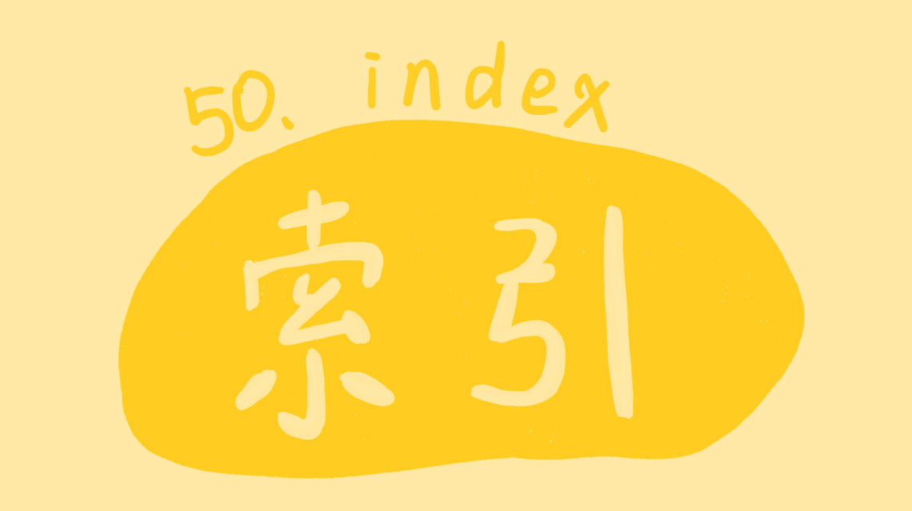



00:00

[1.0x**](javascript:;)

讲述：修阳 大小：9.36M 时长：10:12

在第 48 节中，我们讲了 MySQL 数据库索引的实现原理。MySQL 底层依赖的是 B+ 树这种数据结构。留言里有同学问我，那**类似 Redis 这样的 Key-Value 数据库中的索引，又是怎么实现的呢？底层依赖的又是什么数据结构呢？**

今天，我就来讲一下索引这种常用的技术解决思路，底层往往会依赖哪些数据结构。同时，通过索引这个应用场景，我也带你回顾一下，之前我们学过的几种支持动态集合的数据结构。

## 为什么需要索引？

在实际的软件开发中，业务纷繁复杂，功能千变万化，但是，万变不离其宗。如果抛开这些业务和功能的外壳，其实它们的本质都可以抽象为“对数据的存储和计算”。对应到数据结构和算法中，那“存储”需要的就是数据结构，“计算”需要的就是算法。

对于存储的需求，功能上无外乎增删改查。这其实并不复杂。但是，一旦存储的数据很多，那性能就成了这些系统要关注的重点，特别是在一些跟存储相关的基础系统（比如 MySQL 数据库、分布式文件系统等）、中间件（比如消息中间件 RocketMQ 等）中。

“如何节省存储空间、如何提高数据增删改查的执行效率”，这样的问题就成了设计的重点。而这些系统的实现，都离不开一个东西，那就是**索引**。不夸张地说，索引设计得好坏，直接决定了这些系统是否优秀。

索引这个概念，非常好理解。你可以类比书籍的目录来理解。如果没有目录，我们想要查找某个知识点的时候，就要一页一页翻。通过目录，我们就可以快速定位相关知识点的页数，查找的速度也会有质的提高。

## 索引的需求定义

索引的概念不难理解，我想你应该已经搞明白。接下来，我们就分析一下，在设计索引的过程中，需要考虑到的一些因素，换句话说就是，我们该如何定义清楚需求呢？

对于系统设计需求，我们一般可以从**功能性需求**和**非功能性需求**两方面来分析，这个我们之前也说过。因此，这个问题也不例外。

### 1. 功能性需求

对于功能性需求需要考虑的点，我把它们大致概括成下面这几点。

**数据是格式化数据还是非格式化数据**？要构建索引的原始数据，类型有很多。我把它分为两类，一类是结构化数据，比如，MySQL 中的数据；另一类是非结构化数据，比如搜索引擎中网页。对于非结构化数据，我们一般需要做预处理，提取出查询关键词，对关键词构建索引。

**数据是静态数据还是动态数据**？如果原始数据是一组静态数据，也就是说，不会有数据的增加、删除、更新操作，所以，我们在构建索引的时候，只需要考虑查询效率就可以了。这样，索引的构建就相对简单些。不过，大部分情况下，我们都是对动态数据构建索引，也就是说，我们不仅要考虑到索引的查询效率，在原始数据更新的同时，我们还需要动态地更新索引。支持动态数据集合的索引，设计起来相对也要更加复杂些。

**索引存储在内存还是硬盘**？如果索引存储在内存中，那查询的速度肯定要比存储在磁盘中的高。但是，如果原始数据量很大的情况下，对应的索引可能也会很大。这个时候，因为内存有限，我们可能就不得不将索引存储在磁盘中了。实际上，还有第三种情况，那就是一部分存储在内存，一部分存储在磁盘，这样就可以兼顾内存消耗和查询效率。

**单值查找还是区间查找**？所谓单值查找，也就是根据查询关键词等于某个值的数据。这种查询需求最常见。所谓区间查找，就是查找关键词处于某个区间值的所有数据。你可以类比 MySQL 数据库的查询需求，自己想象一下。实际上，不同的应用场景，查询的需求会多种多样。

**单关键词查找还是多关键词组合查找**？比如，搜索引擎中构建的索引，既要支持一个关键词的查找，比如“数据结构”，也要支持组合关键词查找，比如“数据结构 AND 算法”。对于单关键词的查找，索引构建起来相对简单些。对于多关键词查询来说，要分多种情况。像 MySQL 这种结构化数据的查询需求，我们可以实现针对多个关键词的组合，建立索引；对于像搜索引擎这样的非结构数据的查询需求，我们可以针对单个关键词构建索引，然后通过集合操作，比如求并集、求交集等，计算出多个关键词组合的查询结果。

实际上，不同的场景，不同的原始数据，对于索引的需求也会千差万别。我这里只列举了一些比较有共性的需求。

### 2. 非功能性需求

讲完了功能性需求，我们再来看，索引设计的非功能性需求。

**不管是存储在内存中还是磁盘中，索引对存储空间的消耗不能过大**。如果存储在内存中，索引对占用存储空间的限制就会非常苛刻。毕竟内存空间非常有限，一个中间件启动后就占用几个 GB 的内存，开发者显然是无法接受的。如果存储在硬盘中，那索引对占用存储空间的限制，稍微会放宽一些。但是，我们也不能掉以轻心。因为，有时候，索引对存储空间的消耗会超过原始数据。

**在考虑索引查询效率的同时，我们还要考虑索引的维护成本**。索引的目的是提高查询效率，但是，基于动态数据集合构建的索引，我们还要考虑到，索引的维护成本。因为在原始数据动态增删改的同时，我们也需要动态地更新索引。而索引的更新势必会影响到增删改操作的性能。

## 构建索引常用的数据结构有哪些？

我刚刚从很宏观的角度，总结了在索引设计的过程中，需要考虑的一些共性因素。现在，我们就来看，对于不同需求的索引结构，底层一般使用哪种数据结构。

实际上，常用来构建索引的数据结构，就是我们之前讲过的几种支持动态数据集合的数据结构。比如，散列表、红黑树、跳表、B+ 树。除此之外，位图、布隆过滤器可以作为辅助索引，有序数组可以用来对静态数据构建索引。

我们知道，**散列表**增删改查操作的性能非常好，时间复杂度是 O(1)。一些键值数据库，比如 Redis、Memcache，就是使用散列表来构建索引的。这类索引，一般都构建在内存中。

**红黑树**作为一种常用的平衡二叉查找树，数据插入、删除、查找的时间复杂度是 O(logn)，也非常适合用来构建内存索引。Ext 文件系统中，对磁盘块的索引，用的就是红黑树。

**B+ 树**比起红黑树来说，更加适合构建存储在磁盘中的索引。B+ 树是一个多叉树，所以，对相同个数的数据构建索引，B+ 树的高度要低于红黑树。当借助索引查询数据的时候，读取 B+ 树索引，需要的磁盘 IO 次数会更少。所以，大部分关系型数据库的索引，比如 MySQL、Oracle，都是用 B+ 树来实现的。

**跳表**也支持快速添加、删除、查找数据。而且，我们通过灵活调整索引结点个数和数据个数之间的比例，可以很好地平衡索引对内存的消耗及其查询效率。Redis 中的有序集合，就是用跳表来构建的。

除了散列表、红黑树、B+ 树、跳表之外，位图和布隆过滤器这两个数据结构，也可以用于索引中，辅助存储在磁盘中的索引，加速数据查找的效率。我们来看下，具体是怎么做的？

我们知道，**布隆过滤器**有一定的判错率。但是，我们可以规避它的短处，发挥它的长处。尽管对于判定存在的数据，有可能并不存在，但是对于判定不存在的数据，那肯定就不存在。而且，布隆过滤器还有一个更大的特点，那就是内存占用非常少。我们可以针对数据，构建一个布隆过滤器，并且存储在内存中。当要查询数据的时候，我们可以先通过布隆过滤器，判定是否存在。如果通过布隆过滤器判定数据不存在，那我们就没有必要读取磁盘中的索引了。对于数据不存在的情况，数据查询就更加快速了。

实际上，有序数组也可以被作为索引。如果数据是静态的，也就是不会有插入、删除、更新操作，那我们可以把数据的关键词（查询用的）抽取出来，组织成有序数组，然后利用二分查找算法来快速查找数据。

## 总结引申

今天这节算是一节总结课。我从索引这个非常常用的技术方案，给你展示了散列表、红黑树、跳表、位图、布隆过滤器、有序数组这些数据结构的应用场景。学习完这节课之后，不知道你对这些数据结构以及索引，有没有更加清晰的认识呢？

从这一节内容中，你应该可以看出，架构设计离不开数据结构和算法。要想成长为一个优秀的业务架构师、基础架构师，数据结构和算法的根基一定要打稳。因为，那些看似很惊艳的架构设计思路，实际上，都是来自最常用的数据结构和算法。

## 课后思考

你知道基础系统、中间件、开源软件等系统中，有哪些用到了索引吗？这些系统的索引是如何实现的呢？

欢迎留言和我分享，也欢迎点击“请朋友读”，把今天的内容分享给你的好友，和他一起讨论、学习。

# 51 | 并行算法：如何利用并行处理提高算法的执行效率？

王争 2019-01-23



00:00

[1.0x**](javascript:;)

讲述：修阳 大小：9.10M 时长：09:55

时间复杂度是衡量算法执行效率的一种标准。但是，时间复杂度并不能跟性能划等号。在真实的软件开发中，即便在不降低时间复杂度的情况下，也可以通过一些优化手段，提升代码的执行效率。毕竟，对于实际的软件开发来说，即便是像 10%、20% 这样微小的性能提升，也是非常可观的。

算法的目的就是为了提高代码执行的效率。那**当算法无法再继续优化的情况下，我们该如何来进一步提高执行效率呢**？我们今天就讲一种非常简单但又非常好用的优化方法，那就是并行计算。今天，我就通过几个例子，给你展示一下，**如何借助并行计算的处理思想对算法进行改造？**

## 并行排序

假设我们要给大小为 8GB 的数据进行排序，并且，我们机器的内存可以一次性容纳这么多数据。对于排序来说，最常用的就是时间复杂度为 O(nlogn) 的三种排序算法，归并排序、快速排序、堆排序。从理论上讲，这个排序问题，已经很难再从算法层面优化了。而利用并行的处理思想，我们可以很轻松地将这个给 8GB 数据排序问题的执行效率提高很多倍。具体的实现思路有下面两种。

**第一种是对归并排序并行化处理**。我们可以将这 8GB 的数据划分成 16 个小的数据集合，每个集合包含 500MB 的数据。我们用 16 个线程，并行地对这 16 个 500MB 的数据集合进行排序。这 16 个小集合分别排序完成之后，我们再将这 16 个有序集合合并。

**第二种是对快速排序并行化处理**。我们通过扫描一遍数据，找到数据所处的范围区间。我们把这个区间从小到大划分成 16 个小区间。我们将 8GB 的数据划分到对应的区间中。针对这 16 个小区间的数据，我们启动 16 个线程，并行地进行排序。等到 16 个线程都执行结束之后，得到的数据就是有序数据了。

对比这两种处理思路，它们利用的都是分治的思想，对数据进行分片，然后并行处理。它们的区别在于，第一种处理思路是，先随意地对数据分片，排序之后再合并。第二种处理思路是，先对数据按照大小划分区间，然后再排序，排完序就不需要再处理了。这个跟归并和快排的区别如出一辙。

这里我还要多说几句，如果要排序的数据规模不是 8GB，而是 1TB，那问题的重点就不是算法的执行效率了，而是数据的读取效率。因为 1TB 的数据肯定是存在硬盘中，无法一次性读取到内存中，这样在排序的过程中，就会有频繁地磁盘数据的读取和写入。如何减少磁盘的 IO 操作，减少磁盘数据读取和写入的总量，就变成了优化的重点。不过这个不是我们这节要讨论的重点，你可以自己思考下。

## 并行查找

我们知道，散列表是一种非常适合快速查找的数据结构。

如果我们是给动态数据构建索引，在数据不断加入的时候，散列表的装载因子就会越来越大。为了保证散列表性能不下降，我们就需要对散列表进行动态扩容。对如此大的散列表进行动态扩容，一方面比较耗时，另一方面比较消耗内存。比如，我们给一个 2GB 大小的散列表进行扩容，扩展到原来的 1.5 倍，也就是 3GB 大小。这个时候，实际存储在散列表中的数据只有不到 2GB，所以内存的利用率只有 60%，有 1GB 的内存是空闲的。

实际上，我们可以将数据随机分割成 k 份（比如 16 份），每份中的数据只有原来的 1/k，然后我们针对这 k 个小数据集合分别构建散列表。这样，散列表的维护成本就变低了。当某个小散列表的装载因子过大的时候，我们可以单独对这个散列表进行扩容，而其他散列表不需要进行扩容。

还是刚才那个例子，假设现在有 2GB 的数据，我们放到 16 个散列表中，每个散列表中的数据大约是 150MB。当某个散列表需要扩容的时候，我们只需要额外增加 150*0.5=75MB 的内存（假设还是扩容到原来的 1.5 倍）。无论从扩容的执行效率还是内存的利用率上，这种多个小散列表的处理方法，都要比大散列表高效。

当我们要查找某个数据的时候，我们只需要通过 16 个线程，并行地在这 16 个散列表中查找数据。这样的查找性能，比起一个大散列表的做法，也并不会下降，反倒有可能提高。

当往散列表中添加数据的时候，我们可以选择将这个新数据放入装载因子最小的那个散列表中，这样也有助于减少散列冲突。

## 并行字符串匹配

我们前面学过，在文本中查找某个关键词这样一个功能，可以通过字符串匹配算法来实现。我们之前学过的字符串匹配算法有 KMP、BM、RK、BF 等。当在一个不是很长的文本中查找关键词的时候，这些字符串匹配算法中的任何一个，都可以表现得非常高效。但是，如果我们处理的是超级大的文本，那处理的时间可能就会变得很长，那有没有办法加快匹配速度呢？

我们可以把大的文本，分割成 k 个小文本。假设 k 是 16，我们就启动 16 个线程，并行地在这 16 个小文本中查找关键词，这样整个查找的性能就提高了 16 倍。16 倍效率的提升，从理论的角度来说并不多。但是，对于真实的软件开发来说，这显然是一个非常可观的优化。

不过，这里还有一个细节要处理，那就是原本包含在大文本中的关键词，被一分为二，分割到两个小文本中，这就会导致尽管大文本中包含这个关键词，但在这 16 个小文本中查找不到它。实际上，这个问题也不难解决，我们只需要针对这种特殊情况，做一些特殊处理就可以了。

我们假设关键词的长度是 m。我们在每个小文本的结尾和开始各取 m 个字符串。前一个小文本的末尾 m 个字符和后一个小文本的开头 m 个字符，组成一个长度是 2m 的字符串。我们再拿关键词，在这个长度为 2m 的字符串中再重新查找一遍，就可以补上刚才的漏洞了。

## 并行搜索

前面我们学习过好几种搜索算法，它们分别是广度优先搜索、深度优先搜索、Dijkstra 最短路径算法、A* 启发式搜索算法。对于广度优先搜索算法，我们也可以将其改造成并行算法。

广度优先搜索是一种逐层搜索的搜索策略。基于当前这一层顶点，我们可以启动多个线程，并行地搜索下一层的顶点。在代码实现方面，原来广度优先搜索的代码实现，是通过一个队列来记录已经遍历到但还没有扩展的顶点。现在，经过改造之后的并行广度优先搜索算法，我们需要利用两个队列来完成扩展顶点的工作。

假设这两个队列分别是队列 A 和队列 B。多线程并行处理队列 A 中的顶点，并将扩展得到的顶点存储在队列 B 中。等队列 A 中的顶点都扩展完成之后，队列 A 被清空，我们再并行地扩展队列 B 中的顶点，并将扩展出来的顶点存储在队列 A。这样两个队列循环使用，就可以实现并行广度优先搜索算法。

## 总结引申

上一节，我们通过实际软件开发中的“索引”这一技术点，回顾了之前学过的一些支持动态数据集合的数据结构。今天，我们又通过“并行算法”这个话题，回顾了之前学过的一些算法。

今天的内容比较简单，没有太复杂的知识点。我通过一些例子，比如并行排序、查找、搜索、字符串匹配，给你展示了并行处理的实现思路，也就是对数据进行分片，对没有依赖关系的任务，并行地执行。

并行计算是一个工程上的实现思路，尽管跟算法关系不大，但是，在实际的软件开发中，它确实可以非常巧妙地提高程序的运行效率，是一种非常好用的性能优化手段。

特别是，当要处理的数据规模达到一定程度之后，我们无法通过继续优化算法，来提高执行效率 的时候，我们就需要在实现的思路上做文章，利用更多的硬件资源，来加快执行的效率。所以，在很多超大规模数据处理中，并行处理的思想，应用非常广泛，比如 MapReduce 实际上就是一种并行计算框架。

## 课后思考

假设我们有 n 个任务，为了提高执行的效率，我们希望能并行执行任务，但是各个任务之间又有一定的依赖关系，如何根据依赖关系找出可以并行执行的任务？

欢迎留言和我分享，也欢迎点击“请朋友读”，把今天的内容分享给你的好友，和他一起讨论、学习。

# 52 | 算法实战（一）：剖析Redis常用数据类型对应的数据结构

王争 2019-01-25

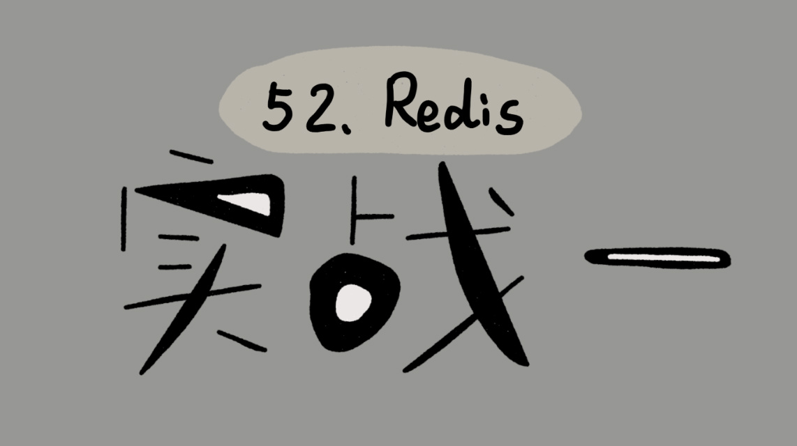



00:00

[1.0x**](javascript:;)

讲述：修阳 大小：11.01M 时长：12:00

到此为止，专栏前三部分我们全部讲完了。从今天开始，我们就正式进入实战篇的部分。这部分我主要通过一些开源项目、经典系统，真枪实弹地教你，如何将数据结构和算法应用到项目中。所以这部分的内容，更多的是知识点的回顾，相对于基础篇、高级篇的内容，其实这部分会更加容易看懂。

不过，我希望你不要只是看懂就完了。你要多举一反三地思考，自己接触过的开源项目、基础框架、中间件中，都用过哪些数据结构和算法。你也可以想一想，在自己做的项目中，有哪些可以用学过的数据结构和算法进一步优化。这样的学习效果才会更好。

好了，今天我就带你一块儿看下，**经典数据库 Redis 中的常用数据类型，底层都是用哪种数据结构实现的？**

## Redis 数据库介绍

Redis 是一种键值（Key-Value）数据库。相对于关系型数据库（比如 MySQL），Redis 也被叫作**非关系型数据库**。

像 MySQL 这样的关系型数据库，表的结构比较复杂，会包含很多字段，可以通过 SQL 语句，来实现非常复杂的查询需求。而 Redis 中只包含“键”和“值”两部分，只能通过“键”来查询“值”。正是因为这样简单的存储结构，也让 Redis 的读写效率非常高。

除此之外，Redis 主要是作为内存数据库来使用，也就是说，数据是存储在内存中的。尽管它经常被用作内存数据库，但是，它也支持将数据存储在硬盘中。这一点，我们后面会介绍。

Redis 中，键的数据类型是字符串，但是为了丰富数据存储的方式，方便开发者使用，值的数据类型有很多，常用的数据类型有这样几种，它们分别是字符串、列表、字典、集合、有序集合。

“字符串（string）”这种数据类型非常简单，对应到数据结构里，就是**字符串**。你应该非常熟悉，这里我就不多介绍了。我们着重看下，其他四种比较复杂点的数据类型，看看它们底层都依赖了哪些数据结构。

## 列表（list）

我们先来看列表。列表这种数据类型支持存储一组数据。这种数据类型对应两种实现方法，一种是**压缩列表**（ziplist），另一种是双向循环链表。

当列表中存储的数据量比较小的时候，列表就可以采用压缩列表的方式实现。具体需要同时满足下面两个条件：

列表中保存的单个数据（有可能是字符串类型的）小于 64 字节；

列表中数据个数少于 512 个。

关于压缩列表，我这里稍微解释一下。它并不是基础数据结构，而是 Redis 自己设计的一种数据存储结构。它有点儿类似数组，通过一片连续的内存空间，来存储数据。不过，它跟数组不同的一点是，它允许存储的数据大小不同。具体的存储结构也非常简单，你可以看我下面画的这幅图。

现在，我们来看看，压缩列表中的“压缩”两个字该如何理解？

听到“压缩”两个字，直观的反应就是节省内存。之所以说这种存储结构节省内存，是相较于数组的存储思路而言的。我们知道，数组要求每个元素的大小相同，如果我们要存储不同长度的字符串，那我们就需要用最大长度的字符串大小作为元素的大小（假设是 20 个字节）。那当我们存储小于 20 个字节长度的字符串的时候，便会浪费部分存储空间。听起来有点儿拗口，我画个图解释一下。

压缩列表这种存储结构，一方面比较节省内存，另一方面可以支持不同类型数据的存储。而且，因为数据存储在一片连续的内存空间，通过键来获取值为列表类型的数据，读取的效率也非常高。

当列表中存储的数据量比较大的时候，也就是不能同时满足刚刚讲的两个条件的时候，列表就要通过双向循环链表来实现了。

在链表里，我们已经讲过双向循环链表这种数据结构了，如果不记得了，你可以先回去复习一下。这里我们着重看一下 Redis 中双向链表的编码实现方式。

Redis 的这种双向链表的实现方式，非常值得借鉴。它额外定义一个 list 结构体，来组织链表的首、尾指针，还有长度等信息。这样，在使用的时候就会非常方便。

// 以下是C语言代码，因为Redis是用C语言实现的。

typedef struct listnode {

  struct listNode *prev;

  struct listNode *next;

  void *value;

} listNode;

typedef struct list {

  listNode *head;

  listNode *tail;

  unsigned long len;

  // ....省略其他定义

} list;

## 字典（hash）

字典类型用来存储一组数据对。每个数据对又包含键值两部分。字典类型也有两种实现方式。一种是我们刚刚讲到的**压缩列表**，另一种是**散列表**。

同样，只有当存储的数据量比较小的情况下，Redis 才使用压缩列表来实现字典类型。具体需要满足两个条件：

字典中保存的键和值的大小都要小于 64 字节；

字典中键值对的个数要小于 512 个。

当不能同时满足上面两个条件的时候，Redis 就使用散列表来实现字典类型。Redis 使用MurmurHash2这种运行速度快、随机性好的哈希算法作为哈希函数。对于哈希冲突问题，Redis 使用链表法来解决。除此之外，Redis 还支持散列表的动态扩容、缩容。

当数据动态增加之后，散列表的装载因子会不停地变大。为了避免散列表性能的下降，当装载因子大于 1 的时候，Redis 会触发扩容，将散列表扩大为原来大小的 2 倍左右（具体值需要计算才能得到，如果感兴趣，你可以去阅读源码）。

当数据动态减少之后，为了节省内存，当装载因子小于 0.1 的时候，Redis 就会触发缩容，缩小为字典中数据个数的大约 2 倍大小（这个值也是计算得到的，如果感兴趣，你也可以去阅读源码）。

我们前面讲过，扩容缩容要做大量的数据搬移和哈希值的重新计算，所以比较耗时。针对这个问题，Redis 使用我们在散列表（中）讲的渐进式扩容缩容策略，将数据的搬移分批进行，避免了大量数据一次性搬移导致的服务停顿。

## 集合（set）

集合这种数据类型用来存储一组不重复的数据。这种数据类型也有两种实现方法，一种是基于有序数组，另一种是基于散列表。

当要存储的数据，同时满足下面这样两个条件的时候，Redis 就采用有序数组，来实现集合这种数据类型。

存储的数据都是整数；

存储的数据元素个数不超过 512 个。

当不能同时满足这两个条件的时候，Redis 就使用散列表来存储集合中的数据。

## 有序集合（sortedset）

有序集合这种数据类型，我们在跳表里已经详细讲过了。它用来存储一组数据，并且每个数据会附带一个得分。通过得分的大小，我们将数据组织成跳表这样的数据结构，以支持快速地按照得分值、得分区间获取数据。

实际上，跟 Redis 的其他数据类型一样，有序集合也并不仅仅只有跳表这一种实现方式。当数据量比较小的时候，Redis 会用压缩列表来实现有序集合。具体点说就是，使用压缩列表来实现有序集合的前提，有这样两个：

所有数据的大小都要小于 64 字节；

元素个数要小于 128 个。

## 数据结构持久化

尽管 Redis 经常会被用作内存数据库，但是，它也支持数据落盘，也就是将内存中的数据存储到硬盘中。这样，当机器断电的时候，存储在 Redis 中的数据也不会丢失。在机器重新启动之后，Redis 只需要再将存储在硬盘中的数据，重新读取到内存，就可以继续工作了。

刚刚我们讲到，Redis 的数据格式由“键”和“值”两部分组成。而“值”又支持很多数据类型，比如字符串、列表、字典、集合、有序集合。像字典、集合等类型，底层用到了散列表，散列表中有指针的概念，而指针指向的是内存中的存储地址。 那 Redis 是如何将这样一个跟具体内存地址有关的数据结构存储到磁盘中的呢？

实际上，Redis 遇到的这个问题并不特殊，很多场景中都会遇到。我们把它叫作**数据结构的持久化问题**，或者**对象的持久化问题**。这里的“持久化”，你可以笼统地理解为“存储到磁盘”。

如何将数据结构持久化到硬盘？我们主要有两种解决思路。

第一种是清除原有的存储结构，只将数据存储到磁盘中。当我们需要从磁盘还原数据到内存的时候，再重新将数据组织成原来的数据结构。实际上，Redis 采用的就是这种持久化思路。

不过，这种方式也有一定的弊端。那就是数据从硬盘还原到内存的过程，会耗用比较多的时间。比如，我们现在要将散列表中的数据存储到磁盘。当我们从磁盘中，取出数据重新构建散列表的时候，需要重新计算每个数据的哈希值。如果磁盘中存储的是几 GB 的数据，那重构数据结构的耗时就不可忽视了。

第二种方式是保留原来的存储格式，将数据按照原有的格式存储在磁盘中。我们拿散列表这样的数据结构来举例。我们可以将散列表的大小、每个数据被散列到的槽的编号等信息，都保存在磁盘中。有了这些信息，我们从磁盘中将数据还原到内存中的时候，就可以避免重新计算哈希值。

## 总结引申

今天，我们学习了 Redis 中常用数据类型底层依赖的数据结构，总结一下大概有这五种：**压缩列表**（可以看作一种特殊的数组）、**有序数组**、**链表**、**散列表**、**跳表**。实际上，Redis 就是这些常用数据结构的封装。

你有没有发现，有了数据结构和算法的基础之后，再去阅读 Redis 的源码，理解起来就容易多了？很多原来觉得很深奥的设计思想，是不是就都会觉得顺理成章了呢？

还是那句话，夯实基础很重要。同样是看源码，有些人只能看个热闹，了解一些皮毛，无法形成自己的知识结构，不能化为己用，过不几天就忘了。而有些人基础很好，不但能知其然，还能知其所以然，从而真正理解作者设计的动机。这样不但能有助于我们理解所用的开源软件，还能为我们自己创新添砖加瓦。

## 课后思考

你有没有发现，在数据量比较小的情况下，Redis 中的很多数据类型，比如字典、有序集合等，都是通过多种数据结构来实现的，为什么会这样设计呢？用一种固定的数据结构来实现，不是更加简单吗？

我们讲到数据结构持久化有两种方法。对于二叉查找树这种数据结构，我们如何将它持久化到磁盘中呢？

欢迎留言和我分享，也欢迎点击“请朋友读”，把今天的内容分享给你的好友，和他一起讨论、学习。

# 53 | 算法实战（二）：剖析搜索引擎背后的经典数据结构和算法

王争 2019-01-28



00:00

[1.0x**](javascript:;)

讲述：修阳 大小：17.16M 时长：18:44

像百度、Google 这样的搜索引擎，在我们平时的工作、生活中，几乎天天都会用到。如果我们把搜索引擎也当作一个互联网产品的话，那它跟社交、电商这些类型的产品相比，有一个非常大的区别，那就是，它是一个技术驱动的产品。所谓技术驱动是指，搜索引擎实现起来，技术难度非常大，技术的好坏直接决定了这个产品的核心竞争力。

在搜索引擎的设计与实现中，会用到大量的算法。有很多针对特定问题的算法，也有很多我们专栏中讲到的基础算法。所以，百度、Google 这样的搜索引擎公司，在面试的时候，会格外重视考察候选人的算法能力。

**今天我就借助搜索引擎，这样一个非常有技术含量的产品，来给你展示一下，数据结构和算法是如何应用在其中的。**

## 整体系统介绍

像 Google 这样的大型商用搜索引擎，有成千上万的工程师，十年如一日地对它进行优化改进，所以，它所包含的技术细节非常多。我很难、也没有这个能力，通过一篇文章把所有细节都讲清楚，当然这也不是我们专栏所专注的内容。

所以，接下来的讲解，我主要给你展示，如何在一台机器上（假设这台机器的内存是 8GB， 硬盘是 100 多 GB），通过少量的代码，实现一个小型搜索引擎。不过，麻雀虽小，五脏俱全。跟大型搜索引擎相比，实现这样一个小型搜索引擎所用到的理论基础是相通的。

搜索引擎大致可以分为四个部分：**搜集**、**分析**、**索引**、**查询**。其中，搜集，就是我们常说的利用爬虫爬取网页。分析，主要负责网页内容抽取、分词，构建临时索引，计算 PageRank 值这几部分工作。索引，主要负责通过分析阶段得到的临时索引，构建倒排索引。查询，主要负责响应用户的请求，根据倒排索引获取相关网页，计算网页排名，返回查询结果给用户。

接下来，我就按照网页处理的生命周期，从这四个阶段，依次来给你讲解，一个网页从被爬取到最终展示给用户，这样一个完整的过程。与此同时，我会穿插讲解，这个过程中需要用到哪些数据结构和算法。

## 搜集

现在，互联网越来越发达，网站越来越多，对应的网页也就越来越多。对于搜索引擎来说，它事先并不知道网页都在哪里。打个比方来说就是，我们只知道海里面有很多鱼，但却并不知道鱼在哪里。那搜索引擎是如何爬取网页的呢？

搜索引擎把整个互联网看作数据结构中的有向图，把每个页面看作一个顶点。如果某个页面中包含另外一个页面的链接，那我们就在两个顶点之间连一条有向边。我们可以利用图的遍历搜索算法，来遍历整个互联网中的网页。

我们前面介绍过两种图的遍历方法，深度优先和广度优先。搜索引擎采用的是广度优先搜索策略。具体点讲的话，那就是，我们先找一些比较知名的网页（专业的叫法是权重比较高）的链接（比如新浪主页网址、腾讯主页网址等），作为种子网页链接，放入到队列中。爬虫按照广度优先的策略，不停地从队列中取出链接，然后去爬取对应的网页，解析出网页里包含的其他网页链接，再将解析出来的链接添加到队列中。

基本的原理就是这么简单。但落实到实现层面，还有很多技术细节。我下面借助搜集阶段涉及的几个重要文件，来给你解释一下搜集工程都有哪些关键技术细节。

### 1. 待爬取网页链接文件：links.bin

在广度优先搜索爬取页面的过程中，爬虫会不停地解析页面链接，将其放到队列中。于是，队列中的链接就会越来越多，可能会多到内存放不下。所以，我们用一个存储在磁盘中的文件（links.bin）来作为广度优先搜索中的队列。爬虫从 links.bin 文件中，取出链接去爬取对应的页面。等爬取到网页之后，将解析出来的链接，直接存储到 links.bin 文件中。

这样用文件来存储网页链接的方式，还有其他好处。比如，支持断点续爬。也就是说，当机器断电之后，网页链接不会丢失；当机器重启之后，还可以从之前爬取到的位置继续爬取。

关于如何解析页面获取链接，我额外多说几句。我们可以把整个页面看作一个大的字符串，然后利用字符串匹配算法，在这个大字符串中，搜索<link>这样一个网页标签，然后顺序读取<link></link>之间的字符串。这其实就是网页链接。

### 2. 网页判重文件：bloom_filter.bin

如何避免重复爬取相同的网页呢？这个问题我们在位图那一节已经讲过了。使用布隆过滤器，我们就可以快速并且非常节省内存地实现网页的判重。

不过，还是刚刚那个问题，如果我们把布隆过滤器存储在内存中，那机器宕机重启之后，布隆过滤器就被清空了。这样就可能导致大量已经爬取的网页会被重复爬取。

这个问题该怎么解决呢？我们可以定期地（比如每隔半小时）将布隆过滤器持久化到磁盘中，存储在 bloom_filter.bin 文件中。这样，即便出现机器宕机，也只会丢失布隆过滤器中的部分数据。当机器重启之后，我们就可以重新读取磁盘中的 bloom_filter.bin 文件，将其恢复到内存中。

### 3. 原始网页存储文件：doc_raw.bin

爬取到网页之后，我们需要将其存储下来，以备后面离线分析、索引之用。那如何存储海量的原始网页数据呢？

如果我们把每个网页都存储为一个独立的文件，那磁盘中的文件就会非常多，数量可能会有几千万，甚至上亿。常用的文件系统显然不适合存储如此多的文件。所以，我们可以把多个网页存储在一个文件中。每个网页之间，通过一定的标识进行分隔，方便后续读取。具体的存储格式，如下图所示。其中，doc_id 这个字段是网页的编号，我们待会儿再解释。

当然，这样的一个文件也不能太大，因为文件系统对文件的大小也有一定的限制。所以，我们可以设置每个文件的大小不能超过一定的值（比如 1GB）。随着越来越多的网页被添加到文件中，文件的大小就会越来越大，当超过 1GB 的时候，我们就创建一个新的文件，用来存储新爬取的网页。

假设一台机器的硬盘大小是 100GB 左右，一个网页的平均大小是 64KB。那在一台机器上，我们可以存储 100 万到 200 万左右的网页。假设我们的机器的带宽是 10MB，那下载 100GB 的网页，大约需要 10000 秒。也就是说，爬取 100 多万的网页，也就是只需要花费几小时的时间。

### 4. 网页链接及其编号的对应文件：doc_id.bin

刚刚我们提到了网页编号这个概念，我现在解释一下。网页编号实际上就是给每个网页分配一个唯一的 ID，方便我们后续对网页进行分析、索引。那如何给网页编号呢？

我们可以按照网页被爬取的先后顺序，从小到大依次编号。具体是这样做的：我们维护一个中心的计数器，每爬取到一个网页之后，就从计数器中拿一个号码，分配给这个网页，然后计数器加一。在存储网页的同时，我们将网页链接跟编号之间的对应关系，存储在另一个 doc_id.bin 文件中。

**爬虫在爬取网页的过程中，涉及的四个重要的文件，我就介绍完了。其中，links.bin 和 bloom_filter.bin 这两个文件是爬虫自身所用的。另外的两个（doc_raw.bin、doc_id.bin）是作为搜集阶段的成果，供后面的分析、索引、查询用的。**

## 分析

网页爬取下来之后，我们需要对网页进行离线分析。分析阶段主要包括两个步骤，第一个是抽取网页文本信息，第二个是分词并创建临时索引。我们逐一来讲解。

### 1. 抽取网页文本信息

网页是半结构化数据，里面夹杂着各种标签、JavaScript 代码、CSS 样式。对于搜索引擎来说，它只关心网页中的文本信息，也就是，网页显示在浏览器中时，能被用户肉眼看到的那部分信息。我们如何从半结构化的网页中，抽取出搜索引擎关系的文本信息呢？

我们之所以把网页叫作半结构化数据，是因为它本身是按照一定的规则来书写的。这个规则就是 **HTML 语法规范**。我们依靠 HTML 标签来抽取网页中的文本信息。这个抽取的过程，大体可以分为两步。

第一步是去掉 JavaScript 代码、CSS 格式以及下拉框中的内容（因为下拉框在用户不操作的情况下，也是看不到的）。也就是，，<option></option>这三组标签之间的内容。我们可以利用 AC 自动机这种多模式串匹配算法，在网页这个大字符串中，一次性查找, </script>, </option）为止。而这期间遍历到的字符串连带着标签就应该从网页中删除。

第二步是去掉所有 HTML 标签。这一步也是通过字符串匹配算法来实现的。过程跟第一步类似，我就不重复讲了。

### 2. 分词并创建临时索引

经过上面的处理之后，我们就从网页中抽取出了我们关心的文本信息。接下来，我们要对文本信息进行分词，并且创建临时索引。

对于英文网页来说，分词非常简单。我们只需要通过空格、标点符号等分隔符，将每个单词分割开来就可以了。但是，对于中文来说，分词就复杂太多了。我这里介绍一种比较简单的思路，基于字典和规则的分词方法。

其中，字典也叫词库，里面包含大量常用的词语（我们可以直接从网上下载别人整理好的）。我们借助词库并采用最长匹配规则，来对文本进行分词。所谓最长匹配，也就是匹配尽可能长的词语。我举个例子解释一下。

比如要分词的文本是“中国人民解放了”，我们词库中有“中国”“中国人”“中国人民”“中国人民解放军”这几个词，那我们就取最长匹配，也就是“中国人民”划为一个词，而不是把“中国”、“中国人”划为一个词。具体到实现层面，我们可以将词库中的单词，构建成 Trie 树结构，然后拿网页文本在 Trie 树中匹配。

每个网页的文本信息在分词完成之后，我们都得到一组单词列表。我们把单词与网页之间的对应关系，写入到一个临时索引文件中（tmp_Index.bin），这个临时索引文件用来构建倒排索引文件。临时索引文件的格式如下：

在临时索引文件中，我们存储的是单词编号，也就是图中的 term_id，而非单词本身。这样做的目的主要是为了节省存储的空间。那这些单词的编号是怎么来的呢？

给单词编号的方式，跟给网页编号类似。我们维护一个计数器，每当从网页文本信息中分割出一个新的单词的时候，我们就从计数器中取一个编号，分配给它，然后计数器加一。

在这个过程中，我们还需要使用散列表，记录已经编过号的单词。在对网页文本信息分词的过程中，我们拿分割出来的单词，先到散列表中查找，如果找到，那就直接使用已有的编号；如果没有找到，我们再去计数器中拿号码，并且将这个新单词以及编号添加到散列表中。

当所有的网页处理（分词及写入临时索引）完成之后，我们再将这个单词跟编号之间的对应关系，写入到磁盘文件中，并命名为 term_id.bin。

**经过分析阶段，我们得到了两个重要的文件。它们分别是临时索引文件（tmp_index.bin）和单词编号文件（term_id.bin）。**

## 索引

索引阶段主要负责将分析阶段产生的临时索引，构建成倒排索引。倒排索引（ Inverted index）中记录了每个单词以及包含它的网页列表。文字描述比较难理解，我画了一张倒排索引的结构图，你一看就明白。

我们刚刚讲到，在临时索引文件中，记录的是单词跟每个包含它的文档之间的对应关系。那如何通过临时索引文件，构建出倒排索引文件呢？这是一个非常典型的算法问题，你可以先自己思考一下，再看我下面的讲解。

解决这个问题的方法有很多。考虑到临时索引文件很大，无法一次性加载到内存中，搜索引擎一般会选择使用**多路归并排序**的方法来实现。

我们先对临时索引文件，按照单词编号的大小进行排序。因为临时索引很大，所以一般基于内存的排序算法就没法处理这个问题了。我们可以用之前讲到的归并排序的处理思想，将其分割成多个小文件，先对每个小文件独立排序，最后再合并在一起。当然，实际的软件开发中，我们其实可以直接利用 MapReduce 来处理。

临时索引文件排序完成之后，相同的单词就被排列到了一起。我们只需要顺序地遍历排好序的临时索引文件，就能将每个单词对应的网页编号列表找出来，然后把它们存储在倒排索引文件中。具体的处理过程，我画成了一张图。通过图，你应该更容易理解。

除了倒排文件之外，我们还需要一个文件，来记录每个单词编号在倒排索引文件中的偏移位置。我们把这个文件命名为 term_offset.bin。这个文件的作用是，帮助我们快速地查找某个单词编号在倒排索引中存储的位置，进而快速地从倒排索引中读取单词编号对应的网页编号列表。

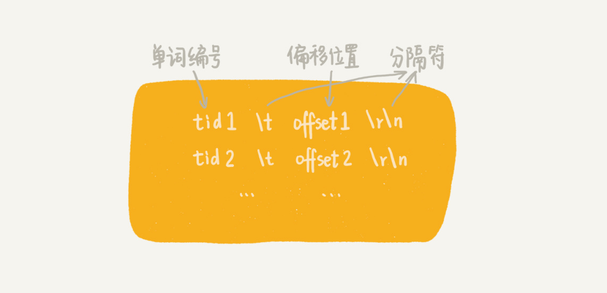

**经过索引阶段的处理，我们得到了两个有价值的文件，它们分别是倒排索引文件（index.bin）和记录单词编号在索引文件中的偏移位置的文件（term_offset.bin）。**

## 查询

前面三个阶段的处理，只是为了最后的查询做铺垫。因此，现在我们就要利用之前产生的几个文件，来实现最终的用户搜索功能。

doc_id.bin：记录网页链接和编号之间的对应关系。

term_id.bin：记录单词和编号之间的对应关系。

index.bin：倒排索引文件，记录每个单词编号以及对应包含它的网页编号列表。

term_offsert.bin：记录每个单词编号在倒排索引文件中的偏移位置。

这四个文件中，除了倒排索引文件（index.bin）比较大之外，其他的都比较小。为了方便快速查找数据，我们将其他三个文件都加载到内存中，并且组织成散列表这种数据结构。

当用户在搜索框中，输入某个查询文本的时候，我们先对用户输入的文本进行分词处理。假设分词之后，我们得到 k 个单词。

我们拿这 k 个单词，去 term_id.bin 对应的散列表中，查找对应的单词编号。经过这个查询之后，我们得到了这 k 个单词对应的单词编号。

我们拿这 k 个单词编号，去 term_offset.bin 对应的散列表中，查找每个单词编号在倒排索引文件中的偏移位置。经过这个查询之后，我们得到了 k 个偏移位置。

我们拿这 k 个偏移位置，去倒排索引（index.bin）中，查找 k 个单词对应的包含它的网页编号列表。经过这一步查询之后，我们得到了 k 个网页编号列表。

我们针对这 k 个网页编号列表，统计每个网页编号出现的次数。具体到实现层面，我们可以借助散列表来进行统计。统计得到的结果，我们按照出现次数的多少，从小到大排序。出现次数越多，说明包含越多的用户查询单词（用户输入的搜索文本，经过分词之后的单词）。

经过这一系列查询，我们就得到了一组排好序的网页编号。我们拿着网页编号，去 doc_id.bin 文件中查找对应的网页链接，分页显示给用户就可以了。

## 总结引申

今天，我给你展示了一个小型搜索引擎的设计思路。这只是一个搜索引擎设计的基本原理，有很多优化、细节我们并未涉及，比如计算网页权重的PageRank算法、计算查询结果排名的tf-idf模型等等。

在讲解的过程中，我们涉及的数据结构和算法有：图、散列表、Trie 树、布隆过滤器、单模式字符串匹配算法、AC 自动机、广度优先遍历、归并排序等。如果对其中哪些内容不清楚，你可以回到对应的章节进行复习。

最后，如果有时间的话，我强烈建议你，按照我的思路，自己写代码实现一个简单的搜索引擎。这样写出来的，即便只是一个 demo，但对于你深入理解数据结构和算法，也是很有帮助的。

## 课后思考

图的遍历方法有两种，深度优先和广度优先。我们讲到，搜索引擎中的爬虫是通过广度优先策略来爬取网页的。搜索引擎为什么选择广度优先策略，而不是深度优先策略呢？

大部分搜索引擎在结果显示的时候，都支持摘要信息和网页快照。实际上，你只需要对我今天讲的设计思路，稍加改造，就可以支持这两项功能。你知道如何改造吗？

欢迎留言和我分享，也欢迎点击“请朋友读”，把今天的内容分享给你的好友，和他一起讨论、学习。

# 54 | 算法实战（三）：剖析高性能队列Disruptor背后的数据结构和算法

王争 2019-01-30

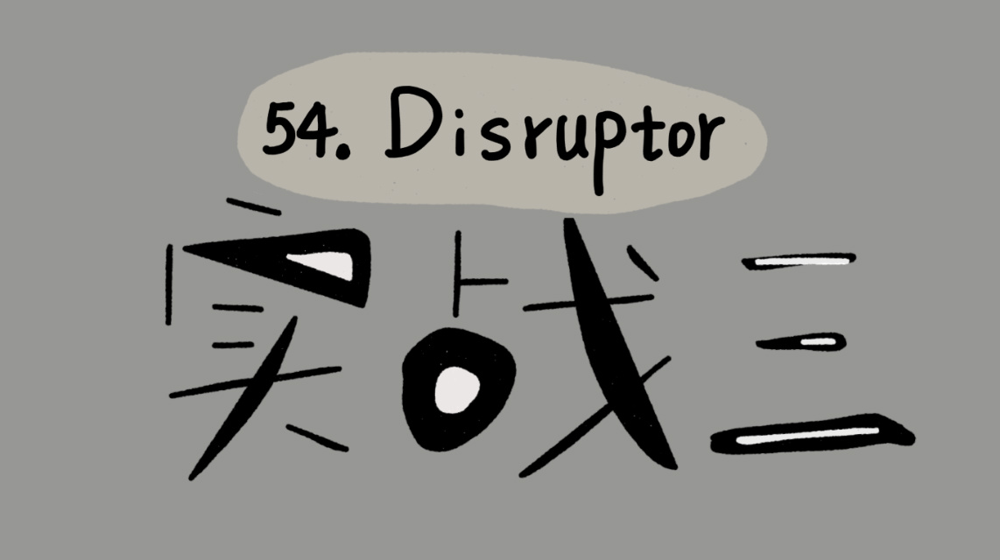



00:00

[1.0x**](javascript:;)

讲述：修阳 大小：10.99M 时长：11:59

Disruptor 你是否听说过呢？它是一种内存消息队列。从功能上讲，它其实有点儿类似 Kafka。不过，和 Kafka 不同的是，Disruptor 是线程之间用于消息传递的队列。它在 Apache Storm、Camel、Log4j 2 等很多知名项目中都有广泛应用。

之所以如此受青睐，主要还是因为它的性能表现非常优秀。它比 Java 中另外一个非常常用的内存消息队列 ArrayBlockingQueue（ABS）的性能，要高一个数量级，可以算得上是最快的内存消息队列了。它还因此获得过 Oracle 官方的 Duke 大奖。

如此高性能的内存消息队列，在设计和实现上，必然有它独到的地方。今天，我们就来一块儿看下，**Disruptor 是如何做到如此高性能的？其底层依赖了哪些数据结构和算法？**

## 基于循环队列的“生产者 - 消费者模型”

什么是内存消息队列？对很多业务工程师或者前端工程师来说，可能会比较陌生。不过，如果我说“生产者 - 消费者模型”，估计大部分人都知道。在这个模型中，“生产者”生产数据，并且将数据放到一个中心存储容器中。之后，“消费者”从中心存储容器中，取出数据消费。

这个模型非常简单、好理解，那你有没有思考过，这里面存储数据的中心存储容器，是用什么样的数据结构来实现的呢？

实际上，实现中心存储容器最常用的一种数据结构，就是我们在第 9 节讲的队列。队列支持数据的先进先出。正是这个特性，使得数据被消费的顺序性可以得到保证，也就是说，早被生产的数据就会早被消费。

我们在第 9 节讲过，队列有两种实现思路。一种是基于链表实现的链式队列，另一种是基于数组实现的顺序队列。不同的需求背景下，我们会选择不同的实现方式。

如果我们要实现一个无界队列，也就是说，队列的大小事先不确定，理论上可以支持无限大。这种情况下，我们适合选用链表来实现队列。因为链表支持快速地动态扩容。如果我们要实现一个有界队列，也就是说，队列的大小事先确定，当队列中数据满了之后，生产者就需要等待。直到消费者消费了数据，队列有空闲位置的时候，生产者才能将数据放入。

实际上，相较于无界队列，有界队列的应用场景更加广泛。毕竟，我们的机器内存是有限的。而无界队列占用的内存数量是不可控的。对于实际的软件开发来说，这种不可控的因素，就会有潜在的风险。在某些极端情况下，无界队列就有可能因为内存持续增长，而导致 OOM（Out of Memory）错误。

在第 9 节中，我们还讲过一种特殊的顺序队列，循环队列。我们讲过，非循环的顺序队列在添加、删除数据的工程中，会涉及数据的搬移操作，导致性能变差。而循环队列正好可以解决这个数据搬移的问题，所以，性能更加好。所以，大部分用到顺序队列的场景中，我们都选择用顺序队列中的循环队列。

实际上，**循环队列这种数据结构，就是我们今天要讲的内存消息队列的雏形。**我借助循环队列，实现了一个最简单的“生产者 - 消费者模型”。对应的代码我贴到这里，你可以看看。

为了方便你理解，对于生产者和消费者之间操作的同步，我并没有用到线程相关的操作。而是采用了“当队列满了之后，生产者就轮训等待；当队列空了之后，消费者就轮训等待”这样的措施。

public class Queue {

  private Long[] data;

  private int size = 0, head = 0, tail = 0;

  public Queue(int size) {

​    this.data = new Long[size];

​    this.size = size;

  }

  public boolean add(Long element) {

​    if ((tail + 1) % size == head) return false;

​    data[tail] = element;

​    tail = (tail + 1) % size;

​    return true;

  }

  public Long poll() {

​    if (head == tail) return null;

​    long ret = data[head];

​    head = (head + 1) % size;

​    return ret;

  }

}

public class Producer {

  private Queue queue;

  public Producer(Queue queue) {

​    this.queue = queue;

  }

  public void produce(Long data) throws InterruptedException {

​    while (!queue.add(data)) {

​      Thread.sleep(100);

​    }

  }

}

public class Consumer {

  private Queue queue;

  public Consumer(Queue queue) {

​    this.queue = queue;

  }

  public void comsume() throws InterruptedException {

​    while (true) {

​      Long data = queue.poll();

​      if (data == null) {

​        Thread.sleep(100);

​      } else {

​        // TODO:...消费数据的业务逻辑...

​      }

​    }

  }

}

## 基于加锁的并发“生产者 - 消费者模型”

实际上，刚刚的“生产者 - 消费者模型”实现代码，是不完善的。为什么这么说呢？

如果我们只有一个生产者往队列中写数据，一个消费者从队列中读取数据，那上面的代码是没有问题的。但是，如果有多个生产者在并发地往队列中写入数据，或者多个消费者并发地从队列中消费数据，那上面的代码就不能正确工作了。我来给你讲讲为什么。

在多个生产者或者多个消费者并发操作队列的情况下，刚刚的代码主要会有下面两个问题：

多个生产者写入的数据可能会互相覆盖；

多个消费者可能会读取重复的数据。

因为第一个问题和第二个问题产生的原理是类似的。所以，我着重讲解第一个问题是如何产生的以及该如何解决。对于第二个问题，你可以类比我对第一个问题的解决思路自己来想一想。

两个线程同时往队列中添加数据，也就相当于两个线程同时执行类 Queue 中的 add() 函数。我们假设队列的大小 size 是 10，当前的 tail 指向下标 7，head 指向下标 3，也就是说，队列中还有空闲空间。这个时候，线程 1 调用 add() 函数，往队列中添加一个值为 12 的数据；线程 2 调用 add() 函数，往队列中添加一个值为 15 的数据。在极端情况下，本来是往队列中添加了两个数据（12 和 15），最终可能只有一个数据添加成功，另一个数据会被覆盖。这是为什么呢？

为了方便你查看队列 Queue 中的 add() 函数，我把它从上面的代码中摘录出来，贴在这里。

public boolean add(Long element) {

  if ((tail + 1) % size == head) return false;

  data[tail] = element;

  tail = (tail + 1) % size;

  return true;

}

从这段代码中，我们可以看到，第 3 行给 data[tail]赋值，然后第 4 行才给 tail 的值加一。赋值和 tail 加一两个操作，并非原子操作。这就会导致这样的情况发生：当线程 1 和线程 2 同时执行 add() 函数的时候，线程 1 先执行完了第 3 行语句，将 data[7]（tail 等于 7）的值设置为 12。在线程 1 还未执行到第 4 行语句之前，也就是还未将 tail 加一之前，线程 2 执行了第 3 行语句，又将 data[7]的值设置为 15，也就是说，那线程 2 插入的数据覆盖了线程 1 插入的数据。原本应该插入两个数据（12 和 15）的，现在只插入了一个数据（15）。

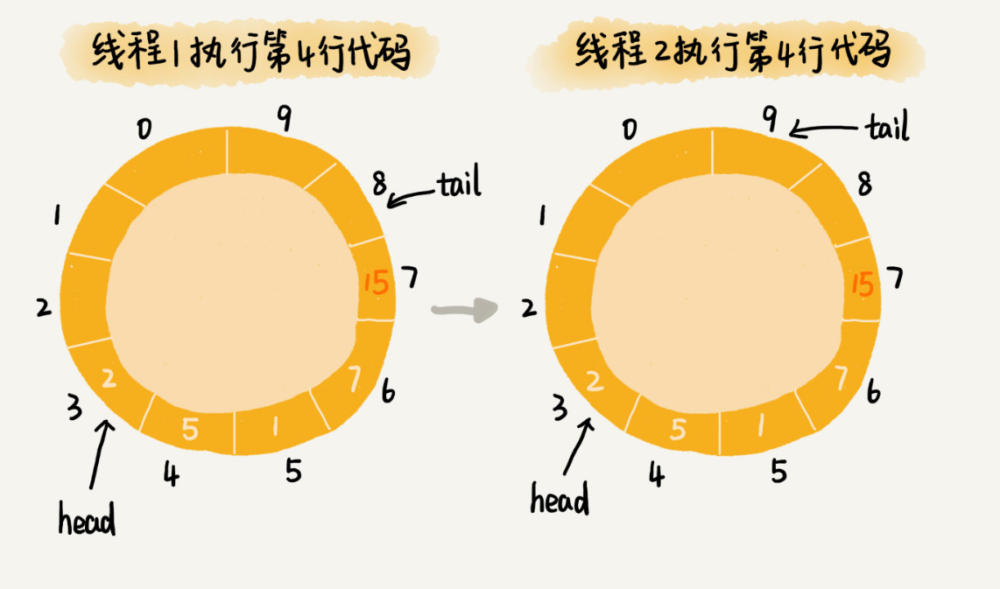

那如何解决这种线程并发往队列中添加数据时，导致的数据覆盖、运行不正确问题呢？

最简单的处理方法就是给这段代码加锁，同一时间只允许一个线程执行 add() 函数。这就相当于将这段代码的执行，由并行改成了串行，也就不存在我们刚刚说的问题了。

不过，天下没有免费的午餐，加锁将并行改成串行，必然导致多个生产者同时生产数据的时候，执行效率的下降。当然，我们可以继续优化代码，用CAS（compare and swap，比较并交换）操作等减少加锁的粒度，但是，这不是我们这节的重点。我们直接看 Disruptor 的处理方法。

## 基于无锁的并发“生产者 - 消费者模型”

尽管 Disruptor 的源码读起来很复杂，但是基本思想其实非常简单。实际上，它是换了一种队列和“生产者 - 消费者模型”的实现思路。

之前的实现思路中，队列只支持两个操作，添加数据和读取并移除数据，分别对应代码中的 add() 函数和 poll() 函数，而 Disruptor 采用了另一种实现思路。

对于生产者来说，它往队列中添加数据之前，先申请可用空闲存储单元，并且是批量地申请连续的 n 个（n≥1）存储单元。当申请到这组连续的存储单元之后，后续往队列中添加元素，就可以不用加锁了，因为这组存储单元是这个线程独享的。不过，从刚刚的描述中，我们可以看出，申请存储单元的过程是需要加锁的。

对于消费者来说，处理的过程跟生产者是类似的。它先去申请一批连续可读的存储单元（这个申请的过程也是需要加锁的），当申请到这批存储单元之后，后续的读取操作就可以不用加锁了。

不过，还有一个需要特别注意的地方，那就是，如果生产者 A 申请到了一组连续的存储单元，假设是下标为 3 到 6 的存储单元，生产者 B 紧跟着申请到了下标是 7 到 9 的存储单元，那在 3 到 6 没有完全写入数据之前，7 到 9 的数据是无法读取的。这个也是 Disruptor 实现思路的一个弊端。

文字描述不好理解，我画了一个图，给你展示一下这个操作过程。

实际上，Disruptor 采用的是 RingBuffer 和 AvailableBuffer 这两个结构，来实现我刚刚讲的功能。不过，因为我们主要聚焦在数据结构和算法上，所以我对这两种结构做了简化，但是基本思想是一致的。如果你对 Disruptor 感兴趣，可以去阅读一下它的源码。

## 总结引申

今天，我讲了如何实现一个高性能的并发队列。这里的“并发”两个字，实际上就是多线程安全的意思。

常见的内存队列往往采用循环队列来实现。这种实现方法，对于只有一个生产者和一个消费者的场景，已经足够了。但是，当存在多个生产者或者多个消费者的时候，单纯的循环队列的实现方式，就无法正确工作了。

这主要是因为，多个生产者在同时往队列中写入数据的时候，在某些情况下，会存在数据覆盖的问题。而多个消费者同时消费数据，在某些情况下，会存在消费重复数据的问题。

针对这个问题，最简单、暴力的解决方法就是，对写入和读取过程加锁。这种处理方法，相当于将原来可以并行执行的操作，强制串行执行，相应地就会导致操作性能的下降。

为了在保证逻辑正确的前提下，尽可能地提高队列在并发情况下的性能，Disruptor 采用了“两阶段写入”的方法。在写入数据之前，先加锁申请批量的空闲存储单元，之后往队列中写入数据的操作就不需要加锁了，写入的性能因此就提高了。Disruptor 对消费过程的改造，跟对生产过程的改造是类似的。它先加锁申请批量的可读取的存储单元，之后从队列中读取数据的操作也就不需要加锁了，读取的性能因此也就提高了。

你可能会觉得这个优化思路非常简单。实际上，不管架构设计还是产品设计，往往越简单的设计思路，越能更好地解决问题。正所谓“大道至简”，就是这个意思。

## 课后思考

为了提高存储性能，我们往往通过分库分表的方式设计数据库表。假设我们有 8 张表用来存储用户信息。这个时候，每张用户表中的 ID 字段就不能通过自增的方式来产生了。因为这样的话，就会导致不同表之间的用户 ID 值重复。

为了解决这个问题，我们需要实现一个 ID 生成器，可以为所有的用户表生成唯一的 ID 号。那现在问题是，如何设计一个高性能、支持并发的、能够生成全局唯一 ID 的 ID 生成器呢？

欢迎留言和我分享，也欢迎点击“请朋友读”，把今天的内容分享给你的好友，和他一起讨论、学习。

# 55 | 算法实战（四）：剖析微服务接口鉴权限流背后的数据结构和算法

王争 2019-02-01



00:00

[1.0x**](javascript:;)

讲述：修阳 大小：14.46M 时长：15:47

微服务是最近几年才兴起的概念。简单点讲，就是把复杂的大应用，解耦拆分成几个小的应用。这样做的好处有很多。比如，这样有利于团队组织架构的拆分，毕竟团队越大协作的难度越大；再比如，每个应用都可以独立运维，独立扩容，独立上线，各个应用之间互不影响。不用像原来那样，一个小功能上线，整个大应用都要重新发布。

不过，有利就有弊。大应用拆分成微服务之后，服务之间的调用关系变得更复杂，平台的整体复杂熵升高，出错的概率、debug 问题的难度都高了好几个数量级。所以，为了解决这些问题，服务治理便成了微服务的一个技术重点。

所谓服务治理，简单点讲，就是管理微服务，保证平台整体正常、平稳地运行。服务治理涉及的内容比较多，比如鉴权、限流、降级、熔断、监控告警等等。这些服务治理功能的实现，底层依赖大量的数据结构和算法。今天，我就拿其中的鉴权和限流这两个功能，来带你看看，它们的实现过程中都要用到哪些数据结构和算法。

## 鉴权背景介绍

以防你之前可能对微服务没有太多了解，所以我对鉴权的背景做了简化。

假设我们有一个微服务叫用户服务（User Service）。它提供很多用户相关的接口，比如获取用户信息、注册、登录等，给公司内部的其他应用使用。但是，并不是公司内部所有应用，都可以访问这个用户服务，也并不是每个有访问权限的应用，都可以访问用户服务的所有接口。

我举了一个例子给你讲解一下，你可以看我画的这幅图。这里面，只有 A、B、C、D 四个应用可以访问用户服务，并且，每个应用只能访问用户服务的部分接口。

要实现接口鉴权功能，我们需要事先将应用对接口的访问权限规则设置好。当某个应用访问其中一个接口的时候，我们就可以拿应用的请求 URL，在规则中进行匹配。如果匹配成功，就说明允许访问；如果没有可以匹配的规则，那就说明这个应用没有这个接口的访问权限，我们就拒绝服务。

## 如何实现快速鉴权？

接口的格式有很多，有类似 Dubbo 这样的 RPC 接口，也有类似 Spring Cloud 这样的 HTTP 接口。不同接口的鉴权实现方式是类似的，我这里主要拿 HTTP 接口给你讲解。

鉴权的原理比较简单、好理解。那具体到实现层面，我们该用什么数据结构来存储规则呢？用户请求 URL 在规则中快速匹配，又该用什么样的算法呢？

实际上，不同的规则和匹配模式，对应的数据结构和匹配算法也是不一样的。所以，关于这个问题，我继续细化为三个更加详细的需求给你讲解。

### 1. 如何实现精确匹配规则？

我们先来看最简单的一种匹配模式。只有当请求 URL 跟规则中配置的某个接口精确匹配时，这个请求才会被接受、处理。为了方便你理解，我举了一个例子，你可以看一下。

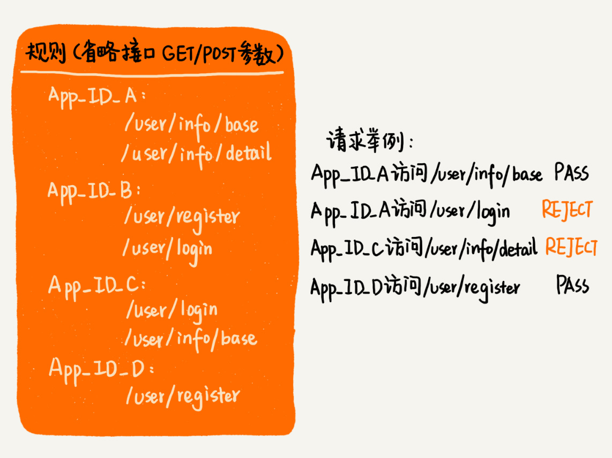

不同的应用对应不同的规则集合。我们可以采用散列表来存储这种对应关系。我这里着重讲下，每个应用对应的规则集合，该如何存储和匹配。

针对这种匹配模式，我们可以将每个应用对应的权限规则，存储在一个字符串数组中。当用户请求到来时，我们拿用户的请求 URL，在这个字符串数组中逐一匹配，匹配的算法就是我们之前学过的字符串匹配算法（比如 KMP、BM、BF 等）。

规则不会经常变动，所以，为了加快匹配速度，我们可以按照字符串的大小给规则排序，把它组织成有序数组这种数据结构。当要查找某个 URL 能否匹配其中某条规则的时候，我们可以采用二分查找算法，在有序数组中进行匹配。

而二分查找算法的时间复杂度是 O(logn)（n 表示规则的个数），这比起时间复杂度是 O(n) 的顺序遍历快了很多。对于规则中接口长度比较长，并且鉴权功能调用量非常大的情况，这种优化方法带来的性能提升还是非常可观的 。

### 2. 如何实现前缀匹配规则？

我们再来看一种稍微复杂的匹配模式。只要某条规则可以匹配请求 URL 的前缀，我们就说这条规则能够跟这个请求 URL 匹配。同样，为了方便你理解这种匹配模式，我还是举一个例子说明一下。

不同的应用对应不同的规则集合。我们采用散列表来存储这种对应关系。我着重讲一下，每个应用的规则集合，最适合用什么样的数据结构来存储。

在Trie 树那节，我们讲到，Trie 树非常适合用来做前缀匹配。所以，针对这个需求，我们可以将每个用户的规则集合，组织成 Trie 树这种数据结构。

不过，Trie 树中的每个节点不是存储单个字符，而是存储接口被“/”分割之后的子目录（比如“/user/name”被分割为“user”“name”两个子目录）。因为规则并不会经常变动，所以，在 Trie 树中，我们可以把每个节点的子节点们，组织成有序数组这种数据结构。在匹配的过程中，我们可以利用二分查找算法，决定从一个节点应该跳到哪一个子节点。

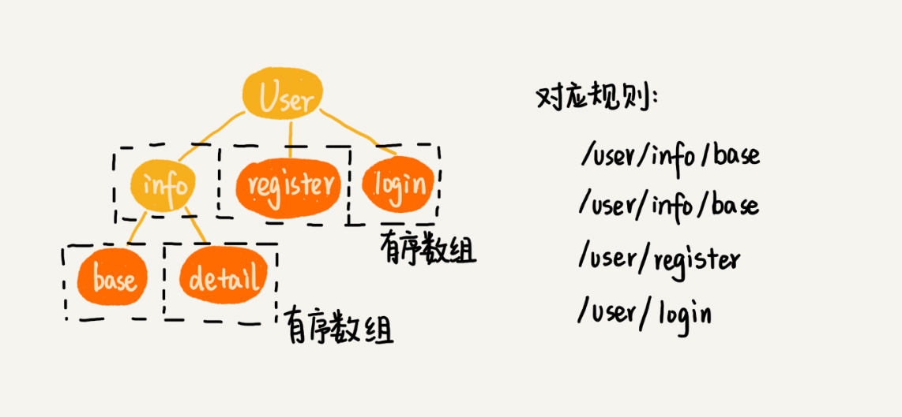

### 3. 如何实现模糊匹配规则？

如果我们的规则更加复杂，规则中包含通配符，比如“**”表示匹配任意多个子目录，“*”表示匹配任意一个子目录。只要用户请求 URL 可以跟某条规则模糊匹配，我们就说这条规则适用于这个请求。为了方便你理解，我举一个例子来解释一下。

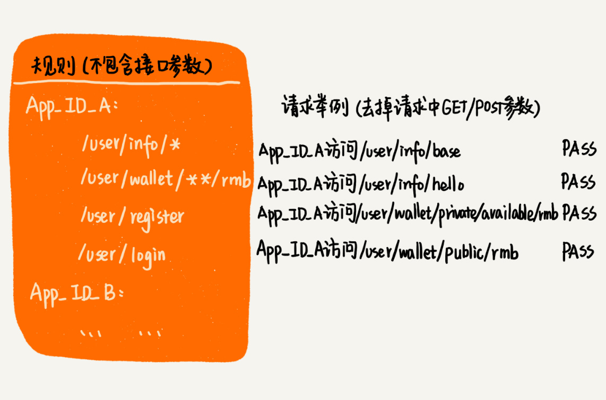

不同的应用对应不同的规则集合。我们还是采用散列表来存储这种对应关系。这点我们刚才讲过了，这里不再重复说了。我们着重看下，每个用户对应的规则集合，该用什么数据结构来存储？针对这种包含通配符的模糊匹配，我们又该使用什么算法来实现呢？

还记得我们在回溯算法那节讲的正则表达式的例子吗？我们可以借助正则表达式那个例子的解决思路，来解决这个问题。我们采用回溯算法，拿请求 URL 跟每条规则逐一进行模糊匹配。如何用回溯算法进行模糊匹配，这部分我就不重复讲了。你如果忘记了，可以回到相应章节复习一下。

不过，这个解决思路的时间复杂度是非常高的。我们需要拿每一个规则，跟请求 URL 匹配一遍。那有没有办法可以继续优化一下呢？

实际上，我们可以结合实际情况，挖掘出这样一个隐形的条件，那就是，并不是每条规则都包含通配符，包含通配符的只是少数。于是，我们可以把不包含通配符的规则和包含通配符的规则分开处理。

我们把不包含通配符的规则，组织成有序数组或者 Trie 树（具体组织成什么结构，视具体的需求而定，是精确匹配，就组织成有序数组，是前缀匹配，就组织成 Trie 树），而这一部分匹配就会非常高效。剩下的是少数包含通配符的规则，我们只要把它们简单存储在一个数组中就可以了。尽管匹配起来会比较慢，但是毕竟这种规则比较少，所以这种方法也是可以接受的。

当接收到一个请求 URL 之后，我们可以先在不包含通配符的有序数组或者 Trie 树中查找。如果能够匹配，就不需要继续在通配符规则中匹配了；如果不能匹配，就继续在通配符规则中查找匹配。

## 限流背景介绍

讲完了鉴权的实现思路，我们再来看一下限流。

所谓限流，顾名思义，就是对接口调用的频率进行限制。比如每秒钟不能超过 100 次调用，超过之后，我们就拒绝服务。限流的原理听起来非常简单，但它在很多场景中，发挥着重要的作用。比如在秒杀、大促、双 11、618 等场景中，限流已经成为了保证系统平稳运行的一种标配的技术解决方案。

按照不同的限流粒度，限流可以分为很多种类型。比如给每个接口限制不同的访问频率，或者给所有接口限制总的访问频率，又或者更细粒度地限制某个应用对某个接口的访问频率等等。

不同粒度的限流功能的实现思路都差不多，所以，我今天主要针对限制所有接口总的访问频率这样一个限流需求来讲解。其他粒度限流需求的实现思路，你可以自己思考。

## 如何实现精准限流？

最简单的限流算法叫**固定时间窗口限流算法**。这种算法是如何工作的呢？首先我们需要选定一个时间起点，之后每当有接口请求到来，我们就将计数器加一。如果在当前时间窗口内，根据限流规则（比如每秒钟最大允许 100 次访问请求），出现累加访问次数超过限流值的情况时，我们就拒绝后续的访问请求。当进入下一个时间窗口之后，计数器就清零重新计数。

这种基于固定时间窗口的限流算法的缺点是，限流策略过于粗略，无法应对两个时间窗口临界时间内的突发流量。这是怎么回事呢？我举一个例子给你解释一下。

假设我们的限流规则是，每秒钟不能超过 100 次接口请求。第一个 1s 时间窗口内，100 次接口请求都集中在最后 10ms 内。在第二个 1s 的时间窗口内，100 次接口请求都集中在最开始的 10ms 内。虽然两个时间窗口内流量都符合限流要求（≤100 个请求），但在两个时间窗口临界的 20ms 内，会集中有 200 次接口请求。固定时间窗口限流算法并不能对这种情况做限制，所以，集中在这 20ms 内的 200 次请求就有可能压垮系统。

为了解决这个问题，我们可以对固定时间窗口限流算法稍加改造。我们可以限制任意时间窗口（比如 1s）内，接口请求数都不能超过某个阈值（ 比如 100 次）。因此，相对于固定时间窗口限流算法，这个算法叫**滑动时间窗口限流算法**。

流量经过滑动时间窗口限流算法整形之后，可以保证任意一个 1s 的时间窗口内，都不会超过最大允许的限流值，从流量曲线上来看会更加平滑。那具体到实现层面，我们该如何来做呢？

我们假设限流的规则是，在任意 1s 内，接口的请求次数都不能大于 K 次。我们就维护一个大小为 K+1 的循环队列，用来记录 1s 内到来的请求。注意，这里循环队列的大小等于限流次数加一，因为循环队列存储数据时会浪费一个存储单元。

当有新的请求到来时，我们将与这个新请求的时间间隔超过 1s 的请求，从队列中删除。然后，我们再来看循环队列中是否有空闲位置。如果有，则把新请求存储在队列尾部（tail 指针所指的位置）；如果没有，则说明这 1 秒内的请求次数已经超过了限流值 K，所以这个请求被拒绝服务。

为了方便你理解，我举一个例子，给你解释一下。在这个例子中，我们假设限流的规则是，任意 1s 内，接口的请求次数都不能大于 6 次。

即便滑动时间窗口限流算法可以保证任意时间窗口内，接口请求次数都不会超过最大限流值，但是仍然不能防止，在细时间粒度上访问过于集中的问题。

比如我刚刚举的那个例子，第一个 1s 的时间窗口内，100 次请求都集中在最后 10ms 中，也就是说，基于时间窗口的限流算法，不管是固定时间窗口还是滑动时间窗口，只能在选定的时间粒度上限流，对选定时间粒度内的更加细粒度的访问频率不做限制。

实际上，针对这个问题，还有很多更加平滑的限流算法，比如令牌桶算法、漏桶算法等。如果感兴趣，你可以自己去研究一下。

## 总结引申

今天，我们讲解了跟微服务相关的接口鉴权和限流功能的实现思路。现在，我稍微总结一下。

关于鉴权，我们讲了三种不同的规则匹配模式。不管是哪种匹配模式，我们都可以用散列表来存储不同应用对应的不同规则集合。对于每个应用的规则集合的存储，三种匹配模式使用不同的数据结构。

对于第一种精确匹配模式，我们利用有序数组来存储每个应用的规则集合，并且通过二分查找和字符串匹配算法，来匹配请求 URL 与规则。对于第二种前缀匹配模式，我们利用 Trie 树来存储每个应用的规则集合。对于第三种模糊匹配模式，我们采用普通的数组来存储包含通配符的规则，通过回溯算法，来进行请求 URL 与规则的匹配。

关于限流，我们讲了两种限流算法，第一种是固定时间窗口限流算法，第二种是滑动时间窗口限流算法。对于滑动时间窗口限流算法，我们用了之前学习过的循环队列来实现。比起固定时间窗口限流算法，它对流量的整形效果更好，流量更加平滑。

从今天的学习中，我们也可以看出，对于基础架构工程师来说，如果不精通数据结构和算法，我们就很难开发出性能卓越的基础架构、中间件。这其实就体现了数据结构和算法的重要性。

## 课后思考

除了用循环队列来实现滑动时间窗口限流算法之外，我们是否还可以用其他数据结构来实现呢？请对比一下这些数据结构跟循环队列在解决这个问题时的优劣之处。

分析一下鉴权那部分内容中，前缀匹配算法的时间复杂度和空间复杂度。

最后，有个消息提前通知你一下。本节是专栏的倒数第二节课了，不知道学到现在，你掌握得怎么样呢？为了帮你复习巩固，做到真正掌握这些知识，我针对专栏涉及的数据结构和算法，精心编制了一套练习题。从正月初一到初七，每天发布一篇。你要做好准备哦！

# 56 | 算法实战（五）：如何用学过的数据结构和算法实现一个短网址系统？

王争 2019-02-04



00:00

[1.0x**](javascript:;)

讲述：修阳 大小：13.99M 时长：15:16

短网址服务你用过吗？如果我们在微博里发布一条带网址的信息，微博会把里面的网址转化成一个更短的网址。我们只要访问这个短网址，就相当于访问原始的网址。比如下面这两个网址，尽管长度不同，但是都可以跳转到我的一个 GitHub 开源项目里。其中，第二个网址就是通过新浪提供的短网址服务生成的。

原始网址：https://github.com/wangzheng0822/ratelimiter4j

短网址：http://t.cn/EtR9QEG

从功能上讲，短网址服务其实非常简单，就是把一个长的网址转化成一个短的网址。作为一名软件工程师，你是否思考过，这样一个简单的功能，是如何实现的呢？底层都依赖了哪些数据结构和算法呢？

## 短网址服务整体介绍

刚刚我们讲了，短网址服务的一个核心功能，就是把原始的长网址转化成短网址。除了这个功能之外，短网址服务还有另外一个必不可少的功能。那就是，当用户点击短网址的时候，短网址服务会将浏览器重定向为原始网址。这个过程是如何实现的呢？

为了方便你理解，我画了一张对比图，你可以看下。

从图中我们可以看出，浏览器会先访问短网址服务，通过短网址获取到原始网址，再通过原始网址访问到页面。不过这部分功能并不是我们今天要讲的重点。我们重点来看，如何将长网址转化成短网址？

## 如何通过哈希算法生成短网址？

我们前面学过哈希算法。哈希算法可以将一个不管多长的字符串，转化成一个长度固定的哈希值。我们可以利用哈希算法，来生成短网址。

前面我们已经提过一些哈希算法了，比如 MD5、SHA 等。但是，实际上，我们并不需要这些复杂的哈希算法。在生成短网址这个问题上，毕竟，我们不需要考虑反向解密的难度，所以我们只需要关心哈希算法的计算速度和冲突概率。

能够满足这样要求的哈希算法有很多，其中比较著名并且应用广泛的一个哈希算法，那就是MurmurHash 算法。尽管这个哈希算法在 2008 年才被发明出来，但现在它已经广泛应用到 Redis、MemCache、Cassandra、HBase、Lucene 等众多著名的软件中。

MurmurHash 算法提供了两种长度的哈希值，一种是 32bits，一种是 128bits。为了让最终生成的短网址尽可能短，我们可以选择 32bits 的哈希值。对于开头那个 GitHub 网址，经过 MurmurHash 计算后，得到的哈希值就是 181338494。我们再拼上短网址服务的域名，就变成了最终的短网址 http://t.cn/181338494（其中，http://t.cn 是短网址服务的域名）。

### 1. 如何让短网址更短？

不过，你可能已经看出来了，通过 MurmurHash 算法得到的短网址还是很长啊，而且跟我们开头那个网址的格式好像也不一样。别着急，我们只需要稍微改变一个哈希值的表示方法，就可以轻松把短网址变得更短些。

我们可以将 10 进制的哈希值，转化成更高进制的哈希值，这样哈希值就变短了。我们知道，16 进制中，我们用 A～F，来表示 10～15。在网址 URL 中，常用的合法字符有 0～9、a～z、A～Z 这样 62 个字符。为了让哈希值表示起来尽可能短，我们可以将 10 进制的哈希值转化成 62 进制。具体的计算过程，我写在这里了。最终用 62 进制表示的短网址就是http://t.cn/cgSqq。

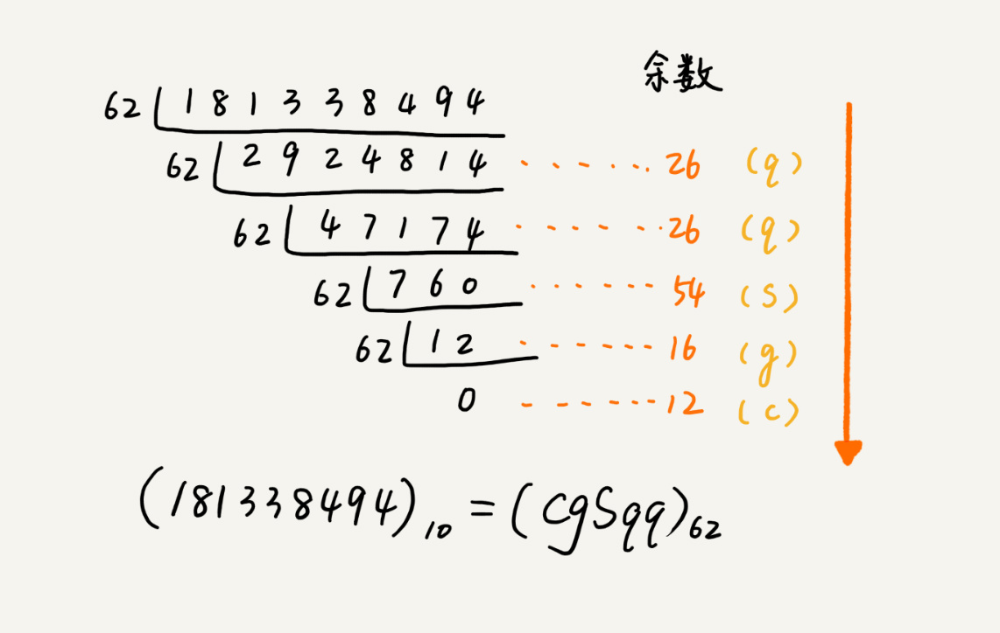

### 2. 如何解决哈希冲突问题？

不过，我们前面讲过，哈希算法无法避免的一个问题，就是哈希冲突。尽管 MurmurHash 算法，冲突的概率非常低。但是，一旦冲突，就会导致两个原始网址被转化成同一个短网址。当用户访问短网址的时候，我们就无从判断，用户想要访问的是哪一个原始网址了。这个问题该如何解决呢？

一般情况下，我们会保存短网址跟原始网址之间的对应关系，以便后续用户在访问短网址的时候，可以根据对应关系，查找到原始网址。存储这种对应关系的方式有很多，比如我们自己设计存储系统或者利用现成的数据库。前面我们讲到的数据库有 MySQL、Redis。我们就拿 MySQL 来举例。假设短网址与原始网址之间的对应关系，就存储在 MySQL 数据库中。

当有一个新的原始网址需要生成短网址的时候，我们先利用 MurmurHash 算法，生成短网址。然后，我们拿这个新生成的短网址，在 MySQL 数据库中查找。

如果没有找到相同的短网址，这也就表明，这个新生成的短网址没有冲突。于是我们就将这个短网址返回给用户（请求生成短网址的用户），然后将这个短网址与原始网址之间的对应关系，存储到 MySQL 数据库中。

如果我们在数据库中，找到了相同的短网址，那也并不一定说明就冲突了。我们从数据库中，将这个短网址对应的原始网址也取出来。如果数据库中的原始网址，跟我们现在正在处理的原始网址是一样的，这就说明已经有人请求过这个原始网址的短网址了。我们就可以拿这个短网址直接用。如果数据库中记录的原始网址，跟我们正在处理的原始网址不一样，那就说明哈希算法发生了冲突。不同的原始网址，经过计算，得到的短网址重复了。这个时候，我们该怎么办呢？

我们可以给原始网址拼接一串特殊字符，比如“[DUPLICATED]”，然后再重新计算哈希值，两次哈希计算都冲突的概率，显然是非常低的。假设出现非常极端的情况，又发生冲突了，我们可以再换一个拼接字符串，比如“[OHMYGOD]”，再计算哈希值。然后把计算得到的哈希值，跟原始网址拼接了特殊字符串之后的文本，一并存储在 MySQL 数据库中。

当用户访问短网址的时候，短网址服务先通过短网址，在数据库中查找到对应的原始网址。如果原始网址有拼接特殊字符（这个很容易通过字符串匹配算法找到），我们就先将特殊字符去掉，然后再将不包含特殊字符的原始网址返回给浏览器。

### 3. 如何优化哈希算法生成短网址的性能？

为了判断生成的短网址是否冲突，我们需要拿生成的短网址，在数据库中查找。如果数据库中存储的数据非常多，那查找起来就会非常慢，势必影响短网址服务的性能。那有没有什么优化的手段呢？

还记得我们之前讲的 MySQL 数据库索引吗？我们可以给短网址字段添加 B+ 树索引。这样通过短网址查询原始网址的速度就提高了很多。实际上，在真实的软件开发中，我们还可以通过一个小技巧，来进一步提高速度。

在短网址生成的过程中，我们会跟数据库打两次交道，也就是会执行两条 SQL 语句。第一个 SQL 语句是通过短网址查询短网址与原始网址的对应关系，第二个 SQL 语句是将新生成的短网址和原始网址之间的对应关系存储到数据库。

我们知道，一般情况下，数据库和应用服务（只做计算不存储数据的业务逻辑部分）会部署在两个独立的服务器或者虚拟服务器上。那两条 SQL 语句的执行就需要两次网络通信。这种 IO 通信耗时以及 SQL 语句的执行，才是整个短网址服务的性能瓶颈所在。所以，为了提高性能，我们需要尽量减少 SQL 语句。那又该如何减少 SQL 语句呢？

我们可以给数据库中的短网址字段，添加一个唯一索引（不只是索引，还要求表中不能有重复的数据）。当有新的原始网址需要生成短网址的时候，我们并不会先拿生成的短网址，在数据库中查找判重，而是直接将生成的短网址与对应的原始网址，尝试存储到数据库中。如果数据库能够将数据正常写入，那说明并没有违反唯一索引，也就是说，这个新生成的短网址并没有冲突。

当然，如果数据库反馈违反唯一性索引异常，那我们还得重新执行刚刚讲过的“查询、写入”过程，SQL 语句执行的次数不减反增。但是，在大部分情况下，我们把新生成的短网址和对应的原始网址，插入到数据库的时候，并不会出现冲突。所以，大部分情况下，我们只需要执行一条写入的 SQL 语句就可以了。所以，从整体上看，总的 SQL 语句执行次数会大大减少。

实际上，我们还有另外一个优化 SQL 语句次数的方法，那就是借助布隆过滤器。

我们把已经生成的短网址，构建成布隆过滤器。我们知道，布隆过滤器是比较节省内存的一种存储结构，长度是 10 亿的布隆过滤器，也只需要 125MB 左右的内存空间。

当有新的短网址生成的时候，我们先拿这个新生成的短网址，在布隆过滤器中查找。如果查找的结果是不存在，那就说明这个新生成的短网址并没有冲突。这个时候，我们只需要再执行写入短网址和对应原始网页的 SQL 语句就可以了。通过先查询布隆过滤器，总的 SQL 语句的执行次数减少了。

到此，利用哈希算法来生成短网址的思路，我就讲完了。实际上，这种解决思路已经完全满足需求了，我们已经可以直接用到真实的软件开发中。不过，我们还有另外一种短网址的生成算法，那就是利用自增的 ID 生成器来生成短网址。我们接下来就看一下，这种算法是如何工作的？对于哈希算法生成短网址来说，它又有什么优势和劣势？

## 如何通过 ID 生成器生成短网址？

我们可以维护一个 ID 自增生成器。它可以生成 1、2、3…这样自增的整数 ID。当短网址服务接收到一个原始网址转化成短网址的请求之后，它先从 ID 生成器中取一个号码，然后将其转化成 62 进制表示法，拼接到短网址服务的域名（比如http://t.cn/）后面，就形成了最终的短网址。最后，我们还是会把生成的短网址和对应的原始网址存储到数据库中。

理论非常简单好理解。不过，这里有几个细节问题需要处理。

### 1. 相同的原始网址可能会对应不同的短网址

每次新来一个原始网址，我们就生成一个新的短网址，这种做法就会导致两个相同的原始网址生成了不同的短网址。这个该如何处理呢？实际上，我们有两种处理思路。

第一种处理思路是**不做处理**。听起来有点无厘头，我稍微解释下你就明白了。实际上，相同的原始网址对应不同的短网址，这个用户是可以接受的。在大部分短网址的应用场景里，用户只关心短网址能否正确地跳转到原始网址。至于短网址长什么样子，他其实根本就不关心。所以，即便是同一个原始网址，两次生成的短网址不一样，也并不会影响到用户的使用。

第二种处理思路是**借助哈希算法生成短网址的处理思想，**当要给一个原始网址生成短网址的时候，我们要先拿原始网址在数据库中查找，看数据库中是否已经存在相同的原始网址了。如果数据库中存在，那我们就取出对应的短网址，直接返回给用户。

不过，这种处理思路有个问题，我们需要给数据库中的短网址和原始网址这两个字段，都添加索引。短网址上加索引是为了提高用户查询短网址对应的原始网页的速度，原始网址上加索引是为了加快刚刚讲的通过原始网址查询短网址的速度。这种解决思路虽然能满足“相同原始网址对应相同短网址”这样一个需求，但是是有代价的：一方面两个索引会占用更多的存储空间，另一方面索引还会导致插入、删除等操作性能的下降。

### 2. 如何实现高性能的 ID 生成器？

实现 ID 生成器的方法有很多，比如利用数据库自增字段。当然我们也可以自己维护一个计数器，不停地加一加一。但是，一个计数器来应对频繁的短网址生成请求，显然是有点吃力的（因为计数器必须保证生成的 ID 不重复，笼统概念上讲，就是需要加锁）。如何提高 ID 生成器的性能呢？关于这个问题，实际上，有很多解决思路。我这里给出两种思路。

第一种思路是借助第 54 节中讲的方法。我们可以给 ID 生成器装多个前置发号器。我们批量地给每个前置发号器发送 ID 号码。当我们接受到短网址生成请求的时候，就选择一个前置发号器来取号码。这样通过多个前置发号器，明显提高了并发发号的能力。

第二种思路跟第一种差不多。不过，我们不再使用一个 ID 生成器和多个前置发号器这样的架构，而是，直接实现多个 ID 生成器同时服务。为了保证每个 ID 生成器生成的 ID 不重复。我们要求每个 ID 生成器按照一定的规则，来生成 ID 号码。比如，第一个 ID 生成器只能生成尾号为 0 的，第二个只能生成尾号为 1 的，以此类推。这样通过多个 ID 生成器同时工作，也提高了 ID 生成的效率。

## 总结引申

今天，我们讲了短网址服务的两种实现方法。我现在来稍微总结一下。

第一种实现思路是通过哈希算法生成短网址。我们采用计算速度快、冲突概率小的 MurmurHash 算法，并将计算得到的 10 进制数，转化成 62 进制表示法，进一步缩短短网址的长度。对于哈希算法的哈希冲突问题，我们通过给原始网址添加特殊前缀字符，重新计算哈希值的方法来解决。

第二种实现思路是通过 ID 生成器来生成短网址。我们维护一个 ID 自增的 ID 生成器，给每个原始网址分配一个 ID 号码，并且同样转成 62 进制表示法，拼接到短网址服务的域名之后，形成最终的短网址。

## 课后思考

如果我们还要额外支持用户自定义短网址功能（http//t.cn/{用户自定部分}），我们又该如何改造刚刚的算法呢?

我们在讲通过 ID 生成器生成短网址这种实现思路的时候，讲到相同的原始网址可能会对应不同的短网址。针对这个问题，其中一个解决思路就是，不做处理。但是，如果每个请求都生成一个短网址，并且存储在数据库中，那这样会不会撑爆数据库呢？我们又该如何解决呢？

今天是农历的大年三十，我们专栏的正文到这里也就全部结束了。从明天开始，我会每天发布一篇练习题，内容针对专栏涉及的数据结构和算法。从初一到初七，帮你复习巩固所学知识，拿下数据结构和算法，打响新年进步的第一枪！明天见！

# 不定期福利第一期 | 数据结构与算法学习书单

王争 2018-09-30



00:00

[1.0x**](javascript:;)

讲述：修阳 大小：3.94M 时长：08:36

你好，我是王争。欢迎来到不定期更新的周末福利时间。

专栏已经上线两周了，看到这么多人在留言区写下自己的疑惑或者观点，我特别开心。在留言里，很多同学让我推荐一些学习数据结构与算法的书籍。因此我特意跟编辑商量了，给你一个周末福利。所以这一期呢，我们就来聊一聊数据结构和算法学习过程中有哪些必读书籍。

有的同学还在读大学，代码还没写过几行；有的同学已经工作数十年，这之间的差别还是挺大的。而不同基础的人，适宜看的书是完全不一样的。因此，**针对不同层次、不同语言的同学，我分别推荐了不同的书**。希望每个同学，都能找到适合自己的学习资料，都能在现有水平上有所提高。

## 针对入门的趣味书

入门的同学，我建议你不要过度追求上去就看经典书。像《算法导论》《算法》这些书，虽然比较经典、比较权威，但是非常厚。初学就去啃这些书肯定会很费劲。而一旦啃不下来，挫败感就会很强。所以，入门的同学，我建议你找一些比较容易看的书来看，比如《大话数据结构》和《算法图解》。**不要太在意书写得深浅，重要的是能不能坚持看完。**

《**大话数据结构**》 这本书最大的特点是，它把理论讲得很有趣，不枯燥。而且每个数据结构和算法，作者都结合生活中的例子进行了讲解，能让你有非常直观的感受。虽然这本书有 400 多页，但是花两天时间读完，应该是没问题的。如果你之前完全不懂数据结构和算法，可以先从这本书看起。

《**算法图解**》 跟《大话数据结构》走的是同样的路线，就像这本书副标题写的那样，“像小说一样有趣的算法入门书”，主打“图解”，通俗易懂。它只有不到 200 页，所以内容比较少。作为入门，看看这本书，能让你对数据结构和算法有个大概的认识。

这些入门书共同的问题是，缺少细节，不够系统，也不够严谨。所以，如果你想要系统地学数据结构和算法，看这两本书肯定是不够的。

## 针对特定编程语言的教科书

讲数据结构和算法，肯定会跟代码实现挂钩。所以，很多人就很关心，某某书籍是用什么语言实现的，是不是自己熟悉的语言。市面大部分数据结构和算法书籍都是用 C、C++、Java 语言实现的，还有些是用伪代码。而使用 Python、Go、PHP、JavaScript、Objective-C 这些编程语言实现的就更少了。

我这里推荐《数据结构和算法分析》。国内外很多大学都拿这本书当作教材。这本书非常系统、全面、严谨，而且又不是特别难，适合对数据结构和算法有些了解，并且掌握了至少一门编程语言的同学。而且，这个作者也很用心。他用了三种语言，写了三个版本，分别是：《**数据结构与算法分析 ：C 语言描述**》《**数据结构与算法分析：C++ 描述**》《**数据结构与算法分析：Java 语言描述**》。

如果你熟悉的是 Python 或者 JavaScript，可以参考《**数据结构与算法 JavaScript 描述**》《**数据结构与算法：Python 语言描述**》 。至于其他语言的算法书籍，确实比较少。如果你有推荐，可以在留言区补充一下。

## 面试必刷的宝典

算法对面试很重要，很多人也很关心。我这里推荐几本有益于面试的书籍，分别是：《剑指 offer》《编程珠玑》《编程之美》。

从《**剑指 offer**》这本书的名字就可以看出，作者的写作目的非常明确，就是为了面试。这本书几乎包含了所有常见的、经典的面试题。如果能搞懂这本书里的内容，应付一般公司的面试应该不成问题。

《**编程珠玑**》这本书的豆瓣评分非常高，有 9 分。这本书最大的特色就是讲了很多针对海量数据的处理技巧。这个可能是其他算法书籍很少涉及的。面试的时候，海量数据处理的问题也是经常会问的，特别是校招面试。不管是开拓眼界，还是应付面试，这本书都很值得一看。

《**编程之美**》这本书有多位作者，其中绝大部分是微软的工程师，所以书的质量很有保证。不过，这里面的算法题目稍微有点难，也不是很系统，这也是我把它归到面试这一部分的原因。如果你有一定基础，也喜欢钻研些算法问题，或者要面试 Google、Facebook 这样的公司，可以拿这本书里的题，先来自测一下。

## 经典大部头

很多人一提到算法书就会搬出《算法导论》和《算法》。这两本确实非常经典，但是都太厚了，看起来比较费劲，我估计很少有人能坚持全部看下来。如果你想更加深入地学一学数据结构和算法，我还是强烈建议你看看。

我个人觉得，《**算法导论**》这本书的章节安排不是循序渐进的，里面充斥着各种算法的正确性、复杂度的证明、推导，数学公式比较多，一般人看起来会比较吃力。所以，作为入门书籍，并不是很推荐。

《**算法**》这本书也是一本经典大部头，不过它比起《算法导论》来要友好很多，更容易看懂，更适合初学者入门。但是这本书的缺点也很明显，就是内容不够全面，比如动态规划这么重要的知识点，这本书就没有讲。对于数据结构的东西，它讲的也不多，基本就是偏重讲算法。

## 殿堂级经典

说到殿堂级经典书，如果《**计算机程序设计艺术**》称第二，我想没人敢称第一。这本书包括很多卷。说实话，我也只看过比较简单的几卷，比如《基本算法》《排序和查找》。

这套书的深度、广度、系统性、全面性是其他所有数据结构和算法书籍都无法相比的。但是，如果你对算法和数据结构不是特别感兴趣，没有很好的数学、算法、计算机基础，想要把这套书读完、读懂是比较难的。你可以把它当作你算法学习的终极挑战。

## 闲暇阅读

算法无处不在。我这里再推荐几本适合闲暇时间阅读的书：《**算法帝国**》《**数学之美**》《**算法之美**》。

这些书共同的特点是，都列举了大量的例子，非常通俗易懂。夸张点说，像《算法帝国》，文科生都能读懂。当你看这些书的时候，你常常会深深感受到算法的力量，被算法的优美之处折服。即便不是从事 IT 工作的，看完这几本书也可以开拓眼界。

书籍差不多就是这些。除此之外，留言区很多人问到算法的实现语言。我这里也解释一下。因为我现在比较常用的编程语言是 Java。所以，在专栏里，特别简单的、不涉及高级语法的，我会用 Java 或者 C、C++ 来实现。稍微复杂的，为了让你能看懂，我会用伪代码。所以你完全不用担心语言的问题。

每节课中有需要代码实现的数据结构和算法，我都另外用 Java 语言实现一遍，然后放到 Github 上，供你参考。Github 的地址我放在这里，你可以收藏一下：https://github.com/wangzheng0822/algo。

至于其他语言的同学，比如 C、C++、Python、Go、PHP、JavaScript、Objective-C 等，我想了一个 crowd sourcing 的方法。

我希望基础较好的同学，参照我的 Java 实现，用你熟悉的编程语言再实现一遍，并且将代码留言给我。如果你写得正确，我会将你的代码上传到 Github 上，分享给更多人。

还有人问，我学完这个专栏，就可以拿下数据结构和算法吗？我想说的是，**每个人的基础、学习能力都不一样，掌握程度取决于你的努力程度**。除了你之外，没有人能百分之百保证你能掌握什么知识。

有的同学只是把每一节课听下来、看下来，就束之高阁，也不求甚解，那效果肯定会很差。而有些同学除了听、看之外，遇到不懂的会自己去查资料、看参考书籍，还会把我讲的数据结构和算法都认真地实现一遍，这样的学习效果自然就比只听一遍、看一遍要好很多。即便我已经尽我所能把这些知识讲得深入浅出，通俗易懂，但是学习依然还是要靠你自己啊。

这种答疑的方式也会成为我们之后的固定动作，我会把留言里有价值的问题和反馈沉淀下来，希望对你的日常学习起到补充作用。**如果你有什么看不懂、听不懂的地方，或者工作中有遇到算法问题、技术难题，欢迎写在留言区。**（我发现留言区里卧虎藏龙啊，没事儿可以多扫扫留言区。）

这次的周末福利时间就到这啦，我们下次见！

# 不定期福利第二期 | 王争：羁绊前行的，不是肆虐的狂风，而是内心的迷茫

王争 2018-11-23



00:00

[1.0x**](javascript:;)

讲述：修阳 大小：4.38M 时长：09:33

你好，我是王争。

专栏更新过半，我发现有些小伙伴已经掉队，虽然有人掉队也挺正常，但是我还是想尽量拉一把。于是，周末的时间，我就在想，究竟是什么原因让有些小伙伴掉队了？是内容本身太难了吗？是我讲得不够清楚吗？还是小伙伴本身基础太差、不够努力、没有掌握学习方法？

我觉得都不是，让你掉队的原因，从根儿上讲，是你内心的迷茫。**如果我们不那么确信能不能看懂、能不能学会的时候，当面对困难的时候，很容易就会否定自己，也就很容易半途而废**。

这就好比你迷失在沙漠中，对你来说，肆虐的狂风并不可怕，可怕的是，你不知道该努力多久才能走出沙漠，不知道到底能不能走出沙漠。这种对结果的未知、不确定，导致了你内心的恐惧，最后就差那么一点点就可以走出沙漠的时候，你放弃了。

学习也是同样的道理。所以，**我今天不打算讲学习方法，也不打算给你灌输心灵鸡汤，我就讲讲，对这个专栏的学习，或者对于任何学习来说，我觉得你应该建立的一些正确认知。**有了这些认知，希望你能在后面的专栏学习中，少一点迷茫，多一份坚持。

## 没有捷径，没有杀手锏，更没有一招致胜的“葵花宝典”

有小伙伴给我留言说：“看书五分钟，笔记两小时，急求学霸的学习方法”，还有人问，“数据结构和算法好难，到底该怎么学？是我的学习方法不对？还是我太笨？”

我想说，并没有什么杀手锏的学习方法，更没有一招致胜的“葵花宝典”。不知道这么说有没有让你失望。**如果你真要“求”一个学习方法，那就再看看我在专栏开始写的“****如何抓住重点，系统高效地学习数据结构与算法****”那篇文章吧**。

说实话，我也挺想知道学霸的学习方法的，所以，在求学路上，每当有学霸来分享学习方法，我都要去听一听。但是，听多了之后，我发现其实并没有太多用。因为那些所谓学霸的学习方法，其实都很简单，比如“认认真真听讲”“认认真真做每一道题”等等。

也不是他们说的不对，但是这种大实话，我总有一种领会不了的感觉，更别说真正指导我的学习了。而且，我觉得，很多时候，**这些方法论的难点并不在于能不能听懂，而是在于能不能执行到位**。比如很多人都听过“一万小时定律”，坚持一万个小时，你就能成为大牛，但有多少人能坚持一万个小时呢？

所以，这里我要纠正一个认知，那就是，学习没有“杀手锏”似的方法论。不要怀疑是不是自己的学习方法不对，不要在开始就否定自己。因为否定得越多，你就越迷茫，越不能坚持。

## 不要浮躁，不要丧失思考能力，不要丧失学习能力

有小伙伴给我留言说：“老师，这个地方看不懂，你能不能再解释一下”，还有小伙伴留言说：“《红黑树（上）》里的图为什么跟你的定义不相符？”

对于留言的问题，我都挺重视的，但是当仔细看这些问题的时候，我发现，实际上文章里已经有答案了，他根本没有认真看、认真思考，更别说去自己搜搜资料，再研究下，就来提问了。

一般情况下，我都会回复“你自己再认真看一遍”或者“你自己先去网上搜一下，研究研究，如果还不懂再给我留言”。告诉你答案，并不会花费我太长时间，但是，这样会让你丢失最宝贵的东西，那就是，你自己的思考能力、学习能力，能自己沉下心来研究的能力。这个是很可怕的。

现在，互联网如此发达，我们每天都会面对各种各样的信息轰炸，人也变得越来越浮躁。很多人习惯看些不动脑子就能看懂的东西，看到稍微复杂的东西，就感觉脑子转不动了。

上学的时候还好，要考试，有老师督促，还能坚持学习。但是工作之后，没有人监督，很多人陷入各种手机 App 中不能自拔，学一会儿就想玩会儿手机，想静下心来学上半个小时都无比困难。无法自律，沉不下心来，那你就基本可以跟学习说拜拜了。

## 只有做好打硬仗的心理准备，遇到困难才能心态平和

还有小伙伴给我留言说：“看不懂，一个 4000 多字的文章、10 分钟的音频，反复看了、听了 2 个小时都没怎么看懂”。我给他的回复是：“**如果之前没有基础或者基础不好的话，看 2 个小时还不懂，很正常，看一个礼拜试试。**”

“一个礼拜”的说法，我一点都不是夸张。虽然专栏的每篇文章都只有三四千字，10 分钟左右的音频，但是知识点的密度还是很高的。如果你潜意识里觉得应该一下子就能看懂，就会出现这样的情况：看了一遍不懂，又看了一遍还是不怎么懂，然后就放弃了。

数据结构和算法就是一个非常难啃的硬骨头，可以说是计算机学科中最难学的学科之一了。**我当时学习也费了老大的劲，能做到讲给你听，我靠的也是十年如一的积累和坚持**。如果没有基础、或者基础不好，你怎能期望看 2 个小时就能完全掌握呢？

面对这种硬骨头，我觉得我们要有打硬仗、打持久战的心理准备。只有这样，在学习的过程中遇到困难的时候，心态才能更加平和，才能沉下心来有条不紊地去解决一个个的疑难问题。这样，碰到问题，你可能还会“窃喜”，我又遇到了一个之前不怎么懂的知识点了，看懂它我又进步了一点。甚至你还会“坏坏地”想，又多了一个拉开我跟其他人距离的地方了。跨过这些点，我就能比别人更厉害。

一口吃不成胖子，如果你基础不好，那就从长计议吧，给自己定一个长一点的“死磕”计划，比如一年。面对不懂的知识点，沉下心来逐个突破，这样你的信心慢慢也就建立了。

## “放弃”的念头像是一个心魔，它会一直围绕着你

还有小伙伴给我留言说：“开始没怎么看懂，看了一下午，终于看懂了”。看到这样的留言，我其实挺为他感到庆幸的，庆幸他没有中途放弃。因为，放弃的念头就像一个心魔，在我们的学习过程中，它会一直围绕着我们，一旦被它打败一次，你就会被它打败很多次，掉队就不可避免了。

我分享一个我最近思考比较多的事情。前一段时间，我在研究多线程方面的东西，它涉及一块比较复杂的内容，“Java 内存模型”。虽然看懂并不难，但是要透彻、无盲点地理解并不容易。本来以为半天就能看懂的东西，结果我从周一一直看到周五下午，断断续续花了 5 天的时间才把它彻底搞懂。回忆起这 5 天，我有不下 10 次都想放弃，每次心里都在想：“算了，先放一放，以后再说吧”“太难了，啃不下来，算了。”“就这样吧，反正也用不到，没必要浪费时间”等等。这种放弃的念头就像一个邪恶的魔鬼一样，一直围绕着我这 5 天的研究中。

现在回想起来，我很庆幸我当时没有放弃，多坚持了几天。如果当时我放弃了，那之后再遇到技术难题时，“放弃”的心魔还会再来拜访我，潜意识里我还是会认输。

之所以没有放弃，我自己总结了两点原因。

第一，我对学习这件事情认识得比较清楚，我一直觉得，没有学不会的东西，没有攻克不了的技术难题，如果有，那就说明时间花得还不够多。

第二，我之前遇到卡壳的时候，几乎从来没有放弃过，即便短暂地停歇，我也会继续拎起来再死磕，而且每次都能搞定，正是这种正向的激励，给了我信心，让我再遇到困难的时候，都能坚信自己能搞定它。

## 入门是一个非常漫长和煎熬的过程，谁都逃不过

还有小伙伴留言说：“看到有小伙伴有很多疑问，我来帮作者说句话，文章写得很好，通俗易懂，如果有一定基础，看懂还是不成问题的。”

我觉得，有些小伙伴的觉悟还是挺高的：）。我文章写得再通俗易懂，对于之前没有任何基础的人来说，看起来还是挺费劲的。

第一，数据结构和算法这门课程本身的难度摆在那里，想要轻松看懂，本身就不太现实。第二，对于任何新知识的学习，入门都是一个非常漫长和煎熬的过程。但是这个过程都是要经历的，谁都逃不过。只要你挺过去，入了门，再学习更深的知识就简单多了。

我大学里的第一堂课是 C 语言，现在回想起来，当时对我来说，简直就是听天书。因为之前没有接触过计算机，更别说编程语言，对我来说，C 语言就像另一个世界的东西。从完全看不懂，到慢慢有点看懂，再到完全看懂，不夸张地讲，我花了好几年的时间，但是当掌握了之后，我发现这个东西其实也不难。但是如果没有度过漫长和煎熬的入门的过程，如果没有一点韧性，没有一点点信念，那可能也没有现在的我了。

其实我一直觉得**情商比智商更重要**。对于很多学科的学习，智商并不是瓶颈，最终能够决定你能达到的高度的，还是情商，而情商中最重要的，我觉得就是**逆商**（逆境商数，Adversity Quotient），也就是，**当你遇到困难时，你会如何去面对，这将会决定你的人生最终能够走多远。**

好了，今天我想分享的关于学习的几个认知就讲完了。现在，你有没有对学习这件事有更加清晰的认识呢？能不能让你少一点迷茫，多一份坚持呢？

最后，我有一句送给你：吃得苦中苦，方为人上人。耐得住寂寞，才能守得住繁华。

# 不定期福利第三期 | 测一测你的算法阶段学习成果

王争 2018-12-21



00:00

[1.0x**](javascript:;)

讲述：修阳 大小：1.32M 时长：01:25

专栏最重要的基础篇马上就要讲完了，不知道你掌握了多少？我从前面的文章中挑选了一些案例，稍加修改，组成了一套测试题。

你先不要着急看答案，自己先想一想怎么解决，测一测自己对之前的知识掌握的程度。如果有哪里卡壳或者不怎么清楚的，可以回过头再复习一下。

正所谓温故知新，这种通过实际问题查缺补漏的学习方法，非常利于你巩固前面讲的知识点，你可要好好珍惜这次机会哦！

## 实战测试题（一）

假设猎聘网有 10 万名猎头顾问，每个猎头顾问都可以通过做任务（比如发布职位），来积累积分，然后通过积分来下载简历。**假设你是猎聘网的一名工程师，如何在内存中存储这 10 万个猎头 ID 和积分信息，让它能够支持这样几个操作：**

根据猎头的 ID 快速查找、删除、更新这个猎头的积分信息；

查找积分在某个区间的猎头 ID 列表；

查询积分从小到大排在第 x 位的猎头 ID 信息；

查找按照积分从小到大排名在第 x 位到第 y 位之间的猎头 ID 列表。

### 相关章节

17 | 跳表：为什么 Redis 一定要用跳表来实现有序集合？

20 | 散列表（下）：为什么散列表和链表经常会一起使用？

25 | 红黑树：为什么工程中都用红黑树这种二叉树？

### 题目解析

这个问题既要通过 ID 来查询，又要通过积分来查询，所以，对于猎头这样一个对象，我们需要将其组织成两种数据结构，才能支持这两类操作。

我们按照 ID，将猎头信息组织成散列表。这样，就可以根据 ID 信息快速地查找、删除、更新猎头的信息。我们按照积分，将猎头信息组织成跳表这种数据结构，按照积分来查找猎头信息，就非常高效，时间复杂度是 O(logn)。

我刚刚讲的是针对第一个、第二个操作的解决方案。第三个、第四个操作是类似的，按照排名来查询，这两个操作该如何实现呢？

我们可以对刚刚的跳表进行改造，每个索引结点中加入一个 span 字段，记录这个索引结点到下一个索引结点的包含的链表结点的个数。这样就可以利用跳表索引，快速计算出排名在某一位的猎头或者排名在某个区间的猎头列表。

实际上，这些就是 Redis 中有序集合这种数据类型的实现原理。在开发中，我们并不需要从零开始代码实现一个散列表和跳表，我们可以直接利用 Redis 的有序集合来完成。

## 实战测试题（二）

电商交易系统中，订单数据一般都会很大，我们一般都分库分表来存储。假设我们分了 10 个库并存储在不同的机器上，在不引入复杂的分库分表中间件的情况下，我们希望开发一个小的功能，能够快速地查询金额最大的前 K 个订单（K 是输入参数，可能是 1、10、1000、10000，假设最大不会超过 10 万）。**如果你是这个功能的设计开发负责人，你会如何设计一个比较详细的、可以落地执行的设计方案呢？**

为了方便你设计，我先交代一些必要的背景，在设计过程中，如果有其他需要明确的背景，你可以自行假设。

数据库中，订单表的金额字段上建有索引，我们可以通过 select order by limit 语句来获取数据库中的数据；

我们的机器的可用内存有限，比如只有几百 M 剩余可用内存。希望你的设计尽量节省内存，不要发生 Out of Memory Error。

### 相关章节

12 | 排序（下）：如何用快排思想在 O(n) 内查找第 K 大元素？

28 | 堆和堆排序：为什么说堆排序没有快速排序快？

29 | 堆的应用：如何快速获取到 Top 10 最热门的搜索关键词？

### 题目解析

解决这个题目的基本思路我想你应该能想到，就是借助归并排序中的合并函数，这个我们在排序（下）以及堆的应用那一节中讲过。

我们从每个数据库中，通过 select order by limit 语句，各取局部金额最大的订单，把取出来的 10 个订单放到优先级队列中，取出最大值（也就是大顶堆堆顶数据），就是全局金额最大的订单。然后再从这个全局金额最大订单对应的数据库中，取出下一条订单（按照订单金额从大到小排列的），然后放到优先级队列中。一直重复上面的过程，直到找到金额前 K（K 是用户输入的）大订单。

从算法的角度看起来，这个方案非常完美，但是，从实战的角度来说，这个方案并不高效，甚至很低效。因为我们忽略了，数据库读取数据的性能才是这个问题的性能瓶颈。所以，我们要尽量减少 SQL 请求，每次多取一些数据出来，那一次性取出多少才合适呢？这就比较灵活、比较有技巧了。一次性取太多，会导致数据量太大，SQL 执行很慢，还有可能触发超时，而且，我们题目中也说了，内存有限，太多的数据加载到内存中，还有可能导致 Out of Memory Error。

所以，一次性不能取太多数据，也不能取太少数据，到底是多少，还要根据实际的硬件环境做 benchmark 测试去找最合适的。

## 实战测试题（三）

我们知道，CPU 资源是有限的，任务的处理速度与线程个数并不是线性正相关。相反，过多的线程反而会导致 CPU 频繁切换，处理性能下降。所以，线程池的大小一般都是综合考虑要处理任务的特点和硬件环境，来事先设置的。

**当我们向固定大小的线程池中请求一个线程时，如果线程池中没有空闲资源了，这个时候线程池如何处理这个请求？是拒绝请求还是排队请求？各种处理策略又是怎么实现的呢？**

### 相关章节

09 | 队列：队列在线程池等有限资源池中的应用

### 题目解析

这个问题的答案涉及队列这种数据结构。队列可以应用在任何有限资源池中，用于排队请求，比如数据库连接池等。实际上，对于大部分资源有限的场景，当没有空闲资源时，基本上都可以通过“队列”这种数据结构来实现请求排队。

这个问题的具体答案，在队列那一节我已经讲得非常详细了，你可以回去看看，这里我就不赘述了。

## 实战测试题（四）

通过 IP 地址来查找 IP 归属地的功能，不知道你有没有用过？没用过也没关系，你现在可以打开百度，在搜索框里随便输一个 IP 地址，就会看到它的归属地。

这个功能并不复杂，它是通过维护一个很大的 IP 地址库来实现的。地址库中包括 IP 地址范围和归属地的对应关系。比如，当我们想要查询 202.102.133.13 这个 IP 地址的归属地时，我们就在地址库中搜索，发现这个 IP 地址落在[202.102.133.0, 202.102.133.255]这个地址范围内，那我们就可以将这个 IP 地址范围对应的归属地“山东东营市”显示给用户了。

[202.102.133.0, 202.102.133.255]  山东东营市 

[202.102.135.0, 202.102.136.255]  山东烟台 

[202.102.156.34, 202.102.157.255] 山东青岛 

[202.102.48.0, 202.102.48.255] 江苏宿迁 

[202.102.49.15, 202.102.51.251] 江苏泰州 

[202.102.56.0, 202.102.56.255] 江苏连云港

在庞大的地址库中逐一比对 IP 地址所在的区间，是非常耗时的。**假设在内存中有 12 万条这样的 IP 区间与归属地的对应关系，如何快速定位出一个 IP 地址的归属地呢？**

### 相关章节

15 | 二分查找（上）：如何用最省内存的方式实现快速查找功能？

16 | 二分查找（下）：如何快速定位 IP 对应的省份地址？

### 题目解析

这个问题可以用二分查找来解决，不过，普通的二分查找是不行的，我们需要用到二分查找的变形算法，查找最后一个小于等于某个给定值的数据。不过，二分查找最难的不是原理，而是实现。要实现一个二分查找的变形算法，并且实现的代码没有 bug，可不是一件容易的事情，不信你自己写写试试。

关于这个问题的解答以及写出 bug free 的二分查找代码的技巧，我们在二分查找（下）那一节有非常详细的讲解，你可以回去看看，我这里就不赘述了。

## 实战测试题（五）

假设我们现在希望设计一个简单的海量图片存储系统，最大预期能够存储 1 亿张图片，并且希望这个海量图片存储系统具有下面这样几个功能：

存储一张图片及其它的元信息，主要的元信息有：图片名称以及一组 tag 信息。比如图片名称叫玫瑰花，tag 信息是{红色，花，情人节}；

根据关键词搜索一张图片，比如关键词是“情人节 花”“玫瑰花”；

避免重复插入相同的图片。这里，我们不能单纯地用图片的元信息，来比对是否是同一张图片，因为有可能存在名称相同但图片内容不同，或者名称不同图片内容相同的情况。

我们希望自主开发一个简单的系统，不希望借助和维护过于复杂的三方系统，比如数据库（MySQL、Redis 等）、分布式存储系统（GFS、Bigtable 等），并且我们单台机器的性能有限，比如硬盘只有 1TB，内存只有 2GB，**如何设计一个符合我们上面要求，操作高效，且使用机器资源最少的存储系统呢？**

### 相关章节

21 | 哈希算法（上）：如何防止数据库中的用户信息被脱库？

22 | 哈希算法（下）：哈希算法在分布式系统中有哪些应用？

### 题目解析

这个问题可以分成两部分，第一部分是根据元信息的搜索功能，第二部分是图片判重。

第一部分，我们可以借助搜索引擎中的倒排索引结构。关于倒排索引我会在实战篇详细讲解，我这里先简要说下。

如题目中所说，一个图片会对应一组元信息，比如玫瑰花对应{红色，花，情人节}，牡丹花对应{白色，花}，我们可以将这种图片与元信息之间的关系，倒置过来建立索引。“花”这个关键词对应{玫瑰花，牡丹花}，“红色”对应{玫瑰花}，“白色”对应{牡丹花}，“情人节”对应{玫瑰花}。

当我们搜索“情人节 花”的时候，我们拿两个搜索关键词分别在倒排索引中查找，“花”查找到了{玫瑰花，牡丹花}，“情人节”查找到了{玫瑰花}，两个关键词对应的结果取交集，就是最终的结果了。

第二部分关于图片判重，我们要基于图片本身来判重，所以可以用哈希算法，对图片内容取哈希值。我们对哈希值建立散列表，这样就可以通过哈希值以及散列表，快速判断图片是否存在。

我这里只说说我的思路，这个问题中还有详细的内存和硬盘的限制。要想给出更加详细的设计思路，还需要根据这些限制，给出一个估算。详细的解答，我都放在哈希算法（下）那一节里了，你可以自己回去看。

## 实战测试题（六）

我们知道，散列表的查询效率并不能笼统地说成是 O(1)。它跟散列函数、装载因子、散列冲突等都有关系。如果散列函数设计得不好，或者装载因子过高，都可能导致散列冲突发生的概率升高，查询效率下降。

在极端情况下，有些恶意的攻击者，还有可能通过精心构造的数据，使得所有的数据经过散列函数之后，都散列到同一个槽里。如果我们使用的是基于链表的冲突解决方法，那这个时候，散列表就会退化为链表，查询的时间复杂度就从 O(1) 急剧退化为 O(n)。

如果散列表中有 10 万个数据，退化后的散列表查询的效率就下降了 10 万倍。更直观点说，如果之前运行 100 次查询只需要 0.1 秒，那现在就需要 1 万秒。这样就有可能因为查询操作消耗大量 CPU 或者线程资源，导致系统无法响应其他请求，从而达到拒绝服务攻击（DoS）的目的。这也就是散列表碰撞攻击的基本原理。

**如何设计一个可以应对各种异常情况的工业级散列表，来避免在散列冲突的情况下，散列表性能的急剧下降，并且能抵抗散列碰撞攻击？**

### 相关章节

18 | 散列表（上）：Word 文档中的单词拼写检查功能是如何实现的？

19 | 散列表（中）：如何打造一个工业级水平的散列表？

### 题目解析

我经常把这道题拿来作为面试题考察候选人。散列表可以说是我们最常用的一种数据结构了，编程语言中很多数据类型，都是用散列表来实现的。尽管很多人能对散列表都知道一二，知道有几种散列表冲突解决方案，知道散列表操作的时间复杂度，但是理论跟实践还是有一定距离的。光知道这些基础的理论并不足以开发一个工业级的散列表。

所以，我在散列表（中）那一节中详细给你展示了一个工业级的散列表要处理哪些问题，以及如何处理的，也就是这个问题的详细答案。

这六道题你回答得怎么样呢？或许你还无法 100% 回答正确，没关系。其实只要你看了解析之后，有比较深的印象，能立马想到哪节课里讲过，这已经说明你掌握得不错了。毕竟想要完全掌握我讲的全部内容还是需要时间沉淀的。对于这门课的学习，你一定不要心急，慢慢来。只要方向对了就都对了，剩下就交给时间和努力吧！

通过这套题，你对自己的学习状况应该有了一个了解。从专栏开始到现在，三个月过去了，我们的内容也更新了大半。**你在专栏开始的时候设定的目标是什么？现在实施得如何了？****你可以在留言区给这三个月的学习做个****阶段性学习复盘**。重新整理，继续出发！

# 不定期福利第四期 | 刘超：我是怎么学习《数据结构与算法之美》的？

刘超 2018-12-28



00:00

[1.0x**](javascript:;)

讲述：刘超 大小：7.59M 时长：08:16

你好，我是刘超，是隔壁《趣谈网络协议》专栏的作者。今天来“串个门儿”，讲讲我学习《数据结构与算法之美》这个专栏的一些体会和感受。

《数据结构与算法之美》是目前“极客时间”订阅量最多的专栏，我也是其中最早购买的一员。我之所以一看就心动了，源于王争老师在开篇词里面说的那段话：

基础知识就像是一座大楼的地基，它决定了我们的技术高度。那技术人究竟都需要修炼哪些“内功”呢？我觉得，无外乎就是大学里的那些基础课程，操作系统、计算机网络、编译原理等等，当然还有数据结构和算法。

这个也是我写《趣谈网络协议》的时候，在开篇词里反复强调的观点。我为什么这么说呢？因为，我们作为面试官，在招人的时候，往往发现，使用框架速成的人很多，基础知识扎实的人少见，而基础不扎实会影响你以后学习新技术的速度和职业发展的广度。

和“极客时间”编辑聊的时候，我也多次表达，希望我们讲的东西和一般的培训机构有所区别，希望“极客时间”能做真正对程序员的技能提升和职业发展有价值的内容，希望“极客时间”能够成为真正帮助程序员成长的助手。

所以，当“极客时间”相继推出《Java 核心技术 36 讲》《零基础学 Python》《从 0 开始学架构》《MySQL 实战 45 讲》这些课程的时候，我非常开心。我希望将来能够继续覆盖到编译原理、操作系统、计算机组成原理等等。在这些课程里，算法是基础的基础，也是我本人很想精进的部分。

当然，除了长远的职业发展需要，搞定算法还有一个看得见、摸得着的好处，面试。

我经常讲，越是薪资低的企业，面试的时候，它们往往越注重你会不会做网站，甚至会要求你现场做出个东西来。你要注意了，这其实是在找代码熟练工。相反，越是薪资高的企业，越是重视考察基础知识。基础好，说明可塑性强，培养起来也比较快。**而最牛的公司，考的往往是算法和思路。**

相信很多购买《数据结构与算法之美》专栏的同学，下单的时候，已经想象自己面试的时候，在白板上挥洒代码，面试官频频点头的场景，想着自己马上就能“进驻牛公司，迎娶白富美”了。

然而，事实却是，**武功套路容易学，扎马步基本功难练**，编程也是一样。框架容易学，基本功难。你没办法讨巧，你要像郭靖学习降龙十八掌那样，一掌一掌劈下去才行。

于是，咱们这个专栏就开始了，你见到的仍然是困难的复杂度计算，指针指来指去，烧脑的逻辑，小心翼翼的边界条件判断。你发现，数据结构和算法好像并不是你上下班时间顺便听一听就能攻克的问题。你需要静下心来仔细想，拿个笔画一画，甚至要写一写代码，Debug 一下，才能够理解。是的，的确不轻松，那你坚持下来了吗？

我在这里分享一下我的学习思路，我将这个看起来困难的过程分成了几部分来完成。

第一部分，数据结构和算法的基础知识部分。如果在大学学过这门课，在专栏里，你会看到很多熟悉的描述。有些基础比较好的同学会质疑写这些知识的必要性。这大可不必，因为每个人的基础不一样，为了专栏内容的系统性和完整性，老师肯定要把这些基础知识重新讲述一遍的。对于这一部分内容，如果你的基础比较好，可以像学其他课程一样，在上下班或者午休的时候进行学习，主要是起到温习的作用。

第二部分，需要代码练习的部分。由于王争老师面试过很多人，所以在专栏里，他会列举一些他在面试中常常会问的题目。很多情况下，这些题目需要当场就能在白板上写出来。这些问题对于想要提升自己面试能力的同学来说，应该是很有帮助的。

我这里列举几个，你可以看看，是不是都能回答出来呢？

在链表这一节：单链表反转，链表中环的检测，两个有序的链表合并，删除链表倒数第 n 个结点，求链表的中间结点等。

在栈这一节，在函数调用中的应用，在表达式求值中的应用，在括号匹配中的应用。

在排序这一节，如何在 O(n) 的时间复杂度内查找一个无序数组中的第 K 大元素？

在二分查找这一节，二分查找的四个变体。

这些问题你都应该上手写写代码，或者在面试之前拿来练练手，而且，不仅仅只是实现主要功能。大公司的面试很多情况下都会考虑边界条件。只要被面试官抓住漏洞，就会被扣分，所以你最好事先写写。

第三部分，对于海量数据的处理思路问题。现在排名靠前的大公司，大都存在海量数据的处理问题。对于这一类问题，在面试的时候，也是经常会问到的。由于这类问题复杂度比较高，很少让当场就写代码，但是基本上会让你说一个思路，或者写写伪代码。想要解决海量数据的问题，你会的就不能只是基础的数据结构和算法了，你需要综合应用。如果平时没有想过这部分问题，临时被问，肯定会懵。

在专栏里，王争老师列举了大量这类问题，你要重点思考这类问题背后的思路，然后平时自己处理问题的时候，也多想想，如果这个问题数据量大的话，应该怎么办。这样多思考，面试的时候，思路很容易就来了。

比如，我这里随便列了几个，都是很经典的问题。你要是想不起来，就赶紧去复习吧！

比如说，我们有 10GB 的订单数据，我们希望按订单金额（假设金额都是正整数）进行排序，但是我们的内存有限，只有几百 MB，没办法一次性把 10GB 的数据都加载到内存中。这个时候该怎么办呢？

如果你所在的省有 50 万考生，如何通过成绩快速排序得出名次呢？

假设我们有 10 万个手机号码，希望将这 10 万个手机号码从小到大排序，你有什么比较快速的排序方法呢？

假设我们有 1000 万个整型数据，每个数据占 8 个字节，如何设计数据结构和算法，快速判断某个整数是否出现在这 1000 万数据中？ 我们希望这个功能不要占用太多的内存空间，最多不要超过 100MB，你会怎么做呢？

第四部分，工业实践部分。在每种数据结构的讲解中，老师会重点分析一些这些数据结构在工业上的实践，封装在库里面的，一般人不注意的。

我看王争老师也是个代码分析控。一般同学可能遇到问题，查一查有没有开源软件或者现成的库，可以用就完了。而王争老师会研究底层代码的实现，解析为什么这些在工业中大量使用的库，应该这样实现。这部分不但对于面试有帮助，对于实际开发也有很大的帮助。普通程序员和高手的差距，就是一个用完了就完了，一个用完了要看看为啥这样用。

例如，老师解析了 Glibc 中的 qsort() 函数，Java 中的 HashMap 如何实现工业级的散列表，Redis 中的有序集合（Sorted Set）的实现，工程上使用的红黑树等等。

尤其是对于哈希算法，老师解析了安全加密、数据校验、唯一标识、散列函数，负载均衡、数据分片、分布式存储等应用。如果你同时订阅了架构、微服务的课程，你会发现这些算法在目前最火的架构设计中，都有使用。

师傅领进门，修行在个人。尽管老师只是解析了其中一部分，但是咱们在平时使用开源软件和库的时候，也要多问个为什么。写完了程序，看看官方文档，看看原理解析的书，看看源代码，然后映射到算法与数据结构中，你会发现，这些知识和思路到处都在使用。

最后，我还想说一句，坚持，别放弃，啃下来。基础越扎实，路走得越远，走得越宽。加油！

# 总结课 | 在实际开发中，如何权衡选择使用哪种数据结构和算法？

王争 2019-02-18



00:00

[1.0x**](javascript:;)

讲述：修阳 大小：11.38M 时长：12:25

你好，我是王争，今天是一篇总结课。我们学了这么多数据结构和算法，在实际开发中，究竟该如何权衡选择使用哪种数据结构和算法呢？今天我们就来聊一聊这个问题，希望能帮你把学习带回实践中。

我一直强调，学习数据结构和算法，不要停留在学院派的思维中，只把算法当作应付面试、考试或者竞赛的花拳绣腿。作为软件开发工程师，我们要把数据结构和算法，应用到软件开发中，解决实际的开发问题。

不过，要想在实际的开发中，灵活、恰到好处地应用数据结构和算法，需要非常深厚的实战经验积累。尽管我在课程中，一直都结合实际的开发场景来讲解，希望带你真枪实弹地演练算法如何解决实际的问题。但是，在今后的软件开发中，你要面对的问题远比我讲的场景要复杂、多变、不确定。

要想游刃有余地解决今后你要面对的问题，光是熟知每种数据结构和算法的功能、特点、时间空间复杂度，还是不够的。毕竟工程上的问题不是算法题。算法题的背景、条件、限制都非常明确，我们只需要在规定的输入、输出下，找最优解就可以了。

而工程上的问题往往都比较开放，在选择数据结构和算法的时候，我们往往需要综合各种因素，比如编码难度、维护成本、数据特征、数据规模等，最终选择一个**工程的最合适解**，而非**理论上的最优解**。

为了让你能做到活学活用，在实际的软件开发中，不生搬硬套数据结构和算法，今天，我们就聊一聊，在实际的软件开发中，如何权衡各种因素，合理地选择使用哪种数据结构和算法？关于这个问题，我总结了六条经验。

## 1. 时间、空间复杂度不能跟性能划等号

我们在学习每种数据结构和算法的时候，都详细分析了算法的时间复杂度、空间复杂度，但是，在实际的软件开发中，复杂度不能与性能简单划等号，不能表示执行时间和内存消耗的确切数据量。为什么这么说呢？原因有下面几点。

**复杂度不是执行时间和内存消耗的精确值**

在用大 O 表示法表示复杂度的时候，我们会忽略掉低阶、常数、系数，只保留高阶，并且它的度量单位是语句的执行频度。每条语句的执行时间，并非是相同、确定的。所以，复杂度给出的只能是一个非精确量值的趋势。

**代码的执行时间有时不跟时间复杂度成正比**

我们常说，时间复杂度是 O(nlogn) 的算法，比时间复杂度是 O(n^2) 的算法，执行效率要高。这样说的一个前提是，算法处理的是大规模数据的情况。对于小规模数据的处理，算法的执行效率并不一定跟时间复杂度成正比，有时还会跟复杂度成反比。

**对于处理不同问题的不同算法，其复杂度大小没有可比性**

复杂度只能用来表征不同算法，在处理同样的问题，以及同样数据类型的情况下的性能表现。但是，对于不同的问题、不同的数据类型，不同算法之间的复杂度大小并没有可比性。

## 2. 抛开数据规模谈数据结构和算法都是“耍流氓”

在平时的开发中，在数据规模很小的情况下，普通算法和高级算法之间的性能差距会非常小。如果代码执行频率不高、又不是核心代码，这个时候，我们选择数据结构和算法的主要依据是，其是否简单、容易维护、容易实现。大部分情况下，我们直接用最简单的存储结构和最暴力的算法就可以了。

比如，对于长度在一百以内的字符串匹配，我们直接使用朴素的字符串匹配算法就够了。如果用 KMP、BM 这些更加高效的字符串匹配算法，实际上就大材小用了。因为这对于处理时间是毫秒量级敏感的系统来说，性能的提升并不大。相反，这些高级算法会徒增编码的难度，还容易产生 bug。

## 3. 结合数据特征和访问方式来选择数据结构

面对实际的软件开发场景，当我们掌握了基础数据结构和算法之后，最考验能力的并不是数据结构和算法本身，而是对问题需求的挖掘、抽象、建模。**如何将一个背景复杂、开放的问题，通过细致的观察、调研、假设，理清楚要处理数据的特征与访问方式，这才是解决问题的重点。**只有理清楚了这些东西，我们才能将问题转化成合理的数据结构模型，进而找到满足需求的算法。

比如我们前面讲过，Trie 树这种数据结构是一种非常高效的字符串匹配算法。但是，如果你要处理的数据，并没有太多的前缀重合，并且字符集很大，显然就不适合利用 Trie 树了。所以，在用 Trie 树之前，我们需要详细地分析数据的特点，甚至还要写些分析代码、测试代码，明确要处理的数据是否适合使用 Trie 树这种数据结构。

再比如，图的表示方式有很多种，邻接矩阵、邻接表、逆邻接表、二元组等等。你面对的场景应该用哪种方式来表示，具体还要看你的数据特征和访问方式。如果每个数据之间联系很少，对应到图中，就是一个稀疏图，就比较适合用邻接表来存储。相反，如果是稠密图，那就比较适合采用邻接矩阵来存储。

## 4. 区别对待 IO 密集、内存密集和计算密集

如果你要处理的数据存储在磁盘，比如数据库中。那代码的性能瓶颈有可能在磁盘 IO，而并非算法本身。这个时候，你需要合理地选择数据存储格式和存取方式，减少磁盘 IO 的次数。

比如我们在递归那一节讲过最终推荐人的例子。你应该注意到了，当时我给出的代码尽管正确，但其实并不高效。如果某个用户是经过层层推荐才来注册的，那我们获取他的最终推荐人的时候，就需要多次访问数据库，性能显然就不高了。

不过，这个问题解决起来不难。我们知道，某个用户的最终推荐人一旦确定，就不会变动。所以，我们可以离线计算每个用户的最终推荐人，并且保存在表中的某个字段里。当我们要查看某个用户的最终推荐人的时候，访问一次数据库就可以获取到。

刚刚我们讲了数据存储在磁盘的情况，现在我们再来看下，数据存储在内存中的情况。如果你的数据是存储在内存中，那我们还需要考虑，代码是内存密集型的还是 CPU 密集型的。

所谓 CPU 密集型，简单点理解就是，代码执行效率的瓶颈主要在 CPU 执行的效率。我们从内存中读取一次数据，到 CPU 缓存或者寄存器之后，会进行多次频繁的 CPU 计算（比如加减乘除），CPU 计算耗时占大部分。所以，在选择数据结构和算法的时候，要尽量减少逻辑计算的复杂度。比如，用位运算代替加减乘除运算等。

所谓内存密集型，简单点理解就是，代码执行效率的瓶颈在内存数据的存取。对于内存密集型的代码，计算操作都比较简单，比如，字符串比较操作，实际上就是内存密集型的。每次从内存中读取数据之后，我们只需要进行一次简单的比较操作。所以，内存数据的读取速度，是字符串比较操作的瓶颈。因此，在选择数据结构和算法的时候，需要考虑是否能减少数据的读取量，数据是否在内存中连续存储，是否能利用 CPU 缓存预读。

## 5. 善用语言提供的类，避免重复造轮子

实际上，对于大部分常用的数据结构和算法，编程语言都提供了现成的类和函数实现。比如，Java 中的 HashMap 就是散列表的实现，TreeMap 就是红黑树的实现等。在实际的软件开发中，除非有特殊的要求，我们都可以直接使用编程语言中提供的这些类或函数。

这些编程语言提供的类和函数，都是经过无数验证过的，不管是正确性、鲁棒性，都要超过你自己造的轮子。而且，你要知道，重复造轮子，并没有那么简单。你需要写大量的测试用例，并且考虑各种异常情况，还要团队能看懂、能维护。这显然是一个出力不讨好的事情。这也是很多高级的数据结构和算法，比如 Trie 树、跳表等，在工程中，并不经常被应用的原因。

但这并不代表，学习数据结构和算法是没用的。深入理解原理，有助于你能更好地应用这些编程语言提供的类和函数。能否深入理解所用工具、类的原理，这也是普通程序员跟技术专家的区别。

## 6. 千万不要漫无目的地过度优化

掌握了数据结构和算法这把锤子，不要看哪里都是钉子。比如，一段代码执行只需要 0.01 秒，你非得用一个非常复杂的算法或者数据结构，将其优化成 0.005 秒。即便你的算法再优秀，这种微小优化的意义也并不大。相反，对应的代码维护成本可能要高很多。

不过度优化并不代表，我们在软件开发的时候，可以不加思考地随意选择数据结构和算法。我们要学会估算。估算能力实际上也是一个非常重要的能力。我们不仅要对普通情况下的数据规模和性能压力做估算，还需要对异常以及将来一段时间内，可能达到的数据规模和性能压力做估算。这样，我们才能做到未雨绸缪，写出来的代码才能经久可用。

还有，当你真的要优化代码的时候，一定要先做 Benchmark 基准测试。这样才能避免你想当然地换了一个更高效的算法，但真实情况下，性能反倒下降了。

## 总结

工程上的问题，远比课本上的要复杂。所以，我今天总结了六条经验，希望你能把数据结构和算法用在刀刃上，恰当地解决实际问题。

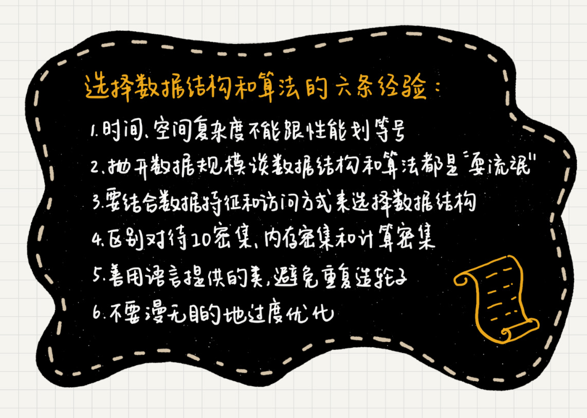

我们在利用数据结构和算法解决问题的时候，一定要先分析清楚问题的需求、限制、隐藏的特点等。只有搞清楚了这些，才能有针对性地选择恰当的数据结构和算法。这种灵活应用的实战能力，需要长期的刻意锻炼和积累。这是一个有经验的工程师和一个学院派的工程师的区别。

好了，今天的内容就到这里了。最后，我想听你谈一谈，你在实际开发选择数据结构和算法时，有什么感受和方法呢？

欢迎在留言区写下你的想法，也欢迎你把今天的文章分享给你的朋友，帮助他在数据结构和算法的实际运用中走得更远。

# 《数据结构与算法之美》学习指导手册

王争 2019-04-22



00:00

[1.0x**](javascript:;)

讲述：修阳 大小：2.36M 时长：02:34

你好，我是王争。

在设计专栏内容的时候，为了兼顾不同基础的同学，我在内容上做到了难易结合，既有简单的数组、链表、栈、队列这些基础内容，也有红黑树、BM、KMP 这些难度较大的算法。但是，对于初学者来说，一下子面对这么多知识，可能还是比较懵。

我觉得，对于初学者来说，先把最简单、最基础、最重要的知识点掌握好，再去研究难度较高、更加高级的知识点，这样由易到难、循序渐进的学习路径，无疑是最合理的。

基于这个路径，我对专栏内容，重新做了一次梳理，希望给你一份具体、明确、有效的学习指导。我会写清楚**每个知识点的难易程度、需要你掌握到什么程度、具体如何来学习**。

如果你是数据结构和算法的初学者，或者你觉得自己的基础比较薄弱，希望这份学习指导，能够让你学起来能更加有的放矢，能把精力、时间花在刀刃上，获得更好的学习效果。

下面，我先给出一个大致的学习路线。

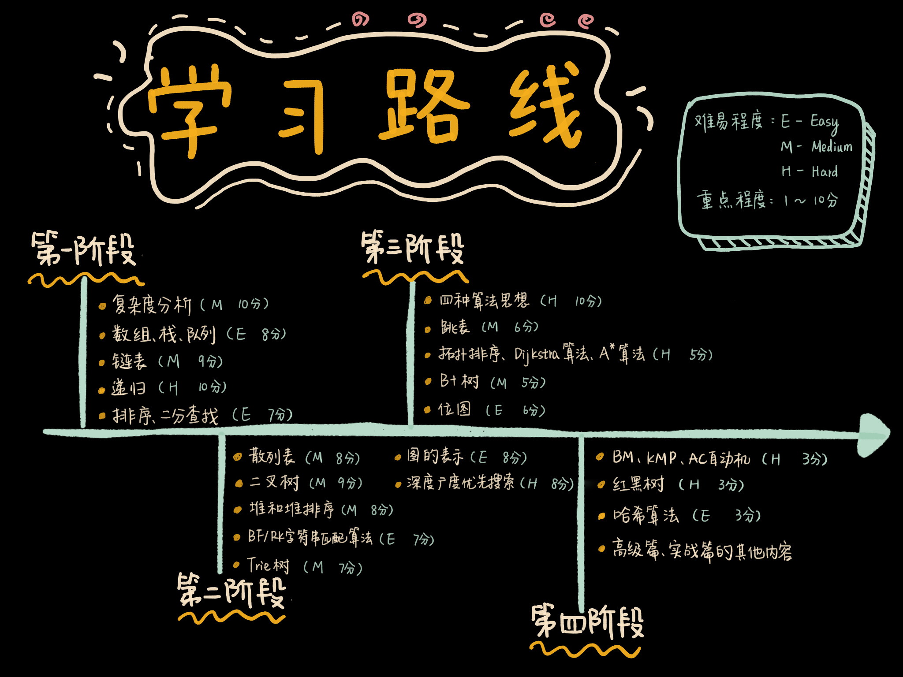

（建议保存后查看大图）

现在，针对每个知识点，我再给你逐一解释一下。我这里先说明一下，下面标记的难易程度、是否重点、掌握程度，都只是针对初学者来说的，如果你已经有一定基础，可以根据自己的情况，安排自己的学习。

## 1. 复杂度分析

尽管在专栏中，我只用了两节课的内容，来讲复杂度分析这个知识点。但是，我想说的是，它真的非常重要。你必须要牢牢掌握这两节，基本上要做到，简单代码能很快分析出时间、空间复杂度；对于复杂点的代码，比如递归代码，你也要掌握专栏中讲到的两种分析方法：递推公式和递归树。

对于初学者来说，光看入门篇的两节复杂度分析文章，可能还不足以完全掌握复杂度分析。不过，在后续讲解每种数据结构和算法的时候，我都有详细分析它们的时间、空间复杂度。所以，你可以在学习专栏中其他章节的时候，再不停地、有意识地去训练自己的复杂度分析能力。

难易程度：Medium

是否重点：10 分

掌握程度：在不看我的分析的情况下，能自行分析专栏中大部分数据结构和算法的时间、空间复杂度

## 2. 数组、栈、队列

这一部分内容非常简单，初学者学起来也不会很难。但是，作为基础的数据结构，数组、栈、队列，是后续很多复杂数据结构和算法的基础，所以，这些内容你一定要掌握。

难易程度：Easy

是否重点：8 分

掌握程度：能自己实现动态数组、栈、队列

## 3. 链表

链表非常重要！虽然理论内容不多，但链表上的操作却很复杂。所以，面试中经常会考察，你一定要掌握。而且，我这里说“掌握”不只是能看懂专栏中的内容，还能将专栏中提到的经典链表题目，比如链表反转、求中间结点等，轻松无 bug 地实现出来。

难易程度：Medium

是否重点：9 分

掌握程度：能轻松写出经典链表题目代码

## 4. 递归

对于初学者来说，递归代码非常难掌握，不管是读起来，还是写起来。但是，这道坎你必须要跨过，跨不过就不能算是入门数据结构和算法。我们后面讲到的很多数据结构和算法的代码实现，都要用到递归。

递归相关的理论知识也不多，所以还是要多练。你可以先在网上找些简单的题目练手，比如斐波那契数列、求阶乘等，然后再慢慢过渡到更加有难度的，比如归并排序、快速排序、二叉树的遍历、求高度，最后是回溯八皇后、背包问题等。

难易程度：Hard

是否重点：10 分

掌握程度：轻松写出二叉树遍历、八皇后、背包问题、DFS 的递归代码

## 5. 排序、二分查找

这一部分并不难，你只需要能看懂我专栏里的内容即可。

难易程度：Easy

是否重点：7 分

掌握程度：能自己把各种排序算法、二分查找及其变体代码写一遍就可以了

## 6. 跳表

对于初学者来说，并不需要非得掌握跳表，所以，如果没有精力，这一章节可以先跳过。

难易程度：Medium

是否重点：6 分

掌握程度：初学者可以先跳过。如果感兴趣，看懂专栏内容即可，不需要掌握代码实现

## 7. 散列表

尽管散列表的内容我讲了很多，有三节课。但是，总体上来讲，这块内容理解起来并不难。但是，作为一种应用非常广泛的数据结构，你还是要掌握牢固散列表。

难易程度：Medium

是否重点：8 分

掌握程度：对于初学者来说，自己能代码实现一个拉链法解决冲突的散列表即可

## 8. 哈希算法

这部分纯粹是为了开拓思路，初学者可以略过。

难易程度：Easy

是否重点：3 分

掌握程度：可以暂时不看

## 9. 二叉树

这一部分非常重要！二叉树在面试中经常会被考到，所以要重点掌握。但是我这里说的二叉树，并不包含专栏中红黑树的内容。红黑树我们待会再讲。

难易程度：Medium

是否重点：9 分

掌握程度：能代码实现二叉树的三种遍历算法、按层遍历、求高度等经典二叉树题目

## 10. 红黑树

对于初学者来说，这一节课完全可以不看。

难易程度：Hard

是否重点：3 分

掌握程度：初学者不用把时间浪费在上面

## 11. B+ 树

虽然 B+ 树也算是比较高级的一种数据结构了，但是对初学者来说，也不是重点。有时候面试的时候还是会问的，所以这一部分内容，你能看懂专栏里的讲解就可以了。

难易程度：Medium

是否重点：5 分

掌握程度：可看可不看

## 12. 堆与堆排序

这一部分内容不是很难，初学者也是要掌握的。

难易程度：Medium

是否重点：8 分

掌握程度：能代码实现堆、堆排序，并且掌握堆的三种应用（优先级队列、Top k、中位数）

## 13. 图的表示

图的内容很多，但是初学者不需要掌握那么多。一般 BAT 等大厂面试，不怎么会面试有关图的内容，因为面试官可能也对这块不会很熟悉哈：）。但是，最基本图的概念、表示方法还是要掌握的。

难易程度：Easy

是否重点：8 分

掌握程度：理解图的三种表示方法（邻接矩阵、邻接表、逆邻接表），能自己代码实现

## 14. 深度广度优先搜索

这算是图上最基础的遍历或者说是搜索算法了，所以还是要掌握一下。这两种算法的原理都不难哈，但是代码实现并不简单，一个用到了队列，另一个用到了递归。对于初学者来说，看懂这两个代码实现就是一个挑战！可以等到其他更重要的内容都掌握之后，再来挑战，也是可以的。

难易程度：Hard

是否重点：8 分

掌握程度：能代码实现广度优先、深度优先搜索算法

## 15. 拓扑排序、最短路径、A* 算法

这几个算法稍微高级点。如果你能轻松实现深度、广度优先搜索，那看懂这三个算法不成问题。不过，这三种算法不是重点。面试不会考的。

难易程度：Hard

是否重点：5 分

掌握程度：有时间再看，暂时可以不看

## 16. 字符串匹配（BF、RK）

BF 非常简单，RK 稍微复杂点，但都不难。这个最好还是掌握下。

难易程度：Easy

是否重点：7 分

掌握程度：能实践 BF 算法，能看懂 RK 算法

## 17. 字符串匹配（BM、KMP、AC 自动机）

这三个算法都挺难的，对于算法有一定基础的人来说，看懂也不容易。所以，对于初学者来说，千万别浪费时间在这上面。即便有余力，看懂就好了，不用非得能自己实现。

难易程度：Hard

是否重点：3 分

掌握程度：初学者不用把时间浪费在上面

## 18. 字符串匹配（Trie）

这个还是要能看懂，不过不需要能代码实现。有些面试官喜欢考这个东西，主要是结合应用场景来考察，只是看你知不知道要用 Trie 树这个东西。

难易程度：Medium

是否重点：7 分

掌握程度：能看懂，知道特点、应用场景即可，不要求代码实现

## 19. 位图

位图不是重点，如果有余力最好掌握一下。

难易程度：Easy

是否重点：6 分

掌握程度：看懂即可，能自己实现一个位图结构最好

## 20. 四种算法思想

这个是重点，也是难点。贪心、分治、回溯、动态规划，每一个都不简单，其中动态规划又是最难、最烧脑的。要应付 FLAG 这样公司的面试，必须拿下这块内容。但是呢，学习要循序渐进，这块内容的学习可以放到最后，做个长时间的学习计划来攻克。

这块内容理论的东西不多，要想真的掌握，还是要大量刷题。

难易程度：Hard

是否重点：10 分

掌握程度：可以放到最后，但是一定要掌握！做到能实现 Leetcode 上 Medium 难度的题目

学而时习之，专栏虽然已经结束，但是学习的同学和留言依旧源源不断。希望这份学习指导手册对你有帮助，也欢迎你继续给我留言，和大家一起交流、学习、进步。

# 春节7天练 | Day 1：数组和链表

王争 2019-02-04



00:00

[1.0x**](javascript:;)

讲述：修阳 大小：1.53M 时长：01:39

你好，我是王争。首先祝你新年快乐！

专栏的正文部分已经结束，相信这半年的时间，你学到了很多，究竟学习成果怎样呢？

我整理了数据结构和算法中必知必会的 30 个代码实现，从今天开始，分 7 天发布出来，供你复习巩固所用。你可以每天花一点时间，来完成测验。测验完成后，你可以根据结果，回到相应章节，有针对性地进行复习。

除此之外，@Smallfly 同学还整理了一份配套的 LeetCode 练习题，你也可以一起练习一下。在此，我谨代表我本人对 @Smallfly 表示感谢！

另外，我还为假期坚持学习的同学准备了丰厚的春节加油礼包。

2 月 5 日 -2 月 14 日，只要在专栏文章下的留言区写下你的答案，参与答题，并且留言被精选，即可获得极客时间 10 元无门槛优惠券。

7 篇中的所有题目，只要回答正确 3 道及以上，即可获得极客时间 99 元专栏通用阅码。

如果 7 天连续参与答题，并且每天的留言均被精选，还可额外获得极客时间价值 365 元的每日一课年度会员。

## 关于数组和链表的几个必知必会的代码实现

### 数组

实现一个支持动态扩容的数组

实现一个大小固定的有序数组，支持动态增删改操作

实现两个有序数组合并为一个有序数组

### 链表

实现单链表、循环链表、双向链表，支持增删操作

实现单链表反转

实现两个有序的链表合并为一个有序链表

实现求链表的中间结点

## 对应的 LeetCode 练习题（@Smallfly 整理）

### 数组

Three Sum（求三数之和）

英文版：https://leetcode.com/problems/3sum/

中文版：https://leetcode-cn.com/problems/3sum/

Majority Element（求众数）

英文版：https://leetcode.com/problems/majority-element/

中文版：https://leetcode-cn.com/problems/majority-element/

Missing Positive（求缺失的第一个正数）

英文版：https://leetcode.com/problems/first-missing-positive/

中文版：https://leetcode-cn.com/problems/first-missing-positive/

### 链表

Linked List Cycle I（环形链表）

英文版：https://leetcode.com/problems/linked-list-cycle/

中文版：https://leetcode-cn.com/problems/linked-list-cycle/

Merge k Sorted Lists（合并 k 个排序链表）

英文版：https://leetcode.com/problems/merge-k-sorted-lists/

中文版：https://leetcode-cn.com/problems/merge-k-sorted-lists/

做完题目之后，你可以点击“请朋友读”，把测试题分享给你的朋友，说不定就帮他解决了一个难题。

祝你取得好成绩！明天见！

# 春节7天练 | Day 2：栈、队列和递归

王争 2019-02-05



00:00

[1.0x**](javascript:;)

讲述：修阳 大小：803.06K 时长：00:50

你好，我是王争。初二好！

为了帮你巩固所学，真正掌握数据结构和算法，我整理了数据结构和算法中，必知必会的 30 个代码实现，分 7 天发布出来，供你复习巩固所用。今天是第二篇。

和昨天一样，你可以花一点时间，来完成测验。测验完成后，你可以根据结果，回到相应章节，有针对性地进行复习。

## 关于栈、队列和递归的几个必知必会的代码实现

### 栈

用数组实现一个顺序栈

用链表实现一个链式栈

编程模拟实现一个浏览器的前进、后退功能

### 队列

用数组实现一个顺序队列

用链表实现一个链式队列

实现一个循环队列

### 递归

编程实现斐波那契数列求值 f(n)=f(n-1)+f(n-2)

编程实现求阶乘 n!

编程实现一组数据集合的全排列

## 对应的 LeetCode 练习题（@Smallfly 整理）

### 栈

Valid Parentheses（有效的括号）

英文版：https://leetcode.com/problems/valid-parentheses/

中文版：https://leetcode-cn.com/problems/valid-parentheses/

Longest Valid Parentheses（最长有效的括号）

英文版：https://leetcode.com/problems/longest-valid-parentheses/

中文版：https://leetcode-cn.com/problems/longest-valid-parentheses/

Evaluate Reverse Polish Notatio（逆波兰表达式求值）

英文版：https://leetcode.com/problems/evaluate-reverse-polish-notation/

中文版：https://leetcode-cn.com/problems/evaluate-reverse-polish-notation/

### 队列

Design Circular Deque（设计一个双端队列）

英文版：https://leetcode.com/problems/design-circular-deque/

中文版：https://leetcode-cn.com/problems/design-circular-deque/

Sliding Window Maximum（滑动窗口最大值）

英文版：https://leetcode.com/problems/sliding-window-maximum/

中文版：https://leetcode-cn.com/problems/sliding-window-maximum/

### 递归

Climbing Stairs（爬楼梯）

英文版：https://leetcode.com/problems/climbing-stairs/

中文版：https://leetcode-cn.com/problems/climbing-stairs/

昨天的第一篇，是关于数组和链表的，如果你错过了，点击文末的“上一篇”，即可进入测试。

祝你取得好成绩！明天见！

# 春节7天练 | Day 3：排序和二分查找

王争 2019-02-06



00:00

[1.0x**](javascript:;)

讲述：修阳 大小：862.31K 时长：00:54

你好，我是王争。初三好！

为了帮你巩固所学，真正掌握数据结构和算法，我整理了数据结构和算法中，必知必会的 30 个代码实现，分 7 天发布出来，供你复习巩固所用。今天是第三篇。

和昨天一样，你可以花一点时间，来完成测验。测验完成后，你可以根据结果，回到相应章节，有针对性地进行复习。

前两天的内容，是关于数组和链表、排序和二分查找的。如果你错过了，点击文末的“上一篇”，即可进入测试。

## 关于排序和二分查找的几个必知必会的代码实现

### 排序

实现归并排序、快速排序、插入排序、冒泡排序、选择排序

编程实现 O(n) 时间复杂度内找到一组数据的第 K 大元素

### 二分查找

实现一个有序数组的二分查找算法

实现模糊二分查找算法（比如大于等于给定值的第一个元素）

## 对应的 LeetCode 练习题（@Smallfly 整理）

Sqrt(x) （x 的平方根）

英文版：https://leetcode.com/problems/sqrtx/

中文版：https://leetcode-cn.com/problems/sqrtx/

做完题目之后，你可以点击“请朋友读”，把测试题分享给你的朋友，说不定就帮他解决了一个难题。

祝你取得好成绩！明天见！

# 春节7天练 | Day 4：散列表和字符串

王争 2019-02-08



00:00

[1.0x**](javascript:;)

讲述：修阳 大小：471.18K 时长：00:29

你好，我是王争。初四好！

为了帮你巩固所学，真正掌握数据结构和算法，我整理了数据结构和算法中，必知必会的 30 个代码实现，分 7 天发布出来，供你复习巩固所用。今天是第四篇。

和昨天一样，你可以花一点时间，来完成测验。测验完成后，你可以根据结果，回到相应章节，有针对性地进行复习。

前几天的内容。如果你错过了，点击文末的“上一篇”，即可进入测试。

## 关于散列表和字符串的 4 个必知必会的代码实现

### 散列表

实现一个基于链表法解决冲突问题的散列表

实现一个 LRU 缓存淘汰算法

### 字符串

实现一个字符集，只包含 a～z 这 26 个英文字母的 Trie 树

实现朴素的字符串匹配算法

## 对应的 LeetCode 练习题（@Smallfly 整理）

### 字符串

Reverse String （反转字符串）

英文版：https://leetcode.com/problems/reverse-string/

中文版：https://leetcode-cn.com/problems/reverse-string/

Reverse Words in a String（翻转字符串里的单词）

英文版：https://leetcode.com/problems/reverse-words-in-a-string/

中文版：https://leetcode-cn.com/problems/reverse-words-in-a-string/

String to Integer (atoi)（字符串转换整数 (atoi)）

英文版：https://leetcode.com/problems/string-to-integer-atoi/

中文版：https://leetcode-cn.com/problems/string-to-integer-atoi/

做完题目之后，你可以点击“请朋友读”，把测试题分享给你的朋友，说不定就帮他解决了一个难题。

祝你取得好成绩！明天见！

# 春节7天练 | Day 5：二叉树和堆

王争 2019-02-09



00:00

[1.0x**](javascript:;)

讲述：修阳 大小：323.43K 时长：00:20

你好，我是王争。春节假期进入尾声了。你现在是否已经准备返回工作岗位了呢？今天更新的是测试题的第五篇，我们继续来复习。

## 关于二叉树和堆的 7 个必知必会的代码实现

### 二叉树

实现一个二叉查找树，并且支持插入、删除、查找操作

实现查找二叉查找树中某个节点的后继、前驱节点

实现二叉树前、中、后序以及按层遍历

### 堆

实现一个小顶堆、大顶堆、优先级队列

实现堆排序

利用优先级队列合并 K 个有序数组

求一组动态数据集合的最大 Top K

## 对应的 LeetCode 练习题（@Smallfly 整理）

Invert Binary Tree（翻转二叉树）

英文版：https://leetcode.com/problems/invert-binary-tree/

中文版：https://leetcode-cn.com/problems/invert-binary-tree/

Maximum Depth of Binary Tree（二叉树的最大深度）

英文版：https://leetcode.com/problems/maximum-depth-of-binary-tree/

中文版：https://leetcode-cn.com/problems/maximum-depth-of-binary-tree/

Validate Binary Search Tree（验证二叉查找树）

英文版：https://leetcode.com/problems/validate-binary-search-tree/

中文版：https://leetcode-cn.com/problems/validate-binary-search-tree/

Path Sum（路径总和）

英文版：https://leetcode.com/problems/path-sum/

中文版：https://leetcode-cn.com/problems/path-sum/

做完题目之后，你可以点击“请朋友读”，把测试题分享给你的朋友。

祝你取得好成绩！明天见！

# 春节7天练 | Day 6：图

王争 2019-02-10



00:00

[1.0x**](javascript:;)

讲述：修阳 大小：284.43K 时长：00:17

你好，我是王争。初六好！

为了帮你巩固所学，真正掌握数据结构和算法，我整理了数据结构和算法中，必知必会的 30 个代码实现，分 7 天发布出来，供你复习巩固所用。今天是第六篇。

和之前一样，你可以花一点时间，来手写这些必知必会的代码。写完之后，你可以根据结果，回到相应章节，有针对性地进行复习。做到这些，相信你会有不一样的收获。

## 关于图的几个必知必会的代码实现

### 图

实现有向图、无向图、有权图、无权图的邻接矩阵和邻接表表示方法

实现图的深度优先搜索、广度优先搜索

实现 Dijkstra 算法、A* 算法

实现拓扑排序的 Kahn 算法、DFS 算法

## 对应的 LeetCode 练习题（@Smallfly 整理）

Number of Islands（岛屿的个数）

英文版：https://leetcode.com/problems/number-of-islands/description/

中文版：https://leetcode-cn.com/problems/number-of-islands/description/

Valid Sudoku（有效的数独）

英文版：https://leetcode.com/problems/valid-sudoku/

中文版：https://leetcode-cn.com/problems/valid-sudoku/

做完题目之后，你可以点击“请朋友读”，把测试题分享给你的朋友，说不定就帮他解决了一个难题。

祝你取得好成绩！明天见！

# 春节7天练 | Day 7：贪心、分治、回溯和动态规划

王争 2019-02-10



00:00

[1.0x**](javascript:;)

讲述：修阳 大小：540.56K 时长：00:34

你好，我是王争。今天是节后的第一个工作日，也是我们“春节七天练”的最后一篇。

## 几种算法思想必知必会的代码实现

### 回溯

利用回溯算法求解八皇后问题

利用回溯算法求解 0-1 背包问题

### 分治

利用分治算法求一组数据的逆序对个数

### 动态规划

0-1 背包问题

最小路径和（详细可看 @Smallfly 整理的 Minimum Path Sum）

编程实现莱文斯坦最短编辑距离

编程实现查找两个字符串的最长公共子序列

编程实现一个数据序列的最长递增子序列

## 对应的 LeetCode 练习题（@Smallfly 整理）

Regular Expression Matching（正则表达式匹配）

英文版：https://leetcode.com/problems/regular-expression-matching/

中文版：https://leetcode-cn.com/problems/regular-expression-matching/

Minimum Path Sum（最小路径和）

英文版：https://leetcode.com/problems/minimum-path-sum/

中文版：https://leetcode-cn.com/problems/minimum-path-sum/

Coin Change （零钱兑换）

英文版：https://leetcode.com/problems/coin-change/

中文版：https://leetcode-cn.com/problems/coin-change/

Best Time to Buy and Sell Stock（买卖股票的最佳时机）

英文版：https://leetcode.com/problems/best-time-to-buy-and-sell-stock/

中文版：https://leetcode-cn.com/problems/best-time-to-buy-and-sell-stock/

Maximum Product Subarray（乘积最大子序列）

英文版：https://leetcode.com/problems/maximum-product-subarray/

中文版：https://leetcode-cn.com/problems/maximum-product-subarray/

Triangle（三角形最小路径和）

英文版：https://leetcode.com/problems/triangle/

中文版：https://leetcode-cn.com/problems/triangle/

到此为止，七天的练习就结束了。这些题目都是我精选出来的，是基础数据结构和算法中最核心的内容。建议你一定要全部手写练习。如果一遍搞不定，你可以结合前面的章节，多看几遍，反复练习，直到能够全部搞定为止。

学习数据结构和算法，最好的方法就是练习和实践。我相信这在任何知识的学习过程中都适用。

最后，祝你工作顺利！学业进步！

# 用户故事 | Jerry银银：这一年我的脑海里只有算法

Jerry银银 2019-02-13



00:00

[1.0x**](javascript:;)

讲述：修阳 大小：7.65M 时长：08:20

比尔·盖茨曾说过：“如果你自以为是一个很好的程序员，请去读读 Donald E. Knuth 的《计算机程序设计艺术》吧……要是你真把它读下来了，就毫无疑问可以给我递简历了。”虽然比尔·盖茨推荐的是《计算机程序设计艺术》这本书，但是本质却折射出了算法的重要性。

大家好，我是 Jerry 银银，购买过算法专栏的同学应该时不时会看到我的留言！目前我是一名 Android 应用开发工程师，主要从事移动互联网教育软件的研发，坐标上海。

## 我为何要学算法？

细细想来，从毕业到现在，7 年多的时间，我的脑海里一直没有停止过思考这样一个问题：**技术人究竟能够走多远，技术人的路究竟该如何走下去**？相信很多技术人应该有同样的感受，因为技术的更新迭代实在是太快了，但是我心里明白：**我得为长远做打算，否则，就算换公司、换工作，可能本质也不会有什么改变**。

但是，我其实不太清楚自己到底应该往什么地方努力。于是，我翻阅了好多书籍，搜寻 IT 领域各种牛人的观点。多方比较之后，我终于决定，从基础开始，从计算机领域最基础、最重要的一门课开始。毫无疑问，这门课就是数据结构和算法。

## 我是如何遇见极客时间的？

既然找到了方向，那就开始吧。可是问题来了，从哪儿开始呢？大方向虽然有了，可是具体的实现细节还是得慢慢摸索。大学没怎么学，工作这么多年也没有刻意练习，起初我还真不知道从哪儿开始，只是买了本书，慢慢地啃，也找了一些简单的题目开始做。有过自学经历的同学，应该有同感吧？刚开始连单链表翻转这样简单的题都要折腾半天，真心觉得“痛苦”。

之前我在极客时间上订阅过“Java 核心技术 36 讲”，体会到了专栏和书本的不同。极客时间的专栏作者都是有着丰富的一线开发经验，能很好地把知识和实战结合在一起的大牛。这些课听起来非常爽。估计你应该经常跟我一样感叹：“哦！原来这些知识还可以这么使用！”当时我就在想，极客时间啥时候有一门算法课就好了。

说来真是巧，没多久，极客时间就推出了“数据结构与算法之美”。我试读了《为什么要学习数据结构和算法》和《数组：为什么很多编程语言中数组都从 0 开始编号？》这两篇之后，立即购买了。

到现在，专栏学完了，但是我依然记得，王争老师在《为什么要学习数据结构和算法》这篇文章里面提到的三句话，因为这每一句话都刺痛了我的小心脏！

第一句：业务开发工程师，你真的愿意做一辈子 CRUD Boy 吗？

第二句：基础架构研发工程师，写出达到开源水平的框架才是你的目标！

第三句：对编程还有追求？不想被行业淘汰？那就不要只会写凑合能用的代码！

## 我每天是怎么学专栏的？

于是，每天早上醒来，我的第一件事就是听专栏！专栏在每周的一、三、五更新，每周的这三天早上，我会听更新的文章。其它时间，我就听老的文章，当作复习。

听的过程，我一般会分这么几种情况。

**第一种情况，更新的内容是我之前就已经学过的，基本已经掌握了的**。这种情况下，听起来相对轻松点，基本上听一遍就够了。起床之后，再做一下老师给的思考题。这种情况在专栏的基础部分出现得比较多，像数组、链表、栈、队列、哈希表这些章节，我基本上都是这么过来的。

**第二种情况，更新的内容是我学过的，但是还不太精通的**。这种情况下，王争老师讲的内容都会将我的认知往前“推进”一步。顺利的话，我会在上班之前就搞懂今天更新的内容。这种情况是曾经没有接触过的内容，但是整体来说不难的理解的，比如跳表、递归等。

**还有一种情况，就是听一遍不够，听完再看一遍也不行，上午上班之前也搞不定的**。不过，我也不会急躁。我心里知道，我可能需要换换脑子，说不定，在上午工作期间，灵感会突然冒出来。这种情况一般出现在红黑树、字符串查找算法、动态规划这些章节。

到了中午休息时间，我会一个人在公司楼下转一圈，同样，还是听专栏、看专栏。

如果今天的文章，早上已经搞定了，我会重新看下其他同学的留言，看看其他同学是如何思考文章的课后思考题的，还有就是，我会看看其他同学学习过程中，会有哪些疑问，这些疑问自己曾经是否遇到过，现在是否已经完全解决了。

如果今天的文章，早上没有彻底搞懂，这种情况下，我会极力利用中午的时间去思考。

晚上的时间通常无法确定，我有时候会加班到很晚，回到家，再去啃算法，效率也不高。所以，我一般会在晚上“看”算法。为什么我会用双引号呢？是因为我真得只是“看”，目的就是加深印象。

以上基本是我工作日学专栏的“套路”。

等到了周末或者其它节假日，就是“打攻坚战”的时候了。估计很多上班族和我一样，只有周末才有大量集中思考的时间。这时候，我一般会通过做题来反向推动自己的算法学习。

像红黑树、Trie 树、递归、动态规划这些内容，我都是在周末和节假日搞懂的。虽然到现在对其中一些知识还不能达到游刃有余的地步，但是对一般的问题，大体上我都知道该如何抽象、如何拆解了。

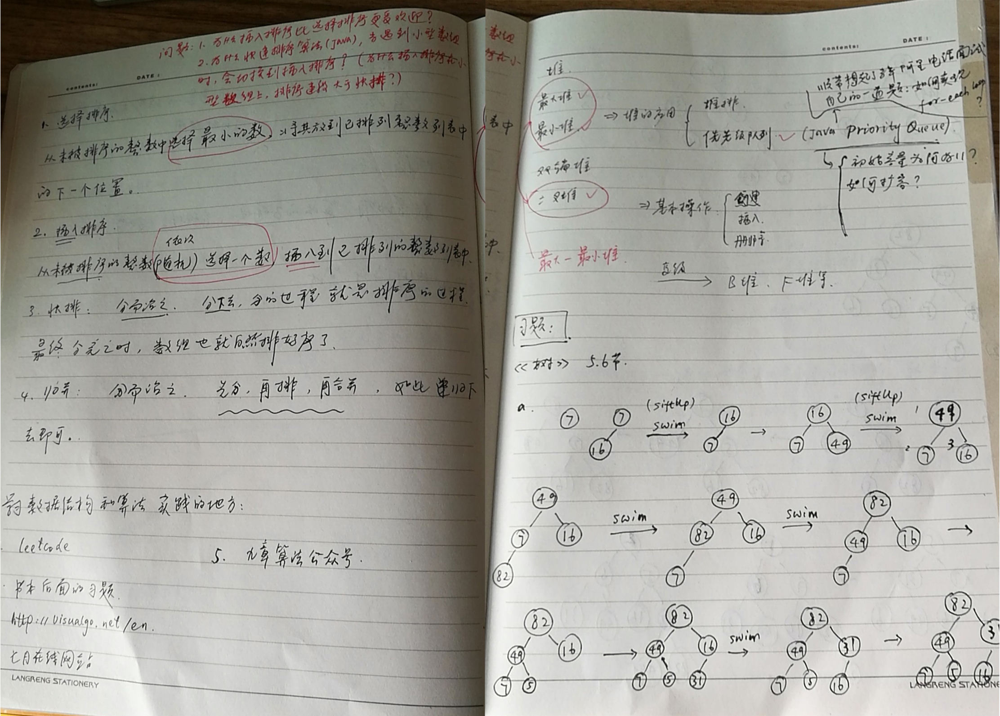

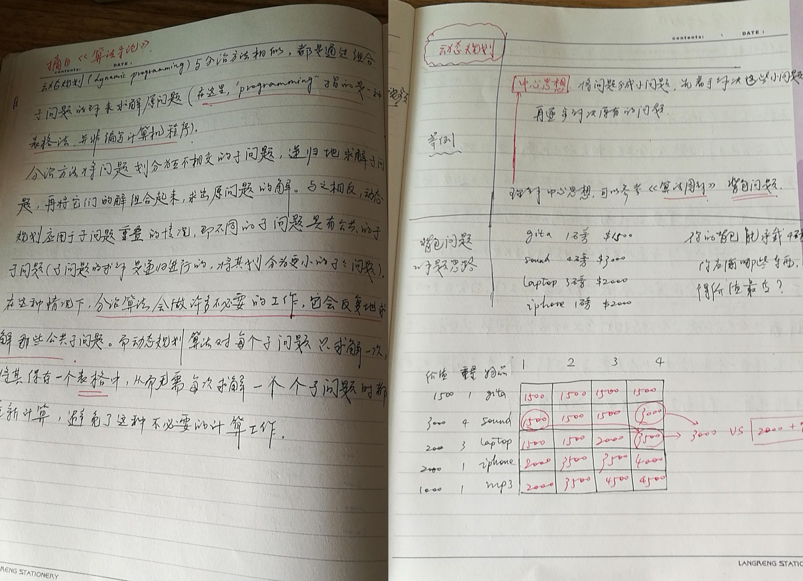

我在学习算法时记的笔记

## 通过学习专栏，我有什么不一样的收获？

**首先，专栏学习拓宽了我的知识面。**例如，很多书本不讲的跳表，王争老师用了一篇文章来讲解。犹记得当我看完跳表时，心想，这么简单、易懂、高效的数据结构，为什么很多书籍都没有呢？这个专栏真的买值了！

**其次，专栏的理论和实践结合很强。**书籍是通用性很强的教材，一般很少会涉及软件系统是如何使用具体的数据结构和算法的。在专栏中，老师把对应的知识和实践相互结合，听起来特别过瘾！比如堆这种数据结构，理解起来不难，但是要用好它，还得下点功夫，经过老师一讲解，搭配音频，我的理解也变得更加深入了。

**最后，专栏留言这个功能真的太好了，为自学带来了诸多便利，也让我获得了很多正向反馈。**很多时候，经过相当长的一段时间思考，还是不能打通任督二脉，其实后来回想，当时就差那一层窗户纸了。于是，我在文末留下了自己的疑问，结果王争老师轻描淡写一句话我就明白了。

留言功能还有个非常大的好处。如果你用心学习，用心思考，用心留言，你的留言很大概率会被同伴点赞，很多时候还能被置顶。这本身就是一种正向反馈，也会更加促进自己的学习动力。还有一种更爽的体验，突然有一天早上，我照例醒来听专栏，突然听到了自己的名字。这个专栏 4 万多人订阅，老师居然记得我！可见王争老师真的认真看了每一条留言。

最后，我总结下自己学这个专栏的收获。尽管很多，但是我想用三句话来概括。

第一，写代码的时候，我会很自然地从时间和空间角度去衡量代码的优劣，时间、空间意识被加强了很多。

第二，学习算法的过程，有很多的“痛苦”，也正是因为这些“痛苦”，我学到了很多知识以外的东西。

第三，过程可能比知识更重要。要从过程中体会成长和精进的乐趣，而知识是附加产品！

专栏虽然结束，但是学习并没有结束。同学们，我们开头见！

# 用户故事 | zixuan：站在思维的高处，才有足够的视野和能力欣赏“美”

zixuan 2019-02-15



00:00

[1.0x**](javascript:;)

讲述：修阳 大小：11.53M 时长：12:35

大家好，我是 zixuan，在一家国内大型互联网公司做后端开发，坐标深圳，工作 5 年多了。今天和大家分享一下，我学习专栏的一些心得体会。

随着年龄的增长，我经历了不少业务、技术平台、中间件等多种环境和编程工具的迭代变更。与此同时，我越来越意识到，要做一名优秀的程序员，或者说，能够抵御年龄增长并且增值的程序员，有两样内功是必须持续积累的，那就是**软件工程经验方法**和**算法应用能力**。

通俗地讲，就是不论在什么系统或业务环境下、用什么编程工具，都能写出高质量、可维护、接口化代码的能力，以及分解并给出一个实际问题有效解决方案的能力。

## 我为什么会订阅这个专栏？

这也是为什么我在极客时间上看到王争老师的“数据结构与算法之美”的开篇词之后，果断地加入学习行列。同时，我也抱有以下两点期望。

第一，这个专栏是从工程应用，也就是解决实际问题的角度出发来讲算法的，原理和实践相辅相成，现学现用，并且重视思考过程。从我个人经验来看，这的确是比较科学的学习方法。我相信很多人和我一样，以前在学校里都学过算法，不过一旦不碰书了，又没有了应用场景后，很快就把学过的东西丢了，重新拾起来非常困难。

第二，从专栏的标题看出，王争老师试图带我们感受算法的“美”，那必将要先引导我们站在思维的高处，这样才有足够的视野和能力去欣赏这种“美”。我很好奇他会怎么做，也好奇我能否真正地改变以前的认知，切身地感受到“美”。

## 我是如何学习这个专栏的？

就这样，同时带着笃定和疑问，我上路了。经过几个月的认真学习，“数据结构与算法之美”成了我在极客时间打开次数最多，花费时间最多，完成度也最高的一门课。**尽管如此，我觉得今后我很可能还会再二刷、多刷****这门课****，把它作为一个深入学习的索引入口。** 接下来，我就从几个方面，跟你分享下，这半年我学习这个专栏的一些感受和收获。

### 1. 原理和实用并重：从实践中总结，应用到实践中去

学习的最终目的是为了解决实际问题，专栏里讲的很多方法甚至代码，都能够直接应用到大型项目中去，而不仅仅是简单的原理示例。

比如王争老师在讲散列表的时候，讲了实现一个工业级强度的散列表有哪些需要注意的点。基本上面面俱到，我在很多标准库里都找到了印证。再比如，老师讲的 LRU Cache、Bloom Filter、范围索引上的二分查找等等，也基本和我之前阅读 LevelDB 源代码时，看到的实现细节如出一辙，无非是编程语言的差别。

所以，看这几部分的时候，我觉得十分惊喜，因为我经历过相关的实际应用场景。反过来，专栏这种原理和实用并重的风格，也能帮助我今后在阅读开源代码时提升效率、增进理解。

另外，我觉察到，文章的组织结构，应该也是老师试图传达给我们的“他自己的学习方法”：从开篇介绍一个经典的实际问题开始（需求），到一步步思考引导（分析），再到正式引出相关的数据结构和算法（有效解决方案），再将其应用于开篇问题的解决（实现、测试），最后提出一个课后思考题（泛化、抽象、交流、提升）。

这个形式其实和解决实际工程问题的过程非常类似。我想，大部分工程师就是在一个个这样的过程中不断积累和提升自己的，所以我觉得这个专栏，不论是内容还是形式真的都很赞。

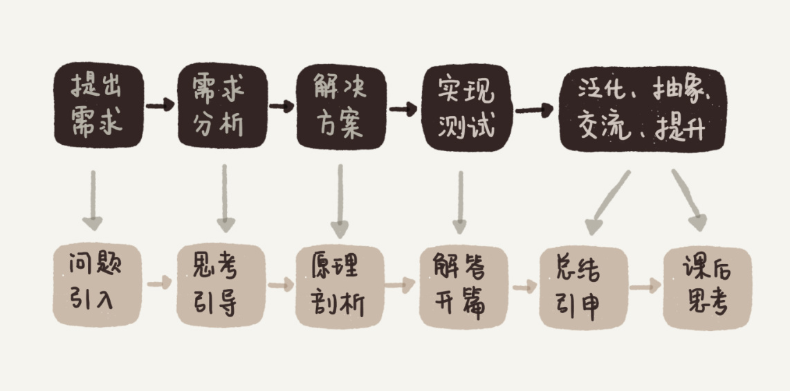

### 2. 学习新知识的角度：体系、全面、严谨、精炼，可视化配图易于理解

“全面”并不是指所有细节面面俱到。事实上，由于算法这门学科本身庞大的体量，这类专栏一般只能看作一个丰富的综述目录，或者深入学习的入口。尽管如此，王争老师依然用简洁精炼的语言 Cover 到了几乎所有最主要的数据结构和算法，以及它们背后的本质思想、原理和应用场景，知识体系结构全面完整并自成一体。

我发现只要能紧跟老师的思路，把每一节的内容理解透彻，到了语言实现部分，往往变成了一种自然的总结描述，所以代码本身并不是重点，重点是背后的思路。

例如，KMP 单模式串匹配和 AC 自动机多模式串匹配算法是我的知识盲区。以前读过几次 KMP 的代码，都没完全搞懂，于是就放弃了。至于 AC 自动机，惭愧地说，我压根儿就没怎么听说过。

但是，在专栏里，王争老师从 BruteForce 方法讲起，经过系统的优化思路铺垫，通俗的举例，再结合恰到好处的配图，最后给出精简的代码。我跟随着老师一路坚持下来，当我看到第二遍时突然就豁然开朗了。而当我真正理解了 AC 自动机的构建和工作原理之后，在某一瞬间，我的内心的确生出了一种美的感觉（或者更多的是“妙”吧？）。

AC 自动机构建的代码，让我不自觉地想到“编织”这个词。之前还觉得凌乱的、四处喷洒的指针，在这里一下子变成了一张有意义的网，编织的过程和成品都体现出了算法的巧妙。这类联想无疑加深了我对这类算法的理解，也许这也意味着，我可以把它正式加入到自己的算法工具箱里了。

另外一个例子是动态规划。以前应用 DP 的时候，我常常比较盲目，不知道怎么确定状态的表示，甚至需要几维的状态都不清楚，可以说是在瞎猜碰运气。经过老师从原理到实例的系统讲解后，我现在明白，原来 DP 本质上就是在压缩重复子问题，状态的定义可以通过最直接的回溯搜索来启发确定。明白这些之后，动态规划也被我轻松拿下了。

### 3. 已有知识加深的角度：促进思考，连点成线

之前看目录的时候，我发现专栏里包含了不少我已经知道的知识。但真正学习了之后，我发现，以前头脑中的不少概念知识点，是相对独立存在的，基本上一个点就对应固定的那几个场景，而在专栏里，王争老师比较注重概念之间的相互关联。对于这些知识，经过王争老师的讲解，基本可以达到交叉强化理解，甚至温故知新的效果。

比如老师会问你，在链表上怎么做二分查找？哈希和链表为什么经常在一起出现？这些问题我之前很少会考虑到，但是当我看到的时候，却启发出很多新的要点和场景（比如 SkipList、LRUCache）。

更重要的是，跟着专栏学习一段时间之后，我脑中原本的一些旧概念，也开始自发地建立起新的连接，连点成线，最后产生了一些我之前从未注意到的想法。

举个感触最深的例子。在跟随专栏做了大量递归状态跟进推演，以及递归树分析后，我现在深刻地认识到，递归这种编程技巧背后，其实是树和堆栈这两种看似关联不大的数据结构。为什么这么说呢？

堆栈和树在某个层面上，其实有着强烈的对应关系。我刚接触递归的时候，和大多数初学者一样，脑子很容易跟着机器执行的顺序往深里绕，就像 Debug 一个很深的函数调用链一样，每遇到一个函数就 step into，也就是递归函数展开 -> 下一层 -> 递归函数展开 -> 下一层 ->…，结果就是只有“递”，没有“归”，大脑连一次完整调用的一半都跑不完（或者跑完一次很辛苦），自然就会觉得无法分析。如下图，每个圈代表在某一层执行的递归函数，向下的箭头代表调用并进入下一层。

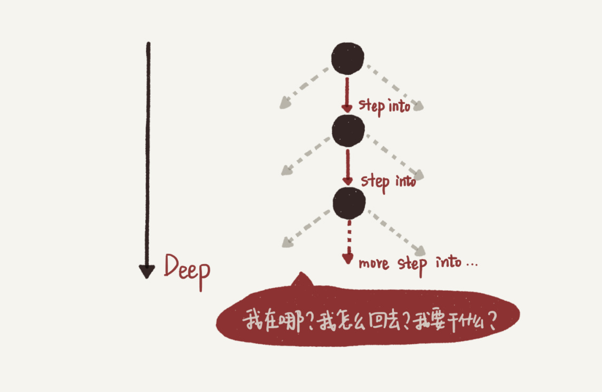

我初学递归时遇到的问题：有去无回，陷得太深

随着我处理了越来越多的递归，我慢慢意识到，为什么人的思考一定要 follow 机器的执行呢？在递归函数体中，我完全可以不用每遇到递归调用都展开并进入下一层（step into），而是可以直接假定下一层调用能够正确返回，然后我该干嘛就继续干嘛（step over），这样的话，我只需要保证最深一层的逻辑，也就是递归的终止条件正确即可。

原因也很简单，不管在哪一层，都是在执行递归函数这同一份代码，不同的层只有一些状态数据不同而已，所以我只需要保证递归函数代码逻辑的正确性，就确保了运行时任意一层的结果正确性。像这样说服自己可以随时 step over 后，我的大脑终于有“递”也有“归”了，后续事务也就能够推动了。

有一定经验后我如何思考递归：有去有回，自由把握

最近在学习这门课程的过程中，我进一步认识到，其实上面两个理解递归的方式，分别对应递归树的深度遍历和广度遍历。尽管机器只能按照深度优先的方式执行递归代码，但人写递归代码的时候更适合用广度的思考方式。当我在实现一个递归函数的时候，其实就是在确定这棵树的整体形状：什么时候终止，什么条件下生出子树，也就是说我实际上是在编程实现一棵树。

那递归树和堆栈又有什么关系呢？递归树中从根节点到树中任意节点的路径，都对应着某个时刻的函数调用链组成的堆栈。递归越深的节点越靠近栈顶，也越早返回。因而我们可以说，递归的背后是一棵树，递归的执行过程，就是在这棵树上做深度遍历的过程，每次进入下一层（“递”）就是压栈，每次退出当前层（“归”）就是出栈。所有的入栈、出栈形成的脉络就组成了递归树的形态。递归树是静态逻辑背景，而当前活跃堆栈是当前动态运行前景。

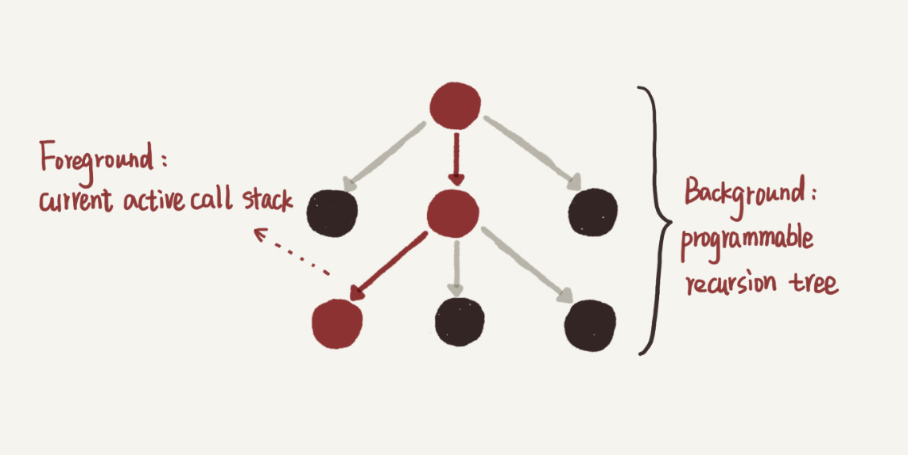

学完专栏后我怎么看待递归：胸有成“树”，化动为静

这样理解之后，编写或阅读递归代码的时候，我真的能够站得更高，看得更全面，也更不容易掉入一些细节陷阱里去了。

说到这里，我想起之前在不同时间做过的两道题，一道是计算某个长度为 n 的入栈序列可以有多少种出栈序列，另一道是计算包含 n 个节点的二叉树有多少种形状。我惊讶地发现，这两个量竟然是相等的（其实就是卡特兰数）。当时我并不理解为什么栈和树会存在这种关联，现在通过类似递归树的思路我觉得我能够理解了，那就是每种二叉树形状的中序遍历都能够对应上一种出栈顺序。

类似这样“旧知识新理解”还有很多，尽管专栏里并没有直接提到，但是这都是我跟随专栏，坚持边学边思考，逐步感受和收获的。

## 总结

基于以上谈的几点收获和感受，我再总结下我认为比较有用的、学习这个专栏的方法。

**1. 紧跟老师思路走，尽量理解每一句话、每一幅配图，亲手推演每一个例子。**

王争老师语言精炼。有些文字段落虽短，但背后的信息量却很大。为了方便我们理解，老师用了大量的例子和配图来讲解。即便是非常复杂、枯燥的理论知识，我们理解起来也不会太吃力。

当然有些地方确实有点儿难，这时我们可以退而求其次，“先保接口，再求实现”。例如，红黑树保持平衡的具体策略实现，我跟不下来，就暂时跳过去了，但是我只要知道，它是一种动态数据的高效平衡树，就不妨碍我先使用这个工具，之后再慢慢理解。

**2. 在学的过程中回顾和刷新老知识点，并往工程实践上靠。学以致用是最高效的方法**。

**3. 多思考，思考比结果重要；多交流，亲身感受和其他同学一起交流帮助很大。**

最后，感谢王争老师和极客时间，让我在这个专栏里有了不少新收获。祝王争老师事业蒸蒸日上，继续开创新品，也希望极客时间能够联合更多的大牛老师，开发出更多严谨又实用的精品课程！

# 结束语 | 送君千里，终须一别

王争 2019-02-20



00:00

[1.0x**](javascript:;)

讲述：修阳 大小：4.34M 时长：04:44

专栏到今天真的要结束了。在写这篇结束语的时候，我的心情还是蛮复杂的，既有点如释重负，又有点不舍。如释重负，是因为我自己对专栏的整体质量非常满意；不舍，是因为我还想分享更多“压箱底”的东西给你。

专栏是在 2018 年 9 月发布的。在发布后的两三天时间里，就有 2 万多人订阅，同时也引来了很多争议。有人说，我就是随便拿个目录就来“割韭菜”。也有人说，数据结构和算法的书籍那么多，国外还有那么多动画、视频教程，为什么要来学我的专栏？

这些质疑我都非常理解，毕竟大部分基础学科的教材，的确是国外的更全面。实际上，在专栏构思初期，我就意识到了这一点。不夸张地讲，我几乎读过市面上所有有关数据结构和算法的书籍，所以，我也深知市面上的数据结构和算法书籍存在的问题。

尽管有很多书籍讲得通俗易懂，也有很多书籍全面、经典，但是大部分都偏理论，书中的例子也大多脱离真实的软件开发。这些书籍毫无疑问是有用的，但是看完书之后，很多人只是死记硬背了一些知识点而已。这样填鸭式的学习，对于锻炼思维、开拓眼界并没有太多作用。而且，从基础理论到应用实践，有一个非常大的鸿沟要跨越，这是大学教育的普遍不足之处，这也是为什么我们常常觉得大学里学过的很多知识都没用。

我本人是一个追求完美、极致的人，凡事都想做到最好，都想争第一。所以，就我个人而言，我也不允许自己写一个“太普通”“烂大街”的专栏。那时我就给自己立了一个 flag：我一定要写一个跟所有国内、国外经典书籍都不一样的专栏，写出一个可以长期影响一些人的专栏。

所以，在这个专栏写作过程中，我力争并非只是单纯地把某个知识点讲清楚，而是结合自己的理解、实践和经验来讲解。我写每篇文章的时候，几乎都是从由来讲起，做到让你知其然、知其所以然，并且列举大量的实际软件开发中的场景，给你展示如何利用数据结构和算法解决真实的问题。

除此之外，课后思考题我也不拿一些现成的 LeetCode 的题目来应付。这些题目都是我精心设计的、贴合具体实践、非常考验逻辑思维的问题。毫不夸张地讲，只把这些课后思考题做个解答，就可以写成一个有价值、有干货的专栏！

专栏到今天就要结束了。尽管有些内容稍有瑕疵，但我觉得我实现了最初给自己立下的 flag。那你又学得怎么样呢？

如果这是你第一次接触数据结构和算法，只是跟着学一遍，你可能不会完全理解所有的内容。关于这个专栏，我从来也不想标榜，我的专栏是易懂到地铁里听听就可以的。因为你要知道，没有难度的学习，也就没有收获。所以，作为初学者，你要想真的拿下数据结构和算法，时间允许的话，建议你再二刷、三刷。

如果你是有一定基础的小伙伴，希望你能够真的做到学以致用。在开发项目、阅读开源代码、理解中间件架构设计方面，多结合数据结构和算法，从本质上理解原理，掌握创新的源头。

如果你是数据结构和算法高手，那我的专栏应该也没有让你失望吧？我个人觉得，专栏里还是有很多可以给你惊喜的地方。对于你来说，哪怕只学到了一个之前没有接触的知识点，我觉得其实已经值得了。

送君千里终须一别。数据结构和算法的学习，我暂时只能陪你到这里了。感谢你订阅我的专栏，感谢这 5 个月的同行，真心希望我的专栏能对你有所帮助。

我知道，很多小伙伴都是“潜水党”，喜欢默默地学习，在专栏要结束的今天，我希望能听到你的声音，希望听听你学习这个专栏的感受和收获。最后，再次感谢！

# 第2季回归 | 这一次，我们一起拿下设计模式！

王争 2019-11-04

你好，我是王争。“数据结构与算法之美”在今年 2 月底全部更新完毕。时隔 8 个月，我又为你带来了一个新的专栏“设计模式之美”。如果说“数据结构与算法之美”是教你如何写出高效的代码，那“设计模式之美”就是教你如何写出高质量的代码。

在设计“设计模式之美”专栏的时候，我仍然延续“数据结构与算法之美”的讲述方式。在专栏的整体设计上，我希望尽量还原一对一、手把手 code review 的场景，通过 100 篇正文和 10 篇不定期加餐，200 多个真实的项目实战代码案例剖析，100 多个有深度的课堂讨论、头脑风暴，来为你交付这个“设计模式之美”专栏。

我希望通过这个专栏，一次性把跟编写高质量代码相关的所有知识，都系统、全面地讲清楚，一次性给你讲透彻。让你看完这个专栏，就能搞清楚所有跟写高质量代码相关的知识点。

专栏共 100 期正文和 10 期不定期加餐，分为 5 个模块。下面是专栏的目录：

为了感谢老同学，我为你准备了一个专属福利：

11 月 4 日，专栏上新时，我会送你一张 30 元专属优惠券，可与限时优惠同享，有效期 48 小时，建议尽早使用。点击下方图片，立即免费试读新专栏。

一段新的征程，期待与你一起见证成长！

# 结课测试｜这些数据结构与算法，你真的掌握了吗？

王争 2020-04-10

你好，我是王争。

《数据结构与算法之美》已经完结一段时间了。在这段时间里，我依然收到了很多用户的留言，很感谢你一直以来的认真学习和支持！

为了帮助你检验自己的学习效果，我特别给你准备了一套结课测试题。这套测试题共有 20 道题目，都是单选题，满分 100 分。

点击下面按钮，马上开始测试吧！

# 打卡召集令 | 60 天攻克数据结构与算法

王争 2019-11-22

你好，我是王争。

今年 4 月，专栏更新结束之后，我在专栏发布了一篇《数据结构与算法之美》学习指导手册》，在这篇文章里，我对专栏内容重新做了一次梳理，将整个专栏拆分成四个阶段，列出了每个阶段的核心知识点、标注了每个知识点的难易程度（E-Easy，M-Medium，H-Hard），并用 1-10 分说明其重要性。

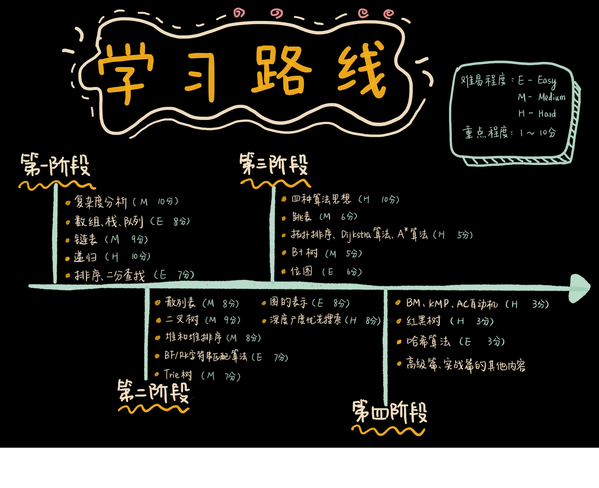

但是，我发现，很多同学还是没能坚持下来，久而久之对学习算法失去了信心。

回想起来，写专栏之初，我就立下 Flag，要做一个跟国内外经典书籍不一样、可以长期影响一些人的专栏。所以，在专栏完结 9 个月后，我想再做一些事情。

为了带你彻底拿下“数据结构与算法”这座大山，我发起了**“60 天攻克数据结构与算法”打卡行动**，一起登顶！

下面是我为你精心规划的学习计划表：

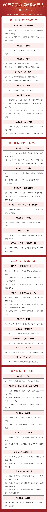

**活动时间**：2019.11.25-2020.1.19

**你将获得**：

\1. 坚持 60 天，与 2000 位优秀的工程师一起，彼此激励，相互学习；

\2. 整个学习周期内，我会进行 2 次高质量的社群分享；

\3. 我会精心整理 4 张知识脑图，为你梳理每个阶段的学习重点，发布在专栏里；

\4. 我和极客时间准备了 20 万奖学金，给坚持下来的同学。

**活动规则**：

在下方申请进入活动打卡群，根据课表打卡，完成学习。

**打卡要求**：

\1. 每个阶段持续 2 周，每周仅需打卡 3 次，即视为完成该阶段的学习。

2.4 个阶段（8 周）的学习，打卡总数仅需 30 次，即视为完成“60 天攻克数据结构与算法行动”。

\3. 为了让大家养成习惯，每日只计 1 次打卡，单日内多次打卡视为 1 次。

**进入打卡群后，完成学习还有如下奖励**：

第一阶段（第 1-2 周）：¥15 奖励金

第二阶段（第 3-4 周）：¥25 奖励金

第三阶段（第 5-6 周）：¥35 奖励金

四个阶段（第 7-8 周）：¥50 奖励金

（注：奖励金会以无门槛优惠券形式、分阶段进行发放，发放时间为每阶段结束后的 7 个工作日内。）

当然，优惠券只是对你的小小奖励。坚持 60 天，与 2000 位优秀的工程师一起，互相学习，彼此激励，彻底拿下数据结构与算法，我奉陪到底。

# 打卡召集令 | 第一阶段知识总结

王争、阿锦 2019-12-09

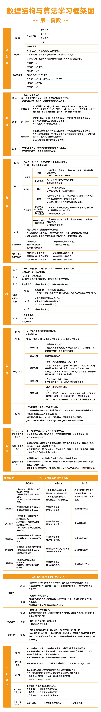

# 打卡召集令 | 第二阶段知识总结

王争、阿锦 2019-12-23

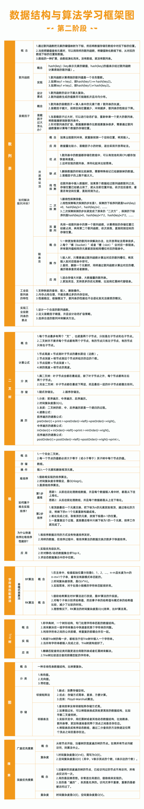

# 打卡召集令 | 第三阶段知识总结

王争、阿锦 2020-01-06

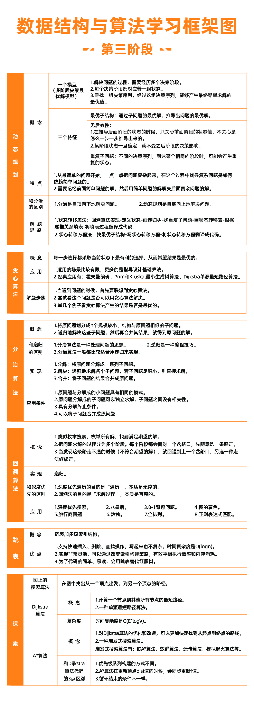

# 打卡召集令 | 第四阶段知识总结

王争、阿锦 2020-01-20

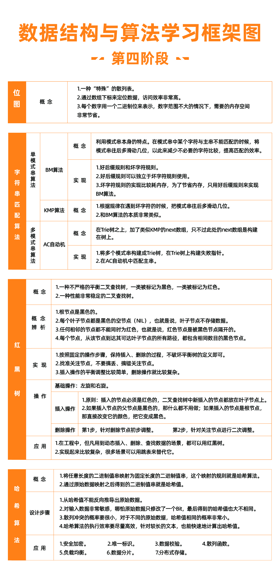